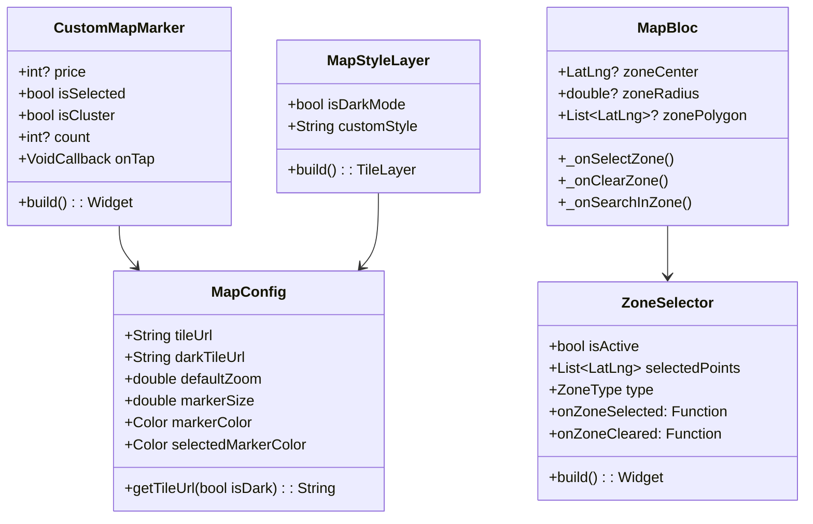
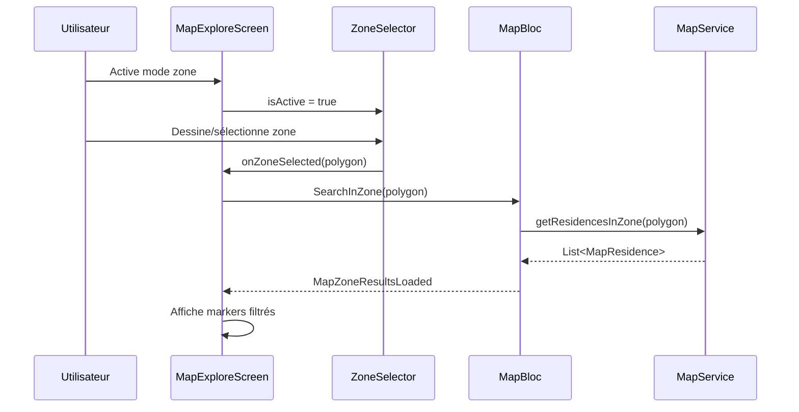

# Architecture : Amélioration de la Map

## 1. Vue d'ensemble

### Objectif
Moderniser les deux maps de l'application avec un design épuré et ajouter la recherche par zone.

### État actuel vs Cible

| Aspect | Actuel | Cible |
|--------|--------|-------|
| Tuiles carte | OSM standard (coloré) | Mapbox/Stadia (épuré, dark mode) |
| Markers | Cercles basiques | Markers personnalisés avec prix |
| Couleurs | Trop de couleurs | Palette limitée (2-3 couleurs) |
| Géoloc | Fonctionnelle | Améliorer UX (bouton + animation) |
| Recherche zone | Absente | Dessiner ou sélectionner une zone |

### Composants impactés

| Type | Fichier | Action |
|------|---------|--------|
| Config | `map_config.dart` | **NOUVEAU** - Configuration centralisée |
| Widget | `custom_map_marker.dart` | **NOUVEAU** - Marker moderne |
| Widget | `zone_selector.dart` | **NOUVEAU** - Sélection de zone |
| Widget | `map_style_layer.dart` | **NOUVEAU** - Tuiles stylisées |
| Screen | `map_explore_screen.dart` | MODIFIER - Intégrer nouveaux widgets |
| Widget | `residence_map_section.dart` | MODIFIER - Nouveau style |
| Bloc | `map_bloc.dart` | MODIFIER - Ajouter événements zone |
| Bloc | `map_event.dart` | MODIFIER - Nouveaux événements |
| Bloc | `map_state.dart` | MODIFIER - Nouveaux états |

## 2. Diagramme de Classes



## 3. Diagramme de Séquence - Recherche par Zone



## 4. Structure des Fichiers

```
lib/
├── config/
│   └── map_config.dart              ← NOUVEAU (configuration map)
├── widget/
│   └── map/
│       ├── custom_map_marker.dart   ← NOUVEAU (marker moderne)
│       ├── zone_selector.dart       ← NOUVEAU (sélection zone)
│       ├── map_style_layer.dart     ← NOUVEAU (tuiles stylisées)
│       └── location_button.dart     ← NOUVEAU (bouton géoloc amélioré)
├── bloc/
│   └── map_bloc/
│       ├── map_bloc.dart            ← MODIFIER (+ zone logic)
│       ├── map_event.dart           ← MODIFIER (+ zone events)
│       └── map_state.dart           ← MODIFIER (+ zone states)
├── screen/
│   └── client/locataire/map/
│       └── map_explore_screen.dart  ← MODIFIER (intégrer widgets)
└── widget/
    └── residence/
        └── residence_map_section.dart ← MODIFIER (nouveau style)
```

## 5. Spécifications Détaillées

### 5.1 MapConfig - Configuration centralisée

```dart
class MapConfig {
  // Tuiles Stadia Maps (gratuit, dark mode disponible)
  static const String lightTileUrl =
    'https://tiles.stadiamaps.com/tiles/alidade_smooth/{z}/{x}/{y}{r}.png';
  static const String darkTileUrl =
    'https://tiles.stadiamaps.com/tiles/alidade_smooth_dark/{z}/{x}/{y}{r}.png';

  // Couleurs épurées
  static const Color markerColor = Color(0xFF2D2D2D);      // Gris foncé
  static const Color markerPriceColor = Color(0xFFFFFFFF); // Blanc
  static const Color selectedColor = Color(0xFFFFA02A);    // Orange (accent)
  static const Color zoneColor = Color(0x33FFA02A);        // Orange transparent

  // Dimensions
  static const double markerWidth = 80.0;
  static const double markerHeight = 36.0;
  static const double clusterSize = 50.0;
}
```

### 5.2 CustomMapMarker - Marker moderne

Design inspiré Airbnb/Booking :
- Forme : Bulle avec flèche vers le bas
- Contenu : Prix formaté (ex: "25K")
- États : Normal (gris foncé), Sélectionné (orange)

```dart
class CustomMapMarker extends StatelessWidget {
  final int? price;
  final bool isSelected;
  final bool isCluster;
  final int? clusterCount;
  final VoidCallback? onTap;

  // Affiche le prix formaté ou le nombre d'éléments
  String get displayText {
    if (isCluster) return '$clusterCount';
    if (price == null) return '?';
    if (price! >= 1000000) return '${(price! / 1000000).toStringAsFixed(1)}M';
    if (price! >= 1000) return '${(price! / 1000).toInt()}K';
    return '$price';
  }
}
```

### 5.3 ZoneSelector - Recherche par zone

Deux modes de sélection :
1. **Cercle** : Tap pour centre + drag pour rayon
2. **Polygone** : Taps multiples pour dessiner

```dart
enum ZoneType { circle, polygon }

class ZoneSelector extends StatefulWidget {
  final bool isActive;
  final ZoneType type;
  final Function(List<LatLng> points, double? radius)? onZoneSelected;
  final VoidCallback? onZoneCleared;
}
```

### 5.4 MapBloc - Nouveaux événements

```dart
// Nouveaux événements
class SelectZone extends MapEvent {
  final List<LatLng> points;
  final double? radius; // Pour cercle
}

class ClearZone extends MapEvent {}

class SearchInZone extends MapEvent {
  final List<LatLng> polygon;
  // ou
  final LatLng? center;
  final double? radius;
}

// Nouveaux états
class MapZoneSelected extends MapState {
  final List<LatLng> zonePoints;
  final double? zoneRadius;
}

class MapZoneResultsLoaded extends MapState {
  final List<MapResidence> residences;
  final List<LatLng> zonePoints;
}
```

## 6. Design Visuel

### 6.1 Palette de couleurs (épurée)

| Élément | Couleur | Hex |
|---------|---------|-----|
| Fond carte (dark) | Gris très foncé | `#1A1A2E` |
| Marker normal | Gris foncé | `#2D2D2D` |
| Marker texte | Blanc | `#FFFFFF` |
| Marker sélectionné | Orange | `#FFA02A` |
| Zone sélection | Orange 20% | `#33FFA02A` |
| Position actuelle | Bleu | `#4A90D9` |

### 6.2 Marker Design

```
    ┌─────────────┐
    │   25K FCFA  │  ← Fond gris foncé, texte blanc
    └──────┬──────┘
           ▼         ← Flèche pointant vers la position
```

Sélectionné :
```
    ┌─────────────┐
    │   25K FCFA  │  ← Fond orange, texte blanc
    └──────┬──────┘
           ▼
```

## 7. Plan d'Implémentation

| Ordre | Fichier | Action | Priorité |
|-------|---------|--------|----------|
| 1 | `map_config.dart` | Créer config centralisée | Haute |
| 2 | `custom_map_marker.dart` | Créer marker moderne | Haute |
| 3 | `map_style_layer.dart` | Intégrer tuiles Stadia | Haute |
| 4 | `residence_map_section.dart` | Appliquer nouveau style | Haute |
| 5 | `map_explore_screen.dart` | Intégrer markers + style | Haute |
| 6 | `location_button.dart` | Bouton géoloc amélioré | Moyenne |
| 7 | `zone_selector.dart` | Créer sélecteur zone | Moyenne |
| 8 | `map_event.dart` | Ajouter événements zone | Moyenne |
| 9 | `map_state.dart` | Ajouter états zone | Moyenne |
| 10 | `map_bloc.dart` | Implémenter logique zone | Moyenne |
| 11 | `map_explore_screen.dart` | Intégrer recherche zone | Moyenne |

**Estimation : ~400 lignes de code**

## 8. Dépendances

Aucune nouvelle dépendance requise. Utilisation de :
- `flutter_map` (déjà présent)
- `latlong2` (déjà présent)
- `geolocator` (déjà présent)

Les tuiles Stadia Maps sont gratuites pour un usage raisonnable.

---

## Validation

```
╔════════════════════════════════════════════════════════════╗
║  ✋ VALIDATION REQUISE                                      ║
╠════════════════════════════════════════════════════════════╣
║                                                             ║
║  L'architecture ci-dessus est-elle correcte ?              ║
║                                                             ║
║  Points clés :                                              ║
║  • Tuiles Stadia Maps (dark mode, épuré)                   ║
║  • Markers style Airbnb (bulle avec prix)                  ║
║  • Palette 3 couleurs (gris, blanc, orange)                ║
║  • Recherche par zone (cercle ou polygone)                 ║
║  • Bouton géolocalisation amélioré                         ║
║                                                             ║
║  Répondez :                                                 ║
║  • "oui" → Continuer vers UI/UX                            ║
║  • "non" + feedback → Je révise                            ║
║                                                             ║
╚════════════════════════════════════════════════════════════╝
```
