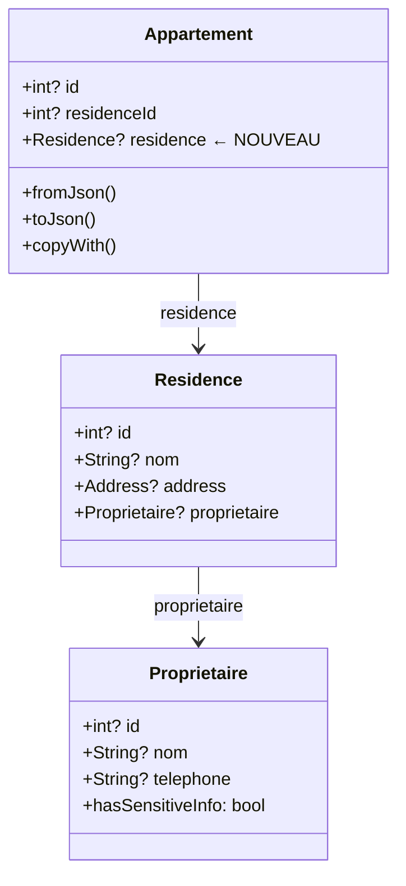
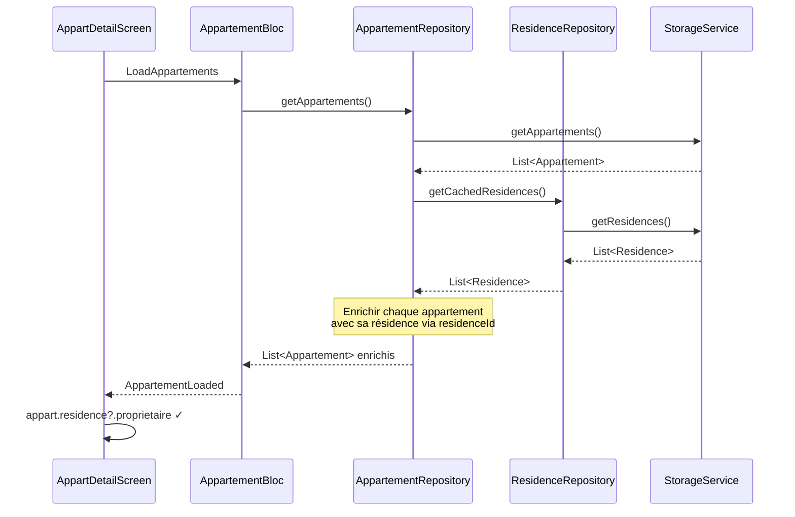

# Architecture : Enrichissement Appartement avec Residence

## 1. Vue d'ensemble

### Objectif
Ajouter le champ `Residence? residence` au modèle `Appartement` et enrichir automatiquement les appartements avec leur résidence lors du chargement.

### Problème actuel
- `Appartement` a seulement `residenceId` (int)
- `AppartProprioInfo` tente d'accéder à `appart.residence?.proprietaire` qui n'existe pas
- Impossibilité d'afficher les infos du propriétaire via l'appartement

### Solution
Enrichissement côté client : le `AppartementRepository` enrichit les appartements avec les résidences déjà disponibles dans le cache `ResidenceRepository`.

### Composants impactés
| Fichier | Action |
|---------|--------|
| `lib/model/residence/appart.dart` | Ajouter champ `Residence? residence` |
| `lib/service/repository/appartement_repository.dart` | Enrichir avec résidence |

## 2. Diagramme de Classes



## 3. Diagramme de Séquence



## 4. Modifications Détaillées

### 4.1 Modèle Appartement (`lib/model/residence/appart.dart`)

```dart
// AJOUTER import
import 'package:asfar/model/residence/residence.dart';

class Appartement {
  // ... champs existants ...
  int? residenceId;

  // NOUVEAU CHAMP
  Residence? residence;

  // MODIFIER constructeur
  Appartement({
    // ... params existants ...
    this.residenceId,
    this.residence,  // NOUVEAU
  });

  // MODIFIER fromJson - Parser residence si présente dans JSON
  Appartement.fromJson(Map<String, dynamic> json) {
    // ... existant ...
    residenceId = json['residenceId'];
    residence = json['residence'] != null
        ? Residence.fromJson(json['residence'])
        : null;
  }

  // MODIFIER copyWith
  Appartement copyWith({
    // ... params existants ...
    int? residenceId,
    Residence? residence,
  }) {
    return Appartement(
      // ... existants ...
      residenceId: residenceId ?? this.residenceId,
      residence: residence ?? this.residence,
    );
  }

  // NOTE: Ne PAS modifier toJson() - on n'envoie pas residence au serveur
}
```

### 4.2 Repository Appartement (`lib/service/repository/appartement_repository.dart`)

```dart
// AJOUTER import
import 'package:asfar/service/repository/residence_repository.dart';

class AppartementRepository {
  // ... existant ...

  // AJOUTER référence au ResidenceRepository
  final ResidenceRepository _residenceRepository = ResidenceRepository();

  // NOUVELLE MÉTHODE : Enrichir les appartements avec leur résidence
  List<Appartement> _enrichWithResidences(List<Appartement> appartements) {
    final residences = _residenceRepository.getCachedResidences();
    if (residences.isEmpty) return appartements;

    // Créer un map pour lookup rapide
    final residenceMap = {for (var r in residences) r.id: r};

    return appartements.map((appart) {
      if (appart.residenceId != null && residenceMap.containsKey(appart.residenceId)) {
        return appart.copyWith(residence: residenceMap[appart.residenceId]);
      }
      return appart;
    }).toList();
  }

  // MODIFIER getCachedAppartements
  List<Appartement> getCachedAppartements() {
    try {
      final appartementsData = _storage.getAppartements();
      if (appartementsData.isEmpty) return [];

      final appartements = appartementsData
          .map((json) => Appartement.fromJson(json))
          .toList();

      // NOUVEAU : Enrichir avec les résidences
      return _enrichWithResidences(appartements);
    } catch (e) {
      deboger(['[AppartementRepository] Erreur getCachedAppartements: $e']);
      return [];
    }
  }

  // MODIFIER fetchAndCacheAppartements
  Future<List<Appartement>> fetchAndCacheAppartements() async {
    try {
      final appartements = await _apiService.getProprietaireAppartements();

      // Sauvegarder dans le cache
      final appartementsJson = appartements.map((a) => a.toJson()).toList();
      await _storage.saveAppartements(appartementsJson);

      deboger(['[AppartementRepository] ${appartements.length} appartements mis en cache']);

      // NOUVEAU : Enrichir avec les résidences
      return _enrichWithResidences(appartements);
    } catch (e) {
      deboger(['[AppartementRepository] Erreur fetchAndCacheAppartements: $e']);
      rethrow;
    }
  }
}
```

## 5. Points d'Attention

### Dépendance entre caches
- Les résidences DOIVENT être chargées AVANT les appartements
- Si le cache des résidences est vide, les appartements ne seront pas enrichis
- Le `PreloadService` charge déjà les résidences en premier

### Pas de modification du JSON envoyé au serveur
- `toJson()` ne doit PAS inclure `residence` (dépendance circulaire)
- Seul `residenceId` est envoyé au serveur

### Compatibilité
- Si le serveur envoie `residence` dans le JSON, il sera parsé
- Sinon, l'enrichissement côté client prend le relais

## 6. Fichiers à Modifier

| Fichier | Lignes | Action |
|---------|--------|--------|
| `lib/model/residence/appart.dart` | +15 | Ajouter champ + modifier fromJson/copyWith |
| `lib/service/repository/appartement_repository.dart` | +25 | Ajouter enrichissement |

**Total : ~40 lignes de code**

---

## Validation

```
╔════════════════════════════════════════════════════════════╗
║  ✋ VALIDATION REQUISE                                      ║
╠════════════════════════════════════════════════════════════╣
║                                                             ║
║  L'architecture ci-dessus est-elle correcte ?              ║
║                                                             ║
║  Répondez :                                                 ║
║  • "oui" ou "valider" → Continuer vers développement       ║
║  • "non" + feedback → Je révise l'architecture             ║
║                                                             ║
╚════════════════════════════════════════════════════════════╝
```
