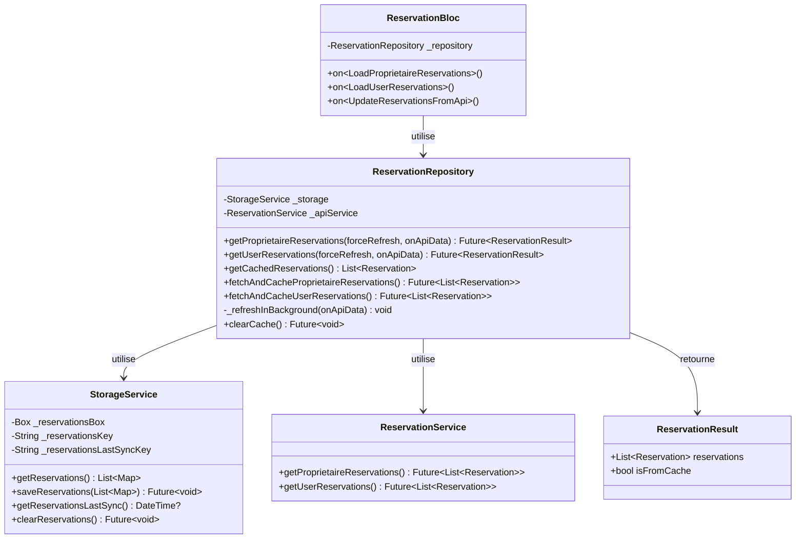
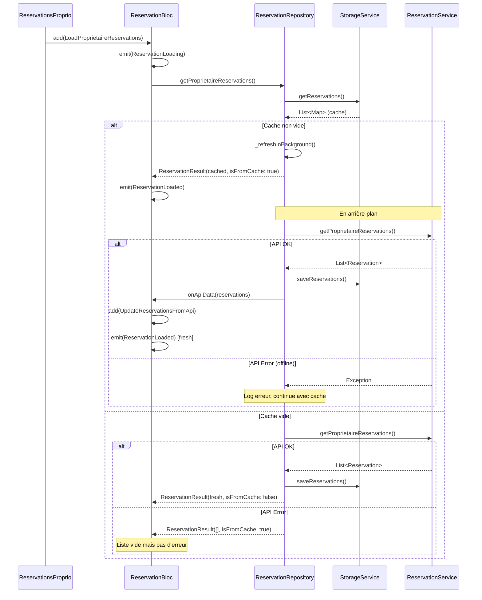

# Architecture : Cache Offline pour les Reservations

## 1. Vue d'ensemble

### Objectif
Implémenter un système de cache local (Hive) pour les réservations du propriétaire, permettant l'affichage des données en mode offline avec le même pattern cache-first utilisé pour les résidences et appartements.

### Composants impactés
| Fichier | Action | Description |
|---------|--------|-------------|
| `storage_service.dart` | Modifier | Ajouter la box `reservationsBox` |
| `reservation_repository.dart` | Créer | Nouveau repository avec pattern cache-first |
| `reservation_bloc.dart` | Modifier | Utiliser le repository au lieu du service direct |
| `reservation_preload_executor.dart` | Modifier | Adapter pour le nouveau pattern |

### Nouvelles entités
- `ReservationRepository` : Repository avec cache-first pattern
- `ReservationResult` : Wrapper pour indiquer la source (cache/API)

---

## 2. Diagramme de Classes



---

## 3. Diagramme de Sequence

### Chargement avec cache disponible (mode offline OK)



---

## 4. Structure des Fichiers

```
lib/
├── service/
│   ├── repository/
│   │   ├── residence_repository.dart      (existant - référence)
│   │   ├── appartement_repository.dart    (existant - référence)
│   │   └── reservation_repository.dart    ⬅️ NOUVEAU
│   │
│   ├── storage/
│   │   └── storage_service.dart           ⬅️ MODIFIER
│   │
│   └── model/booking/
│       └── reservation_service.dart       (existant - pas de modif)
│
├── bloc/
│   └── reservation_bloc/
│       ├── reservation_bloc.dart          ⬅️ MODIFIER
│       ├── reservation_event.dart         ⬅️ MODIFIER (nouvel event)
│       └── reservation_state.dart         (existant - pas de modif)
│
└── service/preload/executors/
    └── reservation_preload_executor.dart  ⬅️ MODIFIER
```

---

## 5. Interfaces/Contrats

### 5.1 StorageService - Nouvelles méthodes

```dart
// Constantes à ajouter
static const String _reservationsBoxName = 'reservationsBox';
static const String _reservationsKey = 'reservations';
static const String _reservationsLastSyncKey = 'reservations_last_sync';

// Box à ajouter
late Box _reservationsBox;

// Méthodes à ajouter
List<Map<String, dynamic>> getReservations();
Future<void> saveReservations(List<Map<String, dynamic>> reservations);
DateTime? getReservationsLastSync();
Future<void> clearReservations();
```

### 5.2 ReservationResult

```dart
/// Résultat du chargement des réservations avec indication de la source
class ReservationResult {
  final List<Reservation> reservations;
  final bool isFromCache;

  ReservationResult({required this.reservations, required this.isFromCache});
}
```

### 5.3 ReservationRepository

```dart
/// Repository pour les réservations - gère le cache Hive et les appels API
///
/// Pattern cache-first :
/// 1. Retourne les données du cache immédiatement
/// 2. Rafraîchit depuis l'API en arrière-plan
/// 3. Met à jour le cache avec les nouvelles données
class ReservationRepository {
  // Singleton
  static final ReservationRepository _instance = ReservationRepository._internal();
  factory ReservationRepository() => _instance;

  // Services
  final StorageService _storage = StorageService.instance;
  final ReservationService _apiService = ReservationService();

  /// Récupère les réservations du propriétaire avec cache-first
  Future<ReservationResult> getProprietaireReservations({
    bool forceRefresh = false,
    Function(List<Reservation>)? onApiData,
  });

  /// Récupère les réservations de l'utilisateur avec cache-first
  Future<ReservationResult> getUserReservations({
    bool forceRefresh = false,
    Function(List<Reservation>)? onApiData,
  });

  /// Récupère les réservations depuis le cache local
  List<Reservation> getCachedReservations();

  /// Vide le cache des réservations
  Future<void> clearCache();
}
```

### 5.4 Nouvel Event ReservationBloc

```dart
/// Met à jour l'état avec les données fraîches de l'API
class UpdateReservationsFromApi extends ReservationEvent {
  final List<Reservation> reservations;
  UpdateReservationsFromApi(this.reservations);
}
```

---

## 6. Plan d'Implementation

### Etape 1 : StorageService
1. Ajouter les constantes pour reservationsBox
2. Ajouter la box `_reservationsBox`
3. Ouvrir la box dans `init()`
4. Implémenter les 4 méthodes CRUD
5. Ajouter `clearReservations()` dans `clear()` et `clearProprioData()`

### Etape 2 : ReservationRepository
1. Créer le fichier `lib/service/repository/reservation_repository.dart`
2. Implémenter le pattern Singleton
3. Implémenter `getCachedReservations()`
4. Implémenter `fetchAndCacheProprietaireReservations()`
5. Implémenter `fetchAndCacheUserReservations()`
6. Implémenter `getProprietaireReservations()` avec cache-first
7. Implémenter `getUserReservations()` avec cache-first
8. Implémenter `_refreshInBackground()`

### Etape 3 : ReservationBloc
1. Ajouter import du repository
2. Ajouter l'instance `_repository`
3. Ajouter le handler `on<UpdateReservationsFromApi>`
4. Modifier `_onLoadProprietaireReservations` pour utiliser le repository
5. Modifier `_onLoadUserReservations` pour utiliser le repository
6. Ajouter l'event `UpdateReservationsFromApi` dans `reservation_event.dart`

### Etape 4 : ReservationPreloadExecutor
1. Aucune modification nécessaire (il déclenche déjà les bons events)

---

## 7. Gestion du Mode Offline

### Comportement attendu

| Situation | Cache | Serveur | Résultat |
|-----------|-------|---------|----------|
| Premier lancement | Vide | ON | Charge depuis API, sauvegarde cache |
| Premier lancement | Vide | OFF | Liste vide, pas d'erreur |
| Utilisation normale | Rempli | ON | Affiche cache, rafraîchit en arrière-plan |
| Mode offline | Rempli | OFF | Affiche cache, log erreur silencieux |
| Refresh manuel | Rempli | OFF | Affiche cache avec indicateur "isFromCache" |

### Difference avec l'ancien comportement

**Avant :**
```dart
// API échoue → Erreur affichée
on DioException catch (e) {
  emit(ReservationError("Erreur de récupération des réservations"));
}
```

**Après :**
```dart
// API échoue → Retourne cache (même vide)
catch (e) {
  final cached = getCachedReservations();
  return ReservationResult(reservations: cached, isFromCache: true);
}
```

---

## 8. Tests a Effectuer

1. **Serveur ON, cache vide** → Doit charger depuis API et sauvegarder
2. **Serveur OFF, cache vide** → Doit afficher liste vide (pas d'erreur)
3. **Serveur ON, cache rempli** → Doit afficher cache puis rafraîchir
4. **Serveur OFF, cache rempli** → Doit afficher cache
5. **Refresh manuel offline** → Doit garder le cache actuel

---

## 9. Risques et Mitigation

| Risque | Impact | Mitigation |
|--------|--------|------------|
| Désérialisation échoue | Cache corrompu | Try-catch + retourne liste vide |
| Données obsolètes | UX dégradée | Indicateur "isFromCache" pour afficher un badge |
| Mémoire cache trop grande | Performance | Pas de risque (réservations < résidences) |
