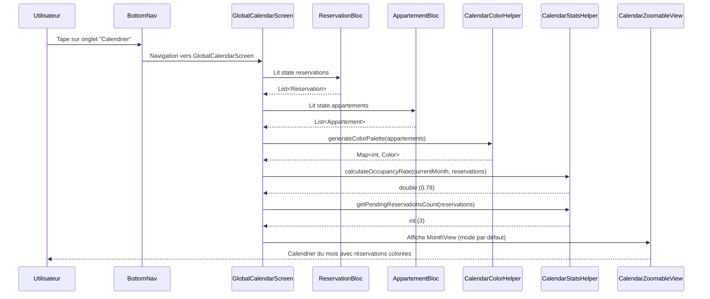
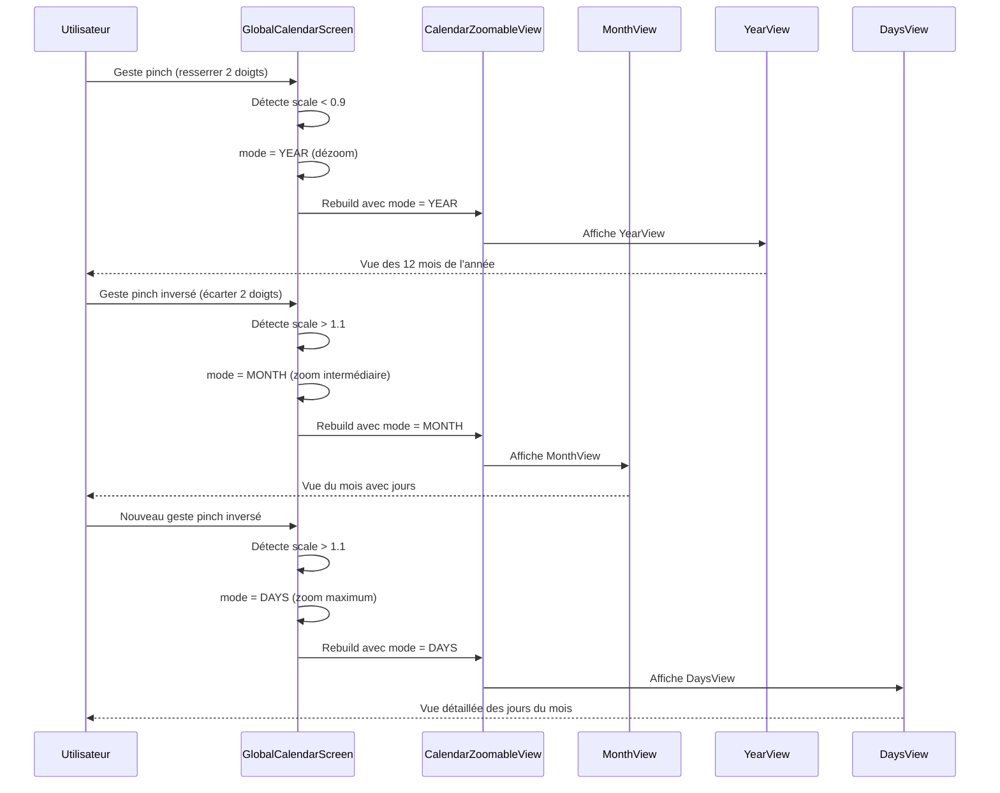
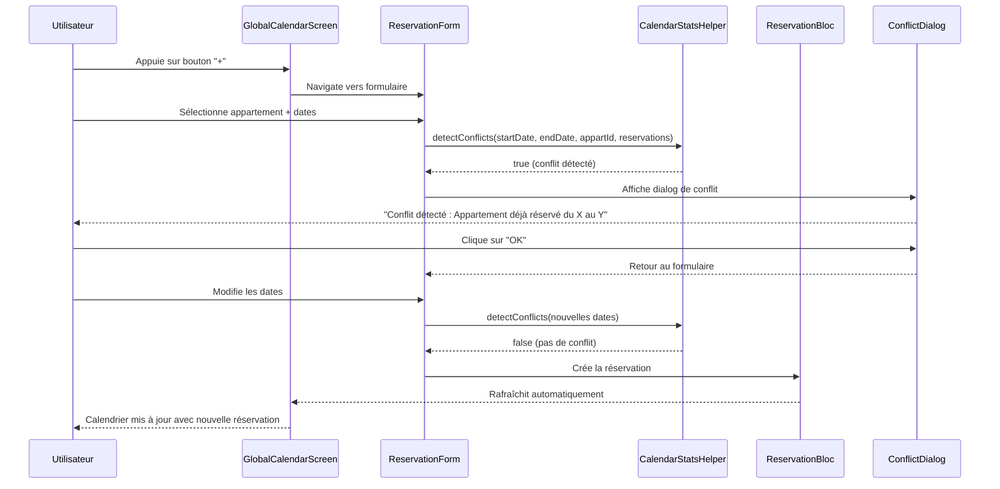

# 🏗️ Architecture - Calendrier Global des Réservations

## 1. Vue d'Ensemble

### 1.1 Objectif
Créer un module de calendrier global accessible depuis la bottom navigation permettant aux propriétaires de visualiser toutes leurs réservations avec 3 niveaux de zoom (Année/Mois/Jours), gestion par pinch-to-zoom, code couleur par appartement, et actions rapides (consulter, créer, confirmer).

### 1.2 Composants Impactés
- **Bottom Navigation** : Ajout d'un nouvel onglet "Calendrier"
- **Nouveau module** : Screen + widgets dédiés au calendrier global
- **BLoC existant** : Réutilisation de `ReservationBloc`, `AppartementBloc`, `ResidenceBloc`
- **Helpers** : Nouveau helper pour génération de couleurs uniques

### 1.3 Nouvelles Entités
- **CalendarViewMode** : Enum (year, month, days)
- **CalendarColorPalette** : Map<int appartementId, Color>
- **CalendarStats** : Modèle pour taux d'occupation, arrivées/départs

## 2. Diagramme de Classes

```mermaid
classDiagram
    class CalendarViewMode {
        <<enumeration>>
        YEAR
        MONTH
        DAYS
    }

    class GlobalCalendarScreen {
        +BuildContext context
        +build() Widget
        -_onPinchGesture(ScaleUpdateDetails) void
        -_zoomIn() void
        -_zoomOut() void
        -_goToToday() void
    }

    class CalendarHeader {
        +CalendarViewMode mode
        +DateTime currentDate
        +int pendingCount
        +double occupancyRate
        +VoidCallback onTodayPressed
        +build() Widget
    }

    class CalendarZoomableView {
        +CalendarViewMode mode
        +List~Reservation~ reservations
        +List~Appartement~ appartements
        +Map~int,Color~ colorPalette
        +Function(DateTime) onDateTapped
        +Function(Reservation) onReservationTapped
        +build() Widget
    }

    class YearView {
        +int year
        +List~Reservation~ reservations
        +Map~int,Color~ colorPalette
        +Function(int month) onMonthTapped
        +build() Widget
    }

    class MonthView {
        +DateTime month
        +List~Reservation~ reservations
        +Map~int,Color~ colorPalette
        +Function(DateTime) onDayTapped
        +build() Widget
    }

    class DaysView {
        +DateTime month
        +List~Reservation~ reservations
        +List~Appartement~ appartements
        +Map~int,Color~ colorPalette
        +Function(Reservation) onReservationTapped
        +build() Widget
    }

    class CalendarLegend {
        +List~Appartement~ appartements
        +Map~int,Color~ colorPalette
        +build() Widget
    }

    class CalendarColorHelper {
        +generateColorPalette(List~Appartement~) Map~int,Color~
        +getColorForAppartement(int id, Map) Color
    }

    class CalendarStatsHelper {
        +calculateOccupancyRate(DateTime, List~Reservation~) double
        +getArrivalsForDate(DateTime, List~Reservation~) List~Reservation~
        +getDeparturesForDate(DateTime, List~Reservation~) List~Reservation~
        +getPendingReservationsCount(List~Reservation~) int
        +detectConflicts(DateTime, DateTime, int, List~Reservation~) bool
    }

    class ReservationConflictDialog {
        +List~Reservation~ conflicts
        +DateTime startDate
        +DateTime endDate
        +build() Widget
    }

    GlobalCalendarScreen --> CalendarHeader
    GlobalCalendarScreen --> CalendarZoomableView
    GlobalCalendarScreen --> CalendarLegend
    GlobalCalendarScreen --> ReservationBloc : écoute
    GlobalCalendarScreen --> AppartementBloc : écoute

    CalendarZoomableView --> YearView
    CalendarZoomableView --> MonthView
    CalendarZoomableView --> DaysView

    GlobalCalendarScreen ..> CalendarColorHelper : utilise
    GlobalCalendarScreen ..> CalendarStatsHelper : utilise
    GlobalCalendarScreen ..> ReservationConflictDialog : affiche si conflit

    CalendarZoomableView ..> CalendarViewMode : utilise
```



## 3. Diagramme de Séquence

### 3.1 Flux Principal : Consultation du Calendrier



### 3.2 Flux Zoom : Pinch-to-Zoom



### 3.3 Flux Création : Nouvelle Réservation avec Détection de Conflit



## 4. Structure des Fichiers

```
lib/
├── screen/
│   └── client/
│       └── proprio/
│           ├── calendrier/                          # NOUVEAU MODULE
│           │   ├── global_calendar_screen.dart      # Écran principal
│           │   └── widget/                          # Widgets du calendrier
│           │       ├── calendar_header.dart         # En-tête (taux, badge, bouton Today)
│           │       ├── calendar_zoomable_view.dart  # Vue zoomable (dispatch year/month/days)
│           │       ├── year_view.dart               # Vue année (12 mois)
│           │       ├── month_view.dart              # Vue mois (grille de jours)
│           │       ├── days_view.dart               # Vue jours (détail du mois)
│           │       ├── calendar_legend.dart         # Légende des couleurs
│           │       ├── calendar_day_cell.dart       # Cellule de jour (réutilisable)
│           │       ├── calendar_month_cell.dart     # Cellule de mois (pour vue année)
│           │       ├── reservation_bar.dart         # Barre de réservation (timeline)
│           │       └── calendar_indicators.dart     # Indicateurs arrivées/départs
│           │
│           └── proprio_navigation.dart              # MODIFIÉ : Ajout onglet Calendrier
│
├── util/
│   └── helper/
│       ├── calendar_color_helper.dart               # NOUVEAU : Génération couleurs
│       └── calendar_stats_helper.dart               # NOUVEAU : Calculs stats
│
├── model/
│   └── calendar/                                    # NOUVEAU : Modèles calendrier
│       ├── calendar_view_mode.dart                  # Enum (year/month/days)
│       └── calendar_stats.dart                      # Stats (taux, arrivées, départs)
│
└── widget/
    └── dialog/
        └── reservation_conflict_dialog.dart         # NOUVEAU : Dialog de conflit
```

## 5. Interfaces et Contrats

### 5.1 CalendarViewMode (Enum)

```dart
/// Mode de vue du calendrier
enum CalendarViewMode {
  /// Vue année : affiche les 12 mois
  year,

  /// Vue mois : affiche la grille de jours du mois
  month,

  /// Vue jours : affiche le détail des jours avec timeline
  days,
}

extension CalendarViewModeExtension on CalendarViewMode {
  /// Retourne true si on peut zoomer davantage
  bool get canZoomIn {
    return this != CalendarViewMode.days;
  }

  /// Retourne true si on peut dézoomer
  bool get canZoomOut {
    return this != CalendarViewMode.year;
  }

  /// Retourne le prochain niveau de zoom
  CalendarViewMode? get nextZoomLevel {
    switch (this) {
      case CalendarViewMode.year:
        return CalendarViewMode.month;
      case CalendarViewMode.month:
        return CalendarViewMode.days;
      case CalendarViewMode.days:
        return null;
    }
  }

  /// Retourne le niveau de dézoom précédent
  CalendarViewMode? get previousZoomLevel {
    switch (this) {
      case CalendarViewMode.days:
        return CalendarViewMode.month;
      case CalendarViewMode.month:
        return CalendarViewMode.year;
      case CalendarViewMode.year:
        return null;
    }
  }
}
```

### 5.2 CalendarStats (Modèle)

```dart
/// Statistiques du calendrier pour une période donnée
class CalendarStats {
  /// Taux d'occupation (0.0 à 1.0)
  final double occupancyRate;

  /// Nombre de réservations en attente
  final int pendingCount;

  /// Réservations avec arrivée aujourd'hui
  final List<Reservation> arrivalsToday;

  /// Réservations avec départ aujourd'hui
  final List<Reservation> departuresToday;

  const CalendarStats({
    required this.occupancyRate,
    required this.pendingCount,
    required this.arrivalsToday,
    required this.departuresToday,
  });

  /// Formate le taux d'occupation en pourcentage
  String get occupancyPercentage => '${(occupancyRate * 100).toStringAsFixed(0)}%';
}
```

### 5.3 CalendarColorHelper (Contrat)

```dart
/// Helper pour générer et gérer les couleurs des appartements
class CalendarColorHelper {
  /// Palette de couleurs prédéfinies (20 couleurs distinctes)
  static const List<Color> _colorPalette = [
    Color(0xFFE57373), // Rouge clair
    Color(0xFF81C784), // Vert clair
    Color(0xFF64B5F6), // Bleu clair
    Color(0xFFFFB74D), // Orange clair
    Color(0xFFBA68C8), // Violet clair
    Color(0xFF4DD0E1), // Cyan clair
    Color(0xFFF06292), // Rose
    Color(0xFF9575CD), // Violet profond
    Color(0xFF4DB6AC), // Teal
    Color(0xFFFFD54F), // Ambre
    // ... 10 autres couleurs
  ];

  /// Génère une palette de couleurs unique pour chaque appartement
  /// Retourne : Map<appartementId, Color>
  static Map<int, Color> generateColorPalette(List<Appartement> appartements) {
    final Map<int, Color> palette = {};
    for (int i = 0; i < appartements.length; i++) {
      final appartement = appartements[i];
      final colorIndex = i % _colorPalette.length;
      palette[appartement.id!] = _colorPalette[colorIndex];
    }
    return palette;
  }

  /// Retourne la couleur pour un appartement donné
  static Color getColorForAppartement(int appartementId, Map<int, Color> palette) {
    return palette[appartementId] ?? Colors.grey;
  }
}
```

### 5.4 CalendarStatsHelper (Contrat)

```dart
/// Helper pour calculer les statistiques du calendrier
class CalendarStatsHelper {
  /// Calcule le taux d'occupation pour une période donnée
  ///
  /// Formule : (nombre de jours occupés / nombre de jours total) * 100
  /// Exclut les réservations annulées
  static double calculateOccupancyRate(
    DateTime startDate,
    DateTime endDate,
    List<Reservation> reservations,
  ) {
    // Implémenter la logique
  }

  /// Retourne les réservations avec arrivée à une date donnée
  static List<Reservation> getArrivalsForDate(
    DateTime date,
    List<Reservation> reservations,
  ) {
    return reservations.where((r) {
      if (r.debut == null) return false;
      final arrivalDate = DateTime(r.debut!.year, r.debut!.month, r.debut!.day);
      final targetDate = DateTime(date.year, date.month, date.day);
      return arrivalDate == targetDate;
    }).toList();
  }

  /// Retourne les réservations avec départ à une date donnée
  static List<Reservation> getDeparturesForDate(
    DateTime date,
    List<Reservation> reservations,
  ) {
    return reservations.where((r) {
      if (r.fin == null) return false;
      final departureDate = DateTime(r.fin!.year, r.fin!.month, r.fin!.day);
      final targetDate = DateTime(date.year, date.month, date.day);
      return departureDate == targetDate;
    }).toList();
  }

  /// Compte le nombre de réservations en attente
  static int getPendingReservationsCount(List<Reservation> reservations) {
    return reservations.where((r) => r.statut == ReservationStatus.attente).length;
  }

  /// Détecte les conflits de dates pour un appartement
  /// Retourne true si conflit détecté
  static bool detectConflicts(
    DateTime startDate,
    DateTime endDate,
    int appartementId,
    List<Reservation> existingReservations,
  ) {
    return existingReservations.any((r) {
      if (r.appart?.id != appartementId) return false;
      if (r.debut == null || r.fin == null) return false;
      if (r.statut == ReservationStatus.annulee) return false;

      // Vérifier chevauchement
      return startDate.isBefore(r.fin!) && endDate.isAfter(r.debut!);
    });
  }

  /// Retourne les réservations en conflit
  static List<Reservation> getConflictingReservations(
    DateTime startDate,
    DateTime endDate,
    int appartementId,
    List<Reservation> existingReservations,
  ) {
    // Implémenter la logique
  }
}
```

## 6. Intégration avec l'Existant

### 6.1 Modification de proprio_navigation.dart

```dart
// AVANT (4 onglets)
List<BottomNavItem> _buildMenu(int alertCount) {
  return [
    BottomNavItem(text: "Home", image: Icons.home),
    BottomNavItem(text: "Compta", image: Icons.analytics_outlined, badgeCount: alertCount),
    BottomNavItem(text: "Résidences", image: Icons.apartment),
    BottomNavItem(text: "Profil", image: Icons.person),
  ];
}

final List<Widget> _pages = [
  ProprioHome(),
  ComptabiliteScreen(),
  MesResidences(),
  ProfileProprio(),
];

// APRÈS (5 onglets)
List<BottomNavItem> _buildMenu(int alertCount, int pendingReservations) {
  return [
    BottomNavItem(text: "Home", image: Icons.home),
    BottomNavItem(
      text: "Calendrier",
      image: Icons.calendar_month,
      badgeCount: pendingReservations, // Badge pour réservations en attente
    ),
    BottomNavItem(text: "Compta", image: Icons.analytics_outlined, badgeCount: alertCount),
    BottomNavItem(text: "Résidences", image: Icons.apartment),
    BottomNavItem(text: "Profil", image: Icons.person),
  ];
}

final List<Widget> _pages = [
  ProprioHome(),
  GlobalCalendarScreen(), // NOUVEAU
  ComptabiliteScreen(),
  MesResidences(),
  ProfileProprio(),
];
```

### 6.2 Écoute des BLoCs

Le `GlobalCalendarScreen` écoutera :
- **ReservationBloc** : Source des réservations (déjà en mémoire)
- **AppartementBloc** : Liste des appartements pour code couleur
- **ResidenceBloc** : (Optionnel) Pour filtrer par résidence

Aucun appel API nécessaire, toutes les données sont déjà chargées en mémoire.

## 7. Gestion des Gestes Pinch-to-Zoom

### 7.1 Détection du Geste

```dart
GestureDetector(
  onScaleUpdate: (ScaleUpdateDetails details) {
    if (details.scale < 0.9) {
      // Dézoom (resserrer 2 doigts)
      _zoomOut();
    } else if (details.scale > 1.1) {
      // Zoom (écarter 2 doigts)
      _zoomIn();
    }
  },
  child: CalendarZoomableView(...),
)
```

### 7.2 Logique de Transition

```dart
void _zoomIn() {
  setState(() {
    if (_viewMode == CalendarViewMode.year) {
      _viewMode = CalendarViewMode.month;
    } else if (_viewMode == CalendarViewMode.month) {
      _viewMode = CalendarViewMode.days;
    }
  });
}

void _zoomOut() {
  setState(() {
    if (_viewMode == CalendarViewMode.days) {
      _viewMode = CalendarViewMode.month;
    } else if (_viewMode == CalendarViewMode.month) {
      _viewMode = CalendarViewMode.year;
    }
  });
}
```

## 8. Règles Métier Implémentées

### RM1 - Affichage des réservations
- Filtre : `reservations.where((r) => r.statut != ReservationStatus.annulee)`

### RM2 - Code couleur
- Génération via `CalendarColorHelper.generateColorPalette(appartements)`
- 20 couleurs distinctes prédéfinies
- Rotation si plus de 20 appartements

### RM3 - Détection de conflits
- Fonction : `CalendarStatsHelper.detectConflicts(...)`
- Vérification avant création de réservation
- Affichage de `ReservationConflictDialog` si conflit

### RM4 - Navigation par niveaux
- 3 niveaux : YEAR → MONTH → DAYS
- Pinch-to-zoom natif (GestureDetector)
- Impossible de descendre sous DAYS

### RM5 - Taux d'occupation
- Calcul via `CalendarStatsHelper.calculateOccupancyRate(...)`
- Affichage dans `CalendarHeader`
- Mis à jour selon le niveau de vue actif

## 9. Performance et Optimisation

### 9.1 Stratégies d'Optimisation

**Pas d'appels API**
- Toutes les données depuis ReservationBloc (mémoire)
- Chargement initial < 500ms garanti

**Lazy Loading**
- `ListView.builder` pour les listes de jours
- `GridView.builder` pour les grilles de mois
- Chargement à la demande (pas tout d'un coup)

**Mémoïsation**
- Palette de couleurs générée 1 seule fois
- Stats calculées uniquement si date change

**Widgets légers**
- Utiliser `const` partout où possible
- Éviter `setState()` global, privilégier widgets locaux

### 9.2 Gestion de 50+ Réservations

- Filtrer par mois/année selon la vue active
- Ne rendre que les éléments visibles
- Pagination virtuelle avec `ListView.builder`

## 10. Accessibilité

### 10.1 Contraste et Couleurs

- Palette respectant WCAG AA (contraste 4.5:1 minimum)
- Texte alternatif pour les couleurs ("Appartement 101 - Bleu")
- Patterns en plus des couleurs (rayures, points) pour daltoniens (v2)

### 10.2 Lecteurs d'Écran

- Semantics sur tous les éléments interactifs
- Labels descriptifs ("Réservation du 15 au 20 janvier, Appartement 101")
- Annonces vocales lors des changements de vue

## 11. Tests à Implémenter

### 11.1 Tests Unitaires

- `CalendarColorHelper.generateColorPalette()`
- `CalendarStatsHelper.calculateOccupancyRate()`
- `CalendarStatsHelper.detectConflicts()`
- Extension `CalendarViewMode` (canZoomIn, nextZoomLevel, etc.)

### 11.2 Tests de Widgets

- `YearView` : Affichage des 12 mois
- `MonthView` : Grille de jours correcte
- `DaysView` : Réservations affichées au bon endroit
- `CalendarHeader` : Stats correctes
- Pinch-to-zoom : Transitions fluides

### 11.3 Tests d'Intégration

- Navigation complète : Year → Month → Days → retour
- Création de réservation avec conflit
- Tap sur réservation → Navigation vers détail
- Rafraîchissement automatique après modification

## 12. Plan d'Implémentation

### Phase 1 : Fondations (Priorité Haute)
1. Créer les modèles (`CalendarViewMode`, `CalendarStats`)
2. Créer les helpers (`CalendarColorHelper`, `CalendarStatsHelper`)
3. Implémenter tests unitaires des helpers

### Phase 2 : Vues de Base (Priorité Haute)
4. Créer `MonthView` (vue par défaut)
5. Créer `CalendarDayCell` (réutilisable)
6. Créer `CalendarHeader` (stats + bouton Today)
7. Créer `CalendarLegend` (couleurs)

### Phase 3 : Écran Principal (Priorité Haute)
8. Créer `GlobalCalendarScreen`
9. Intégrer pinch-to-zoom (GestureDetector)
10. Connecter aux BLoCs (ReservationBloc, AppartementBloc)

### Phase 4 : Vues Additionnelles (Priorité Haute)
11. Créer `YearView`
12. Créer `DaysView` (timeline détaillée)
13. Créer `CalendarZoomableView` (dispatch des vues)

### Phase 5 : Intégration (Priorité Haute)
14. Modifier `proprio_navigation.dart` (ajout onglet)
15. Tester navigation bottom nav
16. Vérifier performance (< 500ms, 60fps)

### Phase 6 : Actions (Priorité Moyenne)
17. Implémenter navigation vers détail réservation
18. Implémenter création de réservation (bouton +)
19. Créer `ReservationConflictDialog`
20. Implémenter détection de conflits

### Phase 7 : Indicateurs (Priorité Moyenne)
21. Créer `CalendarIndicators` (arrivées/départs)
22. Ajouter badge notifications (réservations en attente)
23. Afficher durée de séjour sur réservations

### Phase 8 : Polissage (Priorité Basse)
24. Ajouter animations de transition
25. Optimiser pour 50+ réservations
26. Ajouter tests d'intégration
27. Améliorer accessibilité (Semantics)

## 13. Dépendances

### 13.1 Dépendances Internes (Existantes)
- `ReservationBloc` : Source des réservations
- `AppartementBloc` : Liste des appartements
- `ResidenceBloc` : Liste des résidences (filtres optionnels)
- `Style` : Couleurs et thème
- `TextSeed` : Widget de texte standard
- `pushScreen()` : Navigation

### 13.2 Dépendances Flutter (Déjà Installées)
- `flutter_bloc` : Gestion d'état
- `intl` : Formatage des dates

### 13.3 Nouvelles Dépendances (Si Nécessaire)
- Aucune nouvelle dépendance requise
- Utiliser les widgets natifs de Flutter

## 14. Risques et Mitigations

### 14.1 Performance avec Nombreuses Réservations
**Risque** : Lenteur si 100+ réservations
**Mitigation** : Lazy loading, filtrage par période, pagination virtuelle

### 14.2 Geste Pinch-to-Zoom Complexe
**Risque** : Détection imprécise ou conflits avec scroll
**Mitigation** : Utiliser `GestureDetector` avec seuils clairs (< 0.9, > 1.1)

### 14.3 Génération de Couleurs
**Risque** : Couleurs similaires si 20+ appartements
**Mitigation** : Rotation de la palette, ajouter patterns visuels (v2)

### 14.4 Conflits de Dates
**Risque** : Logique complexe de détection de chevauchement
**Mitigation** : Tests unitaires exhaustifs, helper dédié

## 15. Évolutions Futures (v2)

### 15.1 Fonctionnalités Avancées
- Glisser-déposer pour modifier dates
- Export PDF/iCal du calendrier
- Synchronisation externe (Airbnb, Booking)
- Vue timeline horizontale
- Filtres avancés (par locataire, par statut)

### 15.2 Patterns Visuels
- Rayures, points, motifs pour daltoniens
- Icônes personnalisées par appartement

### 15.3 Notifications
- Push notification pour arrivées/départs du jour
- Rappels de réservations en attente

---

**Date de création** : 2026-02-12
**Version** : 1.0
**Statut** : ✅ Prêt pour validation
