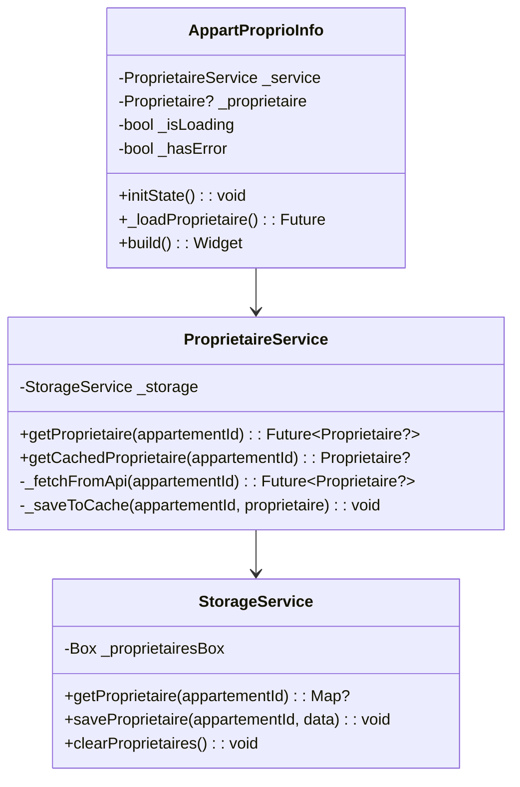
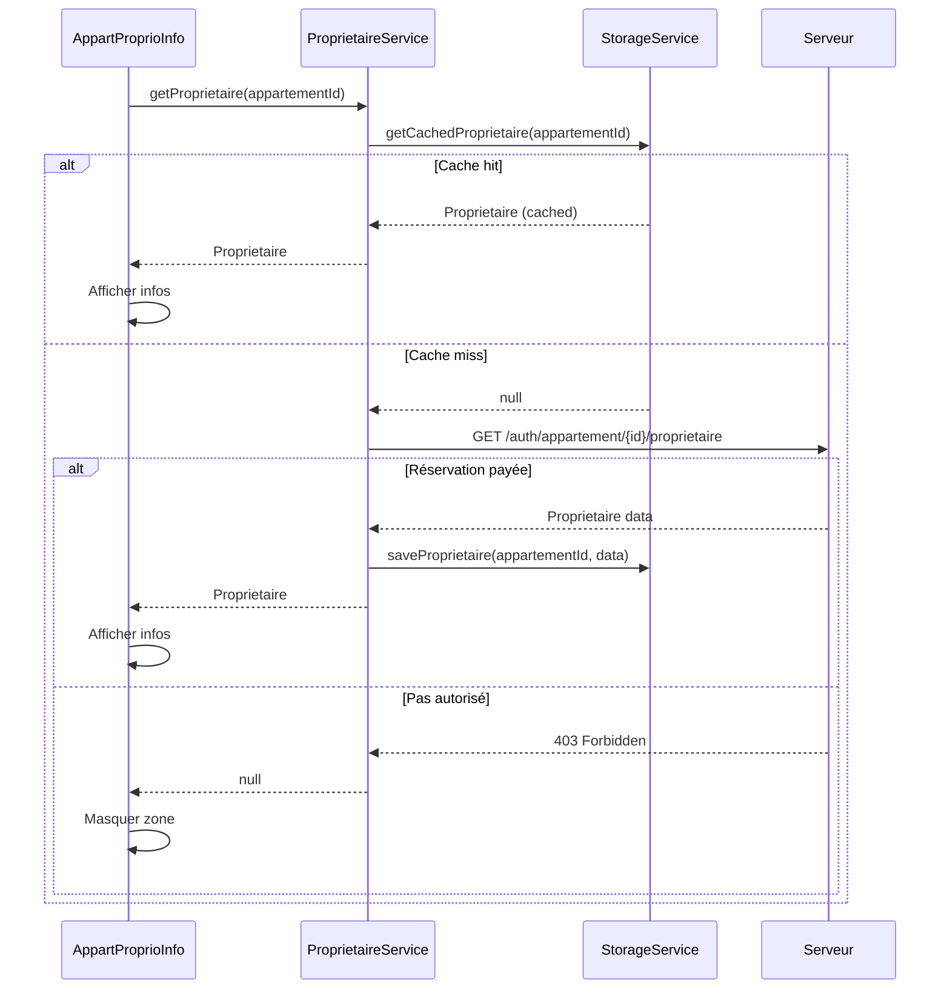

# Architecture : Chargement Actif du Propriétaire

## 1. Vue d'ensemble

### Objectif
Charger les infos du propriétaire à la demande quand un locataire consulte un appartement, avec mise en cache locale persistante.

### Comportement
| Situation | Action |
|-----------|--------|
| Infos en cache | Affichage immédiat |
| Pas en cache + réservation payée | Chargement → affichage → mise en cache |
| Pas en cache + pas de réservation payée | Zone propriétaire masquée |
| Erreur réseau | Zone propriétaire masquée |

### Composants impactés

| Type | Fichier | Action |
|------|---------|--------|
| Storage | `storage_service.dart` | Ajouter cache propriétaires |
| Service | `proprietaire_service.dart` | **NOUVEAU** - API + cache |
| Widget | `appart_proprio_info.dart` | Convertir en StatefulWidget avec chargement |

## 2. Diagramme de Classes



## 3. Diagramme de Séquence



## 4. Structure des Fichiers

```
lib/
├── service/
│   ├── storage/
│   │   └── storage_service.dart        ← MODIFIER (ajouter cache proprio)
│   └── proprietaire/
│       └── proprietaire_service.dart   ← NOUVEAU
└── widget/
    └── item/
        └── appart/
            └── appart_proprio_info.dart ← MODIFIER (StatefulWidget)
```

## 5. Spécifications Détaillées

### 5.1 StorageService - Modifications

```dart
// Nouvelles constantes
static const String _proprietairesBoxName = 'proprietairesBox';
static const String _proprietairesKey = 'proprietaires'; // Map<appartementId, proprietaireJson>

// Nouvelle box
late Box _proprietairesBox;

// Nouvelles méthodes
Map<String, dynamic>? getProprietaire(int appartementId);
Future<void> saveProprietaire(int appartementId, Map<String, dynamic> data);
Future<void> clearProprietaires();
```

### 5.2 ProprietaireService - Nouveau

```dart
class ProprietaireService {
  static final ProprietaireService _instance = ProprietaireService._internal();
  factory ProprietaireService() => _instance;
  ProprietaireService._internal();

  final StorageService _storage = StorageService.instance;

  /// Récupère le propriétaire depuis le cache ou l'API
  /// Retourne null si non autorisé ou erreur
  Future<Proprietaire?> getProprietaire(int appartementId) async {
    // 1. Vérifier le cache
    final cached = getCachedProprietaire(appartementId);
    if (cached != null) return cached;

    // 2. Appeler l'API
    return _fetchFromApi(appartementId);
  }

  /// Récupère depuis le cache uniquement
  Proprietaire? getCachedProprietaire(int appartementId);

  /// Appel API avec gestion 403
  Future<Proprietaire?> _fetchFromApi(int appartementId);
}
```

### 5.3 AppartProprioInfo - Modifications

Convertir de `StatelessWidget` à `StatefulWidget` :

```dart
class AppartProprioInfo extends StatefulWidget {
  const AppartProprioInfo(this.appart, {super.key, this.onMaskedTap});

  final Appartement appart;
  final VoidCallback? onMaskedTap;

  @override
  State<AppartProprioInfo> createState() => _AppartProprioInfoState();
}

class _AppartProprioInfoState extends State<AppartProprioInfo> {
  final ProprietaireService _service = ProprietaireService();

  Proprietaire? _proprietaire;
  bool _isLoading = true;
  bool _hasAccess = true; // false si 403

  @override
  void initState() {
    super.initState();
    _loadProprietaire();
  }

  Future<void> _loadProprietaire() async {
    // 1. Vérifier si déjà présent sur l'appartement
    if (widget.appart.residence?.proprietaire?.hasSensitiveInfo == true) {
      setState(() {
        _proprietaire = widget.appart.residence!.proprietaire;
        _isLoading = false;
      });
      return;
    }

    // 2. Charger depuis le service
    final proprio = await _service.getProprietaire(widget.appart.id!);
    setState(() {
      _proprietaire = proprio;
      _isLoading = false;
      _hasAccess = proprio != null;
    });
  }

  @override
  Widget build(BuildContext context) {
    // Loading
    if (_isLoading) {
      return _buildSkeleton();
    }

    // Pas d'accès (403 ou erreur) → masquer complètement
    if (!_hasAccess || _proprietaire == null) {
      return SizedBox.shrink(); // Zone disparaît
    }

    // Afficher les infos
    return _buildOwnerInfo(context, _proprietaire!);
  }
}
```

## 6. Endpoint Serveur Requis

### Endpoint
```
GET /auth/appartement/{appartementId}/proprietaire
```

### Headers
```
Authorization: Bearer {token}
```

### Réponses

**200 OK** (Réservation payée existe)
```json
{
  "id": 123,
  "nom": "Kouassi",
  "prenom": "Jean",
  "telephone": "+225 07 00 00 00",
  "email": "jean@example.com",
  "imgUrl": "https://..."
}
```

**403 Forbidden** (Pas de réservation payée)
```json
{
  "error": "UNAUTHORIZED",
  "message": "Réservation payée requise pour accéder aux informations"
}
```

## 7. Gestion du Cache

### Clé de cache
```
proprietaires_{appartementId}
```

### Structure stockée
```json
{
  "123": {
    "id": 456,
    "nom": "Kouassi",
    "prenom": "Jean",
    "telephone": "+225 07 00 00 00",
    "imgUrl": "..."
  },
  "789": { ... }
}
```

### Invalidation
- Au logout : `clearProprietaires()`
- Pas d'expiration automatique (les infos ne changent pas souvent)

## 8. Plan d'Implémentation

| Ordre | Fichier | Action |
|-------|---------|--------|
| 1 | `storage_service.dart` | Ajouter box + méthodes cache proprio |
| 2 | `proprietaire_service.dart` | Créer le service (API + cache) |
| 3 | `appart_proprio_info.dart` | Convertir en StatefulWidget |
| 4 | Vérifier compilation | `flutter analyze` |

**Estimation : ~100 lignes de code**

---

## Validation

```
╔════════════════════════════════════════════════════════════╗
║  ✋ VALIDATION REQUISE                                      ║
╠════════════════════════════════════════════════════════════╣
║                                                             ║
║  L'architecture ci-dessus est-elle correcte ?              ║
║                                                             ║
║  Points clés :                                              ║
║  • Nouveau service ProprietaireService                      ║
║  • Cache Hive par appartementId                             ║
║  • Widget converti en StatefulWidget                        ║
║  • Zone masquée si 403 (pas de placeholder)                 ║
║  • Endpoint serveur : GET /auth/appartement/{id}/proprio    ║
║                                                             ║
║  Répondez :                                                 ║
║  • "oui" → Continuer vers développement                    ║
║  • "non" + feedback → Je révise                            ║
║                                                             ║
╚════════════════════════════════════════════════════════════╝
```
