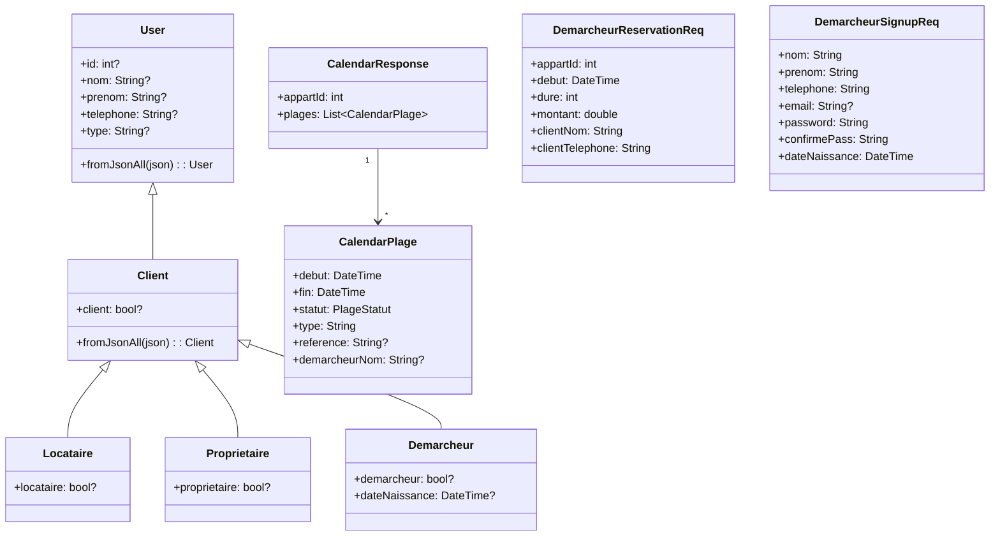
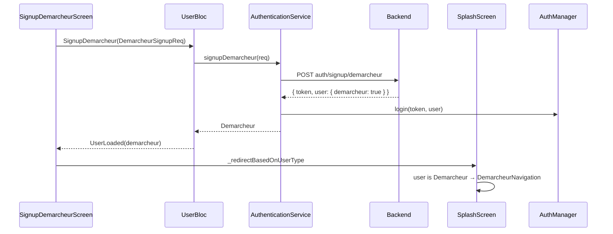
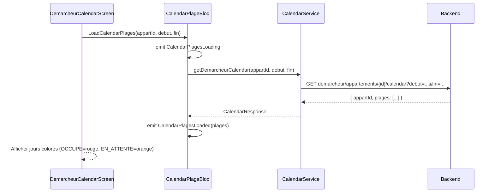

# Architecture — Feature Démarcheur & Calendrier enrichi

## 1. Vue d'ensemble

### Objectif
Intégrer un nouveau type d'utilisateur (Démarcheur) avec son propre espace, et
exposer l'API calendrier enrichie (OCCUPE / EN_ATTENTE) pour propriétaires et démarcheurs.

### Composants impactés
- Modèles utilisateur (hiérarchie User)
- Authentification / Routing (SplashScreen)
- BLoCs (nouveau DemarcheurBloc, CalendarPlageBloc, ProprietaireDemarcheurBloc)
- Services API (DemarcheurService, CalendarService, ProprietaireDemarcheurService)
- Navigation (DemarcheurNavigation, ProprioNavigation mise à jour)
- Screens (7 nouveaux)

---

## 2. Analyse de l'existant

### Hiérarchie utilisateur actuelle
```
User
└── Client (champ: client: bool?)
    ├── Locataire  (champ: locataire: bool?) → Home (Locataire)
    └── Proprietaire (champ: proprietaire: bool?) → ProprioNavigation
```
`Client.fromJsonAll` dispatche selon les champs JSON.

### Routing actuel (splash_screen.dart)
```dart
if (user is Proprietaire) → ProprioNavigation
else if (user is Locataire) → Home
else → Home (fallback)
```

### Auth (authentication_service.dart)
- `auth/login` — commun à tous
- `auth/signup` — locataire/proprietaire existants
- Pas de token sur les routes commençant par `/api/auth/`

---

## 3. Diagramme de Classes



---

## 4. Diagramme de Séquence — Inscription + Routing Démarcheur



---

## 5. Diagramme de Séquence — Calendrier Démarcheur



---

## 6. Structure des Fichiers

### Nouveaux fichiers (17 fichiers)

```
lib/
├── model/
│   ├── user/
│   │   └── demarcheur.dart                        [NEW]
│   ├── calendar/
│   │   └── calendar_plage.dart                    [NEW] CalendarPlage + CalendarResponse + PlageStatut
│   ├── enumeration/
│   │   └── plage_statut.dart                      [NEW] enum PlageStatut { occupe, enAttente }
│   └── request/
│       ├── demarcheur_reservation_req.dart         [NEW]
│       └── demarcheur_signup_req.dart              [NEW]
│
├── service/
│   └── model/
│       ├── demarcheur/
│       │   └── demarcheur_service.dart             [NEW] getAppartements, getReservations, createReservation
│       ├── calendar/
│       │   └── calendar_service.dart               [NEW] getDemarcheurCalendar, getProprietaireCalendar
│       └── proprietaire/
│           └── proprietaire_demarcheur_service.dart [NEW] getDemarcheurs, linkDemarcheur, unlinkDemarcheur
│
├── bloc/
│   ├── demarcheur_bloc/
│   │   ├── demarcheur_bloc.dart                   [NEW]
│   │   ├── demarcheur_event.dart                  [NEW]
│   │   └── demarcheur_state.dart                  [NEW]
│   ├── calendar_plage_bloc/
│   │   ├── calendar_plage_bloc.dart               [NEW]
│   │   ├── calendar_plage_event.dart              [NEW]
│   │   └── calendar_plage_state.dart              [NEW]
│   └── proprio_demarcheur_bloc/
│       ├── proprio_demarcheur_bloc.dart            [NEW]
│       ├── proprio_demarcheur_event.dart           [NEW]
│       └── proprio_demarcheur_state.dart           [NEW]
│
└── screen/
    ├── login/
    │   └── signup_demarcheur_screen.dart           [NEW]
    └── client/
        ├── demarcheur/                             [NEW SECTION]
        │   ├── demarcheur_navigation.dart          [NEW] 4 onglets
        │   ├── home/
        │   │   └── demarcheur_home.dart            [NEW] Liste appartements partenaires
        │   ├── calendrier/
        │   │   └── demarcheur_calendar_screen.dart [NEW] Calendrier par appartement
        │   ├── reservations/
        │   │   ├── demarcheur_reservations_screen.dart [NEW]
        │   │   └── demarcheur_reservation_form_screen.dart [NEW]
        │   └── profile/
        │       └── demarcheur_profile_screen.dart  [NEW] (réutilise ProfileProprio)
        └── proprio/
            └── demarcheurs/                        [NEW]
                ├── mes_demarcheurs_screen.dart     [NEW]
                └── widget/
                    └── demarcheur_item.dart        [NEW]
```

### Fichiers modifiés (6 fichiers)

```
lib/
├── model/
│   ├── user/
│   │   └── client.dart                            [MODIFIER] fromJsonAll → add Demarcheur detection
│   └── enumeration/
│       └── reservation_type.dart                  [MODIFIER] add demarcheur('DEMARCHEUR')
├── bloc/
│   └── user_bloc/
│       ├── user_event.dart                        [MODIFIER] add SignupDemarcheur event
│       └── user_bloc.dart                         [MODIFIER] handle SignupDemarcheur
├── screen/
│   ├── splash_screen.dart                         [MODIFIER] add Demarcheur routing
│   └── client/
│       └── proprio/
│           └── home/
│               └── proprio_home.dart              [MODIFIER] add "Démarcheurs" action button
└── main.dart                                      [MODIFIER] add DemarcheurBloc, ProprietaireDemarcheurBloc, CalendarPlageBloc
```

---

## 7. Contrats des Services

### DemarcheurService (URLs relatives à baseUrl = domain/api/)

```dart
class DemarcheurService {
  // GET demarcheur/appartements → List<Appartement>
  Future<List<Appartement>> getAppartements()

  // GET demarcheur/reservations → List<Reservation>
  Future<List<Reservation>> getReservations()

  // POST demarcheur/reservations → Reservation
  Future<Reservation> createReservation(DemarcheurReservationReq req)
}
```

### CalendarService

```dart
class CalendarService {
  // GET demarcheur/appartements/{id}/calendar?debut=...&fin=...
  Future<CalendarResponse> getDemarcheurCalendar(
    int appartId, {DateTime? debut, DateTime? fin})

  // GET appartements/{id}/calendar?debut=...&fin=...
  Future<CalendarResponse> getProprietaireCalendar(
    int appartId, {DateTime? debut, DateTime? fin})
}
```

### ProprietaireDemarcheurService

```dart
class ProprietaireDemarcheurService {
  // GET proprietaire/demarcheurs → List<Demarcheur>
  Future<List<Demarcheur>> getDemarcheurs()

  // POST proprietaire/demarcheurs/link { telephone }
  Future<void> linkDemarcheur(String telephone)

  // DELETE proprietaire/demarcheurs/{id}/unlink
  Future<void> unlinkDemarcheur(int id)
}
```

### AuthenticationService — ajout

```dart
// Méthode à ajouter dans AuthenticationService
// POST auth/signup/demarcheur
Future<User> signupDemarcheur(DemarcheurSignupReq req)
```

---

## 8. BLoC — Events & States

### DemarcheurBloc

**Events:**
- `LoadDemarcheurAppartements`
- `LoadDemarcheurReservations`
- `CreateDemarcheurReservation(DemarcheurReservationReq req)`

**States:**
- `DemarcheurInitial`
- `DemarcheurLoading`
- `DemarcheurAppartementsLoaded(List<Appartement> appartements)`
- `DemarcheurReservationsLoaded(List<Reservation> reservations)`
- `DemarcheurReservationCreated`
- `DemarcheurError(String message)`

### CalendarPlageBloc

**Events:**
- `LoadCalendarPlages(int appartId, {DateTime? debut, DateTime? fin, bool isDemarcheur})`
- `RefreshCalendarPlages()`

**States:**
- `CalendarPlagesInitial`
- `CalendarPlagesLoading`
- `CalendarPlagesLoaded(int appartId, List<CalendarPlage> plages, DateTime debut, DateTime fin)`
- `CalendarPlagesError(String message)`

### ProprietaireDemarcheurBloc

**Events:**
- `LoadDemarcheurs`
- `LinkDemarcheur(String telephone)`
- `UnlinkDemarcheur(int id)`

**States:**
- `ProprietaireDemarcheurInitial`
- `ProprietaireDemarcheurLoading`
- `DemarchemursLoaded(List<Demarcheur> demarcheurs)`
- `DemarcheurLinkSuccess(String message)`
- `DemarcheurUnlinkSuccess`
- `ProprietaireDemarcheurError(String message)`

---

## 9. Navigation Démarcheur

```
DemarcheurNavigation (BottomNav - 4 onglets)
├── [0] DemarcheurHome       → Liste appartements partenaires
│         └── tap(appartement) → DemarcheurCalendarScreen
├── [1] DemarcheurReservationsScreen → Mes réservations
│         └── FAB → DemarcheurReservationFormScreen
├── [2] NotificationsScreen  → Notifications (partagé)
└── [3] Profile              → Page profil (réutilise pattern existant)
```

---

## 10. Routing — SplashScreen (modification)

```dart
void _redirectBasedOnUserType(User user) {
  if (user is Proprietaire) {
    pushAndRemoveAll(context, const ProprioNavigation());
  } else if (user is Demarcheur) {            // ← NOUVEAU
    pushAndRemoveAll(context, const DemarcheurNavigation());
  } else if (user is Locataire) {
    pushAndRemoveAll(context, const Home());
  } else {
    pushAndRemoveAll(context, const Home());
  }
}
```

---

## 11. Détection Démarcheur dans Client.fromJsonAll

```dart
static fromJsonAll(Map<String, dynamic> json) {
  if (Locataire.fromJson(json).locataire != null) return Locataire.fromJson(json);
  if (Proprietaire.fromJson(json).proprietaire != null) return Proprietaire.fromJson(json);
  if (Demarcheur.fromJson(json).demarcheur != null) return Demarcheur.fromJson(json); // ← NOUVEAU
  return Client.fromJson(json);
}
```

---

## 12. Règles de gestion — Calendrier enrichi

| Plage statut | Couleur UI | Signification |
|---|---|---|
| `OCCUPE` | Rouge | Confirmée / payée / finalisée |
| `EN_ATTENTE` | Orange | Demande démarcheur non confirmée |
| *(absence)* | Vert | Disponible — cliquable pour réserver |

Le `CalendarPlageBloc` calcule les jours couverts et expose un helper `getStatusForDay(DateTime day)`.

---

## 13. CalendarPlage — Modèle

```dart
enum PlageStatut { occupe, enAttente }

class CalendarPlage {
  final DateTime debut;
  final DateTime fin;
  final PlageStatut statut;        // OCCUPE | EN_ATTENTE
  final String type;               // PLATEFORME | DEMARCHEUR | MANUELLE
  final String? reference;         // Présent si type == PLATEFORME
  final String? demarcheurNom;     // Présent si type == DEMARCHEUR

  bool containsDay(DateTime day);  // utilitaire
}

class CalendarResponse {
  final int appartId;
  final List<CalendarPlage> plages;
}
```

---

## 14. Ajout dans main.dart — BlocProviders

```dart
BlocProvider(create: (_) => DemarcheurBloc()),
BlocProvider(create: (_) => ProprietaireDemarcheurBloc()),
BlocProvider(create: (_) => CalendarPlageBloc()),
```

---

## 15. Résumé du scope

| Catégorie | Fichiers créés | Fichiers modifiés |
|---|---|---|
| Modèles | 5 | 2 (client.dart, reservation_type.dart) |
| Services | 3 | 1 (authentication_service.dart) |
| BLoCs | 9 | 2 (user_event.dart, user_bloc.dart) |
| Screens | 9 | 3 (splash_screen.dart, proprio_home.dart, main.dart) |
| **Total** | **26** | **8** |
