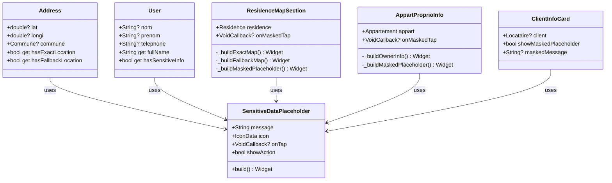
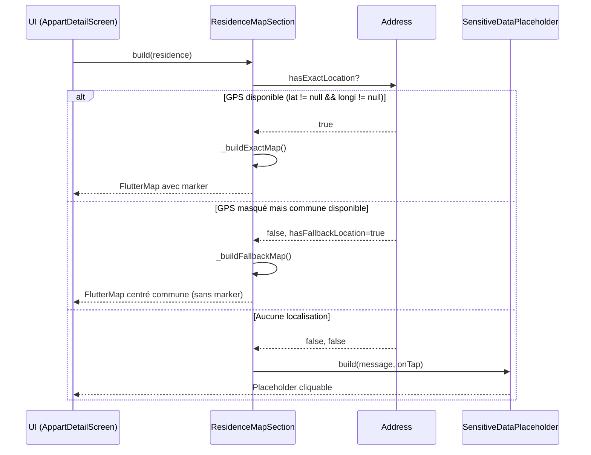

# 🏗️ Architecture - Gestion des Données Sensibles Filtrées

## 1. Vue d'ensemble

### Objectif
Gérer l'affichage des données sensibles masquées par le serveur (null) en proposant des placeholders interactifs et des cartes génériques lorsque les informations ne sont pas accessibles.

### Composants impactés
- **Modèles** : Ajout de getters pour détecter les données masquées
- **Widgets existants** : Modification de 3 widgets pour gérer les cas null
- **Nouveaux widgets** : 1 widget placeholder réutilisable

### Données concernées
| Entité | Champs masqués | Condition d'affichage |
|--------|----------------|----------------------|
| Address | `lat`, `longi` | Réservation PAYER/FINALISER active |
| Proprietaire | `nom`, `telephone` | Réservation PAYER/FINALISER active |
| Locataire | `nom`, `telephone` | Réservation PAYER/FINALISER (vue proprio) |

---

## 2. Diagramme de Classes



---

## 3. Diagramme de Séquence - Affichage Résidence



---

## 4. Structure des Fichiers

```
lib/
├── model/
│   ├── locolite/
│   │   └── address.dart              ← MODIFIER (ajouter getters)
│   └── user/
│       └── user.dart                 ← MODIFIER (ajouter getter)
│
├── widget/
│   ├── sensitive/
│   │   └── sensitive_data_placeholder.dart  ← CRÉER
│   ├── residence/
│   │   └── residence_map_section.dart       ← MODIFIER
│   ├── item/appart/
│   │   └── appart_proprio_info.dart         ← MODIFIER
│   └── user/
│       └── client_info_card.dart            ← MODIFIER
```

---

## 5. Détail des Modifications

### 5.1 Address - Ajout de getters

```dart
// lib/model/locolite/address.dart

/// Vérifie si les coordonnées GPS exactes sont disponibles
bool get hasExactLocation => lat != null && longi != null;

/// Vérifie si une localisation de fallback est disponible (commune/ville)
bool get hasFallbackLocation => commune?.ville != null;

/// Retourne les coordonnées de fallback (centre de la ville)
/// Note: Nécessite que Ville ait lat/longi ou utiliser des valeurs par défaut
LatLng? get fallbackLocation {
  // Coordonnées par défaut pour Abidjan si pas de données ville
  if (commune?.ville?.nom != null) {
    // TODO: Mapper les villes à leurs coordonnées
    return _getCityCoordinates(commune!.ville!.nom!);
  }
  return null;
}
```

### 5.2 User - Ajout de getter

```dart
// lib/model/user/user.dart

/// Vérifie si les informations sensibles sont disponibles
bool get hasSensitiveInfo => nom != null || prenom != null;

/// Vérifie si le téléphone est disponible
bool get hasPhoneInfo => telephone != null && telephone!.isNotEmpty;
```

### 5.3 SensitiveDataPlaceholder (Nouveau)

```dart
// lib/widget/sensitive/sensitive_data_placeholder.dart

class SensitiveDataPlaceholder extends StatelessWidget {
  final String message;
  final String? actionLabel;
  final IconData icon;
  final VoidCallback? onTap;
  final Color? color;

  const SensitiveDataPlaceholder({
    super.key,
    this.message = "Informations disponibles après paiement",
    this.actionLabel,
    this.icon = Icons.lock_outline,
    this.onTap,
    this.color,
  });

  @override
  Widget build(BuildContext context) {
    return GestureDetector(
      onTap: onTap,
      child: Container(
        padding: EdgeInsets.all(16),
        decoration: BoxDecoration(
          color: Style.containerColor2,
          borderRadius: BorderRadius.circular(12),
          border: Border.all(color: Style.primaryColor.withOpacity(0.3)),
        ),
        child: Row(
          children: [
            Icon(icon, color: color ?? Style.primaryColor, size: 24),
            SizedBox(width: 12),
            Expanded(
              child: Column(
                crossAxisAlignment: CrossAxisAlignment.start,
                children: [
                  TextSeed(message, fontSize: 14, color: Colors.grey[400]),
                  if (actionLabel != null && onTap != null) ...[
                    SizedBox(height: 4),
                    TextSeed(
                      actionLabel!,
                      fontSize: 13,
                      color: Style.primaryColor,
                      fontWeight: FontWeight.w600,
                    ),
                  ],
                ],
              ),
            ),
            if (onTap != null)
              Icon(Icons.arrow_forward_ios, color: Style.primaryColor, size: 16),
          ],
        ),
      ),
    );
  }
}
```

### 5.4 ResidenceMapSection - Modification

```dart
// lib/widget/residence/residence_map_section.dart

// Nouveaux paramètres
final VoidCallback? onMaskedTap;

// Dans build():
final hasExactLocation = residence.address?.hasExactLocation ?? false;
final hasFallbackLocation = residence.address?.hasFallbackLocation ?? false;

if (hasExactLocation) {
  return _buildExactMap(); // Code existant avec marker
} else if (hasFallbackLocation) {
  return _buildFallbackMap(); // Carte centrée sur commune sans marker
} else {
  return SensitiveDataPlaceholder(
    message: "Localisation disponible après paiement",
    actionLabel: "Réserver pour voir l'adresse exacte",
    icon: Icons.location_off,
    onTap: onMaskedTap,
  );
}
```

### 5.5 AppartProprioInfo - Modification

```dart
// lib/widget/item/appart/appart_proprio_info.dart

// Nouveau paramètre
final VoidCallback? onMaskedTap;

// Dans build():
final proprio = appart.residence?.proprietaire;
final hasInfo = proprio?.hasSensitiveInfo ?? false;

if (!hasInfo) {
  return SensitiveDataPlaceholder(
    message: "Informations du propriétaire",
    actionLabel: "Disponibles après paiement",
    icon: Icons.person_off,
    onTap: onMaskedTap,
  );
}
// ... code existant pour afficher les infos
```

### 5.6 ClientInfoCard - Modification

```dart
// lib/widget/user/client_info_card.dart

// Nouveaux paramètres
final bool showMaskedPlaceholder;
final String? maskedMessage;

// Dans build():
if (client == null || !client!.hasSensitiveInfo) {
  if (showMaskedPlaceholder) {
    return SensitiveDataPlaceholder(
      message: maskedMessage ?? "En attente de paiement",
      icon: Icons.hourglass_empty,
      color: Colors.orange,
    );
  }
  // Fallback existant "Client"
}
```

---

## 6. Mapping Villes → Coordonnées

Pour le fallback de la carte, créer un utilitaire :

```dart
// lib/util/city_coordinates.dart

class CityCoordinates {
  static const Map<String, List<double>> _cities = {
    'Abidjan': [5.3600, -4.0083],
    'Bouaké': [7.6833, -5.0333],
    'Yamoussoukro': [6.8276, -5.2893],
    'San-Pédro': [4.7500, -6.6333],
    'Korhogo': [9.4500, -5.6333],
    // ... autres villes
  };

  static LatLng? getCoordinates(String cityName) {
    final coords = _cities[cityName];
    if (coords != null) {
      return LatLng(coords[0], coords[1]);
    }
    // Fallback Abidjan
    return const LatLng(5.3600, -4.0083);
  }
}
```

---

## 7. Plan d'Implémentation

| Ordre | Fichier | Action | Dépendances |
|-------|---------|--------|-------------|
| 1 | `city_coordinates.dart` | Créer | - |
| 2 | `address.dart` | Modifier | city_coordinates |
| 3 | `user.dart` | Modifier | - |
| 4 | `sensitive_data_placeholder.dart` | Créer | - |
| 5 | `residence_map_section.dart` | Modifier | sensitive_data_placeholder, address |
| 6 | `appart_proprio_info.dart` | Modifier | sensitive_data_placeholder |
| 7 | `client_info_card.dart` | Modifier | sensitive_data_placeholder |
| 8 | `appart_detail_screen.dart` | Modifier | Passer callbacks |
| 9 | `proprio_reservation_detail_screen.dart` | Modifier | Passer showMaskedPlaceholder |

---

## 8. Tests à Vérifier

- [ ] Carte affiche le quartier sans marker quand GPS null
- [ ] Carte affiche marker quand GPS disponible
- [ ] Placeholder propriétaire avec action vers réservation
- [ ] Placeholder locataire "En attente de paiement" pour proprio
- [ ] Clic sur placeholder redirige correctement
- [ ] Pas de crash avec données null

---

*Architecture validée le 25 décembre 2024*
