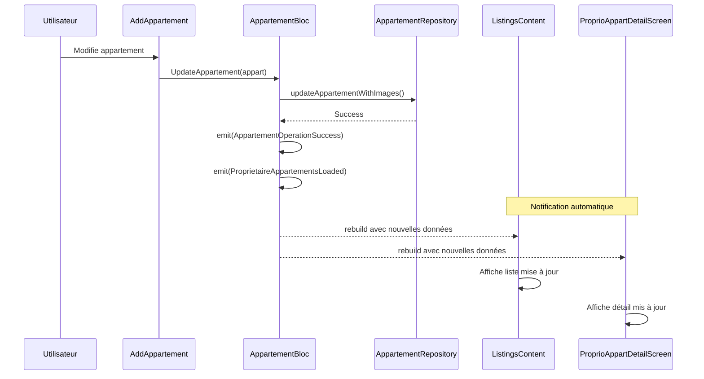
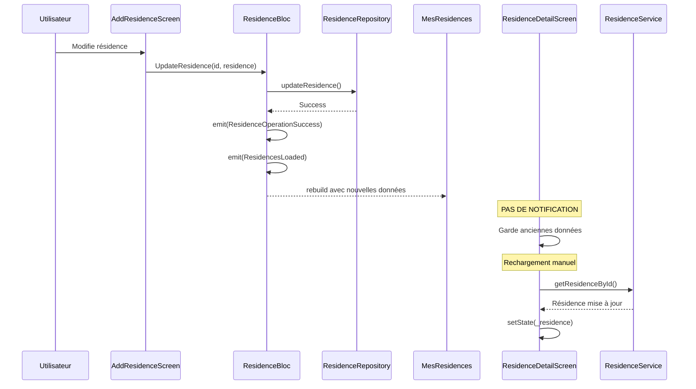
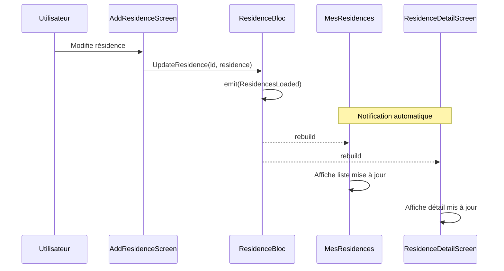

# Analyse du flux de modification - Appartements & Résidences

## 1. Vue d'ensemble

### Objectif de l'analyse
Vérifier s'il existe une source unique de vérité (Single Source of Truth) pour les appartements et résidences, et si les modifications se propagent automatiquement dans toute l'application.

---

## 2. Analyse des Appartements

### Source de vérité : `AppartementBloc` (CENTRALISÉ)

| Composant | Pattern utilisé | Source de vérité |
|-----------|-----------------|------------------|
| `AddAppartement` | BlocListener | Émet vers BLoC |
| `ListingsContent` | BlocBuilder | Écoute BLoC |
| `ProprioAppartDetailScreen` | BlocBuilder | Écoute BLoC |

### Diagramme de flux - Appartements



### Verdict Appartements : CONFORME

- `ProprioAppartDetailScreen` utilise `BlocBuilder` avec `buildWhen` pour filtrer les rebuilds
- Recherche l'appartement mis à jour dans le state du BLoC (ligne 42-51)
- Les modifications se propagent automatiquement

---

## 3. Analyse des Résidences

### Source de vérité : MIXTE (PROBLÈME IDENTIFIÉ)

| Composant | Pattern utilisé | Source de vérité |
|-----------|-----------------|------------------|
| `AddResidenceScreen` | BlocEvent | Émet vers BLoC |
| `MesResidences` | BlocConsumer | Écoute BLoC |
| `ResidenceDetailScreen` | **StatefulWidget local** | **Paramètre + API manuelle** |

### Diagramme de flux - Résidences (Actuel)



### Problèmes identifiés

#### Problème 1 : `ResidenceDetailScreen` n'écoute pas le BLoC

```dart
// ResidenceDetailScreen (ligne 30-42)
class _ResidenceDetailScreenState extends State<ResidenceDetailScreen> {
  late Residence _residence;  // État LOCAL, pas connecté au BLoC

  @override
  void initState() {
    super.initState();
    _residence = widget.residence;  // Copie du paramètre
    _loadAppartements();
  }
```

**Conséquence** : Si la résidence est modifiée ailleurs (ex: depuis la liste), l'écran de détail garde les anciennes données.

#### Problème 2 : Rechargement manuel après modification

```dart
// ResidenceDetailScreen (ligne 69-86)
Future<void> _handleEditLocation() async {
  await pushScreen(context, AddResidenceScreen(residenceToEdit: _residence));

  // Rechargement MANUEL via API
  if (mounted && _residence.id != null) {
    final updatedResidence = await _residenceService.getResidenceById(_residence.id!);
    setState(() {
      _residence = updatedResidence;
    });
  }
}
```

**Conséquences** :
- Appel API supplémentaire (le BLoC a déjà les données)
- Si l'appel échoue, les données restent obsolètes
- Duplication de logique de récupération

#### Problème 3 : Appartements chargés via Service, pas via BLoC

```dart
// ResidenceDetailScreen (ligne 44-66)
Future<void> _loadAppartements() async {
  final appartements = await _residenceService.getAppartementsByResidence(widget.residence.id!);
  setState(() {
    _appartements = appartements.map((json) => Appartement.fromJson(json)).toList();
  });
}
```

**Conséquence** : Les appartements ne sont pas synchronisés avec `AppartementBloc`.

---

## 4. Comparaison des patterns

### Pattern correct (Appartements)

```dart
// ProprioAppartDetailScreen - CORRECT
class ProprioAppartDetailScreen extends StatelessWidget {
  final Appartement appartement;  // Paramètre initial seulement

  @override
  Widget build(BuildContext context) {
    return BlocBuilder<AppartementBloc, AppartementState>(
      buildWhen: (previous, current) {
        return current is ProprietaireAppartementsLoaded ||
               current is AppartementOperationSuccess;
      },
      builder: (context, state) {
        // Récupérer l'appartement À JOUR depuis le BLoC
        Appartement currentAppartement = appartement;

        if (state is ProprietaireAppartementsLoaded) {
          currentAppartement = state.appartements.firstWhere(
            (a) => a.id == appartement.id,
            orElse: () => appartement,
          );
        }

        return /* UI avec currentAppartement */;
      },
    );
  }
}
```

### Pattern incorrect (Résidences)

```dart
// ResidenceDetailScreen - INCORRECT
class _ResidenceDetailScreenState extends State<ResidenceDetailScreen> {
  late Residence _residence;  // État LOCAL non synchronisé

  @override
  void initState() {
    _residence = widget.residence;  // Copie statique
  }

  // Pas de BlocBuilder, pas de synchronisation automatique
}
```

---

## 5. Verdict final

| Entité | Single Source of Truth | Propagation auto | Verdict |
|--------|------------------------|------------------|---------|
| **Appartements** | `AppartementBloc` | Oui | CONFORME |
| **Résidences** | Mixte (BLoC + local) | Partielle | **NON CONFORME** |

---

## 6. Recommandation de correction

### Modifier `ResidenceDetailScreen` pour utiliser le BLoC

```dart
// PROPOSITION DE CORRECTION
class ResidenceDetailScreen extends StatelessWidget {
  final Residence residence;

  const ResidenceDetailScreen({super.key, required this.residence});

  @override
  Widget build(BuildContext context) {
    return BlocBuilder<ResidenceBloc, ResidenceState>(
      buildWhen: (previous, current) {
        return current is ResidencesLoaded ||
               current is ResidenceOperationSuccess;
      },
      builder: (context, state) {
        // Récupérer la résidence à jour depuis le BLoC
        Residence currentResidence = residence;

        if (state is ResidencesLoaded) {
          try {
            currentResidence = state.residences.firstWhere(
              (r) => r.id == residence.id,
            );
          } catch (e) {
            currentResidence = residence;
          }
        }

        return Scaffold(
          // ... UI avec currentResidence
        );
      },
    );
  }
}
```

### Diagramme de flux corrigé



---

## 7. Impact de la correction

| Aspect | Avant | Après |
|--------|-------|-------|
| Appels API | Multiples (BLoC + manuel) | Un seul (BLoC) |
| Cohérence données | Risque de stale data | Toujours synchronisé |
| Complexité code | Logique dupliquée | Centralisée |
| Pattern | Incohérent | Uniforme |

