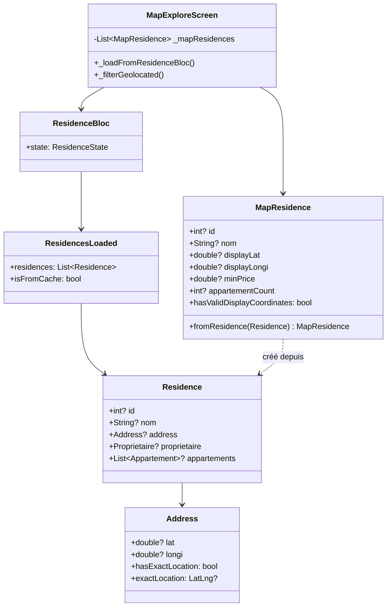
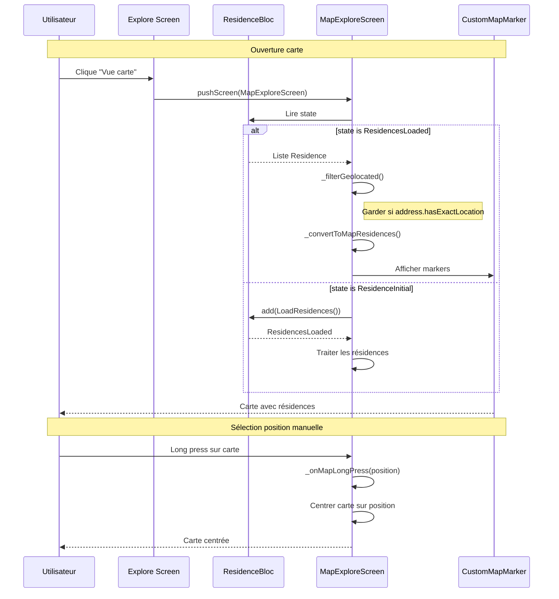

# Architecture - Logique de Chargement Carte (Révisée)

## 1. Vue d'ensemble

### Objectif
Modifier la carte pour afficher les **résidences** provenant du cache `ResidenceBloc`, en filtrant celles sans coordonnées GPS.

### Situation Actuelle
```
MapBloc ─────> MapService ─────> API /map/residences (appel séparé)
       │
       └──> Liste de MapResidence
```

### Situation Cible
```
ResidenceBloc ─────> ResidenceRepository ─────> API /residences (cache)
       │
       └──> Liste Residence (avec appartements)
                   │
                   ▼
         MapExploreScreen
                   │
                   ├──> Filtre celles avec coordonnées GPS
                   └──> Convertit en MapResidence pour affichage
```

### Composants Impactés
- `lib/screen/client/locataire/map/map_explore_screen.dart` (modifier)
- `lib/model/map/map_residence.dart` (ajouter factory fromResidence)

### Source de Données
- **ResidenceBloc** → `ResidencesLoaded.residences`
- Chaque `Residence` a :
  - `address` avec `lat`, `longi`
  - `appartements` (liste)
  - `proprietaire`

---

## 2. Diagramme de Classes



---

## 3. Diagramme de Séquence



---

## 4. Structure des Fichiers

```
lib/
├── model/
│   └── map/
│       └── map_residence.dart          # Ajouter factory fromResidence
└── screen/
    └── client/locataire/map/
        └── map_explore_screen.dart     # MODIFIER - utiliser ResidenceBloc
```

---

## 5. Modifications Détaillées

### 5.1 MapResidence - Ajouter Factory

```dart
/// Crée un MapResidence depuis une Residence
factory MapResidence.fromResidence(Residence residence) {
  final address = residence.address;
  final appartements = residence.appartements ?? [];

  final prices = appartements
      .where((a) => a.prix != null)
      .map((a) => a.prix!)
      .toList();

  return MapResidence(
    id: residence.id,
    nom: residence.nom,
    reference: residence.reference,
    displayLat: address?.lat,
    displayLongi: address?.longi,
    appartementCount: appartements.length,
    minPrice: prices.isNotEmpty ? prices.reduce((a, b) => a < b ? a : b) : null,
    maxPrice: prices.isNotEmpty ? prices.reduce((a, b) => a > b ? a : b) : null,
    proprietaire: residence.proprietaire,
    communeName: address?.commune?.nom,
    addressDescription: address?.description ?? address?.locationDisplayName,
  );
}
```

### 5.2 MapExploreScreen - Utiliser ResidenceBloc

```dart
class _MapExploreScreenState extends State<MapExploreScreen> {
  List<MapResidence> _mapResidences = [];

  @override
  void initState() {
    super.initState();
    _loadResidencesFromBloc();
    _getCurrentLocation();
  }

  /// Charge les résidences depuis ResidenceBloc
  void _loadResidencesFromBloc() {
    final resBloc = context.read<ResidenceBloc>();
    final state = resBloc.state;

    if (state is ResidencesLoaded) {
      _mapResidences = _filterAndConvert(state.residences);
      setState(() {});
    } else {
      // Si pas encore chargé, déclencher le chargement
      resBloc.add(LoadResidences());
    }
  }

  /// Filtre les résidences géolocalisées et convertit en MapResidence
  List<MapResidence> _filterAndConvert(List<Residence> residences) {
    return residences
        .where((r) => r.address?.hasExactLocation == true)
        .map((r) => MapResidence.fromResidence(r))
        .toList();
  }

  /// Long press pour choisir une position manuellement
  void _onMapLongPress(TapPosition tapPosition, LatLng point) {
    _mapController.move(point, MapConfig.selectedZoom);
    // Optionnel: afficher un marker temporaire
  }
}
```

---

## 6. Règles de Filtrage

| Condition | Action |
|-----------|--------|
| `residence.address == null` | Ne pas afficher |
| `address.hasExactLocation == false` | Ne pas afficher |
| `address.hasExactLocation == true` | Afficher avec marker |

---

## 7. Gestion des Cas Limites

| Cas | Comportement |
|-----|--------------|
| ResidenceBloc pas chargé | Déclencher `LoadResidences()` |
| Aucune résidence géolocalisée | Message "Aucune résidence avec localisation" |
| Position GPS refusée | Centrer sur Abidjan par défaut |
| Long press sur carte | Centrer sur le point sélectionné |

---

## 8. Avantages

1. **Source unique** - ResidenceBloc utilisé partout
2. **Pas de double appel API** - Cache déjà disponible
3. **Données complètes** - Résidence avec ses appartements
4. **Simplification** - Suppression logique MapService pour explore

---

*Document révisé le 25/12/2024*
