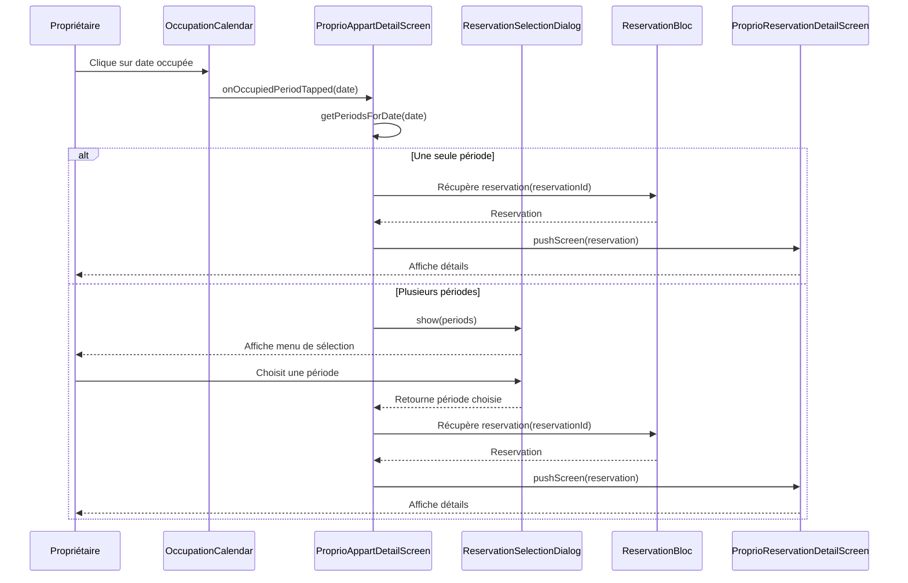

# 🏗️ Architecture - Navigation vers Détails Réservation depuis Calendrier

## 📋 Résumé

**Objectif** : Permettre au propriétaire de naviguer vers les détails d'une réservation en cliquant sur une période occupée dans le calendrier d'occupation.

**Complexité** : MOYENNE
- Logique conditionnelle (1 vs N périodes)
- Nouveau widget de sélection
- Intégration avec composants existants

---

## 1. 📊 Analyse du Projet

### Environnement détecté
- **Framework** : Flutter (Dart)
- **Architecture** : BLoC pattern (Business Logic Component)
- **Navigation** : Utility `pushScreen()` existante

### Conventions observées
- **Nommage** : snake_case pour fichiers, PascalCase pour classes
- **Organisation** : Structure par features (`screen/`, `widget/`, `bloc/`, `util/`)
- **Patterns** :
  - BLoC pour state management
  - Widgets réutilisables dans `widget/`
  - Helpers dans `util/helper/`
  - Dialogs dans `widget/dialog/`

### Composants existants à réutiliser
- ✅ `ProprioReservationDetailScreen` - Écran de détail réservation
- ✅ `ReservationBloc` - Contient toutes les réservations
- ✅ `OccupationPeriod.reservationId` - Lien vers la réservation
- ✅ `state.getPeriodsForDate(date)` - Récupère les périodes pour une date
- ✅ `pushScreen()` - Utilitaire de navigation

---

## 2. 🎯 Architecture Métier

### Entités / Concepts

**OccupationPeriod** (existant)
- Représente une période occupée pour un appartement
- Contient : `reservationId`, `appartementId`, `startDate`, `endDate`, `appartementName`

**Reservation** (existant)
- Représente une réservation complète
- Utilisé par `ProprioReservationDetailScreen`

**ReservationSelectionDialog** (NOUVEAU)
- Widget de sélection quand plusieurs réservations se chevauchent
- Affiche la liste des appartements occupés pour une date
- Retourne la période choisie

### Règles Métier

**[RM1] Navigation conditionnelle**
- Si 1 seule période pour la date → Navigation directe
- Si plusieurs périodes → Afficher menu de sélection d'abord

**[RM2] Sécurité**
- Si `reservationId` est null → Ne rien faire (sécurité)
- Si réservation non trouvée dans ReservationBloc → Ne rien faire

**[RM3] Mode fallback API**
- Dans les callbacks fallback (API), désactiver la navigation (pas de données locales)

### Relations

```
Date cliquée
    ↓
getPeriodsForDate(date)
    ↓
1 période → Reservation (via reservationId) → Navigation
    ↓
N périodes → ReservationSelectionDialog → Période choisie → Reservation → Navigation
```

---

## 3. 🔧 Architecture Fonctionnelle

### Modules / Composants

| Module | Responsabilité | Dépendances |
|--------|----------------|-------------|
| `_openOccupationCalendar` | Affiche le calendrier et gère le callback | ReservationBloc, OccupationCalendarDialog |
| `_handleOccupiedPeriodTap` | Logique de navigation (nouvelle méthode) | ReservationBloc, ReservationSelectionDialog |
| `ReservationSelectionDialog` | Menu de sélection (nouveau widget) | OccupationPeriod |
| `ProprioReservationDetailScreen` | Affiche les détails (existant) | Reservation |

### Flux de Données

#### **Cas 1 : Une seule période**

```
1. Propriétaire clique sur date occupée
   ↓
2. onOccupiedPeriodTapped(date) appelé
   ↓
3. _handleOccupiedPeriodTap(context, date) exécuté
   ↓
4. getPeriodsForDate(date) → retourne [période1]
   ↓
5. Récupérer reservationId de période1
   ↓
6. Trouver Reservation dans ReservationBloc
   ↓
7. pushScreen(ProprioReservationDetailScreen(reservation))
```

#### **Cas 2 : Plusieurs périodes**

```
1. Propriétaire clique sur date occupée
   ↓
2. onOccupiedPeriodTapped(date) appelé
   ↓
3. _handleOccupiedPeriodTap(context, date) exécuté
   ↓
4. getPeriodsForDate(date) → retourne [période1, période2, période3]
   ↓
5. Afficher ReservationSelectionDialog(periods)
   ↓
6. Utilisateur choisit → retourne période choisie
   ↓
7. Récupérer reservationId de la période choisie
   ↓
8. Trouver Reservation dans ReservationBloc
   ↓
9. pushScreen(ProprioReservationDetailScreen(reservation))
```

### Interfaces / Contrats

**ReservationSelectionDialog.show()**
```dart
static Future<OccupationPeriod?> show({
  required BuildContext context,
  required List<OccupationPeriod> periods,
  required DateTime selectedDate,
})
// Retourne la période choisie ou null si annulé
```

**_handleOccupiedPeriodTap()**
```dart
Future<void> _handleOccupiedPeriodTap(
  BuildContext context,
  DateTime date,
  List<OccupationPeriod> periods,
)
// Gère la logique conditionnelle et la navigation
```

---

## 4. 📐 Diagrammes

### Diagramme de Séquence - Navigation avec sélection



---

## 5. 📁 Plan d'Implémentation

### Fichiers à créer

**`lib/widget/dialog/reservation_selection_dialog.dart`**
- Widget de sélection quand plusieurs réservations se chevauchent
- Affiche une liste des appartements occupés avec :
  - Nom de l'appartement
  - Nom du locataire (si disponible)
  - Dates de la réservation
- Retourne la période choisie (OccupationPeriod)

### Fichiers à modifier

**`lib/screen/client/proprio/appartements/proprio_appart_detail_screen.dart`**
- Ajouter imports :
  - `import 'package:asfar/screen/client/proprio/reservations/proprio_reservation_detail_screen.dart';`
  - `import 'package:asfar/widget/dialog/reservation_selection_dialog.dart';`
- Ajouter méthode privée `_handleOccupiedPeriodTap(BuildContext, DateTime, List<OccupationPeriod>)`
- Modifier les 2 callbacks `onOccupiedPeriodTapped` :
  - Ligne 120-123 : callback dans `showWithLocalData()`
  - Ligne 130-133 : callback dans `showForApartment()` → passer `null` (désactiver)

**`lib/screen/client/proprio/residences/residence_detail_screen.dart`**
- Ajouter imports :
  - `import 'package:asfar/screen/client/proprio/reservations/proprio_reservation_detail_screen.dart';`
  - `import 'package:asfar/widget/dialog/reservation_selection_dialog.dart';`
- Ajouter méthode privée `_handleOccupiedPeriodTap(BuildContext, DateTime, List<OccupationPeriod>)`
- Modifier les 2 callbacks `onOccupiedPeriodTapped` :
  - Ligne 162-165 : callback dans `showWithLocalData()`
  - Ligne 173-176 : callback dans `showForResidence()` → passer `null` (désactiver)

### Ordre d'implémentation

**Étape 1 : Créer le widget de sélection** (PRIORITÉ 1)
- Créer `ReservationSelectionDialog`
- Design Material avec liste scrollable
- Affiche les informations de chaque période
- Retourne la période choisie ou null

**Étape 2 : Implémenter la méthode de gestion** (PRIORITÉ 2)
- Créer `_handleOccupiedPeriodTap` dans les 2 screens
- Logique conditionnelle :
  ```dart
  if (periods.isEmpty) return;

  OccupationPeriod? selectedPeriod;
  if (periods.length == 1) {
    selectedPeriod = periods.first;
  } else {
    selectedPeriod = await ReservationSelectionDialog.show(
      context: context,
      periods: periods,
      selectedDate: date,
    );
  }

  if (selectedPeriod == null || selectedPeriod.reservationId == null) return;

  // Récupérer la réservation depuis ReservationBloc
  final reservationState = context.read<ReservationBloc>().state;
  if (reservationState is! ReservationLoaded) return;

  try {
    final reservation = reservationState.reservations.firstWhere(
      (r) => r.id == selectedPeriod.reservationId,
    );

    pushScreen(context, ProprioReservationDetailScreen(reservation));
  } catch (e) {
    // Réservation non trouvée
    return;
  }
  ```

**Étape 3 : Mettre à jour les callbacks** (PRIORITÉ 3)
- Dans `showWithLocalData()` :
  ```dart
  onOccupiedPeriodTapped: (date) {
    final periodsForDate = periods.where((p) => p.contains(date)).toList();
    _handleOccupiedPeriodTap(context, date, periodsForDate);
  }
  ```
- Dans `showForApartment()` et `showForResidence()` (fallback API) :
  ```dart
  onOccupiedPeriodTapped: null, // Désactiver (pas de données locales)
  ```

**Étape 4 : Tests**
- Tester avec 1 période (navigation directe)
- Tester avec plusieurs périodes (affichage du dialog)
- Tester annulation du dialog
- Tester avec reservationId null

### Composant UI nécessaire

**OUI** - `ReservationSelectionDialog`
- Type : Material Dialog
- Style : Liste avec cards
- Action : Retourne `OccupationPeriod?`

---

## 6. 🎨 Spécification UI du Dialog

### Design recommandé

**ReservationSelectionDialog** (Material Dialog)
```
╔═══════════════════════════════════════╗
║  Sélectionner une réservation         ║
╠═══════════════════════════════════════╣
║                                       ║
║  📅 15 janvier 2026                   ║
║                                       ║
║  ┌─────────────────────────────────┐ ║
║  │ 🏠 Appartement A                │ ║
║  │ Locataire : Alice Martin        │ ║
║  │ Du 10 au 20 janvier             │ ║
║  └─────────────────────────────────┘ ║
║                                       ║
║  ┌─────────────────────────────────┐ ║
║  │ 🏠 Appartement B                │ ║
║  │ Locataire : Bob Dupont          │ ║
║  │ Du 14 au 18 janvier             │ ║
║  └─────────────────────────────────┘ ║
║                                       ║
║              [Annuler]                ║
╚═══════════════════════════════════════╝
```

### Propriétés du Dialog

- **Titre** : "Sélectionner une réservation"
- **Sous-titre** : Date formatée (ex: "15 janvier 2026")
- **Items** :
  - Card clickable pour chaque période
  - Affiche : nom appartement, locataire (si dispo), dates
  - Liste scrollable si > 3 items
- **Bouton annuler** : Ferme le dialog sans sélection

### Comportement

- **Tap sur card** → Ferme le dialog et retourne la période
- **Tap sur annuler** → Ferme le dialog et retourne null
- **Tap outside** → Ferme le dialog et retourne null

---

## 7. ✅ Vérification Architecture

### Principes SOLID appliqués

- ✅ **Single Responsibility (S)** :
  - Dialog → Sélection uniquement
  - Méthode de gestion → Logique conditionnelle uniquement
  - Screen de détail → Affichage uniquement

- ✅ **Open/Closed (O)** :
  - Ajout de fonctionnalité sans modifier l'existant
  - Le calendrier reste inchangé

- ✅ **Dependency Inversion (D)** :
  - Dépend de ReservationBloc (abstraction) pas d'implémentation

### Autres principes

- ✅ **DRY** :
  - Logique factorisée dans `_handleOccupiedPeriodTap`
  - Pas de duplication entre les 4 callbacks

- ✅ **KISS** :
  - Solution simple et directe
  - Pas de pattern complexe inutile
  - Dialog standard Material

- ✅ **YAGNI** :
  - Uniquement ce qui est demandé
  - Pas de fonctionnalité "au cas où"

- ✅ **Réutilisation** :
  - ReservationBloc (existant)
  - ProprioReservationDetailScreen (existant)
  - OccupationPeriod (existant)
  - pushScreen() (existant)

- ✅ **Séparation des préoccupations** :
  - UI (Dialog) ≠ Logique (méthode) ≠ Navigation ≠ State (BLoC)

---

## 8. 🔒 Gestion des Cas Limites

### Cas 1 : Aucune période pour la date
**Situation** : Bug théorique (ne devrait jamais arriver)
**Solution** : `if (periods.isEmpty) return;`

### Cas 2 : ReservationId null
**Situation** : Période sans réservation associée
**Solution** : `if (selectedPeriod.reservationId == null) return;`

### Cas 3 : Réservation non trouvée
**Situation** : reservationId existe mais pas dans ReservationBloc
**Solution** : `try/catch` sur `firstWhere()`

### Cas 4 : ReservationBloc non chargé
**Situation** : State n'est pas ReservationLoaded
**Solution** : `if (reservationState is! ReservationLoaded) return;`

### Cas 5 : Annulation du dialog
**Situation** : Utilisateur clique sur "Annuler"
**Solution** : Dialog retourne `null`, la méthode s'arrête

### Cas 6 : Mode fallback API
**Situation** : Calendrier chargé via API (pas de données locales)
**Solution** : Désactiver le callback (`onOccupiedPeriodTapped: null`)

---

## 9. 📊 Impacts et Dépendances

### Composants impactés
- ✅ `proprio_appart_detail_screen.dart` (MODIFIÉ)
- ✅ `residence_detail_screen.dart` (MODIFIÉ)
- ✅ `reservation_selection_dialog.dart` (CRÉÉ)

### Composants NON impactés
- ✅ `occupation_calendar_dialog.dart` - Reste inchangé
- ✅ `occupation_calendar_bloc.dart` - Reste inchangé
- ✅ `proprio_reservation_detail_screen.dart` - Reste inchangé
- ✅ `reservation_bloc.dart` - Reste inchangé

### Dépendances
```
reservation_selection_dialog.dart
    ↓ utilise
OccupationPeriod (model)

_handleOccupiedPeriodTap()
    ↓ utilise
ReservationBloc + ReservationSelectionDialog + ProprioReservationDetailScreen
```

---

## 10. 🎯 Critères d'Acceptation

### Fonctionnels
- [ ] Le propriétaire peut cliquer sur une période occupée
- [ ] Si 1 seule période : navigation directe vers les détails
- [ ] Si plusieurs périodes : affichage du menu de sélection
- [ ] Le menu affiche toutes les périodes du jour
- [ ] L'utilisateur peut choisir une période
- [ ] L'utilisateur peut annuler la sélection
- [ ] Navigation vers l'écran de détail avec la bonne réservation

### Non-fonctionnels
- [ ] Aucune erreur si réservation non trouvée
- [ ] Aucune erreur si reservationId null
- [ ] Le dialog se ferme après sélection
- [ ] Le dialog se ferme après annulation
- [ ] Compilation sans erreur
- [ ] Cohérence avec le style existant

---

## 11. 📝 Notes d'Implémentation

### Mode fallback API
Dans les callbacks `showForApartment()` et `showForResidence()`, passer `null` au lieu d'implémenter la navigation car :
- Pas d'accès aux données locales (ReservationBloc)
- Nécessiterait un appel API supplémentaire
- Mode fallback = cas rare (réservations non chargées)

### Performance
- Pas d'impact : logique simple, pas de calcul lourd
- Dialog affiché uniquement si > 1 période

### Accessibilité
- Dialog Material standard (accessible)
- Labels clairs et explicites

---

## 12. ✅ PRÊT POUR IMPLÉMENTATION

Cette architecture est **complète** et **prête** à être transmise à l'agent Flutter Dev.

**Fichier sauvegardé** : `.ai-outputs/features/navigation-reservation-depuis-calendrier/architecture.md`
