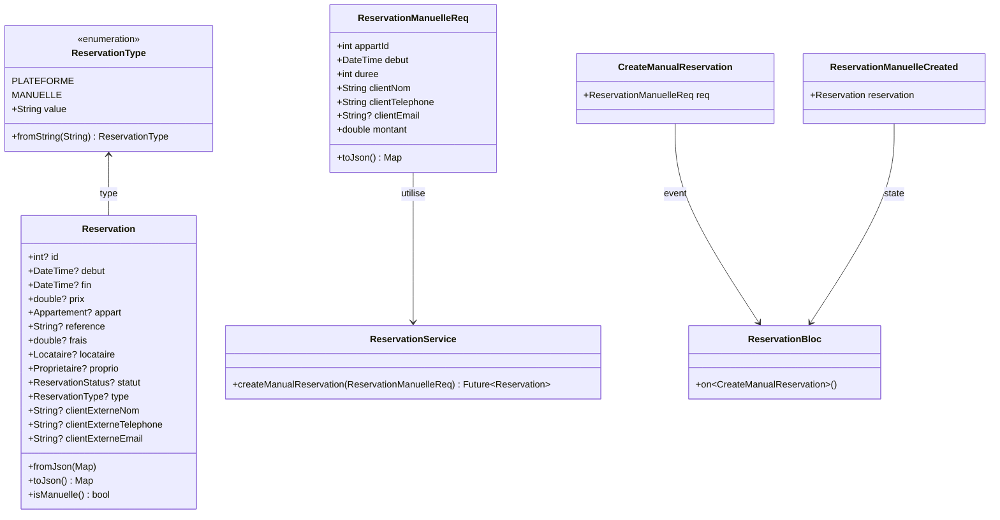
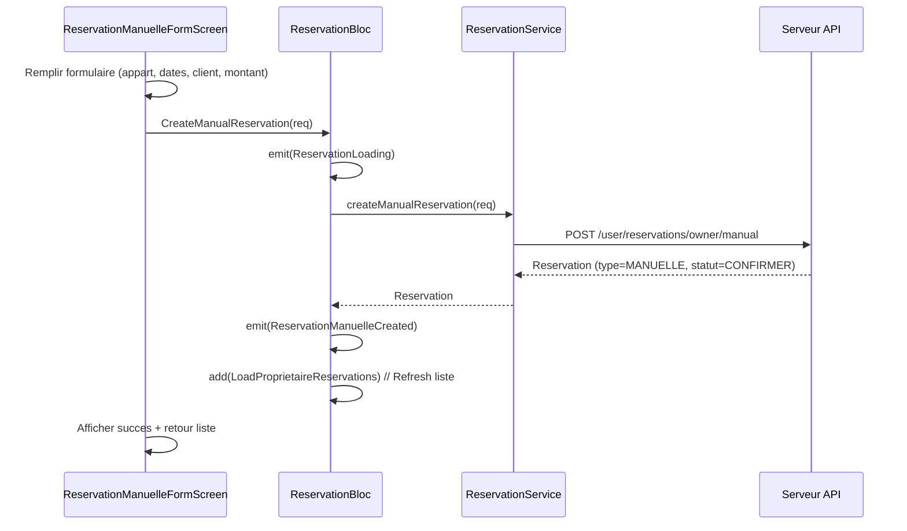

# Architecture - Reservation Manuelle Proprietaire

## Vue d'ensemble

### Objectif
Permettre aux proprietaires d'enregistrer des reservations faites en dehors de la plateforme Asfar (reservations "manuelles") pour un suivi complet de leurs appartements.

### Contexte Serveur
Le serveur a deja implemente :
- Endpoint : `POST /user/reservations/owner/manual`
- Enum : `ReservationType` (PLATEFORME, MANUELLE)
- DTO : `ReservationManuelleReq`
- Nouveaux champs sur Reservation : type, clientExterneNom, clientExterneTelephone, clientExterneEmail

### Comportement Metier
- Les reservations manuelles ont `frais = 0` (pas de commission plateforme)
- Statut automatique : `CONFIRMER` (pas besoin de validation)
- Client externe : pas de compte Locataire, infos stockees directement
- Les reservations manuelles apparaissent dans la liste du proprietaire

---

## Diagramme de Classes



---

## Diagramme de Sequence



---

## Structure des Fichiers

### Fichiers a Creer (3)

```
lib/
├── model/
│   ├── enumeration/
│   │   └── reservation_type.dart              # Enum ReservationType
│   └── request/
│       └── reservation_manuelle_req.dart      # DTO pour creation manuelle
└── screen/
    └── client/
        └── proprio/
            └── reservations/
                └── reservation_manuelle_form_screen.dart  # Formulaire UI
```

### Fichiers a Modifier (5)

```
lib/
├── model/
│   └── reservation/
│       └── reservation.dart               # Ajouter type + clientExterne*
├── service/
│   └── model/
│       └── booking/
│           └── reservation_service.dart   # Ajouter createManualReservation()
├── bloc/
│   └── reservation_bloc/
│       ├── reservation_event.dart         # Ajouter CreateManualReservation
│       ├── reservation_state.dart         # Ajouter ReservationManuelleCreated
│       └── reservation_bloc.dart          # Handler pour CreateManualReservation
└── screen/
    └── client/
        └── proprio/
            └── reservations/
                └── reservations_proprio.dart  # Ajouter bouton + navigation
```

---

## Interfaces / Contrats

### 1. ReservationType (Nouveau)

```dart
// lib/model/enumeration/reservation_type.dart
enum ReservationType {
  plateforme('PLATEFORME'),
  manuelle('MANUELLE');

  const ReservationType(this.value);
  final String value;

  static ReservationType fromString(String value) {
    return ReservationType.values.firstWhere(
      (e) => e.value == value.toUpperCase(),
      orElse: () => ReservationType.plateforme,
    );
  }
}
```

### 2. ReservationManuelleReq (Nouveau)

```dart
// lib/model/request/reservation_manuelle_req.dart
class ReservationManuelleReq {
  final int appartId;
  final DateTime debut;
  final int duree; // en jours
  final String clientNom;
  final String clientTelephone;
  final String? clientEmail;
  final double montant;

  ReservationManuelleReq({
    required this.appartId,
    required this.debut,
    required this.duree,
    required this.clientNom,
    required this.clientTelephone,
    this.clientEmail,
    required this.montant,
  });

  Map<String, dynamic> toJson() => {
    'appartId': appartId,
    'debut': debut.toIso8601String(),
    'dure': duree, // Note: "dure" sans 'e' selon spec serveur
    'clientNom': clientNom,
    'clientTelephone': clientTelephone,
    if (clientEmail != null) 'clientEmail': clientEmail,
    'montant': montant,
  };
}
```

### 3. Reservation (Modification)

```dart
// Ajouter dans lib/model/reservation/reservation.dart
import 'package:asfar/model/enumeration/reservation_type.dart';

class Reservation {
  // ... champs existants ...

  // Nouveaux champs
  ReservationType? type;
  String? clientExterneNom;
  String? clientExterneTelephone;
  String? clientExterneEmail;

  // Getter utilitaire
  bool get isManuelle => type == ReservationType.manuelle;

  // Nom du client (locataire plateforme ou client externe)
  String? get clientNom => isManuelle
      ? clientExterneNom
      : '${locataire?.prenom ?? ''} ${locataire?.nom ?? ''}'.trim();
}
```

### 4. ReservationService (Modification)

```dart
// Ajouter dans lib/service/model/booking/reservation_service.dart
Future<Reservation> createManualReservation(ReservationManuelleReq req) async {
  final response = await dio.post(
    'user/reservations/owner/manual',
    data: req.toJson(),
  );
  return Reservation.fromJson(response.data);
}
```

### 5. ReservationEvent (Modification)

```dart
// Ajouter dans lib/bloc/reservation_bloc/reservation_event.dart
class CreateManualReservation extends ReservationEvent {
  final ReservationManuelleReq req;
  CreateManualReservation(this.req);
}
```

### 6. ReservationState (Modification)

```dart
// Ajouter dans lib/bloc/reservation_bloc/reservation_state.dart
class ReservationManuelleCreated extends ReservationState {
  final Reservation reservation;
  ReservationManuelleCreated(this.reservation, {super.currentReq});
}
```

---

## UI - Formulaire Reservation Manuelle

### Champs du formulaire

| Champ | Type | Obligatoire | Validation |
|-------|------|-------------|------------|
| Appartement | Dropdown | Oui | Selection parmi appartements du proprio |
| Date debut | DatePicker | Oui | >= aujourd'hui |
| Duree (jours) | Number | Oui | >= 1 |
| Nom client | TextField | Oui | Non vide |
| Telephone | TextField | Oui | Format telephone valide |
| Email | TextField | Non | Format email si rempli |
| Montant | Number | Oui | > 0 |

### Navigation
- Acces depuis l'ecran `ReservationsProprioScreen` via FAB ou bouton "+"
- Retour vers liste apres creation reussie

### Pattern UI
- Suivre le pattern de `ChargeFormScreen` (formulaire existant)
- Utiliser `BlocConsumer` pour gerer loading/success/error
- Afficher SnackBar sur succes/erreur

---

## Plan d'Implementation

### Etape 1 : Modeles (enum + DTO)
1. Creer `lib/model/enumeration/reservation_type.dart`
2. Creer `lib/model/request/reservation_manuelle_req.dart`

### Etape 2 : Mise a jour Reservation
3. Modifier `lib/model/reservation/reservation.dart` :
   - Ajouter import ReservationType
   - Ajouter champs type, clientExterne*
   - Modifier fromJson/toJson
   - Ajouter getter isManuelle et clientNom

### Etape 3 : Service API
4. Modifier `lib/service/model/booking/reservation_service.dart` :
   - Ajouter import ReservationManuelleReq
   - Ajouter methode createManualReservation()

### Etape 4 : BLoC
5. Modifier `lib/bloc/reservation_bloc/reservation_event.dart` :
   - Ajouter CreateManualReservation
6. Modifier `lib/bloc/reservation_bloc/reservation_state.dart` :
   - Ajouter ReservationManuelleCreated
7. Modifier `lib/bloc/reservation_bloc/reservation_bloc.dart` :
   - Ajouter handler on<CreateManualReservation>

### Etape 5 : UI
8. Creer `lib/screen/client/proprio/reservations/reservation_manuelle_form_screen.dart`
9. Modifier `lib/screen/client/proprio/reservations/reservations_proprio.dart` :
   - Ajouter FAB pour acceder au formulaire

---

## Criteres de Validation

- [ ] Enum ReservationType cree et fonctionne
- [ ] DTO ReservationManuelleReq serialise correctement
- [ ] Reservation.fromJson parse les nouveaux champs
- [ ] API POST /user/reservations/owner/manual appelee
- [ ] Formulaire UI valide les champs
- [ ] Liste reservations affiche les manuelles
- [ ] Distinction visuelle entre PLATEFORME et MANUELLE
