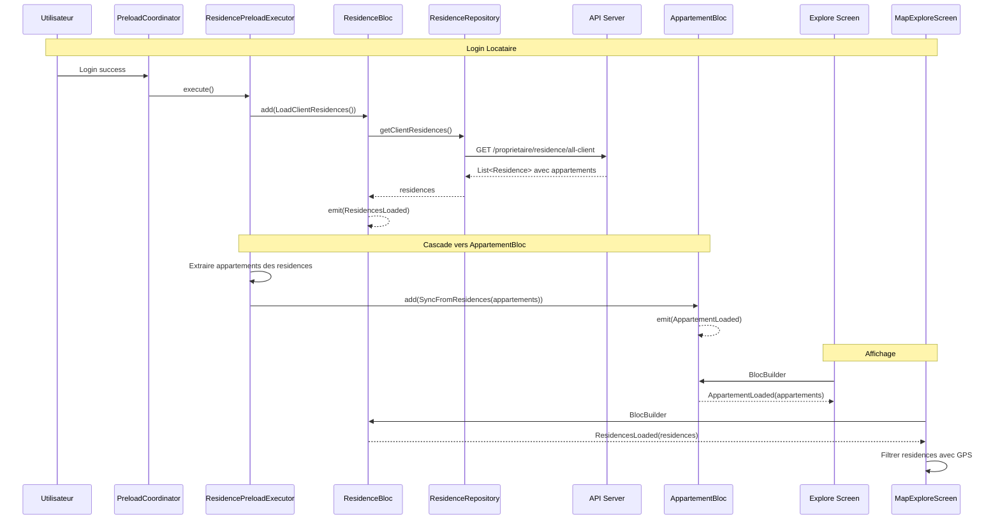
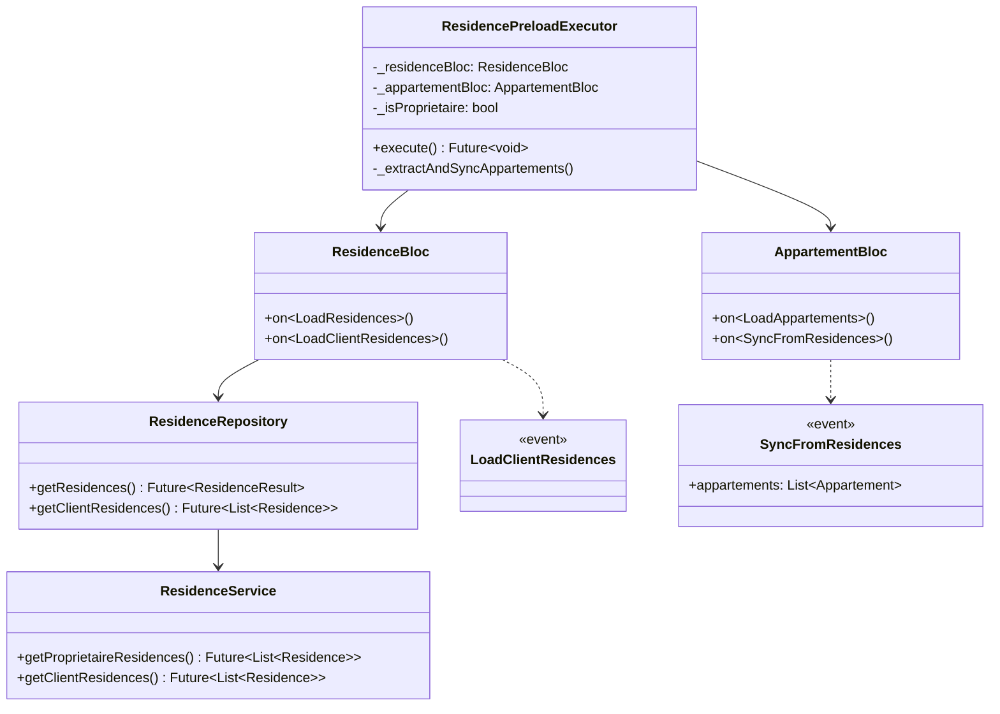

# Architecture - Restructuration Chargement Donnees

## 1. Vue d'ensemble

### Objectif
Unifier le chargement des donnees : ResidenceBloc devient la source unique pour les locataires, charge les residences avec leurs appartements, puis alimente AppartementBloc.

### Situation Actuelle
```
LOCATAIRE:
AppartementBloc ────> AppartementService ────> GET /auth/appartement/apparts
       │
       └──> Liste Appartement (sans coordonnees residence fiables)

CARTE:
ResidenceBloc ────> ResidenceService ────> GET /proprietaire/residence (403 pour locataire!)
```

### Situation Cible
```
LOCATAIRE:
ResidenceBloc ────> ResidenceService ────> GET /proprietaire/residence/all-client
       │
       ├──> Liste Residence (avec appartements et coordonnees)
       │
       └──> Extrait appartements ──> AppartementBloc
                                           │
                                           └──> Explore (affiche appartements)

CARTE:
MapExploreScreen ────> ResidenceBloc ────> Filtre residences avec GPS
```

### Composants Impactes

| Fichier | Action | Description |
|---------|--------|-------------|
| `residence_service.dart` | MODIFIER | Ajouter `getClientResidences()` |
| `residence_repository.dart` | MODIFIER | Ajouter methode client |
| `residence_bloc.dart` | MODIFIER | Ajouter `LoadClientResidences` |
| `residence_event.dart` | MODIFIER | Ajouter event `LoadClientResidences` |
| `appartement_bloc.dart` | MODIFIER | Ajouter `SyncFromResidences` |
| `appartement_event.dart` | MODIFIER | Ajouter event `SyncFromResidences` |
| `locataire_preload_strategy.dart` | MODIFIER | Remplacer `appartements` par `residences` |
| `residence_preload_executor.dart` | MODIFIER | Ajouter logique cascade vers AppartementBloc |
| `map_explore_screen.dart` | CONSERVER | Deja utilise ResidenceBloc |

---

## 2. Diagramme de Sequence



---

## 3. Diagramme de Classes



---

## 4. Details des Modifications

### 4.1 ResidenceService - Ajouter endpoint client

```dart
/// Recupere toutes les residences pour un locataire
/// Endpoint: GET /proprietaire/residence/all-client
Future<List<Residence>> getClientResidences() async {
  final dio = DioRequest.instance;
  final response = await dio.get("proprietaire/residence/all-client");

  if (response.data is Map<String, dynamic>) {
    final body = response.data['body'];
    if (body is List) {
      return body.map((json) => Residence.fromJson(json)).toList();
    }
  }

  if (response.data is List) {
    return (response.data as List).map((json) => Residence.fromJson(json)).toList();
  }

  return [];
}
```

### 4.2 ResidenceRepository - Ajouter methode client

```dart
/// Recupere les residences pour un locataire (pas de cache local)
Future<List<Residence>> getClientResidences() async {
  return await _apiService.getClientResidences();
}
```

### 4.3 ResidenceEvent - Ajouter event

```dart
/// Charger les residences pour un locataire (via endpoint client)
class LoadClientResidences extends ResidenceEvent {}
```

### 4.4 ResidenceBloc - Ajouter handler

```dart
on<LoadClientResidences>((event, emit) async {
  emit(ResidenceLoading());
  try {
    final residences = await _repository.getClientResidences();
    emit(ResidencesLoaded(residences));
  } catch (e) {
    ErrorHandler.logError("LOAD_CLIENT_RESIDENCES", e);
    final errorMessage = ErrorHandler.extractGenericErrorMessage(e);
    emit(ResidenceError(errorMessage));
  }
});
```

### 4.5 AppartementEvent - Ajouter event sync

```dart
/// Synchronise les appartements depuis les residences chargees
class SyncFromResidences extends AppartementEvent {
  final List<Appartement> appartements;
  SyncFromResidences(this.appartements);
}
```

### 4.6 AppartementBloc - Ajouter handler sync

```dart
on<SyncFromResidences>((event, emit) {
  deboger(['[AppartementBloc] Sync depuis residences: ${event.appartements.length} appartements']);
  emit(AppartementLoaded(event.appartements));
});
```

### 4.7 LocatairePreloadStrategy - Changer priorite

```dart
@override
List<PreloadDataType> getPreloadDataTypes() {
  return [
    // Residences avec appartements (priorite 0 - critique)
    PreloadDataType.residences,  // <-- CHANGE: etait "appartements"

    PreloadDataType.favorites,
    PreloadDataType.reservations,
    PreloadDataType.notifications,
    PreloadDataType.conversations,
  ];
}

@override
Map<PreloadDataType, int> getDataPriorities() {
  return {
    PreloadDataType.residences: 0,  // <-- CHANGE
    PreloadDataType.favorites: 1,
    PreloadDataType.reservations: 2,
    PreloadDataType.notifications: 2,
    PreloadDataType.conversations: 3,
  };
}
```

### 4.8 ResidencePreloadExecutor - Cascade vers AppartementBloc

```dart
class ResidencePreloadExecutor implements PreloadExecutor {
  final ResidenceBloc _residenceBloc;
  final AppartementBloc _appartementBloc;  // <-- AJOUTER
  final bool _isProprietaire;

  ResidencePreloadExecutor({
    required ResidenceBloc residenceBloc,
    required AppartementBloc appartementBloc,  // <-- AJOUTER
    required bool isProprietaire,
  })  : _residenceBloc = residenceBloc,
        _appartementBloc = appartementBloc,
        _isProprietaire = isProprietaire;

  @override
  Future<void> execute() async {
    try {
      if (_isProprietaire) {
        _residenceBloc.add(LoadResidences());
      } else {
        _residenceBloc.add(LoadClientResidences());
      }

      // Attendre le chargement
      final state = await _residenceBloc.stream
          .firstWhere((s) => s is ResidencesLoaded || s is ResidenceError)
          .timeout(const Duration(seconds: 10));

      // CASCADE: Extraire et sync les appartements pour locataire
      if (!_isProprietaire && state is ResidencesLoaded) {
        _syncAppartementsFromResidences(state.residences);
      }
    } catch (e) {
      deboger(['[ResidencePreloadExecutor] Erreur: $e']);
    }
  }

  void _syncAppartementsFromResidences(List<Residence> residences) {
    final appartements = residences
        .expand((r) => r.appartements ?? [])
        .toList();

    deboger(['[ResidencePreloadExecutor] Sync ${appartements.length} appartements']);
    _appartementBloc.add(SyncFromResidences(appartements));
  }
}
```

---

## 5. Structure des Fichiers

```
lib/
├── bloc/
│   ├── residence_bloc/
│   │   ├── residence_bloc.dart      # MODIFIER: ajouter LoadClientResidences handler
│   │   ├── residence_event.dart     # MODIFIER: ajouter LoadClientResidences
│   │   └── residence_state.dart     # CONSERVER
│   │
│   └── appartement_bloc/
│       ├── appartement_bloc.dart    # MODIFIER: ajouter SyncFromResidences handler
│       ├── appartement_event.dart   # MODIFIER: ajouter SyncFromResidences
│       └── appartement_state.dart   # CONSERVER
│
├── service/
│   ├── residence/
│   │   └── residence_service.dart   # MODIFIER: ajouter getClientResidences()
│   │
│   ├── repository/
│   │   └── residence_repository.dart # MODIFIER: ajouter getClientResidences()
│   │
│   └── preload/
│       ├── strategies/
│       │   └── locataire_preload_strategy.dart  # MODIFIER: residences priorite 0
│       │
│       ├── executors/
│       │   └── residence_preload_executor.dart  # MODIFIER: cascade AppartementBloc
│       │
│       └── preload_coordinator_builder.dart     # MODIFIER: passer AppartementBloc
│
└── screen/
    └── client/locataire/
        ├── home/
        │   └── explore.dart         # CONSERVER (utilise AppartementBloc)
        └── map/
            └── map_explore_screen.dart  # CONSERVER (utilise ResidenceBloc)
```

---

## 6. Code a Supprimer

| Fichier | Code a supprimer | Raison |
|---------|------------------|--------|
| `appartement_preload_executor.dart` | Logique `LoadAppartements` pour locataire | Remplace par cascade depuis ResidenceBloc |
| `locataire_preload_strategy.dart` | `PreloadDataType.appartements` | Remplace par `residences` |

---

## 7. Regles de Filtrage Carte

| Condition | Action |
|-----------|--------|
| `residence.address == null` | Ne pas afficher sur carte |
| `residence.address.lat == null` | Ne pas afficher (donnees masquees) |
| `residence.address.longi == null` | Ne pas afficher (donnees masquees) |
| Coordonnees valides | Afficher avec marker |

---

## 8. Tests de Non-Regression

- [ ] Explore affiche les appartements correctement
- [ ] Filtres (prix, commune, etc.) fonctionnent
- [ ] Carte affiche les residences avec GPS
- [ ] Carte masque les residences sans GPS
- [ ] Proprietaire peut toujours gerer ses residences
- [ ] Preload fonctionne pour locataire ET proprietaire

---

*Architecture concue le 26/12/2024*
