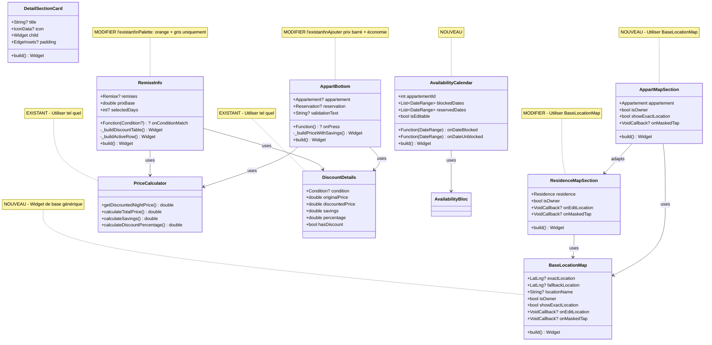
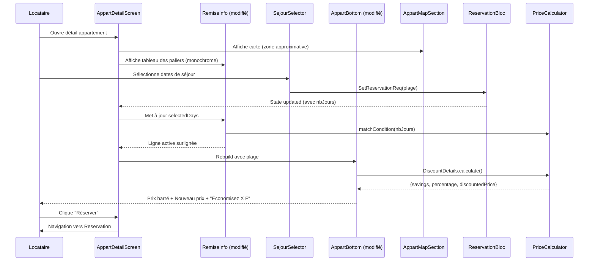
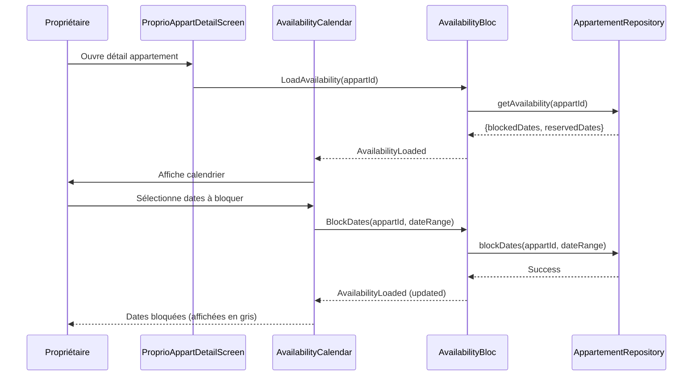

# Architecture - Amélioration Interface Détail & Réservation

## 1. Vue d'ensemble

### 1.1 Objectif
Refonte des interfaces de détail appartement et réservation pour améliorer la lisibilité, mettre en valeur les réductions et ajouter de nouvelles fonctionnalités (carte, calendrier propriétaire).

### 1.2 Widgets et Utilitaires EXISTANTS à réutiliser

| Existant | Fichier | Usage prévu |
|----------|---------|-------------|
| `ResidenceMapSection` | `widget/residence/residence_map_section.dart` | Réutiliser pour afficher la carte (approximative/exacte) |
| `PriceCalculator` | `util/price_calculator.dart` | Déjà utilisé, méthodes complètes |
| `DiscountDetails` | `util/price_calculator.dart` | Classe helper avec économies et % |
| `RemiseInfo` | `widget/item/appart/remise_info.dart` | À MODIFIER (pas recréer) |
| `AppartBottom` | `screen/.../widget/appart_bottom.dart` | À MODIFIER pour afficher économies |

### 1.3 Problèmes identifiés et solutions

| Problème | Fichier concerné | Solution |
|----------|------------------|----------|
| Trop de couleurs dans RemiseInfo | `widget/item/appart/remise_info.dart` | **MODIFIER** : palette monochrome (orange + gris) |
| Sections séparées par simples Dividers | `widget/detail_appart/appart_detail_content.dart` | Sections en cards avec hiérarchie |
| Pas de carte de localisation appart | - | **CRÉER** `BaseLocationMap` (widget générique) + `AppartMapSection` |
| Code dupliqué carte | `residence_map_section.dart` | **REFACTORER** pour utiliser `BaseLocationMap` |
| Prix sans économie affichée | `appart_bottom.dart` | **MODIFIER** : afficher prix barré + économie |
| Pas de gestion calendrier propriétaire | - | **CRÉER** widget `AvailabilityCalendar` |

### 1.4 Composants impactés

**Fichiers à MODIFIER (pas recréer) :**
- `lib/widget/item/appart/remise_info.dart` - Simplifier les couleurs
- `lib/widget/detail_appart/appart_detail_content.dart` - Réorganisation sections + carte
- `lib/screen/client/locataire/home/appart_detail_screen.dart` - Intégration carte
- `lib/screen/client/locataire/home/widget/appart_bottom.dart` - Afficher économie
- `lib/screen/client/proprio/appartements/proprio_appart_detail_screen.dart` - Ajout calendrier
- `lib/widget/residence/residence_map_section.dart` - Refactorer pour utiliser BaseLocationMap
- `lib/service/providers/style.dart` - Nouvelles couleurs sémantiques

**Fichiers à CRÉER :**
- `lib/widget/map/base_location_map.dart` - **Widget de base générique pour cartes**
- `lib/widget/map/appart_map_section.dart` - Wrapper pour appartements
- `lib/widget/calendar/availability_calendar.dart` - Calendrier disponibilité proprio
- `lib/widget/detail_appart/detail_section_card.dart` - Card de section réutilisable
- `lib/bloc/availability_bloc/` - BLoC pour gestion disponibilités

---

## 2. Diagramme de Classes



---

## 3. Diagramme de Séquence - Locataire consulte appartement



---

## 4. Diagramme de Séquence - Propriétaire bloque des dates



---

## 5. Structure des Fichiers

```
lib/
├── bloc/
│   └── availability_bloc/              # NOUVEAU (calendrier proprio)
│       ├── availability_bloc.dart
│       ├── availability_event.dart
│       └── availability_state.dart
│
├── widget/
│   ├── detail_appart/
│   │   ├── appart_detail_content.dart  # MODIFIER - sections en cards
│   │   ├── appart_detail_header.dart   # (existant - pas de modif)
│   │   └── detail_section_card.dart    # NOUVEAU - card réutilisable
│   │
│   ├── item/appart/
│   │   └── remise_info.dart            # MODIFIER - palette monochrome
│   │
│   ├── residence/
│   │   └── residence_map_section.dart  # MODIFIER - utiliser BaseLocationMap
│   │
│   ├── map/
│   │   ├── base_location_map.dart      # NOUVEAU - widget de base générique
│   │   └── appart_map_section.dart     # NOUVEAU - wrapper pour appartements
│   │
│   └── calendar/
│       └── availability_calendar.dart  # NOUVEAU - calendrier proprio
│
├── screen/client/
│   ├── locataire/home/
│   │   ├── appart_detail_screen.dart   # MODIFIER - intégrer carte
│   │   └── widget/
│   │       └── appart_bottom.dart      # MODIFIER - afficher économies
│   │
│   └── proprio/appartements/
│       └── proprio_appart_detail_screen.dart  # MODIFIER - calendrier
│
├── service/
│   └── providers/
│       └── style.dart                  # MODIFIER - couleurs sémantiques
│
└── util/
    └── price_calculator.dart           # EXISTANT - utiliser tel quel
```

---

## 6. Spécifications des Widgets

### 6.1 DetailSectionCard (NOUVEAU)
Widget réutilisable pour encapsuler chaque section avec un style cohérent.

```dart
class DetailSectionCard extends StatelessWidget {
  final String? title;
  final IconData? icon;
  final Widget child;
  final EdgeInsets? padding;

  // Style: fond Style.surfaceColor (légèrement plus clair que background)
  // Border radius: 12px
  // Padding interne: Espacement.paddingBloc
}
```

### 6.2 RemiseInfo (MODIFIER l'existant)

**Fichier :** `lib/widget/item/appart/remise_info.dart`

**Changements clés :**
- Supprimer `_getCardColor()` avec ses 4 couleurs (vert, teal, bleu, indigo)
- Palette monochrome : uniquement `Style.primaryColor` (orange) + gris
- Remplacer les cards gradient par un tableau simple
- Ajouter paramètre `selectedDays` pour surligner la ligne active
- Utiliser `DiscountDetails` existant pour les calculs

```dart
// AVANT (problème)
final colors = [Colors.green, Colors.teal, Colors.blue, Colors.indigo];

// APRÈS (solution)
class RemiseInfo extends StatelessWidget {
  final Remise? remises;
  final double prixBase;
  final int? selectedDays;  // NOUVEAU paramètre

  // Affiche un tableau épuré :
  // ┌─────────────┬────────────┬──────────┐
  // │ Durée       │ Prix/nuit  │ Économie │
  // ├─────────────┼────────────┼──────────┤
  // │ 7+ jours    │ 8 000 F    │ -10%     │ ← fond surfaceColorLight si actif
  // │ 30+ jours   │ 7 000 F    │ -20%     │
  // └─────────────┴────────────┴──────────┘
  //
  // Couleurs : primaryColor pour %, textSecondary pour texte
}
```

### 6.3 AppartBottom (MODIFIER l'existant)

**Fichier :** `lib/screen/client/locataire/home/widget/appart_bottom.dart`

**Changements clés :**
- Utiliser `DiscountDetails.calculate()` au lieu de juste `PriceCalculator.getDiscountedNightPrice()`
- Afficher le prix original barré si réduction
- Afficher l'économie réalisée
- Ajouter indicateur "proche du palier suivant"

```dart
// AVANT (actuel - ligne 49-60)
final prixFormate = helpAmountFormate(prix, decim: false);
String prixParNuitTexte = "$prixFormate FCFA / nuit";

// APRÈS (amélioré)
final discountDetails = DiscountDetails.calculate(prixBase, appartement?.remises, nombreJours);

// Si réduction applicable :
// ╔═══════════════════════════════════════╗
// ║  8 000 F/nuit  (10 000 F barré)       ║
// ║  Total : 56 000 F                     ║
// ║  ✓ Économisez 14 000 F (-20%)        ║  ← en vert (Style.successColor)
// ║  15 jan - 22 jan                      ║
// ╚═══════════════════════════════════════╝
```

### 6.4 BaseLocationMap (NOUVEAU - widget de base générique)

**Fichier :** `lib/widget/map/base_location_map.dart`

Widget de base générique pour afficher une carte. Utilisé par `ResidenceMapSection` ET les appartements.

```dart
/// Widget de base pour afficher une localisation sur une carte
/// Gère 3 cas :
/// - Localisation exacte (avec marker)
/// - Localisation approximative (zone floue, sans marker)
/// - Pas de localisation (placeholder)
class BaseLocationMap extends StatelessWidget {
  final LatLng? exactLocation;      // Coordonnées exactes (si disponibles)
  final LatLng? fallbackLocation;   // Coordonnées approximatives (ville/quartier)
  final String? locationName;       // Nom à afficher (ex: "Cocody, Abidjan")
  final bool isOwner;               // true = proprio, false = locataire
  final bool showExactLocation;     // true = montrer marker exact
  final VoidCallback? onEditLocation;   // Callback édition (proprio)
  final VoidCallback? onMaskedTap;      // Callback tap sur zone masquée

  @override
  Widget build(BuildContext context) {
    // Cas 1: Coordonnées exactes + autorisé à voir
    if (exactLocation != null && (isOwner || showExactLocation)) {
      return _buildExactMap(exactLocation!);
    }

    // Cas 2: Proprio sans coordonnées → Placeholder "Ajouter"
    if (isOwner && exactLocation == null) {
      return _buildOwnerPlaceholder();
    }

    // Cas 3: Localisation approximative (locataire avant paiement)
    if (fallbackLocation != null) {
      return _buildFallbackMap(fallbackLocation!, locationName);
    }

    // Cas 4: Aucune localisation
    return SensitiveDataPlaceholder.location(onTap: onMaskedTap);
  }

  // ... méthodes privées reprises de ResidenceMapSection
}
```

### 6.5 Refactoring de ResidenceMapSection (MODIFIER)

**Fichier :** `lib/widget/residence/residence_map_section.dart`

Modifier pour utiliser `BaseLocationMap` au lieu de dupliquer le code.

```dart
/// Section carte pour une résidence
/// Wrapper simple autour de BaseLocationMap
class ResidenceMapSection extends StatelessWidget {
  final Residence residence;
  final bool isOwner;
  final VoidCallback? onEditLocation;
  final VoidCallback? onMaskedTap;

  @override
  Widget build(BuildContext context) {
    final address = residence.address;

    return BaseLocationMap(
      exactLocation: address?.exactLocation,
      fallbackLocation: address?.fallbackLocation,
      locationName: address?.locationDisplayName,
      isOwner: isOwner,
      showExactLocation: isOwner,  // Proprio voit toujours l'exact
      onEditLocation: onEditLocation,
      onMaskedTap: onMaskedTap,
    );
  }
}
```

### 6.6 AppartMapSection (NOUVEAU - utilise BaseLocationMap)

**Fichier :** `lib/widget/map/appart_map_section.dart`

Wrapper pour les appartements, utilisant le même widget de base.

```dart
/// Section carte pour un appartement
/// Utilise les coordonnées de la résidence parente
class AppartMapSection extends StatelessWidget {
  final Appartement appartement;
  final bool isOwner;
  final bool showExactLocation;  // true après paiement réservation
  final VoidCallback? onMaskedTap;

  @override
  Widget build(BuildContext context) {
    final residence = appartement.residence;
    final address = residence?.address;

    return BaseLocationMap(
      exactLocation: address?.exactLocation,
      fallbackLocation: address?.fallbackLocation,
      locationName: address?.locationDisplayName ?? residence?.ville,
      isOwner: isOwner,
      showExactLocation: showExactLocation,
      onMaskedTap: onMaskedTap,
    );
  }
}
```

### 6.5 AvailabilityCalendar (NOUVEAU)

**Fichier :** `lib/widget/calendar/availability_calendar.dart`

Calendrier pour le propriétaire permettant de bloquer des dates.

```dart
class AvailabilityCalendar extends StatelessWidget {
  final int appartementId;
  final bool isEditable;  // true pour proprio

  // Légende couleurs (cohérentes avec Style) :
  // - Style.calendarBlocked (gris) : dates bloquées manuellement
  // - Style.primaryColor (orange) : dates réservées
  // - Fond par défaut : dates disponibles

  // Actions proprio :
  // - Tap sur date disponible → marquer pour bloquer
  // - Tap sur date bloquée → débloquer
  // - Bouton "Confirmer" pour sauvegarder
}
```

---

## 7. Palette de Couleurs (Style.dart)

**Ajouts proposés :**

```dart
class Style {
  // ... existant ...

  // NOUVELLES couleurs sémantiques (cohérence lisibilité)
  static Color successColor = Color(0xFF4CAF50);      // Vert pour économies
  static Color warningColor = Color(0xFFFF9800);      // Orange warning
  static Color surfaceColor = Color(0xFF2D2D2D);      // Fond des cards (plus clair que background)
  static Color surfaceColorLight = Color(0xFF3D3D3D); // Fond surligné
  static Color textSecondary = Color(0xFF9E9E9E);     // Texte secondaire
  static Color textMuted = Color(0xFF757575);         // Texte désactivé

  // Couleurs calendrier
  static Color calendarBlocked = Color(0xFF616161);   // Dates bloquées
  static Color calendarReserved = primaryColor;        // Dates réservées
  static Color calendarAvailable = Color(0xFF4CAF50); // Dates disponibles
}
```

---

## 8. API Backend (si nécessaire)

### Endpoints requis pour le calendrier propriétaire :

```
GET  /api/appartements/{id}/availability
     → { blockedDates: [...], reservedDates: [...] }

POST /api/appartements/{id}/block-dates
     → { startDate: "2024-01-15", endDate: "2024-01-20" }

DELETE /api/appartements/{id}/block-dates/{blockId}
     → Débloquer une période
```

**Note :** Vérifier avec le backend si ces endpoints existent. Sinon, les ajouter.

---

## 9. Plan d'Implémentation

### Phase 1 : Foundation (Style + Composants de base)
1. Mettre à jour `style.dart` avec nouvelles couleurs
2. Créer `DetailSectionCard`
3. Refactorer `RemiseInfoV2`

### Phase 2 : Détail Appartement Locataire
4. Créer `PriceBreakdown`
5. Créer `LocationMapPreview`
6. Modifier `AppartDetailContent` (sections en cards)
7. Modifier `appart_bottom.dart` (prix avec économie)

### Phase 3 : Interface Propriétaire
8. Créer `AvailabilityBloc`
9. Créer `AvailabilityCalendar`
10. Modifier `ProprioAppartDetailScreen` (intégrer calendrier)

### Phase 4 : Tests & Polish
11. Tests unitaires des widgets
12. Tests d'intégration
13. Ajustements visuels

---

## 10. Dépendances

**Dépendances EXISTANTES (déjà dans pubspec.yaml) :**
- `flutter_map` - Utilisé par `ResidenceMapSection`
- `latlong2` - Utilisé pour les coordonnées
- `table_calendar` - À vérifier si présent, sinon ajouter

```yaml
# Ajouter SEULEMENT si table_calendar n'existe pas :
dependencies:
  table_calendar: ^3.0.9  # Pour AvailabilityCalendar
```

---

## 11. Composants UI identifiés

**La feature nécessite des composants UI visuels.**

→ **Flag UI : OUI** - L'Agent UI/UX doit intervenir pour :
- Définir le layout exact des sections
- Valider la nouvelle palette de couleurs
- Proposer le design du tableau des réductions
- Définir l'intégration de la carte
- Définir le design du calendrier propriétaire

---

## 12. Résumé des Fichiers

### Fichiers à MODIFIER (existants)

| Fichier | Modifications |
|---------|---------------|
| `widget/item/appart/remise_info.dart` | Supprimer 4 couleurs → palette monochrome, ajouter `selectedDays` |
| `screen/.../widget/appart_bottom.dart` | Afficher prix barré + économie via `DiscountDetails` |
| `widget/detail_appart/appart_detail_content.dart` | Sections en cards + intégrer carte |
| `screen/.../appart_detail_screen.dart` | Intégrer `AppartMapSection` |
| `screen/.../proprio_appart_detail_screen.dart` | Ajouter `AvailabilityCalendar` |
| `widget/residence/residence_map_section.dart` | Refactorer pour utiliser `BaseLocationMap` |
| `service/providers/style.dart` | Ajouter couleurs sémantiques |

### Fichiers à CRÉER (nouveaux)

| Fichier | Description |
|---------|-------------|
| `widget/map/base_location_map.dart` | **Widget de base générique pour cartes** |
| `widget/map/appart_map_section.dart` | Wrapper pour appartements (utilise BaseLocationMap) |
| `widget/detail_appart/detail_section_card.dart` | Card de section réutilisable |
| `widget/calendar/availability_calendar.dart` | Calendrier pour bloquer des dates |
| `bloc/availability_bloc/availability_bloc.dart` | BLoC gestion disponibilités |
| `bloc/availability_bloc/availability_event.dart` | Events disponibilités |
| `bloc/availability_bloc/availability_state.dart` | States disponibilités |

### Fichiers EXISTANTS à RÉUTILISER (pas de modification)

| Fichier | Usage |
|---------|-------|
| `util/price_calculator.dart` | `DiscountDetails.calculate()` |

---

**Statut :** En attente de validation humaine
