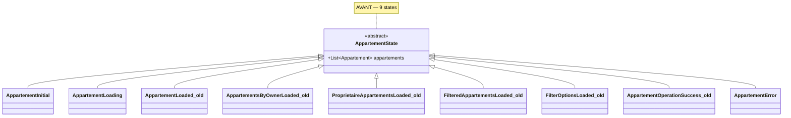
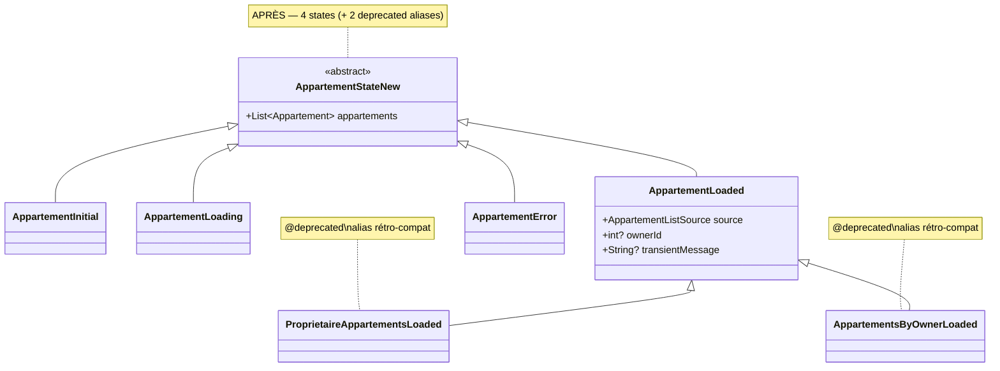
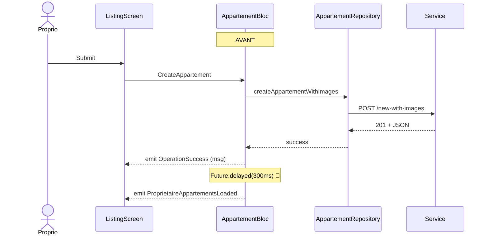
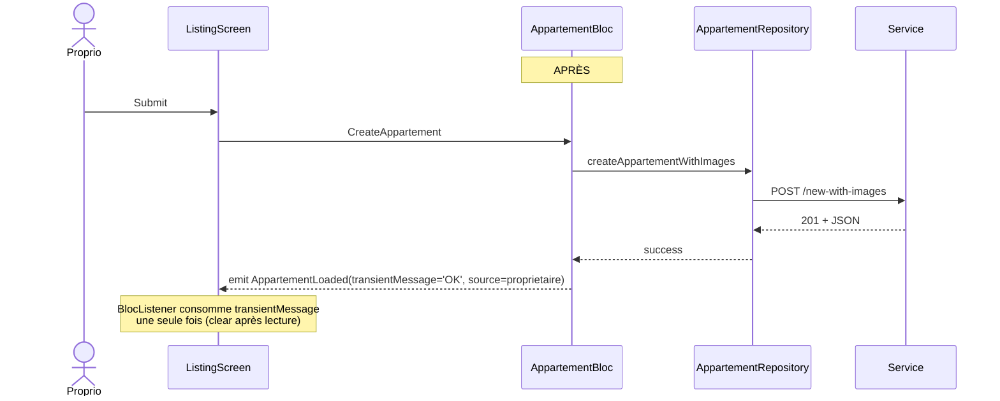
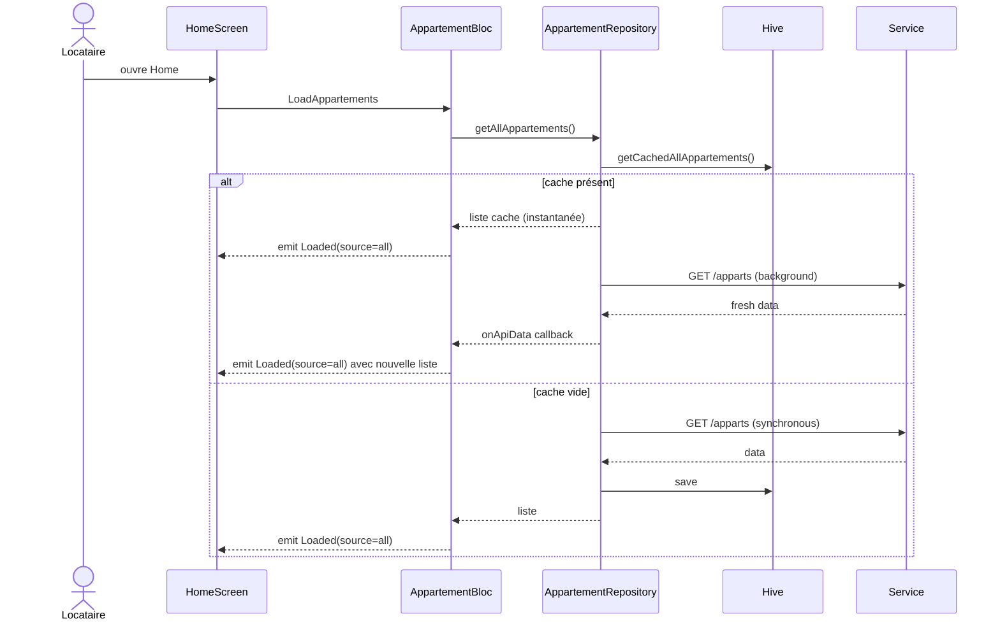

# 🏗️ Architecture : Refacto Système Annonces

> **Feature :** `annonces-refacto`
> **Date :** 2026-05-12
> **Type :** Refactoring transversal sans changement fonctionnel UI
> **Statut :** ⏳ En attente de validation utilisateur

---

## 1. Analyse du projet

**Stack** : Flutter / flutter_bloc 9.1.1 / hive 2.2.3 / dio 5.8.

**Patterns à respecter** :
- Cubit + state dans 1 fichier (cf. `ComptabiliteFilterCubit`)
- Pattern « keep last known data »
- Helpers extraits dans `lib/util/calc/` ou extensions sur les modèles
- Aliases deprecated pour rétro-compat (pattern projet déjà vu : `text` / `textPrimary` dans `AppColors`)

**Points d'intégration mesurés** :
- 2 fichiers consomment directement les sous-classes de state : `appartement_preload_executor.dart` + `search_screen.dart`
- 1 commentaire dans `realtime_action_handler.dart` (pas un usage actif)
- 38 autres fichiers UI font seulement `state.appartements` → restent intacts

---

## 2. Décisions architecturales (8 réponses)

| # | Question | Décision | Justification |
|---|----------|----------|---------------|
| **D1** | Champ `note` | Champ stocké `note: double?` + getter `AppartementDisplay.rating` retourne `note ?? _avgFromCommentaires ?? 0.0` | Rétro-compat : `rating` non-nullable, les callers qui font `>= 4.8` continuent de fonctionner |
| **D2** | Source enum | `enum AppartementListSource { all, byOwner, proprietaire }` (filtre sorti vers Cubit) | Simple, type-safe |
| **D3** | `transientMessage` | Champ sur `AppartementLoaded` uniquement (pas sur le parent) | Sémantique : un message de succès n'a de sens que sur un Loaded |
| **D4** | Filter Cubit | **Cubit autonome** avec service direct (Option A) | Découplé du BLoC, pattern aligné `ComptabiliteFilterCubit` |
| **D5** | Cache-first locataire | Étendre `AppartementRepository` avec `getAllAppartements()` + cache séparé (Option B) | 1 seul Repository pour les 2 endpoints, 2 caches Hive distincts |
| **D6** | Tests Mapper | 8 tests round-trip (create/update/fromBackend/extractId × cas) | Couverture critique de la couche legacy |
| **D7** | Rétro-compat states | Aliases deprecated : `ProprietaireAppartementsLoaded extends AppartementLoaded` | Migration douce, pas de breaking change V1 |
| **D8** | Keep last known data | Préservé : `AppartementLoaded` hérite de `AppartementState` avec `appartements` | Pas de changement de comportement |

---

## 3. Architecture cible

### 3.1 Diagramme de classes — States avant / après





### 3.2 Modules

| Module | Avant | Après |
|--------|-------|-------|
| `Appartement` modèle | Note `Random()` bug | Champ stocké `note: double?` + parsing JSON |
| `AppartementDisplay` | `rating = note` (random) | `rating = note ?? avgCommentaires ?? 0.0` (stable) |
| `AppartementBloc` | 14 events / 9 states / 3× delayed | 11 events / 4 states (+2 aliases) / 0 delayed |
| `AppartementFilterCubit` | ❌ n'existe pas | ✅ nouveau (state + cubit dans 1 fichier) |
| `AppartementRepository` | `getAppartements()` proprio only | + `getAllAppartements()` (locataire) + 2 caches Hive |
| `StorageService` | `saveAppartements` (1 clé) | + clé `appartementsLocataire` distincte |
| Tests | 0 sur Mapper | 8 tests round-trip |
| `BACKEND_NOTES_ANNONCE.md` | ❌ | ✅ documente points 6 & 7 hors scope |

### 3.3 Flux : Création d'un appart avec image (avant/après)





### 3.4 Flux : Locataire home (cache-first)



---

## 4. Contrats / Interfaces clés

### 4.1 `AppartementListSource` (enum)
```dart
enum AppartementListSource {
  /// Feed locataire (endpoint public).
  all,
  /// Liste des appartements d'un propriétaire spécifique (par ownerId).
  byOwner,
  /// Mes appartements (proprio connecté, endpoint privé).
  proprietaire,
}
```

### 4.2 `AppartementLoaded` (refactoré)
```dart
class AppartementLoaded extends AppartementState {
  final AppartementListSource source;
  final int? ownerId;                  // requis si source == byOwner
  final String? transientMessage;      // message succès one-shot après CRUD

  AppartementLoaded(
    List<Appartement> appartements, {
    this.source = AppartementListSource.all,
    this.ownerId,
    this.transientMessage,
  }) : super(appartements: appartements);

  AppartementLoaded copyWith({
    List<Appartement>? appartements,
    AppartementListSource? source,
    int? ownerId,
    String? transientMessage,
    bool clearTransientMessage = false,
  });
}

@Deprecated('Utiliser AppartementLoaded(source: proprietaire)')
class ProprietaireAppartementsLoaded extends AppartementLoaded {
  ProprietaireAppartementsLoaded(List<Appartement> appartements)
      : super(appartements,
              source: AppartementListSource.proprietaire);
}

@Deprecated('Utiliser AppartementLoaded(source: byOwner, ownerId: ...)')
class AppartementsByOwnerLoaded extends AppartementLoaded {
  final int proprietaireId;
  AppartementsByOwnerLoaded(List<Appartement> appartements, this.proprietaireId)
      : super(appartements,
              source: AppartementListSource.byOwner,
              ownerId: proprietaireId);
}
```

**SUPPRIMÉS** (sans alias) — leur seul consommateur sera migré :
- `FilteredAppartementsLoaded` → migre vers `AppartementFilterCubit`
- `FilterOptionsLoaded` → migre vers `AppartementFilterCubit`
- `AppartementOperationSuccess` → consommé via `AppartementLoaded.transientMessage`

### 4.3 `AppartementFilterCubit` (nouveau)
```dart
class AppartementFilterState {
  final FilterCriteria? criteria;
  final FilterOptions? options;
  final List<Appartement> filtered;
  final bool isLoading;
  final String? errorMessage;

  AppartementFilterState({...});
  AppartementFilterState copyWith({...});

  factory AppartementFilterState.initial();
}

class AppartementFilterCubit extends Cubit<AppartementFilterState> {
  final AppartementService _service;
  AppartementFilterCubit() : ...;

  Future<void> loadOptions();
  Future<void> applyFilter(FilterCriteria criteria);
  void clear();
}
```

### 4.4 `Appartement` modèle (champ ajouté)
```dart
class Appartement {
  // ... champs existants
  double? note;  // ← NOUVEAU : note moyenne persistée (backend)

  // ... fromJson : ajouter parsing
  note = json['note']?.toDouble();

  // ... toJson : ajouter sérialisation
  data['note'] = note;

  // ❌ SUPPRIMÉ : le getter `double get note => Random()...`
}
```

### 4.5 `AppartementDisplay.rating` (refactoré)
```dart
extension AppartementDisplay on Appartement {
  /// Note d'évaluation : note persistée (backend) en priorité, sinon moyenne
  /// des commentaires côté Flutter (fallback). Retourne 0.0 si aucune source.
  double get rating {
    if (note != null) return note!;
    final cs = commentaires ?? const [];
    if (cs.isEmpty) return 0.0;
    final sum = cs.fold<double>(0, (s, c) => s + (c.note ?? 0));
    return sum / cs.length;
  }

  /// Variante nullable pour les UI qui veulent afficher "—" si pas de note.
  double? get ratingOrNull {
    final r = rating;
    return r > 0 ? r : null;
  }

  // ... reste de l'extension inchangé
}
```

### 4.6 `AppartementRepository` (étendu)
```dart
class AppartementRepository {
  // Méthodes existantes (renommage optionnel pour clarté) :
  Future<List<Appartement>> getProprietaireAppartements({...}); // ← renommé depuis getAppartements
  Future<List<Appartement>> fetchAndCacheProprietaireAppartements();
  List<Appartement> getCachedProprietaireAppartements();

  // ← NOUVEAU : feed locataire avec son propre cache
  Future<List<Appartement>> getAllAppartements({
    bool forceRefresh = false,
    Function(List<Appartement>)? onApiData,
  });
  Future<List<Appartement>> fetchAndCacheAllAppartements();
  List<Appartement> getCachedAllAppartements();
}
```

### 4.7 `StorageService` (clés ajoutées)
```dart
class StorageService {
  // Existant
  List<Map<String, dynamic>> getAppartements();       // → cache proprio
  Future<void> saveAppartements(List<Map<String, dynamic>>);

  // ← NOUVEAU : cache locataire
  List<Map<String, dynamic>> getAppartementsLocataire();
  Future<void> saveAppartementsLocataire(List<Map<String, dynamic>>);
  DateTime? getAppartementsLocataireLastSync();
  Future<void> clearAppartementsLocataire();
}
```

---

## 5. Structure des fichiers

### 5.1 Nouveaux fichiers (4)

```
lib/
├── bloc/
│   └── appartement_filter_cubit/                   ← NOUVEAU dossier
│       └── appartement_filter_cubit.dart           (cubit + state)
├── model/residence/
│   └── appartement_list_source.dart                ← NOUVEAU enum

test/
└── service/
    └── model/
        └── appartement/
            └── appartement_backend_mapper_test.dart ← NOUVEAU (8 tests)

BACKEND_NOTES_ANNONCE.md                              ← NOUVEAU racine
```

### 5.2 Fichiers à modifier (8)

| Fichier | Modifications |
|---------|---------------|
| `lib/model/residence/appart.dart` | + champ `note: double?` (stocké, parsé, sérialisé). **Suppression** du getter `Random()`. Import `dart:math` supprimé. |
| `lib/model/residence/appart_display.dart` | `rating` calculé : `note ?? avgCommentaires ?? 0.0`. + `ratingOrNull` |
| `lib/bloc/appartement_bloc/appartement_state.dart` | Merger les 3 `*Loaded` → `AppartementLoaded(source, ownerId, transientMessage)`. Aliases deprecated pour `ProprietaireAppartementsLoaded` + `AppartementsByOwnerLoaded`. Supprimer `FilteredAppartementsLoaded`, `FilterOptionsLoaded`, `AppartementOperationSuccess`. |
| `lib/bloc/appartement_bloc/appartement_event.dart` | Retirer 3 events filtre (`LoadFilteredAppartements`, `LoadFilterOptions`, `ClearFilters`) |
| `lib/bloc/appartement_bloc/appartement_bloc.dart` | Retirer handlers des 3 events filtre. Retirer les `Future.delayed(300ms)` x3. Émission unifiée via `AppartementLoaded(transientMessage: 'OK')`. Locataire passe par repo (point 5). |
| `lib/service/repository/appartement_repository.dart` | Renommer méthodes existantes en `*Proprietaire*`. Ajouter `getAllAppartements`, `fetchAndCacheAllAppartements`, `getCachedAllAppartements`. |
| `lib/service/storage/storage_service.dart` | + 4 méthodes `getAppartementsLocataire` / `save*` / `clear*` / `*LastSync` |
| `lib/screen/client/locataire/home/search_screen.dart` | Remplacer `AppartementBloc.LoadFilteredAppartements` par `AppartementFilterCubit.applyFilter`. Le widget consomme `AppartementFilterState` au lieu de `AppartementState`. |
| `lib/service/preload/executors/appartement_preload_executor.dart` | Adapter les checks `state is XxxLoaded` (les sous-classes sont rétro-compatibles via héritage, normalement OK) |

### 5.3 Ordre d'implémentation

1. **Modèle + extension** : `Appartement.note`, `AppartementDisplay.rating`
2. **Enum** : `AppartementListSource`
3. **Storage** : nouvelles clés locataire
4. **Repository** : `getAllAppartements` (cache-first)
5. **State refacto** : `AppartementLoaded` unifié + aliases deprecated
6. **BLoC refacto** : retrait des `Future.delayed`, du filter, locataire vers repo
7. **Filter Cubit** : création
8. **Migration search_screen** vers Filter Cubit
9. **Migration preload_executor** (si checks state cassent)
10. **Tests Mapper** (couverture round-trip)
11. **BACKEND_NOTES_ANNONCE.md**
12. **`flutter analyze` final**

---

## 6. Stratégie rétro-compat

| Type d'usage | Avant | Après | Effort UI |
|--------------|-------|-------|-----------|
| `state.appartements` | OK | OK (hérité) | **0** |
| `state is ProprietaireAppartementsLoaded` | OK | OK (alias) | **0** |
| `state is AppartementsByOwnerLoaded` | OK | OK (alias) | **0** |
| `state is FilteredAppartementsLoaded` | OK | ❌ migration nécessaire | **1 fichier** (`search_screen.dart`) |
| `state is FilterOptionsLoaded` | OK | ❌ migration nécessaire | **inclus dans search_screen** |
| `state is AppartementOperationSuccess` | OK | ❌ remplacé par `Loaded.transientMessage` | **0** (vérifier via grep — non utilisé) |

**Effort UI total : 2 fichiers à toucher** (search_screen + preload_executor si besoin).

---

## 7. CONTRAT D'IMPLÉMENTATION

### Modèles / Extensions
- [ ] `Appartement.note: double?` (champ stocké, fromJson/toJson)
- [ ] Suppression `double get note { Random()... }` + import `dart:math`
- [ ] `AppartementDisplay.rating` : `note ?? avgCommentaires ?? 0.0`
- [ ] `AppartementDisplay.ratingOrNull` (nouveau getter nullable)
- [ ] `AppartementListSource` (enum, 3 valeurs)

### BLoC
- [ ] `AppartementLoaded` unifié avec `source`, `ownerId`, `transientMessage` + `copyWith`
- [ ] `@Deprecated` `ProprietaireAppartementsLoaded extends AppartementLoaded`
- [ ] `@Deprecated` `AppartementsByOwnerLoaded extends AppartementLoaded` (avec `proprietaireId` getter)
- [ ] Suppression `FilteredAppartementsLoaded`, `FilterOptionsLoaded`, `AppartementOperationSuccess`
- [ ] Suppression `LoadFilteredAppartements`, `LoadFilterOptions`, `ClearFilters` events
- [ ] Suppression des 3 `Future.delayed(300ms)` dans Create/Update/Delete
- [ ] CRUD émet `AppartementLoaded(transientMessage: '...')`
- [ ] `LoadAppartements` (locataire) passe par `_repository.getAllAppartements()`

### Cubit
- [ ] `AppartementFilterCubit` + `AppartementFilterState` (1 fichier)
- [ ] Méthodes `loadOptions()`, `applyFilter()`, `clear()`

### Repository / Storage
- [ ] `AppartementRepository.getAllAppartements({forceRefresh, onApiData})`
- [ ] `AppartementRepository.fetchAndCacheAllAppartements()`
- [ ] `AppartementRepository.getCachedAllAppartements()`
- [ ] `StorageService.getAppartementsLocataire()`
- [ ] `StorageService.saveAppartementsLocataire()`
- [ ] `StorageService.getAppartementsLocataireLastSync()`
- [ ] `StorageService.clearAppartementsLocataire()`

### Migration UI
- [ ] `search_screen.dart` : provider + consommation `AppartementFilterCubit`
- [ ] `appartement_preload_executor.dart` : checks de state mis à jour (utilise `state is AppartementLoaded` au lieu des sous-classes nommées)

### Tests
- [ ] `appartement_backend_mapper_test.dart` (8 tests)
  - `toCreatePayload` sans address
  - `toCreatePayload` avec address (geoLat/geoLongi retirés)
  - `toUpdatePayload` avec backendResidenceId (id présent dans residence shape)
  - `toUpdatePayload` sans backendResidenceId (id absent)
  - `fromBackendDto` qui fusionne `residence.address` → `appart.address`
  - `fromBackendDto` qui nettoie `residence` / `residenceId` du JSON
  - `extractBackendResidenceId` depuis `residence.id`
  - `extractBackendResidenceId` depuis flat `residenceId`

### Documentation
- [ ] `BACKEND_NOTES_ANNONCE.md` à la racine — sections :
  - Demande backend : champ `note: double?` exposé directement
  - Hors scope V1 #6 : règle de visibilité unifiée (`brouillon` / `isVisible` / `status`)
  - Hors scope V1 #7 : pagination cursor-based (paramètres `cursor` + `limit`)

### Validation finale
- [ ] `flutter analyze` clean sur tous les fichiers touchés
- [ ] `flutter test test/service/model/appartement/` : 8/8 verts
- [ ] Aucune régression : `state.appartements` continue de fonctionner dans les 38 fichiers UI non touchés

---

## UI_REQUIRED: false

Refacto purement technique. Aucun changement visuel utilisateur (sauf le bug `note` qui se stabilise — pas de nouvelle UI à designer).
