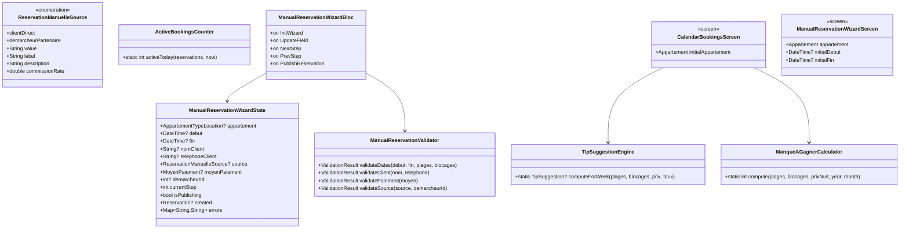
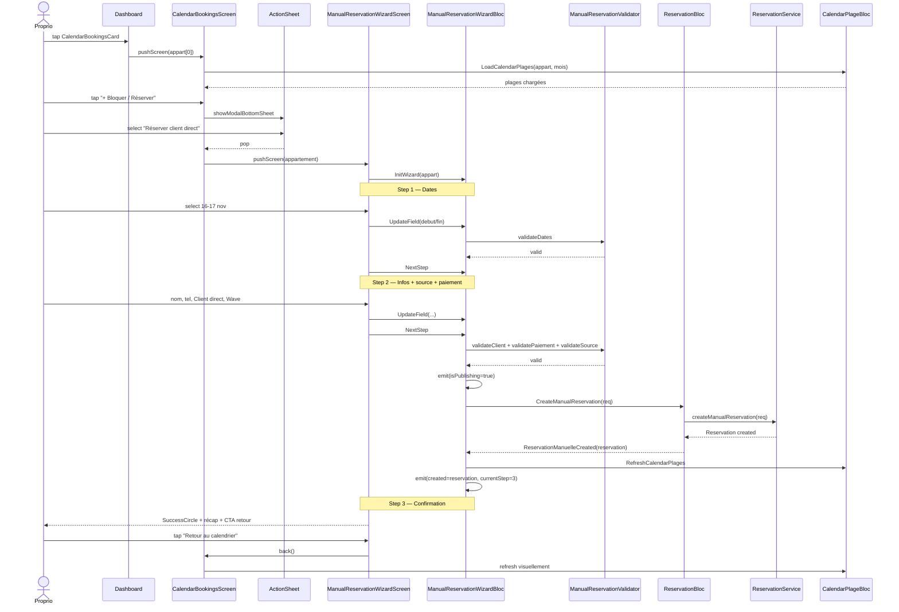

# 🏗️ Architecture — `calendrier-bookings-proprio`

> **Date :** 2026-05-15
> **Spec source :** `business-spec.md`
> **Mode :** Projet existant Flutter + BLoC + Hive

---

## 1. Vue d'ensemble

### 1.1 Objectif

Livrer un écran agenda global proprio (toutes annonces) avec stats, conseil intelligent, liste réservations du mois, + wizard 3 étapes de création de réservation manuelle, + card de point d'entrée sur le dashboard.

### 1.2 Composants impactés

| Couche | Composant | Action |
|---|---|---|
| **Dashboard** | `dashboard_screen.dart` | Insère `CalendarBookingsCard` après `ProprioKpiGrid` |
| **Widget Dashboard** | `CalendarBookingsCard` | **NOUVEAU** |
| **Écran** | `CalendarBookingsScreen` | **NOUVEAU** — orchestrateur multi-annonces |
| **Atoms écran** | 7 nouveaux widgets (chips, header, stats row, tip banner, bookings list, booking row, action sheet) | **NOUVEAUX** |
| **Wizard** | `ManualReservationWizardScreen` + 3 steps + atoms | **NOUVEAUX** |
| **BLoC** | `ManualReservationWizardBloc` (event + state + bloc) | **NOUVEAUX** |
| **Modèle** | `ReservationManuelleSource` enum + extension `MoyenPaiement` si besoin | **NOUVEAU** + audit |
| **Modèle Req** | `ReservationManuelleReq` — étendre avec `source`, `moyenPaiement`, `demarcheurId?` | **MODIFIÉ** |
| **Util** | `TipSuggestionEngine`, `ActiveBookingsCounter`, `ManqueAGagnerCalculator`, `ManualReservationValidator` | **NOUVEAUX** (purs, testables) |
| **Doc backend** | `BACKEND_NOTES_RESERVATION_DETAIL.md` | Ajouter section coord. nouveau payload (source + paiement + démarcheur) |

### 1.3 Nouvelles entités

- 1 enum : `ReservationManuelleSource` (2 valeurs)
- 4 utils purs (1 engine + 3 calculators/validator)
- 1 BLoC + event + state
- 1 écran principal + 1 écran wizard + 3 steps wizard
- 1 card dashboard + 7 atoms d'écran + 4 atoms wizard
- 1 ActionSheet + 1 Dialog block-période

---

## 2. Diagramme de classes



---

## 3. Diagramme de séquence — Création réservation manuelle



---

## 4. Structure des fichiers

```
lib/
├── model/
│   ├── enumeration/
│   │   └── reservation_manuelle_source.dart      ← NOUVEAU
│   └── request/
│       └── reservation_manuelle_req.dart         ← MODIFIÉ (source, moyenPaiement, demarcheurId)
│
├── util/
│   └── calc/
│       ├── tip_suggestion_engine.dart            ← NOUVEAU
│       ├── active_bookings_counter.dart          ← NOUVEAU
│       ├── manque_a_gagner_calculator.dart       ← NOUVEAU
│       └── manual_reservation_validator.dart     ← NOUVEAU
│
├── bloc/
│   └── manual_reservation_wizard_bloc/
│       ├── manual_reservation_wizard_bloc.dart   ← NOUVEAU
│       ├── manual_reservation_wizard_event.dart  ← NOUVEAU
│       └── manual_reservation_wizard_state.dart  ← NOUVEAU
│
└── screen/
    └── client/proprio/
        ├── home/
        │   ├── dashboard_screen.dart              ← MODIFIÉ (insère CalendarBookingsCard)
        │   └── widget/
        │       └── calendar_bookings_card.dart    ← NOUVEAU
        └── calendrier/
            ├── calendar_bookings_screen.dart      ← NOUVEAU (écran orchestrateur)
            ├── manual_reservation_wizard_screen.dart  ← NOUVEAU
            └── widget/
                ├── appartement_chips_row.dart     ← NOUVEAU
                ├── selected_appart_header.dart    ← NOUVEAU
                ├── calendar_stats_row.dart        ← NOUVEAU
                ├── calendar_stat_cell.dart        ← NOUVEAU (atom interne)
                ├── calendar_tip_banner.dart       ← NOUVEAU
                ├── month_bookings_list.dart       ← NOUVEAU
                ├── booking_row.dart               ← NOUVEAU
                ├── manual_reservation_action_sheet.dart  ← NOUVEAU
                ├── block_period_dialog.dart       ← NOUVEAU
                ├── step_dates.dart                ← NOUVEAU (wizard step 1)
                ├── step_client_info.dart          ← NOUVEAU (wizard step 2)
                ├── step_confirmation.dart         ← NOUVEAU (wizard step 3)
                ├── source_picker.dart             ← NOUVEAU (atom step 2)
                ├── payment_method_chips.dart      ← NOUVEAU (atom step 2)
                ├── reservation_recap_card.dart    ← NOUVEAU (atom step 2 + 3)
                └── demarcheur_picker_sheet.dart   ← NOUVEAU (atom step 2 si demarcheur)

test/
├── util/calc/
│   ├── tip_suggestion_engine_test.dart           ← NOUVEAU
│   ├── active_bookings_counter_test.dart         ← NOUVEAU
│   ├── manque_a_gagner_calculator_test.dart      ← NOUVEAU
│   └── manual_reservation_validator_test.dart    ← NOUVEAU
├── bloc/
│   └── manual_reservation_wizard_bloc_test.dart  ← NOUVEAU
└── model/enumeration/
    └── reservation_manuelle_source_test.dart     ← NOUVEAU
```

---

## 5. Interfaces / Contrats

### 5.1 Enum `ReservationManuelleSource`

```dart
enum ReservationManuelleSource {
  clientDirect('CLIENT_DIRECT'),
  demarcheurPartenaire('DEMARCHEUR_PARTENAIRE');

  const ReservationManuelleSource(this.value);
  final String value;

  String get label;       // 'Client direct', 'Démarcheur partenaire'
  String get description; // 'Pas de commission Asfar', 'Commission 10% au démarcheur'
  double get commissionRate; // 0.0, 0.10
  bool get requiresDemarcheur => this == demarcheurPartenaire;

  static ReservationManuelleSource? fromBackend(String? raw);
}
```

### 5.2 `ReservationManuelleReq` — étendu

```dart
class ReservationManuelleReq {
  final int appartId;
  final DateTime debut;
  final int duree;
  final String clientNom;
  final String clientTelephone;
  final String? clientEmail;
  final double montant;
  // NOUVEAU
  final ReservationManuelleSource source;
  final MoyenPaiement moyenPaiement;
  final int? demarcheurId; // requis si source = demarcheurPartenaire

  // toJson() inclut tous les champs avec naming serveur (à confirmer backend)
}
```

> ⚠️ Coord backend : si le backend ne supporte pas encore `source/moyenPaiement/demarcheurId`, Flutter envoie quand même les champs (default safe côté serveur ignorera). Documenter dans `BACKEND_NOTES_RESERVATION_DETAIL.md`.

### 5.3 Util `TipSuggestionEngine`

```dart
class TipSuggestion {
  final int joursOuvrables;  // N max recommandé
  final int gainPotentielFcfa; // X
  final String message;       // texte formatté

  const TipSuggestion({...});
}

class TipSuggestionEngine {
  TipSuggestionEngine._();

  static const int seuilJoursLibres = 4;
  static const double tauxOccupationMoyenFallback = 0.70;

  /// Calcule la suggestion pour la semaine courante (lundi → dimanche).
  /// Retourne `null` si pas de suggestion à montrer (< seuilJoursLibres).
  static TipSuggestion? computeForCurrentWeek({
    required List<CalendarPlage> plages,
    required List<DateTimeRange> blocages,
    required int prixNuit,
    double? tauxOccupationHistorique,
    DateTime? now,
  });
}
```

### 5.4 Util `ActiveBookingsCounter`

```dart
class ActiveBookingsCounter {
  ActiveBookingsCounter._();

  /// Compte les réservations confirmées dont la période contient `now`.
  /// (debut <= now < fin) ET statut == CONFIRMÉ.
  static int activeToday(
    List<Reservation> reservations, {
    DateTime? now,
  });
}
```

### 5.5 Util `ManqueAGagnerCalculator`

```dart
class ManqueAGagnerCalculator {
  ManqueAGagnerCalculator._();

  /// (joursLibres + joursBloqués) × prixNuit pour un mois donné.
  static int computeForMonth({
    required List<CalendarPlage> plages,
    required List<DateTimeRange> blocages,
    required int prixNuit,
    required int year,
    required int month,
  });
}
```

### 5.6 Util `ManualReservationValidator`

```dart
class ManualReservationValidator {
  ManualReservationValidator._();

  /// Vérifie qu'aucun chevauchement avec plages existantes ni blocages.
  /// Dates passées autorisées.
  static ValidationResult validateDates(
    DateTime? debut,
    DateTime? fin,
    List<CalendarPlage> plages,
    List<DateTimeRange> blocages,
  );

  /// Nom et téléphone non vides après trim. Téléphone format CI minimal.
  static ValidationResult validateClient(String? nom, String? telephone);

  /// Source non null. Si demarcheurPartenaire → demarcheurId non null.
  static ValidationResult validateSource(
    ReservationManuelleSource? source,
    int? demarcheurId,
  );

  /// MoyenPaiement non null.
  static ValidationResult validatePaiement(MoyenPaiement? moyen);
}
```

### 5.7 BLoC wizard

```dart
abstract class ManualReservationWizardEvent {}
class InitWizard extends ManualReservationWizardEvent {
  final Appartement appartement;
  final DateTime? initialDebut;
  final DateTime? initialFin;
}
class UpdateField extends ManualReservationWizardEvent {
  final String field;
  final dynamic value;
}
class NextStep extends ManualReservationWizardEvent {}
class PrevStep extends ManualReservationWizardEvent {}
class PublishReservation extends ManualReservationWizardEvent {}

class ManualReservationWizardState {
  final Appartement? appartement;
  final DateTime? debut;
  final DateTime? fin;
  final String? nomClient;
  final String? telephoneClient;
  final ReservationManuelleSource? source;
  final MoyenPaiement? moyenPaiement;
  final int? demarcheurId;
  final int currentStep; // 1, 2, 3
  final int totalSteps; // 3
  final bool isPublishing;
  final Reservation? created;
  final Map<String, String> errors;
  final String? errorMessage;
}
```

Particularités :
- **Pas d'auto-save Hive** (validé en spec).
- Le bloc dispatche `CreateManualReservation` sur `ReservationBloc` à `PublishReservation`. Il observe la complétion via callback (state émis par `ReservationBloc.ReservationManuelleCreated`).
- Le wizard utilise `BlocListener<ReservationBloc>` pour réagir au succès/échec.

### 5.8 `CalendarBookingsScreen` orchestrateur

```dart
class CalendarBookingsScreen extends StatefulWidget {
  final int? initialAppartementId;  // null = 1ère annonce
  const CalendarBookingsScreen({super.key, this.initialAppartementId});
}
```

State :
- `Appartement _selected` — annonce sélectionnée
- `DateTime _currentMonth` — mois affiché
- Dispatch `LoadCalendarPlages` + `LoadAvailability` à chaque switch d'annonce ou mois

Le screen consomme `AppartementBloc`, `ReservationBloc`, `CalendarPlageBloc`, `AvailabilityBloc`. Tous existants dans le `MultiProvider` global → pas besoin de BlocProvider local.

### 5.9 `CalendarBookingsCard` (dashboard)

```dart
class CalendarBookingsCard extends StatelessWidget {
  final int activeBookingsCount;
  final VoidCallback onTap;
}
```

Layout : container `bgElev1`, padding 18, icône calendar (40px accentSoft circle), titre `Calendrier & bookings` (h3), sous-titre dynamique `N séjours en cours` (small text3). InkWell sur tout. Cohérent avec proto image 1.

---

## 6. UI — Pixel fidélité au proto

| Écran | Pixel-fidélité |
|---|---|
| Card dashboard | Container `bgElev1` + circle icon + 2 lignes texte |
| Écran calendrier | AppBar `DynamicAppBar(eyebrow: 'TOUTES MES ANNONCES', title: 'Calendrier', trailing: CustomButton('+ Bloquer/Réserver'))`. Body scrollable : ChipsRow (sticky ?) + HeaderAnnonce + StatsRow (3 cells) + MiniCalendarGrid (réutilisé) + CalendarTipBanner + MonthBookingsList + CTA outlined + texte explicatif |
| ActionSheet | `showModalBottomSheet` avec 2 `ListTile` (icône + label + sous-titre) |
| BlockPeriodDialog | `Dialog` minimaliste : title + date range picker simple + Enregistrer/Annuler |
| Wizard step 1 | Header step indicator `ÉTAPE 1/3 · {annonce}` + titre `Nouvelle réservation` + sous-titre court + date range calendrier (réutilise `MiniCalendarGrid` mode "selection range") + CTA bottom |
| Wizard step 2 | Idem header + form : Nom, Téléphone (TextField simples), `SourcePicker` (2 `RadioListTile<Source>` dans `RadioGroup`), `PaymentMethodChips` (4 chips Wrap), `ReservationRecapCard` (table 2 lignes), CTA |
| Wizard step 3 | Header step indicator `ÉTAPE 3/3 · {annonce}` + titre `Nouvelle réservation` + `SuccessCircle` (réutilise `lib/widget/feedback/success_circle.dart`) + titre `Réservation enregistrée` + paragraphe + `ReservationRecapCard` (ref, logement, dates, total) + CTA `Retour au calendrier` |

> **Bug Container alignment** (cf. mémoire) : pas d'`alignment` sur Container dans les widgets qui peuvent finir dans Row+Expanded ou bottomNavigationBar.

---

## 7. CONTRAT D'IMPLÉMENTATION

> Ce contrat est la loi pour l'agent Dev.

### 7.1 Enums et Modèles

- [ ] **Créer** `lib/model/enumeration/reservation_manuelle_source.dart`
  - 2 valeurs : `clientDirect` (`'CLIENT_DIRECT'`), `demarcheurPartenaire` (`'DEMARCHEUR_PARTENAIRE'`)
  - Getters `label`, `description`, `commissionRate`, `requiresDemarcheur`
  - `fromBackend(String?)` strict

- [ ] **Vérifier** `lib/model/enumeration/moyen_paiement.dart` — doit avoir au moins 4 valeurs (Espèces, Wave, Orange Money, Virement). Si manque → étendre.

- [ ] **Modifier** `lib/model/request/reservation_manuelle_req.dart`
  - Ajouter champs `source: ReservationManuelleSource`, `moyenPaiement: MoyenPaiement`, `demarcheurId: int?`
  - Mettre à jour `toJson()` avec naming serveur (`source`, `moyenPaiement`, `demarcheurId`)

### 7.2 Utils

- [ ] **Créer** `lib/util/calc/tip_suggestion_engine.dart` — cf. §5.3. Constante `seuilJoursLibres = 4`. Retourne `null` si seuil non atteint. `TipSuggestion` immutable.

- [ ] **Créer** `lib/util/calc/active_bookings_counter.dart` — cf. §5.4. `now` injectable pour test.

- [ ] **Créer** `lib/util/calc/manque_a_gagner_calculator.dart` — cf. §5.5. Itère sur les jours du mois, exclut les jours occupés (CalendarPlage.statut != null), compte les jours libres + bloqués.

- [ ] **Créer** `lib/util/calc/manual_reservation_validator.dart` — cf. §5.6. 4 méthodes statiques retournant `ValidationResult` (réutilise la classe existante de `AppartementPublicationValidator`).

### 7.3 BLoC Wizard

- [ ] **Créer** `lib/bloc/manual_reservation_wizard_bloc/` (3 fichiers)
  - Event : `InitWizard`, `UpdateField`, `NextStep`, `PrevStep`, `PublishReservation`
  - State : `ManualReservationWizardState` immutable avec `copyWith`. Factory `initial()`.
  - Bloc : injection `ManualReservationValidator` + dispatch sur `ReservationBloc` au publish.

### 7.4 Écran principal

- [ ] **Créer** `lib/screen/client/proprio/calendrier/calendar_bookings_screen.dart`
  - StatefulWidget avec `_selectedAppartement`, `_currentMonth`
  - Consomme `AppartementBloc`, `CalendarPlageBloc`, `AvailabilityBloc`, `ReservationBloc`
  - Dispatch `LoadCalendarPlages` + `LoadAvailability` à chaque changement
  - Compose : `AppartementChipsRow`, `SelectedAppartHeader`, `CalendarStatsRow`, `MiniCalendarGrid` (réutilisé), `CalendarTipBanner`, `MonthBookingsList`
  - AppBar avec bouton `+ Bloquer / Réserver` → ouvre `ManualReservationActionSheet`

### 7.5 Atoms écran principal

- [ ] **Créer** `appartement_chips_row.dart` — `SingleChildScrollView` horizontal, Row de chips actives/inactives. Réutilise pattern `RoomsTypeCard` couleurs ou `ChargeFilterBar`.
- [ ] **Créer** `selected_appart_header.dart` — Container `bgElev1` + thumb (DomainImage ou placeholder), titre h3, sous-ligne `commune · prix/n`.
- [ ] **Créer** `calendar_stats_row.dart` — Row 3 `Expanded` avec `CalendarStatCell`.
- [ ] **Créer** `calendar_stat_cell.dart` — atom : eyebrow uppercase + valeur + tone color (danger/success/accent).
- [ ] **Créer** `calendar_tip_banner.dart` — Container `accentSoft` + icône `Icons.bolt_outlined` + texte avec spans bold sur les chiffres. Affiché conditionnellement (`TipSuggestion != null`).
- [ ] **Créer** `month_bookings_list.dart` — section avec header `Réservations du mois · N séjours` + ListView de `BookingRow`.
- [ ] **Créer** `booking_row.dart` — Container `bgElev1` Row : date verticale gauche (`accentSoft` rectangular badge), col centre (nom + source/démarcheur + statut badge), col droite (montant accent mono). Tap → `pushScreen(ReservationDetailScreen)`.

### 7.6 ActionSheet + Dialog blocage

- [ ] **Créer** `manual_reservation_action_sheet.dart`
  - Static `Future<ManualReservationAction?> show(context)`
  - `showModalBottomSheet` + 2 `ListTile` : « Bloquer une période » (Icons.lock_clock_outlined) + « Réserver pour un client direct » (Icons.person_add_alt_outlined).
  - enum local `ManualReservationAction { block, reserve }`

- [ ] **Créer** `block_period_dialog.dart`
  - Dialog avec date range picker (utilise `showDateRangePicker` Material ou custom léger)
  - Au valide → callback avec `(debut, fin)`
  - Caller dispatch `BlockPeriod(appartId, debut, fin)` sur `AvailabilityBloc` (event existant à vérifier ; sinon créer)

### 7.7 Wizard

- [ ] **Créer** `manual_reservation_wizard_screen.dart`
  - `BlocProvider<ManualReservationWizardBloc>` local + `_ManualReservationWizardView`
  - Header AppBar custom avec step indicator `ÉTAPE X/3 · {annonce}`
  - Body : switch sur `state.currentStep` → `StepDates` / `StepClientInfo` / `StepConfirmation`
  - `BlocListener<ReservationBloc>` pour passer step 2 → 3 au succès, afficher SnackBar à l'erreur
  - CTA bottom (réutilise pattern `WizardCtaBar` si possible)

- [ ] **Créer** `step_dates.dart` — calendrier date range. Utilise `MiniCalendarGrid` ou widget équivalent en mode sélection plage. Affiche jours occupés/bloqués en rouge non-tappable.

- [ ] **Créer** `step_client_info.dart` — form avec TextField nom + tel + `SourcePicker` + `PaymentMethodChips` + `ReservationRecapCard`.

- [ ] **Créer** `step_confirmation.dart` — `SuccessCircle` + titre + paragraphe avec interpolation `clientNom` + `ReservationRecapCard` + CTA `Retour au calendrier`.

- [ ] **Créer** `source_picker.dart` — `RadioGroup<ReservationManuelleSource>` avec 2 `RadioListTile`. Affiche `label` + `description` (commission).

- [ ] **Créer** `payment_method_chips.dart` — Wrap de 4 `ChoiceChip` (Espèces, Wave, Orange Money, Virement). Active = `accentSoft` + border accent.

- [ ] **Créer** `reservation_recap_card.dart` — Container `bgElev1`, table 2 lignes : `N nuits × prix/n = total` + `Vous recevez = total - commission`. Utilisé en step 2 (live) et step 3 (final).

- [ ] **Créer** `demarcheur_picker_sheet.dart` — `showModalBottomSheet` qui affiche la liste des démarcheurs partenaires (`PartenariatBloc.state.partenariats` filtré actifs). Empty state si aucun. Retourne `int? demarcheurId`.

### 7.8 Dashboard + intégration

- [ ] **Créer** `lib/screen/client/proprio/home/widget/calendar_bookings_card.dart` — cf. §5.9. Tap → `pushScreen(CalendarBookingsScreen)`.

- [ ] **Modifier** `lib/screen/client/proprio/home/dashboard_screen.dart`
  - Importer `CalendarBookingsCard` + `CalendarBookingsScreen` + `ActiveBookingsCounter`
  - Calculer `activeBookings = ActiveBookingsCounter.activeToday(reservations)` dans le builder
  - Insérer `CalendarBookingsCard` entre `ProprioKpiGrid` et `ProprioCashflowSection` (cf. proto image 1)

### 7.9 Documentation backend

- [ ] **Modifier** `BACKEND_NOTES_RESERVATION_DETAIL.md`
  - Ajouter section « Réservation manuelle — payload étendu »
  - Documenter les champs `source: enum`, `moyenPaiement: enum`, `demarcheurId: int?`
  - Préciser : si backend ne supporte pas encore ces champs → ignore silencieusement (Flutter envoie quand même).

### 7.10 Tests

- [ ] **Créer** `test/util/calc/tip_suggestion_engine_test.dart` — cas seuil atteint / non atteint / sans historique / calcul exact.
- [ ] **Créer** `test/util/calc/active_bookings_counter_test.dart` — multi-réservation chevauchant today / statuts variés / now injecté.
- [ ] **Créer** `test/util/calc/manque_a_gagner_calculator_test.dart` — jours libres + bloqués × prix, mois plein / partiel.
- [ ] **Créer** `test/util/calc/manual_reservation_validator_test.dart` — collision dates, client vide, source démarcheur sans démarcheurId, etc.
- [ ] **Créer** `test/bloc/manual_reservation_wizard_bloc_test.dart` — transitions step, dispatch CreateManualReservation, gestion succès/échec.
- [ ] **Créer** `test/model/enumeration/reservation_manuelle_source_test.dart` — value/label/commissionRate/fromBackend.

### 7.11 Conventions à respecter

- [ ] Aucune fonction privée retournant un `Widget`.
- [ ] Un widget = un fichier ; une classe par fichier (sauf data class privée locale).
- [ ] Aucun `alignment` sur `Container` dans un parent loose (cf. memory `feedback_container_alignment_bug.md`).
- [ ] Réutiliser `MiniCalendarGrid`, `CalendarLegend`, `DynamicAppBar`, `CustomButton`, `OutlinedCustomButton`, `InputField`, `SuccessCircle`, `DomainImage`, `FieldRow`.
- [ ] SOLID nouveau code : helpers statiques purs pour les règles métier (Engine, Counter, Calculator, Validator).
- [ ] Si endpoint backend `create-reservation-manuelle` accepte des champs supplémentaires → bien. Sinon, le serveur les ignorera (cf. doc backend).

---

## 8. Hors scope

- Card « + Nouvelle annonce » (déjà accessible via tab Annonces, hors brief).
- Notification SMS au client (côté serveur, non Flutter).
- Édition d'une réservation manuelle créée par ce wizard (déjà géré par `ReservationEditManuelleScreen` existant).
- Refonte de `ListingCalendarTab` (vue mono-annonce existante dans l'édition d'annonce — non touchée).
- Historique des suggestions Conseil (heuristique stateless V1).

---

## 9. Risques & Mitigations

| Risque | Mitigation |
|---|---|
| Backend ne supporte pas `source/moyenPaiement/demarcheurId` à temps | Flutter envoie quand même ; serveur ignore ; documenté. Tracking proprio fonctionne quand même via fields stockés Flutter-side. |
| Collision dates côté serveur malgré validation Flutter | Step 3 affiche erreur + retour step 1 (BlocListener<ReservationBloc>). |
| `MiniCalendarGrid` mode sélection range non supporté | Soit étendre le widget existant avec mode `selectionRange`, soit créer `DateRangePickerCalendar` parallèle. À trancher en dev — préférer l'extension si peu invasive. |
| `BlockPeriod` event manquant sur `AvailabilityBloc` | Vérifier en dev, créer si absent. |
| Test wizard complexe (multi-BLoC interactions) | Tester surtout les transitions et la validation, mocker `ReservationBloc` au minimum. |

---

## 10. UI_REQUIRED

**UI_REQUIRED: true** *(écran complet + wizard + card dashboard + 12 atoms)*

Surfaces touchées :
- Nouveau écran calendrier global (7 atoms + 2 modal)
- Nouveau wizard 3 étapes (3 steps + 4 atoms)
- Nouveau card dashboard + modification dashboard
- Pas de refonte UI existante (réutilisation maximale des atoms : MiniCalendarGrid, CustomButton, etc.)

→ L'orchestrateur doit appeler `/agent-uiux` à l'étape suivante pour valider le pixel-fidèle au proto et trancher quelques détails visuels (placement chips sticky ou non, mode range picker du calendar, etc.).
