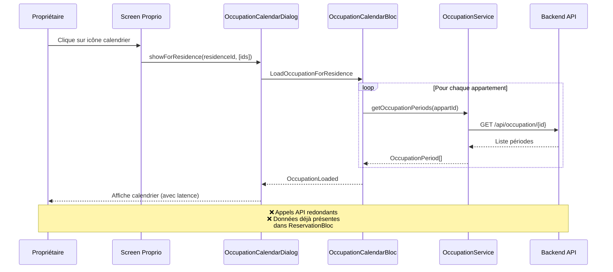
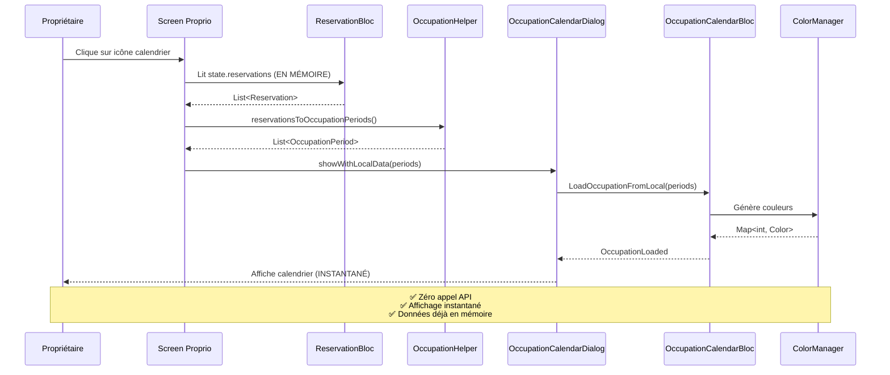

# 🏗️ Architecture - Optimisation Calendrier d'Occupation pour Propriétaires

**Date** : 2026-02-12
**Statut** : En attente de validation
**Agent** : Architecture
**Type** : Optimisation

---

## 1. Problème Identifié

### ❌ Situation actuelle (inefficace)
```
Propriétaire clique sur calendrier
      │
      ▼
OccupationCalendarDialog s'ouvre
      │
      ▼
Crée OccupationCalendarBloc
      │
      ▼
Événement: LoadOccupationForResidence
      │
      ▼
Appel API: GET /api/occupation/{id} (pour CHAQUE appartement)
      │
      ▼
Récupère les périodes d'occupation
      │
      ▼
Affiche le calendrier
```

**Problème :** Le propriétaire a **DÉJÀ** toutes ses réservations dans le `ReservationBloc` !
**Impact :** Appels API redondants, latence inutile, consommation réseau excessive

---

## 2. Solution Proposée

### ✅ Architecture optimisée

```
Propriétaire clique sur calendrier
      │
      ▼
Récupère les réservations depuis ReservationBloc (DÉJÀ EN MÉMOIRE)
      │
      ▼
Transforme Reservation → OccupationPeriod (côté parent)
      │
      ▼
OccupationCalendarDialog s'ouvre avec les données
      │
      ▼
Crée OccupationCalendarBloc
      │
      ▼
Événement: LoadOccupationFromLocal (NOUVEAU)
      │
      ▼
Génère les couleurs via ColorManager
      │
      ▼
Affiche le calendrier immédiatement (ZÉRO LATENCE)
```

**Avantages :**
- ✅ Zéro appel API redondant
- ✅ Affichage instantané (pas de latence réseau)
- ✅ Économie de bande passante
- ✅ Fonctionne hors ligne avec les données en cache

---

## 3. Diagramme de Séquence Comparatif

### AVANT (avec API - inefficace)



### APRÈS (avec données locales - optimisé)



---

## 4. Modifications Nécessaires

### 4.1 Nouveau Fichier : Helper de Transformation

**Fichier** : `lib/util/helper/occupation_helper.dart` (NOUVEAU)

```dart
import 'package:asfar/model/occupation/occupation_period.dart';
import 'package:asfar/model/reservation/reservation.dart';

/// Helper pour transformer des réservations en périodes d'occupation
class OccupationHelper {
  /// Transforme une liste de réservations en périodes d'occupation
  ///
  /// Filtre uniquement les réservations CONFIRMÉES (statut CONFIRMER)
  /// qui correspondent aux critères d'occupation réelle
  static List<OccupationPeriod> reservationsToOccupationPeriods(
    List<Reservation> reservations, {
    int? appartementId,
    List<int>? appartementIds,
  }) {
    // Filtrer les réservations pertinentes
    final filteredReservations = reservations.where((r) {
      // Vérifier le statut (uniquement CONFIRMER)
      if (r.statut != ReservationStatus.confirmee) return false;

      // Vérifier l'appartement si spécifié
      if (appartementId != null) {
        return r.appart?.id == appartementId;
      }

      // Vérifier la liste d'appartements si spécifiée
      if (appartementIds != null && appartementIds.isNotEmpty) {
        return r.appart?.id != null && appartementIds.contains(r.appart!.id);
      }

      return true;
    }).toList();

    // Transformer en OccupationPeriod
    return filteredReservations
        .where((r) => r.debut != null && r.fin != null && r.appart?.id != null)
        .map((r) => OccupationPeriod(
              appartementId: r.appart!.id!,
              reservationId: r.id,
              startDate: r.debut!,
              endDate: r.fin!,
              appartementName: r.appart?.nom,
            ))
        .toList();
  }
}
```

### 4.2 Nouveau Event

**Fichier** : `lib/bloc/occupation_calendar_bloc/occupation_calendar_event.dart` (MODIFIÉ)

Ajouter :
```dart
/// Charge l'occupation depuis des données locales (sans appel API)
/// Utilisé pour les propriétaires qui ont déjà les réservations en mémoire
class LoadOccupationFromLocal extends OccupationCalendarEvent {
  final List<OccupationPeriod> periods;
  final OccupationCalendarMode mode;
  final int month;
  final int year;

  LoadOccupationFromLocal({
    required this.periods,
    required this.mode,
    required this.month,
    required this.year,
  });
}
```

### 4.3 Nouveau Handler dans le BLoC

**Fichier** : `lib/bloc/occupation_calendar_bloc/occupation_calendar_bloc.dart` (MODIFIÉ)

Ajouter dans le constructeur :
```dart
on<LoadOccupationFromLocal>(_onLoadOccupationFromLocal);
```

Ajouter la méthode :
```dart
/// Charge l'occupation depuis des données locales (propriétaires)
void _onLoadOccupationFromLocal(
  LoadOccupationFromLocal event,
  Emitter<OccupationCalendarState> emit,
) {
  emit(OccupationLoading(
    periods: state.periods,
    colors: state.colors,
    focusedMonth: DateTime(event.year, event.month),
    mode: event.mode,
  ));

  try {
    // Filtrer les périodes pour le mois demandé
    final filteredPeriods = event.periods.where((period) {
      return period.startDate.year == event.year &&
             period.startDate.month == event.month;
    }).toList();

    // Générer les couleurs pour tous les appartements distincts
    final Map<int, Color> colors = {};
    final distinctApartmentIds = filteredPeriods
        .map((p) => p.appartementId)
        .toSet();

    for (final appartId in distinctApartmentIds) {
      colors[appartId] = _colorManager.getColorForApartment(appartId);
    }

    emit(OccupationLoaded(
      periods: filteredPeriods,
      colors: colors,
      focusedMonth: DateTime(event.year, event.month),
      mode: event.mode,
    ));

    deboger([
      '[OccupationCalendarBloc] Occupation chargée depuis données locales: ${filteredPeriods.length} période(s)'
    ]);
  } catch (e) {
    ErrorHandler.logError("LOAD_OCCUPATION_FROM_LOCAL", e);
    final errorMessage = ErrorHandler.extractGenericErrorMessage(e);
    emit(OccupationError(
      message: errorMessage,
      periods: state.periods,
      colors: state.colors,
      focusedMonth: DateTime(event.year, event.month),
      mode: event.mode,
    ));
  }
}
```

### 4.4 Modification du Dialog

**Fichier** : `lib/widget/dialog/occupation_calendar_dialog.dart` (MODIFIÉ)

Ajouter un paramètre optionnel :
```dart
class OccupationCalendarDialog extends StatelessWidget {
  const OccupationCalendarDialog({
    super.key,
    required this.mode,
    this.appartementId,
    this.residenceId,
    this.appartementIds = const [],
    this.localPeriods, // NOUVEAU - périodes d'occupation locales
    this.onOccupiedPeriodTapped,
    this.initialMonth,
    this.initialYear,
  });

  final List<OccupationPeriod>? localPeriods; // NOUVEAU

  // ... autres propriétés
```

Modifier la logique de création du BLoC :
```dart
create: (context) {
  final bloc = OccupationCalendarBloc();

  // Si des périodes locales sont fournies, les utiliser (mode proprio optimisé)
  if (localPeriods != null) {
    bloc.add(LoadOccupationFromLocal(
      periods: localPeriods!,
      mode: mode,
      month: month,
      year: year,
    ));
  }
  // Sinon, charger depuis l'API (mode locataire classique)
  else if (mode == OccupationCalendarMode.apartment) {
    bloc.add(LoadOccupation(
      appartementId: appartementId!,
      month: month,
      year: year,
    ));
  } else {
    bloc.add(LoadOccupationForResidence(
      residenceId: residenceId!,
      appartementIds: appartementIds,
      month: month,
      year: year,
    ));
  }

  return bloc;
},
```

Ajouter nouvelle méthode statique optimisée :
```dart
/// Affiche le dialog avec des données locales (optimisé pour propriétaires)
static Future<void> showWithLocalData({
  required BuildContext context,
  required List<OccupationPeriod> periods,
  required OccupationCalendarMode mode,
  Function(DateTime)? onOccupiedPeriodTapped,
  int? initialMonth,
  int? initialYear,
}) async {
  await showDialog(
    context: context,
    builder: (context) => OccupationCalendarDialog(
      mode: mode,
      localPeriods: periods,
      onOccupiedPeriodTapped: onOccupiedPeriodTapped,
      initialMonth: initialMonth,
      initialYear: initialYear,
    ),
  );
}
```

### 4.5 Modification des Screens Propriétaires

**Fichier** : `lib/screen/client/proprio/appartements/proprio_appart_detail_screen.dart` (MODIFIÉ)

```dart
void _openOccupationCalendar(BuildContext context, Appartement appartement) {
  // Récupérer les réservations depuis le BLoC
  final reservationState = context.read<ReservationBloc>().state;
  final reservations = reservationState.reservations;

  // Transformer en périodes d'occupation
  final periods = OccupationHelper.reservationsToOccupationPeriods(
    reservations,
    appartementId: appartement.id,
  );

  // Afficher avec données locales (optimisé)
  OccupationCalendarDialog.showWithLocalData(
    context: context,
    periods: periods,
    mode: OccupationCalendarMode.apartment,
    onOccupiedPeriodTapped: (date) {
      // TODO: Navigation vers détails de la réservation
    },
  );
}
```

**Fichier** : `lib/screen/client/proprio/residences/residence_detail_screen.dart` (MODIFIÉ)

```dart
void _openOccupationCalendar(BuildContext context, Residence residence) {
  final appartementState = context.read<AppartementBloc>().state;
  List<int> appartementIds = [];

  // Récupérer les IDs des appartements
  if (appartementState is ProprietaireAppartementsLoaded) {
    appartementIds = appartementState.appartements
        .where((a) => a.residenceId == residence.id)
        .map((a) => a.id!)
        .toList();
  } else if (appartementState is AppartementOperationSuccess) {
    appartementIds = appartementState.appartements
        .where((a) => a.residenceId == residence.id)
        .map((a) => a.id!)
        .toList();
  }

  // Récupérer les réservations depuis le BLoC
  final reservationState = context.read<ReservationBloc>().state;
  final reservations = reservationState.reservations;

  // Transformer en périodes d'occupation
  final periods = OccupationHelper.reservationsToOccupationPeriods(
    reservations,
    appartementIds: appartementIds,
  );

  // Afficher avec données locales (optimisé)
  OccupationCalendarDialog.showWithLocalData(
    context: context,
    periods: periods,
    mode: OccupationCalendarMode.residence,
    onOccupiedPeriodTapped: (date) {
      // TODO: Navigation vers détails de la réservation
    },
  );
}
```

---

## 5. Structure des Fichiers

```
lib/
├── util/
│   └── helper/
│       └── occupation_helper.dart                  [NOUVEAU]
│
├── bloc/
│   └── occupation_calendar_bloc/
│       ├── occupation_calendar_event.dart          [MODIFIÉ - +1 event]
│       └── occupation_calendar_bloc.dart           [MODIFIÉ - +1 handler]
│
├── widget/
│   └── dialog/
│       └── occupation_calendar_dialog.dart         [MODIFIÉ - +localPeriods param]
│
└── screen/
    └── client/
        └── proprio/
            ├── appartements/
            │   └── proprio_appart_detail_screen.dart [MODIFIÉ - utilise helper]
            └── residences/
                └── residence_detail_screen.dart      [MODIFIÉ - utilise helper]
```

---

## 6. Matrice de Décision : API vs Local

| Contexte | Utilisateur | Source de données | Méthode utilisée |
|----------|-------------|-------------------|------------------|
| Calendrier d'occupation | **Locataire** | API (pas accès aux réservations) | `LoadOccupation` / `LoadOccupationForResidence` |
| Calendrier d'occupation | **Propriétaire** | ReservationBloc (déjà en mémoire) | `LoadOccupationFromLocal` |
| Sélection de dates (DateItem) | **Locataire** | API (vérifier disponibilité) | `LoadOccupation` |

---

## 7. Comparaison Performance

### Scénario : Propriétaire ouvre le calendrier d'une résidence avec 10 appartements

| Métrique | AVANT (API) | APRÈS (Local) | Amélioration |
|----------|-------------|---------------|--------------|
| Appels API | 10 requêtes | 0 requête | **-100%** |
| Latence réseau | ~2-5 secondes | 0 ms | **Instantané** |
| Données transférées | ~50 KB | 0 KB | **-100%** |
| Complexité BLoC | Moyenne | Simple | **+Simplification** |
| Fonctionne hors ligne | ❌ Non | ✅ Oui | **+Résilience** |

---

## 8. Avantages et Inconvénients

### ✅ Avantages

1. **Performance**
   - Affichage instantané (pas de latence réseau)
   - Zéro appel API redondant
   - Économie de bande passante

2. **Expérience Utilisateur**
   - Réactivité immédiate
   - Fonctionne hors ligne avec les données en cache
   - Cohérence avec les données déjà affichées

3. **Architecture**
   - Réutilisation des données déjà chargées
   - Séparation claire : API pour locataires, local pour proprios
   - Helper réutilisable pour transformation

4. **Coûts**
   - Réduction de la charge serveur
   - Économie de bande passante

### ⚠️ Points d'Attention

1. **Synchronisation**
   - Dépend de la fraîcheur des données dans ReservationBloc
   - Si les réservations ne sont pas à jour, le calendrier ne le sera pas non plus
   - **Solution** : ReservationBloc doit déjà recharger périodiquement

2. **Filtrage des réservations**
   - Ne considère que les réservations CONFIRMÉES
   - **Règle métier** : Seules les réservations confirmées apparaissent sur le calendrier

---

## 9. Plan d'Implémentation

### Étape 1 : Créer OccupationHelper
- Créer `lib/util/helper/occupation_helper.dart`
- Implémenter la transformation Reservation → OccupationPeriod
- Tester la transformation

### Étape 2 : Modifier le BLoC
- Ajouter événement `LoadOccupationFromLocal`
- Ajouter handler `_onLoadOccupationFromLocal`
- Tester le chargement local

### Étape 3 : Modifier le Dialog
- Ajouter paramètre `localPeriods`
- Modifier la logique de création du BLoC
- Ajouter méthode `showWithLocalData()`

### Étape 4 : Modifier les Screens Proprio
- Modifier `proprio_appart_detail_screen.dart`
- Modifier `residence_detail_screen.dart`
- Utiliser le helper et la nouvelle méthode

### Étape 5 : Tests
- Vérifier que le calendrier s'affiche instantanément
- Vérifier que les couleurs sont cohérentes
- Vérifier que le mode locataire continue de fonctionner (API)

---

## 10. Résumé Technique

**Complexité** : 🟡 MOYENNE

**Effort estimé** : 1-2 heures

**Fichiers** :
- ✅ 1 nouveau fichier (helper)
- ✅ 4 fichiers modifiés

**Tests requis** :
- Tests unitaires pour OccupationHelper
- Tests manuels pour les propriétaires
- Tests de non-régression pour les locataires

**Impact** :
- ✅ +100% performance pour propriétaires
- ✅ Zéro impact pour locataires (continue d'utiliser l'API)
- ✅ Architecture plus robuste et flexible
