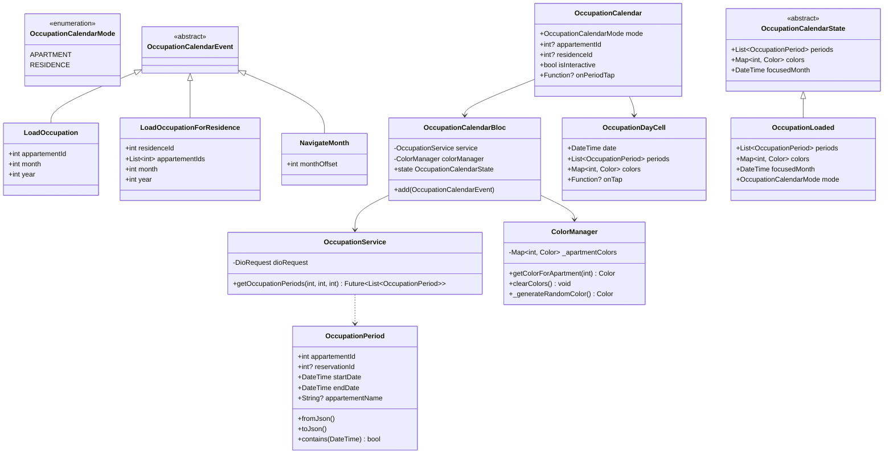
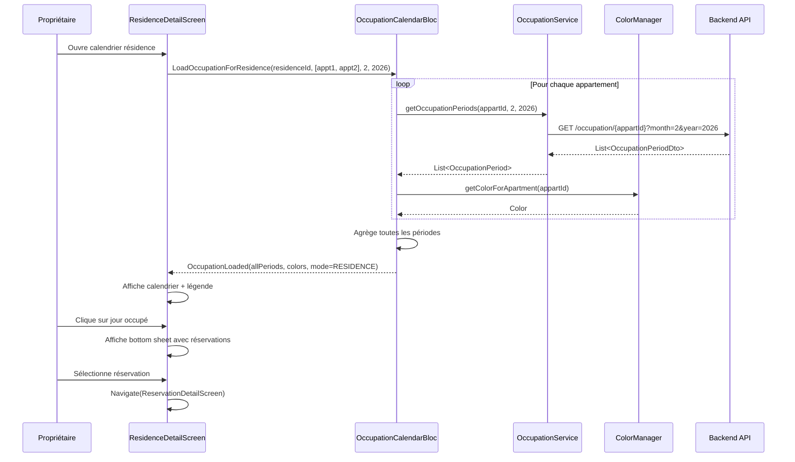

# 🏗️ Architecture : Calendrier Intelligent d'Occupation

**Date :** 2026-02-12
**Agent :** Architecture
**Statut :** En validation

---

## 1. Analyse du Projet

### 1.1 Environnement Détecté

- **Framework :** Flutter 3.7.0+
- **Langage :** Dart ^3.7.0
- **Architecture :** BLoC Pattern (flutter_bloc ^9.1.1)
- **Stockage :** Hive (local) + API REST
- **HTTP Client :** Dio ^5.8.0

### 1.2 Conventions Observées

| Aspect | Convention |
|--------|-----------|
| **Nommage fichiers** | snake_case (ex: `occupation_calendar.dart`) |
| **Nommage classes** | PascalCase (ex: `OccupationCalendarBloc`) |
| **Structure BLoC** | `bloc_name_bloc/` contenant `bloc.dart`, `event.dart`, `state.dart` |
| **Services** | `lib/service/model/{domain}/{domain}_service.dart` |
| **Models** | `lib/model/{domain}/{entity}.dart` |
| **Widgets** | `lib/widget/{category}/{widget_name}.dart` |
| **Screens** | `lib/screen/client/{role}/{feature}/` |

### 1.3 Patterns Existants

- **Singleton Services** : `StorageService.instance`, `AuthManager.instance`
- **BLoC Events** : Classes immutables avec `sealed` ou `abstract`
- **BLoC States** : Hiérarchie avec état de base abstrait
- **Models** : `fromJson()` / `toJson()` pour sérialisation
- **Widgets** : Composants réutilisables dans `lib/widget/`
- **Style centralisé** : `Style.primaryColor`, `Style.foregroundColor`, etc.

### 1.4 Composant Similaire Existant

**AvailabilityCalendar** :
- Calendrier mensuel pour propriétaire
- Permet de bloquer/débloquer des dates
- Affiche dates réservées et bloquées
- Pattern à réutiliser pour cohérence

---

## 2. Architecture Métier

### 2.1 Entités / Concepts

| Entité | Responsabilité | Relations |
|--------|----------------|-----------|
| **OccupationPeriod** | Représente une période occupée (réservation confirmée) | Liée à Appartement + Reservation |
| **ApartmentColor** | Associe une couleur à un appartement durant la session | Mappé par appartementId |
| **OccupationDay** | Représente un jour avec ses périodes occupées | Contient List<OccupationPeriod> |
| **OccupationCalendarMode** | Enum : APARTMENT ou RESIDENCE | Définit le mode d'affichage |

### 2.2 Règles Métier

| ID | Règle | Implémentation |
|---|---|---|
| RM1 | Seules réservations confirmées | Filtrer par `ReservationStatus.confirmee` |
| RM2 | Vue mensuelle | Affichage d'un mois complet avec navigation |
| RM3 | Deux modes d'affichage | `OccupationCalendarMode.apartment` ou `.residence` |
| RM4 | Mode résidence = proprio seul | Vérification du rôle utilisateur |
| RM5 | Bande de couleur fine | Widget personnalisé pour chaque jour |
| RM6 | Couleur persistante en session | ColorManager conserve le mapping en mémoire |
| RM7 | Dates occupées non sélectionnables (locataire) | Désactiver `onTap` si date occupée |
| RM8 | API plages d'occupation | Endpoint GET `/occupation/{appartementId}?month=X&year=Y` |

### 2.3 Relations

```
Reservation (statut=CONFIRMER)
    ↓
OccupationPeriod (debut, fin, appartementId)
    ↓
OccupationDay (date, List<OccupationPeriod>)
    ↓
OccupationCalendar Widget
```

---

## 3. Architecture Fonctionnelle

### 3.1 Modules / Composants

| Module | Responsabilité | Dépendances |
|--------|----------------|-------------|
| **OccupationCalendarBloc** | Gestion état calendrier d'occupation | OccupationService, ColorManager |
| **OccupationService** | API pour récupérer plages d'occupation | DioRequest |
| **ColorManager** | Génération et persistance couleurs en session | Aucune (Singleton) |
| **OccupationCalendar** | Widget calendrier réutilisable | OccupationCalendarBloc |
| **OccupationDayCell** | Widget cellule de jour avec bandes de couleur | Aucune |

### 3.2 Flux de Données

#### Flux 1 : Chargement du calendrier (Locataire - 1 appartement)

```
1. User → Accède à détail appartement
2. Screen → LoadOccupation(appartementId, month, year)
3. OccupationCalendarBloc → OccupationService.getOccupationPeriods(appartementId, month, year)
4. OccupationService → API GET /occupation/{appartementId}?month=X&year=Y
5. API → Retourne List<OccupationPeriodDto>
6. OccupationService → Convertit en List<OccupationPeriod>
7. ColorManager → Génère couleur pour appartementId (si non existante)
8. OccupationCalendarBloc → Emit OccupationLoaded(periods, colors)
9. OccupationCalendar → Affiche calendrier avec bandes de couleur
```

#### Flux 2 : Chargement du calendrier (Propriétaire - Résidence)

```
1. Proprio → Accède au calendrier de sa résidence
2. Screen → LoadOccupationForResidence(residenceId, month, year)
3. OccupationCalendarBloc → Récupère liste des appartements de la résidence
4. Pour chaque appartement :
   4.1. OccupationService.getOccupationPeriods(appartId, month, year)
   4.2. ColorManager.getColorForApartment(appartId)
5. OccupationCalendarBloc → Agrège toutes les périodes
6. Emit OccupationLoaded(allPeriods, colors)
7. OccupationCalendar → Affiche avec légende des couleurs
```

#### Flux 3 : Clic sur période occupée (Propriétaire)

```
1. Proprio → Clique sur jour occupé
2. OccupationDayCell → onTap(date)
3. Si plusieurs périodes sur ce jour → Afficher bottom sheet avec liste
4. Proprio sélectionne une période → showReservationDetails(reservationId)
5. Affiche détails réservation
6. Bouton "Voir réservation complète" → Navigator.push(ReservationDetailScreen)
```

### 3.3 Interfaces / Contrats

```dart
/// Service API
abstract class IOccupationService {
  Future<List<OccupationPeriod>> getOccupationPeriods({
    required int appartementId,
    required int month,
    required int year,
  });
}

/// Gestion des couleurs
abstract class IColorManager {
  Color getColorForApartment(int appartementId);
  void clearColors(); // Appelé à la déconnexion
}
```

---

## 4. Plan d'Implémentation

### 4.1 Fichiers à Créer

```
lib/
├── model/
│   └── occupation/
│       ├── occupation_period.dart          # Entité période occupée
│       └── occupation_calendar_mode.dart   # Enum mode calendrier
│
├── bloc/
│   └── occupation_calendar_bloc/
│       ├── occupation_calendar_bloc.dart   # BLoC principal
│       ├── occupation_calendar_event.dart  # Events
│       └── occupation_calendar_state.dart  # States
│
├── service/
│   ├── model/
│   │   └── occupation/
│   │       └── occupation_service.dart     # API occupation
│   └── color/
│       └── color_manager.dart              # Gestion couleurs session
│
└── widget/
    └── calendar/
        ├── occupation_calendar.dart        # Widget calendrier principal
        ├── occupation_day_cell.dart        # Cellule de jour
        └── occupation_legend.dart          # Légende des couleurs
```

### 4.2 Fichiers à Modifier

| Fichier | Modification |
|---------|--------------|
| `lib/main.dart` | Ajouter `OccupationCalendarBloc` au MultiProvider |
| `lib/service/auth/auth_manager.dart` | Appeler `ColorManager.instance.clearColors()` au logout |
| `lib/screen/client/locataire/booking/appartement_detail_screen.dart` | Intégrer `OccupationCalendar` (mode APARTMENT) |
| `lib/screen/client/proprio/residences/residence_detail_screen.dart` | Ajouter onglet/section calendrier (mode RESIDENCE) |

### 4.3 Ordre d'Implémentation

1. **Phase 1 : Modèles et Services**
   - Créer `OccupationPeriod` (model)
   - Créer `OccupationCalendarMode` (enum)
   - Créer `ColorManager` (singleton)
   - Créer `OccupationService` (API)
   - **Raison** : Foundation avant logique BLoC

2. **Phase 2 : BLoC**
   - Créer `OccupationCalendarEvent` (events)
   - Créer `OccupationCalendarState` (states)
   - Créer `OccupationCalendarBloc` (logique)
   - **Raison** : State management avant UI

3. **Phase 3 : Widgets**
   - Créer `OccupationDayCell` (composant de base)
   - Créer `OccupationLegend` (légende)
   - Créer `OccupationCalendar` (widget principal)
   - **Raison** : Du plus petit au plus grand composant

4. **Phase 4 : Intégration**
   - Intégrer dans écran locataire (détail appartement)
   - Intégrer dans écran propriétaire (résidence)
   - Tester les deux modes
   - **Raison** : UI complète avant tests

5. **Phase 5 : Tests & Cleanup**
   - Nettoyer couleurs au logout
   - Gérer cas d'erreur
   - Vérifier performance (limite 2s)
   - **Raison** : Polissage final

### 4.4 Composant UI Nécessaire

**✅ OUI** - Il s'agit d'un composant visuel calendrier avec :
- Interaction tactile (clic sur jour)
- Affichage multi-couleurs
- Navigation mensuelle
- Légende dynamique

→ **Agent UI/UX requis** pour définir l'intégration dans les écrans existants.

---

## 5. Diagrammes

### 5.1 Diagramme de Classes



### 5.2 Diagramme de Séquence : Chargement Calendrier Résidence



---

## 6. Spécifications Techniques

### 6.1 API Backend (à implémenter côté serveur)

#### Endpoint : GET `/api/occupation/{appartementId}`

**Paramètres Query :**
- `month` (int, required) : Mois (1-12)
- `year` (int, required) : Année (ex: 2026)

**Réponse (200 OK) :**
```json
{
  "appartementId": 123,
  "month": 2,
  "year": 2026,
  "periods": [
    {
      "reservationId": 456,
      "startDate": "2026-02-05",
      "endDate": "2026-02-10",
      "appartementName": "Appt A1"
    },
    {
      "reservationId": 789,
      "startDate": "2026-02-15",
      "endDate": "2026-02-20",
      "appartementName": "Appt A1"
    }
  ]
}
```

**Règles serveur :**
- Retourner uniquement les réservations avec `statut = 'CONFIRMER'`
- Filtrer par `debut >= first_day_of_month` et `fin <= last_day_of_month`

### 6.2 ColorManager - Algorithme de Génération

```dart
Color _generateRandomColor() {
  final random = Random();
  // Générer une couleur vive et contrastée
  final hue = random.nextDouble() * 360;
  final saturation = 0.6 + random.nextDouble() * 0.3; // 60-90%
  final lightness = 0.4 + random.nextDouble() * 0.2;  // 40-60%
  return HSLColor.fromAHSL(1.0, hue, saturation, lightness).toColor();
}
```

**Contraintes :**
- Minimum 6 couleurs distinctes
- Éviter couleurs trop claires (lisibilité)
- Persistance en session via `Map<int, Color>` en mémoire

### 6.3 Bande de Couleur - Rendu Visuel

Chaque jour occupé affiche **une ou plusieurs bandes fines horizontales** :

```dart
// Pseudo-code
Container(
  height: 36, // Hauteur cellule jour
  child: Column(
    children: [
      // Numéro du jour
      Text('15'),
      // Bandes de couleur
      Row(
        children: periods.map((period) =>
          Container(
            width: 36 / periods.length, // Largeur proportionnelle
            height: 4, // Épaisseur bande
            color: colors[period.appartementId],
          )
        ).toList(),
      ),
    ],
  ),
)
```

**Cas multi-appartements :**
- Si 2 appartements occupés le même jour → 2 bandes côte à côte
- Si 3+ appartements → Bandes plus fines ou empilées

---

## 7. Gestion des Cas Limites

| Cas Limite | Solution |
|------------|----------|
| **Aucune réservation** | Calendrier vide, aucune bande de couleur |
| **Résidence avec 10+ appartements** | Limiter affichage à 5 couleurs max, rest = gris + tooltip |
| **Même jour = 5+ appartements** | Empiler bandes ou afficher indicateur "+3" |
| **API timeout** | Afficher message erreur + calendrier grisé |
| **Navigation rapide entre mois** | Debounce requêtes API (300ms) |
| **Locataire tente mode RESIDENCE** | Bloquer au niveau UI, message d'erreur |

---

## 8. Performance

### 8.1 Optimisations

- **Cache local** : Stocker périodes chargées en mémoire (BLoC state)
- **Lazy loading** : Charger uniquement mois affiché
- **Debounce navigation** : Éviter spam clics sur flèches mois
- **Color pooling** : Réutiliser couleurs existantes en session

### 8.2 Contraintes

- **Temps chargement** : < 2 secondes (spéc métier)
- **Requêtes API** : 1 par appartement max par mois
- **Mémoire** : ColorManager limité à 100 couleurs max en session

---

## 9. Sécurité

| Aspect | Mesure |
|--------|--------|
| **Autorisation résidence** | API vérifie que proprio possède la résidence |
| **Données sensibles** | Ne pas exposer infos locataire au locataire visiteur |
| **Validation input** | Vérifier month (1-12), year (>= 2020) |

---

## 10. Tests à Prévoir

### 10.1 Tests Unitaires

- `OccupationPeriod.contains()` avec différentes dates
- `ColorManager.getColorForApartment()` génère couleur unique
- `OccupationService.getOccupationPeriods()` parse JSON correctement
- `OccupationCalendarBloc` émet bons états selon events

### 10.2 Tests Widget

- `OccupationCalendar` affiche 28-31 jours selon mois
- `OccupationDayCell` affiche bandes de couleur correctes
- Navigation mois précédent/suivant fonctionne
- Clic sur jour occupé (proprio) ouvre bottom sheet

### 10.3 Tests Intégration

- Chargement calendrier appartement (locataire)
- Chargement calendrier résidence (proprio)
- Persistance couleurs durant session
- Nettoyage couleurs au logout

---

## 11. Checklist Architecture

### Principes

- [x] **Modularité** : 4 modules distincts (BLoC, Service, ColorManager, Widgets)
- [x] **Cohésion** : Chaque module a responsabilité unique et claire
- [x] **Couplage** : Dépendances minimales (ColorManager sans dépendances)
- [x] **SoC** : Séparation UI (widgets) / Logique (BLoC) / Data (Service)
- [x] **SOLID** :
  - **S** : OccupationService = API only, ColorManager = colors only
  - **O** : Extensible via modes (ajout mode WEEK possible)
  - **L** : Pas de hiérarchie complexe
  - **I** : Interfaces IOccupationService, IColorManager
  - **D** : BLoC dépend d'interfaces, pas implémentations
- [x] **DRY** : Réutilise structure AvailabilityCalendar
- [x] **KISS** : Solution simple, pas de sur-ingénierie
- [x] **YAGNI** : Uniquement fonctionnalités demandées (pas d'export, pas de vues multiples)

### Adaptation

- [x] **Conventions** : Respect snake_case, PascalCase, structure BLoC
- [x] **Structure** : S'intègre dans lib/bloc/, lib/service/, lib/widget/
- [x] **Patterns** : Suit pattern BLoC existant, Singleton pour ColorManager
- [x] **Réutilisation** : S'inspire de AvailabilityCalendar, réutilise ReservationStatus

---

## 12. Prochaines Étapes

1. ✅ Architecture validée → Passer à Agent UI/UX
2. Agent UI/UX → Proposer intégration visuelle dans écrans locataire/proprio
3. Agent Flutter Dev → Implémenter selon architecture + UI validés
4. Agent Audit → Valider qualité code
5. Agent Documentation → Générer doc HTML

---

**Prêt pour validation humaine.**
