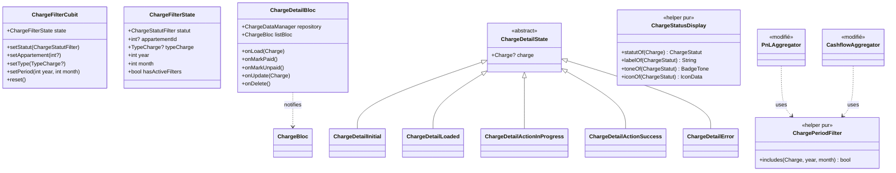
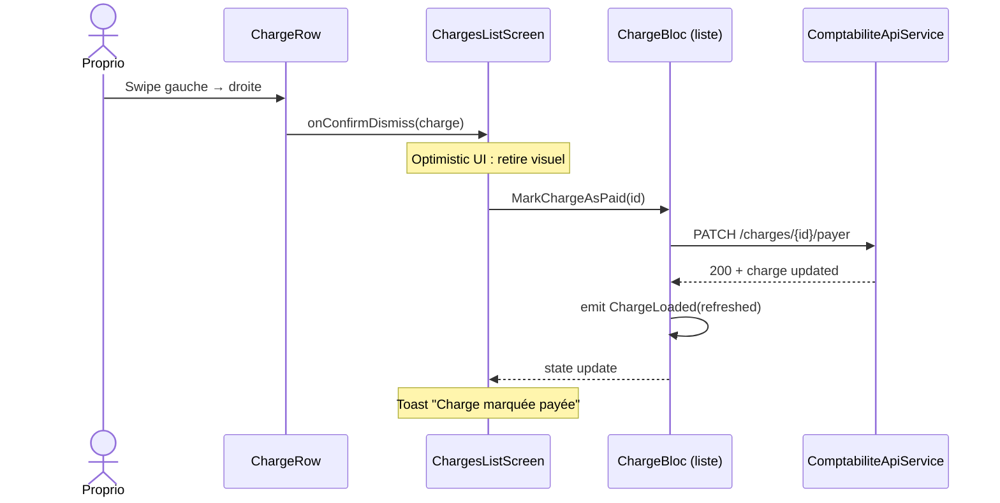
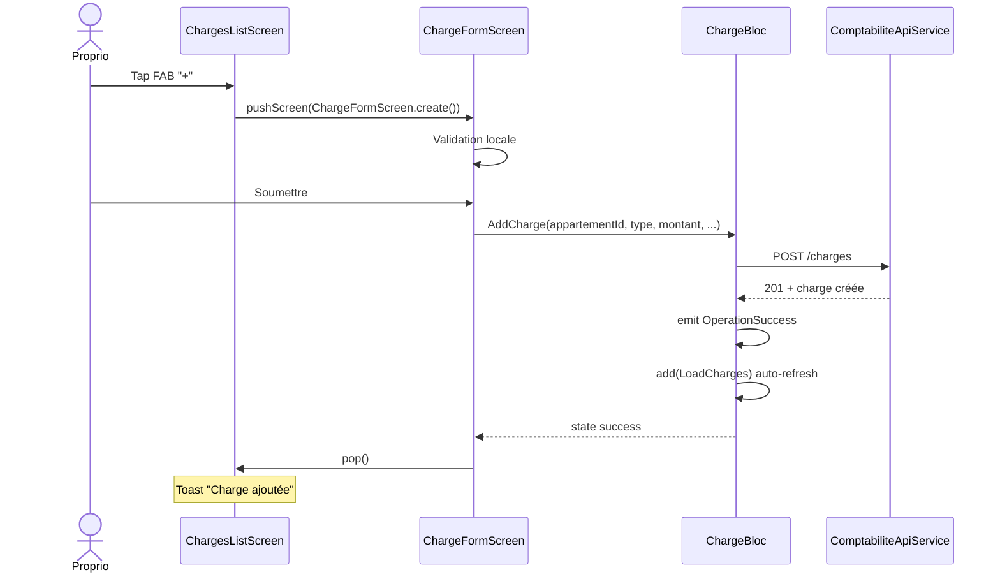
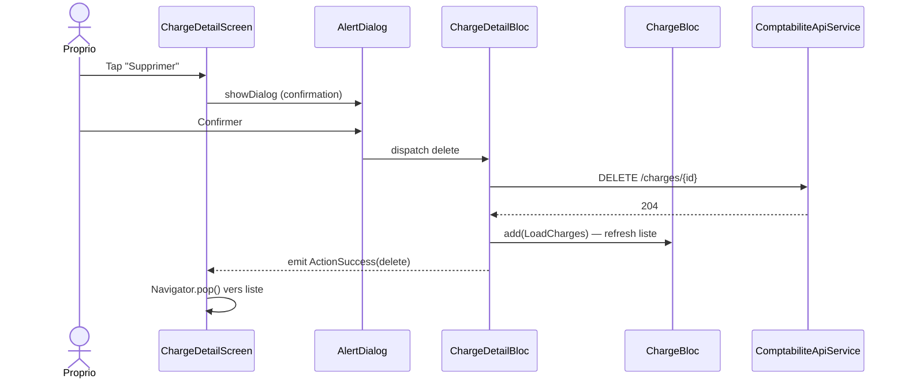

# 🏗️ Architecture : Gestion des Charges (CRUD)

> **Feature :** `charges-management-screen`
> **Date :** 2026-05-12
> **Spec source :** `.ai-outputs/specs/charges-management-screen/business-spec.md`
> **Statut :** ⏳ En attente de validation utilisateur

---

## 1. Analyse du Projet

**Environnement détecté** : Flutter 3.7+, flutter_bloc 9.1.1, hive 2.2.3, dio 5.8. Design system "Asfar Dark Premium" exhaustivement codifié dans `AppColors`/`AppTextStyles`/`AppRadii`.

**Patterns existants reconnus** :
- Pattern **Cubit + state dans 1 fichier** : `ComptabiliteFilterCubit` (déjà utilisé pour les filtres compta) — à dupliquer pour `ChargeFilterCubit`
- Pattern **BLoC dédié au détail** : `ReservationDetailBloc` (tour précédent) — à dupliquer pour `ChargeDetailBloc`
- Pattern **dossier feature** : `screen/.../widget/` avec widgets atomiques découpés — appliqué partout
- Pattern **helpers purs `*Display`** : `ReservationStatusDisplay` → `ChargeStatusDisplay`
- Pas de `Dismissible` custom → on utilise le widget standard Flutter

**Points d'intégration** :
- `ProprioFinancesScreen` : ajout d'un CTA « Gérer mes charges »
- `PnLAggregator` + `CashflowAggregator` : refactor pour utiliser le nouveau helper unifié `ChargePeriodFilter` (RM8)

**Standards / Règle 4** : aucune dépendance externe requise. Tout réutilise les libs déjà présentes.

---

## 2. Décisions Architecturales (réponses aux 8 questions)

| # | Question | Décision | Justification |
|---|----------|----------|---------------|
| **D1** | BLoC dédié pour le détail ? | **Oui — `ChargeDetailBloc` séparé** | Isole l'état d'1 charge (action en cours, edit en cours) du `ChargeBloc` liste. Pattern aligné sur `ReservationDetailBloc`. |
| **D2** | Emplacement écrans | **`lib/screen/client/proprio/comptabilite/charges/`** | Sous-dossier de comptabilite (V1 proprio only, conforme orga projet). |
| **D3** | Filtres | **`ChargeFilterCubit` dédié** (pas local state) | Cohérent avec `ComptabiliteFilterCubit` existant. Persistance possible entre navigation, plus testable. |
| **D4** | Swipe-to-pay | **`Dismissible` standard Flutter** | Suffisant. `direction: DismissDirection.startToEnd`, fond success/danger selon état, icône check. |
| **D5** | Helpers purs | **2 helpers : `ChargeStatusDisplay` + `ChargePeriodFilter`** | Premier pour mapping status visuel. Second pour unification P&L/Cashflow (RM8). |
| **D6** | Migration `_chargeFallsInPeriod` | **Supprimer du `PnLAggregator`, déléguer au helper. Modifier aussi `CashflowAggregator` pour utiliser le même helper** | DRY + single source of truth. |
| **D7** | Widgets atomiques | **15 widgets dans `widget/`** | Découpage 1 widget = 1 fichier (règle Flutter projet). |
| **D8** | Tests | **2 fichiers de tests** | `ChargePeriodFilter` (critique RM8) + `ChargeStatusDisplay` (matrice). |

---

## 3. Architecture Métier

**Entités / Concepts** :
- **`Charge`** *(existant, 17 champs)* — donnée centrale, pas de modification
- **`ChargeStatut`** *(nouveau, enum dérivé pour UI)* — `payee | impayee | enRetard | echeanceProche`
- **`ChargeFilterState`** *(nouveau)* — `selectedAppartementId`, `selectedType`, `selectedStatut`, `dateDebut`, `dateFin`
- **`ChargeDetailAction`** *(nouveau, enum)* — `markPaid | markUnpaid | edit | delete`

**Règles métier mappées sur le code** :

| ID Spec | Implémentation |
|---------|----------------|
| RM1 (point d'entrée Finances) | CTA `OutlinedCustomButton` ou `IconBoutton` dans `ProprioFinancesScreen` |
| RM2 (filtres serveur) | `ChargeFilterCubit` + `AppartementBloc` (déjà chargé) + enum `TypeCharge` |
| RM3 (marquer payée double) | `Dismissible` sur `ChargeRow` + bouton primaire dans `ChargeDetailActionsBar` |
| RM4 (création) | `ChargeFormScreen` + validation inline, dispatche `AddCharge` event |
| RM5 (édition) | Réutilise `ChargeFormScreen` en mode édition (constructeur `.edit(Charge)`) |
| RM6 (page détail) | `ChargeDetailScreen` + `BlocProvider<ChargeDetailBloc>` local |
| RM7 (suppression sécurisée) | `AlertDialog` de confirmation avant `DeleteCharge` event |
| RM8 (unification calcul) | **Nouveau** `ChargePeriodFilter.includes(charge, year, month)` utilisé par `PnLAggregator` ET `CashflowAggregator` |
| RM9 (alertes visuelles) | `ChargeAlertsBanner` en tête de liste si `state.alertes.isNotEmpty` |
| RM10 (cleanup doublon) | Suppression de `lib/service/comptabilite/charge_local_service.dart` |

---

## 4. Architecture Fonctionnelle

### 4.1 Modules / Composants

| Module | Responsabilité | Dépendances |
|--------|----------------|-------------|
| **`ChargeFilterCubit`** | État des filtres (statut, appartement, type, période). Méthodes `setStatut(...)`, `setAppartement(...)`, `setType(...)`, `setPeriod(...)`, `reset()`. | aucune |
| **`ChargeDetailBloc`** | Cycle de vie d'1 charge : load, action en cours (markPaid, edit, delete). Notifie `ChargeBloc` liste après action mutante. | `ChargeDataManager`, `ChargeBloc` |
| **`ChargePeriodFilter`** | Helper pur. `includes(Charge, year, month) → bool`. **Règle unique : `datePaiement` strict dans la période.** Une charge sans `datePaiement` retourne `false`. | aucune |
| **`ChargeStatusDisplay`** | Helper pur. Mapping `Charge → ChargeStatut → (label, tone, icon)`. Statut dérivé : `payee` si `estPaye == true`, sinon `enRetard` / `echeanceProche` / `impayee`. | aucune |
| **`ChargesListScreen`** | Composition AppBar + filtres + alerts banner + liste swipeable + FAB. Consomme `ChargeBloc` + `ChargeFilterCubit`. | tous les widgets liste |
| **`ChargeDetailScreen`** | Composition détail + sticky action bar. | `ChargeDetailBloc` + widgets détail |
| **`ChargeFormScreen`** | Formulaire création/édition + validation. | `ChargeBloc` (Add) ou `ChargeDetailBloc` (Update) |

### 4.2 Diagramme de Classes



### 4.3 Flux : Swipe-to-Pay



### 4.4 Flux : Création d'une charge



### 4.5 Flux : Suppression d'une charge



---

## 5. Structure des Fichiers

### 5.1 Nouveaux fichiers (24)

```
lib/
├── bloc/
│   ├── charge_detail_bloc/                       ← NOUVEAU dossier
│   │   ├── charge_detail_bloc.dart
│   │   ├── charge_detail_event.dart
│   │   └── charge_detail_state.dart
│   └── charge_filter_cubit/                      ← NOUVEAU dossier
│       └── charge_filter_cubit.dart              (cubit + state dans même fichier)
│
├── model/comptabilite/
│   ├── charge_statut.dart                        ← NOUVEAU (enum UI + filtre)
│   └── charge_detail_action.dart                 ← NOUVEAU (enum)
│
├── util/calc/
│   ├── charge_status_display.dart                ← NOUVEAU helper pur
│   └── charge_period_filter.dart                 ← NOUVEAU helper pur (RM8)
│
└── screen/client/proprio/comptabilite/charges/   ← NOUVEAU dossier
    ├── charges_list_screen.dart
    ├── charge_detail_screen.dart
    ├── charge_form_screen.dart
    └── widget/
        ├── charge_row.dart                       (StatelessWidget tap + swipe)
        ├── charge_filter_bar.dart                (Row de chips et selectors)
        ├── charge_statut_filter_chips.dart       (chips : tous/payée/impayée/retard)
        ├── charge_appartement_picker.dart        (bottom sheet sélection)
        ├── charge_type_picker.dart               (bottom sheet sélection)
        ├── charge_period_picker.dart             (mois + année)
        ├── charge_alerts_banner.dart             (banner si retards)
        ├── charges_empty_view.dart               (state vide + CTA)
        ├── charges_loading_view.dart             (skeleton structuré)
        ├── charge_detail_header.dart             (icône type + libellé + badge)
        ├── charge_detail_montant_card.dart       (montant + fréquence)
        ├── charge_detail_appart_card.dart        (logement lié, cliquable)
        ├── charge_detail_dates_section.dart      (dates clé/val)
        ├── charge_detail_meta_section.dart       (notes + audit)
        └── charge_detail_actions_bar.dart        (sticky bottom)

test/util/calc/
├── charge_period_filter_test.dart                ← NOUVEAU (RM8 critique)
└── charge_status_display_test.dart               ← NOUVEAU (matrice statuts)
```

### 5.2 Fichiers à modifier (3)

| Fichier | Modification |
|---------|--------------|
| `lib/util/calc/pnl_aggregator.dart` | Supprimer méthode statique privée `_chargeFallsInPeriod` ; `_aggregateChargesForPeriod` utilise `ChargePeriodFilter.includes(c, year, month)` (loop sur les mois de la période ou directement pour le mois principal selon la période). |
| `lib/util/calc/cashflow_aggregator.dart` | Remplacer le filtre inline par `ChargePeriodFilter.includes(c, year, month)`. |
| `lib/screen/client/proprio/comptabilite/finances_screen.dart` | Ajouter CTA « Gérer mes charges » (OutlinedCustomButton block) au-dessus de la PnLCard ou dans un emplacement décidé par UI/UX. |

### 5.3 Fichier à supprimer (1)

| Fichier | Raison |
|---------|--------|
| `lib/service/comptabilite/charge_local_service.dart` | Doublon exact de `ChargeRepository`. Non importé nulle part (vérifié). |

### 5.4 Ordre d'implémentation

1. **Helpers purs d'abord** : `ChargePeriodFilter`, `ChargeStatusDisplay`, enums `ChargeStatut` + `ChargeDetailAction`
2. **Tests** des helpers purs (avant d'utiliser les helpers ailleurs)
3. **Refactor calculateurs** : `PnLAggregator` + `CashflowAggregator` consomment `ChargePeriodFilter`
4. **Cleanup** : suppression `charge_local_service.dart`
5. **BLoCs** : `ChargeDetailBloc` (event/state/bloc) + `ChargeFilterCubit`
6. **Widgets atomiques** (15) du plus simple au plus composé
7. **Écrans** (3) : `ChargesListScreen`, `ChargeDetailScreen`, `ChargeFormScreen`
8. **Intégration** : CTA dans `ProprioFinancesScreen`

---

## 6. Contrats / Interfaces

### 6.1 `ChargeFilterCubit`

```dart
enum ChargeStatutFilter { tous, payee, impayee, enRetard }

class ChargeFilterState {
  final ChargeStatutFilter statut;
  final int? appartementId;
  final TypeCharge? typeCharge;
  final int year;     // pour filtre période
  final int month;    // pour filtre période (0 = "toute l'année")

  bool get hasActiveFilters;
}

class ChargeFilterCubit extends Cubit<ChargeFilterState> {
  ChargeFilterCubit() : super(ChargeFilterState.initial());
  void setStatut(ChargeStatutFilter v);
  void setAppartement(int? id);
  void setType(TypeCharge? t);
  void setPeriod({required int year, required int month});
  void reset();
}
```

### 6.2 `ChargeDetailEvent` / `ChargeDetailState` / `ChargeDetailBloc`

```dart
abstract class ChargeDetailEvent {}
class LoadCharge extends ChargeDetailEvent { final Charge charge; }
class MarkPaid extends ChargeDetailEvent {}
class MarkUnpaid extends ChargeDetailEvent {}
class UpdateChargeAction extends ChargeDetailEvent { final Charge updated; }
class DeleteChargeAction extends ChargeDetailEvent {}

abstract class ChargeDetailState {
  final Charge? charge;
}
class ChargeDetailInitial extends ChargeDetailState {}
class ChargeDetailLoaded extends ChargeDetailState {}
class ChargeDetailActionInProgress extends ChargeDetailState { final ChargeDetailAction action; }
class ChargeDetailActionSuccess extends ChargeDetailState { final ChargeDetailAction action; }
class ChargeDetailActionError extends ChargeDetailState { final ChargeDetailAction action; final String message; }
```

### 6.3 `ChargePeriodFilter`

```dart
/// Règle UNIQUE : la charge tombe dans la période si elle a un `datePaiement`
/// dans le mois ciblé. Une charge non payée n'est jamais incluse.
/// Référence : RM8 de la spec métier.
class ChargePeriodFilter {
  ChargePeriodFilter._();

  static bool includes(Charge c, {required int year, required int month}) {
    final dp = c.datePaiement;
    if (dp == null) return false;
    return dp.year == year && dp.month == month;
  }

  /// Variante période multi-mois (pour PnL trimestre/semestre/année).
  static bool includesInRange(Charge c, {required DateTime start, required DateTime end}) {
    final dp = c.datePaiement;
    if (dp == null) return false;
    return !dp.isBefore(start) && !dp.isAfter(end);
  }
}
```

### 6.4 `ChargeStatusDisplay`

```dart
enum ChargeStatut { payee, impayee, enRetard, echeanceProche }

class ChargeStatusDisplay {
  ChargeStatusDisplay._();

  static ChargeStatut statutOf(Charge c) {
    if (c.estPaye == true) return ChargeStatut.payee;
    if (c.estEnRetard) return ChargeStatut.enRetard;
    if (c.echeanceProche) return ChargeStatut.echeanceProche;
    return ChargeStatut.impayee;
  }

  static String labelOf(ChargeStatut s);
  static BadgeTone toneOf(ChargeStatut s);
  static IconData iconOf(ChargeStatut s);
}
```

### 6.5 `ChargeFormScreen` API publique

```dart
class ChargeFormScreen extends StatefulWidget {
  final Charge? initial;  // null = création, non-null = édition

  const ChargeFormScreen.create({super.key}) : initial = null;
  const ChargeFormScreen.edit({super.key, required Charge this.initial});
}
```

---

## 7. CONTRAT D'IMPLÉMENTATION

### Pages / Routes
- [ ] `ChargesListScreen` (route push depuis Finances)
- [ ] `ChargeDetailScreen` (push depuis liste)
- [ ] `ChargeFormScreen` (create/edit, push depuis liste/détail)

### Composants / Widgets (15)
- [ ] `ChargeRow` — ligne liste avec swipe Dismissible
- [ ] `ChargeFilterBar` — conteneur des 4 filtres
- [ ] `ChargeStatutFilterChips` — chips tous/payée/impayée/retard
- [ ] `ChargeAppartementPicker` — bottom sheet sélection appart
- [ ] `ChargeTypePicker` — bottom sheet sélection type
- [ ] `ChargePeriodPicker` — sélecteur mois/année
- [ ] `ChargeAlertsBanner` — banner alertes retard
- [ ] `ChargesEmptyView` — empty state
- [ ] `ChargesLoadingView` — skeleton structuré
- [ ] `ChargeDetailHeader` — icône + libellé + badge
- [ ] `ChargeDetailMontantCard` — montant + fréquence
- [ ] `ChargeDetailAppartCard` — appartement lié
- [ ] `ChargeDetailDatesSection` — clé/val dates
- [ ] `ChargeDetailMetaSection` — notes + audit
- [ ] `ChargeDetailActionsBar` — sticky bottom

### BLoCs / Cubits
- [ ] `ChargeFilterCubit` + state
- [ ] `ChargeDetailBloc` + event (5) + state (5)

### Helpers / Modèles
- [ ] `ChargePeriodFilter` (RM8)
- [ ] `ChargeStatusDisplay`
- [ ] `ChargeStatut` (enum)
- [ ] `ChargeDetailAction` (enum)

### Fichiers à modifier (3)
- [ ] `pnl_aggregator.dart` — utiliser `ChargePeriodFilter.includes`
- [ ] `cashflow_aggregator.dart` — utiliser `ChargePeriodFilter.includes`
- [ ] `finances_screen.dart` — ajouter CTA « Gérer mes charges »

### Fichiers à supprimer (1)
- [ ] `lib/service/comptabilite/charge_local_service.dart`

### Tests (2)
- [ ] `test/util/calc/charge_period_filter_test.dart` — couverture RM8 (charges sans datePaiement → false, charges dans/hors mois)
- [ ] `test/util/calc/charge_status_display_test.dart` — matrice complète statuts

### Wiring critique
- [ ] `ChargesListScreen` créé avec `MultiBlocProvider` qui injecte `ChargeFilterCubit` + utilise `ChargeBloc` (existant, fourni en amont)
- [ ] `ChargeDetailScreen` crée son propre `BlocProvider<ChargeDetailBloc>` local (pattern reservation)
- [ ] Swipe `Dismissible` : `confirmDismiss` retourne `false` pour empêcher le retrait visuel (la liste se rafraîchit après l'API success)
- [ ] `ChargeFilterCubit` est filtré côté UI (les charges sont déjà toutes chargées via `ChargeBloc.LoadCharges()`, le filtre est in-memory)

---

## UI_REQUIRED: true

Toute la feature est visuelle (liste + détail + formulaire + intégration Finances). L'agent UI/UX cadrera : layout liste, design du swipe, structure formulaire, intégration du CTA dans Finances.
