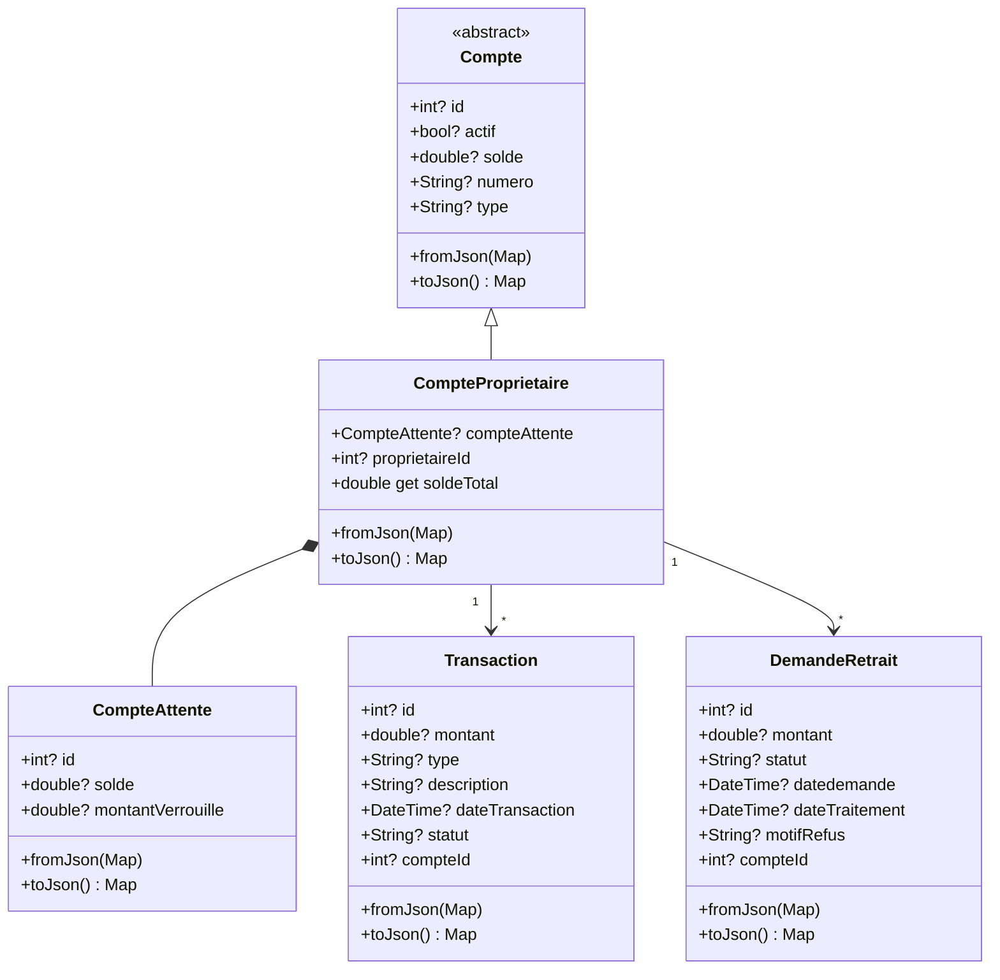
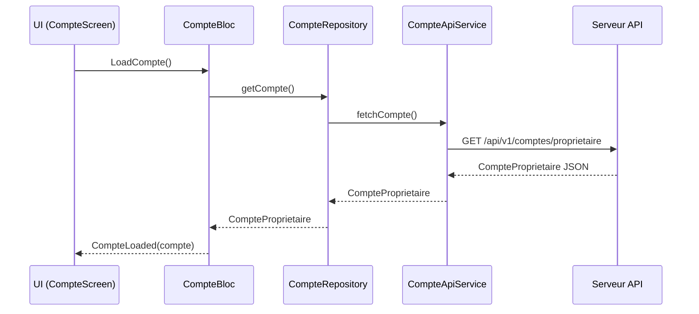
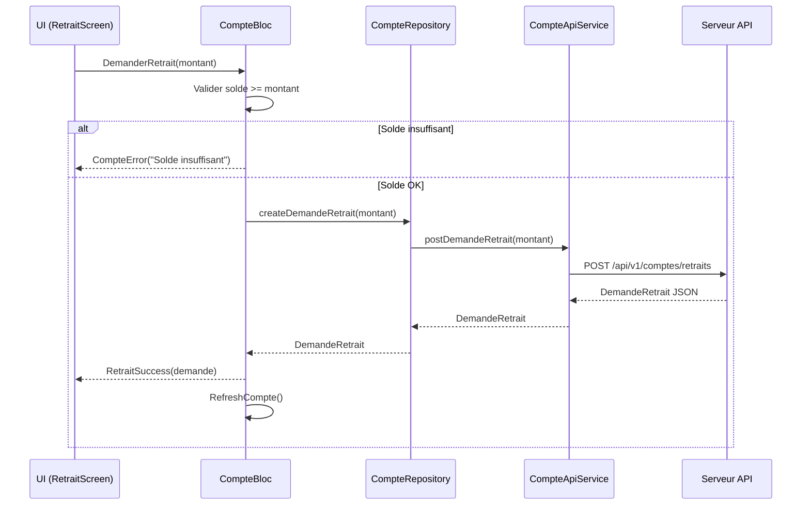

# 🏗️ Architecture - Système de Compte Propriétaire

## 1. Vue d'ensemble

### Objectif
Permettre au propriétaire de consulter son compte, visualiser l'historique des transactions et effectuer des demandes de retrait depuis l'application mobile.

### Composants impactés
- **Nouveaux** : Modèles, BLoC, Service API, Écrans compte
- **Existants** : Navigation proprio (ajout onglet ou accès depuis profil)

### Nouvelles entités
- `CompteProprietaire` (étend `Compte`)
- `CompteAttente`
- `Transaction`
- `DemandeRetrait`

---

## 2. Diagramme de Classes



---

## 3. Diagramme de Séquence - Consultation Compte



---

## 4. Diagramme de Séquence - Demande de Retrait



---

## 5. Structure des Fichiers

```
lib/
├── model/
│   └── compte/
│       ├── compte.dart                    # (existant) Classe abstraite
│       ├── compte_proprietaire.dart       # NOUVEAU
│       ├── compte_attente.dart            # NOUVEAU
│       ├── transaction.dart               # NOUVEAU
│       └── demande_retrait.dart           # NOUVEAU
│
├── bloc/
│   └── compte_bloc/
│       ├── compte_bloc.dart               # NOUVEAU
│       ├── compte_event.dart              # NOUVEAU
│       └── compte_state.dart              # NOUVEAU
│
├── service/
│   └── compte/
│       └── compte_api_service.dart        # NOUVEAU
│
├── repository/
│   └── compte_repository.dart             # NOUVEAU
│
└── screen/
    └── client/
        └── proprio/
            └── compte/
                ├── compte_screen.dart           # NOUVEAU - Écran principal
                ├── widget/
                │   ├── solde_card.dart          # NOUVEAU - Carte solde
                │   ├── transaction_item.dart    # NOUVEAU - Item transaction
                │   └── retrait_form.dart        # NOUVEAU - Formulaire retrait
                └── historique_screen.dart       # NOUVEAU - Historique complet
```

---

## 6. Interfaces / Contrats

### 6.1 Modèle CompteProprietaire

```dart
class CompteProprietaire extends Compte {
  CompteAttente? compteAttente;
  int? proprietaireId;

  CompteProprietaire({
    super.id,
    super.actif,
    super.solde,
    super.numero,
    this.compteAttente,
    this.proprietaireId,
  }) : super(type: 'PROPRIETAIRE');

  /// Solde total = solde disponible + solde attente
  double get soldeTotal => (solde ?? 0) + (compteAttente?.solde ?? 0);

  /// Montant verrouillé (non retirable)
  double get montantVerrouille => compteAttente?.montantVerrouille ?? 0;

  factory CompteProprietaire.fromJson(Map<String, dynamic> json);
  @override
  Map<String, dynamic> toJson();
}
```

### 6.2 Modèle CompteAttente

```dart
class CompteAttente {
  int? id;
  double? solde;
  double? montantVerrouille;

  CompteAttente({this.id, this.solde, this.montantVerrouille});

  factory CompteAttente.fromJson(Map<String, dynamic> json);
  Map<String, dynamic> toJson();
}
```

### 6.3 Modèle Transaction

```dart
class Transaction {
  int? id;
  double? montant;
  String? type;           // CREDIT, DEBIT
  String? description;
  DateTime? dateTransaction;
  String? statut;         // EFFECTUE, EN_ATTENTE, ANNULE
  int? compteId;

  factory Transaction.fromJson(Map<String, dynamic> json);
  Map<String, dynamic> toJson();
}
```

### 6.4 Modèle DemandeRetrait

```dart
class DemandeRetrait {
  int? id;
  double? montant;
  String? statut;         // EN_ATTENTE, APPROUVE, REFUSE, TRAITE
  DateTime? dateDemande;
  DateTime? dateTraitement;
  String? motifRefus;
  int? compteId;

  factory DemandeRetrait.fromJson(Map<String, dynamic> json);
  Map<String, dynamic> toJson();
}
```

### 6.5 CompteBloc Events

```dart
abstract class CompteEvent {}

class LoadCompte extends CompteEvent {}

class RefreshCompte extends CompteEvent {}

class LoadTransactions extends CompteEvent {
  final DateTime? dateDebut;
  final DateTime? dateFin;
}

class DemanderRetrait extends CompteEvent {
  final double montant;
}

class ResetCompteState extends CompteEvent {}
```

### 6.6 CompteBloc States

```dart
abstract class CompteState {}

class CompteInitial extends CompteState {}

class CompteLoading extends CompteState {}

class CompteLoaded extends CompteState {
  final CompteProprietaire compte;
  final List<Transaction> transactions;
  final List<DemandeRetrait> demandesRetrait;
}

class CompteError extends CompteState {
  final String message;
}

class RetraitSuccess extends CompteState {
  final DemandeRetrait demande;
}
```

### 6.7 CompteApiService

```dart
class CompteApiService {
  static const String _baseEndpoint = "api/v1/comptes";

  /// Récupère le compte du propriétaire connecté
  Future<CompteProprietaire> getCompteProprietaire();

  /// Récupère l'historique des transactions
  Future<List<Transaction>> getTransactions({
    DateTime? dateDebut,
    DateTime? dateFin,
  });

  /// Crée une demande de retrait
  Future<DemandeRetrait> createDemandeRetrait(double montant);

  /// Récupère les demandes de retrait
  Future<List<DemandeRetrait>> getDemandesRetrait();
}
```

---

## 7. Endpoints API (supposés)

| Méthode | Endpoint | Description |
|---------|----------|-------------|
| GET | `/api/v1/comptes/proprietaire` | Récupère le compte du proprio connecté |
| GET | `/api/v1/comptes/transactions` | Liste des transactions |
| GET | `/api/v1/comptes/retraits` | Liste des demandes de retrait |
| POST | `/api/v1/comptes/retraits` | Créer une demande de retrait |

---

## 8. Intégration UI

### Option proposée : Accès depuis le Profil
- Ajouter un item "Mon Compte" dans `ProfileProprio`
- Navigation vers `CompteScreen`

### Écran CompteScreen
- **Header** : Numéro de compte, statut
- **Cartes solde** :
  - Solde disponible (retirable)
  - Montant en attente (verrouillé)
- **Actions rapides** : Bouton "Demander un retrait"
- **Historique récent** : 5 dernières transactions
- **Lien** : "Voir tout l'historique"

---

## 9. Gestion des erreurs

| Cas | Comportement |
|-----|--------------|
| Compte suspendu | Afficher message, désactiver bouton retrait |
| Solde insuffisant | Message d'erreur, empêcher la demande |
| Erreur réseau | SnackBar + bouton "Réessayer" |
| Session expirée | Redirection vers login |

---

## 10. Besoin UI ?

**OUI** - Un composant UI est nécessaire pour :
- Affichage des soldes (disponible / verrouillé)
- Liste des transactions
- Formulaire de demande de retrait

→ **Activation de l'Agent UI/UX après validation**

---

*Architecture conçue le 2025-12-24*
