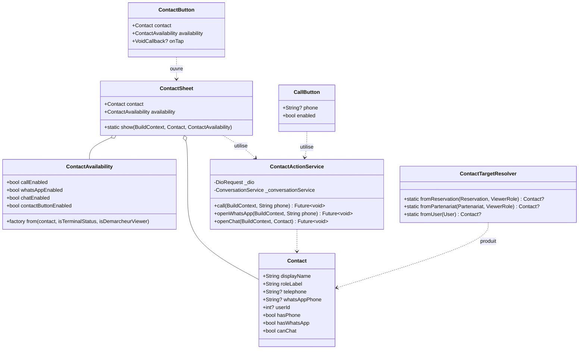
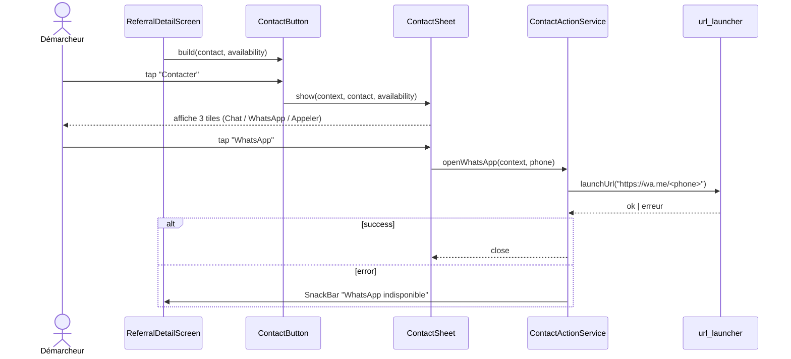
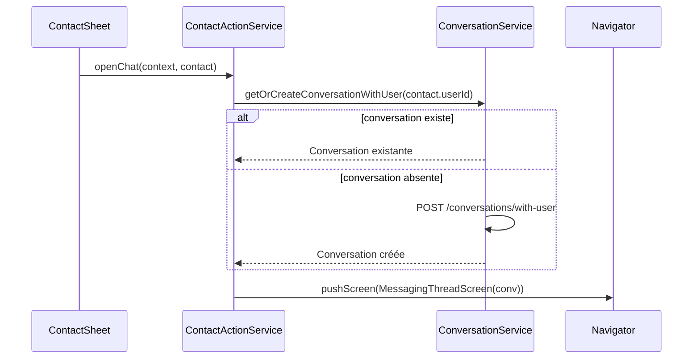

# 🏗️ Architecture Technique — Contact Actions Unifiés

> **Feature** : `contact-actions-unifies`
> **Stack** : Flutter (existant) — BLoC, Hive, Dio, url_launcher
> **Date** : 2026-05-20

---

## 1. Vue d'ensemble

### 1.1 Objectif technique

Mettre en place une **couche unifiée** pour les actions de contact (Appeler / WhatsApp / Chat), réutilisable depuis n'importe quel écran, en remplacement de la logique aujourd'hui dupliquée inline dans 10+ écrans.

### 1.2 Composants impactés

#### Existant à refactorer / remplacer
- `lib/util/calc/reservation_contact_resolver.dart` — modèle `ContactTarget` (à généraliser) + resolver (à étendre)
- `lib/screen/client/shared/reservations/reservation_contact_sheet.dart` — bottom sheet 2 options (à supprimer après migration)

#### Existant à réutiliser
- `lib/service/model/conversation/conversation_service.dart` — méthode `createConversationFromBooking(bookingId)` existante ; **dépendance backend à valider** pour `getOrCreateConversationWithUser(userId)`
- `lib/screen/client/shared/inbox/messaging_thread_screen.dart` — écran de thread (cible navigation après création/récupération conversation)
- `lib/screen/client/shared/inbox/messaging_list_screen.dart` — fallback si backend ne fournit pas d'endpoint user-to-user
- `lib/theme/app_colors.dart` — couleurs (`accent`, `bgElev1`, `textDisabled`, etc.)
- `lib/util/function.dart` — `deboger()` pour logs

### 1.3 Nouvelles entités à créer

| Couche | Fichier | Rôle |
|---|---|---|
| Model | `lib/model/contact/contact.dart` | Entité `Contact` générique (généralise `ContactTarget`) |
| Service | `lib/service/contact/contact_action_service.dart` | Orchestrateur des 3 actions (call / whatsapp / chat) |
| Helper | `lib/service/contact/contact_availability.dart` | Calcule l'état actif/désactivé selon contact + statut + rôle viewer |
| Util | `lib/util/calc/contact_target_resolver.dart` | Resolver généralisé (remplace `reservation_contact_resolver`) |
| Widget | `lib/widget/contact/contact_sheet.dart` | Bottom sheet 3 options (générique, sans dépendance Reservation) |
| Widget | `lib/widget/contact/contact_sheet_tile.dart` | Atome de tile dans la sheet |
| Widget | `lib/widget/contact/contact_button.dart` | Bouton "Contacter" → ouvre la sheet |
| Widget | `lib/widget/contact/call_button.dart` | Bouton "Appeler" (direct) |

---

## 2. Diagramme de classes



---

## 3. Diagramme de séquence

### 3.1 Scénario nominal : démarcheur tape "Contacter" → choisit WhatsApp



### 3.2 Scénario : tap "Chat" — création thread si absent



**⚠️ Dépendance backend** : la méthode `getOrCreateConversationWithUser(int userId)` n'existe pas encore dans `ConversationService`. Deux scénarios :

- **A) Endpoint backend dispo** (`POST /conversations/with-user` ou équivalent) → implémenter la méthode complète
- **B) Endpoint backend absent** → fallback temporaire : naviguer vers `MessagingListScreen` (comportement actuel de `reservation_contact_sheet.dart`)

**Décision** : implémenter le scénario **B en fallback**, scénario **A** prévu mais conditionné à confirmation backend (à clarifier avec le user après architecture validée — ou tâche backend séparée). L'API du service est conçue pour supporter les deux sans changement public.

---

## 4. Structure des fichiers

```
lib/
├── model/
│   └── contact/
│       └── contact.dart                          # ✨ NEW
│
├── service/
│   └── contact/
│       ├── contact_action_service.dart           # ✨ NEW
│       └── contact_availability.dart             # ✨ NEW
│
├── util/
│   └── calc/
│       ├── contact_target_resolver.dart          # ✨ NEW (remplace reservation_contact_resolver)
│       └── reservation_contact_resolver.dart     # ⛔ À supprimer après migration
│
├── widget/
│   └── contact/
│       ├── contact_sheet.dart                    # ✨ NEW
│       ├── contact_sheet_tile.dart               # ✨ NEW
│       ├── contact_button.dart                   # ✨ NEW
│       └── call_button.dart                      # ✨ NEW
│
└── screen/
    └── client/
        ├── demarcheur/referrals/
        │   └── referral_detail_screen.dart       # 🔧 MODIFY (fix bug + migrer)
        ├── shared/reservations/
        │   ├── reservation_contact_sheet.dart    # ⛔ DELETE après migration
        │   └── widget/
        │       ├── reservation_detail_party_card.dart       # 🔧 MODIFY
        │       ├── reservation_detail_actions_bar.dart      # 🔧 MODIFY
        │       └── reservation_detail_apporteur_externe_card.dart  # 🔧 MODIFY
        ├── shared/partenariats/widget/
        │   └── partenariat_detail_party_card.dart            # 🔧 MODIFY
        ├── demarcheur/detail/
        │   └── demarcheur_appart_detail_screen.dart          # 🔧 MODIFY
        ├── demarcheur/referrals/widget/
        │   └── referral_client_card.dart                     # 🔧 MODIFY (passe Contact + availability)
        ├── shared/inbox/
        │   └── messaging_thread_screen.dart                  # 🔧 MODIFY (appel header)
        ├── locataire/booking/widget/
        │   └── host_card.dart                                # 🔧 MODIFY
        └── proprio/calendrier/widget/
            └── step_client_info.dart                         # 🔧 MODIFY
```

---

## 5. Interfaces / Contrats

### 5.1 `Contact` (modèle)

```dart
class Contact {
  final String displayName;       // "Jean Dupont", obligatoire
  final String roleLabel;          // "Propriétaire", "Client", "Démarcheur"
  final String? telephone;         // "+225..." ou null
  final String? whatsAppPhone;     // numéro WhatsApp (peut différer du tel)
  final int? userId;               // null si chat impossible (ex: client externe)
  final String? avatarUrl;         // optionnel, pour affichage dans la sheet

  const Contact({
    required this.displayName,
    required this.roleLabel,
    this.telephone,
    this.whatsAppPhone,
    this.userId,
    this.avatarUrl,
  });

  bool get hasPhone => (telephone ?? '').trim().isNotEmpty;
  bool get hasWhatsApp => (whatsAppPhone ?? telephone ?? '').trim().isNotEmpty;
  bool get canChat => userId != null;
}
```

### 5.2 `ContactAvailability` (règle métier)

```dart
class ContactAvailability {
  final bool callEnabled;
  final bool whatsAppEnabled;
  final bool chatEnabled;

  const ContactAvailability({
    required this.callEnabled,
    required this.whatsAppEnabled,
    required this.chatEnabled,
  });

  bool get contactButtonEnabled =>
      callEnabled || whatsAppEnabled || chatEnabled;

  /// Calcule la disponibilité selon le contact + statut + rôle viewer.
  ///
  /// - `isDemarcheurViewer == true` → ignore `isTerminalStatus` (toujours actif).
  /// - Sinon : si statut terminal → tout désactivé.
  factory ContactAvailability.from({
    required Contact contact,
    required bool isTerminalStatus,
    required bool isDemarcheurViewer,
  }) {
    if (isTerminalStatus && !isDemarcheurViewer) {
      return const ContactAvailability(
        callEnabled: false,
        whatsAppEnabled: false,
        chatEnabled: false,
      );
    }
    return ContactAvailability(
      callEnabled: contact.hasPhone,
      whatsAppEnabled: contact.hasWhatsApp,
      chatEnabled: contact.canChat, // toujours true si userId présent
    );
  }
}
```

### 5.3 `ContactActionService` (orchestrateur)

```dart
class ContactActionService {
  ContactActionService._();
  static final instance = ContactActionService._();

  /// Lance le dialer natif. Affiche un SnackBar si échec.
  Future<void> call(BuildContext context, String phone);

  /// Ouvre WhatsApp via https://wa.me/<phone>. Fallback SnackBar si non installé.
  Future<void> openWhatsApp(BuildContext context, String phone);

  /// Ouvre la conversation in-app avec le contact.
  /// - Si `Conversation` existe → push direct sur `MessagingThreadScreen`
  /// - Sinon → tente création via `ConversationService.getOrCreateConversationWithUser(userId)`
  ///   - Si endpoint absent (fallback B) → push `MessagingListScreen`
  Future<void> openChat(BuildContext context, Contact contact);
}
```

### 5.4 `ContactSheet` (widget)

```dart
class ContactSheet {
  ContactSheet._();

  static Future<void> show(
    BuildContext context, {
    required Contact contact,
    required ContactAvailability availability,
  });
}
```

### 5.5 `ContactButton` (widget)

```dart
class ContactButton extends StatelessWidget {
  final Contact contact;
  final ContactAvailability availability;
  final String? label;        // défaut "Contacter"
  final IconData? icon;       // défaut Icons.chat_bubble_outline

  const ContactButton({
    super.key,
    required this.contact,
    required this.availability,
    this.label,
    this.icon,
  });
}
```

### 5.6 `CallButton` (widget)

```dart
class CallButton extends StatelessWidget {
  final String? phone;
  final bool enabled;         // défaut: true (mais grisé si phone vide ou enabled=false)
  final String? label;        // défaut "Appeler"

  const CallButton({
    super.key,
    required this.phone,
    this.enabled = true,
    this.label,
  });
}
```

### 5.7 `ContactTargetResolver` (helper)

```dart
class ContactTargetResolver {
  ContactTargetResolver._();

  static Contact? fromReservation(Reservation r, ReservationViewerRole role);
  static Contact? fromReservationDemarcheur(ReservationDemarcheur r);
  static Contact? fromPartenariat(Partenariat p, PartenariatViewerRole role);
  static Contact fromUser(User u, {String? roleLabel});
}
```

---

## 6. CONTRAT D'IMPLÉMENTATION

### Modèles / Entités
- [ ] `lib/model/contact/contact.dart` → `Contact` (classe immutable, getters `hasPhone`/`hasWhatsApp`/`canChat`)

### Services / Helpers
- [ ] `lib/service/contact/contact_action_service.dart` → `ContactActionService` singleton avec 3 méthodes async (`call`, `openWhatsApp`, `openChat`)
- [ ] `lib/service/contact/contact_availability.dart` → `ContactAvailability` avec factory `from(...)` appliquant la règle "démarcheur toujours actif"
- [ ] `lib/util/calc/contact_target_resolver.dart` → resolver généralisé avec 4 factories (`fromReservation`, `fromReservationDemarcheur`, `fromPartenariat`, `fromUser`)

### Composants / Widgets
- [ ] `lib/widget/contact/contact_sheet.dart` → `ContactSheet.show(...)` + body privé `_ContactSheetBody`
- [ ] `lib/widget/contact/contact_sheet_tile.dart` → `ContactSheetTile` (icon, label, onTap, enabled, color)
- [ ] `lib/widget/contact/contact_button.dart` → `ContactButton` (StatelessWidget, ouvre sheet au tap, grisé si `availability.contactButtonEnabled == false`)
- [ ] `lib/widget/contact/call_button.dart` → `CallButton` (StatelessWidget, grisé si pas de phone ou enabled=false)

### Fichier à fixer en priorité (BUG)
- [ ] `lib/screen/client/demarcheur/referrals/referral_detail_screen.dart`
  - Remplacer `_callClient(context)` par `CallButton(phone: reservation.referralClientPhone)` injecté dans `ReferralClientCard`
  - Remplacer `_contactProprio(context)` par `ContactButton(contact: ..., availability: ...)` dans `HostCard`
  - `availability` : `ContactAvailability.from(isTerminalStatus: false, isDemarcheurViewer: true, ...)` (démarcheur → toujours actif)

### Fichiers à migrer (par lots)

**Lot 1 — Démarcheur (priorité)**
- [ ] `lib/screen/client/demarcheur/referrals/widget/referral_client_card.dart` → accepter `CallButton` en paramètre
- [ ] `lib/screen/client/demarcheur/detail/demarcheur_appart_detail_screen.dart` → remplacer code `tel:` inline
- [ ] `lib/screen/client/demarcheur/referrals/referral_detail_screen.dart` → idem

**Lot 2 — Réservations (partagé)**
- [ ] `lib/screen/client/shared/reservations/widget/reservation_detail_party_card.dart`
- [ ] `lib/screen/client/shared/reservations/widget/reservation_detail_actions_bar.dart`
- [ ] `lib/screen/client/shared/reservations/widget/reservation_detail_apporteur_externe_card.dart`
- [ ] Supprimer `lib/screen/client/shared/reservations/reservation_contact_sheet.dart`

**Lot 3 — Partenariats**
- [ ] `lib/screen/client/shared/partenariats/widget/partenariat_detail_party_card.dart`

**Lot 4 — Inbox + autres**
- [ ] `lib/screen/client/shared/inbox/messaging_thread_screen.dart`
- [ ] `lib/screen/client/locataire/booking/widget/host_card.dart`
- [ ] `lib/screen/client/proprio/calendrier/widget/step_client_info.dart`

**Lot 5 — Cleanup**
- [ ] Supprimer `lib/util/calc/reservation_contact_resolver.dart` (après migration de tous les callers)
- [ ] `flutter analyze` zéro warning sur tous les écrans modifiés

### Tests
- [ ] `test/service/contact/contact_availability_test.dart` → couvre la matrice (démarcheur, autres rôles × statuts terminaux/non)
- [ ] `test/model/contact/contact_test.dart` → getters `hasPhone` / `hasWhatsApp` / `canChat`

---

## 7. Conventions & règles projet respectées

- ✅ **1 widget = 1 fichier** (ContactSheet, ContactSheetTile, ContactButton, CallButton chacun dans leur fichier)
- ✅ **Pas de fonction privée retournant Widget** (tile = StatelessWidget dédié)
- ✅ **Helpers dans fichiers dédiés** (Availability, Resolver séparés du service)
- ✅ **Une classe par fichier**
- ✅ **SOLID sur nouveau code** : `Contact` (S), `ContactAvailability` (S — règle métier), `ContactActionService` (S — orchestration), pas de couplage
- ✅ **Réutilisation existant** : `app_colors`, `app_text_styles`, `url_launcher`, `ConversationService`, `pushScreen`
- ✅ **Pas de refactor opportuniste** : `reservation_contact_resolver` est supprimé uniquement parce que remplacé fonctionnellement (pas de cleanup gratuit)

---

## 8. Points de vigilance

| Risque | Mitigation |
|---|---|
| Backend ne fournit pas d'endpoint user-to-user pour chat | Fallback : `pushScreen(MessagingListScreen)` — comportement actuel |
| `whatsAppPhone` non exposé par le backend | Utiliser `telephone` comme fallback (cf. getter `hasWhatsApp`) |
| Statut terminal pas uniforme entre Reservation/Partenariat | `ContactAvailability.from` reçoit un `bool isTerminalStatus` calculé en amont par chaque écran |
| Régression sur écrans déjà fonctionnels | Migration par lots avec test manuel après chaque lot |
| Cyclic dep entre `service/contact` et `service/conversation` | `ContactActionService` dépend de `ConversationService` (sens unique, OK) |

---

## 9. Stratégie de déploiement

1. **Phase 1** — Créer les fondations (modèle, service, availability, widgets) sans toucher aux écrans
2. **Phase 2** — Fix le bug `referral_detail_screen` (cible prioritaire) + tests manuels
3. **Phase 3** — Migrer écrans démarcheur (Lot 1)
4. **Phase 4** — Migrer écrans partagés (Lot 2, 3, 4)
5. **Phase 5** — Cleanup (supprimer `reservation_contact_sheet`, `reservation_contact_resolver`)

---

## 🎯 Flag UI

```
UI_REQUIRED: true
```

**Justification** : la feature crée 4 widgets visuels (sheet, tile, contactButton, callButton) avec règles de grisage et thème dark + accent or. Le passage par l'agent UI/UX est nécessaire pour valider :
- Le visuel des tiles dans la sheet (icônes, espacement, état grisé)
- Le style des boutons `ContactButton` / `CallButton` (variantes : icon-only, label+icon, full-width)
- L'intégration cohérente sur tous les écrans cibles
