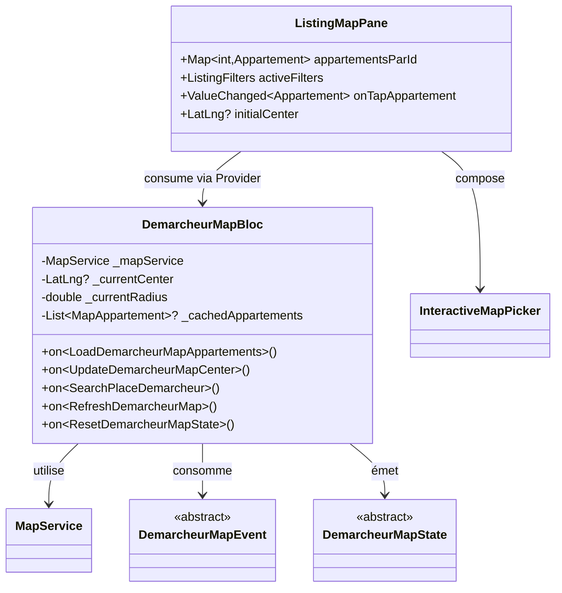
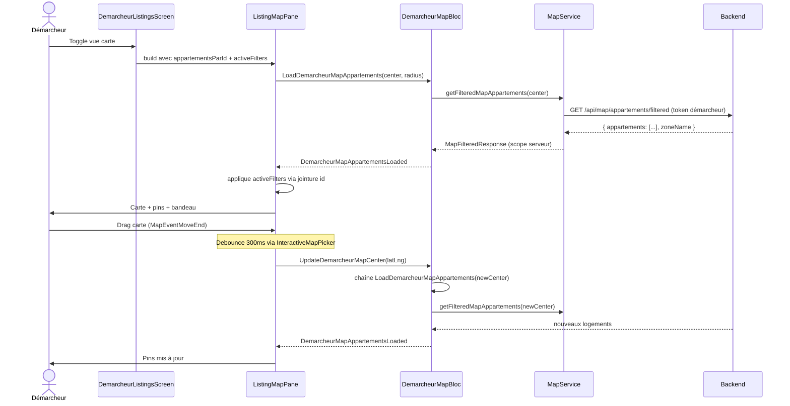
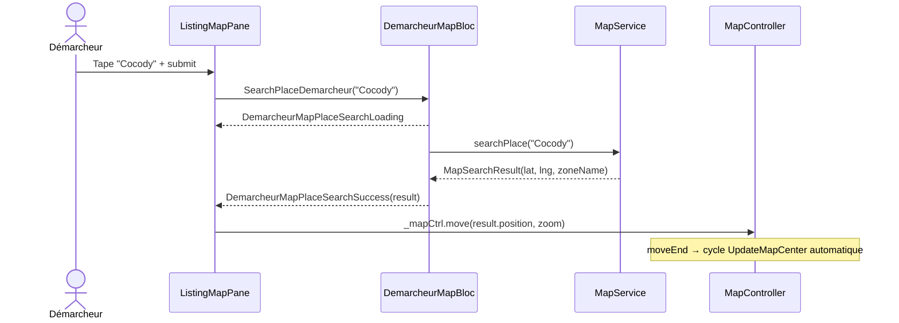
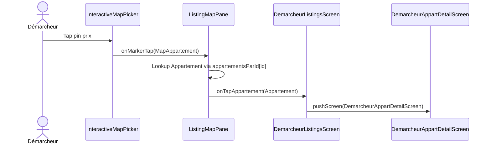

# Architecture — Carte Interactive Démarcheur

**Feature :** `demarcheur-carte-interactive`
**Statut :** ✅ Validé par l'utilisateur (2026-05-28)
**Spec source :** `business-spec.md`

---

## 1. Vue d'ensemble

### Objectif
Doter le démarcheur d'une carte interactive **iso-locataire** (Yango + search + overlays + bandeau zone) en réutilisant au maximum les briques mutualisées, et en respectant la séparation SOLID par rôle imposée par `SOLID_GUIDELINES.md`.

### Composants impactés

| Composant | Action |
|---|---|
| `lib/bloc/demarcheur_map_bloc/` | **CRÉER** (BLoC dédié) |
| `lib/screen/client/demarcheur/listings/widget/listing_map_pane.dart` | **CRÉER** (remplace `ListingMapView`) |
| `lib/screen/client/demarcheur/listings/widget/listing_map_view.dart` | **SUPPRIMER** |
| `lib/screen/client/demarcheur/listings/demarcheur_listings_screen.dart` | **MODIFIER** (injection BLoC + filtres locaux post-fetch) |
| `lib/widget/map/overlay/` | **CRÉER** (move des 3 overlays) |
| `lib/screen/client/locataire/map/widget/map_*_overlay.dart` | **DÉPLACER** vers `lib/widget/map/overlay/` |
| `lib/screen/client/locataire/map/locataire_map_screen.dart` | **MODIFIER** (update imports overlays) |
| `lib/main.dart` | **Non touché** (BLoC scoped au screen via `BlocProvider`) |

### Décisions architecturales clés

1. **BLoC dédié (pas de flag sur MapBloc)** — SOLID/SRP : un BLoC = un rôle. `MapBloc` reste 100% locataire.

2. **Filtres locaux appliqués dans le SCREEN, pas dans le BLoC** — `ListingFilters.apply()` opère sur `Appartement` (modèle métier avec `proprietaire.id`), alors que `/filtered` renvoie `MapAppartement` (sans `proprietaireId`). Solution : le screen maintient une `Map<int, Appartement>` indexée depuis `DemarcheurBloc.appartements` et applique les filtres en post-fetch via jointure par `id`. **Aucune modification de backend ni du modèle `MapAppartement`.**

3. **Pas de `RequestRealLocation` / `UpdateMapFilter` / `SelectMapAppartement`** :
   - Démarcheur ne réserve pas → `/real-location` non appelé
   - Filtres gérés dans le screen
   - Tap pin → navigation directe vers `DemarcheurAppartDetailScreen` (page existante), pas de bottom sheet

4. **Overlays déplacés vers `lib/widget/map/overlay/`** — Mutualisation propre (SOLID/DIP). Les 3 overlays sont génériques.

5. **Scope du BLoC : local au screen** — Évite la pollution du graphe global, cycle de vie aligné sur l'écran.

---

## 2. Diagramme de Classes



---

## 3. Diagramme de Séquence

### 3.1 Chargement + déplacement (pattern Yango)



### 3.2 Recherche textuelle



### 3.3 Tap pin → détail



---

## 4. Structure des Fichiers

```
lib/
├── bloc/
│   ├── map_bloc/                                  (inchangé — locataire)
│   └── demarcheur_map_bloc/                       ← NOUVEAU
│       ├── demarcheur_map_bloc.dart
│       ├── demarcheur_map_event.dart
│       └── demarcheur_map_state.dart
│
├── widget/
│   └── map/
│       ├── interactive_map_picker.dart            (inchangé)
│       ├── map_search_bar.dart                    (inchangé)
│       ├── map_zone_banner.dart                   (inchangé)
│       ├── map_view.dart                          (inchangé)
│       ├── map_price_pin.dart                     (inchangé)
│       ├── map_pin_marker.dart                    (inchangé)
│       └── overlay/                               ← NOUVEAU
│           ├── map_loading_overlay.dart           ← DÉPLACÉ
│           ├── map_error_overlay.dart             ← DÉPLACÉ
│           └── map_empty_overlay.dart             ← DÉPLACÉ
│
└── screen/
    └── client/
        ├── locataire/
        │   └── map/
        │       ├── locataire_map_screen.dart      ← MODIFIÉ (imports)
        │       └── widget/
        │           ├── map_loading_overlay.dart   ← SUPPRIMÉ
        │           ├── map_error_overlay.dart     ← SUPPRIMÉ
        │           ├── map_empty_overlay.dart     ← SUPPRIMÉ
        │           ├── map_marker_bottom_sheet.dart (inchangé)
        │           └── my_location_fab.dart       (inchangé)
        │
        └── demarcheur/
            └── listings/
                ├── demarcheur_listings_screen.dart ← MODIFIÉ
                ├── listing_filters.dart            (inchangé)
                ├── listing_filter_screen.dart      (inchangé)
                └── widget/
                    ├── listing_map_view.dart       ← SUPPRIMÉ
                    ├── listing_map_pane.dart       ← NOUVEAU
                    ├── partner_listing_card.dart   (inchangé)
                    ├── listing_availability_calendar.dart (inchangé)
                    ├── listing_partenaire_picker.dart (inchangé)
                    └── listing_zone_picker.dart    (inchangé)
```

---

## 5. Interfaces / Contrats

### 5.1 `DemarcheurMapEvent`

```dart
abstract class DemarcheurMapEvent { const DemarcheurMapEvent(); }

class LoadDemarcheurMapAppartements extends DemarcheurMapEvent {
  final LatLng center;
  final double radiusKm;
  const LoadDemarcheurMapAppartements({required this.center, this.radiusKm = 10.0});
}

class UpdateDemarcheurMapCenter extends DemarcheurMapEvent {
  final LatLng center;
  const UpdateDemarcheurMapCenter(this.center);
}

class SearchPlaceDemarcheur extends DemarcheurMapEvent {
  final String query;
  const SearchPlaceDemarcheur(this.query);
}

class RefreshDemarcheurMap extends DemarcheurMapEvent { const RefreshDemarcheurMap(); }
class ResetDemarcheurMapState extends DemarcheurMapEvent { const ResetDemarcheurMapState(); }
```

### 5.2 `DemarcheurMapState`

```dart
abstract class DemarcheurMapState { const DemarcheurMapState(); }

class DemarcheurMapInitial extends DemarcheurMapState { const DemarcheurMapInitial(); }
class DemarcheurMapLoading extends DemarcheurMapState { const DemarcheurMapLoading(); }

class DemarcheurMapAppartementsLoaded extends DemarcheurMapState {
  final List<MapAppartement> appartements;
  final LatLng center;
  final double radiusKm;
  final String? zoneName;
}

class DemarcheurMapEmpty extends DemarcheurMapState {
  final String message;
  final LatLng center;
  final double radiusKm;
  final String? zoneName;
}

class DemarcheurMapError extends DemarcheurMapState {
  final String message;
  final bool canRetry;
}

class DemarcheurMapCenterUpdated extends DemarcheurMapState {
  final LatLng center;
}

class DemarcheurMapPlaceSearchLoading extends DemarcheurMapState {}
class DemarcheurMapPlaceSearchSuccess extends DemarcheurMapState {
  final MapSearchResult result;
}
class DemarcheurMapPlaceSearchError extends DemarcheurMapState {
  final String message;
}
```

### 5.3 `ListingMapPane`

```dart
class ListingMapPane extends StatefulWidget {
  final Map<int, Appartement> appartementsParId;
  final ListingFilters activeFilters;
  final ValueChanged<Appartement> onTapAppartement;
  final LatLng? initialCenter;

  const ListingMapPane({
    super.key,
    required this.appartementsParId,
    required this.activeFilters,
    required this.onTapAppartement,
    this.initialCenter,
  });
}
```

---

## 6. CONTRAT D'IMPLÉMENTATION

### Composants à créer
- [ ] `lib/bloc/demarcheur_map_bloc/demarcheur_map_bloc.dart` — BLoC dédié (5 handlers)
- [ ] `lib/bloc/demarcheur_map_bloc/demarcheur_map_event.dart` — 5 events
- [ ] `lib/bloc/demarcheur_map_bloc/demarcheur_map_state.dart` — 9 states
- [ ] `lib/screen/client/demarcheur/listings/widget/listing_map_pane.dart` — widget composite

### Fichiers à modifier
- [ ] `lib/screen/client/demarcheur/listings/demarcheur_listings_screen.dart`
  - Wrapper la branche `_showMap` dans `BlocProvider<DemarcheurMapBloc>`
  - Remplacer `ListingMapView` par `ListingMapPane`
  - Construire `_appartementsParId` depuis `allApparts`
  - Méthode `_onMapTap` → `pushScreen(DemarcheurAppartDetailScreen)`
- [ ] `lib/screen/client/locataire/map/locataire_map_screen.dart`
  - Mettre à jour les 3 imports overlays

### Fichiers à supprimer
- [ ] `lib/screen/client/demarcheur/listings/widget/listing_map_view.dart`

### Fichiers à déplacer
- [ ] `lib/screen/client/locataire/map/widget/map_loading_overlay.dart` → `lib/widget/map/overlay/map_loading_overlay.dart`
- [ ] `lib/screen/client/locataire/map/widget/map_error_overlay.dart` → `lib/widget/map/overlay/map_error_overlay.dart`
- [ ] `lib/screen/client/locataire/map/widget/map_empty_overlay.dart` → `lib/widget/map/overlay/map_empty_overlay.dart`

### Tests à produire
- [ ] `test/bloc/demarcheur_map_bloc_test.dart` — 5 handlers (mock `MapService`)
- [ ] `test/widget/listing_map_pane_test.dart` — render + filtrage local correctement appliqué

---

## 7. Stratégie de filtrage local

```dart
// Dans ListingMapPane.build() — après DemarcheurMapAppartementsLoaded
final filteredMapApparts = state.appartements.where((m) {
  final appart = widget.appartementsParId[m.id];
  if (appart == null) return false;
  return widget.activeFilters.apply([appart]).isNotEmpty;
}).toList(growable: false);
```

**Hypothèse** : `DemarcheurBloc.appartements` est déjà chargé au mount du screen. Si un `MapAppartement` retourné par `/filtered` n'est pas dans le cache liste → exclu (filet de sécurité).

---

## 8. Flag UI

```
UI_REQUIRED: true
```

Points à valider en UI/UX :
- Cohabitation toggle carte/liste + AppBar + bouton filtre badgé
- Comportement du bouton "Continuer" sticky bas quand la carte est active
- Position du bandeau zone vs CTA sticky
- Behavior FAB MyLocation côté démarcheur (utile ou non ?)
