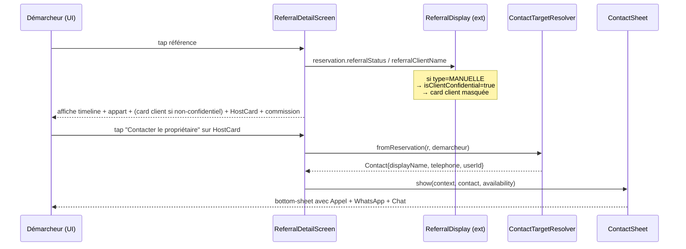

# 🏗️ Architecture — Alignement Démarcheur sur ReservationDemarcheurDto

**Feature** : `demarcheur-reservation-dto-alignment`
**Date** : 2026-05-21
**Mode** : Projet existant (Flutter + BLoC + Dio + Hive)
**Base** : `business-spec.md`

---

## 1. Vue d'ensemble

### Découverte clé du scan

L'infrastructure existante est **déjà très largement alignée** sur le nouveau payload backend :

| Élément backend | Statut côté Flutter |
|---|---|
| `proprio` nested | ✅ Parsé par `Reservation.fromJsonCommon` → `Proprietaire.fromJson` (hérite `User` qui porte `imgUrl`) |
| `appart` nested | ⚠️ Parsé partiellement — `communeNom` et `villeNom` aplatis sont **ignorés** |
| `locataire` nullable | ✅ Parsé |
| `avanceReservation` nullable | ✅ Parsé |
| `demarcheur` nested | ✅ Parsé par `ReservationDemarcheur.fromJson` |
| `montantCommission` | ✅ Parsé + utilisé par `demarcheurCommissionAmount` |
| `type` (DEMARCHEUR/PLATEFORME/MANUELLE) | ✅ Enum `ReservationType` complet + factory polymorphique `Reservation.fromJson` |
| `clientExterneNom/Telephone/Email` | ✅ Parsés |
| `motif`, `reference`, `prix`, `frais`, `debut`, `fin`, `moyenPaiement`, `statut` | ✅ Tous parsés |
| **Système de contact** | ✅ `ContactTargetResolver.fromReservation(r, demarcheur)` + `ContactSheet` + `CallButton` |
| **Écran détail** | ✅ `ReferralDetailScreen._onContactProprio()` déjà câblé bout-en-bout |
| **Identification proprio** | ✅ `HostCard` câblée sur `proprio.fullName` |

### Delta réel à traiter

L'écart entre le nouveau payload et le code est **étroit** :

1. **Parsing Appartement** : ajouter les 2 champs aplatis `communeNom` / `villeNom` qui arrivent au top-level de l'objet `appart` (sans `address` nested).
2. **Règle R4 (anonymisation)** : actuellement, la `ReferralClientCard` affiche le `clientExterneNom` même pour les réservations `MANUELLE` (cf. `ReferralDisplay.referralClientName` qui se rabat sur `clientNom` → `clientExterneNom`). À corriger pour les réservations `type == MANUELLE` côté démarcheur.
3. **Cohérence vérifiée** : aucune autre régression introduite par le nouveau payload.

### Composants impactés

```
lib/
├── model/residence/appart.dart                                  ← MODIFIER (champs aplatis)
├── screen/client/demarcheur/referrals/
│   ├── widget/referral_display.dart                             ← MODIFIER (R4)
│   └── referral_detail_screen.dart                              ← MODIFIER (R4 — masquage card)
```

**Aucun fichier à créer.** **Aucun BLoC à modifier.** **Aucun service à toucher.**

---

## 2. Diagramme de Classes (état après alignement)

```mermaid
classDiagram
    class Reservation {
        <<abstract>>
        +id: int?
        +reference: String?
        +debut/fin: DateTime?
        +prix/frais: double?
        +statut: ReservationStatus?
        +type: ReservationType?
        +proprio: Proprietaire?
        +locataire: Locataire?
        +appart: Appartement?
        +avanceReservation: AvanceReservation?
        +clientExterneNom/Telephone/Email: String?
        +motif/moyenPaiement
        +fromJson(json)$ : Reservation
        +clientNom : String?
        +isManuelle : bool
    }

    class ReservationDemarcheur {
        +demarcheur: Demarcheur?
        +montantCommission: double?
    }

    class Appartement {
        +id: int?
        +numero: String?
        +titre: String?
        +prix: double?
        +imgUrl: String?
        +status: AppartementStatus?
        +address: Address?
        +communeNom: String?         <<NOUVEAU>>
        +villeNom: String?           <<NOUVEAU>>
        +localiteLabel : String      <<NOUVEAU getter>>
    }

    class Proprietaire {
        +id, nom, prenom, telephone
        +email, imgUrl, createdAt
        (hérite User)
    }

    class ReferralDisplay {
        <<extension on Reservation>>
        +referralStatus
        +referralCommissionAmount
        +referralClientName           <<MODIFIÉ (R4)>>
        +referralClientPhone          <<MODIFIÉ (R4)>>
        +isClientConfidential : bool  <<NOUVEAU getter>>
    }

    Reservation <|-- ReservationDemarcheur
    Reservation o-- Proprietaire : proprio
    Reservation o-- Appartement : appart
    ReservationDemarcheur o-- Demarcheur : demarcheur
```

---

## 3. Diagramme de Séquence — Détail référence + contact proprio



---

## 4. Structure des Fichiers (delta uniquement)

```
lib/
├── model/residence/
│   └── appart.dart                                              [MODIFIER]
│       + champ String? communeNom (parsé depuis json['communeNom'])
│       + champ String? villeNom (parsé depuis json['villeNom'])
│       + getter localiteLabel : "Commune, Ville" / fallback address
│       + sérialisation toJson() préserve les nouveaux champs
│
└── screen/client/demarcheur/referrals/
    ├── widget/referral_display.dart                             [MODIFIER]
    │   + getter bool get isClientConfidential
    │       = (type == ReservationType.manuelle)
    │   + referralClientName : si confidential → "Client confidentiel"
    │   + referralClientPhone : si confidential → ''
    │
    └── referral_detail_screen.dart                              [MODIFIER]
        + conditionner l'affichage de la section "Client" :
          if (!reservation.isClientConfidential) { ... }
        OU
        + afficher card "Client confidentiel" (option UI/UX à valider)
```

---

## 5. Interfaces / Contrats

### 5.1 Nouveau parsing `Appartement`

```dart
class Appartement {
  // ... champs existants ...
  String? communeNom;
  String? villeNom;

  Appartement.fromJson(Map<String, dynamic> json) {
    // ... existant ...
    communeNom = json['communeNom'] as String?;
    villeNom = json['villeNom'] as String?;
    // ... existant (address nested reste parsé en fallback) ...
  }

  /// Libellé de localisation prioritaire : champs aplatis backend > Address.
  /// Format : "Commune, Ville" — vide si aucune source dispo.
  String get localiteLabel {
    if (communeNom != null && villeNom != null) {
      return '$communeNom, $villeNom';
    }
    if (communeNom != null) return communeNom!;
    if (villeNom != null) return villeNom!;
    // Fallback Address legacy (si présent)
    return address?.label ?? '';
  }
}
```

### 5.2 Extension `ReferralDisplay` (R4)

```dart
extension ReferralDisplay on Reservation {
  /// True si le client de cette réservation doit rester confidentiel pour
  /// le démarcheur (cas R4 : réservation MANUELLE → client externe du
  /// proprio, infos personnelles non partagées).
  bool get isClientConfidential => type == ReservationType.manuelle;

  String get referralClientName {
    if (isClientConfidential) return 'Client confidentiel';
    final base = clientNom?.trim().isNotEmpty == true
        ? clientNom!
        : 'Client #${id ?? 0}';
    return base;
  }

  String get referralClientPhone {
    if (isClientConfidential) return '';
    return clientExterneTelephone ?? locataire?.telephone ?? '';
  }
}
```

### 5.3 Adaptation `ReferralDetailScreen` (option à valider par UI/UX)

```dart
// Dans le build, autour de la section "Client" :
if (!reservation.isClientConfidential) ...[
  const Text('Client', style: AppTextStyles.h3),
  const SizedBox(height: 10),
  ReferralClientCard(
    name: reservation.referralClientName,
    phone: reservation.referralClientPhone,
  ),
  const SizedBox(height: 22),
],
```

OU (si UI/UX préfère afficher une card neutre) :

```dart
const Text('Client', style: AppTextStyles.h3),
const SizedBox(height: 10),
ReferralClientCard(
  name: reservation.referralClientName, // → "Client confidentiel"
  phone: reservation.referralClientPhone, // → '' → affichera "Téléphone non communiqué"
),
```

---

## 6. CONTRAT D'IMPLÉMENTATION

### 📦 Modèles / Entités
- [ ] `lib/model/residence/appart.dart` : ajouter champs `String? communeNom` et `String? villeNom`, les parser dans `fromJson`, les sérialiser dans `toJson`, les inclure dans `copyWith`, exposer un getter `localiteLabel`.

### 🎨 Extensions / Display
- [ ] `lib/screen/client/demarcheur/referrals/widget/referral_display.dart` : ajouter le getter `bool get isClientConfidential` (true si `type == ReservationType.manuelle`), modifier `referralClientName` et `referralClientPhone` pour retourner respectivement `'Client confidentiel'` et `''` quand le client est confidentiel.

### 🖥️ Écrans
- [ ] `lib/screen/client/demarcheur/referrals/referral_detail_screen.dart` : conditionner l'affichage de la section « Client » selon le choix UI/UX (masquer entièrement OU afficher la card avec libellé confidentiel).

### ⛔ Hors-périmètre (à ne PAS faire)
- ❌ Ne PAS créer de nouveau widget de contact (le système existe : `ContactTargetResolver`, `ContactSheet`, `CallButton`)
- ❌ Ne PAS modifier `Reservation.fromJsonCommon` (déjà aligné)
- ❌ Ne PAS modifier `ReservationDemarcheur.fromJson` (déjà aligné)
- ❌ Ne PAS modifier `DemarcheurBloc` ni `DemarcheurService` (déjà fonctionnels)
- ❌ Ne PAS implémenter la distinction « ma demande » vs « autre démarcheur » (R5 — l'endpoint actuel ne renvoie que les résa du démarcheur connecté, validation BA)
- ❌ Ne PAS ajouter de logs `deboger()` supplémentaires (les logs `_logReservationDetails()` existants sont conservés)

### 🧪 Critères de vérification
- [ ] Une réservation `MANUELLE` avec `clientExterneNom` renseigné côté backend N'AFFICHE PAS le nom du client sur l'écran détail
- [ ] Une réservation `DEMARCHEUR` avec `clientExterneNom` renseigné côté backend AFFICHE le nom du client (cas B)
- [ ] Le `proprio.fullName` reste affiché sur `HostCard`
- [ ] Le bouton « Contacter » sur `HostCard` ouvre la `ContactSheet` avec `proprio.telephone`
- [ ] Si le backend envoie `communeNom`/`villeNom` aplatis, le `localiteLabel` retourne « Commune, Ville »
- [ ] Aucune régression sur les autres écrans qui consomment `Appartement` (le legacy `address` nested reste prioritaire en fallback)
- [ ] Le parsing reste robuste si `proprio == null`, `locataire == null`, `avanceReservation == null`, `motif == null`

---

## 7. Tests à prévoir (audit)

- **Test unitaire** `ReferralDisplay.isClientConfidential` : 3 cas (MANUELLE → true, DEMARCHEUR → false, PLATEFORME → false)
- **Test unitaire** `ReferralDisplay.referralClientName` : MANUELLE retourne `'Client confidentiel'`
- **Test unitaire** `Appartement.fromJson` : payload avec `communeNom`+`villeNom` aplatis → `localiteLabel == "Plateau, Abidjan"`
- **Test unitaire** `Appartement.fromJson` : payload sans `communeNom` mais avec `address` nested → fallback OK

---

## 8. Flag UI

```
UI_REQUIRED: true
```

**Raison** : la règle R4 impacte visuellement l'écran détail référence. Deux options visuelles s'offrent :
- **Option A** : masquer complètement la section « Client » pour les réservations MANUELLE
- **Option B** : afficher une card neutre avec libellé « Client confidentiel » + pas de téléphone

L'agent UI/UX doit présenter les 2 options et l'utilisateur tranche.
