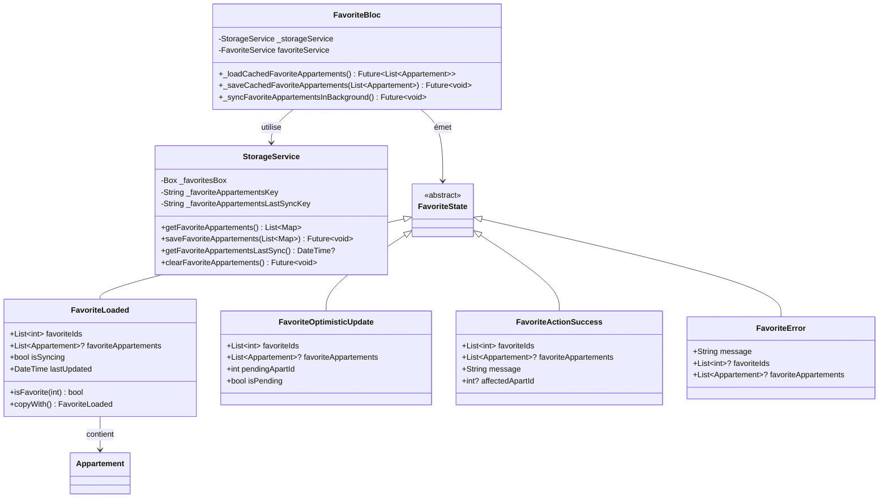
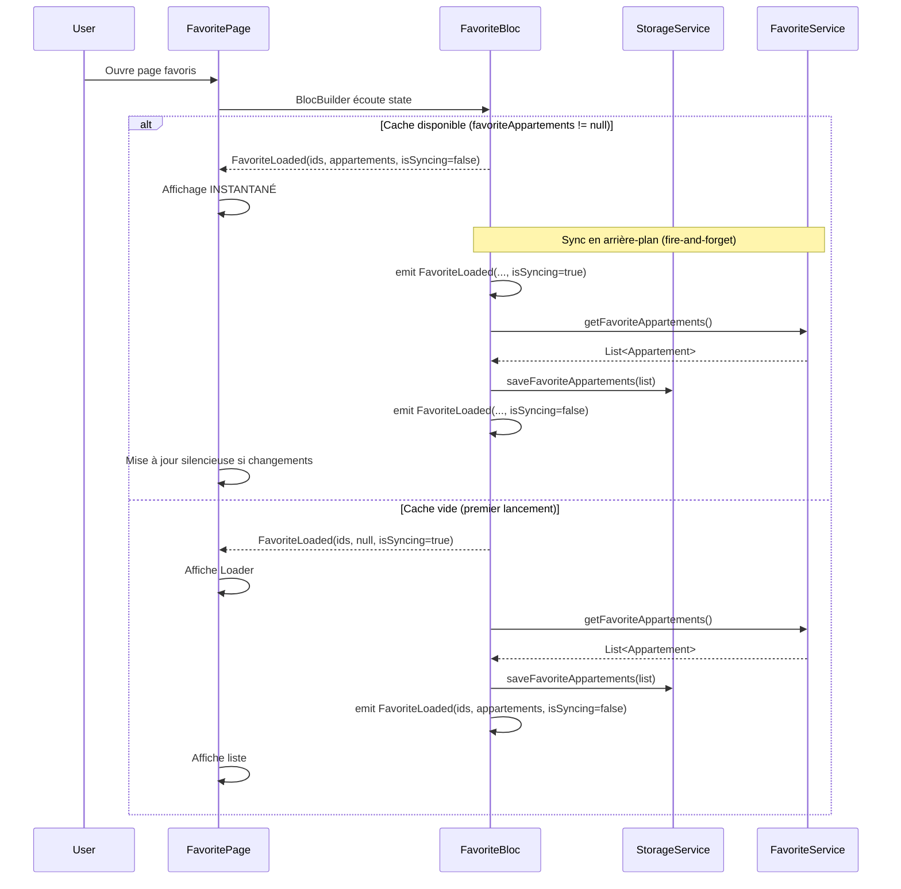
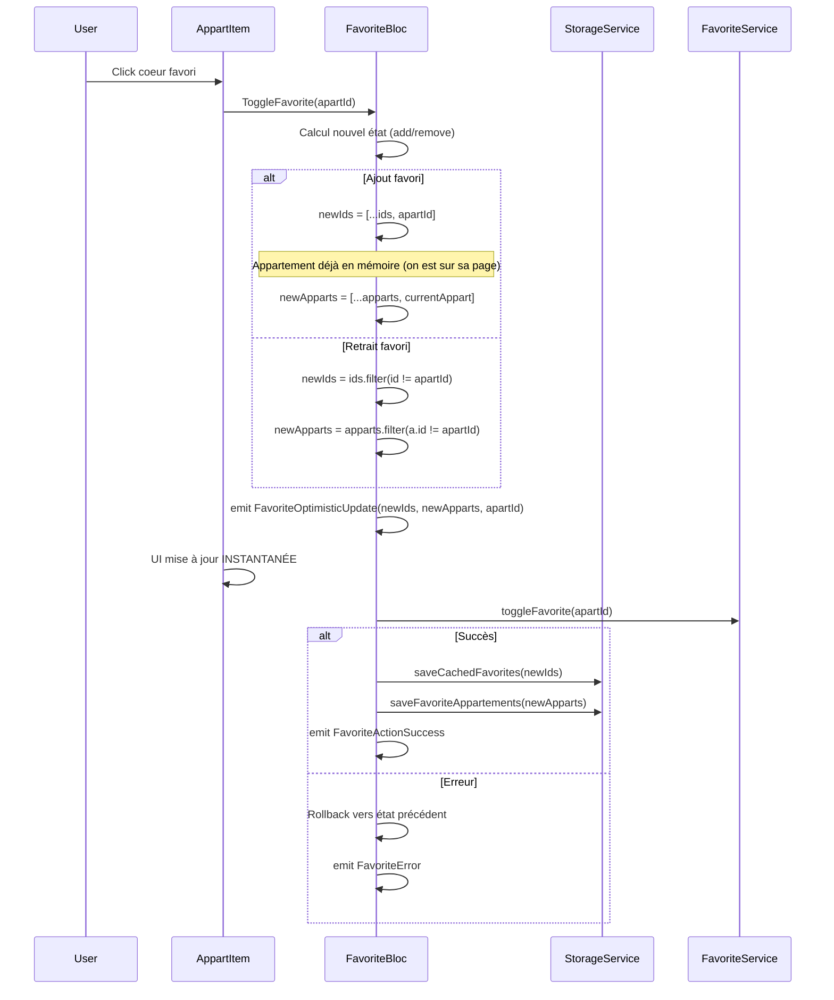
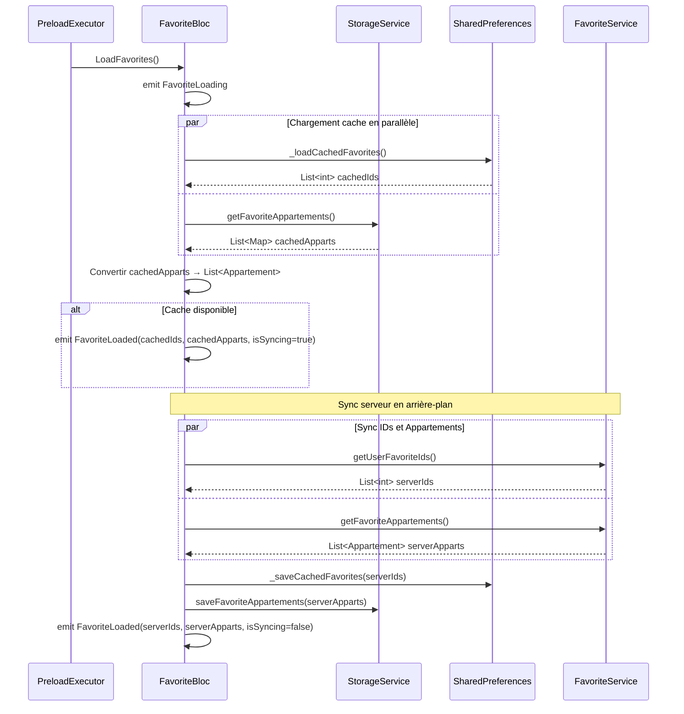

# Architecture - Cache des Appartements Favoris

## 1. Vue d'Ensemble

### Objectif
Permettre un affichage **instantané** de la page favoris en cachant localement les objets `Appartement` complets (pas juste les IDs), puis synchroniser en arrière-plan avec le serveur.

### Composants Impactés

| Composant | Modification |
|-----------|-------------|
| `StorageService` | Ajouter méthodes pour cache favoris |
| `FavoriteState` | Ajouter `favoriteAppartements` aux états |
| `FavoriteEvent` | Ajouter événement `SyncFavoriteAppartements` |
| `FavoriteBloc` | Gérer le cache des appartements + sync background |
| `Favorite` (screen) | Consommer directement les appartements du state |

### Nouvelles Entités
Aucune nouvelle entité - utilisation de `Appartement` existant.

---

## 2. Diagramme de Classes



---

## 3. Diagramme de Séquence - Chargement Page Favoris



---

## 4. Diagramme de Séquence - Toggle Favori



---

## 5. Diagramme de Séquence - Chargement Initial (LoadFavorites)



---

## 6. Structure des Fichiers

```
lib/
├── bloc/
│   └── favorite_bloc/
│       ├── favorite_bloc.dart      ← MODIFIER (ajouter cache appartements)
│       ├── favorite_event.dart     ← MODIFIER (optionnel: nouvel event)
│       └── favorite_state.dart     ← MODIFIER (ajouter favoriteAppartements)
│
├── service/
│   └── storage/
│       └── storage_service.dart    ← MODIFIER (ajouter section favoris)
│
└── screen/
    └── client/
        └── locataire/
            └── favorite/
                └── favorite.dart   ← MODIFIER (simplifier, utiliser state)
```

---

## 7. Interfaces / Contrats

### 7.1 Modifications StorageService

```dart
// Nouvelles constantes
static const String _favoriteAppartementsKey = 'favorite_appartements';
static const String _favoriteAppartementsLastSyncKey = 'favorite_appartements_last_sync';

// Nouvelles méthodes (dans la box _appartementsBox existante)

/// Récupère les appartements favoris cachés
List<Map<String, dynamic>> getFavoriteAppartements() {
  _ensureInitialized();
  try {
    final data = _appartementsBox.get(_favoriteAppartementsKey);
    if (data == null) return [];
    final List<dynamic> list = data is String ? jsonDecode(data) : List.from(data);
    return list.map((e) => _convertMap(e as Map)).toList();
  } catch (e) {
    return [];
  }
}

/// Sauvegarde les appartements favoris
Future<void> saveFavoriteAppartements(List<Map<String, dynamic>> appartements) async {
  _ensureInitialized();
  await _appartementsBox.put(_favoriteAppartementsKey, appartements);
  await _appartementsBox.put(_favoriteAppartementsLastSyncKey, DateTime.now().toIso8601String());
}

/// Date de dernière sync
DateTime? getFavoriteAppartementsLastSync() {
  _ensureInitialized();
  final syncDate = _appartementsBox.get(_favoriteAppartementsLastSyncKey) as String?;
  return syncDate != null ? DateTime.tryParse(syncDate) : null;
}

/// Vide le cache des favoris
Future<void> clearFavoriteAppartements() async {
  _ensureInitialized();
  await _appartementsBox.delete(_favoriteAppartementsKey);
  await _appartementsBox.delete(_favoriteAppartementsLastSyncKey);
}
```

### 7.2 Modifications FavoriteState

```dart
/// État avec les IDs ET les appartements favoris
class FavoriteLoaded extends FavoriteState {
  final List<int> favoriteIds;
  final List<Appartement>? favoriteAppartements; // NOUVEAU
  final bool isSyncing; // NOUVEAU - true pendant sync background
  final DateTime lastUpdated;

  FavoriteLoaded(
    this.favoriteIds, {
    this.favoriteAppartements,
    this.isSyncing = false,
    DateTime? lastUpdated,
  }) : lastUpdated = lastUpdated ?? DateTime.now();

  bool isFavorite(int apartId) => favoriteIds.contains(apartId);

  /// Récupère un appartement par ID depuis le cache
  Appartement? getAppartement(int id) {
    return favoriteAppartements?.firstWhere((a) => a.id == id, orElse: () => null);
  }

  FavoriteLoaded copyWith({
    List<int>? favoriteIds,
    List<Appartement>? favoriteAppartements,
    bool? isSyncing,
  }) {
    return FavoriteLoaded(
      favoriteIds ?? this.favoriteIds,
      favoriteAppartements: favoriteAppartements ?? this.favoriteAppartements,
      isSyncing: isSyncing ?? this.isSyncing,
      lastUpdated: DateTime.now(),
    );
  }
}

/// Mise à jour des autres états pour inclure favoriteAppartements
class FavoriteOptimisticUpdate extends FavoriteState {
  final List<int> favoriteIds;
  final List<Appartement>? favoriteAppartements; // NOUVEAU
  final int pendingApartId;
  final bool isPending;

  FavoriteOptimisticUpdate(
    this.favoriteIds,
    this.pendingApartId,
    this.isPending, {
    this.favoriteAppartements,
  });

  bool isFavorite(int apartId) => favoriteIds.contains(apartId);
}

class FavoriteActionSuccess extends FavoriteState {
  final List<int> favoriteIds;
  final List<Appartement>? favoriteAppartements; // NOUVEAU
  final String message;
  final int? affectedApartId;

  FavoriteActionSuccess(
    this.favoriteIds,
    this.message, {
    this.favoriteAppartements,
    this.affectedApartId,
  });

  bool isFavorite(int apartId) => favoriteIds.contains(apartId);
}

class FavoriteError extends FavoriteState {
  final String message;
  final List<int>? favoriteIds;
  final List<Appartement>? favoriteAppartements; // NOUVEAU
  final dynamic originalEvent;
  final bool canRetry;

  FavoriteError(
    this.message, {
    this.favoriteIds,
    this.favoriteAppartements,
    this.originalEvent,
    this.canRetry = true,
  });

  bool isFavorite(int apartId) => favoriteIds?.contains(apartId) ?? false;
}
```

### 7.3 Modifications FavoriteBloc

```dart
class FavoriteBloc extends Bloc<FavoriteEvent, FavoriteState> {
  late FavoriteService favoriteService;
  final StorageService _storageService = StorageService.instance; // NOUVEAU
  static const String _favoritesKey = 'user_favorites';

  // ... constructeur existant ...

  on<LoadFavorites>((event, emit) async {
    emit(FavoriteLoading());
    try {
      // 1. Charger depuis le cache local (IDs + Appartements)
      final cachedFavorites = await _loadCachedFavorites();
      final cachedAppartements = _loadCachedFavoriteAppartements();

      // 2. Émettre immédiatement avec le cache (si disponible)
      if (cachedFavorites.isNotEmpty || cachedAppartements.isNotEmpty) {
        emit(FavoriteLoaded(
          cachedFavorites,
          favoriteAppartements: cachedAppartements,
          isSyncing: true, // Sync en cours
        ));
      }

      // 3. Sync serveur en arrière-plan
      final serverFavorites = await favoriteService.getUserFavoriteIds();
      final serverAppartements = await favoriteService.getFavoriteAppartements();

      // 4. Sauvegarder en cache
      await _saveCachedFavorites(serverFavorites);
      await _saveCachedFavoriteAppartements(serverAppartements);

      // 5. Émettre état final
      emit(FavoriteLoaded(
        serverFavorites,
        favoriteAppartements: serverAppartements,
        isSyncing: false,
      ));
    } catch (e) {
      // En cas d'erreur, utiliser le cache
      final cachedFavorites = await _loadCachedFavorites();
      final cachedAppartements = _loadCachedFavoriteAppartements();

      emit(FavoriteError(
        ErrorHandler.extractGenericErrorMessage(e),
        favoriteIds: cachedFavorites,
        favoriteAppartements: cachedAppartements,
        originalEvent: event,
      ));
    }
  });

  // Nouvelles méthodes privées
  List<Appartement> _loadCachedFavoriteAppartements() {
    try {
      final cachedMaps = _storageService.getFavoriteAppartements();
      return cachedMaps.map((map) => Appartement.fromJson(map)).toList();
    } catch (e) {
      return [];
    }
  }

  Future<void> _saveCachedFavoriteAppartements(List<Appartement> appartements) async {
    try {
      final maps = appartements.map((a) => a.toJson()).toList();
      await _storageService.saveFavoriteAppartements(maps);
    } catch (e) {
      deboger(["failed to save favorite appartements cache:", e]);
    }
  }

  // Modifier ToggleFavorite pour gérer aussi les appartements
  // (voir section 7.4)
}
```

### 7.4 Modification ToggleFavorite (extrait)

```dart
on<ToggleFavorite>((event, emit) async {
  // ... code existant pour récupérer currentFavorites ...

  final currentAppartements = _getCurrentFavoriteAppartements();

  // Mise à jour optimiste
  final newFavorites = List<int>.from(currentFavorites);
  List<Appartement> newAppartements = List<Appartement>.from(currentAppartements);

  if (isCurrentlyFavorite) {
    newFavorites.remove(event.apartId);
    newAppartements.removeWhere((a) => a.id == event.apartId);
  } else {
    newFavorites.add(event.apartId);
    // L'appartement sera ajouté lors de la prochaine sync
    // ou peut être passé via l'event si disponible
    if (event.appartement != null) {
      newAppartements.add(event.appartement!);
    }
  }

  emit(FavoriteOptimisticUpdate(
    newFavorites,
    event.apartId,
    !isCurrentlyFavorite,
    favoriteAppartements: newAppartements,
  ));

  try {
    await favoriteService.toggleFavorite(event.apartId, isCurrentlyFavorite);
    await _saveCachedFavorites(newFavorites);
    await _saveCachedFavoriteAppartements(newAppartements);

    emit(FavoriteActionSuccess(
      newFavorites,
      isCurrentlyFavorite ? "Retiré des favoris" : "Ajouté aux favoris",
      favoriteAppartements: newAppartements,
      affectedApartId: event.apartId,
    ));
    // ... reste du code ...
  } catch (e) {
    // Rollback
    await _saveCachedFavoriteAppartements(currentAppartements);
    // ... reste du code erreur ...
  }
});
```

### 7.5 Modification FavoriteEvent (optionnel)

```dart
/// Toggle un favori avec l'appartement complet (pour ajout au cache)
class ToggleFavorite extends FavoriteEvent {
  final int apartId;
  final Appartement? appartement; // NOUVEAU - optionnel

  ToggleFavorite(this.apartId, {this.appartement});
}
```

### 7.6 Simplification Favorite Screen

```dart
class _FavoriteState extends State<Favorite> {
  // SUPPRIMÉ: List<Appartement>? appartements;
  // SUPPRIMÉ: bool isLoadingAppartements = false;
  // SUPPRIMÉ: final favoriteService = FavoriteService();
  // SUPPRIMÉ: Future<void> _loadAppartements(...)

  @override
  Widget build(BuildContext context) {
    return BlocBuilder<UserBloc, UserState>(
      builder: (context, userState) {
        if (userState is! UserLoaded) {
          return Scaffold(
            appBar: AppBar(title: TextSeed("Favoris")),
            body: GuestLoginPrompt(message: "Connectez-vous..."),
          );
        }

        return Scaffold(
          appBar: AppBar(title: TextSeed("Favoris")),
          body: BlocConsumer<FavoriteBloc, FavoriteState>(
            listener: (context, state) {
              if (state is FavoriteActionSuccess) {
                ScaffoldMessenger.of(context).showSnackBar(...);
              }
            },
            builder: (context, state) {
              // Initial ou Loading sans cache
              if (state is FavoriteInitial || state is FavoriteLoading) {
                return const ListShimmer(itemCount: 3);
              }

              if (state is FavoriteLoaded) {
                final appartements = state.favoriteAppartements;

                // Cache vide et sync en cours = loader
                if (appartements == null && state.isSyncing) {
                  return const ListShimmer(itemCount: 3);
                }

                // Pas de favoris
                if (appartements == null || appartements.isEmpty) {
                  return FavoriteEmptyState(onExplore: () => Navigator.pop(context));
                }

                // AFFICHAGE INSTANTANÉ depuis le cache
                return _buildList(appartements, state.isSyncing);
              }

              if (state is FavoriteError) {
                // Afficher le cache si disponible malgré l'erreur
                if (state.favoriteAppartements?.isNotEmpty ?? false) {
                  return _buildList(state.favoriteAppartements!, false);
                }
                return FavoriteErrorState(message: state.message);
              }

              return const ListShimmer(itemCount: 3);
            },
          ),
        );
      },
    );
  }

  Widget _buildList(List<Appartement> appartements, bool isSyncing) {
    return RefreshIndicator(
      onRefresh: () async {
        context.read<FavoriteBloc>().add(LoadFavorites());
      },
      child: SingleChildScrollView(
        physics: AlwaysScrollableScrollPhysics(),
        padding: EdgeInsets.all(8),
        child: Column(
          crossAxisAlignment: CrossAxisAlignment.start,
          children: [
            // Indicateur de sync discret (optionnel)
            if (isSyncing)
              LinearProgressIndicator(minHeight: 2),
            Padding(
              padding: EdgeInsets.only(bottom: 16),
              child: TextSeed(
                "${appartements.length} appartement${appartements.length > 1 ? 's' : ''} favori${appartements.length > 1 ? 's' : ''}",
                fontSize: 16,
                fontWeight: FontWeight.w600,
              ),
            ),
            ...appartements.map((appart) => AppartItem(appart)),
          ],
        ),
      ),
    );
  }
}
```

---

## 8. Plan d'Implémentation

| Ordre | Fichier | Action | Complexité |
|-------|---------|--------|------------|
| 1 | `storage_service.dart` | Ajouter méthodes cache favoris | Faible |
| 2 | `favorite_state.dart` | Ajouter `favoriteAppartements` aux états | Faible |
| 3 | `favorite_event.dart` | Ajouter `appartement` optionnel à `ToggleFavorite` | Faible |
| 4 | `favorite_bloc.dart` | Intégrer cache appartements + sync background | Moyenne |
| 5 | `favorite.dart` | Simplifier (consommer state directement) | Moyenne |

---

## 9. Avantages de cette Architecture

1. **Affichage instantané** : Les données sont servies depuis Hive sans attente réseau
2. **Sync transparente** : L'utilisateur ne perçoit pas la synchronisation
3. **Réutilisation** : Utilise `StorageService` et patterns existants
4. **Mode offline** : Fonctionne sans connexion
5. **Optimistic update** : Conserve le pattern existant pour les toggles
6. **Minimal changes** : Pas de nouvelles entités, modifications ciblées

---

## 10. Besoin UI

**Aucun composant UI nouveau nécessaire.**

L'interface existante est conservée, seule la source des données change (state du bloc au lieu d'appel API dans le widget).

---

*Architecture validée par l'Agent Architecture*
*Prêt pour l'Agent Développement*
