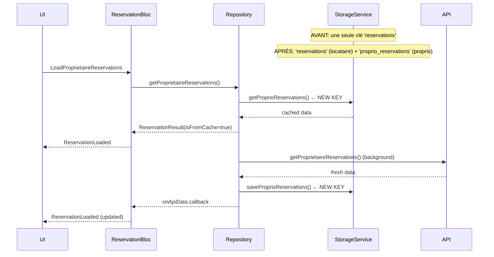

# Architecture — Correction des Problèmes Critiques

## 1. Vue d'ensemble

### Problèmes ciblés (4 critiques)

| # | Problème | Fichier(s) | Impact |
|---|----------|------------|--------|
| C1 | Cache Hive partagé locataire/proprio | `storage_service.dart`, `reservation_repository.dart` | Données corrompues au changement de compte |
| C2 | URL `/api/` incohérente dans OccupationService | `occupation_service.dart` | Calendrier d'occupation non fonctionnel (404) |
| C3 | AvailabilityBloc non connecté à l'API | `availability_bloc.dart` | Blocage de dates non persisté |
| C4 | NavigateMonth sans rechargement des données | `occupation_calendar_bloc.dart`, `occupation_calendar_state.dart` | Données obsolètes sur navigation mensuelle |

---

## 2. Corrections Détaillées

### C1 — Cache partagé locataire/proprio

**Problème :**
```dart
// ReservationRepository.dart — LES DEUX méthodes utilisent la même clé Hive
getCachedReservations()                    → _storage.getReservations()       ← MÊME CLÉ
fetchAndCacheProprietaireReservations()    → _storage.saveReservations()      ← MÊME CLÉ
fetchAndCacheUserReservations()            → _storage.saveReservations()      ← MÊME CLÉ
```

**Solution — Ajouter clés séparées dans StorageService :**

```
StorageService
├── [existant] _reservationsKey       = 'reservations'          → locataire
├── [NEW]      _proprioReservationsKey = 'proprio_reservations'  → propriétaire
└── [NEW]      _proprioReservationsLastSyncKey = 'proprio_reservations_last_sync'

Méthodes à ajouter :
├── getProprioReservations()          → List<Map<String, dynamic>>
├── saveProprioReservations(List)     → Future<void>
├── clearProprioReservations()        → Future<void>
└── getProprioReservationsLastSync()  → DateTime?
```

**Solution — Mise à jour ReservationRepository :**
```
getCachedProprietaireReservations()  → _storage.getProprioReservations()
getCachedUserReservations()          → _storage.getReservations()      (existant)
fetchAndCacheProprietaireReservations() → _storage.saveProprioReservations()
fetchAndCacheUserReservations()         → _storage.saveReservations()  (existant)
```

---

### C2 — URL `/api/` incohérente

**Problème :**
```dart
// occupation_service.dart:47
final response = await _dioRequest.get('/api/occupation/$appartementId', ...);
// Tous les autres services: "user/reservations", "auth/appartement/...", etc. (sans /api/)
```

**Solution — Alignement sur la convention existante :**
```dart
// Avant
'/api/occupation/$appartementId'
// Après
'occupation/$appartementId'    // sans slash initial, sans /api/
```

**Bonus inclus — Parallélisation multi-appartements :**
```dart
// Avant (séquentiel - N×latence)
for (final appartId in appartementIds) {
  final periods = await getOccupationPeriods(...);
}

// Après (parallèle - 1×latence max)
final futures = appartementIds.map((id) => getOccupationPeriods(...));
final results = await Future.wait(futures);
```

---

### C3 — AvailabilityBloc non connecté à l'API

**Problème :**
```dart
// availability_bloc.dart — toutes les méthodes sont des stubs
await Future.delayed(const Duration(milliseconds: 300)); // simulation
// TODO: Appeler l'API
```

**Solution — Créer AvailabilityService + connecter au BLoC :**

**Nouveau fichier : `lib/service/model/availability/availability_service.dart`**
```
AvailabilityService
├── getAvailability(int appartementId)
│     GET  proprietaire/appartement/{id}/availability
│     → { blockedPeriods: [...], reservedPeriods: [...] }
│
├── blockDates(int appartementId, DateTimeRange range)
│     POST proprietaire/appartement/{id}/availability/block
│     body: { startDate, endDate }
│     → BlockedPeriod
│
└── unblockDates(int appartementId, int blockId)
│     DELETE proprietaire/appartement/{id}/availability/block/{blockId}
│     → void
```

**Modification `availability_bloc.dart` :**
- Injecter `AvailabilityService` dans le constructeur
- Remplacer les `Future.delayed` stubs par les appels réels au service
- Garder la même structure d'états (AvailabilityLoaded, AvailabilityOperationSuccess, AvailabilityError)

---

### C4 — NavigateMonth sans rechargement

**Problème :**
```dart
// occupation_calendar_bloc.dart:183
// TODO: Recharger les données pour le nouveau mois
// Pour l'instant, on change juste le mois focalisé
emit(currentState.copyWith(focusedMonth: newMonth));
// ⚠️ Les périodes affichées ne changent pas !
```

**Solution — Stocker le contexte source dans l'état :**

**Modification `OccupationCalendarState` :**
```dart
sealed class OccupationCalendarState {
  // Champs existants...

  // NOUVEAU : contexte pour permettre le rechargement automatique
  final int? sourceAppartementId;      // mode apartment
  final List<int>? sourceAppartementIds; // mode residence
}
```

**Modification `OccupationCalendarBloc._onNavigateMonth` :**
```
NavigateMonth event
    │
    ├── Calculer newMonth
    │
    ├── state.mode == APARTMENT ?
    │       → add(LoadOccupation(appartementId: state.sourceAppartementId, month, year))
    │
    └── state.mode == RESIDENCE ?
            → add(LoadOccupationForResidence(appartementIds: state.sourceAppartementIds, month, year))
```

---

## 3. Diagramme de Séquence — C1 (Cache séparé)



---

## 4. Structure des fichiers impactés

```
lib/
├── service/
│   ├── storage/
│   │   └── storage_service.dart          ← MODIFIER (C1: nouvelles clés proprio)
│   └── model/
│       ├── occupation/
│       │   └── occupation_service.dart   ← MODIFIER (C2: URL + parallélisation)
│       └── availability/
│           └── availability_service.dart ← CRÉER (C3: nouveau service)
├── bloc/
│   ├── availability_bloc/
│   │   └── availability_bloc.dart        ← MODIFIER (C3: connexion API)
│   └── occupation_calendar_bloc/
│       ├── occupation_calendar_state.dart ← MODIFIER (C4: sourceAppartementId/Ids)
│       └── occupation_calendar_bloc.dart  ← MODIFIER (C4: reload sur NavigateMonth)
└── service/
    └── repository/
        └── reservation_repository.dart   ← MODIFIER (C1: clés séparées)
```

**Total : 1 fichier créé + 5 fichiers modifiés**

---

## 5. Dépendance — Endpoints API pour AvailabilityService (C3)

> ⚠️ Les endpoints ci-dessous sont déduits des conventions du projet.
> À confirmer avec l'équipe backend avant implémentation.

| Action | Méthode | URL supposée |
|--------|---------|-------------|
| Charger disponibilités | GET | `proprietaire/appartement/{id}/availability` |
| Bloquer des dates | POST | `proprietaire/appartement/{id}/availability/block` |
| Débloquer des dates | DELETE | `proprietaire/appartement/{id}/availability/block/{blockId}` |
