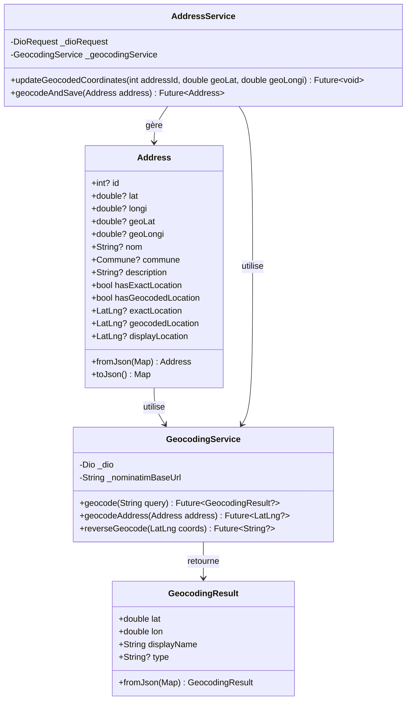
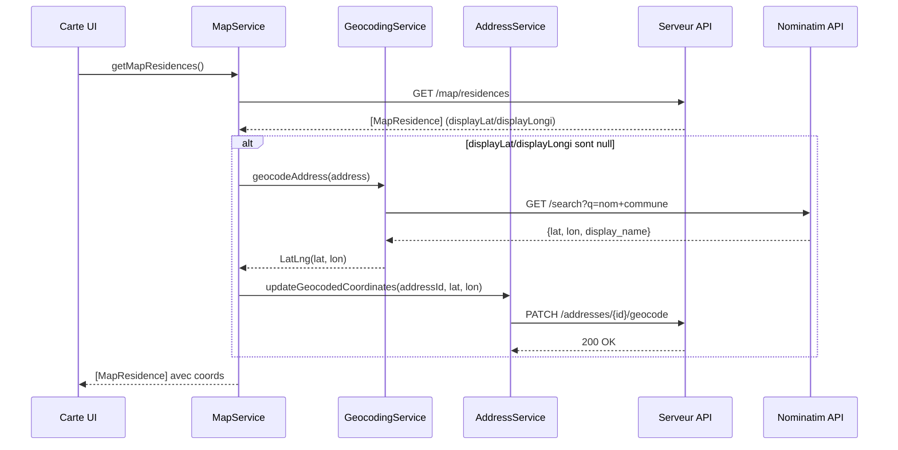
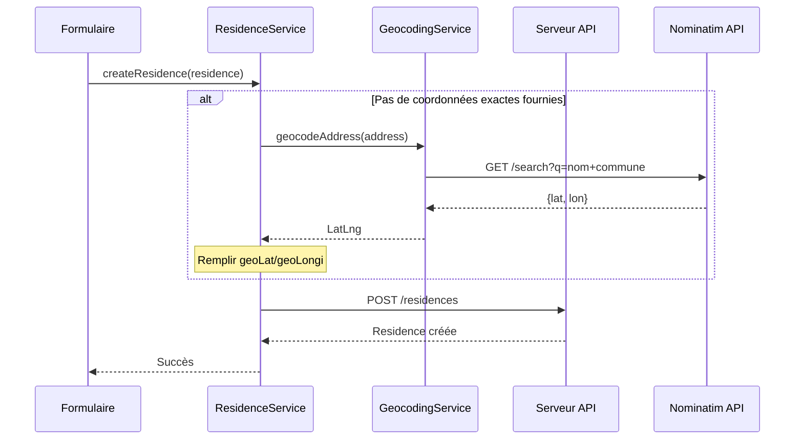

# Architecture : Géocodage Address

## 1. Vue d'ensemble

### Objectif
Ajouter un système de coordonnées géocodées dans le modèle `Address` pour permettre l'affichage des résidences sur la carte même sans coordonnées exactes, tout en protégeant la vie privée des propriétaires.

### Composants impactés

| Composant | Type | Action |
|-----------|------|--------|
| `Address` | Modèle | Ajouter champs `geoLat`/`geoLongi` |
| `GeocodingService` | Service | **NOUVEAU** - Appel API Nominatim |
| `MapResidence` | Modèle | Aucun changement (utilise déjà `displayLat`/`displayLongi`) |
| `MapService` | Service | Ajout méthode pour déclencher géocodage si nécessaire |

### Principe de fonctionnement

```
┌─────────────────────────────────────────────────────────────────┐
│                         SERVEUR                                  │
├─────────────────────────────────────────────────────────────────┤
│                                                                  │
│  Address (BDD)                                                   │
│  ├── lat / longi        ← Coordonnées EXACTES                    │
│  └── geoLat / geoLongi  ← Coordonnées GÉOCODÉES (nouveau)        │
│                                                                  │
│  Logique d'envoi API :                                           │
│  ┌────────────────────────────────────────────────────────┐     │
│  │ Si (réservation PAYÉE OU propriétaire) :               │     │
│  │    displayLat = lat, displayLongi = longi              │     │
│  │ Sinon :                                                 │     │
│  │    displayLat = geoLat, displayLongi = geoLongi        │     │
│  └────────────────────────────────────────────────────────┘     │
│                                                                  │
└─────────────────────────────────────────────────────────────────┘
                              │
                              ▼
┌─────────────────────────────────────────────────────────────────┐
│                         CLIENT                                   │
├─────────────────────────────────────────────────────────────────┤
│                                                                  │
│  MapResidence (reçu du serveur)                                  │
│  ├── displayLat / displayLongi  ← Coords à afficher              │
│  └── (le client ne sait pas si c'est exact ou géocodé)          │
│                                                                  │
│  GeocodingService (nouveau)                                      │
│  └── Si geoLat/geoLongi vides → géocoder + PATCH serveur        │
│                                                                  │
└─────────────────────────────────────────────────────────────────┘
```

---

## 2. Diagramme de Classes



---

## 3. Diagramme de Séquence

### Cas 1 : Affichage carte avec coords géocodées manquantes



### Cas 2 : Création résidence (propriétaire)



---

## 4. Structure des Fichiers

```
lib/
├── model/
│   ├── locolite/
│   │   └── address.dart                    # MODIFIER - Ajouter geoLat/geoLongi
│   │
│   └── geocoding/
│       └── geocoding_result.dart           # NOUVEAU - Modèle résultat
│
├── service/
│   ├── geocoding/
│   │   └── geocoding_service.dart          # NOUVEAU - Service Nominatim
│   │
│   └── model/
│       └── address/
│           └── address_service.dart        # NOUVEAU - CRUD Address + géocodage
```

---

## 5. Interfaces / Contrats

### 5.1 Address (modifié)

```dart
class Address {
  int? id;
  double? lat;          // Coordonnées exactes
  double? longi;
  double? geoLat;       // NOUVEAU - Coordonnées géocodées
  double? geoLongi;     // NOUVEAU
  String? nom;
  Commune? commune;
  String? description;

  /// Vérifie si les coordonnées géocodées sont disponibles
  bool get hasGeocodedLocation => geoLat != null && geoLongi != null;

  /// Retourne les coordonnées géocodées
  LatLng? get geocodedLocation =>
      hasGeocodedLocation ? LatLng(geoLat!, geoLongi!) : null;

  /// Retourne les coordonnées à afficher (exactes si dispo, sinon géocodées)
  LatLng? get displayLocation => exactLocation ?? geocodedLocation;
}
```

### 5.2 GeocodingService (nouveau)

```dart
class GeocodingService {
  static const String _nominatimBaseUrl = 'https://nominatim.openstreetmap.org';

  /// Géocode une requête textuelle
  /// Retourne null si aucun résultat ou erreur
  Future<GeocodingResult?> geocode(String query);

  /// Géocode une Address à partir de son nom + commune
  Future<LatLng?> geocodeAddress(Address address);

  /// Géocodage inverse : coords → adresse textuelle
  Future<String?> reverseGeocode(LatLng coords);
}
```

### 5.3 GeocodingResult (nouveau)

```dart
class GeocodingResult {
  final double lat;
  final double lon;
  final String displayName;
  final String? type;
  final String? importance;

  GeocodingResult({
    required this.lat,
    required this.lon,
    required this.displayName,
    this.type,
    this.importance,
  });

  LatLng get latLng => LatLng(lat, lon);

  factory GeocodingResult.fromJson(Map<String, dynamic> json);
}
```

### 5.4 AddressService (nouveau)

```dart
class AddressService {
  final DioRequest _dioRequest;
  final GeocodingService _geocodingService;

  /// Met à jour les coordonnées géocodées sur le serveur
  Future<void> updateGeocodedCoordinates(
    int addressId,
    double geoLat,
    double geoLongi,
  );

  /// Géocode une address et sauvegarde le résultat
  Future<Address> geocodeAndSave(Address address);
}
```

---

## 6. API Nominatim

### Endpoint de recherche
```
GET https://nominatim.openstreetmap.org/search
```

### Paramètres
| Param | Description | Exemple |
|-------|-------------|---------|
| `q` | Requête de recherche | `Cocody, Abidjan` |
| `format` | Format de réponse | `json` |
| `limit` | Nombre max de résultats | `1` |
| `addressdetails` | Inclure détails adresse | `1` |

### Headers requis
```
User-Agent: AsfarApp/1.0
```

### Exemple de réponse
```json
[
  {
    "lat": "5.3364",
    "lon": "-4.0267",
    "display_name": "Cocody, Abidjan, Côte d'Ivoire",
    "type": "suburb",
    "importance": 0.6
  }
]
```

### Limites d'utilisation
- Max 1 requête/seconde
- User-Agent obligatoire
- Usage commercial : contacter OSM

---

## 7. Endpoint serveur à créer (côté backend)

### PATCH /addresses/{id}/geocode

Met à jour les coordonnées géocodées d'une adresse.

**Request:**
```json
{
  "geoLat": 5.3364,
  "geoLongi": -4.0267
}
```

**Response:** `200 OK`

---

## 8. Plan d'implémentation

### Étape 1 : Modèle Address
- [ ] Ajouter champs `geoLat` et `geoLongi`
- [ ] Ajouter getters `hasGeocodedLocation`, `geocodedLocation`, `displayLocation`
- [ ] Mettre à jour `fromJson` et `toJson`

### Étape 2 : GeocodingResult
- [ ] Créer le modèle `lib/service/geocoding/geocoding_result.dart`

### Étape 3 : GeocodingService
- [ ] Créer `lib/service/geocoding/geocoding_service.dart`
- [ ] Implémenter `geocode(String query)`
- [ ] Implémenter `geocodeAddress(Address address)`
- [ ] Implémenter `reverseGeocode(LatLng coords)`
- [ ] Gérer le rate limiting (1 req/sec)

### Étape 4 : AddressService
- [ ] Créer `lib/service/model/address/address_service.dart`
- [ ] Implémenter `updateGeocodedCoordinates`
- [ ] Implémenter `geocodeAndSave`

### Étape 5 : Intégration MapService
- [ ] Modifier `getMapResidences` pour déclencher géocodage si coords manquantes
- [ ] Sauvegarder les résultats sur le serveur

---

## 9. Considérations

### Performance
- Cache local des résultats de géocodage (éviter requêtes répétées)
- Debounce sur les requêtes (1 req/sec max pour Nominatim)

### Gestion d'erreurs
- Timeout sur les requêtes Nominatim (5s)
- Fallback si Nominatim indisponible : pas de coords, résidence non affichée
- Retry avec backoff exponentiel

### Vie privée
- Les coords géocodées représentent le centre du quartier/commune
- Jamais les coords exactes pour les non-autorisés

---

**Créé le:** 2025-12-27
**Spécification métier:** `.ai-outputs/specs/geocodage-address/business-spec.md`
