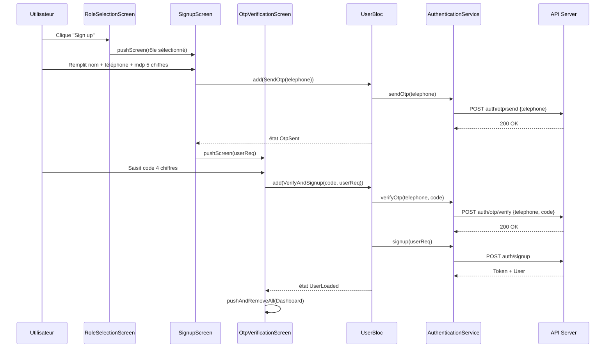
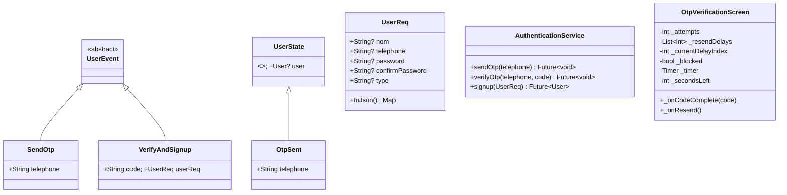

# Architecture — Refonte du Flux d'Inscription

## 1. Vue d'ensemble

**Objectif :** Remplacer 2 flux d'inscription fragmentés par un flux unique en 3 étapes : sélection de rôle → formulaire simplifié → vérification OTP → création du compte.

**Pattern conservé :** BLoC (flutter_bloc) — aucun nouveau système d'état créé.

**Composants impactés :** UserBloc, AuthenticationService, écrans signup, widget TextSingup, DTO UserReq.

---

## 2. Diagramme de Séquence



---

## 3. Diagramme de Classes



---

## 4. Structure des Fichiers

```
lib/
├── screen/signup/
│   ├── role_selection_screen.dart     [CRÉER]
│   ├── signup_screen.dart             [CRÉER]
│   ├── otp_verification_screen.dart   [CRÉER]
│   ├── signup.dart                    [SUPPRIMER]
│   └── widget/
│       └── signup_form.dart           [SUPPRIMER]
│
├── screen/login/
│   └── signup_demarcheur_screen.dart  [SUPPRIMER]
│
├── widget/input/
│   └── otp_input.dart                 [CRÉER]
│
├── bloc/user_bloc/
│   ├── user_event.dart                [MODIFIER]
│   ├── user_state.dart                [MODIFIER]
│   └── user_bloc.dart                 [MODIFIER]
│
├── service/model/Auth/
│   └── authentication_service.dart    [MODIFIER]
│
├── dto/
│   └── user_req.dart                  [MODIFIER]
│
├── model/request/
│   └── demarcheur_signup_req.dart     [SUPPRIMER]
│
└── widget/text/
    └── text_singup.dart               [MODIFIER]
```

---

## 5. CONTRAT D'IMPLÉMENTATION

### Fichiers à SUPPRIMER (4)
- [ ] lib/screen/signup/signup.dart
- [ ] lib/screen/signup/widget/signup_form.dart
- [ ] lib/screen/login/signup_demarcheur_screen.dart
- [ ] lib/model/request/demarcheur_signup_req.dart

### Écrans à CRÉER (3)
- [ ] lib/screen/signup/role_selection_screen.dart
      → 3 cartes de rôle, navigue vers SignupScreen(role)
- [ ] lib/screen/signup/signup_screen.dart
      → StatefulWidget, 3 champs (nom, téléphone, mdp 5 chiffres)
      → Construit UserReq avec le rôle, dispatche SendOtp
      → À OtpSent : navigue vers OtpVerificationScreen(userReq)
- [ ] lib/screen/signup/otp_verification_screen.dart
      → Reçoit UserReq en paramètre
      → 4 cases OTP via OtpInput widget
      → Gère attempts (max 5), timer renvoi progressif [15,20,30,60]s
      → Dispatche VerifyAndSignup(code, userReq)
      → À UserLoaded : pushAndRemoveAll vers dashboard selon rôle

### Widgets à CRÉER (1)
- [ ] lib/widget/input/otp_input.dart
      → 4 TextField individuels en Row
      → Focus auto-avance, backspace recule
      → onCompleted(String code) callback

### BLoC — user_event.dart à MODIFIER
- [ ] Supprimer : SignupDemarcheur, StartDataPreload
- [ ] Supprimer : import demarcheur_signup_req.dart
- [ ] Ajouter : SendOtp(String telephone)
- [ ] Ajouter : VerifyAndSignup(String code, UserReq userReq)

### BLoC — user_state.dart à MODIFIER
- [ ] Ajouter : OtpSent(String telephone) extends UserState

### BLoC — user_bloc.dart à MODIFIER
- [ ] Supprimer : on<SignupDemarcheur>
- [ ] Ajouter : on<SendOtp> → UserLoading → sendOtp() → OtpSent | UserError
- [ ] Ajouter : on<VerifyAndSignup> → UserLoading → verifyOtp() + signup() → UserLoaded | UserError

### Service — authentication_service.dart à MODIFIER
- [ ] Supprimer : signupDemarcheur(), urlSignupDemarcheur, import DemarcheurSignupReq
- [ ] Ajouter : static urlOtpSend = "auth/otp/send"
- [ ] Ajouter : static urlOtpVerify = "auth/otp/verify"
- [ ] Ajouter : sendOtp(String telephone)
- [ ] Ajouter : verifyOtp(String telephone, String code)

### DTO — user_req.dart à MODIFIER
- [ ] Corriger : "cofirmePass" → "confirmePass"

### Widget — text_singup.dart à MODIFIER
- [ ] Changer : Signup() → RoleSelectionScreen()

---

UI_REQUIRED: true
