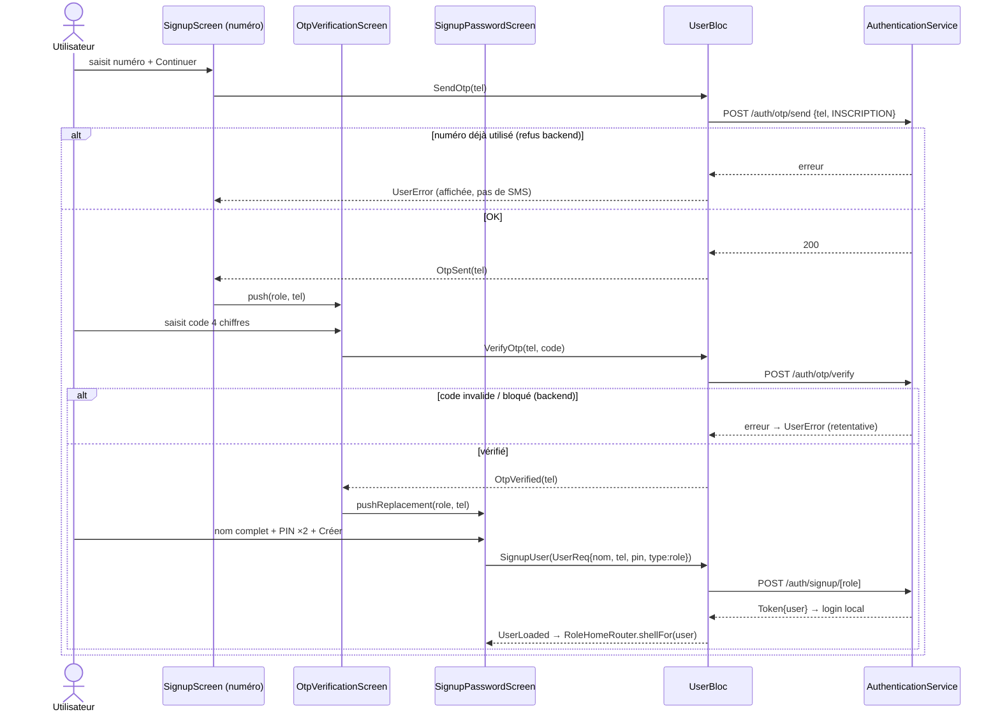

# Architecture — Inscription simplifiée par téléphone

> **Spec métier :** `business-spec.md` (validée) · **Projet existant :** Flutter/BLoC
> **Date :** 2026-06-11

## 1. Vue d'ensemble

Découper l'inscription monolithique (1 formulaire 6 champs + OTP final) en
3 écrans séquentiels, en réutilisant le `UserBloc` et l'`AuthenticationService`
existants :

```
SignupScreen (numéro)  →  OtpVerificationScreen (code 4)  →  SignupPasswordScreen (nom + PIN ×2)  →  shell du rôle
        SendOtp                 VerifyOtp                          SignupUser
```

- **Aucun nouvel endpoint requis** : `POST /auth/otp/send` (le backend refuse un
  numéro déjà inscrit → l'erreur s'affiche à l'étape 1, avant tout SMS),
  `POST /auth/otp/verify`, `POST /auth/signup[...]` par rôle — tous existants.
- **Rôle** : continue d'arriver d'onboarding/login via `SignupScreen(role: ...)`
  — signature conservée, aucun appelant modifié.
- **Email** : plus collecté ; `UserReq.email` reste `null` (DTO inchangé).
- **Prénom** : plus collecté ; nom complet envoyé dans `UserReq.nom`.

## 2. Changements d'état (UserBloc)

Le découplage clé : aujourd'hui `VerifyAndSignup(code, userReq)` fait
vérification **et** création en un coup. Le nouveau flux exige de vérifier
l'OTP **avant** de connaître le mot de passe → on scinde :

| Avant | Après |
|---|---|
| `SendOtp(telephone)` → `OtpSent` | inchangé |
| `VerifyAndSignup(code, userReq)` → `UserLoaded` | **supprimé**, remplacé par : |
| | `VerifyOtp(telephone, code)` → **`OtpVerified(telephone)`** (nouvel état) |
| `SignupUser(userReq)` → `UserLoaded` (existant, réutilisé tel quel) | inchangé |

## 3. Diagramme de séquence



## 4. Renvoi progressif — helper pur

Cooldowns successifs **15s → 20s → 30s → 60s** (plafonné à 60), indexés sur le
nombre de renvois demandés. Logique extraite dans un helper pur testable :

```dart
/// lib/util/helper/otp_resend_policy.dart
class OtpResendPolicy {
  static const delays = [15, 20, 30, 60]; // secondes
  /// Délai à appliquer avant le (resendCount+1)-ième envoi.
  static int delayFor(int resendCount) =>
      delays[resendCount.clamp(0, delays.length - 1)];
}
```

L'écran OTP démarre à `delayFor(0)` = 15s après l'envoi initial, puis incrémente
son compteur à chaque renvoi.

## 5. Structure des fichiers

```
lib/
├── bloc/user_bloc/
│   ├── user_event.dart        [M] - VerifyAndSignup, + VerifyOtp(telephone, code)
│   ├── user_state.dart        [M] + OtpVerified(telephone)
│   └── user_bloc.dart         [M] handler VerifyOtp ; retrait handler VerifyAndSignup
├── screen/signup/
│   ├── signup_screen.dart     [M] étape 1 : titre + PhoneInputField + Continuer
│   │                              (signature SignupScreen(role) conservée)
│   ├── otp_verification_screen.dart  [M] 4 chiffres, reçoit (role, telephone),
│   │                              renvoi progressif via OtpResendPolicy,
│   │                              OtpVerified → SignupPasswordScreen
│   ├── signup_password_screen.dart   [C] étape 3 : nom complet + PIN + confirmation
│   └── widget/
│       ├── signup_form.dart   [S] supprimé (remplacé par les 3 étapes)
│       ├── signup_phone_form.dart    [C] champ téléphone + bouton (extrait de l'écran)
│       ├── signup_password_form.dart [C] nom + 2 champs PIN + bouton Créer
│       └── otp_code_input.dart [M] paramétrable en longueur (6 → 4 pour ce flux)
├── util/helper/
│   └── otp_resend_policy.dart [C] délais progressifs (pur, testable)
test/
├── util/helper/otp_resend_policy_test.dart  [C]
└── bloc/user_bloc_signup_test.dart          [C] VerifyOtp → OtpVerified ; erreurs
```
`[C]` créer · `[M]` modifier · `[S]` supprimer

## 6. Règles de validation locales

| Champ | Règle | Où |
|---|---|---|
| Téléphone | ≥ 11 chiffres (préfixe +225 + national) — règle actuelle conservée | SignupPhoneForm |
| Code OTP | exactement 4 chiffres (submit auto à complétion) | OtpVerificationScreen |
| Nom complet | non vide | SignupPasswordForm |
| PIN | exactement 5 chiffres numériques | SignupPasswordForm |
| Confirmation | identique au PIN, vérifiée localement (aucun appel) | SignupPasswordForm |

## 7. Points de vigilance

1. **Longueur OTP** : l'UI actuelle suppose 6 chiffres ; la spec dit 4. La
   longueur devient un paramètre d'`OtpCodeInput` + constante du flux
   (`kSignupOtpLength = 4`) — un seul endroit à changer si le backend émet
   encore du 6.
2. **Navigation arrière** : depuis l'étape 3, `pushReplacement` a remplacé
   l'écran OTP → un back ramène à l'étape numéro (conforme spec : pas de retour
   sur un OTP déjà consommé).
3. **`UserReq.confirmPassword`** : le backend attend `confirmePass` — on
   continue de le remplir (= PIN confirmé).
4. **Rôle → endpoint** : `_signupUrlForRole` switch sur `"Demarcheur"/"Proprietaire"`
   alors que l'onboarding passe des rôles en minuscules — comportement existant
   à vérifier au dev (hors périmètre de changement, mais à confirmer pour ne pas
   casser le routage des inscriptions proprio/démarcheur).

## AMENDEMENT UI (B1 validé)

La décision UI/UX B1 (`ui-proposal.md`) découpe l'étape 3 en **3 pages** avec
clavier numérique dédié pour le PIN. Le parcours final compte 5 écrans :
numéro → OTP → nom complet → code secret → confirmation. La saisie PIN
n'utilise pas le clavier système : un widget `PinKeypad` pilote des cellules
d'affichage `PinDotsDisplay`. Les données s'accumulent de page en page via
les constructeurs (role → telephone → nom → pin), le `SignupUser` n'étant
dispatché qu'à la confirmation.

## CONTRAT D'IMPLÉMENTATION

### Pages / Routes
- [ ] `SignupScreen(role)` → étape 1, saisie numéro seule, push OTP sur `OtpSent`
- [ ] `OtpVerificationScreen(role, telephone)` → étape 2, code 4 chiffres, `pushReplacement` vers SignupNameScreen sur `OtpVerified`
- [ ] `SignupNameScreen(role, telephone)` → étape 3, nom complet seul (clavier système), push étape 4
- [ ] `SignupPinScreen(role, telephone, nom)` → étape 4, 5 cellules + PinKeypad, push étape 5 à 5 chiffres
- [ ] `SignupPinConfirmScreen(role, telephone, nom, pin)` → étape 5, re-saisie ; égalité locale → `SignupUser` ; `pushAndRemoveAll` shell sur `UserLoaded` ; mismatch → erreur danger + reset saisie

### Composants / Widgets
- [ ] `SignupPhoneForm` → champ téléphone + validation + bouton Continuer
- [ ] `PinKeypad` → clavier 3×4 (1-9, 0, backspace), callbacks `onDigit`/`onBackspace`, réutilisable
- [ ] `PinDotsDisplay` → 5 cellules d'affichage (●/vide, état erreur danger), géométrie alignée sur OtpCodeInput
- [ ] `SignupStepEyebrow` → eyebrow « ÉTAPE X/4 » accent
- [ ] `OtpCodeInput` → réutilisé avec `length: 4` (paramètre déjà existant — aucun changement requis)

### Services / Repositories
- [ ] Aucun nouveau service — `AuthenticationService.sendOtp/verifyOtp/signup` réutilisés

### Modèles / Entités
- [ ] Aucun nouveau modèle — `UserReq` inchangé (email/prenom restent null)

### Blocs
- [ ] Event `VerifyOtp(telephone, code)` + state `OtpVerified(telephone)`
- [ ] Suppression event `VerifyAndSignup` + son handler (plus aucun appelant)
- [ ] `SignupUser` existant réutilisé sans modification

### Helpers
- [ ] `OtpResendPolicy.delayFor(resendCount)` → 15/20/30/60s plafonné

### Fichiers à supprimer
- [ ] `lib/screen/signup/widget/signup_form.dart` (remplacé, aucun import restant)

### Structure de fichiers amendée (B1)
```
lib/screen/signup/
├── signup_screen.dart            [M] étape 1 (numéro)
├── otp_verification_screen.dart  [M] étape 2 (4 chiffres, renvoi progressif)
├── signup_name_screen.dart       [C] étape 3 (nom complet)
├── signup_pin_screen.dart        [C] étape 4 (création PIN)
├── signup_pin_confirm_screen.dart[C] étape 5 (confirmation + SignupUser)
└── widget/
    ├── signup_phone_form.dart    [C]
    ├── signup_step_eyebrow.dart  [C]
    ├── pin_dots_display.dart     [C]
    ├── pin_keypad.dart           [C]
    └── otp_code_input.dart       [=] inchangé (length: 4 à l'usage)
```
(`signup_password_screen.dart` et `signup_password_form.dart` prévus avant
l'amendement B1 ne sont **pas** créés.)

### Tests
- [ ] `otp_resend_policy_test.dart` → séquence 15/20/30/60 + plafond
- [ ] `user_bloc_signup_test.dart` → `VerifyOtp` succès → `OtpVerified` ; erreur → `UserError`

---

UI_REQUIRED: true
