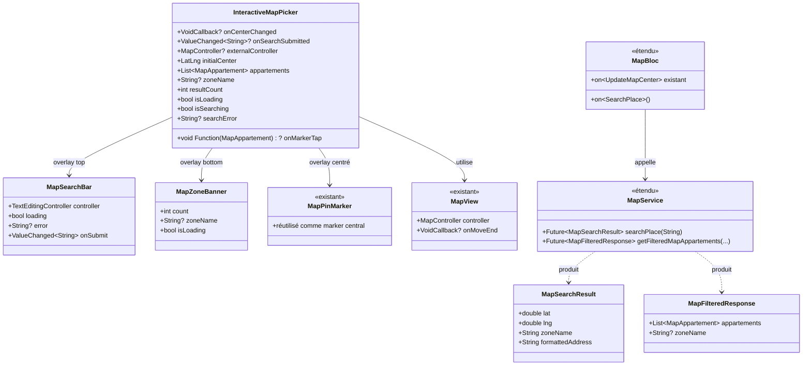
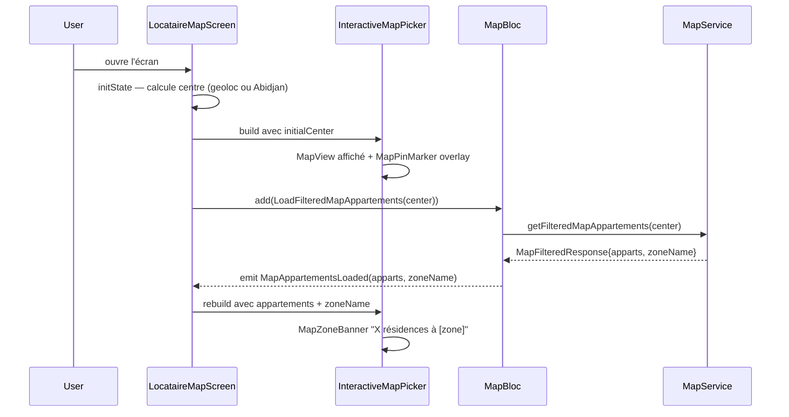
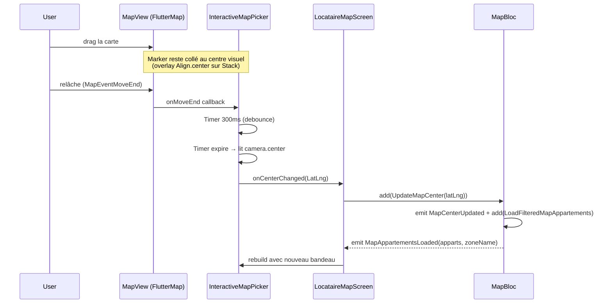
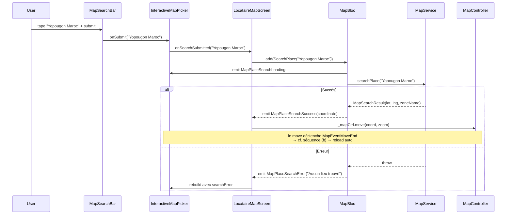

# 🏗️ Architecture — `interactive-map-picker`

**Date :** 2026-05-26
**Spec :** `.ai-outputs/specs/interactive-map-picker/business-spec.md`
**Stack :** Flutter 3.7+, BLoC, Dio, `flutter_map`, `latlong2`

---

## 1. Analyse du Projet

**Patterns observés :**
- BLoC strict (event → state, pas de logique dans les widgets)
- Models POJO Dart avec `fromJson`/`toJson`/`copyWith`
- Widgets génériques dans `lib/widget/<category>/`
- Widgets feature-spécifiques dans `lib/screen/client/<role>/<feature>/widget/`
- Services dans `lib/service/model/<domain>/`
- Convention nommage : PascalCase classes, camelCase methods, snake_case files

**Points d'intégration :**
- `MapBloc` a déjà `UpdateMapCenter(LatLng)` qui (a) emit `MapCenterUpdated`, (b) déclenche `LoadFilteredMapAppartements`. ✅ Exactement ce qu'il faut pour le pattern Yango — réutiliser tel quel.
- `MapPinMarker` existe (`lib/widget/map/map_pin_marker.dart`) → réutiliser comme marker central. **Pas besoin de créer `MapCenterMarker`** (YAGNI).
- `MapView` accepte `onMoveEnd` → c'est là qu'on branche la lecture du centre + debounce.

**Standards examinés (Règle 4) :**
- Search/geocoding via Nominatim/Mapbox : NON, l'utilisateur a choisi un endpoint backend Asfar dédié (R-BACK1) — pas de standard externe à utiliser ici.
- Debounce : pas de lib externe nécessaire, `Timer` Dart standard suffit.

---

## 2. Architecture Métier

**Entités / Concepts**

| Entité | Responsabilité |
|---|---|
| `MapSearchResult` (NEW) | Résultat d'une recherche textuelle : `lat`, `lng`, `zoneName`, `formattedAddress` |
| `MapFilteredResponse` (NEW) | Wrapper de la réponse `/filtered` : `appartements: List<MapAppartement>` + `zoneName: String?` |
| `MapAppartement` (existant) | Pin individuel — inchangé |
| `MapBloc` (existant, étendu) | + event `SearchPlace`, + champ `zoneName` dans `MapAppartementsLoaded`/`MapEmpty`, + 3 états search |

**Règles métier nouvelles**
- RM1 — Le `zoneName` est porté par la réponse `/filtered` (R-BACK2), donc `MapAppartementsLoaded.zoneName` est toujours à jour avec la zone courante de la carte.
- RM2 — `SearchPlace` ne déclenche PAS directement `LoadFilteredMapAppartements`. Il émet `MapPlaceSearchSuccess(coordinate)` que l'UI utilise pour appeler `_mapCtrl.move(coord)`. Le `move` déclenche un `MapEventMoveEnd` qui appelle `UpdateMapCenter` qui charge les apparts.

---

## 3. Architecture Fonctionnelle

### 3.1 Diagramme de classes



### 3.2 Séquence — Ouverture initiale



### 3.3 Séquence — Drag puis stop (pattern Yango)



### 3.4 Séquence — Search submit



---

## 4. Structure des fichiers

```
lib/
├── model/map/
│   ├── map_appartement.dart                 (existant — inchangé)
│   ├── map_search_result.dart               (NEW)
│   └── map_filtered_response.dart           (NEW)
│
├── service/model/map/
│   └── map_service.dart                     (modifié)
│
├── bloc/map_bloc/
│   ├── map_bloc.dart                        (modifié)
│   ├── map_event.dart                       (modifié)
│   └── map_state.dart                       (modifié)
│
├── widget/map/
│   ├── map_view.dart                        (existant)
│   ├── map_pin_marker.dart                  (existant — réutilisé)
│   ├── map_price_pin.dart                   (existant)
│   ├── interactive_map_picker.dart          (NEW)
│   ├── map_search_bar.dart                  (NEW)
│   └── map_zone_banner.dart                 (NEW)
│
└── screen/client/locataire/map/
    ├── locataire_map_screen.dart            (modifié)
    └── widget/
        ├── search_in_area_button.dart       (SUPPRIMÉ)
        ├── my_location_fab.dart             (conservé)
        ├── map_marker_bottom_sheet.dart     (conservé)
        └── map_loading/error/empty_overlay.dart  (conservés)
```

---

## 5. Interfaces / Contrats

Voir détails dans le document de discussion (sections 5.1 à 5.8).

### 5.3 `InteractiveMapPicker` (API publique)

```dart
class InteractiveMapPicker extends StatefulWidget {
  final MapController? controller;
  final LatLng initialCenter;
  final double initialZoom;
  final List<MapAppartement> appartements;
  final String? zoneName;
  final int resultCount;
  final bool isLoading;
  final bool isSearching;
  final String? searchError;
  final void Function(LatLng) onCenterChanged;
  final void Function(String query) onSearchSubmitted;
  final void Function(MapAppartement)? onMarkerTap;
}
```

### 5.6 `MapService` étendu

```dart
Future<MapFilteredResponse> getFilteredMapAppartements({...});  // signature change
Future<LatLng?> getRealCoordinates(int id);                     // inchangé
Future<MapSearchResult> searchPlace(String query);              // NEW
```

### 5.7 `MapBloc` étendu

```dart
// Events
class SearchPlace extends MapEvent { final String query; }

// States nouveaux
class MapPlaceSearchLoading extends MapState {}
class MapPlaceSearchSuccess extends MapState { final MapSearchResult result; }
class MapPlaceSearchError extends MapState { final String message; }

// States enrichis (champ zoneName ajouté)
class MapAppartementsLoaded extends MapState { ... + String? zoneName; }
class MapEmpty extends MapState { ... + String? zoneName; }
```

---

## 6. Décisions techniques

| Décision | Justification |
|---|---|
| Réutiliser `MapPinMarker` au lieu de créer `MapCenterMarker` | YAGNI — le pin existant suffit visuellement |
| Marker central via `Positioned + Align(center)` sur Stack | Pattern direct — le viewport de FlutterMap = son container parent |
| Debounce via `Timer` Dart natif | KISS — un seul `Timer? _debounce` + `cancel/Timer(...)` |
| `MapController` exposé via param optionnel | Le parent en a besoin pour `move()` après search et FAB |
| `SearchPlace` → state distinct (pas UpdateMapCenter direct) | Séparation responsabilité : recherche textuelle ≠ déplacement centre |
| `MapFilteredResponse` wrapper plutôt que enrichir `MapAppartement` | Le `zoneName` est un méta de la requête, pas d'un appartement |
| Suppression de `SearchInAreaButton` | Rendu obsolète par auto-search au moveEnd |
| Recherche externe (Nominatim) écartée | Utilisateur a explicitement choisi un endpoint backend Asfar |

---

## 7. Plan d'implémentation (ordre)

1. **Models** (`MapSearchResult`, `MapFilteredResponse`)
2. **Service** — `searchPlace` + retour `MapFilteredResponse`
3. **BLoC** — `SearchPlace` event, 3 states, `zoneName` dans states existants, handler
4. **Widgets atomiques** — `MapSearchBar`, `MapZoneBanner`
5. **Composant principal** — `InteractiveMapPicker`
6. **Migration LocataireMapScreen** — body, BlocListener
7. **Suppression** — `search_in_area_button.dart`
8. **Vérification** — `flutter analyze` 0 issue

---

## 8. CONTRAT D'IMPLÉMENTATION

### Modèles à créer
- [ ] `lib/model/map/map_search_result.dart` — `MapSearchResult` (4 champs, fromJson, getter `position`)
- [ ] `lib/model/map/map_filtered_response.dart` — `MapFilteredResponse` (apparts + zoneName, fromJson)

### Services à modifier
- [ ] `lib/service/model/map/map_service.dart` :
  - [ ] `getFilteredMapAppartements` retourne `Future<MapFilteredResponse>`
  - [ ] Nouvelle méthode `Future<MapSearchResult> searchPlace(String query)` → `GET /api/map/search?q=...`

### BLoC à modifier
- [ ] `lib/bloc/map_bloc/map_event.dart` : ajouter `SearchPlace`
- [ ] `lib/bloc/map_bloc/map_state.dart` :
  - [ ] `MapAppartementsLoaded` et `MapEmpty` : champ `String? zoneName`
  - [ ] Ajouter `MapPlaceSearchLoading`, `MapPlaceSearchSuccess`, `MapPlaceSearchError`
- [ ] `lib/bloc/map_bloc/map_bloc.dart` :
  - [ ] Handler `on<SearchPlace>(_onSearchPlace)`
  - [ ] `_onSearchPlace` : Loading → search → Success/Error
  - [ ] Adapter `_onLoadFilteredMapAppartements` pour lire `MapFilteredResponse`

### Widgets génériques (`lib/widget/map/`)
- [ ] `interactive_map_picker.dart` — StatefulWidget
  - [ ] Timer debounce 300ms sur onMoveEnd
  - [ ] Stack : MapView + Align.center(MapPinMarker) + Positioned(top: MapSearchBar) + Positioned(bottom: MapZoneBanner)
  - [ ] MapController interne si null, sinon parent
  - [ ] dispose : cancel Timer + dispose controller interne uniquement
- [ ] `map_search_bar.dart` — StatefulWidget
  - [ ] TextField icône loupe trailing, submit clavier ou bouton
  - [ ] Erreur inline sous le field si error != null
  - [ ] Spinner sur l'icône si loading
- [ ] `map_zone_banner.dart` — StatelessWidget
  - [ ] Pill arrondi en bas-centre, `bgElev2` + shadow, 13px
  - [ ] Format : "23 résidences à Cocody Riviera" / "0 résidences à [zone]" / "23 résidences dans cette zone"
  - [ ] AnimatedSwitcher pour transition fluide

### Écran à modifier
- [ ] `lib/screen/client/locataire/map/locataire_map_screen.dart` :
  - [ ] Retirer state `_showSearchInArea`, `_firstLoadDone`, méthodes `_onSearchInArea`, `_radiusFromVisibleBounds`, `_onMoveEnd`
  - [ ] Body : `InteractiveMapPicker(...)` + overlays loading/error/empty + MyLocationFab
  - [ ] `BlocListener<MapBloc>` réagit à `MapPlaceSearchSuccess` → `_mapCtrl.move`
  - [ ] Adapter `_extractAppartements` pour les nouveaux états (no breakage)

### Fichiers à supprimer
- [ ] `lib/screen/client/locataire/map/widget/search_in_area_button.dart` (vérifier 0 import résiduel d'abord)

### Hors-scope V1
- Pas de wiring proprio/demarcheur
- Pas d'autocomplete search
- Pas de slider rayon manuel
- Pas de filtres UI
- Pas d'animation pin pendant drag

### Vérifications finales
- [ ] `flutter analyze lib/widget/map/ lib/screen/client/locataire/map/ lib/bloc/map_bloc/ lib/service/model/map/ lib/model/map/` → 0 issue
- [ ] Bottom sheet preview au tap d'un marker prix fonctionne (régression check)
- [ ] FAB géoloc recentre + recharge correctement (régression check)
- [ ] Le marker central reste collé au centre quel que soit le zoom/pan

---

## 9. Demandes backend résiduelles (à formuler par le PM)

| ID | Endpoint | Format réponse | Bloquant ? |
|---|---|---|---|
| R-BACK1 | `GET /api/map/search?q=...` | `{ lat, lng, zoneName, formattedAddress }` | OUI |
| R-BACK2 | `GET /api/map/appartements/filtered` enrichi avec `zoneName` racine : `{ appartements: [...], zoneName: "Cocody Riviera" }` | wrapper | OUI partiellement (sinon bandeau dégradé) |
| R-BACK3 | Confirmer rayon décidé backend (basé sur zoom ou heuristique) | confirmation | Non bloquant — mobile continue à passer `radius=10.0` |

---

```
UI_REQUIRED: true
```
