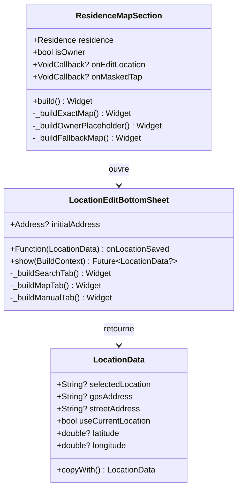
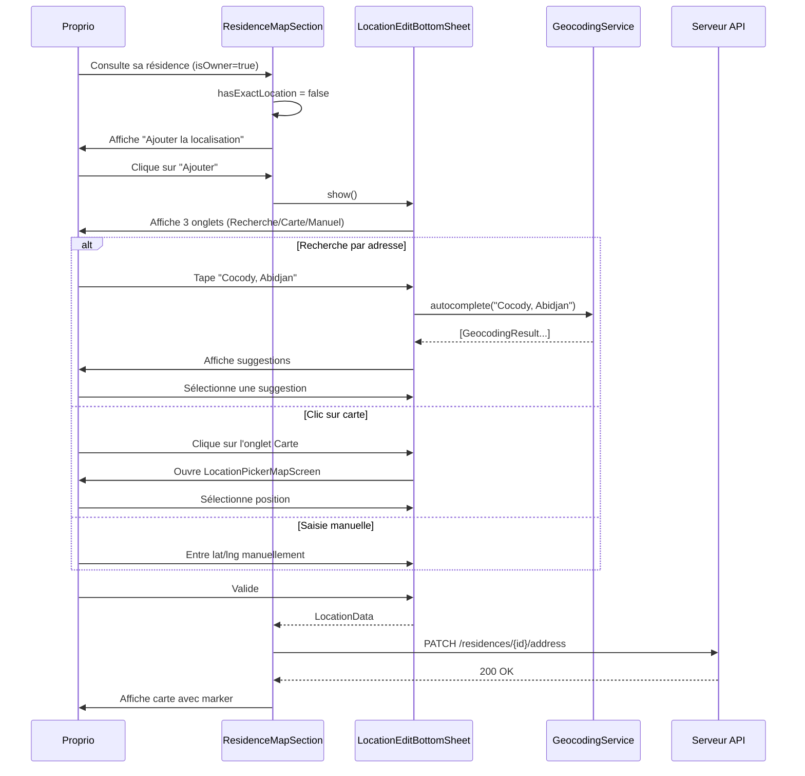

# Architecture : Localisation Proprio

## 1. Vue d'ensemble

### Objectif
Différencier l'affichage de la section carte selon le rôle (proprio vs locataire) et permettre au propriétaire d'ajouter/modifier la localisation de sa résidence.

### Composants impactés

| Composant | Type | Action |
|-----------|------|--------|
| `ResidenceMapSection` | Widget | Modifier - ajouter paramètre `isOwner` |
| `ResidenceDetailScreen` (proprio) | Screen | Modifier - passer `isOwner: true` |
| `LocationEditBottomSheet` | Widget | **NOUVEAU** - Bottom sheet d'édition rapide |

### Principe

```
┌─────────────────────────────────────────────────────────────┐
│ ResidenceMapSection                                         │
│                                                             │
│ PARAMÈTRES :                                                │
│ - residence: Residence                                      │
│ - isOwner: bool (NOUVEAU)                                   │
│ - onEditLocation: VoidCallback? (NOUVEAU)                   │
│ - onMaskedTap: VoidCallback?                                │
│                                                             │
│ LOGIQUE D'AFFICHAGE :                                       │
│                                                             │
│ Si hasExactLocation :                                       │
│   → Carte avec marker                                       │
│   → Si isOwner : bouton "Modifier" overlay                  │
│                                                             │
│ Si !hasExactLocation ET isOwner :                           │
│   → Placeholder "Ajouter la localisation"                   │
│   → Clic → LocationEditBottomSheet                          │
│                                                             │
│ Si !hasExactLocation ET !isOwner :                          │
│   → Carte approximative (commune)                           │
│   → Message "Localisation approximative"                    │
│                                                             │
└─────────────────────────────────────────────────────────────┘
```

---

## 2. Diagramme de Classes



---

## 3. Diagramme de Séquence

### Cas : Proprio ajoute une localisation



---

## 4. Structure des Fichiers

```
lib/
├── widget/
│   ├── residence/
│   │   └── residence_map_section.dart        # MODIFIER
│   │
│   └── location/
│       └── location_edit_bottom_sheet.dart   # NOUVEAU
│
└── screen/
    └── client/proprio/residences/
        └── residence_detail_screen.dart      # MODIFIER
```

---

## 5. Interfaces / Contrats

### 5.1 ResidenceMapSection (modifié)

```dart
class ResidenceMapSection extends StatelessWidget {
  const ResidenceMapSection({
    super.key,
    required this.residence,
    this.isOwner = false,           // NOUVEAU
    this.onEditLocation,            // NOUVEAU
    this.onMaskedTap,
  });

  final Residence residence;
  final bool isOwner;               // Différencie proprio/locataire
  final VoidCallback? onEditLocation;  // Callback édition (proprio)
  final VoidCallback? onMaskedTap;     // Callback réservation (locataire)
}
```

### 5.2 LocationEditBottomSheet (nouveau)

```dart
class LocationEditBottomSheet extends StatefulWidget {
  const LocationEditBottomSheet({
    super.key,
    this.initialAddress,
    required this.onLocationSaved,
  });

  final Address? initialAddress;
  final Function(LocationData) onLocationSaved;

  /// Affiche le bottom sheet et retourne les données sélectionnées
  static Future<LocationData?> show(
    BuildContext context, {
    Address? initialAddress,
  });
}
```

### 5.3 Logique d'affichage

```dart
// Dans ResidenceMapSection.build()

// Cas 1: Coordonnées exactes → Carte avec marker
if (hasExactLocation) {
  return _buildExactMap(
    location: address!.exactLocation!,
    showEditButton: isOwner,  // Bouton "Modifier" si proprio
  );
}

// Cas 2: Pas de coords + Proprio → Placeholder "Ajouter"
if (isOwner) {
  return _buildOwnerPlaceholder();
}

// Cas 3: Pas de coords + Locataire + Commune → Carte approximative
if (hasFallbackLocation) {
  return _buildFallbackMap(address!);
}

// Cas 4: Rien du tout
return SensitiveDataPlaceholder.location(onTap: onMaskedTap);
```

---

## 6. UI des différents états

### État 1 : Proprio avec coordonnées

```
┌─────────────────────────────────────────┐
│                                         │
│              [CARTE]                    │
│                                         │
│           📍 (marker)                   │
│                                         │
├─────────────────────────────────────────┤
│ Coordonnées GPS                         │
│ Lat: 5.393639, Long: -3.918602          │
│                          [✏️ Modifier]  │
└─────────────────────────────────────────┘
```

### État 2 : Proprio sans coordonnées

```
┌─────────────────────────────────────────┐
│                                         │
│         📍                              │
│                                         │
│   Localisation non renseignée           │
│                                         │
│   [➕ Ajouter la localisation]          │
│                                         │
└─────────────────────────────────────────┘
```

### État 3 : Locataire sans accès

```
┌─────────────────────────────────────────┐
│                                         │
│       [CARTE FLOUTÉE / COMMUNE]         │
│                                         │
│  ┌─────────────────────────────────┐    │
│  │ 📍 Cocody, Abidjan              │    │
│  │ Localisation approximative       │    │
│  └─────────────────────────────────┘    │
│                                         │
└─────────────────────────────────────────┘
```

---

## 7. Bottom Sheet d'édition

```
┌─────────────────────────────────────────┐
│ ──────  Modifier la localisation        │
├─────────────────────────────────────────┤
│                                         │
│  [🔍 Recherche] [🗺️ Carte] [📝 Manuel]  │
│                                         │
├─────────────────────────────────────────┤
│                                         │
│  Onglet Recherche :                     │
│  ┌─────────────────────────────────┐    │
│  │ 🔍 Rechercher une adresse...    │    │
│  └─────────────────────────────────┘    │
│                                         │
│  Suggestions :                          │
│  • Cocody, Abidjan                      │
│  • Cocody Angré, Abidjan                │
│                                         │
├─────────────────────────────────────────┤
│                                         │
│          [✓ Valider]                    │
│                                         │
└─────────────────────────────────────────┘
```

---

## 8. Plan d'implémentation

### Étape 1 : Modifier ResidenceMapSection
- [ ] Ajouter paramètre `isOwner`
- [ ] Ajouter paramètre `onEditLocation`
- [ ] Créer `_buildOwnerPlaceholder()` pour le cas proprio sans coords
- [ ] Ajouter bouton "Modifier" sur `_buildExactMap()` si isOwner
- [ ] Modifier `_buildFallbackMap()` pour afficher "Localisation approximative" (sans "Réserver")

### Étape 2 : Créer LocationEditBottomSheet
- [ ] Créer le widget avec 3 onglets (Recherche/Carte/Manuel)
- [ ] Intégrer `GeocodingService.autocomplete()` pour la recherche
- [ ] Intégrer `LocationPickerMapScreen` pour la carte
- [ ] Ajouter saisie manuelle lat/lng

### Étape 3 : Modifier ResidenceDetailScreen (proprio)
- [ ] Passer `isOwner: true` à ResidenceMapSection
- [ ] Gérer le callback `onEditLocation`
- [ ] Appeler l'API pour sauvegarder les nouvelles coordonnées
- [ ] Rafraîchir l'affichage après modification

---

## 9. Considérations

### Réutilisation
- `LocationPicker` et `LocationPickerMapScreen` existent déjà → les réutiliser
- `GeocodingService` existe déjà → l'utiliser pour la recherche

### UX
- Bottom sheet plus léger qu'un nouvel écran
- 3 méthodes de saisie pour flexibilité maximale
- Pré-remplir si localisation existante

---

**Créé le:** 2025-12-27
**Spécification métier:** `.ai-outputs/specs/localisation-proprio/business-spec.md`
