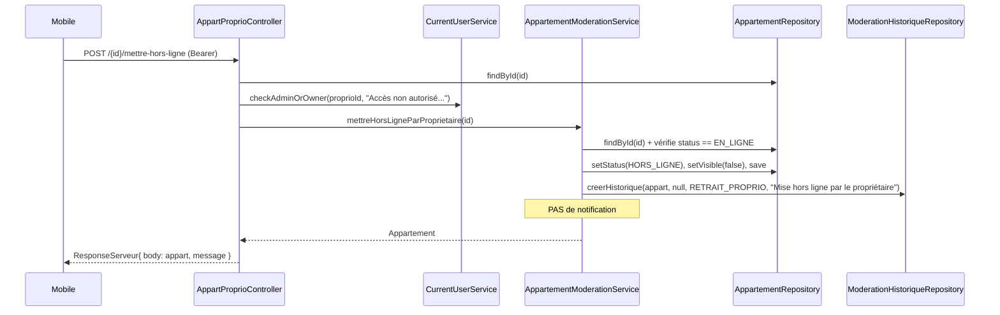
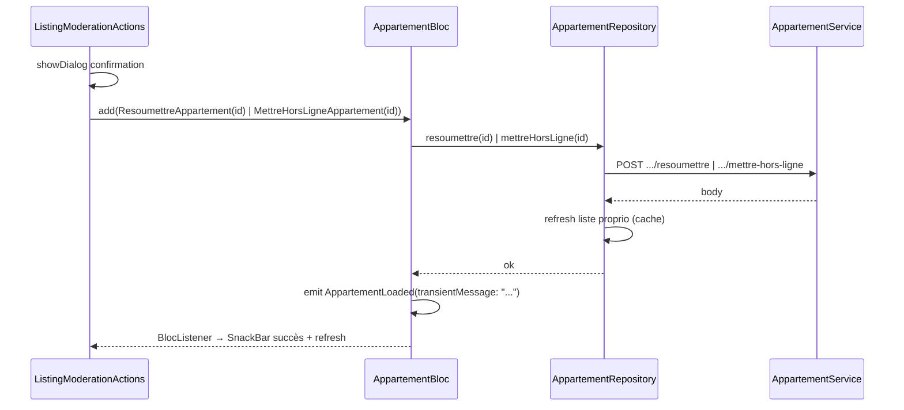

# Architecture — Intégration modération annonces (mobile + backend)

Feature : `moderation-annonces-mobile`
Mode : projet existant (`new_project: false`)
Repos : `serveur` (Spring Boot) + `app` (Flutter)

## 1. Vue d'ensemble

Feature transverse, 2 repos :

- **Backend** : 1 nouvel endpoint propriétaire `EN_LIGNE → HORS_LIGNE` (mise hors
  ligne par le propriétaire lui-même), sur le modèle de `resoumettre`.
- **Mobile** : alignement de l'enum statut, badge de statut dynamique, et 2
  actions (resoumettre, mettre hors ligne) câblées service → bloc → UI.

Décisions clés :
- **Resoumettre** : l'endpoint backend existe déjà
  (`POST api/proprietaire/appartement/{id}/resoumettre`). Rien à faire backend.
- **Mettre hors ligne** : nouvel endpoint
  `POST api/proprietaire/appartement/{id}/mettre-hors-ligne` (convention FR
  cohérente avec `resoumettre`).
- **Action de modération** : ajout d'une valeur `RETRAIT_PROPRIO` à
  `ActionModeration` plutôt que de réutiliser `DESACTIVE` (réservé à l'admin et
  exigeant un motif + notification). On garde la sémantique admin intacte et
  l'historique reste lisible. Cohérent avec `RESOUMIS` (admin=null).
- **Pas de notification** pour la mise hors ligne (le propriétaire agit lui-même),
  motif auto `"Mise hors ligne par le propriétaire"`.
- **Enum mobile** : union non destructive (7 valeurs).

## 2. Backend — conception

### 2.1 Transitions (machine à états, inchangée sauf ajout)

```
EN_COURS --APPROUVE(admin)--> EN_LIGNE
EN_COURS --REJETE(admin)----> HORS_LIGNE
EN_LIGNE --DESACTIVE(admin)--> HORS_LIGNE
EN_LIGNE --RETRAIT_PROPRIO(proprio)--> HORS_LIGNE   ← NOUVEAU
HORS_LIGNE --RESOUMIS(proprio)--> EN_COURS
```

### 2.2 Séquence — mise hors ligne par le propriétaire



### 2.3 Fichiers backend

| Fichier | Action | Détail |
|---|---|---|
| `models/enumeration/ActionModeration.java` | MODIFIER | Ajouter valeur `RETRAIT_PROPRIO` (+ javadoc : « Le propriétaire met hors ligne sa propre annonce, EN_LIGNE → HORS_LIGNE ») |
| `services/residence/AppartementModerationService.java` | MODIFIER | Ajouter `@Transactional public Appartement mettreHorsLigneParProprietaire(int appartementId)` : findById (sinon `ERROR_APPARTEMENT_NON_TROUVE`), vérifier `status == EN_LIGNE` (sinon `"Seuls les appartements EN_LIGNE peuvent être mis hors ligne. Statut actuel: " + status`), setStatus(HORS_LIGNE) + setVisible(false) + save, `creerHistorique(appart, null, ActionModeration.RETRAIT_PROPRIO, "Mise hors ligne par le propriétaire")`. **Aucune notification.** Calque sur `resoumettreAppartement`. |
| `controllers/residence/AppartProprioController.java` | MODIFIER | Ajouter `@PostMapping("/{id}/mettre-hors-ligne")` : `findById`, `checkAdminOrOwner(appart.getProprietaire().getId(), "Accès non autorisé à cet appartement")`, déléguer à `moderationService.mettreHorsLigneParProprietaire(id)`, renvoyer `new ResponseServeur(maj, "Appartement mis hors ligne avec succès.")`. Try/catch → `badRequest(ResponseServeur(null, e.getMessage()))` (calque sur `resoumettreAppartement`). |

> Contraintes mémoire respectées : aucune dépendance ajoutée à `Residence` ;
> pas de prod (ajout enum sans migration nécessaire, `@Enumerated(STRING)`).

## 3. Mobile — conception

### 3.1 Endpoints consommés

- `POST api/proprietaire/appartement/{id}/resoumettre` (existant)
- `POST api/proprietaire/appartement/{id}/mettre-hors-ligne` (nouveau, cf. §2)
- Réponse : `ResponseServeur{ body, message }` → `_extractBodyMap`.

### 3.2 Flux mobile



### 3.3 Fichiers mobile

| Fichier | Action | Détail |
|---|---|---|
| `lib/model/enumeration/appartement_status.dart` | MODIFIER | Ajouter `EN_COURS, EN_LIGNE, HORS_LIGNE` à l'enum (garder les 4 existantes). `fromString` inchangé (matche par `name`). |
| `lib/util/calc/appartement_status_display.dart` | MODIFIER | `eyebrowLabel` : ajouter cas `EN_COURS→'EN VALIDATION'`, `EN_LIGNE→'EN LIGNE'`, `HORS_LIGNE→'HORS LIGNE'`. Ajouter `static BadgeTone badgeTone(AppartementStatus?)` et `static String badgeLabel(AppartementStatus?)` (cf. mapping §3.4). |
| `lib/service/model/appartement/appartement_service.dart` | MODIFIER | Ajouter `Future<Map<String,dynamic>> resoumettreAppartement(int id)` → POST `api/proprietaire/appartement/$id/resoumettre` ; `Future<Map<String,dynamic>> mettreHorsLigneAppartement(int id)` → POST `.../mettre-hors-ligne`. Body vide, `_extractBodyMap(response.data)`. Calque sur `saveAppartement`. |
| `lib/service/repository/...` (AppartementRepository) | MODIFIER | Ajouter `resoumettre(int id)` et `mettreHorsLigne(int id)` : déléguer au service puis rafraîchir la liste proprio en cache (réutiliser le refresh existant utilisé après update). |
| `lib/bloc/appartement_bloc/appartement_event.dart` | MODIFIER | Ajouter `ResoumettreAppartement(int appartementId)` et `MettreHorsLigneAppartement(int appartementId)`. |
| `lib/bloc/appartement_bloc/appartement_bloc.dart` | MODIFIER | Enregistrer `on<ResoumettreAppartement>` / `on<MettreHorsLigneAppartement>` + handlers calqués sur `_onUpdateAppartement` (loading→try appel repo→`AppartementLoaded(..., transientMessage)`→catch `AppartementError`). Messages : « Annonce resoumise, en cours de validation. » / « Annonce mise hors ligne. ». |
| `lib/screen/client/proprio/appartements/widget/listing_moderation_actions.dart` | **CRÉER** | `ListingModerationActions extends StatelessWidget` (param `Appartement appart`). Si `status == HORS_LIGNE` : message générique (« Votre annonce a été mise hors ligne. Modifiez-la si besoin, puis resoumettez-la. ») + bouton « Resoumettre ». Si `status == EN_LIGNE` : bouton « Mettre hors ligne ». Chaque bouton : `showDialog` de confirmation (pattern `AppColors.bgElev1`/danger) → `context.read<AppartementBloc>().add(...)`. Aucune fonction privée retournant un Widget. |
| `lib/screen/client/proprio/appartements/listing_edit_screen.dart` | MODIFIER | Insérer `SliverToBoxAdapter(child: ListingModerationActions(appart: appart))` après `ListingEditStatsCard`. Ajouter un `BlocListener<AppartementBloc>` (ou `BlocConsumer`) pour SnackBar succès (`transientMessage`) / erreur (`AppartementError.message`). Vérifier qu'on ne double pas le SnackBar déjà émis ailleurs. |
| `lib/screen/client/proprio/appartements/widget/listing_full_card_hero.dart` | MODIFIER | Remplacer `BadgeStatus(text:'● Actif', tone:success)` par `BadgeStatus(text: AppartementStatusDisplay.badgeLabel(appartement.status), tone: AppartementStatusDisplay.badgeTone(appartement.status))`. |
| `lib/screen/client/proprio/home/widget/proprio_listing_row.dart` | MODIFIER | Idem (badge dynamique). |

### 3.4 Mapping statut → affichage

| Statut | eyebrowLabel | badgeLabel | badgeTone |
|---|---|---|---|
| `EN_COURS` | EN VALIDATION | ● En validation | warn |
| `EN_LIGNE` | EN LIGNE | ● En ligne | success |
| `HORS_LIGNE` | HORS LIGNE | ● Hors ligne | danger |
| `DISPONIBLE` | ANNONCE ACTIVE | ● Active | success |
| `OCCUPE` | ACTUELLEMENT OCCUPÉE | ● Occupée | info |
| `EN_MAINTENANCE` | EN MAINTENANCE | ● Maintenance | warn |
| `INACTIF` | ANNONCE DÉSACTIVÉE | ● Désactivée | neutral |
| `null` | ANNONCE | ● Annonce | neutral |

## 4. CONTRAT D'IMPLÉMENTATION

### Backend — Modèles / Enums
- [ ] `ActionModeration` : valeur `RETRAIT_PROPRIO` ajoutée

### Backend — Services
- [ ] `AppartementModerationService.mettreHorsLigneParProprietaire(int)` : EN_LIGNE → HORS_LIGNE, historique RETRAIT_PROPRIO, motif auto, sans notification

### Backend — Controllers / Routes
- [ ] `POST api/proprietaire/appartement/{id}/mettre-hors-ligne` (checkAdminOrOwner, ResponseServeur)

### Mobile — Modèles / Enums
- [ ] `AppartementStatus` : `EN_COURS`, `EN_LIGNE`, `HORS_LIGNE` ajoutés (union)

### Mobile — Helpers
- [ ] `AppartementStatusDisplay.eyebrowLabel` : 3 cas ajoutés
- [ ] `AppartementStatusDisplay.badgeTone(status)` créé
- [ ] `AppartementStatusDisplay.badgeLabel(status)` créé

### Mobile — Services / Repositories
- [ ] `AppartementService.resoumettreAppartement(int)`
- [ ] `AppartementService.mettreHorsLigneAppartement(int)`
- [ ] `AppartementRepository.resoumettre(int)` + `mettreHorsLigne(int)` (avec refresh liste)

### Mobile — Bloc
- [ ] Events `ResoumettreAppartement`, `MettreHorsLigneAppartement`
- [ ] Handlers + `on<>` enregistrés, émettent `AppartementLoaded(transientMessage)` / `AppartementError`

### Mobile — Widgets / Écrans
- [ ] `ListingModerationActions` (widget dédié, 1 fichier) avec boutons conditionnels + dialog de confirmation
- [ ] `listing_edit_screen.dart` : intègre le widget + BlocListener SnackBar
- [ ] `listing_full_card_hero.dart` : badge dynamique
- [ ] `proprio_listing_row.dart` : badge dynamique

---

UI_REQUIRED: true
