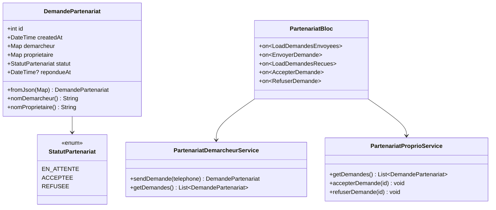

# Architecture — Système de Partenariat Démarcheur / Propriétaire

## 1. Vue d'ensemble

**Stack** : Flutter + BLoC + Dio + ServerResponse<T>

**Composants impactés** :
- demarcheur_navigation.dart — ajout d'un onglet Partenariats
- proprio_navigation.dart — ajout d'un onglet Partenariats
- main.dart — provision du PartenariatBloc

## 2. Diagramme de Classes



## 3. Structure des Fichiers

```
lib/
├── model/partenariat/
│   ├── demande_partenariat.dart
│   └── statut_partenariat.dart
├── service/model/
│   ├── demarcheur/partenariat_demarcheur_service.dart
│   └── proprietaire/partenariat_proprio_service.dart
├── bloc/partenariat_bloc/
│   ├── partenariat_bloc.dart
│   ├── partenariat_event.dart
│   └── partenariat_state.dart
└── screen/client/
    ├── demarcheur/partenariat/
    │   ├── demarcheur_partenariat_screen.dart
    │   └── widget/
    │       ├── demande_envoyee_item.dart
    │       └── envoyer_demande_form.dart
    └── proprio/partenariat/
        ├── proprio_partenariat_screen.dart
        └── widget/
            └── demande_recue_item.dart
```

## 4. Fichiers à modifier

- lib/screen/client/demarcheur/demarcheur_navigation.dart → +onglet Partenariats (index 2)
- lib/screen/client/proprio/proprio_navigation.dart → +onglet Partenariats (index 4)
- lib/main.dart → +BlocProvider<PartenariatBloc>

## 5. Contrat d'Implémentation

### Modèles
- [ ] lib/model/partenariat/statut_partenariat.dart
- [ ] lib/model/partenariat/demande_partenariat.dart

### Services
- [ ] lib/service/model/demarcheur/partenariat_demarcheur_service.dart
- [ ] lib/service/model/proprietaire/partenariat_proprio_service.dart

### BLoC
- [ ] lib/bloc/partenariat_bloc/partenariat_event.dart
- [ ] lib/bloc/partenariat_bloc/partenariat_state.dart
- [ ] lib/bloc/partenariat_bloc/partenariat_bloc.dart

### Widgets
- [ ] lib/screen/client/demarcheur/partenariat/widget/demande_envoyee_item.dart
- [ ] lib/screen/client/demarcheur/partenariat/widget/envoyer_demande_form.dart
- [ ] lib/screen/client/proprio/partenariat/widget/demande_recue_item.dart

### Screens
- [ ] lib/screen/client/demarcheur/partenariat/demarcheur_partenariat_screen.dart
- [ ] lib/screen/client/proprio/partenariat/proprio_partenariat_screen.dart

### Modifications
- [ ] lib/screen/client/demarcheur/demarcheur_navigation.dart
- [ ] lib/screen/client/proprio/proprio_navigation.dart
- [ ] lib/main.dart

UI_REQUIRED: true
