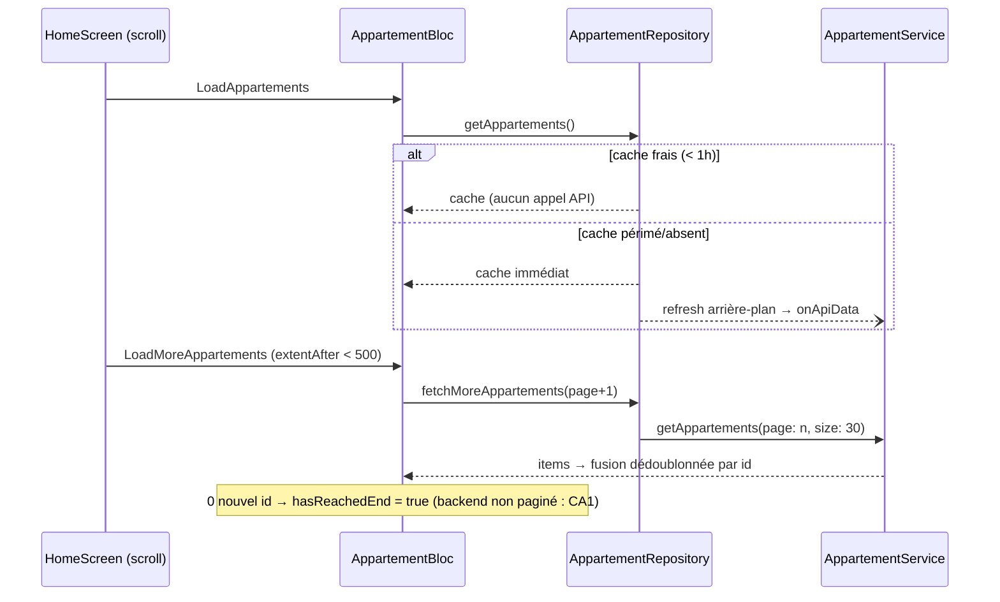

# 🏗️ Architecture : Praticité & Fluidité (PRA-01..05 + PERF-01..05)

> Spec métier : `.ai-outputs/specs/praticite-fluidite/business-spec.md`
> Fiches de référence : `.ai-outputs/audit/PRA-*` et `PERF-*`
> Projet existant — stack Flutter + BLoC + Hive + Dio. Iso-comportement fonctionnel (RM8).

---

## Analyse du Projet (faits vérifiés)

- **Extraction `{body}`** : 11 services, 11 variantes (méthodes privées `_extractBodyMap`/`_extractBodyAsList`, parsing inline, fallbacks `?? data`, checks `'id'`). Cibles : appartement, comptabilite_api, reservation, receipt, notification, proprietaire, message, commodite, commission, favorite (+ inline divers).
- **`isCacheStale()`** existe dans AppartementRepository (24h) et ReservationRepository (1h) mais **n'est jamais appelé** — le refresh arrière-plan est aujourd'hui systématique.
- **Formatters** : l'app utilise déjà massivement `FcfaFormatter` (~75 appels) ; `formate.dart` garde 5 fonctions de montants quasi orphelines + un doublon local dans `comptabilite_calculator.dart:475`.
- **Images** : 0 cache. `DomainImage` est le point de passage central ; 3 usages directs de `Image.network` hors DomainImage (`user_avatar.dart:55`, `identity_document_card.dart:124`, `map_marker_preview_image.dart:11`).
- **Favoris** : `BlocBuilder<FavoriteBloc>` enveloppe des listes entières (`recommended_listings_list.dart:38`, `featured_listings_carousel.dart:40`) ; les 4 états de FavoriteState exposent déjà `isFavorite(int)`.
- **Mémoire** : `ConversationBloc` non borné (`_conversations` l.19, `_conversationMessages` l.20) ; `NotificationBloc` **déjà plafonné à 100** (l.210) ; limites disque privées dans `conversation_cache_service.dart:21-22` (100 msg / 50 conv).
- **Pagination** : seul `ConversationService` a `page/limit`. `DioRequest.getMapped` accepte déjà `queryParameters`.
- **DI** : pas de get_it ; blocs instancient leurs services directement ; 3 blocs acceptent déjà l'injection constructeur (pattern existant à généraliser : `AppartementWizardBloc`, `PaysBloc`, `OccupationCalendarBloc`).
- **PRA-01** : `lib/repository/` contient `compte_repository.dart` (importé par CompteBloc) et `charge_data_manager.dart` (importé par ChargeBloc + ChargeDetailBloc).

## Standards utilisés (Règle 4)

| Besoin | Standard | Maison écarté |
|---|---|---|
| Cache images disque+mémoire | `cached_network_image: ^3.4.1` | cache manuel ❌ |
| Placeholder animé | `shimmer: ^3.0.0` | animation custom ❌ |
| Service locator | `get_it: ^8.0.3` | locator maison ❌ |
| Mocks de test | `mocktail: ^1.0.4` | fakes manuels ❌ |
| Mock HTTP Dio | `http_mock_adapter: ^0.6.1` | serveur factice ❌ |

---

## Conception par fiche

### PRA-01 — Fusion repositories (mécanique)
- Déplacer `lib/repository/compte_repository.dart` → `lib/service/repository/compte_repository.dart`
- Déplacer `lib/repository/charge_data_manager.dart` → `lib/service/repository/charge_data_manager.dart`
- Mettre à jour les imports : `compte_bloc.dart`, `charge_bloc.dart`, `charge_detail_bloc.dart`. Supprimer `lib/repository/`.

### PRA-02 — Extraction `{body}` centralisée
Ajout à `ResponseMapper` (lib/util/response/response_mapper.dart) :
```dart
/// Extrait le body du wrapper Spring Boot {body, message}.
/// Tolère une réponse déjà "à plat". Retourne null si inexploitable.
static Map<String, dynamic>? tryExtractBody(dynamic data);
static List<dynamic>? tryExtractBodyList(dynamic data);
/// Variante stricte : lance CustomException si inexploitable.
static Map<String, dynamic> extractBody(dynamic data);
```
Migration des 11 services : chaque site remplace son parsing par le bon extracteur,
**en conservant sa politique d'échec actuelle** (throw / null / `[]` / fallback) — RM8.
Tests d'abord dans `test/util/response/response_mapper_test.dart` (wrapper présent,
réponse à plat, body null, data non-Map, fallback `'id'`).

### PRA-03 — Formatters de montants
- Canonique : `FcfaFormatter` (déjà majoritaire). Ajouter si besoin l'API manquante
  pour couvrir les migrations (`signedFull(num)` pour `formatMontantSigne`).
- Migrer les derniers appels `formatMontant*` de `formate.dart` vers `FcfaFormatter`,
  supprimer le doublon local `formatMontant` de `comptabilite_calculator.dart:475`,
  puis **supprimer** les 5 fonctions de montants de `formate.dart`
  (`formatMontant`, `formatMontantCompact`, `formatMontantSigne`, `formatMontantCourt`,
  `formatMontantCompactFCFA`) et `helpAmountFormate` si plus référencé.
- Test gel de comportement : `test/util/fcfa_formatter_test.dart`
  (0, 999, 1 500, 25 000, 1 250 000, négatifs, signed).

### PRA-04 — GetIt progressif
Nouveau `lib/config/service_locator.dart` :
```dart
final getIt = GetIt.instance;
void setupServiceLocator() {
  getIt.registerLazySingleton<AppartementService>(AppartementService.new);
  getIt.registerLazySingleton<ReservationService>(ReservationService.new);
  getIt.registerLazySingleton<FavoriteService>(FavoriteService.new);
  getIt.registerLazySingleton<MessageService>(MessageService.new);
  getIt.registerLazySingleton<AppartementRepository>(AppartementRepository.new);
  getIt.registerLazySingleton<ReservationRepository>(ReservationRepository.new);
  getIt.registerLazySingleton<ChargeRepository>(ChargeRepository.new);
  getIt.registerLazySingleton<CompteRepository>(CompteRepository.new);
  getIt.registerLazySingleton<ChargeDataManager>(ChargeDataManager.new);
}
```
`main()` appelle `setupServiceLocator()` avant `runApp`. **Blocs migrés (uniquement
ceux touchés par ce chantier)** : Appartement, Reservation, Favorite, Conversation,
Compte, Charge — pattern du projet (injection constructeur optionnelle, défaut getIt) :
```dart
AppartementBloc({AppartementService? service, AppartementRepository? repository})
    : appartementService = service ?? getIt<AppartementService>(),
      _repository = repository ?? getIt<AppartementRepository>(), ...
```

### PRA-05 — Tests couche données (6 cibles)
- `response_mapper_test.dart` (étendu, PRA-02)
- `test/service/dio/dio_request_test.dart` — via `http_mock_adapter` ; ajouter à
  `DioRequest` un setter `@visibleForTesting set httpClientAdapterForTesting(...)`
  (seule intrusion). Cas : getMapped OK, 401 → pas testable sans UI → tester
  extraction message d'erreur + propagation timeout.
- `test/service/model/appartement_service_test.dart`, `reservation_service_test.dart`
  — fixtures JSON réalistes dans `test/fixtures/` (mock adapter sur DioRequest).
- `test/service/repository/appartement_repository_test.dart`,
  `reservation_repository_test.dart` — service mocké (mocktail, via injection PRA-04),
  Hive réel en répertoire temporaire. Pour éviter le canal natif secure storage en
  test : `StorageService.init({HiveAesCipher? cipherOverride})` (paramètre test-only,
  prod inchangée).

### PERF-01 — Cache images
- `DomainImage` (point central) passe sur `CachedNetworkImage` : placeholder shimmer,
  `errorWidget` = placeholder actuel, `memCacheWidth` dérivé de `width` quand fournie.
- Nouveau widget `ImageShimmerPlaceholder` (fichier dédié, règles projet).
- Les 3 `Image.network` hors DomainImage migrent vers `DomainImage` (avatar, document
  KYC, mini-image marker).
- Le **style du placeholder** est tranché par l'agent UI/UX (UI_REQUIRED).

### PERF-02 — Pagination préparée (annonces + réservations)
- Services : `getAppartements({int? page, int? size})`,
  `getUserReservations({int? page, int? size})`, `getProprietaireReservations({...})`
  — `queryParameters` passés **uniquement si non-null** (sans : requête identique à
  aujourd'hui, RM2/CA1).
- `AppartementRepository.getAppartements` inchangé pour la page 0 (cache-first).
  Nouvelle méthode `fetchMoreAppartements(int page, {int size})` (API directe, pas de
  cache des pages > 0).
- `AppartementBloc` : événement `LoadMoreAppartements` + champs d'état
  (`isLoadingMore`, `hasReachedEnd`, `currentPage`). **Dédoublonnage par id** à la
  fusion des pages : si le backend ignore la pagination et renvoie tout, la page 1
  ne produit aucun nouvel id → `hasReachedEnd = true`, comportement actuel préservé.
- UI : feed locataire (`home_screen.dart`) — `NotificationListener<ScrollNotification>`
  sur le `CustomScrollView` existant, déclenche `LoadMoreAppartements` quand
  `extentAfter < 500` ; loader discret en pied de `RecommendedListingsList`.
- Réservations : support service + état bloc (même pattern), **sans câblage UI**
  (écrans non virtualisés aujourd'hui — refonte hors périmètre, RM8).

### PERF-03 — Rebuilds ciblés favoris
- Nouveau widget `FavoriteToggleButton(appartementId)` (fichier dédié, réutilisable) :
  `BlocSelector<FavoriteBloc, FavoriteState, bool>` sur `state.isFavorite(id)` +
  dispatch du toggle. `FavoriteState` (classe abstraite) expose
  `bool isFavorite(int id)` (défaut `false`, déjà implémenté par les 4 états).
- Les cartes (`appartement_preview_card`, `featured_listing_card`, `saved_listing_card`)
  utilisent ce bouton ; les `BlocBuilder<FavoriteBloc>` qui enveloppent les listes
  (`recommended_listings_list.dart:38`, `featured_listings_carousel.dart:40`) sont
  retirés. `favorite_screen.dart` : `buildWhen` sur changement de la liste d'ids.

### PERF-04 — TTL actif + versioning cache
- `AppartementRepository.getAppartements` : si cache présent **et frais**
  (`!isCacheStale(maxAgeHours: 1)`) → retour cache **sans** appel API ; si périmé →
  cache immédiat + refresh arrière-plan (mécanisme actuel). `forceRefresh` inchangé.
  Idem `ReservationRepository` (TTL 15 min → `isCacheStale` passe en minutes :
  `isCacheStale({Duration maxAge})`).
- Versioning : constante `static const int cacheVersion` par repository (=1) ;
  vérification mémoïsée `_ensureCacheVersion()` au premier accès — version stockée
  via `StorageService.getAppSetting/setAppSetting('cache_version_<domaine>')` ;
  différence → purge du cache du domaine + écriture de la nouvelle version.
- Parsing défensif : lecture du cache (fromJson) sous try/catch → purge + refetch.
- `ChargeRepository` : documenter explicitement « local-only, pas de sync serveur »
  (doc de classe) — décision fiche PRA-01/PERF-04.

### PERF-05 — Mémoire bornée
- `ConversationCacheService` : constantes promues publiques
  (`maxCachedMessages = 100`, `maxCachedConversations = 50`).
- `ConversationBloc` : à chaque insertion, tronquer `_conversationMessages[id]` aux
  `maxCachedMessages` derniers et `_conversations` aux `maxCachedConversations`
  plus récentes (réutilise les constantes — pas de duplication).
- `NotificationBloc` : déjà plafonné à 100 (vérifié l.210) — aucun changement.

---

## Flux principal — pagination + TTL (Mermaid)



---

## CONTRAT D'IMPLÉMENTATION

### Composants / Widgets
- [ ] `DomainImage` : placeholder de chargement = `ShimmerCard` existant (UI validée, option A) ; loader pagination = `LoaderCircular` existant (option A) — package `shimmer` NON ajouté
- [ ] `FavoriteToggleButton` (nouveau, fichier dédié) → cœur favori autonome via BlocSelector
- [ ] `DomainImage` → `CachedNetworkImage` + placeholder + `memCacheWidth`
- [ ] `user_avatar.dart`, `identity_document_card.dart`, `map_marker_preview_image.dart` → plus d'`Image.network` direct
- [ ] `recommended_listings_list.dart`, `featured_listings_carousel.dart` → BlocBuilder<FavoriteBloc> de liste retirés ; cartes via `FavoriteToggleButton`
- [ ] `favorite_screen.dart` → `buildWhen` sur la liste d'ids
- [ ] `home_screen.dart` → déclencheur scroll LoadMore + loader pied de liste

### Services / Repositories
- [ ] `ResponseMapper.tryExtractBody / tryExtractBodyList / extractBody` + migration des 11 services (politiques d'échec conservées)
- [ ] `AppartementService.getAppartements({page, size})`, `ReservationService.get*Reservations({page, size})` — params optionnels, requête identique si null
- [ ] `AppartementRepository` : TTL actif 1 h, `fetchMoreAppartements`, `_ensureCacheVersion`, parsing défensif
- [ ] `ReservationRepository` : TTL actif 15 min (`Duration`), `_ensureCacheVersion`, parsing défensif
- [ ] `ChargeRepository` : doc « local-only » explicite
- [ ] `compte_repository.dart` + `charge_data_manager.dart` déplacés vers `lib/service/repository/` ; `lib/repository/` supprimé
- [ ] `FcfaFormatter` : API complétée si besoin (`signedFull`) ; fonctions montants supprimées de `formate.dart` ; doublon `comptabilite_calculator` supprimé ; tous les appels migrés
- [ ] `ConversationCacheService` : limites publiques
- [ ] `DioRequest` : setter d'adapter `@visibleForTesting`
- [ ] `StorageService.init({cipherOverride})` test-only

### Blocs
- [ ] `AppartementBloc` : `LoadMoreAppartements` + état pagination + dédup par id + GetIt
- [ ] `ReservationBloc` : état pagination (sans UI) + GetIt
- [ ] `FavoriteBloc` : GetIt ; `FavoriteState.isFavorite` sur la classe abstraite
- [ ] `ConversationBloc` : plafonds mémoire (constantes du cache service) + GetIt
- [ ] `CompteBloc`, `ChargeBloc`, `ChargeDetailBloc` : imports déplacés + GetIt (Compte/Charge)

### Config / Plateforme
- [ ] `pubspec.yaml` : + cached_network_image, get_it ; dev : mocktail, http_mock_adapter (shimmer NON ajouté — ShimmerCard existant réutilisé)
- [ ] `lib/config/service_locator.dart` + appel dans `main()`

### Tests (PRA-05 — 6 cibles + gels)
- [ ] `response_mapper_test.dart` étendu (extractBody*)
- [ ] `fcfa_formatter_test.dart` (gel de comportement)
- [ ] `dio_request_test.dart` (mock adapter)
- [ ] `appartement_service_test.dart`, `reservation_service_test.dart` (fixtures JSON)
- [ ] `appartement_repository_test.dart`, `reservation_repository_test.dart` (mocktail + Hive temp ; cas : cache frais sans API, TTL périmé → refresh, version changée → purge, fusion pages dédoublonnée)

### Garde-fous (greps de sortie)
- [ ] `grep -rn "_extractBodyMap\|_extractBodyAsMap\|_extractBodyAsList" lib/` → 0
- [ ] `grep -rn "Image.network" lib/` → 0 hors DomainImage
- [ ] `grep -rn "formatMontant" lib/` → 0
- [ ] `lib/repository/` inexistant
- [ ] 252 tests existants + nouveaux verts

---

UI_REQUIRED: true
(composants visuels : placeholder de chargement image + indicateur de chargement de page en pied de liste — le style est à trancher par l'agent UI/UX ; le bouton favori extrait reprend le visuel existant à l'identique)
