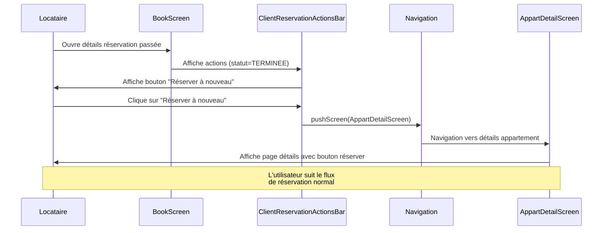
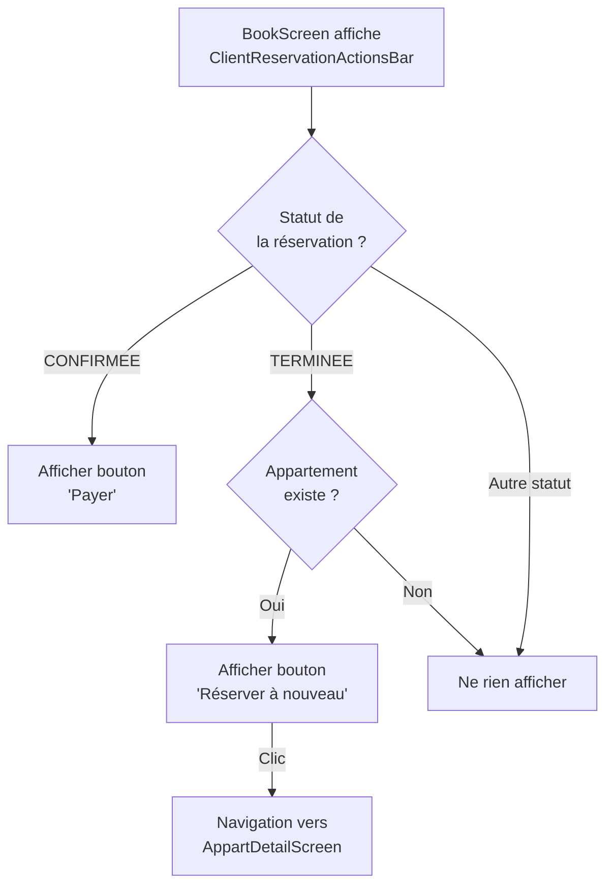

# 🏗️ Architecture - Re-réservation depuis l'historique

**Date** : 2026-02-12
**Statut** : En attente de validation
**Agent** : Architecture

---

## 1. Vue d'ensemble

### Objectif
Permettre aux locataires de re-réserver facilement un appartement depuis l'historique de leurs réservations passées en ajoutant un bouton de navigation vers la page de détails de l'appartement.

### Composants impactés
- ✅ **Widget existant** : `lib/widget/reservation/client_reservation_actions_bar.dart`
- ✅ **Modèle existant** : `lib/model/reservation/reservation.dart` (lecture seule)
- ✅ **Navigation existante** : Utilisation de `pushScreen()` et écran de détails d'appartement existant

### Nouvelles entités à créer
**AUCUNE** - Cette feature réutilise 100% de l'existant ! 🎉

---

## 2. Diagramme de Séquence



---

## 3. Architecture Technique

### 3.1 Logique d'affichage du bouton

Le bouton "Réserver à nouveau" s'affiche **UNIQUEMENT** si :

```dart
// Conditions cumulatives (ET logique)
1. reservation.statut == ReservationStatus.terminee
2. reservation.appart != null  // Appartement existe
```

### 3.2 Modification du widget ClientReservationActionsBar

**Fichier** : `lib/widget/reservation/client_reservation_actions_bar.dart`

**Changement** :

```dart
// AVANT (simplifié)
Widget build(BuildContext context) {
  if (status == ReservationStatus.confirmee) {
    return /* Bouton Payer */;
  }
  return SizedBox.shrink(); // Rien pour les autres statuts
}

// APRÈS (simplifié)
Widget build(BuildContext context) {
  if (status == ReservationStatus.confirmee) {
    return /* Bouton Payer */;
  }

  // NOUVEAU : Bouton re-réservation pour réservations terminées
  if (status == ReservationStatus.terminee && reservation.appart != null) {
    return /* Bouton "Réserver à nouveau" */;
  }

  return SizedBox.shrink();
}
```

### 3.3 Navigation

**Action au clic** :
```dart
onPressed: () {
  // Navigation vers la page de détails de l'appartement
  pushScreen(
    context,
    AppartDetailScreen(reservation.appart!),
  );
}
```

**Note** : Aucune modification du flux de réservation existant. L'utilisateur arrive sur la page de détails de l'appartement comme s'il l'avait trouvé via la recherche.

---

## 4. Structure des Fichiers

**Aucun nouveau fichier** - Modifications uniquement :

```
lib/
└── widget/
    └── reservation/
        └── client_reservation_actions_bar.dart  [MODIFIÉ]
```

---

## 5. Flux de données

```
┌─────────────────────────────────────────────────────────────┐
│ BookScreen                                                   │
│                                                              │
│  ┌────────────────────────────────────────────────┐         │
│  │ ClientReservationActionsBar                    │         │
│  │                                                │         │
│  │  Données entrantes:                            │         │
│  │  • reservation: Reservation                    │         │
│  │    └─ statut: ReservationStatus.terminee     │         │
│  │    └─ appart: Appartement                     │         │
│  │                                                │         │
│  │  Logique:                                      │         │
│  │  if (statut == terminee && appart != null)    │         │
│  │    → Afficher bouton "Réserver à nouveau"    │         │
│  │                                                │         │
│  │  Action au clic:                               │         │
│  │  pushScreen(AppartDetailScreen(appart))       │         │
│  └────────────────────────────────────────────────┘         │
└─────────────────────────────────────────────────────────────┘
                            │
                            ▼
        ┌───────────────────────────────────┐
        │ AppartDetailScreen                │
        │                                   │
        │ Flux de réservation normal       │
        │ (Aucune modification)             │
        └───────────────────────────────────┘
```

---

## 6. Plan d'implémentation

### Étape 1 : Modifier ClientReservationActionsBar
1. Lire le fichier existant
2. Ajouter une condition pour `ReservationStatus.terminee`
3. Créer un bouton "Réserver à nouveau" avec navigation
4. Vérifier la compilation

### Étape 2 : Tests manuels
- Tester avec une réservation terminée
- Vérifier que le bouton n'apparaît pas pour les autres statuts
- Vérifier la navigation vers AppartDetailScreen
- Vérifier qu'une nouvelle réservation peut être faite normalement

---

## 7. Considérations techniques

### Sécurité
- ✅ Aucune modification des permissions
- ✅ Utilisation des routes/navigation existantes
- ✅ Aucune nouvelle donnée sensible

### Performance
- ✅ Aucun impact - simple ajout d'UI conditionnel
- ✅ Pas d'appels API supplémentaires

### UX/UI
- ✅ Cohérence avec le bouton "Payer" existant (même structure)
- ✅ Utilisation de `PlainButton` (widget standard du projet)
- ✅ Couleur verte ou primaire pour encourager l'action

### Compatibilité
- ✅ Aucune modification du modèle Reservation
- ✅ Aucune modification de l'API backend
- ✅ Fonctionne avec l'ensemble des données existantes

---

## 8. Diagramme de décision



---

## 9. Risques et mitigation

| Risque | Impact | Probabilité | Mitigation |
|--------|--------|-------------|------------|
| Appartement supprimé | Moyen | Faible | Vérifier `appart != null` |
| Navigation cassée | Faible | Très faible | Utiliser la navigation existante testée |
| Confusion utilisateur | Faible | Faible | Libellé clair "Réserver à nouveau" |

---

## 10. Résumé technique

**Complexité** : 🟢 TRÈS SIMPLE

**Effort estimé** : 15-30 minutes

**Lignes de code** : ~20 lignes ajoutées

**Tests requis** : Tests manuels uniquement (pas de logique complexe)

**Impact** :
- ✅ 0 nouvelle entité
- ✅ 1 fichier modifié
- ✅ 0 modification API
- ✅ 0 migration de données
