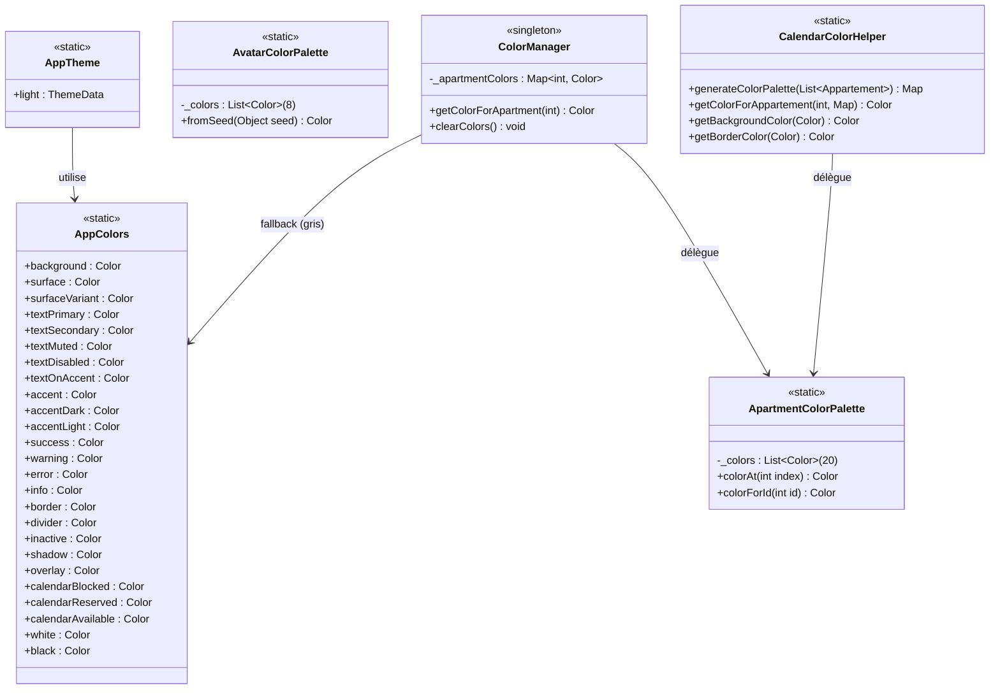
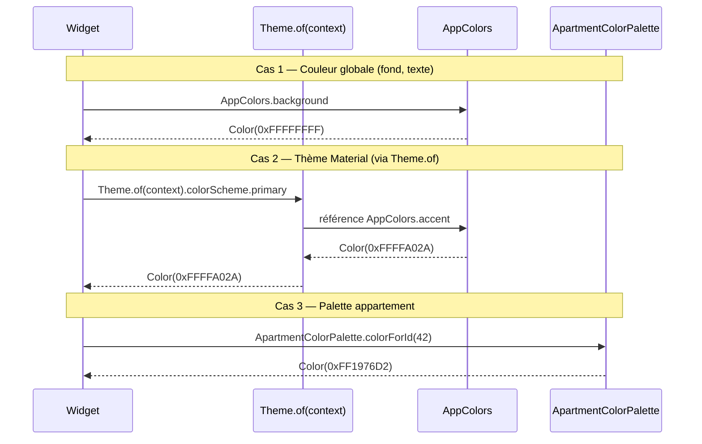

# 🏗️ Architecture — Refactor couleurs & bascule fond blanc

**Feature** : `refactor-couleurs-fond-blanc`
**Stack** : Flutter 3.7+ / Dart — existant (pas de changement de stack)
**Mode** : projet existant

---

## 1. Vue d'ensemble

### Objectif
Remplacer le système de couleurs actuel (`lib/service/providers/style.dart`) qui est **non respecté** (fuites dans 170+ fichiers) par un système centralisé strict basé sur une **identité visuelle claire** (blanc/noir/orange-tertiaire).

### Composants impactés
| Zone | Impact | Nb approx. |
|---|---|---|
| Référentiel couleurs (`Style`) | **Remplacé** par `AppColors` | 1 fichier créé, 1 supprimé |
| Références `Style.xxx` | Migration vers `AppColors.xxx` | ~177 fichiers |
| Couleurs hardcodées `Color(0xFF...)` | Remplacées par `AppColors.xxx` | ~86 fichiers |
| Couleurs `Colors.xxx` natives | Remplacées par `AppColors.xxx` | ~131 fichiers |
| Palette calendrier (`CalendarColorHelper`) | Adaptée fond blanc via `ApartmentColorPalette` | 1 fichier |
| Couleur aléatoire HSL (`ColorManager`) | Remplacée par palette déterministe | 1 fichier |
| Palette avatars messages (dupliquée 3×) | Centralisée dans `AvatarColorPalette` | 3 fichiers |
| Configuration `ThemeData` | Nouveau `AppTheme.light` | `main.dart` |
| StatusBar | Inversion luminosité icônes | `main.dart` |

### Nouvelles entités
- `AppColors` — classe statique, **source unique** des couleurs brutes
- `AppTheme` — configuration `ThemeData` Material 3 (mode light)
- `ApartmentColorPalette` — 20 couleurs distinctes adaptées fond clair
- `AvatarColorPalette` — 8 couleurs avatars conversations

---

## 2. Diagramme de Classes



---

## 3. Diagramme de Séquence — consommation d'une couleur



---

## 4. Structure des Fichiers

```
lib/
├── theme/                                    # 🆕 NOUVEAU dossier
│   ├── app_colors.dart                       # 🆕 Source unique de couleurs
│   ├── app_theme.dart                        # 🆕 ThemeData Material 3 light
│   └── palettes/
│       ├── apartment_color_palette.dart      # 🆕 20 couleurs calendrier
│       └── avatar_color_palette.dart         # 🆕 8 couleurs avatars
│
├── service/
│   ├── color/
│   │   └── color_manager.dart                # ♻️ Refactoré (utilise ApartmentColorPalette)
│   └── providers/
│       └── style.dart                        # ❌ SUPPRIMÉ en fin de migration
│
├── util/
│   └── helper/
│       └── calendar_color_helper.dart        # ♻️ Refactoré (utilise ApartmentColorPalette)
│
└── main.dart                                 # ♻️ Utilise AppTheme.light + statusbar corrigée
```

---

## 5. Contrats / Interfaces

### 5.1 `AppColors`

```dart
class AppColors {
  AppColors._();

  // ============ FONDS ============
  static const Color background = Color(0xFFFFFFFF);        // Fond principal app
  static const Color surface = Color(0xFFF5F5F5);           // Cards, containers
  static const Color surfaceVariant = Color(0xFFEEEEEE);    // Surfaces élevées / hover
  static const Color surfaceElevated = Color(0xFFFAFAFA);   // Variant subtil

  // ============ TEXTES ============
  static const Color textPrimary = Color(0xFF1D1D1D);       // Titres, corps de texte
  static const Color textSecondary = Color(0xFF616161);     // Sous-titres, labels
  static const Color textMuted = Color(0xFF9E9E9E);         // Texte atténué, hints
  static const Color textDisabled = Color(0xFFBDBDBD);      // Désactivé
  static const Color textOnAccent = Color(0xFFFFFFFF);      // Texte blanc sur orange

  // ============ ACCENT TERTIAIRE (ORANGE MARQUE) ============
  static const Color accent = Color(0xFFFFA02A);            // CTA, badges actifs
  static const Color accentDark = Color(0xFFE08A1F);        // Pressed / hover
  static const Color accentLight = Color(0xFFFFF1DC);       // Background léger orange

  // ============ SÉMANTIQUE ============
  static const Color success = Color(0xFF4CAF50);
  static const Color successLight = Color(0xFFE8F5E9);
  static const Color warning = Color(0xFFFF9800);
  static const Color warningLight = Color(0xFFFFF3E0);
  static const Color error = Color(0xFFEB4040);
  static const Color errorLight = Color(0xFFFFEBEE);
  static const Color info = Color(0xFF2196F3);
  static const Color infoLight = Color(0xFFE3F2FD);

  // ============ BORDURES & SÉPARATEURS ============
  static const Color border = Color(0xFFE0E0E0);
  static const Color divider = Color(0xFFEEEEEE);

  // ============ ÉTATS ============
  static const Color inactive = Color(0xFFBDBDBD);
  static const Color disabled = Color(0xFFEEEEEE);

  // ============ OMBRES & OVERLAYS ============
  // Utilisés via .withValues(alpha: x)
  static const Color shadowBase = Color(0xFF000000);
  static Color shadow = const Color(0xFF000000).withValues(alpha: 0.08);
  static Color shadowStrong = const Color(0xFF000000).withValues(alpha: 0.15);
  static Color overlay = const Color(0xFF000000).withValues(alpha: 0.5);
  static Color overlayLight = const Color(0xFF000000).withValues(alpha: 0.2);

  // ============ CALENDRIER ============
  static const Color calendarBlocked = Color(0xFFE0E0E0);
  static const Color calendarReserved = accent;
  static const Color calendarAvailable = success;

  // ============ PRIMITIVES (usage restreint) ============
  static const Color white = Color(0xFFFFFFFF);
  static const Color black = Color(0xFF000000);
}
```

### 5.2 `AppTheme`

```dart
class AppTheme {
  AppTheme._();

  static ThemeData get light => ThemeData(
        useMaterial3: true,
        brightness: Brightness.light,
        scaffoldBackgroundColor: AppColors.background,
        colorScheme: const ColorScheme.light(
          primary: AppColors.accent,
          onPrimary: AppColors.textOnAccent,
          secondary: AppColors.textPrimary,
          onSecondary: AppColors.background,
          surface: AppColors.surface,
          onSurface: AppColors.textPrimary,
          error: AppColors.error,
          onError: AppColors.textOnAccent,
        ),
        appBarTheme: const AppBarTheme(
          backgroundColor: AppColors.background,
          foregroundColor: AppColors.textPrimary,
          elevation: 0,
          systemOverlayStyle: SystemUiOverlayStyle(
            statusBarIconBrightness: Brightness.dark,
            statusBarBrightness: Brightness.light,
          ),
        ),
        dividerColor: AppColors.divider,
      );
}
```

### 5.3 `ApartmentColorPalette`

```dart
class ApartmentColorPalette {
  ApartmentColorPalette._();

  /// 20 couleurs distinctes adaptées pour un fond clair (blanc/gris).
  /// Saturation 70-85%, lightness 40-55% pour bon contraste sur blanc.
  static const List<Color> _colors = [
    Color(0xFFD32F2F), // Rouge
    Color(0xFF388E3C), // Vert
    Color(0xFF1976D2), // Bleu
    Color(0xFFF57C00), // Orange foncé
    Color(0xFF7B1FA2), // Violet
    Color(0xFF00838F), // Cyan foncé
    Color(0xFFC2185B), // Rose vif
    Color(0xFF512DA8), // Indigo profond
    Color(0xFF00796B), // Teal
    Color(0xFFF9A825), // Jaune moutarde
    Color(0xFF6D4C41), // Marron
    Color(0xFF546E7A), // Bleu gris
    Color(0xFFE53935), // Rouge vif
    Color(0xFF43A047), // Vert vif
    Color(0xFF1E88E5), // Bleu vif
    Color(0xFFEF6C00), // Orange profond
    Color(0xFF8E24AA), // Violet vif
    Color(0xFF0097A7), // Cyan
    Color(0xFFD81B60), // Rose foncé
    Color(0xFF5E35B1), // Violet
  ];

  static Color colorAt(int index) => _colors[index % _colors.length];

  static Color colorForId(int id) => _colors[id.abs() % _colors.length];

  static List<Color> get all => List.unmodifiable(_colors);
}
```

### 5.4 `AvatarColorPalette`

```dart
class AvatarColorPalette {
  AvatarColorPalette._();

  /// 8 couleurs pour les avatars de conversation.
  /// Contraste suffisant avec AppColors.textOnAccent (blanc).
  static const List<Color> _colors = [
    Color(0xFF4F46E5), // Indigo
    Color(0xFF7C3AED), // Violet
    Color(0xFFDB2777), // Pink
    Color(0xFFD97706), // Amber
    Color(0xFF059669), // Emerald
    Color(0xFF2563EB), // Blue
    Color(0xFFDC2626), // Red
    Color(0xFF0D9488), // Teal
  ];

  static Color fromSeed(Object seed) =>
      _colors[seed.hashCode.abs() % _colors.length];

  static List<Color> get all => List.unmodifiable(_colors);
}
```

---

## 6. Mapping de Migration `Style.xxx` → `AppColors.xxx`

Table de référence que le Dev **doit suivre strictement** lors des remplacements :

| Ancien (`Style`) | Nouveau (`AppColors`) | Notes |
|---|---|---|
| `Style.primaryColor` | `AppColors.accent` | Orange reste accent |
| `Style.backgroundColor` | `AppColors.background` | Blanc |
| `Style.containerColor3` | `AppColors.background` | Doublon de backgroundColor |
| `Style.foregroundColor` | `AppColors.textPrimary` | Inversion (blanc → noir) |
| `Style.white` | `AppColors.white` | Usage rare, si vraiment blanc pur |
| `Style.textColor(ctx)` | `AppColors.textPrimary` | Context supprimé |
| `Style.texteColor(ctx)` | `AppColors.textPrimary` | Doublon avec typo |
| `Style.iconColor` | `AppColors.textPrimary` | Icônes noires sur blanc |
| `Style.errorColor` | `AppColors.error` | |
| `Style.successColor` | `AppColors.success` | |
| `Style.warningColor` | `AppColors.warning` | |
| `Style.surfaceColor` | `AppColors.surface` | Inversion |
| `Style.surfaceColorLight` | `AppColors.surfaceVariant` | Inversion |
| `Style.textSecondary` | `AppColors.textSecondary` | Ajusté pour blanc |
| `Style.textMuted` | `AppColors.textMuted` | Ajusté pour blanc |
| `Style.innactiveColor` | `AppColors.inactive` | Corrige typo |
| `Style.shadowColor` | `AppColors.shadow` | Inversion (white → black) |
| `Style.primaireColor` | `AppColors.textPrimary` | Était `#1D1D1D` = noir |
| `Style.containerColor` (#8404B1) | `AppColors.accent` | Le violet n'a aucun sens dans la nouvelle palette — à mapper sur accent |
| `Style.containerColor2` | `AppColors.background` | C'était déjà `#FFFFFF` |
| `Style.startColor` (amber) | `AppColors.warning` | Notes de review |
| `Style.calendarBlocked` | `AppColors.calendarBlocked` | |
| `Style.calendarReserved` | `AppColors.calendarReserved` | |
| `Style.calendarAvailable` | `AppColors.calendarAvailable` | |

### Remplacements hardcode

| Ancien hardcode | Nouveau | Occurrences |
|---|---|---|
| `Color(0xFF1D1D1D)` (fond) | `AppColors.background` | selon contexte |
| `Color(0xFF1D1D1D)` (texte/icône) | `AppColors.textPrimary` | selon contexte |
| `Color(0xFF2A2A2A)` | `AppColors.surface` | 85× |
| `Color(0xFF2D2D2D)` | `AppColors.surface` | |
| `Color(0xFF3D3D3D)` | `AppColors.surfaceVariant` | |
| `Color(0xFFFFA02A)` | `AppColors.accent` | |
| Palette avatars 8 couleurs | `AvatarColorPalette._colors` | 3 fichiers |
| `Colors.white` (fond) | `AppColors.background` | |
| `Colors.white` (texte sur accent) | `AppColors.textOnAccent` | |
| `Colors.black` | `AppColors.textPrimary` | |
| `Colors.grey.shade800/900` | `AppColors.surface` | |
| `Colors.grey.shade600/700` | `AppColors.textSecondary` | |
| `Colors.grey.shade400/500` | `AppColors.textMuted` | |
| `Colors.grey.shade200/300` | `AppColors.border` | |
| `Colors.grey.shade100` | `AppColors.divider` | |
| `Colors.red[xxx]` | `AppColors.error` | |
| `Colors.green[xxx]` | `AppColors.success` | |
| `Colors.blue[xxx]` | `AppColors.info` | |
| `Colors.orange[xxx]` / `Colors.amber` | `AppColors.warning` ou `AppColors.accent` selon sens | |

⚠️ **Règle de discernement** : pour les remplacements ambigus (ex: `Color(0xFF1D1D1D)` qui peut être fond ou texte), le Dev doit **inspecter le contexte** (propriété Flutter concernée : `color:`, `backgroundColor:`, `foregroundColor:`) et choisir la sémantique correspondante.

---

## 7. Adaptations des helpers

### 7.1 `CalendarColorHelper`
```dart
// AVANT : palette locale 20 couleurs claires conçues pour fond sombre
// APRÈS : délègue à ApartmentColorPalette (20 couleurs adaptées fond clair)

class CalendarColorHelper {
  static Map<int, Color> generateColorPalette(List<Appartement> appartements) {
    final palette = <int, Color>{};
    for (int i = 0; i < appartements.length; i++) {
      final id = appartements[i].id;
      if (id != null) palette[id] = ApartmentColorPalette.colorAt(i);
    }
    return palette;
  }

  static Color getColorForAppartement(int id, Map<int, Color> palette) =>
      palette[id] ?? AppColors.textMuted;

  // Opacités ajustées pour fond blanc (ex. 0.15 au lieu de 0.2)
  static Color getBackgroundColor(Color color) => color.withValues(alpha: 0.15);
  static Color getBorderColor(Color color) => color.withValues(alpha: 0.7);
}
```

### 7.2 `ColorManager`
```dart
// AVANT : génération HSL aléatoire (lightness 40-60%) → mauvais contraste sur blanc
// APRÈS : palette déterministe adaptée

class ColorManager {
  ColorManager._();
  static final ColorManager instance = ColorManager._();

  final Map<int, Color> _apartmentColors = {};

  Color getColorForApartment(int appartementId) {
    return _apartmentColors.putIfAbsent(
      appartementId,
      () => ApartmentColorPalette.colorForId(appartementId),
    );
  }

  void clearColors() => _apartmentColors.clear();
  int get cachedColorsCount => _apartmentColors.length;
  bool hasColorFor(int id) => _apartmentColors.containsKey(id);
  Map<int, Color> get allColors => Map.unmodifiable(_apartmentColors);
}
```

### 7.3 `main.dart`
```dart
// AVANT : ThemeData inline avec scaffoldBackgroundColor: Style.containerColor3
//         + AppBarTheme hardcodé Color(0xFF1D1D1D)
//         + statusBarIconBrightness: Brightness.light
// APRÈS :
MaterialApp(
  // ...
  theme: AppTheme.light,  // ← tout centralisé
  home: const SplashScreen(),
)
```

---

## 8. Plan d'exécution (ordre imposé au Dev)

### Phase 1 — Création du nouveau système (sans casser l'existant)
1. Créer `lib/theme/app_colors.dart`
2. Créer `lib/theme/palettes/apartment_color_palette.dart`
3. Créer `lib/theme/palettes/avatar_color_palette.dart`
4. Créer `lib/theme/app_theme.dart`

### Phase 2 — Refactor des helpers
5. Refactorer `lib/util/helper/calendar_color_helper.dart`
6. Refactorer `lib/service/color/color_manager.dart`
7. Modifier `lib/main.dart` (utilise `AppTheme.light` + statusbar corrigée)

### Phase 3 — Migration mécanique des références
8. Remplacer `Style.xxx` par `AppColors.xxx` dans tous les fichiers selon le mapping
9. Remplacer les hardcodes (`Color(0xFF1D1D1D)`, `Color(0xFF2A2A2A)`, etc.)
10. Remplacer les `Colors.xxx` natifs selon le mapping de discernement
11. Centraliser les palettes avatars (3 fichiers) vers `AvatarColorPalette.fromSeed`

### Phase 4 — Nettoyage
12. Supprimer `lib/service/providers/style.dart`
13. Supprimer les imports de `style.dart` restants
14. Vérifier qu'aucun `Color(0xFF...)` ou `Colors.xxx` ne subsiste en dehors de `lib/theme/`

### Phase 5 — Validation
15. `flutter analyze` → 0 erreur
16. `flutter test` → tous les tests passent
17. Lancer l'app : parcours des 3 rôles (locataire, proprio, démarcheur) — vérifier chaque écran principal

---

## 9. CONTRAT D'IMPLÉMENTATION

### Fichiers à créer (4)
- [ ] `lib/theme/app_colors.dart` — classe `AppColors` selon spec §5.1
- [ ] `lib/theme/app_theme.dart` — classe `AppTheme` avec `AppTheme.light` selon spec §5.2
- [ ] `lib/theme/palettes/apartment_color_palette.dart` — classe `ApartmentColorPalette` selon spec §5.3
- [ ] `lib/theme/palettes/avatar_color_palette.dart` — classe `AvatarColorPalette` selon spec §5.4

### Fichiers à refactorer (3)
- [ ] `lib/util/helper/calendar_color_helper.dart` — délègue à `ApartmentColorPalette`, opacités ajustées
- [ ] `lib/service/color/color_manager.dart` — délègue à `ApartmentColorPalette`, suppression du HSL aléatoire
- [ ] `lib/main.dart` — utilise `AppTheme.light`, suppression du `ThemeData` inline + hardcode AppBar

### Fichiers à migrer (Style.xxx → AppColors.xxx)
- [ ] **177 fichiers** contenant des références `Style.xxx` (cf. mapping §6)

### Fichiers à nettoyer (hardcodes)
- [ ] **20 fichiers** contenant `Color(0xFF1D1D1D)`
- [ ] **33 fichiers** contenant `Color(0xFF2A2A2A)`
- [ ] **86 fichiers** contenant `Colors.white` / `Colors.black`
- [ ] **131 fichiers** contenant `Colors.grey/red/blue/green/orange/...`
- [ ] **3 fichiers** avec palette avatars dupliquée (`message_item.dart`, `conversation_app_bar.dart`, `message_tile.dart`) → `AvatarColorPalette.fromSeed`

### Fichiers à supprimer (1)
- [ ] `lib/service/providers/style.dart` — classe `Style` supprimée entièrement

### Règles non-négociables
- **Aucun** `Color(0xFF...)` ou `Colors.xxx` hors de `lib/theme/` après migration
- **Aucun** import de `package:asfar/service/providers/style.dart` après migration
- Le fichier `app_colors.dart` est le **seul** à contenir des constantes `Color(0x...)` de couleurs de base
- Les palettes (apartment, avatar) sont les **seuls** autres fichiers à contenir des `Color(0x...)` et uniquement pour leur liste interne
- Les textes sur fond orange (accent) utilisent `AppColors.textOnAccent` (blanc), pas `AppColors.textPrimary`
- Ne pas introduire de nouveaux `ColorManager`, helpers ou fichiers de couleurs en parallèle

---

## 10. Risques & Mitigations

| Risque | Mitigation |
|---|---|
| Ambiguïté contexte `Color(0xFF1D1D1D)` (fond vs texte) | Le Dev inspecte la propriété Flutter (`backgroundColor` vs `color`) pour choisir `background` vs `textPrimary` |
| Régression visuelle sur un écran spécifique | Validation manuelle des 3 parcours utilisateurs après migration |
| Couleurs métier spécifiques oubliées (badges, status, charts) | Audit `grep "Color("` final dans toute l'arborescence `lib/` (hors `lib/theme/`) |
| `flutter_map`, `fl_chart`, `pdf` utilisent des couleurs | À vérifier : ces packages reçoivent des `Color` depuis notre code → migration couvre ces cas |
| Couleur `containerColor` (violet `#8404B1`) sans équivalent sémantique | Mappée sur `AppColors.accent` (décision arbitraire, à valider visuellement) |

---

## 11. Flag UI

```
UI_REQUIRED: false
```

**Justification :** La feature ne crée **aucun** nouveau composant, écran ou flux utilisateur. Elle remplace uniquement les **valeurs** de couleurs pour produire une nouvelle identité visuelle. La structure des widgets, les dispositions, et les interactions restent strictement identiques. L'agent UI/UX n'apporte pas de valeur ici — le choix visuel (blanc/noir/orange tertiaire) a déjà été tranché lors de la spec BA.

---

## 12. Validation

```
╔════════════════════════════════════════════════════════════╗
║  ✋ VALIDATION REQUISE                                      ║
╠════════════════════════════════════════════════════════════╣
║                                                             ║
║  Cette architecture vous convient-elle ?                   ║
║                                                             ║
║  Répondez :                                                 ║
║  • "oui" ou "valider" → Passage au Développement           ║
║  • "non" + feedback → Je révise                            ║
║                                                             ║
╚════════════════════════════════════════════════════════════╝
```
