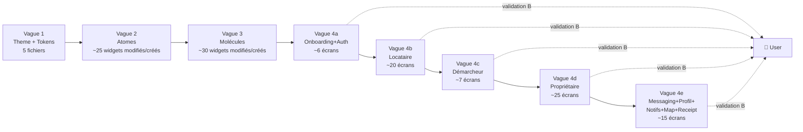
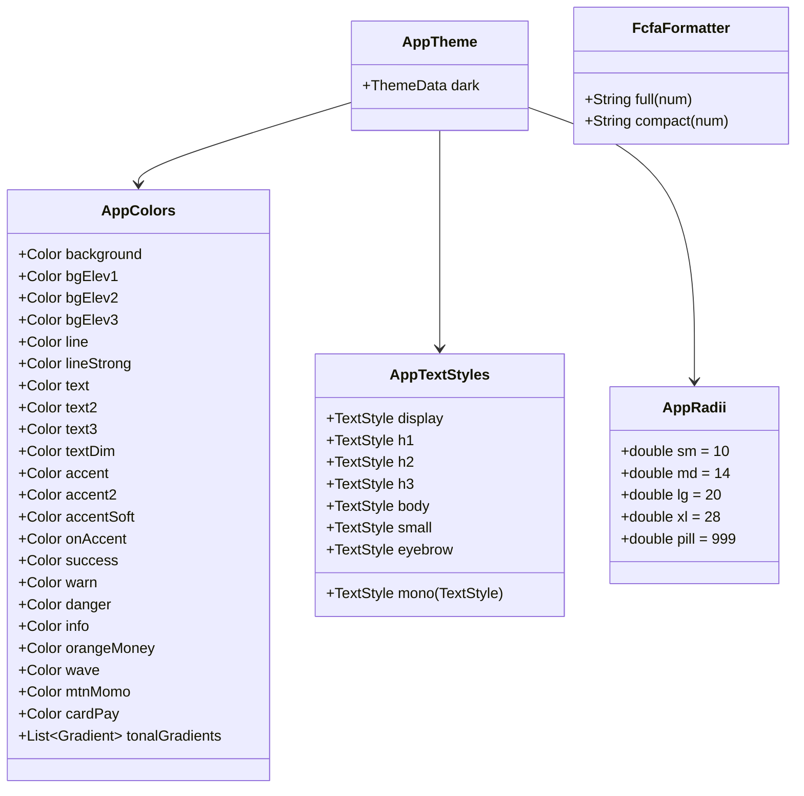
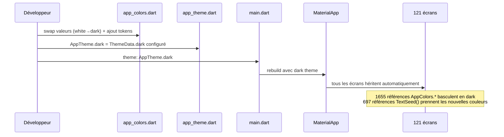

# 🏗️ Architecture : Refonte Design Asfar Premium

> **Auteur :** Architecture Agent (workflow `/feature full`)
> **Date :** 2026-05-07
> **Statut :** En attente de validation utilisateur
> **Compagnon :** [`business-spec.md`](./business-spec.md)

---

## 📊 Analyse du projet

### Environnement détecté

- **Framework :** Flutter 3.7+ / Dart 3
- **Architecture :** BLoC (`flutter_bloc 9.1`) + Hive 2.2 + Provider 6.1
- **Navigation :** Navigator 1.0 (5 routes centralisées dans `lib/util/navigation.dart`)
- **Backend :** Spring Boot local + WebSocket STOMP
- **Plateformes :** iOS 13+ / Android 10+

### Conventions observées

| Aspect | Convention projet |
|---|---|
| **Organisation widgets** | `lib/widget/<thème>/<widget>.dart` — 44 sous-dossiers thématiques (button/, input/, card/, calendar/, …) |
| **Organisation écrans** | `lib/screen/client/<role>/<feature>/<screen>.dart` |
| **Organisation BLoCs** | `lib/bloc/<domain>_bloc/{bloc,event,state}.dart` (flat, non séparé par rôle) |
| **Theming** | `lib/theme/app_colors.dart` (constantes) + `lib/theme/app_theme.dart` (`ThemeData`) — single source of truth |
| **Texte** | Widget `TextSeed(text, fontSize, fontWeight, color)` utilisé **697×** dans tout le projet |
| **Couleurs** | `AppColors.xxx` référencé **1 655×** dans tout le projet |
| **Espacement** | `Espacement.paddingBloc / radius / gapItem / gapSection` dans `config/app_propertie.dart` |

### Volumétrie de la migration

| Métrique | Valeur |
|---|---|
| Total écrans | **121** |
| Total widgets réutilisables | **154** |
| Total BLoCs | **22** (intacts par règle métier RM8) |
| Références `AppColors.*` | **1 655** |
| Références `TextSeed(` | **697** |
| Références `CustomButton(` | **7** |
| Références `OutlinedCustomButton(` | **3** |
| Références `InputField(` | **34** |
| Références `BottomNav(` | **4** |
| Références `DynamicAppBar(` | **2** |
| Références `AppTheme.` | **2** |
| Code mort détecté | **0** (rien à supprimer purement) |

### Top 10 fichiers les plus impactés (par occurrences `AppColors.*`)

| Fichier | Occurrences |
|---|---:|
| `screen/client/proprio/comptabilite/charge_form_screen.dart` | 46 |
| `screen/client/proprio/reservations/reservation_manuelle_form_screen.dart` | 43 |
| `screen/client/proprio/comptabilite/charge_detail_screen.dart` | 37 |
| `widget/form/location_picker.dart` | 36 |
| `screen/client/demarcheur/reservations/demarcheur_reservation_form_screen.dart` | 34 |
| `screen/client/proprio/demarcheurs/mes_demarcheurs_screen.dart` | 26 |
| `screen/client/proprio/comptabilite/widget/charge_list_section.dart` | 26 |
| `screen/client/locataire/booking/book_screen.dart` | 25 |
| `widget/receipt/receipt_card.dart` | 23 |
| `widget/map/base_location_map.dart` | 23 |

---

## 🎯 Décision architecturale clé : "Swap des entrailles"

### Principe

**Préserver les noms et signatures publics, remplacer les valeurs et l'implémentation interne.**

> Cette stratégie tire parti des **2 352 callsites existants** sans les toucher : un seul fichier modifié → toute l'app bascule automatiquement.

### Application concrète

| Élément public | Action | Stratégie |
|---|---|---|
| `AppColors` (classe + champs) | **Modifié** | Mêmes noms (`background`, `accent`, `textPrimary`, …), valeurs swappées : `#FFFFFF` → `#0A0A0B`, `#FFA02A` → `#E8B86B`, etc. + nouveaux champs ajoutés (`bgElev1/2/3`, `line`, `lineStrong`, `accentSoft`, `accent2`, `text2/3/dim`). |
| `AppTheme.light` | **Renommé en `dark`** ou **modifié sur place** | `Brightness.dark`, `ColorScheme.dark`, override `AppBarTheme`, `CardTheme`, `InputDecorationTheme` selon prototype. |
| `TextSeed` widget | **Étendu** | Garde son constructeur principal (rétro-compat). Ajout de constructeurs nommés : `TextSeed.display()`, `.h1()`, `.h2()`, `.h3()`, `.body()`, `.small()`, `.eyebrow()`, `.mono()`. Le `color` par défaut pointe vers le nouveau `AppColors.textPrimary` (blanc cassé). |
| `CustomButton`, `OutlinedCustomButton`, `PlainButton`, `TexteButton` | **Modifiés** | Mêmes noms et props. Internals réécrits selon `AsfarButton primary/secondary/ghost` du proto (radius 14, scale-on-press, accent or). |
| `InputField`, `InputPass`, `InputDate`, `InputSearch` | **Modifiés** | Mêmes noms et props. Décoration `bgElev2`, focus border accent or. |
| `DynamicAppBar` | **Modifié** | Devient le `AsfarTopNav` proto (padding-top safe area, 3 colonnes left/center/right, eyebrow optionnelle, transparent fond). |
| `BottomNav` + `BottomNavItem` | **Modifiés** | Style proto (blur backdrop iOS, accent or actif). Configurable via `tabsByRole`. |
| `AppartementPreviewCard` | **Modifié** | Devient `AsfarListingCard` du proto (16:10 image, badges flottants, photo dots, métadonnées icônes). |
| `BadgeStatus`, `UnreadBadge` | **Modifiés** | 6 tons (`success/warn/info/danger/accent/neutral`) avec pattern `bg color×0.14 / texte saturé`. |
| `ShimmerCard`, `CircularProgress`, error widgets | **Modifiés** | Couleurs Asfar (skeleton sur `bgElev3`). |
| `MessageTile`, `MessageItem`, conversation widgets | **Modifiés** | Bubbles asymétriques, accent or pour `me`, `bgElev2` pour `them`. |
| `NotificationTile`, `NotificationBadge`, etc. | **Modifiés** | Style Asfar dark (12 widgets de notification existants gardés). |
| `Calendar*` widgets | **Modifiés** | Cellules colorées selon proto (réservé en or solid, pending en accentSoft, today en border accent). |
| Widgets `wizard/*` | **Modifiés** | Style Asfar (top nav avec sub `Étape n/N`, primary CTA bottom blur). |

### Nouveaux composants à créer (absents de l'app)

> Placés dans le sous-dossier thématique cohérent existant — **pas** de dossier `asfar/` dédié.

| Nouveau widget | Destination |
|---|---|
| `ImgPh` (placeholder image gradient × 4 tones) | `lib/widget/img/img_placeholder.dart` |
| `MapPh` (placeholder carte avec grille + halos) | `lib/widget/map/map_placeholder.dart` |
| `BlurContainer` (Liquid Glass iOS + fallback) | `lib/widget/container/blur_container.dart` |
| `Sparkbar` (mini bar chart 6 valeurs) | `lib/widget/chart/sparkbar.dart` *(nouveau dossier `chart/`)* |
| `StackedBar` (barre horizontale segmentée) | `lib/widget/chart/stacked_bar.dart` |
| `ForecastChart` (line chart passé+futur dashed) | `lib/widget/chart/forecast_chart.dart` |
| `StepTimeline` (5 étapes verticales reliées) | `lib/widget/timeline/step_timeline.dart` *(nouveau dossier `timeline/`)* |
| `SuccessCircle` (cercle 88px halo concentrique) | `lib/widget/feedback/success_circle.dart` *(nouveau dossier `feedback/`)* |
| `StatTile` (eyebrow + value + delta) | `lib/widget/card/stat_tile.dart` *(rejoint `card/` existant)* |
| `ReferralRow` (ligne demande démarcheur) | `lib/widget/item/referral_row.dart` *(rejoint `item/` existant)* |
| `PaymentMethodTile` (OM / Wave / MTN / Card) | `lib/widget/list/payment_method_tile.dart` *(rejoint `list/` existant)* |
| `BookingCalendar` (grille mois colorée) | `lib/widget/calendar/booking_calendar.dart` *(rejoint `calendar/`)* |
| `FieldRow` (eyebrow + value + edit icon — édition annonce) | `lib/widget/item/field_row.dart` |
| `PeriodSwitcher` (Semaine/Mois/Trim/Année) | `lib/widget/item/period_switcher.dart` |
| `UnderlineTabs` (onglets soulignés Edit annonce) | `lib/widget/container/underline_tabs.dart` |

> **Total nouveaux widgets : 15** (3 nouveaux sous-dossiers : `chart/`, `timeline/`, `feedback/`).

### Tokens nouveaux à créer

> Stockés dans `lib/theme/app_colors.dart` (étendu) et nouveaux fichiers `lib/theme/`.

| Fichier | Contenu |
|---|---|
| `lib/theme/app_colors.dart` *(étendu)* | Champs existants conservés (mêmes noms, valeurs swappées) + ajout : `bgElev1/2/3`, `line`, `lineStrong`, `accentSoft`, `accent2`, `text2/3/dim`, `onAccent`, `tonalGradient1-4`, `mobile money colors` |
| `lib/theme/app_radii.dart` *(nouveau)* | `sm 10`, `md 14`, `lg 20`, `xl 28`, `pill 999` |
| `lib/theme/app_text_styles.dart` *(nouveau)* | `display`, `h1`, `h2`, `h3`, `body`, `small`, `eyebrow` + helper `.mono()` |
| `lib/theme/app_theme.dart` *(modifié)* | `AppTheme.dark` remplace `AppTheme.light`. `ThemeData` complet (scaffoldBackgroundColor, ColorScheme.dark, AppBarTheme, CardTheme, InputDecorationTheme, BottomNavigationBarTheme) |
| `lib/util/fcfa_formatter.dart` *(nouveau)* | `FcfaFormatter.full()`, `.compact()` |

---

## 🏛️ Architecture métier

### Entités / Concepts (inchangés — RM8)

Les entités métier (Appartement, Reservation, User, Charge, Démarcheur, Conversation, Notification, etc.) ne sont **pas touchées**. Voir `lib/model/`.

### Règles métier visuelles (nouvelles, RM1-RM7)

| ID | Règle | Application |
|---|---|---|
| RM1 | Refonte totale | Aucun thème clair résiduel |
| RM2 | Pas de code parallèle | Modification in-place ou suppression — jamais coexistence |
| RM3 | Design 100% prototype | Aucune liberté chromatique/typo/layout vs proto |
| RM4 | Adaptation des manquants | UI/UX produit le design dans le langage Asfar |
| RM5 | Structure préservée | Dossiers, BLoCs, models, services, repos = inchangés |
| RM6 | Tier unique | Pas de switch theme — dark seul |
| RM7 | Inventaire exhaustif | 121 écrans tous adressés |
| RM8 | Scope UI only | Couche UI seulement |

---

## 🧱 Architecture fonctionnelle

### Modules de la couche UI (post-refonte)

```mermaid
graph TB
    subgraph "Theme Layer"
        AC[app_colors.dart<br/>tokens couleur]
        AR[app_radii.dart<br/>tokens rayons]
        ATS[app_text_styles.dart<br/>tokens typo]
        AT[app_theme.dart<br/>ThemeData.dark]
    end

    subgraph "Atoms"
        BTN[Buttons<br/>Custom/Outlined/Plain/Texte]
        INP[Inputs<br/>Field/Pass/Date/Search/OTP/Phone]
        BDG[Badges<br/>Status/Unread + 6 tons]
        TXT[TextSeed<br/>+ constructeurs nommés]
        AVT[UserAvatar]
        ICN[Icons]
        IMG[ImgPh × 4 tones]
        BLR[BlurContainer]
    end

    subgraph "Molecules"
        CARD[AppartementPreviewCard<br/>+ StatTile + FieldRow]
        LIST[ListTile/ReferralRow/<br/>PaymentMethodTile]
        CHART[Sparkbar/StackedBar/<br/>ForecastChart]
        TL[StepTimeline]
        FB[SuccessCircle]
        CAL[BookingCalendar/<br/>OccupationCalendar]
        WIZ[wizard_*]
    end

    subgraph "Organisms / Layouts"
        APP[DynamicAppBar = AsfarTopNav]
        BNV[BottomNav + BottomNavItem]
        BBR[BottomBar fixe blur]
    end

    subgraph "Screens (121)"
        SLOG[Auth · 6]
        SLOC[Locataire · 20]
        SPRO[Proprio · 25]
        SDEM[Démarcheur · 7]
        SHA[Shared/Map/Receipt · 5]
        SINT[Intro/Splash · 2]
    end

    AC --> BTN & INP & BDG & TXT & AVT & IMG & CARD & CHART
    AR --> BTN & INP & CARD
    ATS --> TXT
    AT --> APP & BNV

    BTN & INP & BDG & TXT & AVT & ICN & IMG & BLR --> CARD & LIST & CHART & TL & FB & CAL & WIZ
    CARD & LIST & CHART & TL & FB & CAL & WIZ --> SLOG & SLOC & SPRO & SDEM & SHA & SINT
    APP & BNV & BBR --> SLOG & SLOC & SPRO & SDEM & SHA & SINT
```

### Flux de migration

### Interfaces / Contrats préservés

| Interface | Stabilité | Action |
|---|---|---|
| `AppColors.background` (Color) | ✅ Préservée | Valeur change `white→#0A0A0B` |
| `AppColors.accent` (Color) | ✅ Préservée | Valeur change `#FFA02A→#E8B86B` |
| `TextSeed(text, fontSize, fontWeight, color)` | ✅ Préservée | + constructeurs nommés ajoutés |
| `CustomButton(text, onPressed, ...)` | ✅ Préservée | Style interne refait |
| `InputField(controller, label, ...)` | ✅ Préservée | Style interne refait |
| `BottomNav(tabs, current, onChanged)` | ✅ Préservée | Style interne refait |
| `DynamicAppBar(title, ...)` | ✅ Préservée | Style interne refait |
| `Espacement.padding*` | ✅ Préservée | Inchangé (theme-agnostic) |

---

## 📋 Plan d'implémentation

### Vague 1 — Fondations (1-2 jours, ~5 fichiers)

**Fichiers à modifier :**
- `lib/theme/app_colors.dart` — swap valeurs + ajout nouveaux champs
- `lib/theme/app_theme.dart` — bascule `light` → `dark` complète

**Fichiers à créer :**
- `lib/theme/app_radii.dart`
- `lib/theme/app_text_styles.dart`
- `lib/util/fcfa_formatter.dart`

**Fichiers à modifier (sans renommer) :**
- `lib/main.dart` — `theme: AppTheme.dark` (au lieu de `.light`)
- `pubspec.yaml` — ajout `google_fonts: ^6.2` + `lucide_icons_flutter` (à valider)

**Justification ordre :** prérequis de tout le reste. Sans tokens, aucun widget cohérent.

### Vague 2 — Atomes (2-3 jours, ~25 widgets)

**Modifiés :**
- `lib/widget/text/text_seed.dart` *(+ constructeurs nommés)*
- `lib/widget/button/*.dart` *(7 fichiers)*
- `lib/widget/input/*.dart` *(13 fichiers)*
- `lib/widget/badge/*.dart` *(2 fichiers)*
- `lib/widget/user/user_avatar.dart`
- `lib/widget/loader/shimmer_card.dart`
- `lib/widget/loader/circular_progress.dart`
- `lib/widget/img/image_app.dart`, `image_net.dart`

**Créés :**
- `lib/widget/img/img_placeholder.dart` (`ImgPh`)
- `lib/widget/container/blur_container.dart`

### Vague 3 — Molécules (3-4 jours, ~30 widgets)

**Modifiés :**
- `lib/widget/appbar/dynamic_app_bar.dart` *(comportement TopNav proto)*
- `lib/widget/bottom_nav/bottom_nav.dart` + `bottom_nav_item.dart` *(blur, accent or)*
- `lib/widget/card/appartement_preview_card.dart` *(devient ListingCard proto)*
- `lib/widget/card/appartement_status_card.dart`
- `lib/widget/calendar/availability_calendar.dart`
- `lib/widget/calendar/occupation_calendar.dart`
- `lib/widget/calendar/appart_calendar_section.dart`
- `lib/widget/calendar/occupation_day_cell.dart`
- `lib/widget/calendar/occupation_legend.dart`
- `lib/widget/notification/*.dart` *(12 fichiers — couleurs Asfar)*
- `lib/widget/message/*.dart` *(5 fichiers — bubbles asymétriques)*
- `lib/widget/wizard/*.dart` *(5 fichiers — top nav step n/N + bottom CTA blur)*
- `lib/widget/dialog/*.dart` *(4 fichiers)*
- `lib/widget/profile/*.dart` *(5 fichiers)*

**Créés :**
- `lib/widget/chart/sparkbar.dart`
- `lib/widget/chart/stacked_bar.dart`
- `lib/widget/chart/forecast_chart.dart`
- `lib/widget/timeline/step_timeline.dart`
- `lib/widget/feedback/success_circle.dart`
- `lib/widget/card/stat_tile.dart`
- `lib/widget/item/referral_row.dart`
- `lib/widget/item/field_row.dart`
- `lib/widget/item/period_switcher.dart`
- `lib/widget/list/payment_method_tile.dart`
- `lib/widget/calendar/booking_calendar.dart`
- `lib/widget/container/underline_tabs.dart`
- `lib/widget/map/map_placeholder.dart`

### Vague 4 — Écrans (par lots, validation utilisateur après chaque lot)

#### 4a — Onboarding + Auth (6 écrans)

| Écran | Source | Mapping proto | UI/UX requis |
|---|---|---|---|
| `screen/intro_screen.dart` | existant | Onboarding choix de rôle | ❌ direct |
| `screen/splash_screen.dart` | existant | Splash dark Asfar | ⚠️ adaptation |
| `screen/login/login_screen.dart` + `login_form.dart` | existant | Hors proto | 🟡 UI/UX |
| `screen/signup/signup_screen.dart` | existant | Hors proto | 🟡 UI/UX |
| `screen/signup/role_selection_screen.dart` | existant | Onboarding choix de rôle | ❌ direct |
| `screen/signup/otp_verification_screen.dart` | existant | Hors proto | 🟡 UI/UX |

#### 4b — Locataire (20 écrans)

| Sous-dossier | Mapping |
|---|---|
| `home/` | Locataire Home + sous-écrans |
| `inbox/` | Messaging List + Thread |
| `booking/` | Locataire Reserve 3 étapes (à mapper aux écrans existants) |
| `favorite/` | Saved screen |
| `map/` | Locataire Search + map réelle (UI/UX pour vue carte) |
| `profile/` | Profile transverse |

#### 4c — Démarcheur (7 écrans)

| Sous-dossier | Mapping |
|---|---|
| `home/` | Dashboard démarcheur |
| `reservations/` | Referrals (liste filtrée) + New (3 étapes) + Detail (timeline) |
| `partenariat/` | Hors proto — UI/UX |
| `detail/` | Démarcheur Referral Detail |
| `profile/` | Profile transverse |
| `calendrier/` | Hors proto — UI/UX |

#### 4d — Propriétaire (25 écrans — le plus lourd)

| Sous-dossier | Mapping |
|---|---|
| `home/` | Proprio Dashboard |
| `inbox/` | Messaging |
| `reservations/` | Hors proto pour la création manuelle — UI/UX |
| `comptabilite/` | P&L proto + extensions UI/UX (charges, formulaires) |
| `demarcheurs/` | Hors proto (gestion partenaires) — UI/UX |
| `partenariat/` | Hors proto — UI/UX |
| `profile/` | Profile transverse |
| `calendrier/` | Hors proto (vue cross-appart) — UI/UX |
| `compte/` | Hors proto (banque/cards) — UI/UX |
| `appartements/` + wizard (5 étapes) | Listings + Edit du proto + Wizard UI/UX |

#### 4e — Transverses (12 écrans)

- `screen/client/shared/notifications/` — UI/UX
- `screen/map/` — UI/UX (carte réelle)
- `screen/receipt/` — UI/UX (PDF + écran preview)
- Profile (3 rôles)

### Composant UI nécessaire

**`UI_REQUIRED: true`** — la phase UI/UX est obligatoire pour les ~22-30 écrans hors prototype identifiés au §6.5 du business-spec.

---

## 🔧 Diagrammes additionnels

### Diagramme de classes — Tokens du design system

### Séquence — Bascule du thème global

---

## ✅ Checklist Architecture

### Principes
- [x] **Modularité** : theme tokens séparés (colors/radii/typography) ; widgets atomiques découplés des écrans
- [x] **Cohésion** : chaque widget garde une responsabilité unique (`Button`, `Input`, `Badge`)
- [x] **Couplage** : widgets ne dépendent que des tokens theme — pas d'import croisé
- [x] **SoC** : couche UI strictement séparée des BLoCs / repos / services (RM5/RM8)
- [x] **SOLID** : nouveaux widgets respectent SOLID ; legacy non refactoré (règle projet)
- [x] **DRY** : "swap des entrailles" évite duplication massive ; tokens centralisés
- [x] **KISS** : pas de namespace parallèle — modification in-place
- [x] **YAGNI** : aucun framework de theming custom, aucun ThemeBloc (pas de toggle requis par RM6)

### Adaptation
- [x] **Conventions** : suit l'organisation `lib/widget/<thème>/<widget>.dart` existante
- [x] **Structure** : 3 nouveaux sous-dossiers seulement (`chart/`, `timeline/`, `feedback/`) — alignés avec la convention thématique
- [x] **Patterns** : conserve les patterns existants (BLoC, Navigator 1.0, `AppColors`, `TextSeed`)
- [x] **Réutilisation** : 154 widgets existants modifiés in-place — pas de doublon

---

## 🔚 Conclusion & validation requise

| Décision | Statut |
|---|---|
| **Stratégie : "Swap des entrailles"** (pas de namespace parallèle, tirer parti des 2 352 callsites) | ✅ alignée RM2 |
| **Suppression nette : aucune** (0 dead code détecté) | ✅ aligné RM7 |
| **Nouveaux widgets : 15** dans 3 nouveaux sous-dossiers thématiques | ✅ aligné conventions projet |
| **Migration en 4 vagues** : Theme → Atomes → Molécules → Écrans (5 lots) | ✅ aligné RM7 + Q3 |
| **UI_REQUIRED : true** | ✅ requis par RM4 |
| **Backend / BLoCs / models / repos / services / Hive intacts** | ✅ aligné RM5/RM8 |

### Question à valider avant de transmettre à 🎨 UI/UX

**Cette architecture vous convient-elle ?**

> Points spécifiques à valider :
> - **Le principe "swap des entrailles"** : modifier `AppColors`, `TextSeed`, `CustomButton` etc. en place plutôt que de créer des `AsfarColors`, `AsfarText` à part — OK ?
> - **Les 3 nouveaux sous-dossiers** (`chart/`, `timeline/`, `feedback/`) — OK ?
> - **L'ordre de migration** Onboarding+Auth → Locataire → Démarcheur → Proprio → Transverses — OK ?
> - **Phase UI/UX obligatoire** pour ~22-30 écrans hors proto — OK ?

> Si OK : je transmets à 🎨 UI/UX qui produira les propositions de design pour chaque écran hors proto.
> Si pas OK : retour BA / Architecture pour ajustement.
