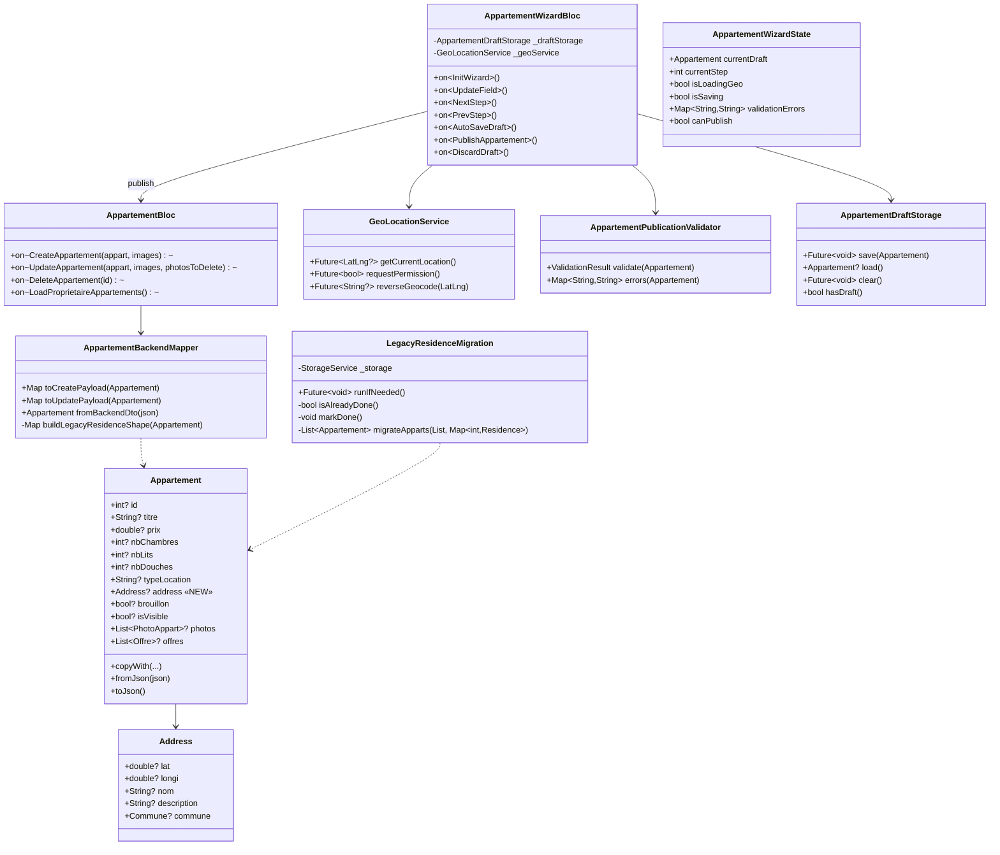
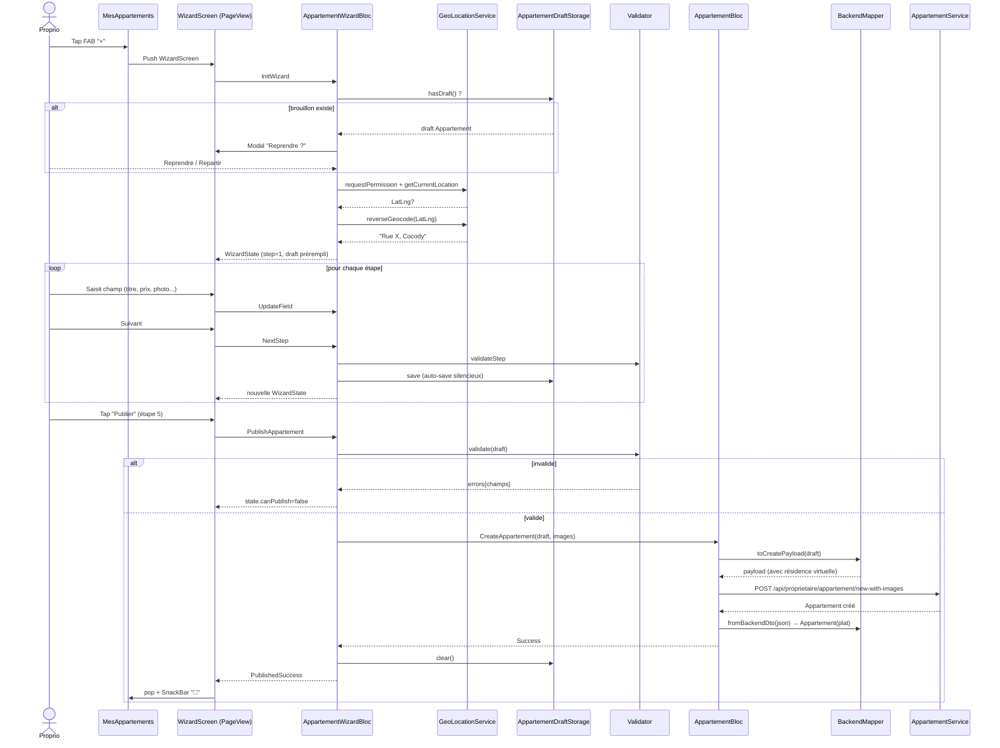
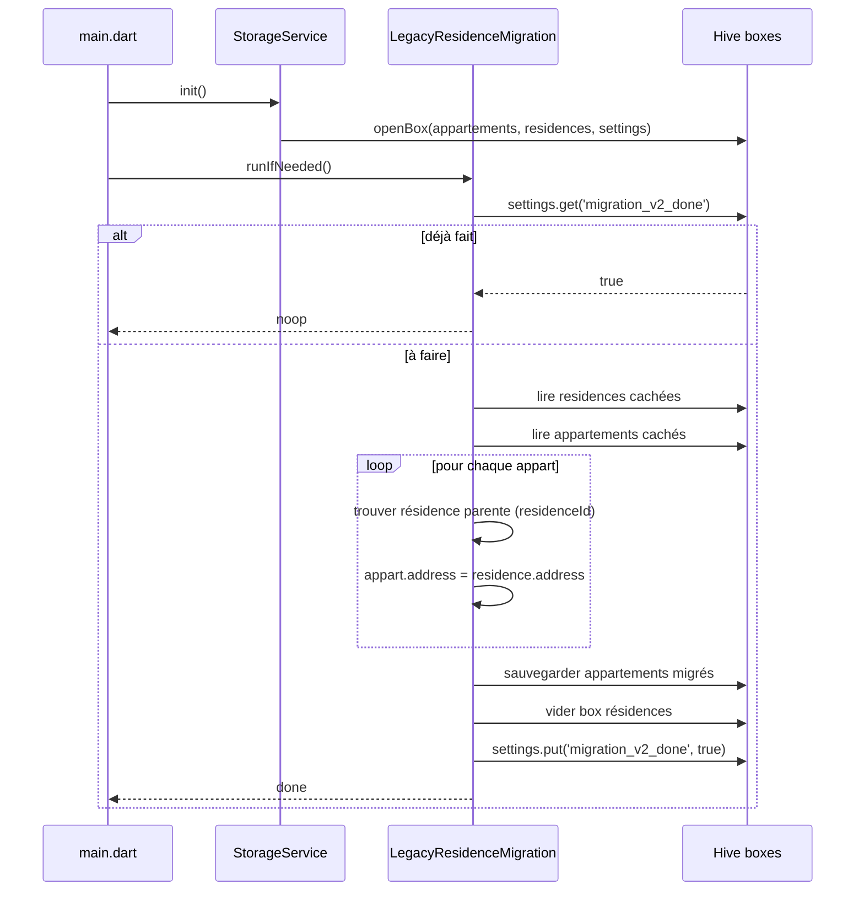

# 🏗️ Architecture — Refonte Enregistrement Appartement

**Feature** : `refonte-enregistrement-appartement`
**Date** : 2026-05-03
**Auteur** : Agent Architecture
**Mode** : Projet existant (Flutter + BLoC + Hive + Spring Boot local)
**Statut** : En attente de validation utilisateur

---

## 1. Vue d'ensemble

### 1.1 Objectif

Aplatir le modèle Résidence → Appartement en un modèle plat où l'`Appartement` porte directement son `Address`, et fournir un **wizard guidé style Airbnb** pour la création/édition côté propriétaire — tout en restant **compatible avec le backend Spring Boot non encore migré**.

### 1.2 Principes directeurs

| Principe | Application |
|---|---|
| **Suppression totale** | La classe `Residence` est **supprimée du code** (modèle, blocs, repos, services, widgets, écrans). Aucun fichier `.dart` n'importe plus `Residence` après refonte |
| **Une seule porte vers l'extérieur** | La compatibilité backend (qui attend encore `{residence: {…address…}}`) est gérée **uniquement** dans `AppartementBackendMapper`, en manipulant des `Map<String, dynamic>` bruts — pas de classe Dart `Residence` |
| **Migration idempotente** | Migration Hive au démarrage : lit le cache résidences en **JSON brut**, transfère l'address dans les apparts, puis vide la box. Marquée terminée via flag |
| **SOLID nouveau code** | Wizard, Validator, Mapper, GeoService = nouvelles classes, SRP strict |
| **Réutilisation max** | `LocationPicker`, `ImageUploader`, sections form existantes réutilisées dans le wizard |

### 1.3 Composants impactés

| Composant | Action |
|---|---|
| `Appartement` (modèle) | **Modifié** : ajout `Address? address` ; **suppression** de `residenceId` et `residence` |
| `Residence` (modèle) | **SUPPRIMÉ** complètement (`lib/model/residence/residence.dart`) |
| `ResidenceBloc` + `ResidenceRepository` + `ResidenceService` | **Supprimés** intégralement |
| `AppartementBloc` | **Modifié** : `CreateAppartement`/`UpdateAppartement` portent maintenant l'adresse ; aucune référence Residence |
| `AppartementWizardBloc` (NEW) | Gestion d'état du wizard multi-étapes + auto-save brouillon |
| `AppartementBackendMapper` (NEW) | Couche d'adaptation `Appartement(plat) ↔ payload backend` — manipule des `Map<String, dynamic>` bruts (jamais d'objet `Residence`) |
| `LegacyResidenceMigration` (NEW) | Migration Hive one-shot — lit JSON brut de la box résidences, transfère l'address |
| `GeoLocationService` (NEW) | Wrapper geolocator + permission + reverse geocoding |
| `AppartementPublicationValidator` (NEW) | Règles "peut-on publier ?" testables |
| `AppartementDraftStorage` (NEW) | Persistance Hive du brouillon courant |
| Écrans `mes_residences`, `add_residence_screen`, `residence_detail_screen` | **Supprimés** |
| Écran `add_appartement.dart` (468 l.) | **Remplacé** par `appartement_wizard_screen.dart` + 5 étapes |
| `proprio_navigation.dart` | **Modifié** : retrait onglet/route Résidences + retrait BlocProvider |
| `main.dart` | **Modifié** : retrait `ResidenceBloc` + 2 BlocListener sync, ajout migration au démarrage |
| `map_explore_screen.dart` (locataire) | **Modifié** : groupement par résidence → liste plate |
| `appart_item.dart`, `appart_titre_info.dart`, `appart_tile_item.dart` | **Modifiés** : ré-active l'affichage adresse via `appart.address` |
| `comptabilite/widget/residence_selector.dart` | **Renommé** + adapté : `address_filter_selector.dart` alimenté par adresses uniques dérivées des appartements |
| `charge_repository.dart` | **Modifié** : `setResidences(List<Residence>)` → `setAppartements(List<Appartement>)`, plus aucun import Residence |

---

## 2. Diagramme de Classes



---

## 3. Diagramme de Séquence — Création d'un appartement



---

## 4. Diagramme de Séquence — Migration au démarrage



---

## 5. Structure des Fichiers

```
lib/
├── model/residence/appart.dart                           [MODIFIÉ : +Address? address ; -residenceId ; -residence]
├── model/residence/residence.dart                        [SUPPRIMÉ]
│
├── bloc/
│   ├── appartement_bloc/                                 [MODIFIÉ : retrait sync residence]
│   │   ├── appartement_bloc.dart                         [MODIFIÉ]
│   │   ├── appartement_event.dart                        [MODIFIÉ : retrait SyncFromResidence]
│   │   └── appartement_state.dart
│   │
│   ├── appartement_wizard_bloc/                          [NEW]
│   │   ├── appartement_wizard_bloc.dart                  [NEW]
│   │   ├── appartement_wizard_event.dart                 [NEW]
│   │   └── appartement_wizard_state.dart                 [NEW]
│   │
│   └── residence_bloc/                                   [SUPPRIMÉ]
│
├── service/
│   ├── repository/
│   │   ├── appartement_repository.dart                   [MODIFIÉ : utilise BackendMapper]
│   │   └── residence_repository.dart                     [SUPPRIMÉ]
│   │
│   ├── model/appartement/
│   │   ├── appartement_service.dart                      [MODIFIÉ : prend payload mappé]
│   │   └── appartement_backend_mapper.dart               [NEW]
│   │
│   ├── residence/residence_service.dart                  [SUPPRIMÉ]
│   │
│   ├── geo/
│   │   └── geo_location_service.dart                     [NEW]
│   │
│   ├── storage/
│   │   ├── storage_service.dart                          [MODIFIÉ : +draft box]
│   │   └── appartement_draft_storage.dart                [NEW]
│   │
│   ├── migration/
│   │   └── legacy_residence_migration.dart               [NEW]
│   │
│   └── preload/executors/residence_preload_executor.dart [SUPPRIMÉ]
│
├── util/
│   ├── appartement_publication_validator.dart            [NEW]
│   └── appartement_mapper_util.dart                      [MODIFIÉ : retire locationDataToAddress côté résidence]
│
├── screen/client/proprio/
│   ├── appartements/
│   │   ├── mes_appartements.dart                         [MODIFIÉ : FAB → WizardScreen]
│   │   ├── add_appartement.dart                          [SUPPRIMÉ]
│   │   ├── proprio_appart_detail_screen.dart            [MODIFIÉ : édition → WizardScreen]
│   │   └── wizard/
│   │       ├── appartement_wizard_screen.dart            [NEW]
│   │       └── steps/
│   │           ├── step_1_address.dart                   [NEW]
│   │           ├── step_2_basics.dart                    [NEW]
│   │           ├── step_3_capacity.dart                  [NEW]
│   │           ├── step_4_media_amenities.dart           [NEW]
│   │           └── step_5_pricing_review.dart            [NEW]
│   │
│   ├── residences/                                        [SUPPRIMÉ — dossier complet]
│   │
│   ├── proprio_navigation.dart                            [MODIFIÉ : retrait route résidences]
│   │
│   └── comptabilite/
│       ├── comptabilite_screen.dart                       [MODIFIÉ : injection apparts au lieu de résidences]
│       ├── charge_form_screen.dart                        [MODIFIÉ]
│       └── widget/residence_selector.dart                 [MODIFIÉ : adapté → "filtre par adresse"]
│
├── screen/client/locataire/
│   ├── home/widget/appart_item.dart                       [MODIFIÉ : ré-active adresse via appart.address]
│   ├── home/widget/explore_appartements_list.dart         [MODIFIÉ si besoin]
│   └── map/map_explore_screen.dart                        [MODIFIÉ : retrait regroupement résidence]
│
├── widget/
│   ├── residence/                                         [SUPPRIMÉ — dossier complet]
│   ├── card/residence_card.dart                           [SUPPRIMÉ]
│   ├── form/appartement/
│   │   ├── property_type_section.dart                     [RÉUTILISÉ dans step 2]
│   │   ├── rooms_section.dart                             [RÉUTILISÉ dans step 3]
│   │   ├── amenities_section.dart                         [RÉUTILISÉ dans step 4]
│   │   ├── pricing_section.dart                           [RÉUTILISÉ dans step 5]
│   │   ├── images_section.dart                            [RÉUTILISÉ dans step 4]
│   │   ├── discounts_section.dart                         [RÉUTILISÉ dans step 5]
│   │   └── location_section.dart                          [SUPPRIMÉ — remplacé par step_1_address]
│   ├── form/location_picker.dart                          [RÉUTILISÉ dans step 1]
│   ├── form/image_uploader.dart                           [RÉUTILISÉ]
│   └── wizard/                                            [NEW]
│       ├── wizard_progress_bar.dart                       [NEW]
│       ├── wizard_step_scaffold.dart                      [NEW]
│       └── wizard_navigation_bar.dart                     [NEW]
│
├── repository/
│   ├── proprio_repository.dart                            [MODIFIÉ : drop résidence, ne garde que apparts]
│   └── charge_repository.dart                             [MODIFIÉ : setApparts au lieu de setResidences]
│
└── main.dart                                              [MODIFIÉ : retrait ResidenceBloc + appel migration]
```

---

## 6. Interfaces / Contrats

### 6.1 Modèle Appartement modifié

```dart
class Appartement {
  // … champs existants conservés …
  Address? address;                    // ← NEW : adresse directe

  // ❌ SUPPRIMÉS : plus aucune référence à Residence dans le code applicatif
  //   - int? residenceId         ← retiré
  //   - Residence? residence      ← retiré
  // Le pont avec le backend (qui attend encore residence/residenceId)
  // est isolé dans AppartementBackendMapper, manipulant des Map<String, dynamic>.

  // copyWith / fromJson / toJson MODIFIÉS pour inclure address et exclure residence/residenceId
}
```

### 6.2 AppartementBackendMapper

```dart
/// Couche d'adaptation TEMPORAIRE entre le modèle plat de l'app et le backend
/// Spring Boot qui attend encore une "residence" englobante.
///
/// ⚠️ AUCUNE classe Residence n'est utilisée — uniquement des Map<String, dynamic>
/// pour préserver l'isolation du legacy.
///
/// TODO: BACKEND-FLAT-APPART
/// Quand le backend acceptera `appartement.address` directement,
/// supprimer toutes les méthodes _build*ResidenceShape et _extractAddressFromLegacy.
class AppartementBackendMapper {
  /// À l'envoi (création) : produit le payload backend.
  /// Embarque une "shape résidence" autour de l'address.
  Map<String, dynamic> toCreatePayload(Appartement appart) {
    final payload = appart.toJson();
    payload.remove('address'); // backend ne connaît pas encore ce champ
    payload['residence'] = _buildLegacyResidenceShape(appart, withId: false);
    return payload;
  }

  /// À l'envoi (update) : préserve l'ID de la résidence existante côté backend.
  Map<String, dynamic> toUpdatePayload(Appartement appart, {int? backendResidenceId}) {
    final payload = appart.toJson();
    payload.remove('address');
    payload['residence'] = _buildLegacyResidenceShape(
      appart,
      withId: true,
      existingId: backendResidenceId,
    );
    if (backendResidenceId != null) payload['residenceId'] = backendResidenceId;
    return payload;
  }

  /// À la réception : fusionne `json['residence']['address']` dans `appart.address`.
  /// L'appart résultant n'a aucune référence à Residence.
  Appartement fromBackendDto(Map<String, dynamic> json) {
    final addressMap = _extractAddressFromLegacy(json);
    json.remove('residence');
    json.remove('residenceId');
    final appart = Appartement.fromJson(json);
    if (appart.address == null && addressMap != null) {
      appart.address = Address.fromJson(addressMap);
    }
    return appart;
  }

  // === Helpers privés (à supprimer le jour J) ===

  Map<String, dynamic> _buildLegacyResidenceShape(
    Appartement appart, {
    required bool withId,
    int? existingId,
  }) {
    return {
      if (withId) 'id': existingId,
      'nom': _autoName(appart),
      if (appart.address != null) 'address': appart.address!.toJson(),
    };
  }

  Map<String, dynamic>? _extractAddressFromLegacy(Map<String, dynamic> json) {
    final res = json['residence'];
    if (res is Map && res['address'] is Map) {
      return Map<String, dynamic>.from(res['address']);
    }
    return null;
  }

  String _autoName(Appartement a) {
    final loc = a.address?.commune?.nom ?? a.address?.nom ?? 'Bien';
    return (a.titre?.trim().isNotEmpty ?? false) ? '${a.titre} — $loc' : loc;
  }
}
```

> **Remarque sur l'update** : pour préserver l'ID de la résidence côté backend lors d'un update, le repository conserve cet ID dans une map locale `Map<int appartId, int backendResidenceId>` (cache mémoire), récupérée lors du fromBackendDto. Cela évite que `Appartement` ne porte ce détail.

### 6.3 AppartementWizardBloc

```dart
// Events
abstract class AppartementWizardEvent {}
class InitWizard extends AppartementWizardEvent { final Appartement? editing; }
class UpdateField extends AppartementWizardEvent { final String field; final dynamic value; }
class NextStep extends AppartementWizardEvent {}
class PrevStep extends AppartementWizardEvent {}
class GoToStep extends AppartementWizardEvent { final int step; }
class TriggerAutoSave extends AppartementWizardEvent {}
class PublishAppartement extends AppartementWizardEvent {}
class DiscardDraft extends AppartementWizardEvent {}
class ResumeDraftDecision extends AppartementWizardEvent { final bool resume; }

// State
class AppartementWizardState {
  final Appartement draft;
  final int currentStep;          // 1..5
  final int totalSteps;
  final bool isLoadingGeo;
  final bool isSaving;
  final bool isPublishing;
  final Map<String, String> validationErrors;
  final bool canPublish;
  final bool hasResumableDraft;
  final String? errorMessage;
  // copyWith…
}
```

### 6.4 AppartementPublicationValidator

```dart
class ValidationResult {
  final bool isValid;
  final Map<String, String> errors; // ex: {"photos": "3 photos minimum requises"}
}

class AppartementPublicationValidator {
  ValidationResult validate(Appartement a) { /* règles R4, R2, photos≥3, prix>0… */ }

  // Validation par étape pour le wizard
  bool isStep1Complete(Appartement a) => a.address?.lat != null && a.address?.longi != null;
  bool isStep2Complete(Appartement a) => (a.titre?.trim().isNotEmpty ?? false) && a.typeLocation != null;
  bool isStep3Complete(Appartement a) => a.nbChambres != null && a.nbLits != null && a.nbDouches != null;
  bool isStep4Complete(Appartement a) => (a.photos?.length ?? 0) >= 3;
  bool isStep5Complete(Appartement a) => a.prix != null && a.prix! > 0;
}
```

### 6.5 GeoLocationService

```dart
class GeoLocationService {
  static final instance = GeoLocationService._();

  Future<bool> hasPermission();
  Future<bool> requestPermission();
  Future<LatLng?> getCurrentLocation({Duration timeout = const Duration(seconds: 8)});
  Future<String?> reverseGeocode(LatLng position);
}
```

> Utilise `geolocator: ^14.0.1` (déjà au pubspec) et le `GeocodingService` existant pour le reverse.

### 6.6 AppartementDraftStorage

```dart
class AppartementDraftStorage {
  static const _boxKey = 'appartement_draft';
  static const _slotKey = 'current'; // un seul brouillon à la fois

  Future<void> save(Appartement draft);
  Appartement? load();
  bool hasDraft();
  Future<void> clear();
}
```

### 6.7 LegacyResidenceMigration

```dart
class LegacyResidenceMigration {
  static const _flagKey = 'migration_v2_appart_address_done';

  Future<void> runIfNeeded(); // appelé dans main() après StorageService.init()

  // Idempotent : si flag présent → noop. Sinon migre + pose le flag.
}
```

### 6.8 Adapter Comptabilité (couche minimale)

```dart
// Dans charge_repository.dart : remplace setResidences(List<Residence>) par :
void setAppartements(List<Appartement> apparts) {
  _apparts = apparts;
  // Dérive des "groupes par adresse" si la comptabilité en a besoin pour ses filtres existants.
}

// Le widget `comptabilite/widget/residence_selector.dart` est renommé en
// `address_filter_selector.dart` qui prend une liste d'apparts et propose
// les adresses uniques comme filtres. UX existante préservée, sémantique flat.
```

---

## 7. Stratégie de Migration Hive — détaillée

### 7.1 Pré-condition
- `StorageService.instance.init()` doit avoir ouvert :
  - box `proprio_appartements` (existante)
  - box `proprio_residences` (existante, à vider après migration)
  - box `app_settings` (créée si pas existante, pour stocker le flag)

### 7.2 Algorithme

> ⚠️ La classe `Residence` n'existant plus dans le code, la migration manipule
> les anciennes données en **JSON brut** (Map<String, dynamic>) directement
> depuis Hive — pas d'instanciation d'objets Dart Residence.

```
1. Lire flag `migration_v2_appart_address_done` dans box `app_settings`
   → si true : return (idempotence)

2. Lire residences en cache (JSON brut) → Map<int residenceId, Map<String,dynamic>>
3. Lire appartements en cache (JSON brut ou objets) → List<Appartement>

4. Pour chaque appart :
   - si appart.address déjà non-null → laisser tel quel (ne pas écraser)
   - sinon si l'ancien JSON appart contient `residenceId` && residenceMap[id] existe :
        appart.address = Address.fromJson(residenceMap[id]['address'])
   - sinon : appart.address = null (orphelin → flag UI "Adresse manquante")

5. Sauvegarder la liste d'appartements migrés
6. Vider la box résidences
7. Poser le flag `migration_v2_appart_address_done = true`
```

### 7.3 Garanties
- **Idempotence** : flag empêche le re-run. Réinstaller l'app remettra à zéro le cache (rien à migrer).
- **Pas de perte** : aucun appart n'est supprimé. Si pas de résidence parente trouvable, l'adresse reste null (indicateur visuel "Adresse manquante" dans la liste).
- **Pas de blocage** : la migration tourne en milliseconds, mais elle est `await` dans `main()` avant `runApp()`.

### 7.4 Rollback
La box `proprio_residences` est vidée mais **pas son schéma**. En cas de rollback applicatif, un nouveau `getProprietaireResidences` API replira la box. Le flag est isolé dans `app_settings`.

---

## 8. Wizard UI — Architecture

### 8.1 Pourquoi un seul écran avec PageView (et non N routes)

| Critère | PageView | N Routes |
|---|---|---|
| État partagé entre étapes | Trivial (Bloc unique) | Plus complexe (passage en arguments) |
| Animation transition | Native, fluide | Push/pop visible, moins fluide |
| Navigation arrière | Contrôlée par Bloc | Stack OS (peut sortir du wizard) |
| Auto-save | Une listener point | Multiple |

✅ **Choix : PageView** dans un `AppartementWizardScreen` unique.

### 8.2 Structure visuelle

```
┌─────────────────────────────────────────┐
│  AppBar                                 │  ← titre dynamique selon étape
│  [< Retour]    "Étape 2/5"    [Quitter] │
├─────────────────────────────────────────┤
│  WizardProgressBar (5 segments remplis) │
├─────────────────────────────────────────┤
│                                         │
│        Contenu Step (PageView)          │  ← step_1_address.dart … step_5
│                                         │
│                                         │
├─────────────────────────────────────────┤
│  WizardNavigationBar                    │
│  [Précédent]                [Suivant ▶] │  ← "Publier" sur step 5
└─────────────────────────────────────────┘
```

### 8.3 Auto-save trigger
- Après chaque `UpdateField` → debounce 500 ms → `TriggerAutoSave` → `Draft.save(state.draft)`
- À chaque `NextStep` → `TriggerAutoSave` immédiat
- À `pop()` du wizard → si non publié → garder draft
- À `PublishAppartement` succès → `Draft.clear()`

### 8.4 Reprise de brouillon
- À l'ouverture (`InitWizard` sans `editing`) :
  - Si `Draft.hasDraft()` → state.hasResumableDraft = true → `WizardScreen` affiche un dialogue
  - User : `Reprendre` → `ResumeDraftDecision(true)` → state.draft = Draft.load()
  - User : `Repartir` → `ResumeDraftDecision(false)` → state.draft = Appartement vide ; Draft.clear()

### 8.5 Édition d'appartement existant
- `WizardScreen.edit(appart)` → `InitWizard(editing: appart)` → state.draft = appart
- Mode édition : pas de proposition de reprendre brouillon (priorité à l'objet édité)
- Bouton final = "Enregistrer les modifications" (au lieu de "Publier")

---

## 9. CONTRAT D'IMPLÉMENTATION

> Ce contrat est **la loi** pour l'agent Dev. Aucun item ne peut être ignoré, remplacé ou ajouté sans révision de l'architecture.

### Modèles
- [ ] **Modifier** `lib/model/residence/appart.dart`
  - Ajouter `Address? address` aux champs, constructeur, `fromJson`, `toJson`, `copyWith`
  - **Supprimer** les champs `int? residenceId` et `Residence? residence` (et leur sérialisation)
  - **Supprimer** l'import `package:asfar/model/residence/residence.dart`
- [ ] **Supprimer** `lib/model/residence/residence.dart`
- [ ] **Vérifier** : aucun fichier `.dart` restant n'importe `package:asfar/model/residence/residence.dart` (commande de contrôle obligatoire après refonte)

### Services nouveaux
- [ ] **Créer** `lib/service/model/appartement/appartement_backend_mapper.dart`
- [ ] **Créer** `lib/service/geo/geo_location_service.dart`
- [ ] **Créer** `lib/service/storage/appartement_draft_storage.dart`
- [ ] **Créer** `lib/service/migration/legacy_residence_migration.dart`
- [ ] **Créer** `lib/util/appartement_publication_validator.dart`

### BLoC
- [ ] **Créer** `lib/bloc/appartement_wizard_bloc/appartement_wizard_bloc.dart`
- [ ] **Créer** `lib/bloc/appartement_wizard_bloc/appartement_wizard_event.dart`
- [ ] **Créer** `lib/bloc/appartement_wizard_bloc/appartement_wizard_state.dart`
- [ ] **Modifier** `lib/bloc/appartement_bloc/appartement_bloc.dart`
  - Utiliser `AppartementBackendMapper` lors des CRUD
  - Retirer `SyncFromResidence` event handler
- [ ] **Modifier** `lib/bloc/appartement_bloc/appartement_event.dart`
  - Retirer `SyncFromResidence`
- [ ] **Supprimer** dossier `lib/bloc/residence_bloc/`

### Repositories / Services API
- [ ] **Modifier** `lib/service/repository/appartement_repository.dart`
  - Drop l'enrichissement via `_residenceRepository`
  - Délègue mapping via `AppartementBackendMapper`
- [ ] **Modifier** `lib/service/model/appartement/appartement_service.dart`
  - Ne touche plus directement à `Residence` ; consomme/produit JSON via mapper
- [ ] **Supprimer** `lib/service/repository/residence_repository.dart`
- [ ] **Supprimer** `lib/service/residence/residence_service.dart`
- [ ] **Supprimer** `lib/service/preload/executors/residence_preload_executor.dart`
- [ ] **Modifier** `lib/service/preload/preload_coordinator_builder.dart`
  - Retirer l'executor résidence

### Stockage
- [ ] **Modifier** `lib/service/storage/storage_service.dart`
  - Ajouter ouverture box `appartement_draft`
  - Ajouter ouverture box `app_settings` (pour le flag migration)

### Écrans propriétaire — Wizard
- [ ] **Créer** `lib/screen/client/proprio/appartements/wizard/appartement_wizard_screen.dart`
- [ ] **Créer** `lib/screen/client/proprio/appartements/wizard/steps/step_1_address.dart`
- [ ] **Créer** `lib/screen/client/proprio/appartements/wizard/steps/step_2_basics.dart`
- [ ] **Créer** `lib/screen/client/proprio/appartements/wizard/steps/step_3_capacity.dart`
- [ ] **Créer** `lib/screen/client/proprio/appartements/wizard/steps/step_4_media_amenities.dart`
- [ ] **Créer** `lib/screen/client/proprio/appartements/wizard/steps/step_5_pricing_review.dart`
- [ ] **Créer** `lib/widget/wizard/wizard_progress_bar.dart`
- [ ] **Créer** `lib/widget/wizard/wizard_step_scaffold.dart`
- [ ] **Créer** `lib/widget/wizard/wizard_navigation_bar.dart`

### Écrans propriétaire — modifications
- [ ] **Modifier** `lib/screen/client/proprio/appartements/mes_appartements.dart`
  - FAB "+" → push `AppartementWizardScreen()`
  - Indicateur visuel "Adresse manquante" pour apparts orphelins post-migration
- [ ] **Modifier** `lib/screen/client/proprio/appartements/proprio_appart_detail_screen.dart`
  - Bouton "Éditer" → push `AppartementWizardScreen.edit(appart)`
- [ ] **Supprimer** `lib/screen/client/proprio/appartements/add_appartement.dart`
- [ ] **Supprimer** dossier `lib/screen/client/proprio/residences/` (3 fichiers)
- [ ] **Modifier** `lib/screen/client/proprio/proprio_navigation.dart`
  - Retirer onglet/route Résidences
  - Retirer providers/listeners ResidenceBloc

### Écrans locataire — modifications
- [ ] **Modifier** `lib/screen/client/locataire/map/map_explore_screen.dart`
  - Supprimer regroupement par résidence
  - Utiliser `appart.address` directement
- [ ] **Modifier** `lib/screen/client/locataire/home/widget/appart_item.dart`
  - Réactiver `AppartLocalisation(address: appart.address)`
- [ ] **Modifier** `lib/widget/item/appart/appart_titre_info.dart`
  - Réactiver l'adresse via `appart.address`
- [ ] **Modifier** `lib/widget/item/appart/appart_tile_item.dart`
  - Idem
- [ ] **Modifier** `lib/widget/map/appart_map_section.dart`
  - Lire `appartement.address` au lieu de `appartement.residence?.address`
- [ ] **Modifier** `lib/screen/client/demarcheur/home/demarcheur_home.dart`
  - Lire `appart.address?.commune` au lieu de `appart.residence?.address?.commune`

### Comptabilité — adaptation
- [ ] **Modifier** `lib/repository/charge_repository.dart`
  - Remplacer `setResidences(List<Residence>)` par `setAppartements(List<Appartement>)`
  - Adapter les filtres internes pour grouper par adresse
- [ ] **Modifier** `lib/bloc/charge_bloc/charge_bloc.dart`
  - Aligner avec la nouvelle API du repository
- [ ] **Modifier** `lib/screen/client/proprio/comptabilite/comptabilite_screen.dart`
  - Injecter `AppartementBloc.state.appartements` au lieu de `ResidenceBloc.state.residences`
- [ ] **Modifier** `lib/screen/client/proprio/comptabilite/charge_form_screen.dart`
- [ ] **Modifier** `lib/screen/client/proprio/comptabilite/widget/residence_selector.dart`
  - Renommer en `address_filter_selector.dart`
  - Liste = adresses uniques dérivées de la liste des apparts

### Repository legacy
- [ ] **Évaluer puis supprimer** `lib/repository/proprio_repository.dart`
  - Inventaire des usages restants : si plus aucun, **supprimer le fichier**
  - Sinon, retirer toutes les méthodes/imports résidence et garder un repo strict appartements

### Garde-fous (post-refonte, à vérifier dans la phase audit)
- [ ] `grep -r "import.*model/residence/residence.dart" lib/` → **0 résultat**
- [ ] `grep -rwn "Residence " lib/` → **0 résultat** (à part dans les commentaires explicatifs du mapper)
- [ ] `grep -r "residenceId\|appart.residence" lib/` → **0 résultat** (sauf à l'intérieur d'`appartement_backend_mapper.dart` et `legacy_residence_migration.dart`)
- [ ] Aucun import/référence `ResidenceBloc`, `ResidenceRepository`, `ResidenceService`

### Widgets supprimés
- [ ] **Supprimer** dossier `lib/widget/residence/` (4 fichiers)
- [ ] **Supprimer** `lib/widget/card/residence_card.dart`
- [ ] **Supprimer** `lib/widget/form/appartement/location_section.dart`

### main.dart
- [ ] **Modifier** `lib/main.dart`
  - Retirer `BlocProvider(create: (_) => ResidenceBloc())` et imports résidence
  - Retirer les 2 BlocListener de sync ResidenceBloc ↔ AppartementBloc
  - Retirer `context.read<ResidenceBloc>().add(ResetResidenceState())` dans `_clearPrivateData`
  - Ajouter `await LegacyResidenceMigration().runIfNeeded()` après `StorageService.instance.init()`

### Tests (minimums)
- [ ] `test/util/appartement_publication_validator_test.dart` — table-driven sur les règles
- [ ] `test/service/migration/legacy_residence_migration_test.dart` — idempotence + fusion address
- [ ] `test/service/model/appartement/appartement_backend_mapper_test.dart` — round-trip create/update + fromBackendDto
- [ ] `test/bloc/appartement_wizard_bloc_test.dart` — flux complet 5 étapes + draft

### Documentation
- [ ] **Créer** TODO marqueur dans `appartement_backend_mapper.dart` : `// TODO BACKEND-FLAT-APPART : à supprimer quand le backend Spring sera migré`
- [ ] **Mettre à jour** `README.md` : section migration v2 (court paragraphe)

---

## 10. Risques & Points d'attention

| # | Risque | Mitigation |
|---|---|---|
| R1 | Backend rejette les appartements sans `residenceId` lors de l'update | `AppartementBackendMapper` ré-injecte la "shape résidence" + ID dans le payload (récupéré depuis cache mémoire `Map<int appartId, int backendResidenceId>`) sans qu'aucune classe Dart `Residence` n'existe |
| R2 | Apparts orphelins post-migration (pas de résidence parente) | Address null → flag visuel "Adresse manquante" dans `mes_appartements`, édition forcée à l'étape 1 |
| R3 | 116 fichiers référencent `residence` | Beaucoup sont des références passives à `residenceId` (gardé). Seuls ~25 fichiers nécessitent une modif active (listés au §9) |
| R4 | Comptabilité tightly coupled à Residence | Adapter via dérivation depuis adresses des apparts ; renommage `residence_selector` → `address_filter_selector` |
| R5 | UX wizard trop long sur petits écrans | Step scaffold avec scroll interne ; stepper visuel compact en AppBar |
| R6 | Permission GPS refusée → bloque le flux | Fallback automatique en saisie manuelle map (déjà le pattern actuel) |
| R7 | Auto-save écrase un brouillon de qualité par un draft incomplet | Un seul slot de brouillon (V1) ; à la reprise, dialogue clair pour valider |
| R8 | Demarcheur side `demarcheur_home.dart` accède à `appart.residence?.address?.commune` | Migré vers `appart.address?.commune` (R3 du §9) |

---

## 11. Hors scope (rappel)

- 🚫 Modification serveur Spring Boot (TODO documenté `BACKEND-FLAT-APPART`)
- 🚫 Refonte complète du module Comptabilité (adapter minimal uniquement)
- 🚫 Multi-brouillon (un seul slot V1)
- 🚫 Auto-complétion d'adresse Google Places (option 7C écartée)
- 🚫 Refactor SOLID du code existant non touché par cette feature

---

## UI_REQUIRED: true

Wizard 5 étapes + composants `wizard_progress_bar`, `wizard_step_scaffold`, `wizard_navigation_bar` à concevoir. L'agent UI/UX doit proposer 2-3 variantes de wizard (densité d'info, transitions, visuel des steps, position des CTA, gestion mobile vs tablette).
