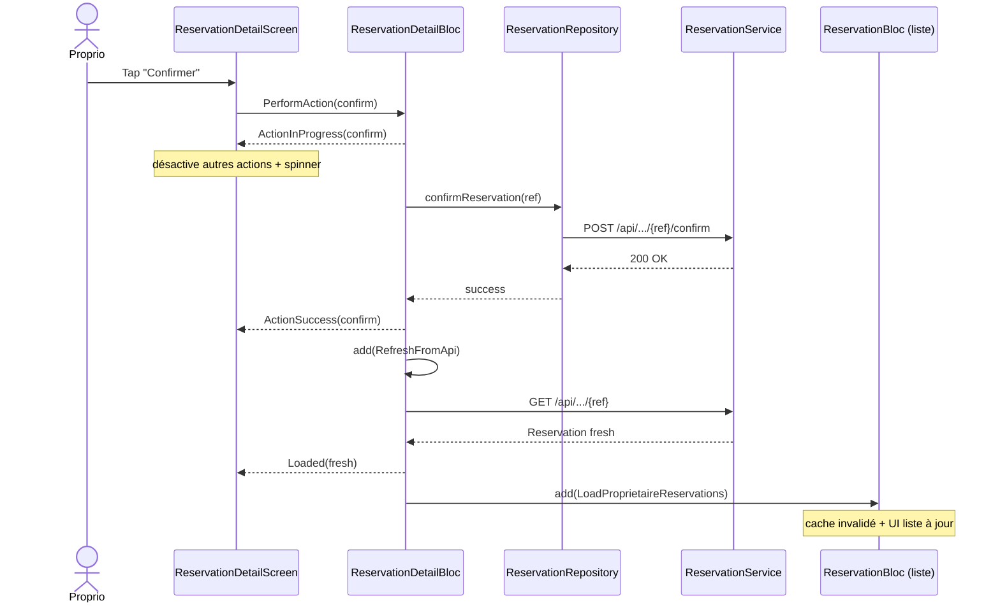
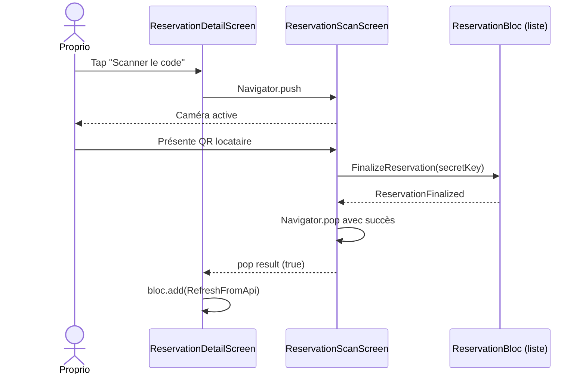

# 🏗️ Architecture : Page Détail Réservation

> **Feature :** `reservation-detail-screen`
> **Date :** 2026-05-12
> **Spec source :** `.ai-outputs/specs/reservation-detail-screen/business-spec.md`
> **Statut :** ⏳ En attente de validation utilisateur

---

## 1. Analyse du Projet

**Environnement détecté :**
- Flutter 3.7+, Dart, 537 fichiers Dart, ~52 000 lignes
- State management : **flutter_bloc 9.1.1** (BLoCs par domaine) + provider
- HTTP : **dio 5.8** ; Cache : **hive 2.2.3** (cache-first systématique)
- QR : **qr_flutter 4.1.0** (rendu) + **mobile_scanner 7.0.0** (scan) — **déjà présents, jamais utilisés**
- Liens externes : **url_launcher 6.3.0** (pattern `tel:` déjà en place dans `partenariat_detail_screen`)

**Conventions observées :**
- Nommage : `snake_case` fichiers / `PascalCase` classes / `camelCase` membres
- Organisation par rôle dans `lib/screen/client/{locataire,proprio,demarcheur}/` ; surfaces partagées dans `lib/screen/client/shared/`
- Pattern « un widget = un fichier », helpers extraits, pas de `_buildXxx()` qui retourne Widget
- BLoC pattern « keep last known data » dans le state pour éviter les flashs UI
- Repository singleton + cache-first Hive avec deux clés séparées (user vs proprio)
- AppBar standardisé `DynamicAppBar` + bouton retour `IconBoutton(Icons.arrow_back_ios_new)`
- Statuts visuels via `BadgeStatus` + `BadgeTone` (success/warn/danger/neutral)

**Points d'intégration :**
- Pattern de référence : `lib/screen/client/shared/partenariats/partenariat_detail_screen.dart` — exactement le même type de feature
- Helper de statut déjà fait : `lib/screen/client/proprio/reservations/widget/reservation_status_display.dart` → **à déplacer dans la zone partagée**
- Service `ReservationService.getByReference()` déjà disponible pour le deep-link

**Standards / Règle 4 :**
- Toutes les librairies utilisées sont des libs officielles Flutter/Pub déjà dans `pubspec.yaml`
- Aucun standard externe (JSON Schema, OpenAPI…) impliqué — pas d'implémentation maison à signaler

---

## 2. Décisions Architecturales (réponses aux 6 questions cadrées)

| # | Question | Décision | Justification |
|---|----------|----------|---------------|
| **D1** | Nouveau BLoC dédié ou consommer `ReservationBloc` ? | **Nouveau `ReservationDetailBloc`** | Le BLoC liste gère un `List<Reservation>` ; le détail a un cycle de vie différent (action-en-cours, QR loading, edit en cours). Séparer = `S` de SOLID + isolation des states. Le détail **notifie** la liste après action mutante. |
| **D2** | Deep-link par référence | **2 modes d'init** : `LoadFromObject(Reservation)` (cache instantané depuis row/card) ou `LoadByReference(String)` (push notif, deep-link via `getByReference`) | Pattern V9.2 chat déjà éprouvé |
| **D3** | Modèle historique | **Reconstruction côté Flutter** à partir des champs existants (`createdAt`, `statut` courant, `motif`, dates séjour) via `ReservationTimelineBuilder` | YAGNI : champs `confirmedAt/paidAt/finalizedAt` pas exposés backend. Demande backend listée mais V1 fonctionne sans. |
| **D4** | Édition résa manuelle | **Nouvel endpoint backend** `PUT /api/user/reservations/owner/manual/{ref}` à demander. Méthode `updateManualReservation` ajoutée au service ; si 404, l'UI affiche un message « Édition à venir ». | Pas de hack annulation+recréation (changerait la référence, casserait l'historique chat) |
| **D5** | Widgets atomiques vs locaux | **0 widget extrait dans `lib/widget/`** (tout existe). Tous les widgets de la feature dans `lib/screen/client/shared/reservations/widget/` | KISS — pas de sur-abstraction prématurée |
| **D6** | Champs timeline backend | **Demande backend formulée** dans `BACKEND_NOTES_RESERVATION_DETAIL.md` mais **non bloquante V1** | Découplage backend/frontend |

---

## 3. Architecture Métier

**Entités / Concepts :**
- **`Reservation`** *(existant, abstract polymorphique)* — donnée centrale
- **`ReservationTimelineEvent`** *(nouveau, UI-only)* — entrée de la timeline (`type: created/confirmed/paid/finalized/refused/cancelled/terminated` + `date` + `motif?`)
- **`ReservationDetailAction`** *(nouveau, enum)* — action exposable (`cancel`, `pay`, `confirm`, `refuse`, `viewQr`, `scanQr`, `edit`, `contact`)

**Règles Métier mappées sur le code :**

| ID Spec | Implémentation |
|---------|----------------|
| RM1 (page unique multi-rôle) | `ReservationDetailScreen` lit `currentUser` via `UserBloc` et adapte les sections affichées |
| RM2 (QR ≥ payée) | `ReservationDetailQrSection` n'est rendu que si `isLocataire && r.statut.index >= payee` |
| RM3 (démarcheur visible proprio) | `ReservationDetailDemarcheurCard` rendu si `isProprio && r is ReservationDemarcheur` |
| RM4 (édition manuelle bloquée ≥ payée) | `ReservationActionsResolver` exclut `edit` si `statut ∈ {payee, finalisee, terminee, refusee, annulee}` |
| RM5 (scanner QR direct proprio) | Action `scanQr` dans la matrice si `isProprio && statut == payee` |
| RM6 (timeline) | `ReservationTimelineBuilder.build(reservation)` |
| RM7 (contacter chat + appel) | `ReservationContactSheet` (bottom sheet 2 choix : Appeler / Discuter) |
| RM8 (matrice actions) | `ReservationActionsResolver.actionsFor(role, statut, type)` |
| RM9 (confidentialité client externe) | `ReservationDetailPartyCard` lit `clientExterneNom` si `r.isManuelle` |
| RM10 (deep-link par référence) | `ReservationDetailEvent.LoadByReference(String)` |

**Relations :**
```
ReservationDetailScreen
   └─ BlocProvider<ReservationDetailBloc>
         └─ ReservationRepository (existant, + 1 méthode getByReference)
               └─ ReservationService (existant, + updateManualReservation)
```

---

## 4. Architecture Fonctionnelle

### 4.1 Modules / Composants

| Module | Responsabilité | Dépendances |
|--------|----------------|-------------|
| **`ReservationDetailBloc`** | Orchestre le cycle de vie d'UNE réservation : load (par objet ou référence), refresh, action en cours, propagation vers `ReservationBloc` liste après mutation | `ReservationRepository`, `ReservationBloc` (notify only) |
| **`ReservationActionsResolver`** | Helper pur : retourne la liste des `ReservationDetailAction` autorisées pour `(role, statut, type)` | aucune |
| **`ReservationTimelineBuilder`** | Helper pur : reconstruit `List<ReservationTimelineEvent>` à partir d'une `Reservation` | aucune |
| **`ReservationContactResolver`** | Helper pur : décide qui contacter (locataire→proprio, proprio→client, démarcheur→proprio) et avec quels canaux (tel + chat) | aucune |
| **`ReservationDetailScreen`** | Composition des sections + AppBar + ActionsBar | tous les widgets locaux |
| **`ReservationScanScreen`** | Scanner QR via `mobile_scanner` → dispatch `FinalizeReservation` | `ReservationBloc` |
| **`ReservationEditManuelleScreen`** | Formulaire édition résa manuelle (dates + clientExterne*) | `ReservationDetailBloc` |
| **`ReservationContactSheet`** | Bottom sheet « Appeler / Discuter » | `url_launcher` + push chat |
| **Widgets de section** *(8)* | Rendu pur de chaque section (header, appart, dates, montants, party, qr, demarcheur, timeline, actions bar) | helpers pré-cités |

### 4.2 Flux de Données

**Cas 1 — Ouverture depuis une ligne (instantané)** :
```
Row.onTap(reservation)
  → Navigator.push(ReservationDetailScreen(reservation))
  → ReservationDetailBloc.add(LoadFromObject(reservation))
  → emit(ReservationDetailLoaded(reservation, isStale: true))
  → bloc.add(RefreshFromApi())          // background
  → service.getByReference(ref)
  → emit(ReservationDetailLoaded(fresh, isStale: false))
```

**Cas 2 — Ouverture par référence (deep-link)** :
```
NotifTap → Navigator.push(ReservationDetailScreen.byReference(ref))
  → ReservationDetailBloc.add(LoadByReference(ref))
  → emit(ReservationDetailLoading())
  → service.getByReference(ref)
  → emit(ReservationDetailLoaded(reservation, isStale: false))
```

**Cas 3 — Action mutante (ex. Confirmer)** :
```
Button.onPressed
  → bloc.add(PerformAction(confirm))
  → emit(ReservationDetailActionInProgress(action))
  → service.confirmReservation(ref)
  → emit(ReservationDetailActionSuccess(action))
  → bloc.add(RefreshFromApi())                    // re-fetch
  → ReservationBloc.add(LoadProprietaireReservations())  // sync liste
```

### 4.3 Diagramme de Classes

```mermaid
classDiagram
    class ReservationDetailBloc {
        +ReservationRepository repository
        +ReservationBloc listBloc
        +onLoadFromObject(Reservation)
        +onLoadByReference(String)
        +onRefreshFromApi()
        +onPerformAction(ReservationDetailAction)
    }

    class ReservationDetailState {
        <<abstract>>
        +Reservation? reservation
        +bool isStale
    }
    ReservationDetailState <|-- ReservationDetailInitial
    ReservationDetailState <|-- ReservationDetailLoading
    ReservationDetailState <|-- ReservationDetailLoaded
    ReservationDetailState <|-- ReservationDetailActionInProgress
    ReservationDetailState <|-- ReservationDetailActionSuccess
    ReservationDetailState <|-- ReservationDetailError

    class ReservationActionsResolver {
        <<helper>>
        +actionsFor(role, statut, type) List~ReservationDetailAction~
    }

    class ReservationTimelineBuilder {
        <<helper>>
        +build(Reservation) List~ReservationTimelineEvent~
    }

    class ReservationTimelineEvent {
        +ReservationTimelineEventType type
        +DateTime? date
        +String? motif
    }

    class ReservationContactResolver {
        <<helper>>
        +targetFor(role, Reservation) ContactTarget
    }

    class ReservationDetailScreen {
        +Reservation? reservation
        +String? reference
    }

    ReservationDetailScreen --> ReservationDetailBloc
    ReservationDetailScreen --> ReservationActionsResolver
    ReservationDetailScreen --> ReservationTimelineBuilder
    ReservationDetailScreen --> ReservationContactResolver
```



### 4.4 Diagramme de Séquence — Action « Confirmer »



### 4.5 Diagramme de Séquence — Scanner QR



---

## 5. Structure des Fichiers

### 5.1 Nouveaux fichiers (24)

```
lib/
├── bloc/
│   └── reservation_detail_bloc/                     ← NOUVEAU dossier
│       ├── reservation_detail_bloc.dart
│       ├── reservation_detail_event.dart
│       └── reservation_detail_state.dart
│
├── model/reservation/
│   ├── reservation_timeline_event.dart              ← NOUVEAU
│   └── reservation_detail_action.dart               ← NOUVEAU (enum)
│
├── util/calc/
│   ├── reservation_actions_resolver.dart            ← NOUVEAU (helper pur)
│   ├── reservation_timeline_builder.dart            ← NOUVEAU (helper pur)
│   └── reservation_contact_resolver.dart            ← NOUVEAU (helper pur)
│
└── screen/client/shared/reservations/               ← NOUVEAU dossier (transverse)
    ├── reservation_detail_screen.dart
    ├── reservation_scan_screen.dart
    ├── reservation_edit_manuelle_screen.dart
    ├── reservation_contact_sheet.dart
    └── widget/
        ├── reservation_detail_header.dart            (référence + badge statut + chip type)
        ├── reservation_detail_appart_card.dart       (logement avec image cliquable)
        ├── reservation_detail_dates_section.dart     (dates + nuits)
        ├── reservation_detail_amounts_section.dart   (prix, frais, avance, reste)
        ├── reservation_detail_party_card.dart        (client/proprio/démarcheur)
        ├── reservation_detail_qr_section.dart        (QR code locataire)
        ├── reservation_detail_demarcheur_card.dart   (nom + commission)
        ├── reservation_detail_timeline.dart          (liste d'events)
        ├── reservation_detail_timeline_row.dart      (une ligne)
        ├── reservation_detail_actions_bar.dart       (bottom bar avec actions)
        ├── reservation_detail_loading_view.dart      (skeleton)
        └── reservation_detail_error_view.dart        (état erreur + retry)
```

### 5.2 Fichiers à modifier (10)

| Fichier | Modification |
|---------|--------------|
| `lib/service/repository/reservation_repository.dart` | + méthode `getByReference(String ref, {Function(Reservation)? onApiData})` cache-aware |
| `lib/service/model/booking/reservation_service.dart` | + méthode `updateManualReservation(ref, req)` (PUT) |
| `lib/screen/client/proprio/reservations/widget/proprio_reservation_row.dart` | `onTap` → push `ReservationDetailScreen(reservation)` |
| `lib/screen/client/proprio/reservations/proprio_reservations_screen.dart` | Wirage du `onTap` |
| `lib/screen/client/proprio/home/dashboard_screen.dart` | onTap sur pending requests → push détail |
| `lib/screen/client/locataire/trips/trips_screen.dart` | onTap sur trip card → push détail |
| `lib/screen/client/demarcheur/referrals/widget/referral_display.dart` | onTap → push détail |
| `lib/screen/client/shared/inbox/widget/reservation_message_card.dart` | onTap → push détail (utilise `byReference` car la card a juste la ref) |
| `lib/screen/client/proprio/reservations/widget/reservation_status_display.dart` | **DÉPLACER** vers `lib/util/calc/reservation_status_display.dart` (devient transverse, plus seulement proprio) |
| `BACKEND_NOTES_RESERVATION_DETAIL.md` *(nouveau à la racine)* | Documenter les besoins backend : `PUT /owner/manual/{ref}` + champs `confirmedAt/paidAt/finalizedAt` |

### 5.3 Ordre d'implémentation

1. **Helpers purs d'abord** (testables sans Flutter, sans dépendances) : `ReservationActionsResolver`, `ReservationTimelineBuilder`, `ReservationContactResolver`, déplacement de `ReservationStatusDisplay`
2. **Modèles UI** : `ReservationTimelineEvent`, `ReservationDetailAction`
3. **Service + Repository** : `getByReference` cache-aware, `updateManualReservation`
4. **BLoC** : `ReservationDetailBloc` + event + state
5. **Widgets de section** (du bas en haut, indépendants) : 12 widgets
6. **Écrans** : `ReservationDetailScreen` (composition), `ReservationContactSheet`, `ReservationScanScreen`, `ReservationEditManuelleScreen`
7. **Intégration** : modifier les 6 points d'entrée pour `Navigator.push`
8. **Note backend** : créer `BACKEND_NOTES_RESERVATION_DETAIL.md`

---

## 6. Contrats / Interfaces clés

### 6.1 `ReservationDetailEvent`
```dart
abstract class ReservationDetailEvent {}
class LoadFromObject extends ReservationDetailEvent {
  final Reservation reservation;
}
class LoadByReference extends ReservationDetailEvent {
  final String reference;
}
class RefreshFromApi extends ReservationDetailEvent {}
class PerformAction extends ReservationDetailEvent {
  final ReservationDetailAction action;
  final Map<String, dynamic>? payload;  // motif, secretKey, edit fields…
}
```

### 6.2 `ReservationDetailState`
```dart
abstract class ReservationDetailState {
  final Reservation? reservation;
  final bool isStale;  // pattern keep last known data
}
class ReservationDetailInitial extends ReservationDetailState {}
class ReservationDetailLoading extends ReservationDetailState {}
class ReservationDetailLoaded extends ReservationDetailState {}
class ReservationDetailActionInProgress extends ReservationDetailState {
  final ReservationDetailAction action;
}
class ReservationDetailActionSuccess extends ReservationDetailState {
  final ReservationDetailAction action;
}
class ReservationDetailError extends ReservationDetailState {
  final String message;
}
```

### 6.3 `ReservationActionsResolver`
```dart
class ReservationActionsResolver {
  ReservationActionsResolver._();

  static List<ReservationDetailAction> actionsFor({
    required UserRole role,    // locataire | proprio | demarcheur
    required Reservation reservation,
  });
}
```

### 6.4 `ReservationTimelineBuilder`
```dart
class ReservationTimelineBuilder {
  ReservationTimelineBuilder._();

  static List<ReservationTimelineEvent> build(Reservation r);
}
```

### 6.5 `ReservationContactResolver`
```dart
class ContactTarget {
  final String displayName;
  final String? telephone;
  final int? userId;  // pour ouvrir chat
}
class ReservationContactResolver {
  static ContactTarget? targetFor(UserRole role, Reservation r);
}
```

### 6.6 `ReservationDetailScreen` API publique
```dart
class ReservationDetailScreen extends StatelessWidget {
  final Reservation? reservation;   // mode 1 : objet en main
  final String? reference;          // mode 2 : deep-link
  const ReservationDetailScreen({super.key, required this.reservation});
  const ReservationDetailScreen.byReference({super.key, required this.reference});
}
```

---

## 7. Demandes Backend (V2, non-bloquantes pour V1)

À créer dans `BACKEND_NOTES_RESERVATION_DETAIL.md` :

1. **`PUT /api/user/reservations/owner/manual/{ref}`** — édition résa manuelle (dates + clientExterne*). Validation : statut ∈ {EN_ATTENTE, CONFIRMER} sinon 409.
2. **Champs timestamp** sur `Reservation` : `confirmedAt`, `paidAt`, `finalizedAt`, `cancelledAt`, `refusedAt` — permettrait une timeline précise au lieu d'une reconstruction. V1 fonctionne sans (estimation = createdAt + statut courant).
3. **Authorization checks** sur `GET /{ref}` : vérifier que le caller est locataire/proprio/démarcheur lié, sinon 403 (déjà fait selon V9.2 mais à reconfirmer côté détail).

---

## CONTRAT D'IMPLÉMENTATION

### Pages / Routes
- [ ] `ReservationDetailScreen` (2 constructeurs : `()` avec objet, `.byReference()` avec String)
- [ ] `ReservationScanScreen` (camera `mobile_scanner` → `FinalizeReservation(secretKey)`)
- [ ] `ReservationEditManuelleScreen` (formulaire dates + clientExterne)
- [ ] `ReservationContactSheet` (bottom sheet 2 actions)

### Composants / Widgets (12)
- [ ] `ReservationDetailHeader`
- [ ] `ReservationDetailAppartCard`
- [ ] `ReservationDetailDatesSection`
- [ ] `ReservationDetailAmountsSection`
- [ ] `ReservationDetailPartyCard`
- [ ] `ReservationDetailQrSection`
- [ ] `ReservationDetailDemarcheurCard`
- [ ] `ReservationDetailTimeline`
- [ ] `ReservationDetailTimelineRow`
- [ ] `ReservationDetailActionsBar`
- [ ] `ReservationDetailLoadingView`
- [ ] `ReservationDetailErrorView`

### Services / Repositories
- [ ] `ReservationRepository.getByReference(ref, {onApiData})` — cache-aware
- [ ] `ReservationService.updateManualReservation(ref, req)` — PUT

### Modèles / Entités
- [ ] `ReservationTimelineEvent` (UI-only, dans `model/reservation/`)
- [ ] `ReservationDetailAction` (enum)

### Helpers
- [ ] `ReservationActionsResolver.actionsFor(role, reservation)`
- [ ] `ReservationTimelineBuilder.build(reservation)`
- [ ] `ReservationContactResolver.targetFor(role, reservation)`
- [ ] **Déplacer** `ReservationStatusDisplay` de `screen/client/proprio/reservations/widget/` vers `util/calc/`

### BLoC
- [ ] `ReservationDetailBloc` + `ReservationDetailEvent` (4 events) + `ReservationDetailState` (6 states)

### Fichiers à modifier (intégration)
- [ ] `proprio_reservation_row.dart` — onTap push
- [ ] `proprio_reservations_screen.dart` — wiring onTap
- [ ] `dashboard_screen.dart` — onTap pending requests
- [ ] `trips_screen.dart` — onTap trip cards
- [ ] `referrals/widget/referral_display.dart` — onTap
- [ ] `reservation_message_card.dart` — onTap byReference
- [ ] **Updater les imports** de `ReservationStatusDisplay` partout (déplacement)

### Documentation
- [ ] `BACKEND_NOTES_RESERVATION_DETAIL.md` — endpoints à demander backend

### Tests minimaux
- [ ] `ReservationActionsResolver` — matrice 3 rôles × 7 statuts × 3 types
- [ ] `ReservationTimelineBuilder` — reconstruction pour chaque statut

---

## UI_REQUIRED: true

La feature est principalement visuelle (page de détail + scan + édition). L'agent UI/UX devra définir l'agencement précis des sections, les espacements, les variantes de cards et la bottom action bar.
