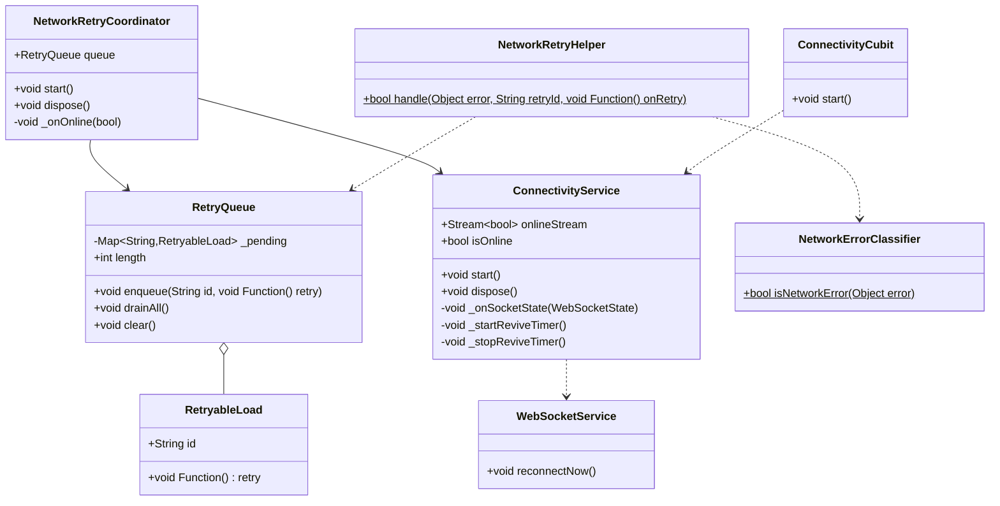
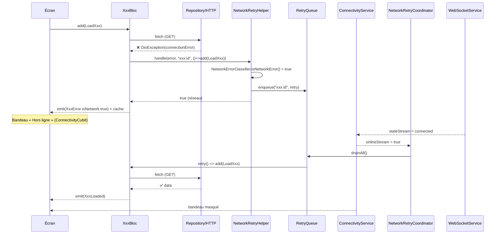

# 🏗️ Architecture — Résilience réseau « file d'attente + rejeu automatique »

> Feature : `resilience-reseau-rejeu-auto`
> Mode : projet existant (Flutter / BLoC / Hive). new_project: false
> Spec source : `business-spec.md`

## 1. Vue d'ensemble

### Objectif
Mécanisme **générique** qui, lorsqu'un chargement de données (GET) échoue **pour cause réseau** :
1. enregistre la demande échouée dans une **file en mémoire** (dédupliquée),
2. affiche le **cache + un bandeau hors-ligne global**,
3. **rejoue automatiquement** toutes les demandes en attente dès que le **socket serveur repasse à `connected`**.

### Principe directeur — 3 responsabilités séparées (SOLID)
| Brique | Responsabilité unique |
|--------|------------------------|
| **Détection** | Savoir si on est online/offline → `ConnectivityService` (dérive du `stateStream` du socket) |
| **Mémorisation** | Stocker/dédupliquer les chargements échoués → `RetryQueue` |
| **Orchestration** | Au retour online, vider la file → `NetworkRetryCoordinator` |

Le pont BLoC↔infra se fait par un **helper pur** (`NetworkRetryHelper`) appelé dans le `catch` des BLoC, qui décide *réseau vs métier* via `NetworkErrorClassifier`.

### Composants impactés
- **Nouveau package** `lib/service/connectivity/` (détection, file, coordinateur, helper)
- **Nouveau** `lib/util/helper/network_error_classifier.dart`
- **Nouveau** `lib/bloc/connectivity_cubit/` (pilote l'UI)
- **Nouveau** `lib/widget/feedback/` (bandeau + overlay global)
- **Modifié** : socket (méthode `reconnectNow`), BLoC de données (flag `isNetwork` + routage catch), `main.dart` (câblage)

---

## 2. Décisions d'architecture clés

### D1 — Le socket comme source de vérité (imposé)
`ConnectivityService` s'abonne à `WebSocketService.instance.stateStream` et mappe :
- `connected` → **online (true)**
- `connecting / reconnecting / disconnected / error` → **offline (false)**

Expose `Stream<bool> onlineStream` (broadcast + distinct) et `bool get isOnline`.

### D2 — Réveil du socket (robustesse) ⚠️ important
Le socket actuel **abandonne après 5 tentatives** (`_maxReconnectAttempts`) puis émet `disconnected` définitif → sans correctif, l'`onlineStream` resterait bloqué sur `false` et le rejeu ne se déclencherait jamais.

**Correctif minimal** : ajouter `WebSocketService.reconnectNow()` (réinitialise `_reconnectAttempts` + `activate()`). `ConnectivityService` lance un **timer léger (~15 s)** tant qu'on est offline qui appelle `reconnectNow()`, et l'arrête dès le retour online. On garde ainsi le socket comme **unique** source de vérité, mais on le maintient « vivant ».

### D3 — Pourquoi l'intégration au niveau BLoC (et pas un simple intercepteur Dio)
Un intercepteur Dio détecte l'échec réseau mais **ne sait pas quel chargement métier rejouer** (quel BLoC / quel event). On capte donc l'échec **là où le contexte existe** : le `catch` de chaque handler de chargement, qui ré-enfile **son propre event** (`() => add(SameEvent())`). Générique via un helper partagé, sans dupliquer la logique.

### D4 — Déduplication (R6)
La file est un `Map<String, RetryableLoad>` clé = `retryId` stable par type de chargement (ex. `appartements:all`, `map:filtered`, `reservations:user`). Ré-enfiler un id déjà présent **écrase** l'entrée → jamais de doublon, toujours le dernier callback à jour.

### D5 — UI overlay global
Le bandeau est injecté une seule fois via `MaterialApp.builder` (widget `AppConnectivityOverlay`) → couvre **tous** les écrans sans modification écran par écran. Piloté par `ConnectivityCubit`.

---

## 3. Diagramme de classes (Mermaid)



## 4. Diagramme de séquence (Mermaid)



---

## 5. Structure des fichiers

```
lib/
├── service/
│   ├── connectivity/                      ← NOUVEAU package
│   │   ├── connectivity_service.dart       (détection online/offline + revive)
│   │   ├── retry_queue.dart                (file mémoire + RetryableLoad)
│   │   ├── network_retry_coordinator.dart  (drain au retour online)
│   │   └── network_retry_helper.dart       (pont catch BLoC → classifier+queue)
│   └── websocket/
│       └── websocket_service.dart          ← MODIFIÉ (+ reconnectNow)
├── util/helper/
│   └── network_error_classifier.dart       ← NOUVEAU (pur, testable)
├── bloc/
│   ├── connectivity_cubit/                 ← NOUVEAU
│   │   ├── connectivity_cubit.dart
│   │   └── connectivity_state.dart
│   ├── appartement_bloc/ (state+bloc)      ← MODIFIÉ (isNetwork + routage)
│   ├── map_bloc/ ...                        ← MODIFIÉ
│   ├── reservation_bloc/ ...               ← MODIFIÉ
│   ├── favorite_bloc/ ...                  ← MODIFIÉ
│   ├── notification_bloc/ ...              ← MODIFIÉ
│   └── conversation_bloc/ ...              ← MODIFIÉ
├── widget/feedback/                        ← NOUVEAU
│   ├── offline_banner.dart                 (bandeau)
│   └── app_connectivity_overlay.dart       (wrapper MaterialApp.builder)
└── main.dart                               ← MODIFIÉ (providers + overlay + start)
```

---

## 6. Interfaces / Contrats clés

```dart
// network_error_classifier.dart — pur, sans dépendance Flutter
class NetworkErrorClassifier {
  /// true si l'erreur est due au RÉSEAU (à rejouer), false si métier (4xx/5xx app).
  static bool isNetworkError(Object error); // DioExceptionType.connection*/timeout + SocketException
}

// retry_queue.dart
class RetryableLoad { final String id; final void Function() retry; }
class RetryQueue {
  void enqueue(String id, void Function() retry); // dédupe par id
  void drainAll();                                 // exécute tout puis vide
  void clear();
  int get length;
}

// connectivity_service.dart — singleton
class ConnectivityService {
  static ConnectivityService get instance;
  Stream<bool> get onlineStream; // broadcast + distinct
  bool get isOnline;
  void start();   // s'abonne au stateStream du socket
  void dispose();
}

// network_retry_coordinator.dart — singleton
class NetworkRetryCoordinator {
  static NetworkRetryCoordinator get instance;
  RetryQueue get queue;
  void start();   // onlineStream==true -> queue.drainAll()
  void dispose();
}

// network_retry_helper.dart
class NetworkRetryHelper {
  /// Si erreur réseau: enqueue(retryId, onRetry) et retourne true.
  /// Sinon retourne false (le BLoC émet une erreur métier classique).
  static bool handle({
    required Object error,
    required String retryId,
    required void Function() onRetry,
  });
}
```

Intégration type dans un BLoC (exemple appartement) :
```dart
} catch (e) {
  final isNet = NetworkRetryHelper.handle(
    error: e,
    retryId: 'appartements:all',
    onRetry: () => add(LoadAppartements()),
  );
  emit(AppartementError(message: _msg(e), appartements: _currentAppartements(), isNetwork: isNet));
}
```

État enrichi :
```dart
class AppartementError extends AppartementState {
  final String message;
  final List<Appartement> appartements;
  final bool isNetwork; // NEW — distingue réseau vs métier
  AppartementError({required this.message, this.appartements = const [], this.isNetwork = false});
}
```

---

## CONTRAT D'IMPLÉMENTATION

### Services / Repositories
- [ ] `lib/service/connectivity/connectivity_service.dart` → singleton ; dérive online/offline du `stateStream` du socket ; `onlineStream` (broadcast+distinct) ; `isOnline` ; timer de revive (~15 s) appelant `WebSocketService.reconnectNow()` tant qu'offline ; `start()` / `dispose()`.
- [ ] `lib/service/connectivity/retry_queue.dart` → `RetryQueue` (Map dédupliquée par id) + `RetryableLoad` ; `enqueue` / `drainAll` / `clear` / `length`.
- [ ] `lib/service/connectivity/network_retry_coordinator.dart` → singleton ; possède la `RetryQueue` ; s'abonne à `ConnectivityService.onlineStream` ; au passage à `true` → `queue.drainAll()` ; `start()` / `dispose()`.
- [ ] `lib/service/connectivity/network_retry_helper.dart` → `static bool handle({error, retryId, onRetry})` ; utilise `NetworkErrorClassifier` + la queue du coordinateur.

### Modèles / Helpers
- [ ] `lib/util/helper/network_error_classifier.dart` → `static bool isNetworkError(Object error)` (pur, testable) : `DioExceptionType.connectionError/connectionTimeout/receiveTimeout/sendTimeout` + `SocketException` + fallback message.

### BLoC / Cubit
- [ ] `lib/bloc/connectivity_cubit/connectivity_state.dart` → état : online | offline (reconnecting inclus dans offline).
- [ ] `lib/bloc/connectivity_cubit/connectivity_cubit.dart` → `start()` s'abonne à `ConnectivityService.onlineStream` et émet l'état UI.

### Composants / Widgets (UI)
- [ ] `lib/widget/feedback/offline_banner.dart` → bandeau discret « Hors ligne — reconnexion… » (StatelessWidget, 1 classe/fichier, pas de fonction privée renvoyant un Widget). Lit `ConnectivityCubit`.
- [ ] `lib/widget/feedback/app_connectivity_overlay.dart` → wrapper (Stack/Column) plaçant le bandeau au-dessus du `child`, branché dans `MaterialApp.builder`.

### Fichiers à modifier
- [ ] `lib/service/websocket/websocket_service.dart` → ajouter `void reconnectNow()` (reset `_reconnectAttempts` + `activate()`).
- [ ] `lib/bloc/appartement_bloc/appartement_state.dart` + `appartement_bloc.dart` → flag `isNetwork` + routage catch via helper (`appartements:all`, `appartements:proprio`).
- [ ] `lib/bloc/map_bloc/*` → `MapNetworkError` enrichi/relié au helper (`map:filtered`).
- [ ] `lib/bloc/reservation_bloc/*` → flag `isNetwork` + helper (`reservations:user`, `reservations:proprio`).
- [ ] `lib/bloc/favorite_bloc/*` → flag `isNetwork` + helper (`favorites`).
- [ ] `lib/bloc/notification_bloc/*` → helper (`notifications`).
- [ ] `lib/bloc/conversation_bloc/*` → helper (`conversations`).
- [ ] `lib/main.dart` → enregistrer `ConnectivityCubit` (MultiProvider) ; envelopper `MaterialApp` du `AppConnectivityOverlay` via `builder:` ; `ConnectivityService.instance.start()` + `NetworkRetryCoordinator.instance.start()` + `ConnectivityCubit.start()` au démarrage de la couche realtime (`_initRealtime`).

### Tests
- [ ] `test/util/helper/network_error_classifier_test.dart` → réseau vs métier (connectionError/timeout/SocketException → true ; 404/400/réponse serveur → false).
- [ ] `test/service/connectivity/retry_queue_test.dart` → enqueue, déduplication par id, drainAll exécute + vide, clear.

---

## 7. Hors périmètre (rappel v1)
- Écritures hors-ligne (POST/PUT/DELETE en file) + gestion de conflits → v2.
- Persistance de la file sur disque (survie au kill) → v2 (file en mémoire seulement).

---

UI_REQUIRED: true
