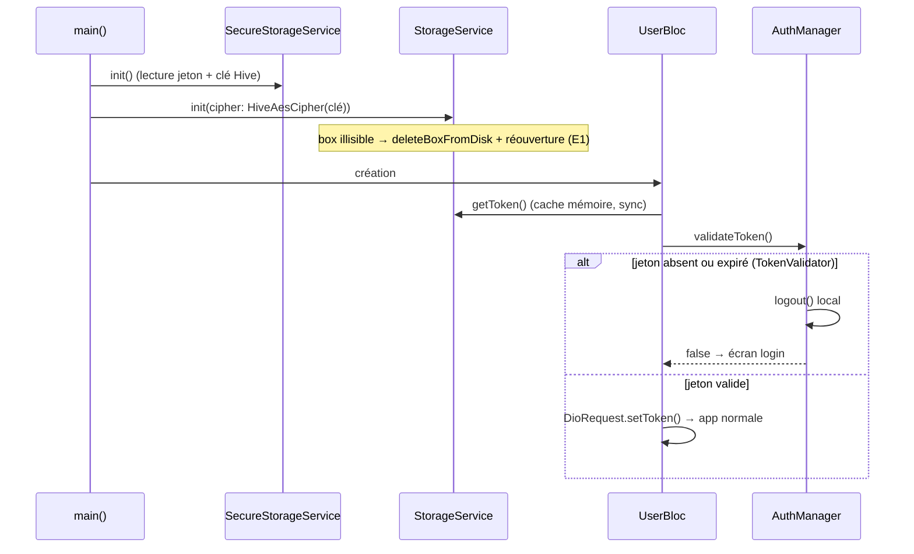
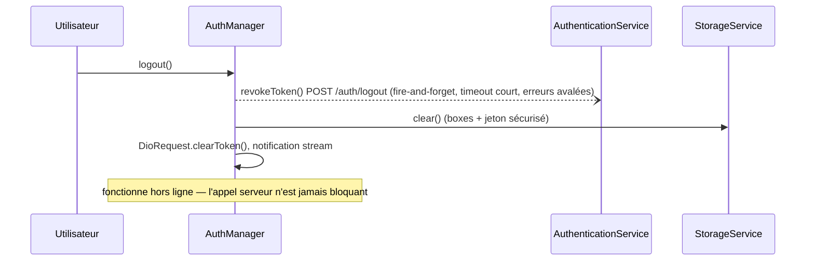

# 🏗️ Architecture : Sécurisation de l'application mobile

> Spec métier : `.ai-outputs/specs/securite-mobile/business-spec.md`
> Fiches de référence : `.ai-outputs/audit/SEC-01` à `SEC-05`
> Projet existant (`new_project: false`) — stack Flutter + BLoC + Hive + Dio + STOMP.

---

## Analyse du Projet

**Environnement détecté :**
- Flutter SDK ^3.7.0, Dio 5.8, Hive 2.2 (+hive_flutter), flutter_bloc 9, stomp_dart_client 2.1.
- Configuration réseau centralisée : `lib/config/app_propertie.dart` (`serveur`, `port`, `domain`)
  consommée par `DioRequest` (baseUrl) et `WebSocketService`.
- Stockage centralisé : `StorageService` (singleton, 9 boxes Hive non chiffrées), API
  **synchrone** pour `getToken()` — utilisée par `UserBloc` (restore session) et `AuthManager`.
- Auth : `AuthManager` (singleton) coordonne `StorageService` + `DioRequest` + stream d'état.
- Logs : `deboger()`/`prettyPrint()` dans `lib/util/function.dart`, **déjà no-op en release**
  (`kDebugMode`). Le problème est le contenu en debug (headers, bodies, PII).

**Constats qui corrigent les fiches d'audit :**
- `lib/service/local_store.dart` (token dans SharedPreferences) est **du code mort** —
  aucun usage hors du fichier. Le token réel vit dans la box Hive `authBox`.
  → Action : suppression du fichier, pas de migration SharedPreferences.
- SharedPreferences reste utilisé ailleurs pour des données non sensibles
  (favoris, préférences notifications) → la dépendance reste.
- Les URLs d'auth (`authentication_service.dart:11-16`) reconstruisent `"http://$serveur:$port"`
  au lieu d'utiliser `domain` → à normaliser.

**Conventions observées :**
- Singletons par `static X get instance` (pas de framework DI) — on suit.
- Services dans `lib/service/{domaine}/`, un fichier = une classe.
- Commentaires en français, doc `///` sur les services.

---

## Standards utilisés (Règle 4 — pas d'implémentation maison)

| Besoin | Standard retenu | Alternative écartée |
|---|---|---|
| Stockage sécurisé (Keychain/Keystore) | `flutter_secure_storage: ^9.2.2` | Chiffrement maison ❌ |
| Chiffrement du cache local | `HiveAesCipher` (intégré à Hive 2.x) + `Hive.generateSecureKey()` | AES manuel ❌ |
| Lecture de l'expiration JWT | `jwt_decoder: ^2.0.1` (`JwtDecoder.isExpired`) | Parsing base64 maison ❌ |
| Secrets hors du code | `String.fromEnvironment` / `bool.fromEnvironment` (Dart natif, `--dart-define`) | Fichier de secrets custom ❌ |

Aucune réimplémentation de standard n'est nécessaire.

---

## Architecture Métier

**Entités / concepts :**
- **Session** : jeton JWT — vit uniquement dans le stockage sécurisé OS + en mémoire
  (`StorageService` cache, `DioRequest` header). Expire ; expirée ⇒ retour login (RM6).
- **Cache local** : boxes Hive — toutes chiffrées avec une clé AES unique détenue par le
  stockage sécurisé (RM2). Illisible ⇒ purgé et reconstruit (E1), jamais de crash.
- **Configuration réseau** : schéma (`https`/`http`, `wss`/`ws`) décidé au build (RM1),
  jamais à l'exécution.
- **Secret de build** : clé Stadia — injectée au build, absente du dépôt (RM4).

**Relations :**
- `AuthManager` → `SecureStorageService` (jeton) → `StorageService` (données chiffrées)
- `DioRequest`/`WebSocketService` → `app_propertie.dart` (schéma unique)

---

## Architecture Fonctionnelle

| Module | Responsabilité | Dépendances |
|---|---|---|
| `SecureStorageService` **(nouveau)** | Unique accès Keychain/Keystore : jeton de session + clé AES Hive | `flutter_secure_storage` |
| `TokenValidator` **(nouveau)** | Logique pure : un jeton est-il expiré/valide ? (testable sans I/O) | `jwt_decoder` |
| `StorageService` (modifié) | Boxes Hive **chiffrées** ; jeton délégué à `SecureStorageService` avec cache mémoire pour garder `getToken()` synchrone | `SecureStorageService`, Hive |
| `AuthManager` (modifié) | `validateToken()` réelle ; `logout()` avec révocation serveur best-effort | `TokenValidator`, `AuthenticationService` |
| `app_propertie.dart` (modifié) | Source unique : hôte, port, **schémas** http(s)/ws(s) via `--dart-define` | — |
| `MapConfig` (modifié) | URLs tuiles sans clé en dur (clé via `--dart-define`, proxy backend plus tard) | — |
| `DioRequest` / `FCMService` / écrans (modifiés) | Logs sans secret ni PII | — |

### Flux 1 — Démarrage (restore de session)



### Flux 2 — Logout (RM7)



---

## Conception par fiche

### SEC-01 — Transport chiffré configurable

`lib/config/app_propertie.dart` :
```dart
/// Schéma réseau décidé au build. Production = chiffré par défaut.
/// Dev local : flutter run --dart-define=USE_TLS=false
const bool kUseTls = bool.fromEnvironment('USE_TLS', defaultValue: true);
const String _serveurDefault = "192.168.1.7";

final String serveur = const String.fromEnvironment('SERVER_HOST', defaultValue: _serveurDefault);
final String port = const String.fromEnvironment('SERVER_PORT', defaultValue: "7565");

final String domain = "${kUseTls ? 'https' : 'http'}://$serveur:$port";
final String wsDomain = "${kUseTls ? 'wss' : 'ws'}://$serveur:$port";
```
- `websocket_service.dart` : `_buildWebSocketUrl()` → `'$wsDomain/ws/websocket'`.
- `authentication_service.dart` : toutes les URLs utilisent `domain` (suppression des
  `"http://$serveur:$port"` reconstruits).
- Android : `android/app/src/main/AndroidManifest.xml` + network security config —
  cleartext interdit en release ; `android/app/src/debug/AndroidManifest.xml` l'autorise
  en debug (dev local conservé, CA1).
- iOS : aucune exception ATS ajoutée (HTTPS imposé par défaut en prod).

### SEC-02 — Jeton sécurisé + Hive chiffré

Nouveau `lib/service/storage/secure_storage_service.dart` (singleton, style projet) :
```dart
class SecureStorageService {
  static SecureStorageService get instance ...;
  Future<void> init();                 // pré-charge le jeton en cache mémoire
  String? get cachedToken;             // lecture synchrone (préserve l'API actuelle)
  Future<void> saveToken(String token);
  Future<void> deleteToken();
  Future<List<int>> getOrCreateHiveKey(); // Hive.generateSecureKey() au premier lancement
}
```
`StorageService` :
- `init()` reçoit le cipher : ouverture de **toutes** les boxes via un helper privé
  `_openBoxSafely(name, cipher)` — en cas de `HiveError`/corruption (ancienne box claire,
  clé perdue) : `deleteBoxFromDisk` puis réouverture vide (E1 + RM3, reconnexion forcée).
- `saveToken/getToken/clear` délèguent à `SecureStorageService` (le jeton ne touche plus
  `authBox`) ; `getToken()` reste synchrone via le cache mémoire.
- Suppression de `lib/service/local_store.dart` (code mort).

### SEC-03 — Clé Stadia hors du code

`lib/config/map_config.dart` :
```dart
/// Clé injectée au build : --dart-define=STADIA_KEY=xxx
/// Cible : proxy backend (prérequis serveur) — la clé disparaîtra entièrement.
static const String _stadiaApiKey = String.fromEnvironment('STADIA_KEY', defaultValue: '');
```
- URLs de tuiles deviennent des getters qui n'ajoutent `?api_key=` que si la clé est non vide.
- L'ancienne clé `d90155af-…` disparaît du dépôt ; sa révocation = action manuelle (hors périmètre).

### SEC-04 — Logs assainis

`deboger`/`prettyPrint` restent tels quels (déjà silencieux en release). Changements de contenu :
- `dio_request.dart` : `_onRequest` → `deboger("→ ${method} ${uri}")` (plus de headers ni body) ;
  `_onResponse` → `deboger("← $code $path")` ; `_onError` → ne plus logger `requestOptions.headers`.
- `fcm_service.dart` : token FCM → logger uniquement la longueur.
- Balayage PII : `referral_detail_screen.dart` (tél/email), `reservation_service.dart`
  (`secretKey`), `partenariat_demarcheur_service.dart` (tél), `websocket_service.dart`
  (frame headers, téléphone), `auth_manager.dart` (nom complet) → masquer ou supprimer.

### SEC-05 — Expiration JWT + révocation

Nouveau `lib/service/auth/token_validator.dart` (logique pure, testable) :
```dart
class TokenValidator {
  /// true si le jeton est syntaxiquement valide ET non expiré.
  /// Un jeton non décodable est traité comme expiré (jamais d'exception).
  static bool isValid(String? token);
}
```
- `AuthManager.validateToken()` utilise `TokenValidator.isValid` ; si invalide → `logout()`.
- `UserBloc` (restore session, ligne ~24) : valide AVANT `DioRequest.setToken` ;
  invalide → état non connecté (écran login), aucun appel métier (RM6).
- `AuthenticationService` : nouvelle méthode `revokeToken()` → `POST $domain/auth/logout`,
  timeout court, `try/catch` silencieux (endpoint = prérequis backend ; 404/timeout tolérés).
- `AuthManager.logout()` : appelle `revokeToken()` en best-effort **sans `await` bloquant
  du nettoyage local** (CA3, mode avion OK).

---

## Plan d'Implémentation

**Fichiers à créer :**
- `lib/service/storage/secure_storage_service.dart` — accès Keychain/Keystore (jeton + clé Hive)
- `lib/service/auth/token_validator.dart` — validité/expiration JWT (pur)
- `android/app/src/debug/AndroidManifest.xml` — cleartext autorisé en debug uniquement
- `android/app/src/main/res/xml/network_security_config.xml` — cleartext interdit (release)
- `test/service/auth/token_validator_test.dart` — jeton valide / expiré / malformé / null

**Fichiers à modifier :**
- `pubspec.yaml` — + `flutter_secure_storage`, + `jwt_decoder`
- `lib/config/app_propertie.dart` — schémas configurables, `wsDomain`
- `lib/config/map_config.dart` — clé via dart-define
- `lib/service/storage/storage_service.dart` — cipher + ouverture résiliente + délégation jeton
- `lib/service/auth/auth_manager.dart` — validateToken réelle, logout avec révocation
- `lib/bloc/user_bloc/user_bloc.dart` — validation au restore de session
- `lib/service/model/Auth/authentication_service.dart` — URLs sur `domain`, + `revokeToken()`
- `lib/service/websocket/websocket_service.dart` — `wsDomain`, logs sans PII
- `lib/service/dio/dio_request.dart` — logs sans headers/body
- `lib/service/firebase/fcm_service.dart` — token masqué
- `lib/screen/demarcheur/referrals/referral_detail_screen.dart` — logs PII
- `lib/service/model/booking/reservation_service.dart` — log secretKey
- `lib/service/model/demarcheur/partenariat_demarcheur_service.dart` — log téléphone
- `android/app/src/main/AndroidManifest.xml` — référence network security config
- `main.dart` — `SecureStorageService.init()` avant `StorageService.init()`

**Fichiers à supprimer :**
- `lib/service/local_store.dart` (code mort, token SharedPreferences)

**Ordre d'implémentation :**
1. `pubspec.yaml` + `SecureStorageService` + `TokenValidator` (+ test) — fondations sans impact
2. `StorageService` chiffré + `main.dart` (ordre d'init) — cœur du stockage
3. `AuthManager` + `UserBloc` + `AuthenticationService.revokeToken` — cycle de session
4. `app_propertie.dart` + `websocket_service.dart` + URLs auth + manifests Android — transport
5. `MapConfig` — clé Stadia
6. Balayage des logs (Dio, FCM, écrans, services) — dernier, mécanique

---

## CONTRAT D'IMPLÉMENTATION

### Services / Repositories
- [ ] `SecureStorageService` (nouveau) → jeton + clé Hive via flutter_secure_storage, cache mémoire synchrone, singleton `instance`
- [ ] `TokenValidator` (nouveau) → `isValid(String?)` pur, jamais d'exception
- [ ] `StorageService` → toutes les boxes ouvertes avec `HiveAesCipher`, helper `_openBoxSafely` avec purge sur corruption, jeton délégué au secure storage, `authBox` ne stocke plus le jeton
- [ ] `AuthenticationService` → URLs basées sur `domain` + méthode `revokeToken()` best-effort
- [ ] `AuthManager` → `validateToken()` via TokenValidator (invalide ⇒ logout), `logout()` avec révocation non bloquante
- [ ] `DioRequest` → logs sans headers ni bodies
- [ ] `FCMService` → token jamais loggé en clair
- [ ] `WebSocketService` → URL via `wsDomain`, logs sans téléphone ni headers de frame

### Modèles / Config
- [ ] `app_propertie.dart` → `kUseTls`, `serveur`/`port` surchargeables au build, `domain`, `wsDomain`
- [ ] `map_config.dart` → `STADIA_KEY` via dart-define, zéro clé dans le dépôt

### Blocs
- [ ] `UserBloc` → validation du jeton au restore avant tout `setToken`

### Plateforme
- [ ] `android/.../network_security_config.xml` + référence dans le manifest principal (cleartext interdit)
- [ ] `android/app/src/debug/AndroidManifest.xml` (cleartext debug uniquement)
- [ ] `main.dart` → `SecureStorageService.init()` avant `StorageService.init()`

### Nettoyage
- [ ] Suppression `lib/service/local_store.dart`
- [ ] `grep "d90155af"` → 0 résultat ; `grep "http://" lib/` → 0 URL backend en dur
- [ ] Logs : aucun token/email/téléphone/secretKey en clair (`grep` de contrôle)

### Tests
- [ ] `test/service/auth/token_validator_test.dart` → valide, expiré, malformé, null, vide

---

UI_REQUIRED: false
