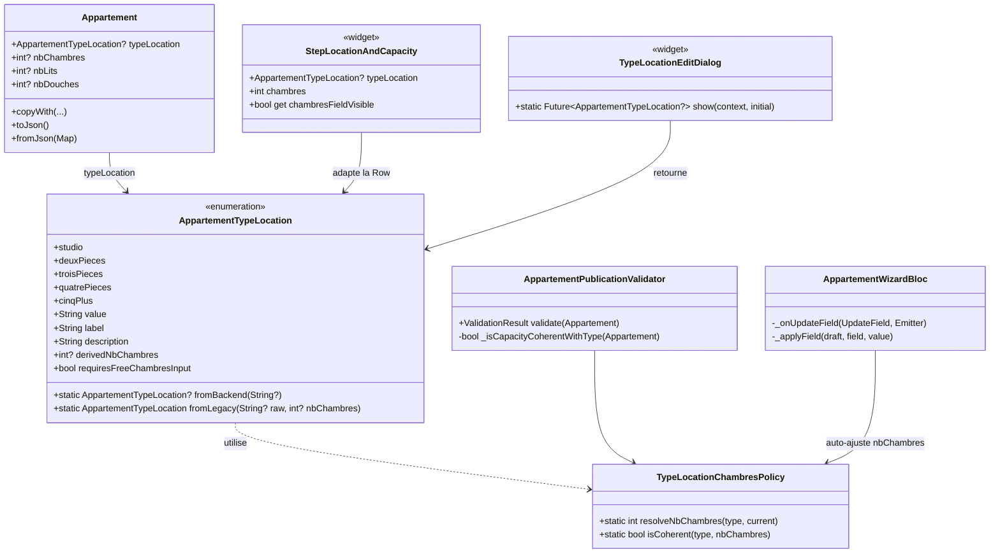
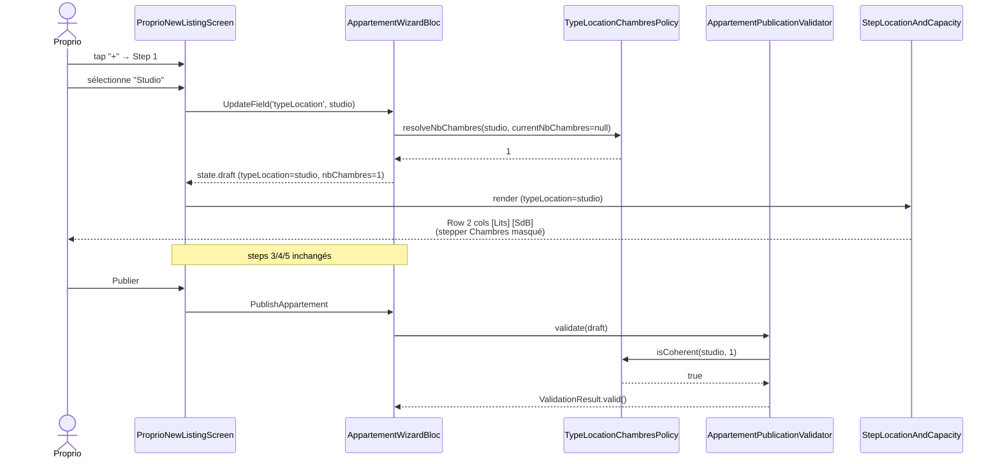
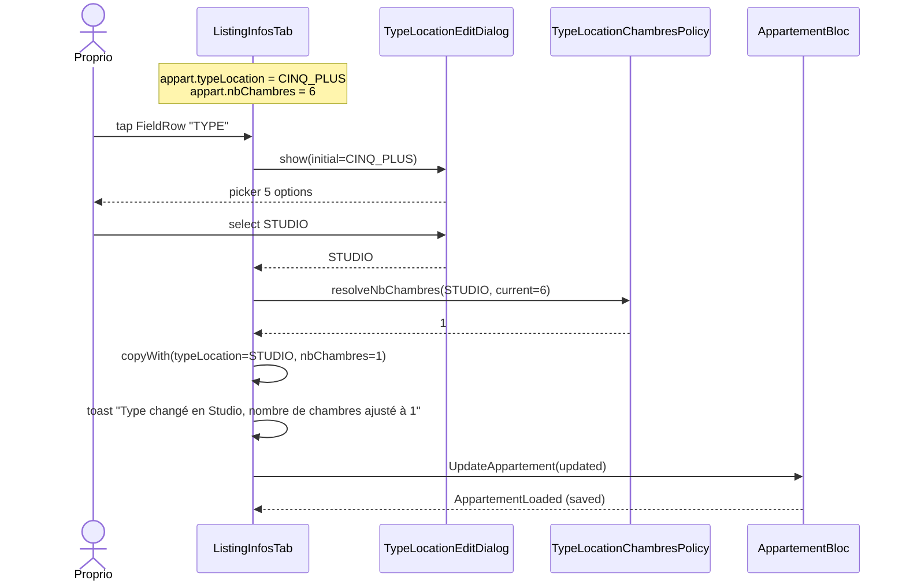

# 🏗️ Architecture — `typeLocation-enum-refacto` (v2 corrigée)

> **Date :** 2026-05-14
> **Spec source :** `business-spec.md` (v2)
> **Mode :** Projet existant Flutter + BLoC + Hive — UI conservée à l'identique

---

## 1. Vue d'ensemble

### 1.1 Objectif

Transformer le champ `Appartement.typeLocation: String?` (chaîne libre à double sémantique) en un **enum strict 5 valeurs** `{STUDIO, DEUX_PIECES, TROIS_PIECES, QUATRE_PIECES, CINQ_PLUS}`, aligné sur les 5 cards déjà présentes au step 1 du wizard. Le `nbChambres` devient une donnée **dérivée du type** sauf pour `CINQ_PLUS` où il reste libre.

### 1.2 Composants impactés

| Couche | Composant | Action |
|--------|-----------|--------|
| **Enum** | `AppartementTypeLocation` | **NOUVEAU** — `lib/model/enumeration/` |
| **Modèle** | `Appartement` | Type du champ `typeLocation` : String → enum |
| **Modèle** | `MapAppartement` | `typeAppart` typé enum aussi (cohérence) |
| **Util** | `TypeLocationChambresPolicy` | **NOUVEAU** — `lib/util/` (helpers `derivedChambres`, `mapLegacyString`) |
| **Bloc** | `AppartementWizardBloc` | `_applyField('typeLocation')` typé + dérivation auto `nbChambres` |
| **Validator** | `AppartementPublicationValidator` | Règles croisées strictes type ↔ chambres |
| **Wizard step 1** | `step_rooms_type.dart` | UI inchangée. Seul le binding passe à enum. |
| **Wizard step 2** | `step_location_capacity.dart` | Stepper Chambres conditionnel (masqué pour Studio/2P/3P/4P, visible pour 5+) |
| **Édition** | `listing_infos_tab.dart` `_editType` | Remplace `TextFieldEditDialog` par `TypeLocationEditDialog` |
| **Édition** | `TypeLocationEditDialog` | **NOUVEAU** — `lib/screen/client/proprio/appartements/widget/` |
| **Locataire** | `LocataireDetailScreen._typeLabel` | Consomme `enum.label` |
| **Doc backend** | `BACKEND_NOTES_ANNONCE.md` | Ajouter la section enum + mapping §4.6 |

### 1.3 UI — Périmètre minimal

**Step 1 wizard** : aucun changement visuel. Les 5 cards `RoomsTypeCard` restent à l'identique (grille 2 cols). Le hint actuel "On compte le séjour + chambres…" est **réécrit** pour refléter qu'on choisit la typologie : « Studio = pièce unique, 2 pièces = 1 chambre + salon, etc. ».

**Step 2 wizard** : la Row capacité passe de 3 colonnes fixes à un layout **conditionnel** :
- `STUDIO/2P/3P/4P` → `[Lits] [SdB]` (2 colonnes, 50/50)
- `CINQ_PLUS` → `[Lits] [Chambres min 4] [SdB]` (3 colonnes, identique à aujourd'hui)

**Édition** : la FieldRow "TYPE" du tab Infos reste au même endroit, même style. Le tap ouvre un nouveau Dialog (3-5 options en RadioListTile, pattern minimaliste cohérent avec `CapacityEditDialog`).

### 1.4 Nouvelles entités

- 1 enum : `AppartementTypeLocation` (avec `value`, `label`, `description`, `derivedNbChambres`, `requiresFreeChambresInput`)
- 1 helper util : `TypeLocationChambresPolicy` (dérivation + mapping legacy)
- 1 widget dialog : `TypeLocationEditDialog`

---

## 2. Diagramme de classes



---

## 3. Diagramme de séquence — Création (cas Studio)



---

## 4. Diagramme de séquence — Édition (5+ → Studio)



---

## 5. Structure des fichiers

```
lib/
├── model/
│   ├── enumeration/
│   │   ├── appartement_status.dart           (existant)
│   │   ├── appartement_type_location.dart    ← NOUVEAU
│   │   └── ...
│   ├── residence/
│   │   └── appart.dart                       ← MODIFIÉ (typed)
│   └── map/
│       └── map_appartement.dart              ← MODIFIÉ (typed)
│
├── util/
│   ├── appartement_publication_validator.dart  ← MODIFIÉ
│   └── type_location_chambres_policy.dart      ← NOUVEAU
│
├── bloc/
│   └── appartement_wizard_bloc/
│       ├── appartement_wizard_bloc.dart      ← MODIFIÉ (_applyField)
│       └── ...
│
└── screen/
    └── client/
        ├── locataire/booking/
        │   └── detail_screen.dart            ← MODIFIÉ (_typeLabel)
        └── proprio/appartements/
            ├── widget/
            │   ├── listing_infos_tab.dart           ← MODIFIÉ
            │   └── type_location_edit_dialog.dart   ← NOUVEAU
            └── wizard/
                ├── proprio_new_listing_screen.dart  ← MODIFIÉ (binding enum)
                └── widget/
                    ├── step_rooms_type.dart         ← MODIFIÉ (binding enum, hint réécrit)
                    └── step_location_capacity.dart  ← MODIFIÉ (Row conditionnel)

test/
├── model/enumeration/
│   └── appartement_type_location_test.dart   ← NOUVEAU
├── util/
│   ├── appartement_publication_validator_test.dart  ← NOUVEAU
│   └── type_location_chambres_policy_test.dart      ← NOUVEAU
└── bloc/
    └── appartement_wizard_bloc_test.dart      ← NOUVEAU
```

---

## 6. Interfaces / Contrats

### 6.1 Enum `AppartementTypeLocation`

```dart
enum AppartementTypeLocation {
  studio('STUDIO'),
  deuxPieces('DEUX_PIECES'),
  troisPieces('TROIS_PIECES'),
  quatrePieces('QUATRE_PIECES'),
  cinqPlus('CINQ_PLUS');

  const AppartementTypeLocation(this.value);
  
  /// Valeur sérialisée backend + Hive.
  final String value;

  /// Libellé court UI : 'Studio', '2 pièces', '3 pièces', '4 pièces', '5+ pièces'.
  String get label;

  /// Sous-titre descriptif (utilisé sur les cards step 1 — déjà présent).
  String get description;

  /// `nbChambres` dérivé pour les 4 premiers types. `null` pour `CINQ_PLUS`
  /// (le proprio saisit librement).
  int? get derivedNbChambres;

  /// `true` uniquement pour `CINQ_PLUS` : le stepper Chambres reste visible.
  bool get requiresFreeChambresInput;

  /// Parse strict puis fallback legacy. Retourne `null` si raw est `null`/vide.
  static AppartementTypeLocation? fromBackend(String? raw);

  /// Mapping legacy combiné string + nbChambres existant (cf. spec §4.6).
  /// Default safe : `deuxPieces`.
  static AppartementTypeLocation fromLegacy(String? raw, int? nbChambres);
}
```

Détails (table de référence) :

| Enum | value | label | derivedNbChambres | requiresFreeChambresInput |
|------|-------|-------|-------------------|---------------------------|
| `studio` | `STUDIO` | Studio | 1 | false |
| `deuxPieces` | `DEUX_PIECES` | 2 pièces | 1 | false |
| `troisPieces` | `TROIS_PIECES` | 3 pièces | 2 | false |
| `quatrePieces` | `QUATRE_PIECES` | 4 pièces | 3 | false |
| `cinqPlus` | `CINQ_PLUS` | 5+ pièces | null | **true** |

### 6.2 Helper `TypeLocationChambresPolicy`

```dart
class TypeLocationChambresPolicy {
  TypeLocationChambresPolicy._();

  /// Calcule la valeur de `nbChambres` à appliquer pour un type donné.
  ///
  /// - Types à dérivation stricte → retourne `type.derivedNbChambres`
  /// - `CINQ_PLUS` → si `current` est null ou < 4, retourne 4 (default min) ;
  ///   sinon conserve `current` (pour préserver une saisie déjà valide).
  static int resolveNbChambres(
    AppartementTypeLocation type,
    int? current,
  );

  /// Indique si la paire (type, nbChambres) respecte les règles métier.
  static bool isCoherent(
    AppartementTypeLocation type,
    int? nbChambres,
  );
}
```

Logique :

```
resolveNbChambres(STUDIO,    *)      = 1
resolveNbChambres(2P,        *)      = 1
resolveNbChambres(3P,        *)      = 2
resolveNbChambres(4P,        *)      = 3
resolveNbChambres(CINQ_PLUS, null)   = 4
resolveNbChambres(CINQ_PLUS, n)      = n >= 4 ? n : 4

isCoherent(type, n) = (type == CINQ_PLUS) ? (n >= 4) : (n == type.derivedNbChambres)
```

### 6.3 Modèle `Appartement` — changements

```dart
class Appartement {
  // AVANT : String? typeLocation;
  AppartementTypeLocation? typeLocation;

  Appartement.fromJson(Map<String, dynamic> json) {
    // ...
    final rawType = json['typeLocation'] as String?;
    final rawChambres = json['nbChambres'] as int?;
    typeLocation = AppartementTypeLocation.fromBackend(rawType)
        ?? AppartementTypeLocation.fromLegacy(rawType, rawChambres);
    nbChambres = rawChambres;
    // ...
  }

  Map<String, dynamic> toJson() {
    // ...
    data['typeLocation'] = typeLocation?.value;
    // ...
  }

  Appartement copyWith({
    AppartementTypeLocation? typeLocation,
    // ... autres
  });
}
```

> **Compat draft Hive :** `AppartementDraftStorage` rejoue `fromJson`. Le fallback `fromLegacy` garantit la lecture des drafts pré-refacto.

### 6.4 Validator — règles croisées

```dart
class AppartementPublicationValidator {
  ValidationResult validate(Appartement appart) {
    final errors = <String, String>{};

    if (appart.typeLocation == null) {
      errors['typeLocation'] = 'Le type est obligatoire';
    }
    if ((appart.nbChambres ?? 0) < 1) {
      errors['nbChambres'] = 'Au moins 1 chambre est requise';
    } else if (appart.typeLocation != null &&
        !TypeLocationChambresPolicy.isCoherent(
            appart.typeLocation!, appart.nbChambres)) {
      errors['nbChambres'] = _incoherenceMessage(appart.typeLocation!);
    }
    // ... règles existantes inchangées (titre, address, prix, photos)
  }

  String _incoherenceMessage(AppartementTypeLocation type) {
    if (type == AppartementTypeLocation.cinqPlus) {
      return 'Un 5+ pièces doit avoir au moins 4 chambres';
    }
    return '${type.label} doit avoir ${type.derivedNbChambres} chambre(s)';
  }
}
```

### 6.5 BLoC `_applyField` — auto-dérivation

```dart
Appartement _applyField(Appartement draft, String field, dynamic value) {
  switch (field) {
    case 'typeLocation':
      final newType = value as AppartementTypeLocation?;
      if (newType == null) {
        return draft.copyWith(typeLocation: null);
      }
      final resolved = TypeLocationChambresPolicy.resolveNbChambres(
        newType, draft.nbChambres,
      );
      return draft.copyWith(typeLocation: newType, nbChambres: resolved);
    case 'nbChambres':
      // En mode CINQ_PLUS uniquement, le proprio peut ajuster nbChambres.
      // Pour les autres types, on ignore (silencieusement) — l'UI ne devrait
      // de toute façon pas dispatch ce field car le stepper est masqué.
      return draft.copyWith(nbChambres: value as int?);
    // ... autres cases inchangés
  }
}
```

### 6.6 Step 2 — Row capacité conditionnel

```dart
// step_location_capacity.dart — pseudo-code du bloc capacité

Row(
  children: [
    Expanded(child: WizardStepperRow(label: 'Lits', value: lits, ...)),
    if (typeLocation == AppartementTypeLocation.cinqPlus) ...[
      const SizedBox(width: 10),
      Expanded(child: WizardStepperRow(
        label: 'Chambres',
        value: chambres,
        min: 4,
        max: 10,
        onChange: (v) => onFieldChange('nbChambres', v),
      )),
    ],
    const SizedBox(width: 10),
    Expanded(child: WizardStepperRow(label: 'SdB', value: douches, ...)),
  ],
)
```

Le widget `StepLocationAndCapacity` reçoit `AppartementTypeLocation? typeLocation` en prop.

### 6.7 `TypeLocationEditDialog`

Pattern minimaliste, cohérent avec `CapacityEditDialog` :

```dart
class TypeLocationEditDialog extends StatefulWidget {
  final AppartementTypeLocation? initial;

  const TypeLocationEditDialog({super.key, this.initial});

  static Future<AppartementTypeLocation?> show(
    BuildContext context, {
    AppartementTypeLocation? initial,
  });
}
```

UX retenue (intervention minimale) :
- `Dialog` backgroundColor `bgElev1`, radius `lg`
- Title `h3` : « Type de logement »
- Subtitle `small` : « Choisissez la typologie de votre logement. »
- 5 `RadioListTile<AppartementTypeLocation>` (radio + label + description courte), couleur active `accent`
- Bouton `CustomButton "Enregistrer"` (block, lg) — pop la valeur sélectionnée
- Bouton `OutlinedCustomButton "Annuler"` (block, md) — pop null

→ Aligné avec le pattern existant des autres dialogs d'édition. Pas de nouvelle convention introduite.

---

## 7. CONTRAT D'IMPLÉMENTATION

> Ce contrat est la loi pour l'agent Dev.

### 7.1 Enum

- [ ] **Créer** `lib/model/enumeration/appartement_type_location.dart`
  - 5 valeurs : `studio`, `deuxPieces`, `troisPieces`, `quatrePieces`, `cinqPlus`
  - Champ `value: String` (`'STUDIO'`, `'DEUX_PIECES'`, `'TROIS_PIECES'`, `'QUATRE_PIECES'`, `'CINQ_PLUS'`)
  - Getter `label: String` (cf. table §6.1)
  - Getter `description: String` — sous-titres alignés sur le `RoomsTypeCard` actuel
  - Getter `derivedNbChambres: int?` (cf. table §6.1)
  - Getter `requiresFreeChambresInput: bool` (true uniquement pour `cinqPlus`)
  - `fromBackend(String?)` : matching strict sur `value`, retourne `null` si raw null/vide, sinon délègue à `fromLegacy` si la valeur n'est pas reconnue
  - `fromLegacy(String?, int?)` : mapping spec §4.6 (string puis nbChambres)

### 7.2 Helper Util

- [ ] **Créer** `lib/util/type_location_chambres_policy.dart`
  - Classe `TypeLocationChambresPolicy` avec constructeur privé
  - `static int resolveNbChambres(AppartementTypeLocation type, int? current)` — cf. §6.2
  - `static bool isCoherent(AppartementTypeLocation type, int? nbChambres)` — cf. §6.2

### 7.3 Modèle

- [ ] **Modifier** `lib/model/residence/appart.dart`
  - Champ `typeLocation: AppartementTypeLocation?` (au lieu de `String?`)
  - `fromJson` : parsing via `fromBackend` puis fallback `fromLegacy(raw, nbChambres)`
  - `toJson` : `data['typeLocation'] = typeLocation?.value`
  - `copyWith` : adapter signature

- [ ] **Modifier** `lib/model/map/map_appartement.dart`
  - Champ `typeAppart: AppartementTypeLocation?`
  - `fromJson` : `typeAppart = AppartementTypeLocation.fromBackend(json['typeAppart'] ?? json['typeLocation'])`
  - `toJson` : `'typeAppart': typeAppart?.value`

### 7.4 Validator

- [ ] **Modifier** `lib/util/appartement_publication_validator.dart`
  - Ajouter règle "min 1 chambre" stricte
  - Ajouter règle "cohérence type ↔ nbChambres" via `TypeLocationChambresPolicy.isCoherent`
  - Le message d'erreur précise le type concerné (cf. `_incoherenceMessage`)
  - Mettre à jour le commentaire de classe pour documenter les règles

### 7.5 BLoC Wizard

- [ ] **Modifier** `lib/bloc/appartement_wizard_bloc/appartement_wizard_bloc.dart`
  - `_applyField('typeLocation', value)` : utilise `TypeLocationChambresPolicy.resolveNbChambres` pour ajuster automatiquement `nbChambres`
  - `_applyField('nbChambres', value)` : applique tel quel (l'UI garantit que ce field n'est dispatché que pour `cinqPlus`)
  - Mettre à jour le doc de `UpdateField` pour clarifier le type attendu sur `'typeLocation'`

### 7.6 Widgets — Wizard

- [ ] **Modifier** `lib/screen/client/proprio/appartements/wizard/widget/step_rooms_type.dart`
  - Garder l'UI à l'identique (grille 2 cols, 5 cards `RoomsTypeCard`)
  - Renommer les types d'options de `String id` vers `AppartementTypeLocation type`
  - Adapter `onSelect: ValueChanged<AppartementTypeLocation>`
  - Adapter `selectedRooms: AppartementTypeLocation?`
  - **Réécrire le `_RoomsHint`** : nouveau texte « Studio = pièce unique sans salon. À partir de 2 pièces : 1 salon + chambres. » (ou plus court — discrétion du dev)
  - Source des labels/subtitles : tirer directement de l'enum (`type.label`, `type.description`) — supprimer le `_RoomOption` interne devenu inutile

- [ ] **Modifier** `lib/screen/client/proprio/appartements/wizard/widget/rooms_type_card.dart`
  - Adapter le prop `type: AppartementTypeLocation` (au lieu de `label/subtitle` strings)
  - Lire `type.label` et `type.description` dans le build
  - Aucun changement visuel

- [ ] **Modifier** `lib/screen/client/proprio/appartements/wizard/widget/step_location_capacity.dart`
  - Ajouter prop `AppartementTypeLocation? typeLocation`
  - Adapter la Row capacité : conditionnel (cf. §6.6)
  - Pour `cinqPlus`, le stepper Chambres a `min: 4, max: 10`
  - Pour les 4 autres types, le slot Chambres disparaît — Lits et SdB se partagent la largeur (Row reste avec 2 Expanded)

- [ ] **Modifier** `lib/screen/client/proprio/appartements/wizard/proprio_new_listing_screen.dart`
  - `_canNext(state)` case 1 : `state.draft.typeLocation != null`
  - `_canNext(state)` case 2 : titre + commune + quartier inchangés (pas de validation supplémentaire sur les chambres puisque dérivées)
  - Passer `typeLocation: state.draft.typeLocation` à `StepLocationAndCapacity`
  - Le mapping `_StepContent` continue de fonctionner — adapter l'invocation de `StepRoomsType`

### 7.7 Widgets — Édition

- [ ] **Créer** `lib/screen/client/proprio/appartements/widget/type_location_edit_dialog.dart`
  - Classe `TypeLocationEditDialog extends StatefulWidget`
  - Static `show(context, {initial}) → Future<AppartementTypeLocation?>`
  - Pattern `Dialog` aligné sur `CapacityEditDialog` (cf. §6.7)
  - 5 `RadioListTile<AppartementTypeLocation>` avec `activeColor: AppColors.accent`
  - Bouton Enregistrer + Annuler en bas

- [ ] **Modifier** `lib/screen/client/proprio/appartements/widget/listing_infos_tab.dart`
  - `_typeLabel()` : retourne `source?.typeLocation?.label ?? 'Non précisé'`
  - `_editType(context)` :
    ```dart
    final newType = await TypeLocationEditDialog.show(context, initial: source!.typeLocation);
    if (newType == null || newType == source!.typeLocation) return;
    final resolved = TypeLocationChambresPolicy.resolveNbChambres(newType, source!.nbChambres);
    var updated = source!.copyWith(typeLocation: newType, nbChambres: resolved);
    if (resolved != source!.nbChambres) {
      _toast(context, 'Type changé en ${newType.label}, nombre de chambres ajusté à $resolved');
    }
    _dispatch(bloc, messenger, updated, 'Type mis à jour');
    ```
  - Mettre à jour `_capacityText()` si nécessaire (pas de changement de format requis)

### 7.8 Lecture locataire

- [ ] **Modifier** `lib/screen/client/locataire/booking/detail_screen.dart`
  - `_typeLabel` : `return appartement.typeLocation?.label ?? 'Logement';`
  - Supprimer la logique capitalize ad-hoc

### 7.9 Tests

- [ ] **Créer** `test/model/enumeration/appartement_type_location_test.dart`
  - `fromBackend('STUDIO') == studio` etc. pour les 5 valeurs
  - `fromBackend(null) == null`, `fromBackend('') == null`
  - `fromBackend('INCONNU')` → fallback `fromLegacy` (`deuxPieces` si pas d'info)
  - `fromLegacy('Studio', any) == studio`
  - `fromLegacy('2 pièces', any) == deuxPieces`
  - `fromLegacy('Chambre privée', 2) == troisPieces` (dérivé)
  - `fromLegacy('Appartement entier', 4) == cinqPlus`
  - `fromLegacy(null, null) == deuxPieces`
  - `studio.derivedNbChambres == 1`, `cinqPlus.derivedNbChambres == null`
  - `cinqPlus.requiresFreeChambresInput == true`, autres `== false`

- [ ] **Créer** `test/util/type_location_chambres_policy_test.dart`
  - `resolveNbChambres(STUDIO, 5) == 1` (force la valeur dérivée)
  - `resolveNbChambres(TROIS_PIECES, null) == 2`
  - `resolveNbChambres(CINQ_PLUS, null) == 4`
  - `resolveNbChambres(CINQ_PLUS, 6) == 6` (préserve)
  - `resolveNbChambres(CINQ_PLUS, 2) == 4` (force au min)
  - `isCoherent(STUDIO, 1) == true`, `isCoherent(STUDIO, 2) == false`
  - `isCoherent(CINQ_PLUS, 5) == true`, `isCoherent(CINQ_PLUS, 3) == false`

- [ ] **Créer** `test/util/appartement_publication_validator_test.dart`
  - Studio + nbChambres=1 → valide
  - Studio + nbChambres=2 → invalide
  - 5+ + nbChambres=3 → invalide
  - 5+ + nbChambres=4 → valide
  - typeLocation null → invalide
  - nbChambres=0 → invalide

- [ ] **Créer** `test/bloc/appartement_wizard_bloc_test.dart` (focus minimal)
  - Dispatch `UpdateField('typeLocation', studio)` quand draft.nbChambres=5 → state.draft.nbChambres == 1
  - Dispatch `UpdateField('typeLocation', cinqPlus)` quand draft.nbChambres=2 → state.draft.nbChambres == 4
  - Dispatch `UpdateField('typeLocation', cinqPlus)` quand draft.nbChambres=6 → state.draft.nbChambres == 6 (préserve)

### 7.10 Documentation backend

- [ ] **Modifier** `BACKEND_NOTES_ANNONCE.md`
  - Ajouter une section « Type de logement — enum strict » :
    - Format JSON : `"typeLocation": "STUDIO" | "DEUX_PIECES" | "TROIS_PIECES" | "QUATRE_PIECES" | "CINQ_PLUS"`
    - Mapping de migration (cf. spec §4.6)
    - Règle backend : si `typeLocation ∈ {STUDIO, 2P}` → forcer `nbChambres = 1` ; si `3P` → 2 ; si `4P` → 3 ; si `5+` → ≥ 4 (sinon forcer à 4)
  - Marquer V1 / coordination requise

### 7.11 Conventions à respecter

- [ ] Pas de fonction privée retournant un `Widget` dans le code produit.
- [ ] Un widget = un fichier (`TypeLocationEditDialog` dans son propre fichier).
- [ ] Une classe par fichier (sauf data class privée de support si vraiment nécessaire et locale au fichier).
- [ ] Réutiliser `WizardStepperRow`, `RoomsTypeCard`, `CustomButton`, `OutlinedCustomButton`.
- [ ] SOLID : le helper `TypeLocationChambresPolicy` isole la règle métier (SRP) ; le validator l'utilise (DIP via helper statique pur).

---

## 8. Hors scope

- Filtre « type » dans le feed locataire.
- Refonte de `Appartement.copyWith` pour clear-to-null.
- Refonte de `AppartementBackendMapper` (déjà flat).
- Tests d'intégration UI (les critères §9 de la spec sont à vérifier manuellement).

---

## 9. Risques & Mitigations

| Risque | Mitigation |
|--------|------------|
| Backend pas encore migré au déploiement client | `fromBackend` retombe sur `fromLegacy` → forward-compat assurée |
| Draft Hive avec string libre legacy | `fromLegacy` couvre toutes les valeurs connues + default `deuxPieces` |
| Le proprio change de 5+ → Studio en édition et perd l'info "6 chambres" | Toast clair documenté en spec §4.5 ; choix métier assumé |
| Tests existants `appartement_backend_mapper_test.dart` cassés | À mettre à jour si les fixtures contiennent `typeLocation` (à vérifier en dev) |
| Le `_capacityText()` du tab Infos affiche encore `nbChambres` même après bascule | Le ressaisit recalcule automatiquement → cohérent |

---

## 10. UI_REQUIRED

**UI_REQUIRED: true** *(mais minimal)*

Surfaces touchées :
- Step 2 du wizard : layout Row conditionnel (3 cols pour 5+, 2 cols sinon)
- Édition `ListingInfosTab` : nouveau Dialog picker enum
- Step 1 : aucun changement visuel — uniquement réécriture du hint et binding enum

→ **Pas besoin de revenir à `/agent-uiux`** pour proposer 3 options esthétiques : la spec révisée impose un design minimal aligné sur l'existant (pattern `CapacityEditDialog` + Row conditionnel). L'orchestrateur peut passer directement à l'étape Plan d'action puis Dev.
