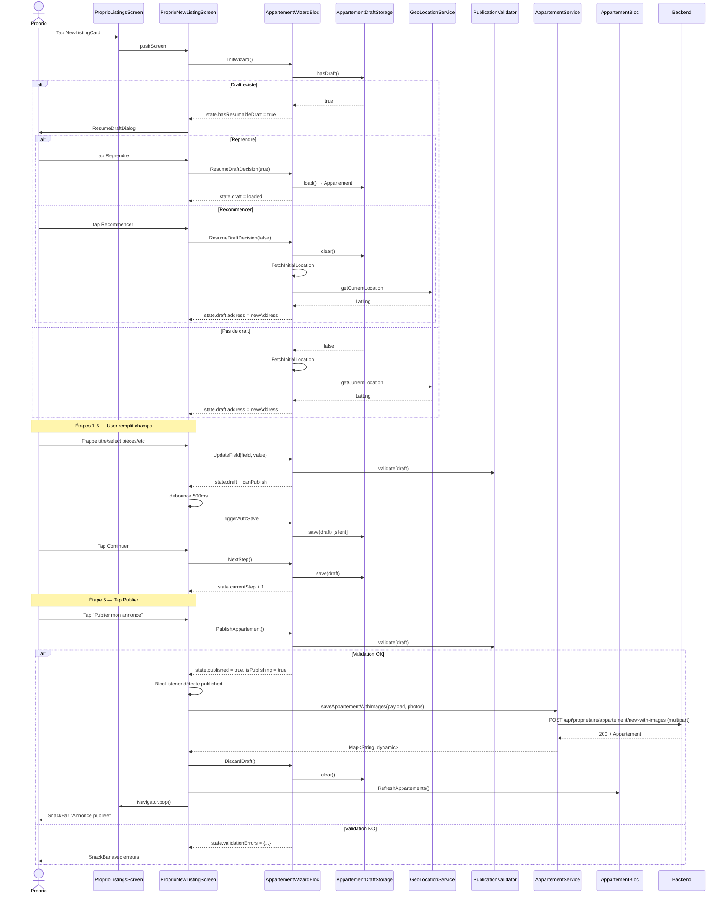

# 🏗️ Architecture — V9.1 Wizard création appartement (F2)

> **Version :** 1.0
> **Date :** 2026-05-11
> **Mode :** Projet existant
> **Basée sur :** `.ai-outputs/specs/v9-1-wizard-creation-appart/business-spec.md`

---

## 1. Vue d'ensemble

### 🎁 Découverte structurante — Infrastructure déjà en place

L'audit du code projet a révélé que **toute la couche état/persistance/géoloc/validation est déjà implémentée** :

| Composant existant | Localisation | Statut |
|---|---|---|
| `AppartementWizardBloc` | `lib/bloc/appartement_wizard_bloc/appartement_wizard_bloc.dart` | ✅ Complet (258 lignes, tous events) |
| `AppartementWizardState` | idem | ✅ Complet (flags `isLoadingGeo`, `isSaving`, `isPublishing`, `hasResumableDraft`, `canPublish`, `published`, `isEditing`...) |
| `AppartementWizardEvent` | idem | ✅ 9 events : `InitWizard`, `UpdateField`, `NextStep`, `PrevStep`, `GoToStep`, `TriggerAutoSave`, `PublishAppartement`, `DiscardDraft`, `ResumeDraftDecision`, `FetchInitialLocation` |
| `AppartementDraftStorage` | `lib/service/storage/appartement_draft_storage.dart` | ✅ Singleton, Hive box `appartementDraftBox`, save/load/hasDraft/clear |
| `GeoLocationService` | `lib/service/geo/geo_location_service.dart` | ✅ requestPermission + getCurrentLocation + reverseGeocode |
| `AppartementPublicationValidator` | `lib/util/appartement_publication_validator.dart` | ✅ Validation par champs |
| `AppartementBackendMapper.toCreatePayload` | `lib/service/model/appartement/appartement_backend_mapper.dart` | ✅ Transforme `Appartement` → payload JSON |
| `AppartementService.saveAppartementWithImages` | `lib/service/model/appartement/appartement_service.dart` | ✅ Multipart upload (JSON + images) |

**Conséquence** : V9.1 ne demande que de **construire l'UI** (5 écrans d'étape + widgets atomiques) et de **brancher** sur l'infra existante. Pas de nouveau Bloc, pas de nouveau service. Énorme gain de temps.

### Composants à créer (UI seulement)

- **1 orchestrateur** : `ProprioNewListingScreen` (StatefulWidget + `BlocProvider` local du `AppartementWizardBloc`)
- **1 widget header** : `WizardStepIndicator` (TopNav + progress bar)
- **5 widgets d'étape** : `WizardStepRoomsType`, `WizardStepLocationAndCapacity`, `WizardStepPhotos`, `WizardStepAmenities`, `WizardStepPricing`
- **7 widgets atomiques réutilisables** : `RoomsTypeCard`, `SearchableSelect`, `GpsCaptureCard`, `WizardStepperRow`, `PhotosUploadCard`, `AmenityChipGrid`, `PricingCommissionPreview`
- **1 widget CTA** : `WizardCtaBar` (bottom bar adaptatif)
- **1 dialog** : `ResumeDraftDialog` (modal Reprendre / Recommencer)

### Composants à modifier (1)

- `lib/screen/client/proprio/appartements/listings_screen.dart` ligne 156 : `NewListingCard.onTap` push `ProprioNewListingScreen` (au lieu du stub `_stub`)

### Décisions techniques clés

**D1 — State management** : utiliser le `AppartementWizardBloc` **EXISTANT** (déjà conçu). BlocProvider local au screen. Pas de duplication.

**D2 — Hive draft** : utiliser `AppartementDraftStorage` **EXISTANT** (Box dynamique avec JSON sérialisé, pas de TypeAdapter — décision projet acceptée).

**D3 — Photos** : `image_picker.pickMultiImage()` retourne `List<XFile>`. On stocke les `XFile.path` dans `draft.photos` (`List<PhotoAppart>`). Au moment du publish final, le screen convertit en `List<UploadedImage>` (pattern existant dans `appartement_repository.dart`) pour `saveAppartementWithImages`.

**D4 — Coords obfuscation** : `GeoLocationService.getCurrentLocation()` retourne la position téléphone → stockée dans `draft.address.lat/longi` (coords **exactes**). Backend Asfar applique l'obfuscation lors du save (cf. `BACKEND_NOTES_MAP_V9_7B.md` section 3 cas 1 : "À la création de l'appart, envoyez geoLat/geoLongi dans AddressReq... Si vous ne le faites pas, on calcule le décalage côté back une seule fois à la création — markers stables garantis"). OK, on envoie tel quel.

**D5 — Publish flow** : le `AppartementWizardBloc` emit `published: true` quand la validation passe (cf. `_onPublish` ligne 165-182). Le screen écoute via `BlocListener<AppartementWizardBloc>` et déclenche l'appel `AppartementService.saveAppartementWithImages` lui-même (couplage faible, le Bloc reste indépendant du service de publication). Pattern documenté dans `appartement_wizard_bloc.dart:22-23` : « la publication finale est déléguée à l'écran qui dispatchera vers AppartementBloc quand le state émet `published = true` ».

**D6 — Resume draft** : au mount, `InitWizard()` → si `hasResumableDraft: true` dans le state, le screen affiche `ResumeDraftDialog` → dispatch `ResumeDraftDecision(resume)` selon choix.

---

## 2. Diagramme de classes

```mermaid
classDiagram
    class ProprioNewListingScreen {
        <<StatefulWidget>>
        +Appartement? initialEdit
        +build() Scaffold
    }
    class _ProprioNewListingScreenState {
        -Timer? _autoSaveDebouncer
        +initState()
        +dispose()
        -_onResumeDraft()
        -_onPublish() async
        -_pickPhotos() async
        +build() BlocProvider~AppartementWizardBloc~
    }
    ProprioNewListingScreen --> _ProprioNewListingScreenState

    class AppartementWizardBloc {
        <<existant>>
        -AppartementDraftStorage _draftStorage
        -GeoLocationService _geoService
        -AppartementPublicationValidator _validator
        +9 event handlers
    }
    _ProprioNewListingScreenState --> AppartementWizardBloc : provides

    class WizardStepIndicator {
        +int currentStep
        +int totalSteps
        +VoidCallback? onBack
    }

    class WizardCtaBar {
        +int currentStep
        +int totalSteps
        +bool canNext
        +bool isPublishing
        +VoidCallback? onContinue
    }

    class WizardStepRoomsType {
        +String? selectedRooms
        +Function(String) onSelect
    }
    class WizardStepLocationAndCapacity {
        +Appartement draft
        +bool isLoadingGeo
        +Function(String, dynamic) onFieldChange
        +VoidCallback onRequestGps
    }
    class WizardStepPhotos {
        +List~PhotoAppart~ photos
        +VoidCallback onPickPhotos
        +Function(int) onRemovePhoto
    }
    class WizardStepAmenities {
        +List~Offre~ amenities
        +Function(String) onToggle
    }
    class WizardStepPricing {
        +Appartement draft
        +Function(String, dynamic) onFieldChange
    }

    _ProprioNewListingScreenState --> WizardStepIndicator
    _ProprioNewListingScreenState --> WizardCtaBar
    _ProprioNewListingScreenState --> WizardStepRoomsType
    _ProprioNewListingScreenState --> WizardStepLocationAndCapacity
    _ProprioNewListingScreenState --> WizardStepPhotos
    _ProprioNewListingScreenState --> WizardStepAmenities
    _ProprioNewListingScreenState --> WizardStepPricing

    class RoomsTypeCard {
        +String id
        +String label
        +String subtitle
        +bool active
        +VoidCallback onTap
    }
    WizardStepRoomsType --> RoomsTypeCard

    class SearchableSelect~T~ {
        +String label
        +T value
        +List~T~ options
        +Function(T) onChange
        +String placeholder
    }
    WizardStepLocationAndCapacity --> SearchableSelect

    class GpsCaptureCard {
        +LatLng? gps
        +bool loading
        +VoidCallback onCapture
    }
    WizardStepLocationAndCapacity --> GpsCaptureCard

    class WizardStepperRow {
        +String label
        +int value
        +int min
        +int max
        +Function(int) onChange
    }
    WizardStepLocationAndCapacity --> WizardStepperRow

    class PhotosUploadCard {
        +VoidCallback onTap
    }
    WizardStepPhotos --> PhotosUploadCard

    class AmenityChipGrid {
        +String eyebrow
        +List~String~ amenities
        +Set~String~ active
        +Function(String) onToggle
    }
    WizardStepAmenities --> AmenityChipGrid

    class PricingCommissionPreview {
        +int? pricePerNight
    }
    WizardStepPricing --> PricingCommissionPreview

    class ResumeDraftDialog {
        +VoidCallback onResume
        +VoidCallback onDiscard
    }
    _ProprioNewListingScreenState --> ResumeDraftDialog
```



---

## 3. Diagramme de séquence — Flow complet



---

## 4. Structure des fichiers

```
lib/
├── bloc/
│   └── appartement_wizard_bloc/        ✓ INCHANGÉ (existant)
│       ├── appartement_wizard_bloc.dart
│       ├── appartement_wizard_event.dart
│       └── appartement_wizard_state.dart
│
├── service/
│   ├── storage/appartement_draft_storage.dart    ✓ INCHANGÉ (existant)
│   ├── geo/geo_location_service.dart             ✓ INCHANGÉ (existant)
│   └── model/appartement/                        ✓ INCHANGÉ (existant)
│
├── util/
│   └── appartement_publication_validator.dart    ✓ INCHANGÉ (existant)
│
└── screen/client/proprio/appartements/
    ├── listings_screen.dart                      🔧 ADAPTER (1 ligne)
    └── wizard/                                   ✅ CRÉER dossier
        ├── proprio_new_listing_screen.dart       ✅ CRÉER orchestrateur
        └── widget/
            ├── wizard_step_indicator.dart        ✅ CRÉER
            ├── wizard_cta_bar.dart               ✅ CRÉER
            ├── resume_draft_dialog.dart          ✅ CRÉER
            ├── rooms_type_card.dart              ✅ CRÉER
            ├── searchable_select.dart            ✅ CRÉER (generic)
            ├── gps_capture_card.dart             ✅ CRÉER
            ├── wizard_stepper_row.dart           ✅ CRÉER
            ├── photos_upload_card.dart           ✅ CRÉER
            ├── amenity_chip_grid.dart            ✅ CRÉER
            ├── pricing_commission_preview.dart   ✅ CRÉER
            ├── step_rooms_type.dart              ✅ CRÉER (étape 1)
            ├── step_location_capacity.dart       ✅ CRÉER (étape 2)
            ├── step_photos.dart                  ✅ CRÉER (étape 3)
            ├── step_amenities.dart               ✅ CRÉER (étape 4)
            └── step_pricing.dart                 ✅ CRÉER (étape 5)
```

Total : **15 fichiers créés + 1 modifié**, infrastructure backend/Bloc/storage **0 nouveau fichier** (réutilisation totale).

---

## 5. CONTRAT D'IMPLÉMENTATION

> Ce contrat est la **loi** pour l'agent Dev. Aucun item ne peut être ignoré.

### Modèles / Entités

- ✅ **AUCUNE création** — `Appartement` (modèle métier), `Address`, `PhotoAppart`, `Offre`, `AppartementStatus` enum, `AppartementWizardState` existent tous

### Services / BLoCs

- ✅ **AUCUNE création** — `AppartementWizardBloc`, `AppartementDraftStorage`, `GeoLocationService`, `AppartementPublicationValidator`, `AppartementBackendMapper`, `AppartementService` existent tous
- ✅ **AppartementBloc.RefreshAppartements** existant à dispatcher après succès publish

### Pages / Routes

- [ ] **CRÉER** `lib/screen/client/proprio/appartements/wizard/proprio_new_listing_screen.dart`
  - `StatefulWidget` avec un paramètre optionnel `Appartement? initialEdit` (mode édition deep-link)
  - `BlocProvider<AppartementWizardBloc>` local au screen
  - `initState` : dispatch `InitWizard(editing: widget.initialEdit)` après `addPostFrameCallback`
  - `BlocListener<AppartementWizardBloc>` qui écoute :
    - `state.hasResumableDraft == true` → afficher `ResumeDraftDialog`
    - `state.published == true && state.isPublishing == true && _publishStarted == false` → flag `_publishStarted = true` + appel `_onPublish()` async
    - `state.validationErrors.isNotEmpty` → SnackBar récap erreurs
  - Auto-save debouncing : `Timer?` 500ms qui dispatch `TriggerAutoSave` après dernière frappe
  - `_pickPhotos()` : `ImagePicker().pickMultiImage()` → liste `XFile` → mapper en `List<PhotoAppart>` (path stocké) → dispatch `UpdateField('photos', photos)`
  - `_onPublish()` async :
    - Construire `List<UploadedImage>` depuis `state.draft.photos` (paths)
    - Appeler `AppartementBackendMapper.toCreatePayload(state.draft)`
    - Appeler `AppartementService.saveAppartementWithImages(payload, images)`
    - Sur succès : dispatch `DiscardDraft()` → `context.read<AppartementBloc>().add(RefreshAppartements())` → `Navigator.pop()` + SnackBar succès
    - Sur erreur Dio : SnackBar erreur + reset `_publishStarted = false`
  - Body : `Scaffold` `backgroundColor: AppColors.background` + colonne :
    - `WizardStepIndicator(currentStep, totalSteps)`
    - `Expanded(child: switch(currentStep) { 1: WizardStepRoomsType, 2: WizardStepLocationAndCapacity, 3: WizardStepPhotos, 4: WizardStepAmenities, 5: WizardStepPricing })`
    - `WizardCtaBar(canNext, isPublishing, onContinue)`

### Widgets composites (étapes)

- [ ] **CRÉER** `wizard/widget/step_rooms_type.dart` — `WizardStepRoomsType`
  - StatelessWidget, params : `String? selectedRooms`, `Function(String) onSelect`
  - Titre h2 "Combien de pièces ?" + body
  - Card info accentSoft 12px : icon `bolt_outlined` + texte "On compte le séjour + chambres..."
  - GridView 2 colonnes de `RoomsTypeCard` (5 cards : Studio, 2 pièces, 3 pièces, 4 pièces, 5+ pièces)

- [ ] **CRÉER** `wizard/widget/step_location_capacity.dart` — `WizardStepLocationAndCapacity`
  - StatelessWidget, params : `Appartement draft`, `bool isLoadingGeo`, `Function(String, dynamic) onFieldChange`, `VoidCallback onRequestGps`
  - Titre h2 "Localisation" + body
  - `TextField` titre (`UpdateField('titre', value)`)
  - `SearchableSelect<String>` Ville (10 villes CI)
  - `SearchableSelect<String>` Commune (options selon `draft.address.commune?.ville`)
  - `TextField` Quartier libre (`UpdateField('addressNom', ...)`)
  - `GpsCaptureCard(gps: draft.address?.exactLocation, loading: isLoadingGeo, onCapture: onRequestGps)`
  - Row 2 `WizardStepperRow` : Chambres + SdB
  - `TextField` description multilignes

- [ ] **CRÉER** `wizard/widget/step_photos.dart` — `WizardStepPhotos`
  - StatelessWidget, params : `List<PhotoAppart> photos`, `VoidCallback onPickPhotos`, `Function(int) onRemovePhoto`
  - Titre h2 "Ajoutez des photos" + body "Minimum 3 photos..."
  - `PhotosUploadCard(onTap: onPickPhotos)` dashed border
  - Si photos.isNotEmpty : eyebrow "X photo(s) ajoutée(s)" + chip "✓ Min. atteint" (success) ou "3-X de plus" (warn)
  - GridView 3 colonnes 1:1, badge "Couverture" sur première, swipe pour retirer (ou tap croix)

- [ ] **CRÉER** `wizard/widget/step_amenities.dart` — `WizardStepAmenities`
  - StatelessWidget, params : `List<Offre> amenities`, `Function(String) onToggle`
  - Titre h2 "Équipements" + body
  - `AmenityChipGrid(eyebrow: 'Essentiels', amenities: ['WiFi', 'WiFi fibre', 'Clim', 'Eau chaude', 'Cuisine équipée', 'Lave-linge', 'Frigo', 'TV'], ...)`
  - `AmenityChipGrid(eyebrow: 'Confort', amenities: ['Parking', 'Sécurité 24/7', 'Piscine', 'Salle de sport', 'Ascenseur', 'Vue mer', 'Vue lagune', 'Balcon'], ...)`

- [ ] **CRÉER** `wizard/widget/step_pricing.dart` — `WizardStepPricing`
  - StatelessWidget, params : `Appartement draft`, `Function(String, dynamic) onFieldChange`
  - Titre h2 "Prix & conditions" + body "Asfar prélève 8%..."
  - Card prix : TextField numérique gros mono `45 000` + suffix "FCFA / nuit"
  - `PricingCommissionPreview(pricePerNight: draft.prix?.toInt())`
  - Card frais ménage (TextField optionnel) — stocké dans champ approprié de l'`Appartement` (à confirmer avec `_applyField`)
  - Card règles : 3 `SwitchListTile`-like rows (Démarcheurs / Caution / Animaux)

### Widgets atomiques réutilisables

- [ ] **CRÉER** `wizard/widget/wizard_step_indicator.dart` — `WizardStepIndicator`
  - StatelessWidget, params : `int currentStep`, `int totalSteps`, `VoidCallback? onBack`
  - Column : TopBar (back IconBoutton + titre "Nouvelle annonce" + sub "Étape X / 5") + progress bar 4px (bgElev2 rail + accent fill `width: (step/total)*100%`)
  - `AnimatedContainer` 300ms pour la progress bar

- [ ] **CRÉER** `wizard/widget/wizard_cta_bar.dart` — `WizardCtaBar`
  - StatelessWidget, params : `int currentStep`, `int totalSteps`, `bool canNext`, `bool isPublishing`, `VoidCallback? onContinue`
  - `BlurContainer` + safeArea padding + `CustomButton` lg block :
    - Label : `currentStep < totalSteps ? 'Continuer' : 'Publier mon annonce'`
    - `loading: isPublishing` quand step == total et publish en cours
    - `onPressed: canNext ? onContinue : null`

- [ ] **CRÉER** `wizard/widget/resume_draft_dialog.dart` — `ResumeDraftDialog`
  - StatelessWidget, params : `VoidCallback onResume`, `VoidCallback onDiscard`
  - `AlertDialog` style Asfar (bgElev1, accent CTA Reprendre, outlined Recommencer)
  - Helper statique `show(BuildContext)` qui retourne `Future<bool?>` (true=resume, false=discard)

- [ ] **CRÉER** `wizard/widget/rooms_type_card.dart` — `RoomsTypeCard`
  - StatelessWidget, params : `String label`, `String subtitle`, `bool active`, `VoidCallback onTap`
  - Container padding 14, bordure `accent` si active sinon `line`, bg `accentSoft` si active sinon `bgElev1`
  - Label gros (22 mono w700) + subtitle small 11

- [ ] **CRÉER** `wizard/widget/searchable_select.dart` — `SearchableSelect<T>`
  - StatefulWidget générique, params : `String label`, `T value`, `List<T> options`, `Function(T) onChange`, `String placeholder`
  - Affichage : eyebrow + Container clickable avec valeur courante (ou placeholder)
  - Tap → `showModalBottomSheet` avec search TextField + ListView filtrée
  - Pas de gestion "Add other" pour MVP (option proto avancée)

- [ ] **CRÉER** `wizard/widget/gps_capture_card.dart` — `GpsCaptureCard`
  - StatelessWidget, params : `LatLng? gps`, `bool loading`, `VoidCallback onCapture`
  - Container card : bordure `successLight` si gps non-null sinon `line`, bg success-tinted ou `bgElev1`
  - Row : icon `place_outlined` (success ou accent) + Column [label "Position enregistrée"/"Position GPS" + coords mono ou body explicatif] + button "Activer GPS"/"Recapturer"
  - Si gps non-null : `MiniMapPreview(center: gps, height: 100, zoom: 15)` en dessous (réutilise V9.7c)

- [ ] **CRÉER** `wizard/widget/wizard_stepper_row.dart` — `WizardStepperRow`
  - StatelessWidget, params : `String label`, `int value`, `int min`, `int max`, `Function(int) onChange`
  - Column : eyebrow + Row [bouton `-` (disabled si value=min) + valeur grosse mono + bouton `+` (disabled si value=max)]
  - Boutons ronds 32px bgElev2

- [ ] **CRÉER** `wizard/widget/photos_upload_card.dart` — `PhotosUploadCard`
  - StatelessWidget, params : `VoidCallback onTap`
  - InkWell + Container padding 24, dashed border 1.5px (CustomPainter ou alternative), bg bgElev1
  - Cercle 56px accentSoft avec icône `add` accent → titre "Téléverser depuis l'appareil" + sous-titre "JPG, PNG, HEIC · max 10 Mo / photo"

- [ ] **CRÉER** `wizard/widget/amenity_chip_grid.dart` — `AmenityChipGrid`
  - StatelessWidget, params : `String eyebrow`, `List<String> amenities`, `Set<String> active`, `Function(String) onToggle`
  - Column : eyebrow + GridView 2 colonnes + chips (réutilise `AsfarChip` ou crée chip dédié avec icône)

- [ ] **CRÉER** `wizard/widget/pricing_commission_preview.dart` — `PricingCommissionPreview`
  - StatelessWidget, param : `int? pricePerNight`
  - Si null → rien
  - Sinon : Container bgElev2 padding 12 + 3 rows :
    - "Prix client (5 nuits)" + montant mono
    - "Commission Asfar (8%)" + `-${fmtFCFA}` text3
    - "Vous recevez" + montant accent or w700 (au-dessus d'un Border top)

### Fichiers à modifier

- [ ] **ADAPTER** `lib/screen/client/proprio/appartements/listings_screen.dart`
  - Ligne 156-159 : remplacer `_stub('Création d\'annonce disponible prochainement (F2)')` par `pushScreen(context, const ProprioNewListingScreen())`
  - Ajouter import du nouveau screen

### Tests de non-régression

- [ ] `flutter analyze` : 0 nouvelle erreur (39 baseline)
- [ ] `grep -rn "Widget _" lib/screen/client/proprio/appartements/wizard/` → vide (règle Flutter n°1)
- [ ] Listing edit existant inchangé (`ProprioListingEditScreen` 4-tabs intact)
- [ ] `AppartementWizardBloc` non modifié

---

## 6. Interfaces / Contrats backend (rappel)

- **`POST /api/proprietaire/appartement/new-with-images`** : déjà existant — multipart `appartement` (JSON `Appartement.toJson()`) + fichiers `images` (List<MultipartFile>)
- **`Address.geoLat/geoLongi`** : si fournis dans le payload, le backend les utilise comme coords réelles. Sinon, geocoding auto à partir de `commune.nom + nom (quartier)`. Décalage display obfusqué calculé une fois.

---

## 7. Risques & Mitigation

| Risque | Probabilité | Impact | Mitigation |
|---|---|---|---|
| `AppartementWizardBloc._applyField` ne gère pas tous les champs (ex: frais ménage, règles toggles) | Moyenne | Compilation OK mais champ ignoré | Vérifier signature du switch et étendre si nécessaire (gardons l'esprit "pas de modif du Bloc existant" sauf cas absolu) |
| `image_picker.pickMultiImage` retourne 0 image (cancel) | Faible | UX confuse | Pas d'update du draft si liste vide |
| Photos > 8 picked | Faible | Backend refuse | Limiter côté Flutter à 8 max après pick |
| Upload long sans feedback | Moyenne | UX frustrante | `isPublishing` flag → spinner sur CTA + désactivation back |
| Backend renvoie 400 (validation) | Moyenne | Message obscur | Parser `response.data['message']` et afficher en SnackBar |
| Permission GPS définitivement refusée | Moyenne | Pas de coords | `AppartementPublicationValidator` ne doit PAS exiger coords (à vérifier) — fallback geocoding backend |

---

## 8. Plan d'implémentation (ordre)

1. **Widgets atomiques** (10 widgets simples, indépendants) :
   1. `RoomsTypeCard`
   2. `WizardStepperRow`
   3. `PhotosUploadCard`
   4. `PricingCommissionPreview`
   5. `WizardStepIndicator`
   6. `WizardCtaBar`
   7. `ResumeDraftDialog`
   8. `SearchableSelect<T>`
   9. `GpsCaptureCard` (utilise `MiniMapPreview` V9.7c)
   10. `AmenityChipGrid` (peut réutiliser `AsfarChip`)
2. **Widgets d'étape** (composites, utilisent les atomiques) :
   1. `WizardStepRoomsType` (étape 1)
   2. `WizardStepLocationAndCapacity` (étape 2)
   3. `WizardStepPhotos` (étape 3)
   4. `WizardStepAmenities` (étape 4)
   5. `WizardStepPricing` (étape 5)
3. **Orchestrateur** : `ProprioNewListingScreen` (assemble tout, BlocProvider, BlocListener, debounce auto-save, `_onPublish`)
4. **Wiring** : modifier `listings_screen.dart:156` pour pusher le screen
5. **Gates** : `flutter analyze` + grep règle n°1 + test runtime

---

## 9. Flag UI

```
UI_REQUIRED: true
```

> Gros chantier visuel : 5 écrans d'étape + 10 widgets atomiques + step indicator + CTA bar + dialog reprise. L'agent UI/UX doit valider le step indicator (progress bar style), le layout des step screens, le visuel du `GpsCaptureCard` (état vide vs capturé), et le style des `RoomsTypeCard`.
