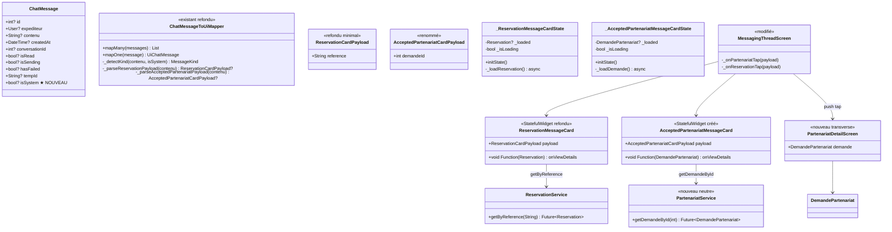
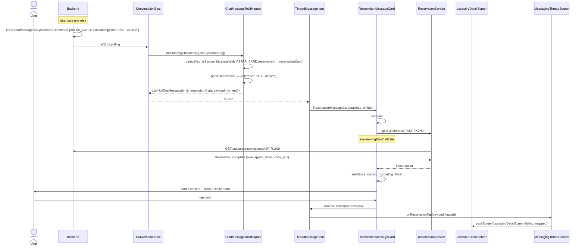

# 🏗️ Architecture — V9.2 Cards système + map align

> **Version :** 1.0
> **Date :** 2026-05-11
> **Mode :** Projet existant
> **Basée sur :** `.ai-outputs/specs/v9-2-cards-systeme-map-align/business-spec.md`

---

## 1. Vue d'ensemble

### Objectif
Intégrer le brief backend du 2026-05-11 en 4 lots (cards système, cleanup AddressReq, conv mixte, docs). Activer la chaîne dormante de cards riches dans le chat avec lazy fetch + skeleton + fallback erreur.

### 🎁 Découvertes structurantes — audit code

| Composant | État | Notes |
|---|---|---|
| `DemandePartenariat` model | ✅ existe `lib/model/partenariat/demande_partenariat.dart` | Tous les champs requis (id, createdAt, repondueAt, demarcheur Map, proprietaire Map, statut). Helpers `nomDemarcheur`, `telephoneDemarcheur`, `initDemarcheur` déjà présents. **Réutilisation 100%.** |
| `PartenariatProprioService` | ⚠️ existe partiellement | A `getDemandes()`, `accepterDemande(id)`, `refuserDemande(id)`. **Manque `getDemandeById(id)`** — méthode à ajouter (~10 lignes). |
| `ReservationService` | ⚠️ existe partiellement | A `getUserReservations()`, `createReservation()`, `cancelReservation()`, etc. **Manque `getByReference(String)`** — méthode à ajouter. |
| `ChatMessage` Hive model | ❌ Pas de champ `isSystem` | À ajouter `@HiveField(9) bool? isSystem` — Hive tolère ajout nullable sans bump typeId. |
| `ChatMessageToUiMapper` | ⚠️ Détecte préfixes mais payload null | À refondre : parsing JSON minimaliste `{"ref":"..."}` ou `{"id":N}` + détection via `isSystem`. Renommer `_referralPrefix` → `_partenariatPrefix`. |
| `ReservationMessageCard` | ⚠️ StatelessWidget, payload fourni | À refondre en StatefulWidget avec `initState` lazy fetch. |
| `AcceptedReferralMessageCard` | ⚠️ Renommer en `AcceptedPartenariatMessageCard` | À refondre en StatefulWidget. |
| `AcceptedReferralCardPayload` | ⚠️ Renommer `AcceptedPartenariatCardPayload` | Champ `int demandeId` au lieu de `String referralCode + contextLabel + commission`. |
| `MessagingThreadScreen` | ⚠️ `_onReferralTap` à renommer `_onPartenariatTap` + push `PartenariatDetailScreen` au lieu de `ReferralDetailScreen` | Le push push direct depuis card (déjà passé à V9.2 spec). |
| `ConversationToPreviewMapper._otherParty` / `_roleFor` | ⚠️ Audit requis | Probable assomption locataire/proprio à élargir pour démarcheur. |
| `Address.toJson()` | ⚠️ Envoie `geoLat/geoLongi` | À nettoyer dans `AppartementBackendMapper.toCreatePayload`. |
| `PartenariatDetailScreen` transverse | ❌ N'existe pas | À créer, distinct de `ReferralDetailScreen` (démarcheur V9.6 reste inchangé). |
| `ReferralDetailScreen` (démarcheur V9.6) | ✅ Reste inchangé | C'est un autre flow (démarcheur sur sa liste de référence client). |

### Composants à créer (4)
- `lib/screen/client/shared/partenariats/partenariat_detail_screen.dart` — écran transverse
- `lib/screen/client/shared/partenariats/widget/partenariat_detail_loading_view.dart` — skeleton fullscreen (si utile)
- `lib/screen/client/shared/inbox/widget/accepted_partenariat_message_card.dart` — renommé de `accepted_referral_message_card.dart`
- `lib/model/ui_only/accepted_partenariat_card_payload.dart` — renommé de `accepted_referral_card_payload.dart`

### Composants à modifier (8)
- `lib/model/conversation/chat_message.dart` — + champ `isSystem`
- `lib/model/ui_only/reservation_card_payload.dart` — champ `reference: String` à la place de richesse listing (refonte payload minimal)
- `lib/util/mapping/chat_message_to_ui.dart` — parsing payloads + détection `isSystem`
- `lib/screen/client/shared/inbox/widget/reservation_message_card.dart` — StatefulWidget + lazy fetch
- `lib/screen/client/shared/inbox/widget/thread_message_item.dart` — type signature `AcceptedPartenariatCardPayload`
- `lib/screen/client/shared/inbox/widget/thread_messages_list.dart` — idem cascade
- `lib/screen/client/shared/inbox/messaging_thread_screen.dart` — push `PartenariatDetailScreen` + handler `_onPartenariatTap`
- `lib/util/mapping/conversation_to_preview.dart` — gérer demarcheur dans `_otherParty` et `_roleFor`
- `lib/service/model/proprietaire/partenariat_proprio_service.dart` — ajouter `getDemandeById(int id)`
- `lib/service/model/booking/reservation_service.dart` — ajouter `getByReference(String reference)`
- `lib/service/model/appartement/appartement_backend_mapper.dart` — stripper `geoLat/geoLongi` dans payload create

### Composants à supprimer (2)
- `lib/model/ui_only/accepted_referral_card_payload.dart` (remplacé par `accepted_partenariat_card_payload.dart`)
- `lib/screen/client/shared/inbox/widget/accepted_referral_message_card.dart` (remplacé par `accepted_partenariat_message_card.dart`)

### Décisions techniques clés

**D1 — Hive `ChatMessage` ajout `isSystem`** : ajouter `@HiveField(9) bool? isSystem` (nullable, defaultValue false). Hive **tolère** l'ajout de champs nullable sans bumper `typeId`. Boxes existantes restent compatibles : si pas de field 9, lecture retourne null → traité comme false côté code (`isSystem == true`).

**D2 — Modèle `DemandePartenariat`** : **réutiliser tel quel** (déjà existe avec tous les champs). Le `nomDemarcheur` / `telephoneDemarcheur` helpers sont prêts. Si besoin du proprio symétrique, ajouter `nomProprietaire` / `telephoneProprietaire` (pas obligatoire pour V9.2).

**D3 — Service `getDemandeById`** : ajouter à `PartenariatProprioService` (route `GET /api/demande-partenariat/{id}` selon brief — pattern différent de `/api/proprietaire/partenariat/demandes/{id}/accepter` qui est en `api/proprietaire/...`). Si conflit de routing : créer un service neutre `PartenariatService` (sans préfixe rôle). **Décision** : créer un service neutre transverse `PartenariatService` (singleton, factory) qui a juste `getDemandeById`. Laisser `PartenariatProprioService` pour les actions liées au rôle proprio.

**D4 — Service `ReservationService.getByReference`** : ajouter dans `lib/service/model/booking/reservation_service.dart`. Route `GET /api/user/reservations/{reference}` selon brief. Retourne `Reservation` complète.

**D5 — `PartenariatDetailScreen` transverse** : placement `lib/screen/client/shared/partenariats/` (cohérent avec `partenariats_screen.dart` V9.6 transverse). UI simple : header DynamicAppBar, info card (statut, dates), 2 partyCards (démarcheur + proprio avec nom + téléphone), actions (Contacter via tel: → réutilise `LaunchExternalMapsHelper`-like pattern ou direct `url_launcher`).

**D6 — Payload minimal `ReservationCardPayload`** : refonte du modèle existant pour ne porter que la `reference: String` (alignement brief Option C minimaliste). Suppression des champs `listing`, `dates`, `bookingCode` qui seront récupérés via lazy fetch. **Breaking change interne** mais aucune utilisation runtime en dehors du mapper actuel (qui passe null).

**D7 — `Address.toJson()` cleanup** : approche moins invasive — modifier `AppartementBackendMapper._buildLegacyResidenceShape` pour stripper `geoLat`/`geoLongi` du sub-JSON address avant envoi. Garde `Address.toJson()` intact pour le reste de l'app.

**D8 — Renommage `_onReferralTap` → `_onPartenariatTap`** : breaking interne minimal (renommage symétrique), aucun callsite externe.

---

## 2. Diagramme de classes



---

## 3. Diagramme de séquence — flow card système



---

## 4. Structure des fichiers

```
lib/
├── model/
│   ├── conversation/
│   │   └── chat_message.dart                          🔧 +isSystem field
│   ├── partenariat/
│   │   └── demande_partenariat.dart                   ✓ inchangé
│   └── ui_only/
│       ├── reservation_card_payload.dart              🔧 refonte minimal (reference)
│       ├── accepted_referral_card_payload.dart        ❌ SUPPRIMER
│       └── accepted_partenariat_card_payload.dart     ✅ CRÉER
│
├── util/mapping/
│   └── chat_message_to_ui.dart                        🔧 parsing payloads + isSystem
│
├── service/model/
│   ├── booking/
│   │   └── reservation_service.dart                   🔧 +getByReference
│   ├── proprietaire/
│   │   └── partenariat_proprio_service.dart           ✓ inchangé (rôle proprio)
│   ├── partenariat/
│   │   └── partenariat_service.dart                   ✅ CRÉER (transverse +getDemandeById)
│   └── appartement/
│       └── appartement_backend_mapper.dart            🔧 stripper geoLat/geoLongi
│
└── screen/client/shared/
    ├── inbox/
    │   ├── messaging_thread_screen.dart               🔧 _onPartenariatTap + push PartenariatDetailScreen
    │   └── widget/
    │       ├── thread_message_item.dart               🔧 type cascade
    │       ├── thread_messages_list.dart              🔧 type cascade
    │       ├── reservation_message_card.dart          🔧 StatefulWidget lazy fetch
    │       ├── accepted_referral_message_card.dart    ❌ SUPPRIMER
    │       └── accepted_partenariat_message_card.dart ✅ CRÉER StatefulWidget lazy fetch
    └── partenariats/
        ├── partenariat_detail_screen.dart             ✅ CRÉER transverse
        └── widget/
            ├── partenariat_detail_party_card.dart     ✅ CRÉER (démarcheur OU proprio)
            └── partenariat_detail_status_section.dart ✅ CRÉER (eyebrow + chip statut + dates)
```

**Bilan** : 6 fichiers créés, 9 modifiés, 2 supprimés.

---

## 5. CONTRAT D'IMPLÉMENTATION

> Loi pour l'agent Dev. Aucun item ne peut être ignoré.

### Modèles

- [ ] **MODIFIER** `lib/model/conversation/chat_message.dart`
  - Ajouter `@HiveField(9) bool? isSystem;`
  - Constructeur : `this.isSystem`
  - `fromJson` : `isSystem = json['isSystem'] ?? false;`
  - `toJson` : `data['isSystem'] = isSystem ?? false;`
  - `copyWith` : ajouter param `bool? isSystem`
  - **PAS de bump typeId** (compat boxes existantes)

- [ ] **REFONDRE** `lib/model/ui_only/reservation_card_payload.dart`
  - Garder uniquement `final String reference;`
  - Constructeur const `ReservationCardPayload({required this.reference})`
  - Retirer les anciens champs (`listing`, `dates`, `bookingCode`)
  - Le widget reconstruit la richesse via lazy fetch

- [ ] **CRÉER** `lib/model/ui_only/accepted_partenariat_card_payload.dart`
  - `class AcceptedPartenariatCardPayload { final int demandeId; const AcceptedPartenariatCardPayload({required this.demandeId}); }`

- [ ] **SUPPRIMER** `lib/model/ui_only/accepted_referral_card_payload.dart`

### Services

- [ ] **MODIFIER** `lib/service/model/booking/reservation_service.dart`
  - Ajouter `Future<Reservation> getByReference(String reference)` :
    ```dart
    final dio = DioRequest.instance;
    final response = await dio.get("api/user/reservations/$reference");
    // Parse via .body comme le pattern existant
    return Reservation.fromJson(...);
    ```
  - Format réponse standard Asfar `{body: {...}, message: "..."}`

- [ ] **CRÉER** `lib/service/model/partenariat/partenariat_service.dart`
  - Singleton factory pattern (cf. `MapService` ou autres existants)
  - Méthode `Future<DemandePartenariat> getDemandeById(int id)` :
    ```dart
    final dio = DioRequest.instance;
    final response = await dio.get("api/demande-partenariat/$id");
    final serverResponse = ServerResponse.fromJson(response.data, (body) =>
        DemandePartenariat.fromJson(body as Map<String, dynamic>));
    return serverResponse.body;
    ```

- [ ] **MODIFIER** `lib/service/model/appartement/appartement_backend_mapper.dart`
  - Dans `_buildLegacyResidenceShape`, après `shape['address'] = appart.address!.toJson()` :
    ```dart
    (shape['address'] as Map<String, dynamic>)
      ..remove('geoLat')
      ..remove('geoLongi');
    ```
  - Le backend calcule `geoLat/geoLongi` via geocoding auto désormais

### Mapper

- [ ] **REFONDRE** `lib/util/mapping/chat_message_to_ui.dart`
  - Renommer `_referralPrefix` → `_partenariatPrefix` valeur `[ASFAR_CARD:partenariat]`
  - `_detectKind(contenu, isSystem)` :
    - Si `isSystem != true` → `MessageKind.text`
    - Si commence par `_reservationPrefix` → `reservationCard`
    - Si commence par `_partenariatPrefix` → `acceptedPartenariatCard` (à renommer dans `MessageKind` enum)
  - `mapOne` :
    - Parse le JSON suffixe via `jsonDecode(contenu.substring(prefix.length))`
    - Construit `ReservationCardPayload(reference: jsonMap['ref'] as String)`
    - Construit `AcceptedPartenariatCardPayload(demandeId: jsonMap['id'] as int)`
    - Si parse échoue → fallback `MessageKind.text` (résilient)

- [ ] **MODIFIER** `lib/model/ui_only/chat_message.dart` (énumération `MessageKind`)
  - Renommer `acceptedReferralCard` → `acceptedPartenariatCard`
  - Renommer champ `acceptedReferral` → `acceptedPartenariat` dans `ChatMessage` UI

### Widgets cards (StatefulWidget refondus)

- [ ] **REFONDRE** `lib/screen/client/shared/inbox/widget/reservation_message_card.dart`
  - Devient `StatefulWidget`
  - Params : `ReservationCardPayload payload`, `void Function(Reservation? loaded)? onTap`
  - State : `Reservation? _loaded`, `bool _isLoading = true`, `bool _failed = false`
  - `initState` : appelle `ReservationService.getByReference(widget.payload.reference)`
  - Skeleton : zones `bgElev2` sur titre/dates pendant `_isLoading`
  - Fallback erreur : titre = `'Réservation ${payload.reference}'`, sub-line = chip discret "Indisponible" `text3`
  - Tap : `onTap?.call(_loaded)` — si `_loaded != null`, le parent push DetailScreen ; sinon SnackBar fallback
  - `mounted` checks systématiques avant `setState`

- [ ] **CRÉER** `lib/screen/client/shared/inbox/widget/accepted_partenariat_message_card.dart`
  - `StatefulWidget`
  - Params : `AcceptedPartenariatCardPayload payload`, `void Function(DemandePartenariat? loaded)? onTap`
  - State : `DemandePartenariat? _loaded`, `bool _isLoading = true`, `bool _failed = false`
  - `initState` : appelle `PartenariatService().getDemandeById(widget.payload.demandeId)`
  - Skeleton + fallback : identique pattern card résa
  - Visuel : icon `Icons.handshake_outlined` accent, chip "Demande acceptée" success
  - Sub-line : `nomDemarcheur` (depuis `_loaded`) si chargé, sinon `'Partenariat #${demandeId}'`

- [ ] **SUPPRIMER** `lib/screen/client/shared/inbox/widget/accepted_referral_message_card.dart`

### Widgets cascade (signatures)

- [ ] **MODIFIER** `lib/screen/client/shared/inbox/widget/thread_message_item.dart`
  - Renommer `onReferralTap` → `onPartenariatTap`
  - Type signature : `void Function(AcceptedPartenariatCardPayload payload)?`
  - Switch case `MessageKind.acceptedReferralCard` → `MessageKind.acceptedPartenariatCard`
  - Render `AcceptedPartenariatMessageCard` (au lieu de `AcceptedReferralMessageCard`)

- [ ] **MODIFIER** `lib/screen/client/shared/inbox/widget/thread_messages_list.dart`
  - Cascade : `onReferralTap` → `onPartenariatTap`
  - Cascade type signature

### Écran transverse Partenariat

- [ ] **CRÉER** `lib/screen/client/shared/partenariats/partenariat_detail_screen.dart`
  - `StatelessWidget` avec param `DemandePartenariat demande`
  - Layout : `Scaffold` `bgElev0` `background` + `DynamicAppBar('Demande de partenariat')` + body scroll
  - Sections :
    - `PartenariatDetailStatusSection` : eyebrow STATUT + chip statut accent/success/danger + dates (envoyée le ... / répondue le ...)
    - `PartenariatDetailPartyCard(title: 'Démarcheur', nom: demande.nomDemarcheur, tel: demande.telephoneDemarcheur, onCall:...)`
    - `PartenariatDetailPartyCard(title: 'Propriétaire', nom: demande.proprietaire.toString(), tel: demande.proprietaire['telephone'])`
    - Bouton CTA "Ouvrir la conversation" (optionnel V10, pas obligatoire MVP)
  - `onCall` : `launchUrl(Uri(scheme: 'tel', path: phone))` — réutilise pattern V9.7c/V8 phone branchement

- [ ] **CRÉER** `lib/screen/client/shared/partenariats/widget/partenariat_detail_party_card.dart`
  - StatelessWidget avec params `{required String title, required String nom, required String tel, VoidCallback? onCall}`
  - Container bgElev1 + border line + padding 16 + Row [Avatar/initials + Column[label + nom] + bouton phone IconBoutton]

- [ ] **CRÉER** `lib/screen/client/shared/partenariats/widget/partenariat_detail_status_section.dart`
  - StatelessWidget avec params `{required StatutPartenariat statut, required DateTime createdAt, DateTime? repondueAt}`
  - Container bgElev1 + Column [eyebrow + chip statut + sub-line "Envoyée le X / Répondue le Y"]

### Push tap card

- [ ] **MODIFIER** `lib/screen/client/shared/inbox/messaging_thread_screen.dart`
  - Renommer `_onReferralTap` → `_onPartenariatTap`
  - Signature `void Function(AcceptedPartenariatCardPayload payload)`
  - Implémentation :
    ```dart
    void _onPartenariatTap(AcceptedPartenariatCardPayload payload) {
      // La card a déjà fetché le DemandePartenariat dans son initState
      // On lui demande de nous le passer via le callback onViewDetails
      // → Pattern : la card invoque onTap(loaded?) qui appelle ce handler avec
      //   le DemandePartenariat ou null si fetch échoué.
    }
    ```
  - Ajuster le signal : signature de callback dans `ThreadMessageItem.onPartenariatTap` doit recevoir `DemandePartenariat? loaded` (pattern identique à card réservation)
  - Push : `pushScreen(context, PartenariatDetailScreen(demande: loaded))` si loaded non-null, sinon SnackBar

- [ ] **MODIFIER** `lib/screen/client/shared/inbox/widget/thread_message_item.dart` (à nouveau)
  - Signature de `onPartenariatTap` : `void Function(DemandePartenariat? loaded)?`
  - Le widget `AcceptedPartenariatMessageCard.onTap` reçoit le `DemandePartenariat?` chargé localement et le passe au parent
  - Cascade identique pour `onReservationTap` qui doit maintenant prendre `Reservation? loaded`

### Mapper conversation mixte

- [ ] **MODIFIER** `lib/util/mapping/conversation_to_preview.dart`
  - `_otherParty` : actuellement check `c.proprietaire/c.locataire` — élargir pour gérer `c.demarcheur` si le modèle `Conversation` l'a (à vérifier)
  - `_roleFor` : si `me.type == 'proprietaire'` ET l'interlocuteur est démarcheur → retourner `ConversationRole.demarcheur` (au lieu de `tenant` par défaut)
  - Audit : si `Conversation` model ne porte pas `demarcheur`, il faut peut-être un champ neutre `secondParty: User?` ou exploiter `locataire` polymorphe (Locataire extends Client ; Démarcheur extends Client)

### Modifications légères

- [ ] Le payload `phone` du `ConversationPreview` (déjà ajouté V8.x) doit aussi être pris en compte pour les démarcheurs (User.telephone fonctionne pareil)

---

## 6. Plan d'implémentation (ordre)

1. **Modèles** : `ChatMessage.isSystem`, `ReservationCardPayload` refonte, `AcceptedPartenariatCardPayload` créé, `MessageKind` énum renommage, `ChatMessage` UI champ renommé
2. **Mapper** : `ChatMessageToUiMapper` parsing
3. **Services** : `ReservationService.getByReference`, `PartenariatService.getDemandeById`
4. **Cards** : refondre `ReservationMessageCard` + créer `AcceptedPartenariatMessageCard` + supprimer ancien
5. **Cascade** : `ThreadMessageItem`, `ThreadMessagesList` (signatures avec loaded)
6. **Écran** : `PartenariatDetailScreen` + 2 widgets internes
7. **Push** : `MessagingThreadScreen._onPartenariatTap` + `_onReservationTap` adapté
8. **Cleanup** : `AppartementBackendMapper` retrait geoLat/geoLongi
9. **Conv mixte** : audit `ConversationToPreviewMapper`
10. **Docs** : update 3 fichiers BACKEND_NOTES + RECONSTRUCTION
11. **Gates** : `flutter analyze` 0 nouvelle erreur + `grep "Widget _"` vide

---

## 7. Risques & Mitigation

| Risque | Probabilité | Impact | Mitigation |
|---|---|---|---|
| Hive `typeId 1` incompat boxes existantes | Faible | Crash au lecture | Hive tolère champs nullable ajoutés. Test : ouvrir l'app avec une box pré-V9.2 — doit fonctionner. Si problème → bump typeId 2 et migrer en cleanup app. |
| Spam fetches lazy si conv = 100 cards | Faible | Performance | Pas de mitigation MVP. Cache HTTP standard. Si problème → cache local TTL court (V10). |
| Conv `Conversation` model n'a pas `demarcheur` field | Moyenne | conv mixte cassée | Audit lib/model/conversation/conversation.dart. Si besoin, élargir champ générique `secondParty`. |
| Routes backend pas exactement comme prévu | Faible | Erreurs 404 | Tester avec curl avant intégration (déjà fait pour `/api/lieux/pays`). |
| `Address.toJson` modification casse édition existante | Moyenne | Update appartement plante | Garder `Address.toJson()` intact, ne stripper que dans `AppartementBackendMapper.toCreatePayload` (pas `toUpdatePayload` si différent). |

---

## 8. Flag UI

```
UI_REQUIRED: true
```

> Nouvelle UI requise :
> - Cards refondues StatefulWidget avec skeleton bgElev2 + fallback erreur (visuel à valider)
> - `PartenariatDetailScreen` + 2 widgets internes (`PartenariatDetailPartyCard`, `PartenariatDetailStatusSection`)
> - Layout du skeleton card (zone grise sur titre + dates, ou shimmer ?)
> - Visuel du chip "Indisponible" en mode erreur (couleur, padding, fontSize)
