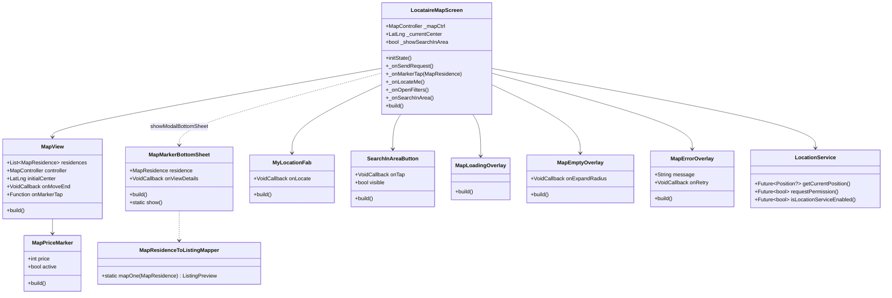

# 🏗️ Architecture Technique — V9.7 Carte Interactive

## 1. Vue d'ensemble

### Objectif

Écran cartographique interactif `LocataireMapScreen` qui consomme le
`MapBloc` existant (LoadFilteredMapResidences + states
MapResidencesLoaded/MapEmpty/MapError), avec géolocalisation réelle
(geolocator), markers prix individuels, bottom sheet preview, FAB
position, et bouton "Rechercher dans cette zone".

### Surprise architecturale

**`flutter_map: ^8.1.1`, `latlong2: ^0.9.1`, `geolocator: ^14.0.1` sont
déjà présents dans `pubspec.yaml`.** Permissions Android
(`ACCESS_FINE_LOCATION` + `ACCESS_COARSE_LOCATION`) et iOS
(`NSLocationWhenInUseUsageDescription`) déjà déclarées. Ce sont les
vestiges de l'implémentation map supprimée pendant la reconstruction
V5-V8. **Aucune modification de pubspec/manifestes nécessaire.**

### Composants impactés

- ✅ **Existants à RÉUTILISER** :
  - `MapBloc` + `MapState` + `MapEvent` (events `LoadFilteredMapResidences`,
    states `MapInitial/Loading/ResidencesLoaded/Empty/Error/FilterUpdated`)
  - `MapResidence` (modèle avec `displayLat/displayLongi/minPrice/maxPrice/
    priceRange/communeName`)
  - `MapService` côté Spring Boot
  - `LocataireSearchScreen` (réutilisé pour filtres)
  - `LocataireDetailScreen` (push depuis BottomSheet)
  - `MapTeaser` du `LocataireHomeScreen` (juste wirer `onSeeMap`)
  - `FcfaFormatter.compact` (label prix marker)
  - `EmptyState.hero/inline/error` (états vide/erreur)

- 🆕 **Nouveaux fichiers** :
  - `lib/screen/client/locataire/map/locataire_map_screen.dart` (écran)
  - 8 widgets dédiés dans `lib/screen/client/locataire/map/widget/`
  - `lib/util/location_service.dart` (wrapper geolocator)
  - `lib/util/mapping/map_residence_to_listing.dart` (mapper bottomsheet)

### Décision : pas d'onglet BottomNav "Map"

Le `LocataireShell` a 5 onglets (`Explorer/Voyages/Favoris/Messages/
Profil`). Ajouter un 6ème surcharge la barre. L'écran sera **accessible
via push** depuis :
- `MapTeaser.onSeeMap` (Home locataire, section "Près de vous")
- Bouton "Voir carte" du `SectionHeader` "Près de vous" (action wirée
  inline V9.7)

Préserve la cohérence des 5 onglets et le pattern de découverte
secondaire du proto.

---

## 2. Diagrammes

### 2.1 Diagramme de classes



### 2.2 Diagramme de séquence

```mermaid
sequenceDiagram
    participant User
    participant LocataireMapScreen as Screen
    participant LocationService as LocSrv
    participant MapBloc
    participant MapService as Backend

    User->>Screen: Tape "Voir carte" (MapTeaser)
    Screen->>Screen: pushScreen(LocataireMapScreen)
    Screen->>MapBloc: LoadFilteredMapResidences(abidjan, 10km)
    MapBloc->>Backend: GET /api/.../residences
    Backend-->>MapBloc: List~MapResidence~
    MapBloc->>Screen: MapResidencesLoaded(residences[])
    Screen->>User: Markers visibles sur carte OSM

    User->>Screen: Tape FAB "Ma position"
    Screen->>LocSrv: getCurrentPosition()
    LocSrv->>LocSrv: requestPermission() if needed
    alt Permission accordée
        LocSrv-->>Screen: LatLng(user)
        Screen->>Screen: mapCtrl.move(userLatLng, 13)
    else Permission refusée
        Screen->>User: SnackBar "Activez la géoloc"
    end

    User->>Screen: Pan/zoom la carte
    Screen->>Screen: onMoveEnd → _showSearchInArea = true
    User->>Screen: Tape "Rechercher dans cette zone"
    Screen->>MapBloc: LoadFilteredMapResidences(newCenter, radius)
    MapBloc-->>Screen: MapResidencesLoaded(newResidences)
    Screen->>Screen: _showSearchInArea = false

    User->>Screen: Tape marker
    Screen->>Screen: showModalBottomSheet(MapMarkerBottomSheet)
    User->>Screen: Tape "Voir détails"
    Screen->>Screen: pushScreen(LocataireDetailScreen(listing))

    User->>Screen: Tape "Filtrer" top-right
    Screen->>Screen: pushScreen(LocataireSearchScreen)
    Screen-->>User: Retour avec filtres appliqués (V9.7 : pas de roundtrip,
                                                    juste reload sur retour)
```

---

## 3. Structure des fichiers

```
lib/
├── screen/client/locataire/
│   └── map/                                            🆕
│       ├── locataire_map_screen.dart                  🆕
│       └── widget/
│           ├── map_view.dart                           🆕
│           ├── map_price_marker.dart                   🆕
│           ├── map_marker_bottom_sheet.dart            🆕
│           ├── my_location_fab.dart                    🆕
│           ├── search_in_area_button.dart              🆕
│           ├── map_loading_overlay.dart                🆕
│           ├── map_empty_overlay.dart                  🆕
│           └── map_error_overlay.dart                  🆕
├── util/
│   ├── location_service.dart                          🆕
│   └── mapping/
│       └── map_residence_to_listing.dart              🆕
└── screen/client/locataire/home/home_screen.dart      ✏️ modifié
                                  (MapTeaser.onSeeMap → push)
```

---

## 4. Interfaces / Contrats

### LocationService

```dart
class LocationService {
  static const _abidjanFallback = LatLng(5.345, -4.024);

  /// Retourne la position user OU `_abidjanFallback` si refusée/indisponible.
  /// Demande la permission OS au premier appel.
  static Future<LatLng> getCurrentPositionOrFallback();

  /// Renvoie true si la permission est accordée (sans la demander).
  static Future<bool> hasPermission();
}
```

### MapResidenceToListingMapper

```dart
class MapResidenceToListingMapper {
  /// Mappe un MapResidence vers ListingPreview pour push vers DetailScreen.
  /// Les champs absents de MapResidence (rating, reviews, beds, baths,
  /// surface, imageUrl) reçoivent des fallbacks neutres.
  static ListingPreview mapOne(MapResidence residence);
}
```

### MapView (réutilisable)

```dart
class MapView extends StatelessWidget {
  final List<MapResidence> residences;
  final MapController controller;
  final LatLng initialCenter;
  final double initialZoom; // défaut 12
  final VoidCallback? onMoveEnd;
  final void Function(MapResidence)? onMarkerTap;
}
```

### LocataireMapScreen (orchestrateur)

```dart
class LocataireMapScreen extends StatefulWidget {
  /// Centre initial optionnel. Si null, charge la position user
  /// (avec fallback Abidjan).
  final LatLng? initialCenter;
}
```

---

## 5. CONTRAT D'IMPLÉMENTATION

### Pages / Routes
- [ ] `LocataireMapScreen` → écran cartographique accessible via push
  depuis `MapTeaser.onSeeMap` du `LocataireHomeScreen`

### Composants / Widgets (lib/screen/client/locataire/map/)
- [ ] `LocataireMapScreen` (StatefulWidget) → orchestrateur principal,
  gère `MapController`, `_currentCenter`, `_showSearchInArea`, callbacks
- [ ] `MapView` (StatelessWidget) → wrapper `FlutterMap` avec tuiles OSM
  (`https://tile.openstreetmap.org/{z}/{x}/{y}.png`), MarkerLayer
- [ ] `MapPriceMarker` (StatelessWidget) → pill accent affichant prix
  compact (`45k`/`1.2M` via `FcfaFormatter.compact`)
- [ ] `MapMarkerBottomSheet` (StatelessWidget) → bottom sheet preview
  d'une `MapResidence` : image placeholder + nom + priceRange +
  communeName + bouton "Voir détails"
- [ ] `MyLocationFab` (StatelessWidget) → FAB rond accent or icon
  `Icons.my_location` qui dispatche `onLocate`
- [ ] `SearchInAreaButton` (StatelessWidget) → chip top-center visible
  si `visible=true`, label "Rechercher dans cette zone" + icon refresh
- [ ] `MapLoadingOverlay` (StatelessWidget) → shimmer non-bloquant
  overlay (semi-transparent + ProgressIndicator centré)
- [ ] `MapEmptyOverlay` (StatelessWidget) → `EmptyState.inline` centré
  "Aucun logement en zone" + CTA "Élargir la zone"
- [ ] `MapErrorOverlay` (StatelessWidget) → `EmptyState.error` centré
  + bouton "Réessayer"

### Services / Helpers
- [ ] `LocationService` (lib/util/location_service.dart) → wrapper
  geolocator : `getCurrentPositionOrFallback()`, `hasPermission()`.
  Fallback Abidjan `(5.345, -4.024)`.
- [ ] `MapResidenceToListingMapper` (lib/util/mapping/) →
  `mapOne(MapResidence): ListingPreview` pour push detail screen

### Modèles / Entités
- [ ] **Aucun nouveau modèle** — réutilise `MapResidence`, `ListingPreview`,
  `Address` existants

### Fichiers à modifier
- [ ] `lib/screen/client/locataire/home/home_screen.dart` →
  `_onSeeMap()` push `LocataireMapScreen` (au lieu de SnackBar stub
  actuel)

### Pas de modification nécessaire
- ❌ `pubspec.yaml` — `flutter_map: ^8.1.1`, `latlong2: ^0.9.1`,
  `geolocator: ^14.0.1` déjà présents
- ❌ `AndroidManifest.xml` — permissions déjà déclarées
- ❌ `Info.plist` — `NSLocationWhenInUseUsageDescription` déjà déclaré
- ❌ `MapBloc` — pas de nouvel event, on consomme `LoadFilteredMapResidences`
  existant

---

## 6. Patterns à respecter

1. **Règle Flutter n°1** : ZÉRO fonction privée renvoyant `Widget`.
   Chaque sous-composant = widget dédié dans son propre fichier. Le
   `LocataireMapScreen` orchestre uniquement (build inline dans
   `Stack`), tout sous-widget UI est extrait.
2. **BlocBuilder pattern** : `BlocBuilder<MapBloc, MapState>` avec
   pattern matching (`is MapLoading` / `is MapResidencesLoaded` /
   `is MapError` / `is MapEmpty`) pour choisir overlay.
3. **Loading non-bloquant** : la carte est toujours visible (tuiles
   OSM render), les overlays sont au-dessus mais semi-transparents.
4. **EmptyState** : 3 variantes (loading shimmer, empty CTA, error
   retry) — toutes existent déjà.
5. **Cache-first** : si `MapResidencesLoaded` revient avec un cache
   `residences` non-vide, render directement même pendant un nouveau
   load (pattern V8.5).
6. **SOLID** :
   - `LocationService` = SRP (gestion permission + position uniquement)
   - `MapResidenceToListingMapper` = SRP (mapping uniquement)
   - Widgets = OCP (props bien définies, callbacks externalisés)
7. **Constantes** :
   - Centre Abidjan : `LatLng(5.345, -4.024)` dans `LocationService`
   - Zoom initial : 12 (ville visible)
   - Radius par défaut : 10 km
   - Tile URL OSM : `https://tile.openstreetmap.org/{z}/{x}/{y}.png`

---

## 7. Risques identifiés

1. **MapResidence.displayLat/displayLongi peuvent être null** →
   filtrer en amont dans `LocataireMapScreen` avant de passer à
   `MapView`.
2. **Permission Android 33+ peut être deny-by-default** → gérer le
   cas via `LocationService.requestPermission()` qui retourne false.
3. **Tile loading sur 3G/4G** : 2-3s — pas de blocage UI, juste les
   markers attendent les tuiles.
4. **flutter_map MapController** : nécessite d'être disposé proprement
   → `dispose()` du screen.
5. **Filter LocataireSearchScreen** : le retour de SearchScreen ne
   reload pas automatiquement la carte en V9.7. Le user doit taper
   "Rechercher dans cette zone" pour appliquer. Acceptable pour MVP.
6. **iOS simulator** : pas de GPS réel — fallback Abidjan se
   déclenchera systématiquement. Tester sur device réel.

---

## 8. Flag UI

```
UI_REQUIRED: true
```

(Feature à 100% visuelle : nouvel écran complet + 9 widgets visuels.)
