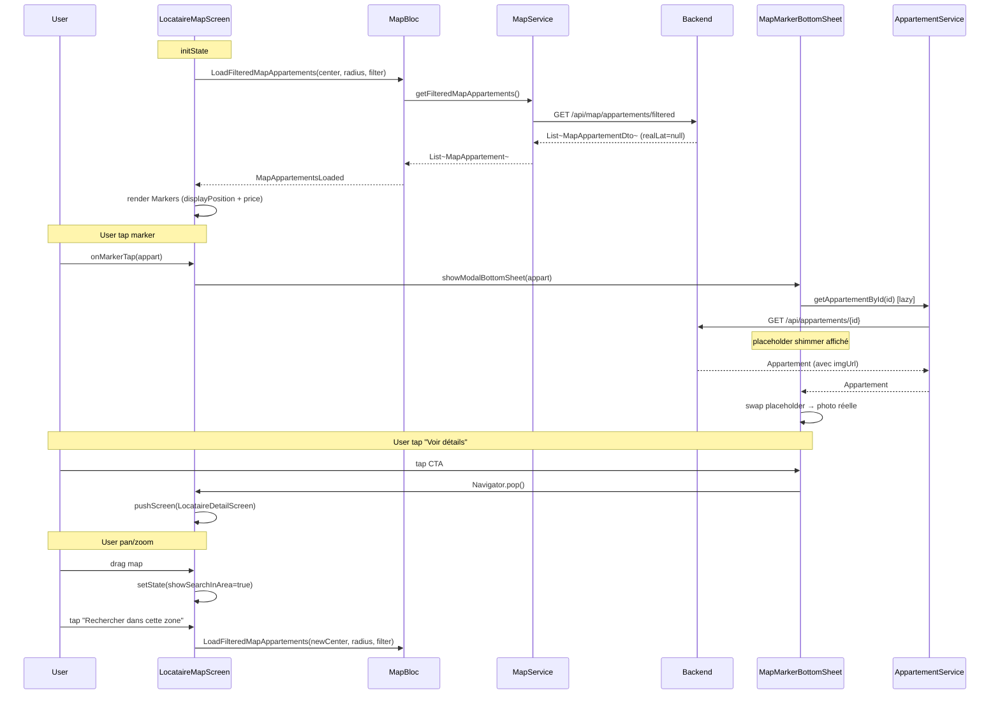
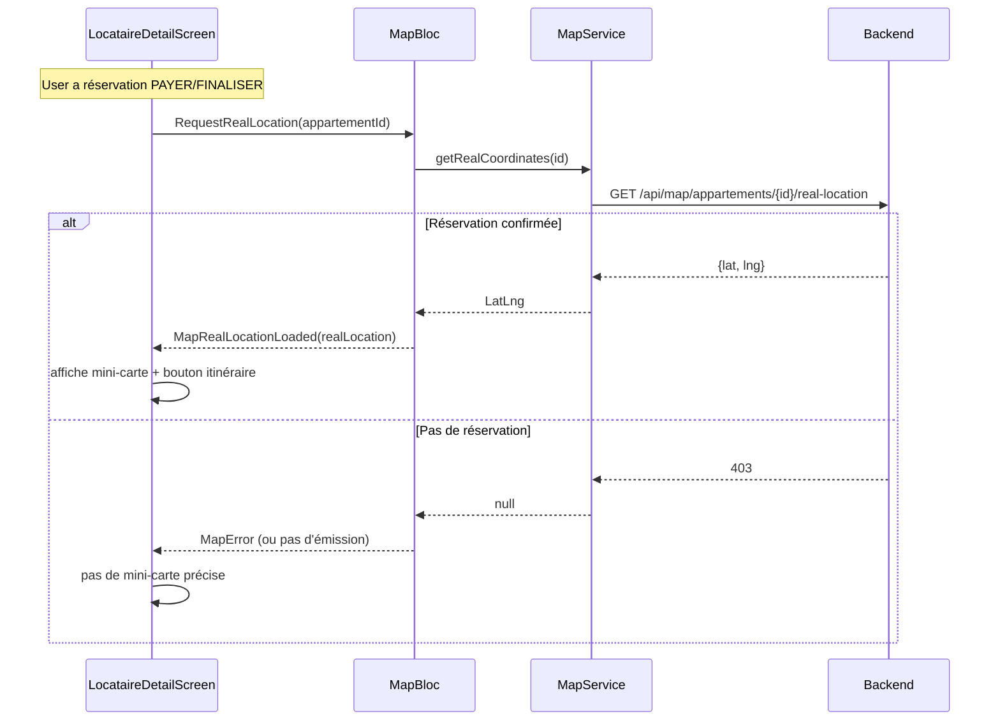

# 🏗️ Architecture — V9.7b Refonte Map Appartement

> **Version :** 1.0
> **Date :** 2026-05-11
> **Mode :** Projet existant (Flutter 3.7+, BLoC 9.1.1)
> **Basée sur :** `.ai-outputs/specs/v9-7b-map-appartement-refactor/business-spec.md`

---

## 1. Vue d'ensemble

### Objectif
Refondre toute la chaîne carte (model → service → bloc → screen → widget) pour passer du modèle agrégé `MapResidence` (groupe d'apparts) au modèle individuel `MapAppartement` (1 marker = 1 appart), tout en préservant la confidentialité des coordonnées exactes via le pattern dual coords (display obfusqué / real privé).

### Composants impactés (11 fichiers)
- **Supprimés (2)** : `MapResidence`, `MapResidenceToListingMapper`
- **Créés (2)** : `MapAppartement`, `MapAppartementToListingMapper`
- **Refondus (5)** : `MapBloc`, `MapEvent`, `MapState`, `MapService`, `MapMarkerBottomSheet`
- **Adaptés (2)** : `LocataireMapScreen`, `MapView`
- **Inchangés (V9.7)** : `MapPriceMarker`, `MyLocationFab`, `SearchInAreaButton`, `MapLoadingOverlay`, `MapEmptyOverlay`, `MapErrorOverlay`, `MapOverlayCard`

### Couches techniques inchangées
- `flutter_map ^8.1.1`, `geolocator ^14.0.1`, `latlong2 ^0.9.1` (déjà au pubspec)
- `LocationUtil` (réutilisé)
- `AppartementService.getAppartementById(int id)` (réutilisé pour le lazy détail)

### Décisions clés
- **Cluster supprimé** : `MapCluster`, `MapClustersLoaded`, `LoadClusteredMapResidences`, `ToggleClusterMode`, `getClusteredResidences` n'ont jamais été branchés à l'UI V9.7 et perdent leur sens métier sans résidence — **suppression franche** pour ne pas alourdir le code mort. À ré-introduire V10 si MVP montre besoin densité.
- **Constante websocket `REFRESH_MAP_RESIDENCES` conservée** : la chaîne d'action est un contrat backend ; côté Dart on renomme uniquement l'identifier en `refreshMapAppartements`, mais la chaîne JSON reçue reste `REFRESH_MAP_RESIDENCES` jusqu'à alignement backend (V10). Comportement identique : déclenche `RefreshMapData`.
- **Mapper partiel `MapAppartementToListingMapper`** : utilisé en fallback si le détail lazy échoue. En cas de succès, on push avec `AppartementToListingMapper.mapOne(loadedAppartement)` (complet, avec photo).

---

## 2. Diagramme de classes

```mermaid
classDiagram
    class MapAppartement {
        +int? id
        +String? title
        +String? reference
        +double? displayLat
        +double? displayLongi
        +double? realLat
        +double? realLongi
        +int? price
        +String? typeAppart
        +int? nbChambres
        +String? communeName
        +String? addressDescription
        +LatLng get displayPosition
        +LatLng? get realPosition
        +bool get hasValidDisplayCoordinates
        +MapAppartement.fromJson(Map json)
        +Map toJson()
    }

    class MapEvent {
        <<abstract>>
    }
    class LoadFilteredMapAppartements {
        +LatLng center
        +double radiusKm
        +FilterCriteria? filter
    }
    class SelectMapAppartement {
        +int appartementId
    }
    class LoadAppartementDetails {
        +int appartementId
    }
    class RequestRealLocation {
        +int appartementId
    }
    class UpdateMapCenter {
        +LatLng center
    }
    class UpdateMapFilter {
        +FilterCriteria? filter
    }
    class RefreshMapData
    class ClearMapSelection
    class ResetMapState

    MapEvent <|-- LoadFilteredMapAppartements
    MapEvent <|-- SelectMapAppartement
    MapEvent <|-- LoadAppartementDetails
    MapEvent <|-- RequestRealLocation
    MapEvent <|-- UpdateMapCenter
    MapEvent <|-- UpdateMapFilter
    MapEvent <|-- RefreshMapData
    MapEvent <|-- ClearMapSelection
    MapEvent <|-- ResetMapState

    class MapState {
        <<abstract>>
    }
    class MapInitial
    class MapLoading
    class MapAppartementsLoaded {
        +List~MapAppartement~ appartements
        +LatLng center
        +double radiusKm
        +FilterCriteria? filter
    }
    class MapAppartementSelected {
        +MapAppartement selectedAppartement
        +List~MapAppartement~? allAppartements
        +LatLng center
        +double radiusKm
        +FilterCriteria? filter
    }
    class MapAppartementDetailsLoaded {
        +MapAppartement appartementDetails
        +LatLng? realLocation
    }
    class MapRealLocationLoaded {
        +int appartementId
        +LatLng realLocation
    }
    class MapEmpty {
        +String message
    }
    class MapError {
        +String message
        +String? errorType
        +bool canRetry
    }
    class MapCenterUpdated {
        +LatLng center
    }
    class MapFilterUpdated {
        +FilterCriteria? filter
    }

    MapState <|-- MapInitial
    MapState <|-- MapLoading
    MapState <|-- MapAppartementsLoaded
    MapState <|-- MapAppartementSelected
    MapState <|-- MapAppartementDetailsLoaded
    MapState <|-- MapRealLocationLoaded
    MapState <|-- MapEmpty
    MapState <|-- MapError
    MapState <|-- MapCenterUpdated
    MapState <|-- MapFilterUpdated

    class MapBloc {
        -MapService _mapService
        -LatLng? _currentCenter
        -double _currentRadius
        -FilterCriteria? _currentFilter
        -List~MapAppartement~? _cachedAppartements
    }
    MapBloc --> MapService
    MapBloc --> MapAppartement
    MapBloc --> MapEvent
    MapBloc --> MapState

    class MapService {
        +getFilteredMapAppartements(center, radiusKm, filter)
        +getAppartementMapDetails(appartementId)
        +getRealCoordinates(appartementId)
    }
    MapService --> MapAppartement

    class MapAppartementToListingMapper {
        +mapOne(MapAppartement) ListingPreview
    }
    MapAppartementToListingMapper --> MapAppartement
```



---

## 3. Diagramme de séquence — Flow complet



### Flow secondaire — Position réelle (post-réservation)



---

## 4. Structure des fichiers

```
lib/
├── model/
│   └── map/
│       ├── map_residence.dart           ❌ SUPPRIMER
│       └── map_appartement.dart         ✅ CRÉER
│
├── bloc/
│   └── map_bloc/
│       ├── map_event.dart               ♻️ REFONDRE
│       ├── map_state.dart               ♻️ REFONDRE
│       └── map_bloc.dart                ♻️ REFONDRE
│
├── service/
│   └── model/
│       └── map/
│           └── map_service.dart         ♻️ REFONDRE
│
├── util/
│   └── mapping/
│       ├── map_residence_to_listing.dart   ❌ SUPPRIMER
│       └── map_appartement_to_listing.dart ✅ CRÉER (fallback)
│
└── screen/
    └── client/
        └── locataire/
            └── map/
                ├── locataire_map_screen.dart     🔧 ADAPTER
                └── widget/
                    ├── map_view.dart             🔧 ADAPTER
                    ├── map_marker_bottom_sheet.dart  ♻️ REFONDRE (photo lazy + push direct)
                    ├── map_price_marker.dart     ✓ INCHANGÉ
                    ├── my_location_fab.dart      ✓ INCHANGÉ
                    ├── search_in_area_button.dart ✓ INCHANGÉ
                    ├── map_loading_overlay.dart  ✓ INCHANGÉ
                    ├── map_empty_overlay.dart    ✓ INCHANGÉ
                    ├── map_error_overlay.dart    ✓ INCHANGÉ
                    └── map_overlay_card.dart     ✓ INCHANGÉ
```

**Note autres impacts** :
- `lib/service/realtime/realtime_action_handler.dart` : renommer méthode interne `_handleRefreshMapResidences` → `_handleRefreshMapAppartements` (chaîne JSON inchangée)
- `lib/model/websocket/websocket_state.dart` : renommer identifier `refreshMapResidences` → `refreshMapAppartements` (valeur string `REFRESH_MAP_RESIDENCES` conservée jusqu'à V10 backend)

---

## 5. CONTRAT D'IMPLÉMENTATION

> Ce contrat est la **loi** pour l'agent Dev. Aucun item ne peut être ignoré ou substitué.

### Modèles / Entités

- [ ] **CRÉER** `lib/model/map/map_appartement.dart`
  - Classe `MapAppartement` avec champs : `id`, `title`, `reference`, `displayLat`, `displayLongi`, `realLat`, `realLongi`, `price`, `typeAppart`, `nbChambres`, `communeName`, `addressDescription`
  - Constructeur nommé `MapAppartement.fromJson(Map<String, dynamic> json)` qui parse tous les champs (avec `?.toDouble()` sur lat/lng, fallback null safe)
  - Méthode `toJson()` (utile pour debug/cache, pas obligatoire pour MVP)
  - Getters : `LatLng get displayPosition`, `LatLng? get realPosition`, `bool get hasValidDisplayCoordinates`
  - Implémenter `==` et `hashCode` basés sur `id`
  - `toString()` minimal pour debug

- [ ] **SUPPRIMER** `lib/model/map/map_residence.dart` (incluant `MapResidence` et `MapCluster`)

### Services

- [ ] **REFONDRE** `lib/service/model/map/map_service.dart`
  - Garder le pattern `DioRequest.instance` existant
  - Méthode `Future<List<MapAppartement>> getFilteredMapAppartements({required LatLng center, double radiusKm = 10.0, FilterCriteria? filter})` :
    - URL : `$domain/api/map/appartements/filtered`
    - Query params identiques à l'ancienne (lat, lng, radius, prixMin, prixMax, nbLits, nbChambres, nbDouches, commodites, dateDebut, dateFin)
    - Parse réponse en `List<MapAppartement>`
  - Méthode `Future<LatLng?> getRealCoordinates(int appartementId)` :
    - URL : `$domain/api/map/appartements/{id}/real-location`
    - Retourne `null` si 403 ou erreur (pas d'exception)
  - **Supprimer** : `getMapResidences`, `getResidencesByIds`, `getResidenceDetails`, `getClusteredResidences`, `_performClustering`, `_calculateDistance`, `_calculateClusterCenter`

### BLoC

- [ ] **REFONDRE** `lib/bloc/map_bloc/map_event.dart`
  - Garder `MapEvent` abstrait
  - **Renommer/refondre** :
    - `LoadFilteredMapResidences` → `LoadFilteredMapAppartements`
    - `SelectMapResidence(residenceId)` → `SelectMapAppartement(appartementId)`
    - `LoadResidenceDetails(residenceId)` → `LoadAppartementDetails(appartementId)`
    - `RequestRealLocation(residenceId)` → `RequestRealLocation(appartementId)` (param renommé seulement)
  - **Garder inchangés** : `UpdateMapCenter`, `UpdateMapFilter`, `RefreshMapData`, `ClearMapSelection`, `ResetMapState`
  - **Supprimer** : `LoadMapResidences`, `LoadClusteredMapResidences`, `ToggleClusterMode`

- [ ] **REFONDRE** `lib/bloc/map_bloc/map_state.dart`
  - Garder `MapState`, `MapInitial`, `MapLoading`
  - **Renommer/refondre** :
    - `MapResidencesLoaded` → `MapAppartementsLoaded` portant `List<MapAppartement> appartements`, garder `center`, `radiusKm`, `filter` (supprimer `isClusterMode`)
    - `MapResidenceSelected` → `MapAppartementSelected` portant `MapAppartement selectedAppartement`, `List<MapAppartement>? allAppartements`, supprimer `clusters` et `isClusterMode`
    - `MapResidenceDetailsLoaded` → `MapAppartementDetailsLoaded` portant `MapAppartement appartementDetails`, garder `realLocation`
    - `MapRealLocationLoaded` : `residenceId` → `appartementId`
  - **Garder inchangés** : `MapError`, `MapNetworkError`, `MapLocationError`, `MapFilterUpdated`, `MapCenterUpdated`, `MapEmpty`
  - **Supprimer** : `MapClustersLoaded`

- [ ] **REFONDRE** `lib/bloc/map_bloc/map_bloc.dart`
  - Adapter tous les handlers : utiliser `MapAppartement` au lieu de `MapResidence`, supprimer le cache cluster (`_cachedClusters`), supprimer `_isClusterMode`
  - Handler `_onLoadFilteredMapAppartements` consomme `_mapService.getFilteredMapAppartements()` et emit `MapAppartementsLoaded` ou `MapEmpty`
  - Handler `_onSelectMapAppartement` cherche dans `_cachedAppartements` ; si pas trouvé, emit `MapError` (pas de fallback API car liste = source de vérité)
  - Handler `_onRequestRealLocation` inchangé fonctionnellement (juste renommer le param)
  - **Supprimer** handlers : `_onLoadMapResidences`, `_onLoadClusteredMapResidences`, `_onLoadResidenceDetails` (devient `_onLoadAppartementDetails`), `_onToggleClusterMode`

### Mappers

- [ ] **CRÉER** `lib/util/mapping/map_appartement_to_listing.dart`
  - Classe `MapAppartementToListingMapper` avec constructeur privé
  - Méthode statique `static ListingPreview mapOne(MapAppartement m)` :
    - `id` = `m.id?.toString() ?? '0'`
    - `tone` = `(id % 4) + 1`
    - `title` = `m.title?.trim().isNotEmpty == true ? m.title! : 'Logement'`
    - `area` = `m.communeName ?? ''`
    - `city` = `''`
    - `price` = `m.price ?? 0`
    - autres champs : fallbacks neutres (rating: 0, reviews: 0, beds: 0, baths: 0, surface: 0, superhost: false, imageUrl: null)
  - Doc explicite : "fallback partiel — pour push vers DetailScreen avant chargement complet de l'appartement"

- [ ] **SUPPRIMER** `lib/util/mapping/map_residence_to_listing.dart`

### Widgets / Screens

- [ ] **ADAPTER** `lib/screen/client/locataire/map/locataire_map_screen.dart`
  - Remplacer tous les `MapResidence` par `MapAppartement`
  - `_extractResidences` → `_extractAppartements` retournant `List<MapAppartement>`
  - `_onMarkerTap(MapAppartement appart)` :
    - Appelle `MapMarkerBottomSheet.show(context, appartement: appart, onViewDetails: ...)`
    - Le callback `onViewDetails` reçoit le `Appartement` chargé (ou null si fallback) et push `LocataireDetailScreen`
  - Adapter `_extractAppartements` aux nouveaux states (`MapAppartementsLoaded`, `MapAppartementSelected`)
  - Imports mis à jour : retirer `map_residence.dart` et `map_residence_to_listing.dart`, ajouter `map_appartement.dart` et `map_appartement_to_listing.dart`

- [ ] **ADAPTER** `lib/screen/client/locataire/map/widget/map_view.dart`
  - Renommer paramètre `residences` → `appartements` de type `List<MapAppartement>`
  - Renommer callback `onMarkerTap` : type `void Function(MapAppartement)`
  - `_buildMarkers()` : utiliser `(m.price ?? 0)` au lieu de `(r.minPrice ?? 0).round()`
  - `displayPosition` toujours utilisé (inchangé fonctionnellement)

- [ ] **REFONDRE** `lib/screen/client/locataire/map/widget/map_marker_bottom_sheet.dart`
  - Doit devenir `StatefulWidget` pour gérer le chargement lazy de l'`Appartement` détail
  - State interne : `Appartement? _loadedDetails`, `bool _isLoadingDetails`, `bool _detailsFailed`
  - `initState` : appelle `AppartementService.getAppartementById(appartementId)` et stocke le résultat
  - Header content :
    - Drag handle (inchangé)
    - Photo : si `_loadedDetails?.imgUrl != null` → `Image.network` ; sinon `ImgPh(tone: ...)` placeholder (mode shimmer si `_isLoadingDetails`)
    - Titre : `appartement.title ?? 'Logement'`
    - Sub-line : `"${FcfaFormatter.full(appart.price ?? 0)} / nuit · communeName · typeAppart · X chambres"` (séparateur `·`, ignorer parts vides)
    - CTA "Voir détails" full-width → `onViewDetails(_loadedDetails)` callback
  - Signature `show()` : prend `MapAppartement appartement` et `void Function(Appartement? loadedDetails) onViewDetails`
  - **PAS de fonction privée renvoyant Widget** : extraire sous-widget photo en classe dédiée si besoin (voir ci-dessous)

- [ ] **CRÉER** `lib/screen/client/locataire/map/widget/map_marker_preview_image.dart`
  - Sous-widget extrait pour la photo lazy (respect règle Flutter n°1)
  - `MapMarkerPreviewImage` reçoit `{required int tone, String? imgUrl, required bool isLoading}` et affiche :
    - Si `imgUrl != null` : `Image.network` avec radius 14, fit `BoxFit.cover`, `loadingBuilder`/`errorBuilder` → `ImgPh(tone)`
    - Sinon : `ImgPh(tone: tone, radius: 14)` (avec shimmer si `isLoading == true`)
  - AspectRatio 16:9

### Couche realtime (impact minimal)

- [ ] **ADAPTER** `lib/service/realtime/realtime_action_handler.dart`
  - Renommer méthode `_handleRefreshMapResidences` → `_handleRefreshMapAppartements`
  - Mettre à jour le `case RealtimeAction.refreshMapResidences` ↔ identifier renommé

- [ ] **ADAPTER** `lib/model/websocket/websocket_state.dart`
  - Renommer identifier Dart `refreshMapResidences` → `refreshMapAppartements`
  - **Conserver** la chaîne valeur `'REFRESH_MAP_RESIDENCES'` jusqu'à alignement backend (commentaire `// TODO V10: renommer en REFRESH_MAP_APPARTEMENTS quand backend aligné`)

### Hors scope V9.7b (tracker pour V10)

- [x] Mini-carte position réelle sur `LocataireDetailScreen` après réservation PAYER/FINALISER → ✅ livrée V9.7c (2026-05-11)
- [ ] Marker highlight quand sélectionné
- [ ] Clustering (ré-introduire si V10 densité gêne)
- [ ] Alignement backend de la chaîne websocket `REFRESH_MAP_RESIDENCES` → `REFRESH_MAP_APPARTEMENTS`

---

## 6. Interfaces / Contrats backend (rappel — non-bloquant Flutter)

### Endpoint principal
```
GET /api/map/appartements/filtered
Query: lat, lng, radius, prixMin?, prixMax?, dateDebut?, dateFin?, nbLits?, nbChambres?, nbDouches?, commodites?
Auth: Bearer obligatoire
Response 200:
[
  {
    "id": 312,
    "title": "Studio Plateau",
    "reference": "APP-312",
    "displayLat": 5.3471,
    "displayLongi": -4.0238,
    "realLat": null,        // toujours null en /filtered
    "realLongi": null,      // toujours null en /filtered
    "price": 40000,
    "typeAppart": "STUDIO",
    "nbChambres": 0,
    "communeName": "Plateau",
    "addressDescription": "Plateau, près Pyramide"
  }
]
```

### Endpoint coordonnées réelles (privé)
```
GET /api/map/appartements/{id}/real-location
Auth: Bearer obligatoire + réservation au statut PAYER ou FINALISER (CONFIRMER = accepté mais pas payé, exclu)
Response 200: { "lat": 5.3469, "lng": -4.0240 }
Response 403: si pas de réservation valide
```

### Endpoint détail (déjà existant — réutilisé)
```
GET /api/appartements/{id}
Renvoie Appartement complet (avec imgUrl, beds, baths, etc.)
```

---

## 7. Risques & Mitigation

| Risque | Probabilité | Impact | Mitigation |
|---|---|---|---|
| Backend pas encore prêt | Élevée | Bloque test E2E | Mock JSON en local ou test avec endpoint résidence renommé manuellement |
| Régression websocket realtime | Faible | Refresh carte cassé | Chaîne `REFRESH_MAP_RESIDENCES` conservée, juste identifier renommé |
| Photo lazy lente (mauvais réseau) | Moyenne | Placeholder reste long | Shimmer + bouton CTA reste actif même sans photo (utilise mapper fallback) |
| `realLat/Longi` accidentellement exposés | Faible | Fuite confidentialité | Test : `MapAppartement.fromJson({realLat: 5.0, ...})` doit toujours fonctionner mais le DTO `/filtered` ne contient JAMAIS realLat. À couvrir audit. |

---

## 8. Plan d'implémentation (ordre dépendances)

1. **Modèle** : créer `MapAppartement`
2. **Mapper** : créer `MapAppartementToListingMapper`
3. **Service** : refondre `MapService`
4. **BLoC** : refondre event → state → bloc (dans cet ordre)
5. **Widget atomique** : créer `MapMarkerPreviewImage`
6. **Widget composite** : refondre `MapMarkerBottomSheet`
7. **Widget composite** : adapter `MapView`
8. **Screen** : adapter `LocataireMapScreen`
9. **Realtime** : adapter `realtime_action_handler.dart` + `websocket_state.dart`
10. **Cleanup** : supprimer `map_residence.dart` + `map_residence_to_listing.dart`
11. **Gate** : `flutter analyze` → 0 nouvelle erreur

---

## 9. Flag UI

```
UI_REQUIRED: true
```

> Le BottomSheet est refondu (photo lazy + nouvelle sub-line). La carte elle-même garde la même UX visuelle V9.7. Le UI/UX agent doit valider :
> - Layout du BottomSheet avec photo lazy (skeleton vs image)
> - Format exact de la sub-line `XXk FCFA · commune · type · X chambres`
> - Comportement visuel en cas d'échec chargement photo
