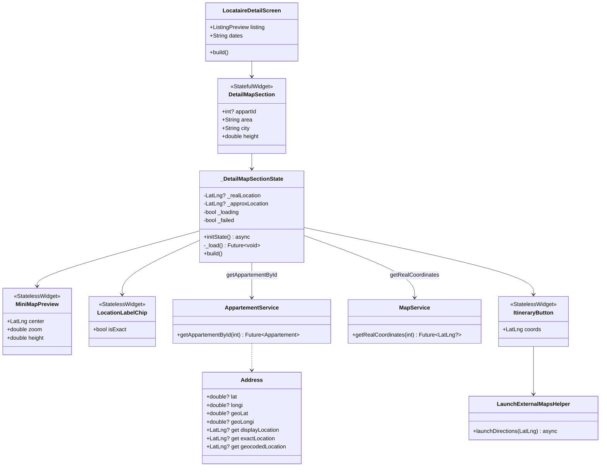
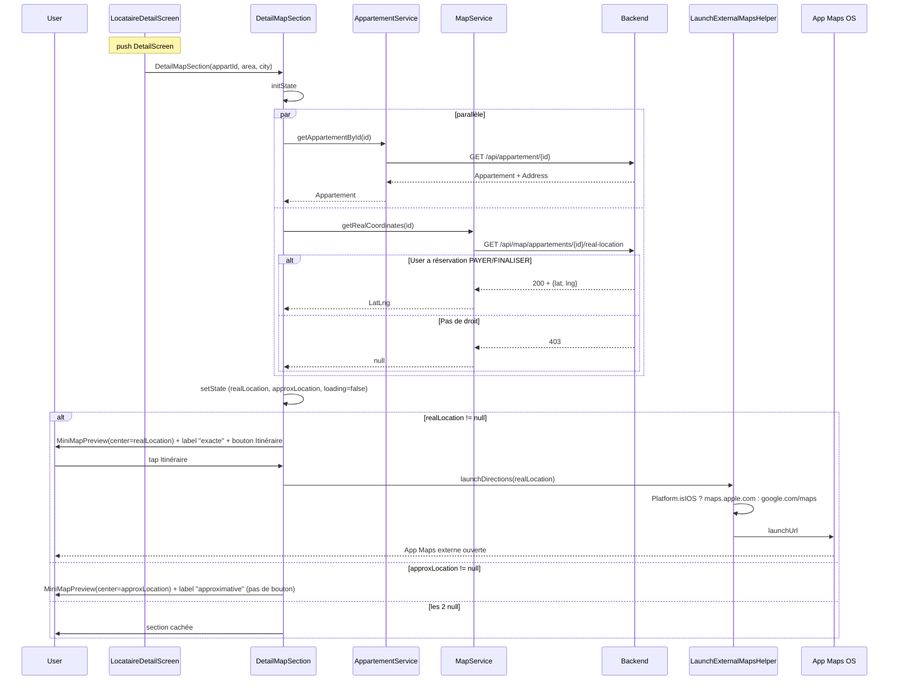

# 🏗️ Architecture — V9.7c Mini-carte position réelle

> **Version :** 1.0
> **Date :** 2026-05-11
> **Mode :** Projet existant (Flutter 3.7+, BLoC 9.1.1)
> **Basée sur :** `.ai-outputs/specs/v9-7c-mini-carte-real-location/business-spec.md`

---

## 1. Vue d'ensemble

### Objectif
Finaliser la chaîne dual-coords initiée en V9.7b : sur `LocataireDetailScreen`, afficher une mini-carte avec position approximative par défaut, basculer sur position réelle si le locataire a une réservation `PAYER`/`FINALISER`, et permettre le lancement d'un itinéraire externe (Apple Maps / Google Maps).

### Composants impactés
- **Refondu (1)** : `DetailMapSection` (actuellement placeholder figé avec `MapPinMarker`)
- **Créés (4)** : `MiniMapPreview`, `LocationLabelChip`, `ItineraryButton`, `LaunchExternalMapsHelper`
- **Modifié (1)** : `LocataireDetailScreen` (passer `appartId` au lieu de juste `area/city`)
- **Modifié (1)** : `pubspec.yaml` (ajouter `url_launcher`)
- **Inchangés** : `MapBloc`, `MapService`, `MapAppartement`, `Address` (tout l'existant V9.7b reste tel quel)

### Décisions techniques clés

**D1 — FutureBuilder direct au lieu de MapBloc dispatch**
Le `MapBloc.RequestRealLocation` event existe déjà mais a 2 inconvénients pour ce cas d'usage :
1. Émission de `MapRealLocationLoaded` **remplace** l'état courant du `MapBloc` global → pollue `LocataireMapScreen` en arrière-plan
2. Pas de cache local nécessaire ici (chaque ouverture DetailScreen = un appel léger)

Décision : appel **direct** `MapService.getRealCoordinates(appartId)` via `FutureBuilder`/state local. Le `RequestRealLocation` event reste dans le `MapBloc` comme réserve pour usage futur (cache global, realtime updates V10+).

Cohérent avec le pattern V9.7b `MapMarkerBottomSheet` qui appelle `AppartementService.getAppartementById` direct sans Bloc.

**D2 — Source des coords approximatives**
`Address` (model existant `lib/model/locolite/address.dart`) porte déjà :
- `lat/longi` (exactes)
- `geoLat/geoLongi` (geocodées/approximatives)
- Getters `displayLocation`, `exactLocation`, `geocodedLocation` (`LatLng?`)

Pour le fallback obfusqué, le DetailMapSection appelle `AppartementService.getAppartementById(appartId)` au mount, récupère l'`Appartement`, lit `appartement.address.displayLocation`. Deux appels parallèles via `Future.wait` (perf : `~1 RTT` au lieu de séquentiel).

**D3 — `appartId` passé en paramètre**
`ListingPreview.id` est un `String` (cast de `Appartement.id`). On parse en `int` au mount de `DetailMapSection`. Si parse échoue → section cachée.

**D4 — `url_launcher` à ajouter**
Pas dans le pubspec actuel. Version recommandée : `url_launcher: ^6.3.0` (stable, compat Flutter 3.7+).

**D5 — Pas de nouveau `MapBloc.event` ni `state`**
Tout est local au widget. Le `MapBloc` reste intact.

---

## 2. Diagramme de classes



---

## 3. Diagramme de séquence



---

## 4. Structure des fichiers

```
lib/
├── screen/client/locataire/booking/
│   ├── detail_screen.dart                    🔧 ADAPTER (passer appartId)
│   └── widget/
│       └── detail_map_section.dart           ♻️ REFONDRE complet
│
├── widget/map/                                (existant V9.7)
│   └── ...
│
└── screen/client/locataire/booking/widget/    (nouveaux dédiés à V9.7c)
    ├── mini_map_preview.dart                 ✅ CRÉER
    ├── location_label_chip.dart              ✅ CRÉER
    └── itinerary_button.dart                 ✅ CRÉER

lib/util/
└── launch_external_maps_helper.dart           ✅ CRÉER (helper pur)

pubspec.yaml                                    🔧 ADAPTER (+ url_launcher: ^6.3.0)
```

---

## 5. CONTRAT D'IMPLÉMENTATION

> Loi pour l'agent Dev. Aucun item ne peut être ignoré ou substitué.

### Dépendances

- [ ] **MODIFIER** `pubspec.yaml`
  - Ajouter `url_launcher: ^6.3.0` dans `dependencies`
  - Exécuter `flutter pub get`

### Helpers

- [ ] **CRÉER** `lib/util/launch_external_maps_helper.dart`
  - Classe `LaunchExternalMapsHelper` avec constructeur privé
  - Méthode statique `Future<bool> launchDirections(LatLng coords)` :
    - Si `Platform.isIOS` → URL `https://maps.apple.com/?daddr=${lat},${lng}&dirflg=d`
    - Sinon → URL `https://www.google.com/maps/dir/?api=1&destination=${lat},${lng}`
    - `launchUrl(uri, mode: LaunchMode.externalApplication)`
    - Retour `true` si succès, `false` si pas d'app maps
  - Doc inline : pattern URL + fallback

### Widgets atomiques

- [ ] **CRÉER** `lib/screen/client/locataire/booking/widget/mini_map_preview.dart`
  - `MiniMapPreview` StatelessWidget
  - Params : `{required LatLng center, double zoom = 15.0, double height = 180}`
  - Affichage : `flutter_map.FlutterMap` :
    - `MapOptions` : `initialCenter: center`, `initialZoom: zoom`, `interactionOptions: InteractionOptions(flags: InteractiveFlag.none)` (mini-carte non interactive — l'utilisateur ne pan/zoom pas)
    - `TileLayer` avec `tileBuilder` + `ColorFilter.matrix(_darkenMatrix)` (réutiliser la même matrice que `MapView` V9.7 — extraire éventuellement dans util)
    - `MarkerLayer` avec un marker custom centré sur `center` (utiliser un Pin marker simple ou réutiliser `MapPinMarker` existant si encore valable)
  - Wrap dans `SizedBox(height: height)` + `ClipRRect(radius: AppRadii.md)`
  - Pas de fonction privée retournant Widget

- [ ] **CRÉER** `lib/screen/client/locataire/booking/widget/location_label_chip.dart`
  - `LocationLabelChip` StatelessWidget
  - Params : `{required bool isExact}`
  - Affichage :
    - Mode exact : `Container` bgElev2 + bordure success light + icône `Icons.gps_fixed` 14px success + texte "Localisation exacte" small text
    - Mode approximatif : `Container` bgElev2 + bordure line + icône `Icons.gps_off` 14px text3 + texte "Localisation approximative" small text3
  - Radius pill (99), padding compact h:10 v:5

- [ ] **CRÉER** `lib/screen/client/locataire/booking/widget/itinerary_button.dart`
  - `ItineraryButton` StatelessWidget
  - Params : `{required LatLng coords, VoidCallback? onError}`
  - Affichage : `OutlinedCustomButton` (existant) ou alternativement un `Material` + `InkWell` + `Container` outlined accent
  - Label : "Itinéraire"
  - Leading icon : `Icons.directions_outlined`
  - `onTap` : appel `LaunchExternalMapsHelper.launchDirections(coords)`. Si retour `false` → invoque `onError?.call()` (snackbar)

### Widgets composites (refonte)

- [ ] **REFONDRE** `lib/screen/client/locataire/booking/widget/detail_map_section.dart`
  - Devient `StatefulWidget`
  - Params : `{required int? appartId, required String area, required String city, double height = 180}`
  - State `_DetailMapSectionState` :
    - `LatLng? _realLocation`
    - `LatLng? _approxLocation`
    - `bool _loading = true`
    - `bool _hasError = false`
  - `initState` : appelle `_loadLocations()` async
  - `_loadLocations()` :
    - Si `widget.appartId == null` → `setState(loading=false, hasError=true)` et return
    - `Future.wait([_loadAppartement(), _loadRealLocation()])` — deux appels parallèles
    - `_loadAppartement()` : try → `AppartementService.getAppartementById(appartId)` → stocker `appart.address.displayLocation` dans `_approxLocation`
    - `_loadRealLocation()` : try → `MapService.getRealCoordinates(appartId)` → stocker dans `_realLocation`
    - catch → silencieux, juste laisser null
    - `mounted` check avant chaque setState
  - Build :
    - Si `_loading` → skeleton `Container` 180px `bgElev2` + `Center(CircularProgressIndicator)`
    - Sinon, calculer `displayed = _realLocation ?? _approxLocation`
    - Si `displayed == null` → `SizedBox.shrink()` (section cachée)
    - Sinon : `Column` avec :
      - `MiniMapPreview(center: displayed)` 180px
      - SizedBox 12
      - Row spaceBetween : `LocationLabelChip(isExact: _realLocation != null)` + (si `_realLocation != null`) `ItineraryButton(coords: _realLocation!, onError: ...)`
      - Si `_realLocation == null` : Row affichage à gauche le chip + texte `'$area, $city'` à droite (cohérent avec proto)

### Screen impact

- [ ] **ADAPTER** `lib/screen/client/locataire/booking/detail_screen.dart`
  - Calcul de `appartId` depuis `listing.id` : `int.tryParse(listing.id)`
  - Remplacer l'appel actuel `DetailMapSection(area: listing.area, city: listing.city)` par `DetailMapSection(appartId: appartId, area: listing.area, city: listing.city)`
  - Aucun autre changement

### Tests de non-régression (manuels)

- [ ] La carte d'arrière-plan `LocataireMapScreen` n'est pas affectée par l'ouverture de `LocataireDetailScreen` (Bloc state préservé)
- [ ] `flutter analyze` : 0 nouvelle erreur (les 39 issues legacy restent inchangées)
- [ ] `grep -rn "Widget _" lib/screen/client/locataire/booking/` → vide

---

## 6. Interfaces / Contrats backend (rappel — non-bloquant Flutter)

Inchangés depuis V9.7b. Pour mémoire :

- `GET /api/map/appartements/{id}/real-location` :
  - 200 + `{lat: double, lng: double}` si réservation `PAYER` ou `FINALISER`
  - 403 sinon (statuts `CONFIRMER`/`EN_ATTENTE` exclus, voir `BACKEND_NOTES_MAP_V9_7B.md`)

- `GET /api/appartement/{id}` (déjà existant) : retourne `Appartement` complet avec `Address`

---

## 7. Risques & Mitigation

| Risque | Probabilité | Impact | Mitigation |
|---|---|---|---|
| `Address.geoLat/geoLongi` null sur certains apparts | Moyenne | Section cachée | Acceptable MVP, message à backend si fréquent |
| `url_launcher` non installé / pas d'app maps | Faible | Bouton inutile | Retour `false` → snackbar discret |
| Race condition `setState` après `dispose` | Faible | Exception | `mounted` check avant chaque `setState` |
| Pollution `MapBloc` global | Évité | — | Décision D1 : appel direct `MapService`, pas de dispatch event |
| Crash si `appartId` non parsable | Faible | Section cachée | `int.tryParse` retourne null, géré par section cachée |

---

## 8. Plan d'implémentation (ordre)

1. **Pubspec** : ajouter `url_launcher: ^6.3.0`, `flutter pub get`
2. **Helper** : `LaunchExternalMapsHelper`
3. **Widget atomique** : `MiniMapPreview` (réutilise `_darkenMatrix` extracted in util ou copy local)
4. **Widget atomique** : `LocationLabelChip`
5. **Widget atomique** : `ItineraryButton`
6. **Widget composite** : refonte `DetailMapSection`
7. **Screen** : adapter `LocataireDetailScreen` pour passer `appartId`
8. **Gates** : `flutter analyze` 0 nouvelle erreur + grep "Widget _" vide
9. **Test runtime** : appart avec résa payée → coords réelles, appart sans → coords approx

---

## 9. Flag UI

```
UI_REQUIRED: true
```

> Nouvelle section visuelle sur LocataireDetailScreen. L'agent UI/UX doit valider :
> - Layout exact de la mini-carte (180px, radius md, dark filtered)
> - Visuel du `LocationLabelChip` (pill exact vs approx, couleurs sémantiques success/text3)
> - Visuel du `ItineraryButton` (outlined accent vs primary, position dans la Row)
> - Skeleton de chargement (180px bgElev2 + spinner accent)
