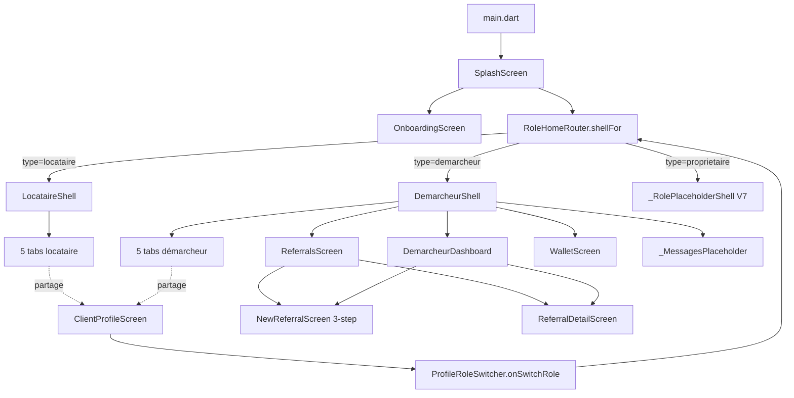
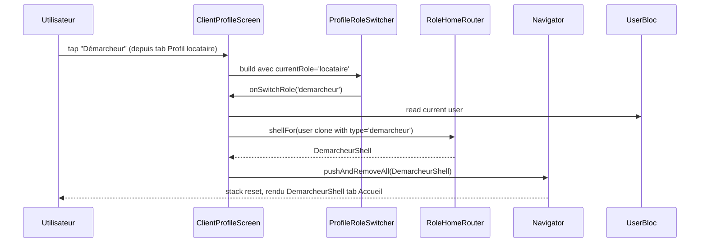
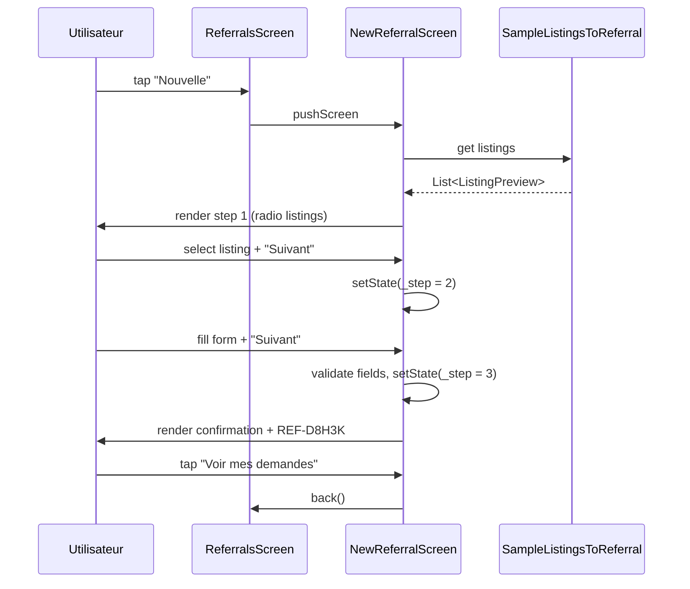

# 🏗️ Architecture — Vague 6 Démarcheur

> **Auteur :** Agent Architecture (workflow `/feature full`)
> **Date :** 2026-05-09
> **Spec parent :** `.ai-outputs/specs/vague-6-demarcheur/business-spec.md`
> **Stack :** Flutter 3.7+, BLoC 9.1.1, Hive, Material — projet existant (`new_project: false`)

---

## 1. Vue d'ensemble

La Vague 6 ajoute le **rôle Démarcheur** complet en miroir du pattern Vague 5 (Locataire), tout en **promouvant** le Profile en composant transverse réutilisé par les 3 rôles.

### 1.1 Composants impactés

| Composant | Type | Action |
|---|---|---|
| `RoleHomeRouter` | existant | **MODIFIER** — `case 'demarcheur'` → `DemarcheurShell` |
| `LocataireShell` | existant | **MODIFIER** — réutiliser `ClientProfileScreen` (pas `LocataireProfileScreen`) |
| `LocataireProfileScreen` | existant | **DÉPLACER** → `ClientProfileScreen` transverse |
| `ProfileHeroCard`, `ProfileRoleSwitcher`, `ProfileSettingsCard` | existants | **DÉPLACER** dans `shared/profile/widget/` |
| `DemarcheurShell` + 5 onglets | nouveaux | **CRÉER** |
| 7 nouveaux écrans démarcheur | nouveaux | **CRÉER** |
| ~15 nouveaux widgets de feature | nouveaux | **CRÉER** |

### 1.2 Réutilisation maximale (Vagues 1-5)

| Atome/Molécule | Réutilisation Vague 6 |
|---|---|
| `BlurContainer` | sticky CTAs |
| `BadgeStatus` (6 tons) | statuts référence (en attente / acceptée / refusée / terminée) |
| `AsfarChip` | chips de filtre Referrals |
| `DynamicAppBar` | tous les écrans |
| `BottomNav` + `BottomNavTabs.demarcheur` | DemarcheurShell |
| `CustomButton`, `OutlinedCustomButton`, `PlainButton`, `IconBoutton` | CTAs |
| `BookingRecapCard` | étape 3 confirmation |
| `FieldRow` | inputs étape 2 (Nom, Tel, Dates, Note) |
| `InfoBanner` | banner commission étape 2 |
| `SuccessCircle` | étape 3 confirmation |
| `UserAvatar`, `AvatarInitials` | avatars clients/proprios |
| `ImgPh` (4 tones) | images logements mockés |
| `FeaturedListingCard` (variant compact) | "Logements à pousser" du Dashboard |
| `SectionHeader` | toutes les sections |
| `CertifiedBadge`, `RatingChip` | badges proprios certifiés |
| `ListingSummaryCard` | step 1 tunnel New |
| `ScreenScaffold` (si applicable) | layouts standards |

---

## 2. Diagramme de structure (Mermaid)



### 2.1 Diagramme de séquence — switch de rôle



### 2.2 Diagramme de séquence — tunnel "Nouvelle demande"



---

## 3. Structure des fichiers

```
lib/screen/client/
├── shared/                                                  ← NOUVEAU (transverse)
│   └── profile/
│       ├── client_profile_screen.dart                       [NEW: ex-LocataireProfileScreen]
│       └── widget/
│           ├── profile_hero_card.dart                       [MOVED from locataire/profile/widget/]
│           ├── profile_role_switcher.dart                   [MOVED]
│           └── profile_settings_card.dart                   [MOVED]
├── locataire/
│   └── locataire_shell.dart                                 [MODIF: import ClientProfileScreen]
├── demarcheur/                                              ← NOUVEAU (Vague 6)
│   ├── demarcheur_shell.dart                                [NEW: 5 onglets]
│   ├── home/
│   │   ├── dashboard_screen.dart                            [NEW]
│   │   └── widget/
│   │       ├── wallet_hero_card.dart                        [NEW: gradient bleu-nuit + montant]
│   │       ├── mini_stats_inline.dart                       [NEW: 3 stats avec séparateurs]
│   │       ├── send_referral_cta_card.dart                  [NEW: "Envoyer un client" gradient or]
│   │       ├── status_pills_row.dart                        [NEW: 3 cols stats]
│   │       └── listing_push_card.dart                       [NEW: card 200px logement à pousser]
│   ├── referrals/
│   │   ├── referrals_screen.dart                            [NEW: liste filtrée]
│   │   ├── referral_detail_screen.dart                      [NEW: timeline 5 étapes]
│   │   ├── new_referral_screen.dart                         [NEW: tunnel 3 steps single screen]
│   │   └── widget/
│   │       ├── referral_row.dart                            [NEW: ligne client référé]
│   │       ├── referral_filter_chips.dart                   [NEW: 4 chips de filtre]
│   │       ├── referral_listing_radio.dart                  [NEW: card radio step 1]
│   │       ├── timeline_step.dart                           [NEW: 1 étape de timeline]
│   │       ├── referral_timeline.dart                       [NEW: timeline 5 étapes]
│   │       └── commission_card.dart                         [NEW: sous-total → 10% → à recevoir]
│   ├── wallet/
│   │   ├── wallet_screen.dart                               [NEW: solde + historique]
│   │   └── widget/
│   │       ├── wallet_solde_card.dart                       [NEW: gradient bleu-nuit + montant + bouton retirer]
│   │       └── wallet_transaction_row.dart                  [NEW: icon up/down + label + montant]
│   └── sample/
│       ├── sample_referrals.dart                            [NEW: List<ReferralPreview>]
│       ├── sample_commissions.dart                          [NEW: List<CommissionTransaction>]
│       └── sample_listings_to_referral.dart                 [NEW: List<ListingPreview> (or réutilise SampleListings)]
└── role_home_router.dart                                    [MODIF: case 'demarcheur' → DemarcheurShell]

lib/model/                                                   ← NOUVEAU (mocks)
└── ui_only/                                                 (modèles d'affichage purs, ne touchent pas le domaine BLoC)
    ├── referral_preview.dart                                [NEW: classe data immutable]
    └── commission_transaction.dart                          [NEW: classe data immutable]
```

### 3.1 Note sur les modèles UI-only

Les modèles `ReferralPreview` et `CommissionTransaction` sont des **classes data immutables** spécifiques à l'UI Vague 6, alignées sur les mocks du proto. Elles **ne remplacent pas** les modèles existants (`Reservation`, `Compte`, etc.) et servent uniquement à typer les samples. Le branchement BLoC réel (vague de finition) mappera les modèles métier vers ces preview.

### 3.2 Note sur le tunnel `NewReferralScreen`

Le doc `RECONSTRUCTION_UI_ASFAR.md` ligne 197-199 mentionne 3 fichiers (`new_step1_screen.dart`, `new_step2_screen.dart`, `new_step3_screen.dart`). **Écart documenté** : nous adoptons **1 seul écran avec `int _step`**, comme `LocataireReserveScreen` en Vague 5 (`lib/screen/client/locataire/booking/reserve_screen.dart:41`). Justifications :
- DRY : header partagé, navigation back/forward simple via `setState`
- État du formulaire préservé entre étapes sans param drilling
- Cohérence Vague 5

---

## 4. Interfaces / Contrats

### 4.1 `ClientProfileScreen` (refactor de `LocataireProfileScreen`)

```dart
class ClientProfileScreen extends StatelessWidget {
  const ClientProfileScreen({super.key});

  // Subtitle adaptatif selon user.type :
  //   locataire     → 'Locataire · Membre depuis 2024'
  //   demarcheur    → 'Démarcheur · Top démarcheur'
  //   proprietaire  → 'Propriétaire · Hôte certifié'
  String _subtitleFor(User? user) { /* ... */ }

  // Settings adaptatifs : la liste de ProfileSettingsItem peut varier
  // selon le rôle (ex: démarcheur a "Méthode de retrait" en plus).
  List<ProfileSettingsItem> _settingsFor(User? user) { /* ... */ }

  // Branchement effectif du Role Switcher :
  void _onSwitchRole(BuildContext context, String roleId) {
    // 1. Lire le user actuel
    // 2. Cloner avec type=roleId
    // 3. RoleHomeRouter.shellFor(updatedUser)
    // 4. pushAndRemoveAll(context, shell)
  }
}
```

### 4.2 `RoleHomeRouter` (extension)

```dart
class RoleHomeRouter {
  static Widget shellFor(User user) {
    final role = (user.type ?? '').toLowerCase();
    switch (role) {
      case 'locataire':    return LocataireShell(firstName: ...);
      case 'demarcheur':   return DemarcheurShell(firstName: ...);   // ← AJOUT
      case 'proprietaire': return _RolePlaceholderShell('Vague 7');  // inchangé
      default:             return LocataireShell(firstName: ...);
    }
  }
}
```

### 4.3 `DemarcheurShell`

```dart
class DemarcheurShell extends StatefulWidget {
  final String? firstName;
  const DemarcheurShell({super.key, this.firstName});
}

class _DemarcheurShellState extends State<DemarcheurShell> {
  int _index = 0;

  Widget build(BuildContext context) {
    final pages = <Widget>[
      DemarcheurDashboard(firstName: ...),
      const DemarcheurReferralsScreen(),
      const DemarcheurWalletScreen(),
      const _MessagesPlaceholder(),       // stub Vague 8
      const ClientProfileScreen(),        // transverse
    ];

    return Scaffold(
      backgroundColor: AppColors.background,
      extendBody: true,
      body: IndexedStack(index: _index, children: pages),
      bottomNavigationBar: BottomNav(
        tabs: BottomNavTabs.demarcheur,    // déjà défini Vague 2
        current: _index,
        onChanged: (i) => setState(() => _index = i),
      ),
    );
  }
}
```

### 4.4 `ReferralPreview` (modèle UI-only)

```dart
class ReferralPreview {
  final String id;                  // 'REF-D8H3K'
  final String clientName;          // 'Mariam D.'
  final String clientPhone;         // '+225 07 12 34 56'
  final ListingPreview listing;     // réutilise modèle existant
  final int nights;                 // 3
  final DateTime sentAt;            // pour 'il y a 2 j'
  final ReferralStatus status;      // pending / accepted / completed / refused
  final int commission;             // 13500 FCFA

  const ReferralPreview({...});
}

enum ReferralStatus { pending, accepted, completed, refused }
```

### 4.5 `CommissionTransaction` (modèle UI-only)

```dart
class CommissionTransaction {
  final String id;
  final String label;               // 'Commission — Mariam D.'
  final String subtitle;            // '12 nov. 2025 · Loft Plateau'
  final DateTime date;
  final int amount;                 // signé : positif = entrée, négatif = sortie
  final TransactionType type;       // commissionIn / withdrawalOut

  const CommissionTransaction({...});
}

enum TransactionType { commissionIn, withdrawalOut }
```

---

## 5. CONTRAT D'IMPLÉMENTATION

### Pages / Écrans

#### 5.1 Refactor Profile transverse
- [ ] `lib/screen/client/shared/profile/client_profile_screen.dart` → écran transverse, subtitle adaptatif au rôle, brancher `onSwitchRole` via `RoleHomeRouter.shellFor` + `pushAndRemoveAll`
- [ ] `lib/screen/client/shared/profile/widget/profile_hero_card.dart` → déplacé depuis `locataire/profile/widget/`
- [ ] `lib/screen/client/shared/profile/widget/profile_role_switcher.dart` → déplacé
- [ ] `lib/screen/client/shared/profile/widget/profile_settings_card.dart` → déplacé
- [ ] **Suppression** : `lib/screen/client/locataire/profile/profile_screen.dart` + dossier `widget/` après déplacement (legacy non conservé)

#### 5.2 Démarcheur — Shell
- [ ] `lib/screen/client/demarcheur/demarcheur_shell.dart` → Shell 5 onglets, `IndexedStack`, `BottomNav` avec `BottomNavTabs.demarcheur`. Ordre : Dashboard / Referrals / Wallet / MessagesPlaceholder / ClientProfileScreen

#### 5.3 Démarcheur — Dashboard
- [ ] `lib/screen/client/demarcheur/home/dashboard_screen.dart` → header greeting + WalletHeroCard + MiniStatsInline + SendReferralCtaCard + StatusPillsRow + section "Mes clients référés" (liste de `ReferralRow` cliquable → `ReferralDetailScreen`) + section "Logements à pousser" (carrousel horizontal de `ListingPushCard`)

#### 5.4 Démarcheur — Referrals
- [ ] `lib/screen/client/demarcheur/referrals/referrals_screen.dart` → DynamicAppBar avec trailing "Nouvelle" → `NewReferralScreen` ; `ReferralFilterChips` (5 chips : Toutes/En attente/Acceptées/Terminées/Refusées) ; liste de `ReferralRow`. Filtre fait sur la liste mock localement.

#### 5.5 Démarcheur — New (tunnel 3 étapes single screen)
- [ ] `lib/screen/client/demarcheur/referrals/new_referral_screen.dart` → `StatefulWidget` avec `int _step = 1`, header `eyebrow: 'ÉTAPE $_step / 3'`. Step 1 = liste de `ReferralListingRadio`. Step 2 = `FieldRow` × 4 (Nom, Tel, Dates, Note) + InfoBanner commission. Step 3 = `SuccessCircle` + `BookingRecapCard` + CTA "Voir mes demandes".

#### 5.6 Démarcheur — Referral Detail
- [ ] `lib/screen/client/demarcheur/referrals/referral_detail_screen.dart` → DynamicAppBar back ; `ReferralTimeline` (5 `TimelineStep`) ; ListingSummaryCard (réutilisé) ; client card ; proprio card avec CertifiedBadge ; `CommissionCard`.

#### 5.7 Démarcheur — Wallet
- [ ] `lib/screen/client/demarcheur/wallet/wallet_screen.dart` → DynamicAppBar `Mes commissions` ; `WalletSoldeCard` (montant + texte versement vendredi + CTA "Retirer maintenant") ; SectionHeader "Historique" ; liste de `WalletTransactionRow`.

### Widgets

#### 5.8 Widgets feature Dashboard (5)
- [ ] `wallet_hero_card.dart` → gradient bleu-nuit `#1A2A4A → #0E1626` + halo radial bleu + montant 32px + delta +32%
- [ ] `mini_stats_inline.dart` → row de 3 stats avec séparateurs verticaux 1px `line`
- [ ] `send_referral_cta_card.dart` → card gradient subtil or + icon send + label + arrow → tap = `NewReferralScreen`
- [ ] `status_pills_row.dart` → 3 cols : En attente (warn), Acceptées (success), Taux acceptation (chiffre+%)
- [ ] `listing_push_card.dart` → card 200px (img tone + titre + ville + prix + commission estimée + btn "Référer" sm)

#### 5.9 Widgets feature Referrals (6)
- [ ] `referral_row.dart` → ImgPh tone + clientName + BadgeStatus(status) + "{listing} · {nights} nuits" + commission accent à droite + chevron
- [ ] `referral_filter_chips.dart` → wrapper `AsfarChip` × 5 avec selected state
- [ ] `referral_listing_radio.dart` → ListingPreview en card avec radio circulaire (border accent + bg accentSoft si sélectionné)
- [ ] `timeline_step.dart` → cercle 24px (success/accent/grey) + connector vertical + title + subtitle (date)
- [ ] `referral_timeline.dart` → Column de `TimelineStep` × 5
- [ ] `commission_card.dart` → 3 lignes : sous-total, taux 10%, à recevoir (accent or, bold mono)

#### 5.10 Widgets feature Wallet (2)
- [ ] `wallet_solde_card.dart` → gradient bleu-nuit + halo + montant 36px + sub texte + bouton "Retirer maintenant" sur fond translucide
- [ ] `wallet_transaction_row.dart` → icon arrow up/down (entrée=accent or, sortie=info) + label + sub date + montant signé en mono

### Modèles UI-only (2)

- [ ] `lib/model/ui_only/referral_preview.dart` → classe immutable + enum `ReferralStatus`
- [ ] `lib/model/ui_only/commission_transaction.dart` → classe immutable + enum `TransactionType`

### Mocks (3)

- [ ] `lib/screen/client/demarcheur/sample/sample_referrals.dart` → `static const List<ReferralPreview> all` (≥ 5 entrées couvrant les 4 statuts + le client courant Mariam D. en accepted pour le détail)
- [ ] `lib/screen/client/demarcheur/sample/sample_commissions.dart` → `static const List<CommissionTransaction> all` (≥ 6 transactions, mix entrées/sorties)
- [ ] `lib/screen/client/demarcheur/sample/sample_listings_to_referral.dart` → réutilise `SampleListings.all` + ajoute la commission estimée par listing (10% du prix × nights par défaut = 3)

### Fichiers à modifier (3)

- [ ] `lib/screen/role_home_router.dart` → ajouter `case 'demarcheur'` retournant `DemarcheurShell(firstName: ...)`
- [ ] `lib/screen/client/locataire/locataire_shell.dart` → remplacer `LocataireProfileScreen` par `ClientProfileScreen`
- [ ] `RECONSTRUCTION_UI_ASFAR.md` → cocher items Vague 6 + ajouter au journal des décisions (date + écart 3-step single screen + Profile transverse)

### Fichiers à supprimer (2)

- [ ] `lib/screen/client/locataire/profile/profile_screen.dart`
- [ ] `lib/screen/client/locataire/profile/widget/` (3 fichiers déplacés vers shared)

---

## 6. Conventions à respecter (rappel)

### 6.1 10 règles Flutter (NON NÉGOCIABLES)
1. Pas de fonction privée retournant un Widget
2. 1 widget = 1 fichier
3. Helpers dans fichiers dédiés
4. Une classe par fichier
5. Analyser l'existant avant de créer
6. Respecter l'esprit du projet
7. Cohérence du style
8. Priorité widgets/
9. Widgets locaux co-localisés (`{feature}/widget/`)
10. UI/UX excellence

### 6.2 Tokens uniquement (R1 RECONSTRUCTION_UI_ASFAR.md)
- Couleurs : `AppColors.*`
- Radius : `AppRadii.*`
- Typo : `AppTextStyles.*`
- **Aucune** valeur magique de couleur/padding/size en dur

### 6.3 SOLID nouveau code (RM10)
- Tout le nouveau code Vague 6 respecte SOLID
- Le legacy non touché

---

## 7. Risques et points d'attention

| Risque | Impact | Mitigation |
|---|---|---|
| Switch de rôle pollue le stack si pas reset | Stack pollué, fuites | `pushAndRemoveAll` systématique |
| `ClientProfileScreen` déplacement casse imports existants | Compile errors | grep-and-replace systématique des imports avant suppression |
| Tunnel 3-step écart vs `RECONSTRUCTION_UI_ASFAR.md` | Confusion documentaire | Écart explicité dans cette archi (§ 3.2) + journal de décisions au moment de cocher |
| Mocks incohérents entre `sample_referrals` et le détail | Crash "logement supprimé" | Le mock `Mariam D.` du Dashboard pointe sur `SampleListings.all[0]` (Loft Plateau) — référence stable |
| Le clone de `User` pour le switch de rôle peut échouer si modèle Hive n'a pas de copyWith | Switch impossible | Vérifier `User.copyWith` ou utiliser `User(...)` avec spread manuel |
| WalletHeroCard et WalletSoldeCard se ressemblent — duplication ? | DRY | WalletHeroCard = compact (Dashboard) ; WalletSoldeCard = expanded (Wallet screen). Variantes distinctes du même esprit gradient. À la 2ᵉ implémentation, factoriser éventuellement en widget commun avec param `compact: bool`. |

---

## 8. Ordre d'implémentation suggéré

1. **Lot 1 — Refactor transverse** (débloque tout le reste)
   - Créer `lib/screen/client/shared/profile/` avec déplacement
   - Modifier `LocataireShell` pour utiliser `ClientProfileScreen`
   - Compléter `RoleHomeRouter.shellFor` (case demarcheur → placeholder temporaire si DemarcheurShell pas encore prêt)
   - Brancher `onSwitchRole` du Role Switcher
   - **Gate** : `flutter analyze` 0 erreur, parcours locataire toujours fonctionnel

2. **Lot 2 — Modèles + mocks**
   - `ReferralPreview`, `CommissionTransaction`
   - `SampleReferrals`, `SampleCommissions`, `SampleListingsToReferral`

3. **Lot 3 — Widgets atomiques de la vague**
   - 5 widgets Dashboard (`WalletHeroCard`, `MiniStatsInline`, etc.)
   - 6 widgets Referrals (`ReferralRow`, `Timeline*`, `CommissionCard`, etc.)
   - 2 widgets Wallet
   - **Gate** : aucun écran encore, mais tous les widgets compilent

4. **Lot 4 — Écrans**
   - `DemarcheurDashboard`
   - `DemarcheurReferralsScreen` + `NewReferralScreen` + `ReferralDetailScreen`
   - `DemarcheurWalletScreen`
   - **Gate** : chaque écran rendu visuellement valide en isolation

5. **Lot 5 — Shell + intégration**
   - `DemarcheurShell` (les 4 écrans + Profile + Messages stub)
   - `RoleHomeRouter` final (case demarcheur → DemarcheurShell réel)
   - **Gate** : E2E démarcheur — Splash → login démarcheur → Shell → tous les onglets → tunnel New → switch vers Locataire → switch retour démarcheur

6. **Lot 6 — Documentation**
   - Mettre à jour `RECONSTRUCTION_UI_ASFAR.md` (cocher Vague 6 + journal)
   - Documentation HTML `vague-6-demarcheur.html` (Étape 8 du workflow)

---

## 9. Critères de conformité (pour vérification post-dev)

- [ ] Tous les fichiers du contrat (§ 5) sont créés/modifiés
- [ ] Aucun fichier prévu pour suppression ne subsiste
- [ ] Aucune couleur/padding/size en dur (tokens uniquement)
- [ ] 1 widget = 1 fichier respecté
- [ ] Aucune fonction privée retourne un Widget
- [ ] `flutter analyze` 0 erreur, 0 warning
- [ ] Imports cohérents (pas d'import legacy `locataire/profile/`)
- [ ] Démarcheur Shell fonctionnel sur 5 onglets
- [ ] Switch de rôle Locataire ↔ Démarcheur fonctionnel (push pile vide)
- [ ] Tunnel New 3 étapes navigable forward + back
- [ ] Mocks cohérents entre eux

---

## 10. Flag UI

**UI_REQUIRED: true**

(15+ widgets visuels + 7 écrans démarcheur + refactor d'un écran transverse — touche massivement à la couche UI)

---

> ✅ Architecture prête pour validation utilisateur.

---

## 11. Vérification post-développement (2026-05-10)

**Verdict : ✅ CONFORME**

### Couverture du contrat (§ 5)

| Catégorie | Items contrat | Items livrés | Statut |
|---|---|---|---|
| Profile transverse (refactor) | 4 fichiers + 1 suppression | 4 + 1 | ✅ |
| Écrans démarcheur | 7 (Shell + Dashboard + Referrals + New + Detail + Wallet + Profile transverse réutilisé) | 7 | ✅ |
| Widgets Dashboard | 5 | 5 | ✅ |
| Widgets Referrals | 6 | 6 | ✅ |
| Widgets Wallet | 2 | 2 | ✅ |
| Modèles UI-only | 2 | 2 | ✅ |
| Mocks | 3 | 3 | ✅ |
| Modifs | 3 | 3 (RoleHomeRouter, LocataireShell, RECONSTRUCTION_UI_ASFAR.md) | ✅ |
| Suppressions | 2 | 2 (locataire/profile/* absent) | ✅ |

**Total : 32 livrables livrés sur 32 attendus.**

### Écarts (4, tous justifiés)

1. `NewReferralScreen` 1 fichier vs 3 → écart documenté § 3.2 (cohérence Vague 5)
2. Ajout helper `ProfileDisplayInfo` → règle 3 (helpers dédiés)
3. Ajout helper `ReferralStatusDisplay` → règle 3
4. 4 nouveaux tokens `walletBlue*` + `heroGradientBlueShort` → identifié en `ui-proposal.md § 8`, requis par R1

### Quality gate

- `flutter analyze` : 41 issues (legacy uniquement), 0 nouvelle issue
- Aucun item manquant
- Aucun ajout non justifié
- Tous les patterns Vague 5 respectés

→ **Audit qualité (ÉTAPE 6) peut démarrer.**
