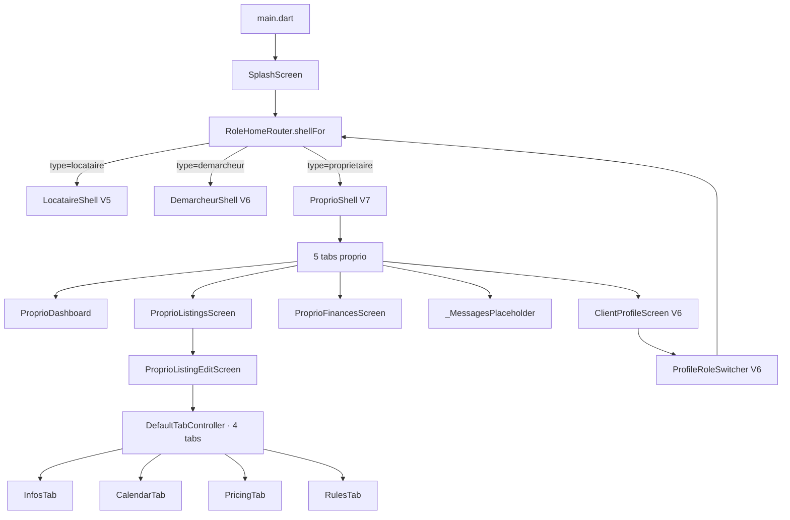
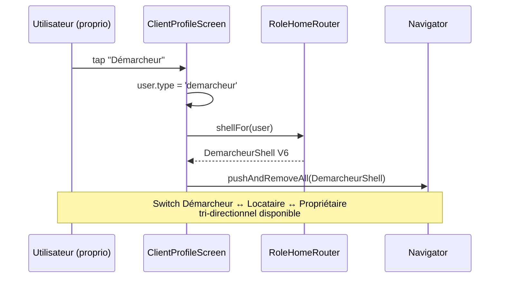
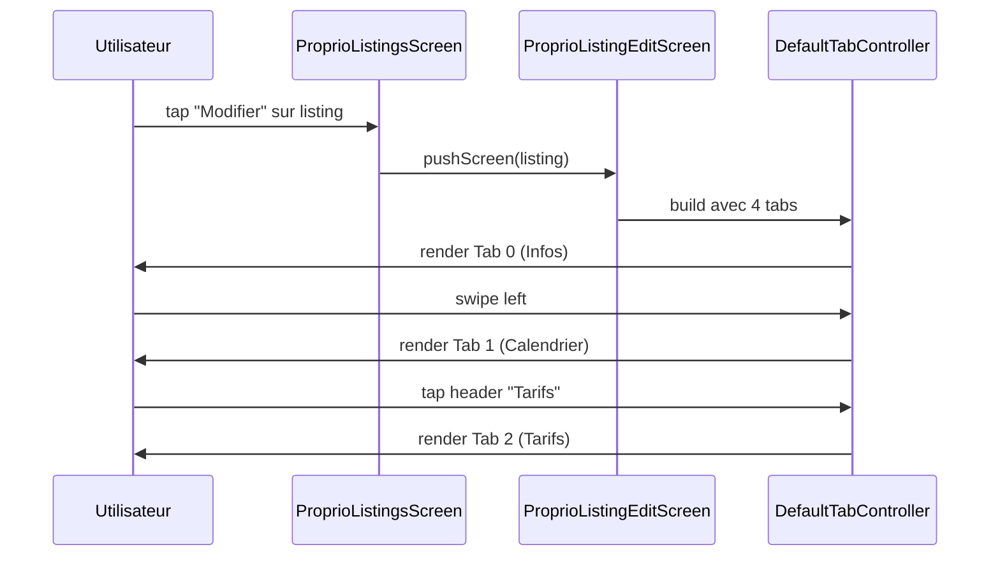

# 🏗️ Architecture — Vague 7 Propriétaire

> **Auteur :** Agent Architecture (workflow `/feature full`)
> **Date :** 2026-05-10
> **Spec parent :** `.ai-outputs/specs/vague-7-proprietaire/business-spec.md`
> **Stack :** Flutter 3.7+, BLoC 9.1.1, Hive, Material, fl_chart 0.69 — projet existant

---

## 1. Vue d'ensemble

La Vague 7 ajoute le **rôle Propriétaire** complet en miroir des patterns Vagues 5-6 et **finalise** le mécanisme de switch de rôle (tri-directionnel Locataire ↔ Démarcheur ↔ Propriétaire).

### 1.1 Composants impactés

| Composant | Type | Action |
|---|---|---|
| `RoleHomeRouter` | existant V6 | **MODIFIER** — `case 'proprietaire'` retourne `ProprioShell` (au lieu du `_RolePlaceholderShell` V6) |
| `ProprioShell` + 5 onglets | nouveaux | **CRÉER** |
| 4 écrans propriétaire | nouveaux | **CRÉER** |
| ~19 widgets de feature | nouveaux | **CRÉER** |
| Profile transverse | existant V6 | **RÉUTILISER** (pas de modification) — `ClientProfileScreen` + `ProfileDisplayInfo.forRole('proprietaire')` |

### 1.2 Réutilisation maximale (Vagues 1-6)

| Atome/Molécule | Réutilisation Vague 7 |
|---|---|
| `BlurContainer` | sticky CTAs |
| `BadgeStatus` (6 tons) | badges Actif/Certifié, NOUVEAU sur demandes, +XX% delta |
| `AsfarChip` | 4 chips filtre Listings |
| `DynamicAppBar` | tous les écrans |
| `BottomNav` + `BottomNavTabs.proprio` | ProprioShell |
| `CustomButton`, `OutlinedCustomButton`, `PlainButton`, `IconBoutton` | CTAs |
| `SectionHeader` | toutes les sections (« Mes annonces », « Performance par bien », etc.) |
| `ImgPh` (4 tones) | thumbnails listings (64px Dashboard, 44px Finances perf, 16:9 Listings, hero 16:10 ListingEdit) |
| `FieldRow` | ListingEdit tabs Infos / Tarifs / Règles |
| `UserAvatar` / `AvatarInitials` | demandes en attente |
| `ListingPreview` (modèle V5) | toutes les références à un logement |
| `SampleListings.all` (V5) | les 4 biens propriétaire |
| `ClientProfileScreen` (V6) | onglet Profil — pas de modification |
| `_MessagesPlaceholder` pattern | onglet Messages stub |
| `heroGradientGold` (V1, déjà dans `AppColors`) | Hero card revenus du mois |
| `FcfaFormatter.full/compact` | tous les montants |

### 1.3 Nouveaux atomes ajoutés (Vague 7)

| Atome | Justification |
|---|---|
| `Sparkbar` | Bar chart simple 6 valeurs ratios — réutilisable en finance/dashboard. Pas de proto Vague 6 |
| `MiniCalendarGrid` | Grid 7×N view-only spécifique au calendrier propriétaire — pas généralisable hors V7 |

---

## 2. Diagramme de structure (Mermaid)



### 2.1 Diagramme de séquence — switch tri-directionnel finalisé



### 2.2 Diagramme de séquence — ListingEdit 4 tabs



---

## 3. Structure des fichiers

```
lib/screen/client/
├── proprio/                                                ← NOUVEAU (Vague 7)
│   ├── proprio_shell.dart                                  [NEW: 5 onglets IndexedStack]
│   ├── home/
│   │   ├── dashboard_screen.dart                           [NEW]
│   │   └── widget/
│   │       ├── revenue_hero_card.dart                      [NEW: gradient or + sparkbar]
│   │       ├── sparkbar.dart                               [NEW: atome bar chart 6 valeurs]
│   │       ├── kpi_tile.dart                               [NEW: 1 KPI avec delta %]
│   │       ├── cashflow_split_card.dart                    [NEW: barre stack + légende]
│   │       ├── proprio_listing_row.dart                    [NEW: ligne annonce compacte 64px]
│   │       └── pending_request_row.dart                    [NEW: ligne demande NOUVEAU]
│   ├── appartements/
│   │   ├── listings_screen.dart                            [NEW]
│   │   ├── listing_edit_screen.dart                        [NEW: DefaultTabController 4 tabs]
│   │   └── widget/
│   │       ├── listings_filter_chips.dart                  [NEW: 4 chips status]
│   │       ├── listing_full_card.dart                      [NEW: card 16:9 + KPIs + 3 ghost]
│   │       ├── new_listing_card.dart                       [NEW: dashed outline CTA]
│   │       ├── listing_edit_hero.dart                      [NEW: photo 16:10 + badge photos]
│   │       ├── listing_edit_stats_card.dart                [NEW: occupation% + barre + note★]
│   │       ├── listing_infos_tab.dart                      [NEW: tab Infos (FieldRows)]
│   │       ├── listing_calendar_tab.dart                   [NEW: tab Calendrier]
│   │       ├── listing_pricing_tab.dart                    [NEW: tab Tarifs]
│   │       ├── listing_rules_tab.dart                      [NEW: tab Règles]
│   │       ├── mini_calendar_grid.dart                     [NEW: grid 7×N view-only]
│   │       └── calendar_legend.dart                        [NEW: légende couleurs]
│   ├── comptabilite/
│   │   ├── finances_screen.dart                            [NEW]
│   │   └── widget/
│   │       ├── period_switcher.dart                        [NEW: segmented control 4 options]
│   │       ├── benefice_net_hero_card.dart                 [NEW: hero bénéfice + delta]
│   │       ├── pnl_card.dart                               [NEW: compte de résultat]
│   │       ├── property_perf_row.dart                      [NEW: ligne perf bien]
│   │       └── projection_chart.dart                       [NEW: fl_chart 7 mois]
│   └── sample/
│       ├── sample_proprio_stats.dart                       [NEW]
│       ├── sample_pnl_entries.dart                         [NEW]
│       ├── sample_property_perf.dart                       [NEW]
│       ├── sample_projection_points.dart                   [NEW]
│       └── sample_pending_requests.dart                    [NEW]
└── role_home_router.dart                                   [MODIF: case 'proprietaire' → ProprioShell]

lib/model/ui_only/                                          (étendu V7)
├── proprio_kpi.dart                                        [NEW: data class KPI dashboard]
├── monthly_revenue.dart                                    [NEW: 1 mois × valeur sparkbar]
├── cashflow_segment.dart                                   [NEW: segment barre stack]
├── pnl_entry.dart                                          [NEW: ligne P&L + enum PnLKind]
├── property_perf.dart                                      [NEW: perf 1 bien]
├── projection_point.dart                                   [NEW: 1 point line chart + isProjection]
└── pending_request.dart                                    [NEW: 1 demande en attente]
```

### 3.1 Note sur DefaultTabController

Le proto montre des "Onglets underline" — c'est un Material `TabBar` standard avec `indicator` custom (underline accent or 2px). Pas besoin de pattern `_tab` setState.

```dart
DefaultTabController(
  length: 4,
  child: Scaffold(
    appBar: DynamicAppBar(...),
    body: Column(
      children: [
        ListingEditHero(listing: ...),
        ListingEditStatsCard(...),
        TabBar(
          tabs: [Tab(text: 'Infos'), Tab(text: 'Calendrier'), ...],
          indicator: UnderlineTabIndicator(borderSide: BorderSide(color: AppColors.accent, width: 2)),
          ...
        ),
        Expanded(child: TabBarView(children: [
          ListingInfosTab(listing: ...),
          ListingCalendarTab(...),
          ListingPricingTab(...),
          ListingRulesTab(...),
        ])),
      ],
    ),
  ),
)
```

### 3.2 Note sur fl_chart

`fl_chart 0.69` est déjà dans `pubspec.yaml`. Le `LineChart` accepte plusieurs `LineChartBarData` — on en utilise 2 :
- série 1 : passé (Sept→Nov, solid)
- série 2 : futur (Nov→Mars, dashed via `dashArray: [4, 4]`)

Le `belowBarData` permet l'area gradient or sous la courbe complète. Le `verticalLine` au mois courant (Nov) est ajouté via `extraLinesData`.

Si `fl_chart` ne supporte pas exactement le mix (ex: dashes différents par série), fallback : 2 LineChartData distincts superposés en `Stack`.

---

## 4. Interfaces / Contrats

### 4.1 `ProprioShell` (réplique du pattern V6)

```dart
class ProprioShell extends StatefulWidget {
  final String? firstName;
  const ProprioShell({super.key, this.firstName});
}

class _ProprioShellState extends State<ProprioShell> {
  int _index = 0;
  Widget build(BuildContext context) {
    final pages = <Widget>[
      ProprioDashboard(firstName: widget.firstName ?? 'Aminata'),
      const ProprioListingsScreen(),
      const ProprioFinancesScreen(),
      const _MessagesPlaceholder(),
      const ClientProfileScreen(),  // V6 transverse
    ];
    return Scaffold(
      backgroundColor: AppColors.background,
      extendBody: true,
      body: IndexedStack(index: _index, children: pages),
      bottomNavigationBar: BottomNav(
        tabs: BottomNavTabs.proprio,
        current: _index,
        onChanged: (i) => setState(() => _index = i),
      ),
    );
  }
}
```

### 4.2 Modèles UI-only

```dart
// proprio_kpi.dart
class ProprioKpi {
  final String label;
  final String value;
  final int deltaPercent;          // +12 ou -3
  const ProprioKpi({required this.label, required this.value, required this.deltaPercent});
}

// monthly_revenue.dart
class MonthlyRevenue {
  final String monthShort;          // 'Juin', 'Juil', ...
  final int amount;                 // 1900000
  final bool highlight;             // true pour le mois courant
  const MonthlyRevenue({required this.monthShort, required this.amount, this.highlight = false});
}

// cashflow_segment.dart
class CashflowSegment {
  final String label;               // 'Locations nettes'
  final int amount;
  final Color color;
  const CashflowSegment({required this.label, required this.amount, required this.color});
}

// pnl_entry.dart
enum PnLKind { revenue, charge, total }
class PnLEntry {
  final String label;
  final int amount;
  final PnLKind kind;
  final bool isCategoryHeader;      // 'Revenus' / 'Charges' lignes en gras
  const PnLEntry({required this.label, required this.amount, required this.kind, this.isCategoryHeader = false});
}

// property_perf.dart
class PropertyPerf {
  final ListingPreview listing;
  final double occupancyRate;       // 0..1
  final int monthlyRevenue;
  final int deltaPercent;
  const PropertyPerf({required this.listing, required this.occupancyRate, required this.monthlyRevenue, required this.deltaPercent});
}

// projection_point.dart
class ProjectionPoint {
  final String monthShort;          // 'Sept', 'Oct', ...
  final int amount;
  final bool isProjection;          // false = passé solid, true = futur dashed
  final bool isCurrent;             // true pour Nov (marker accent)
  const ProjectionPoint({required this.monthShort, required this.amount, required this.isProjection, this.isCurrent = false});
}

// pending_request.dart
enum PendingRequestKind { fromDemarcheur, direct }
class PendingRequest {
  final String who;
  final String typeLabel;           // 'Réservation pour client'
  final String contextLabel;        // 'Loft Plateau · 22-25 nov · 3 nuits'
  final PendingRequestKind kind;
  final bool isNew;
  const PendingRequest({...});
}
```

### 4.3 Sparkbar (atome)

```dart
class Sparkbar extends StatelessWidget {
  final List<MonthlyRevenue> months;
  final double height;
  const Sparkbar({super.key, required this.months, this.height = 60});

  @override
  Widget build(BuildContext context) {
    final maxAmount = months.map((m) => m.amount).reduce((a, b) => a > b ? a : b);
    return SizedBox(
      height: height,
      child: Row(
        crossAxisAlignment: CrossAxisAlignment.end,
        children: [
          for (final m in months) Expanded(
            child: Container(
              margin: const EdgeInsets.symmetric(horizontal: 2),
              height: height * (m.amount / maxAmount),
              decoration: BoxDecoration(
                color: m.highlight ? AppColors.accent : AppColors.bgElev3,
                borderRadius: BorderRadius.circular(3),
              ),
            ),
          ),
        ],
      ),
    );
  }
}
```

### 4.4 ProjectionChart (fl_chart)

```dart
class ProjectionChart extends StatelessWidget {
  final List<ProjectionPoint> points;
  const ProjectionChart({super.key, required this.points});

  @override
  Widget build(BuildContext context) {
    final pastSpots = <FlSpot>[];
    final futureSpots = <FlSpot>[];
    for (var i = 0; i < points.length; i++) {
      final spot = FlSpot(i.toDouble(), points[i].amount.toDouble());
      if (points[i].isProjection) {
        futureSpots.add(spot);
      } else {
        pastSpots.add(spot);
        if (i < points.length - 1 && points[i + 1].isProjection) {
          futureSpots.add(spot); // pivot pour continuité visuelle
        }
      }
    }
    return SizedBox(
      height: 80,
      child: LineChart(LineChartData(
        lineBarsData: [
          LineChartBarData(spots: pastSpots, color: AppColors.accent, isCurved: false, dotData: FlDotData(show: false), belowBarData: BarAreaData(show: true, gradient: LinearGradient(...))),
          LineChartBarData(spots: futureSpots, color: AppColors.accent, dashArray: [4, 4], isCurved: false, dotData: FlDotData(show: false)),
        ],
        gridData: FlGridData(show: false),
        titlesData: FlTitlesData(show: false),
        borderData: FlBorderData(show: false),
        extraLinesData: ExtraLinesData(verticalLines: [VerticalLine(x: currentIndex.toDouble(), color: AppColors.accent.withValues(alpha: 0.3), dashArray: [2, 2])]),
      )),
    );
  }
}
```

### 4.5 `RoleHomeRouter` (extension)

```dart
case 'proprietaire':
  return ProprioShell(firstName: firstName);  // ← AJOUT (remplace placeholder V6)
```

---

## 5. CONTRAT D'IMPLÉMENTATION

### Pages / Écrans (5)

- [ ] `lib/screen/client/proprio/proprio_shell.dart` → Shell 5 onglets `IndexedStack` + `BottomNavTabs.proprio` + `_MessagesPlaceholder` + `ClientProfileScreen` V6
- [ ] `lib/screen/client/proprio/home/dashboard_screen.dart` → Dashboard avec greeting + `RevenueHeroCard` + KPI 2×2 (4 `KpiTile`) + `CashflowSplitCard` + section « Mes annonces » (4 `ProprioListingRow`) + section « Demandes en attente » (≥2 `PendingRequestRow`)
- [ ] `lib/screen/client/proprio/appartements/listings_screen.dart` → 4 chips filtre + 4 `ListingFullCard` + 1 `NewListingCard` (dashed CTA → SnackBar « F2 wizard »)
- [ ] `lib/screen/client/proprio/appartements/listing_edit_screen.dart` → `DefaultTabController` 4 tabs + `ListingEditHero` + `ListingEditStatsCard` + `TabBar` underline accent or + `TabBarView` (4 tabs)
- [ ] `lib/screen/client/proprio/comptabilite/finances_screen.dart` → DynamicAppBar « Finances · P&L · Charges · Projections » + `PeriodSwitcher` + `BeneficeNetHeroCard` + `PnLCard` + section perf par bien (4 `PropertyPerfRow`) + `ProjectionChart` + CTA « Exporter PDF/CSV » → SnackBar « F8 »

### Widgets feature (19)

#### Dashboard (6)
- [ ] `revenue_hero_card.dart` → gradient or 3 stops + halo accent + montant 32px + delta + sparkbar inline + label « vs. octobre »
- [ ] `sparkbar.dart` (atome) → `Row` de `Container` avec `height` ratio = (amount / maxAmount × height). Highlight accent or sur dernière barre + étiquette flottante optionnelle
- [ ] `kpi_tile.dart` → tile `bgElev1` border `line` radius `lg` padding 14 + label + valeur mono + delta % (success/danger selon signe)
- [ ] `cashflow_split_card.dart` → barre horizontale stack 4 segments (radius 99 height 14) + 4 `Row` légende (dot couleur + label + montant aligné à droite)
- [ ] `proprio_listing_row.dart` → `ListingPreview` ref + `ImgPh` 64×64 tone + titre + ville + badge `Actif` + occupation% + revenus à droite + label « ce mois »
- [ ] `pending_request_row.dart` → avatar 36×36 (initiales) + `PendingRequest` ref + nom + badge `NOUVEAU` (accent) + type + contexte + chevron

#### Listings (3)
- [ ] `listings_filter_chips.dart` → row de 4 `AsfarChip` (Tout (4) / Actifs (4) / En pause (0) / Brouillon (1))
- [ ] `listing_full_card.dart` → card 16:9 `ImgPh` + badges (Actif success + Certifié si applicable) + bouton more + body : titre + prix/n + lieu + 3 KPIs inline (OCCUP%, NOTE★, REV.MOIS) + footer 3 boutons ghost (Calendrier / Modifier / Stats)
- [ ] `new_listing_card.dart` → card dashed outline (border `1.5 dashed accent`) + cercle accent 56×56 avec icon plus + label « Nouvelle annonce » → SnackBar « F2 wizard »

#### ListingEdit (8)
- [ ] `listing_edit_hero.dart` → `AspectRatio` 16:10 `ImgPh` tone listing + badge en bas-droit « 8 photos » (BlurContainer)
- [ ] `listing_edit_stats_card.dart` → card compacte `bgElev1` + Row : occupation% (mono bold + barre progress accent) + note★ (avec icon)
- [ ] `listing_infos_tab.dart` → 6 `FieldRow` (Titre, Type, Adresse, Surface, Capacité, Description) — chaque tap = SnackBar « Édition disponible prochainement »
- [ ] `listing_calendar_tab.dart` → `MiniCalendarGrid` + `CalendarLegend`
- [ ] `listing_pricing_tab.dart` → tarif de base hero (card simple, montant accent or) + 5 `FieldRow` (weekend +20%, haute saison +40%, réduc semaine -10%, réduc mois -20%, frais ménage 8k)
- [ ] `listing_rules_tab.dart` → 6 `FieldRow` (Arrivée 14h, Départ 11h, Animaux non, Fêtes non, Fumeurs non, Caution 50k)
- [ ] `mini_calendar_grid.dart` → grid 7×N (4 semaines novembre 2025 par défaut) avec couleurs : Réservé (`accent` solid), En attente (`accentSoft`), Aujourd'hui (border `accent`), Disponible (rien). Tap jour = SnackBar
- [ ] `calendar_legend.dart` → row de 4 légendes (carré 12×12 + label) : Réservé / En attente / Aujourd'hui / Disponible

#### Finances (5)
- [ ] `period_switcher.dart` → segmented control 4 options (Semaine / Mois / Trimestre / Année), fond `bgElev2` border `line` radius 12 padding 4, item actif fond `bgElev3`
- [ ] `benefice_net_hero_card.dart` → card simple (pas de gradient) `bgElev1` + eyebrow « Bénéfice net · novembre » + montant 30px + badge delta success
- [ ] `pnl_card.dart` → header « + Revenus » success + montant total + sous-lignes `t-small` indentées + divider + header « − Charges » danger + montant total + sous-lignes + divider + footer « Bénéfice net » + montant accent or 18px + ligne « Marge nette » `t-small` success
- [ ] `property_perf_row.dart` → `ListingPreview` ref + `ImgPh` 44×44 tone + titre + barre progress 4px (occupation × 100%) + label « occupation % » + revenus à droite + delta % success
- [ ] `projection_chart.dart` → `LineChart` fl_chart : 2 séries (passé solid + futur dashed) + area gradient + extraLines verticalLine sur Nov + axis labels Sept→Mars (mois courant Nov en accent or bold). Eyebrow « Estimation Q1 2026 » + montant accent + badge « ★ Haute saison » au-dessus du chart

### Modèles UI-only (7)
- [ ] `proprio_kpi.dart`
- [ ] `monthly_revenue.dart`
- [ ] `cashflow_segment.dart`
- [ ] `pnl_entry.dart` + enum `PnLKind`
- [ ] `property_perf.dart`
- [ ] `projection_point.dart`
- [ ] `pending_request.dart` + enum `PendingRequestKind`

### Mocks (5)
- [ ] `sample_proprio_stats.dart` → `static const List<ProprioKpi> kpis` + `static const List<MonthlyRevenue> last6Months` + `static const List<CashflowSegment> cashflow` + `static const int monthlyRevenue = 1900000` + `static const int deltaPercent = 20`
- [ ] `sample_pnl_entries.dart` → `static const List<PnLEntry> all` (Revenus header + 2 lignes, Charges header + 6 lignes, Total bénéfice + marge)
- [ ] `sample_property_perf.dart` → `static final List<PropertyPerf> all` (4 entries depuis `SampleListings.all` + occupation/revenus/delta)
- [ ] `sample_projection_points.dart` → `static const List<ProjectionPoint> all` (7 mois Sept→Mars, Sept-Nov isProjection=false, Nov isCurrent=true, Déc-Mars isProjection=true)
- [ ] `sample_pending_requests.dart` → `static const List<PendingRequest> all` (≥2 entries : Diallo M. démarcheur, Direct: Rachid B.)

### Fichiers à modifier (2)
- [ ] `lib/screen/role_home_router.dart` → ajouter `case 'proprietaire': return ProprioShell(firstName: firstName);` (remplace le `_RolePlaceholderShell('Vague 7')` actuel)
- [ ] `RECONSTRUCTION_UI_ASFAR.md` → cocher tous les items Vague 7 + ajouter au journal des décisions (date 2026-05-10) + mettre à jour TODO REBUILD F2/F5/F8 si nouveaux items

### Suppressions
Aucune.

---

## 6. Conventions à respecter (rappel)

- 10 règles Flutter (NON NÉGOCIABLES) — 1 widget = 1 fichier, pas de fonction privée → Widget, helpers dédiés
- Tokens uniquement (`AppColors.*`, `AppRadii.*`, `AppTextStyles.*`)
- SOLID nouveau code
- Pattern Vagues 5-6 : `lib/screen/client/{role}/{feature}/{screen}.dart` + `widget/`, mocks dans `sample/`, modèles UI-only dans `lib/model/ui_only/`

---

## 7. Risques et points d'attention

| Risque | Impact | Mitigation |
|---|---|---|
| `fl_chart` ne supporte pas exactement le mix solid/dashed dans même série | Visuel proto pas reproduit | 2 séries `LineChartBarData` distinctes + pivot point pour continuité |
| `DefaultTabController` Material avec underline custom sur fond dark | Indicator pas assez visible | `indicator: UnderlineTabIndicator(borderSide: BorderSide(color: accent, width: 2))` + `labelColor: accent`, `unselectedLabelColor: text2` |
| `MiniCalendarGrid` + tap = SnackBar peut sembler abrupt | UX peu fluide | Documenter clairement le stub + traiter en finition quand `CalendarPlageBloc` rebranché |
| `Sparkbar` peut sembler vide si valeurs proches (ratio < 5%) | Barres invisibles | Floor à `height * 0.1` minimum |
| Conflit potentiel `ProprioListingRow` (V7 Dashboard) avec `ListingPushCard` (V6 Dashboard) | Confusion de naming | Préfixe `Proprio` strict pour V7, et rester sur 64px alors que V6 = 200px |
| Le Profile transverse a un mapping proprio (`ProfileDisplayInfo.forRole('proprietaire')`) déjà fait V6 | Aucun risque | Pas de modification — vérification que `Propriétaire · 4 biens` + badge `★ Hôte certifié` apparaissent correctement |

---

## 8. Ordre d'implémentation suggéré (5 lots)

1. **Lot 1 — Modèles + mocks** (débloque tout le reste)
   - 7 modèles UI-only
   - 5 mocks
   - **Gate :** compile, types OK

2. **Lot 2 — Atomes + widgets feature Dashboard** (6 widgets)
   - `Sparkbar` (atome réutilisable)
   - `KpiTile`, `RevenueHeroCard`, `CashflowSplitCard`, `ProprioListingRow`, `PendingRequestRow`
   - **Gate :** widgets testables en isolation

3. **Lot 3 — Widgets feature Listings + ListingEdit** (11 widgets)
   - 3 widgets Listings
   - 8 widgets ListingEdit (incluant `MiniCalendarGrid` + `CalendarLegend`)
   - **Gate :** TabBar fonctionnel en isolation

4. **Lot 4 — Widgets feature Finances + écrans** (5 widgets + 4 écrans)
   - 5 widgets Finances (incluant `ProjectionChart` fl_chart)
   - `ProprioDashboard`, `ProprioListingsScreen`, `ProprioListingEditScreen`, `ProprioFinancesScreen`
   - **Gate :** chaque écran rendu valide en isolation

5. **Lot 5 — Shell + intégration + doc**
   - `ProprioShell` (5 onglets + Profile transverse)
   - `RoleHomeRouter` case 'proprietaire'
   - Mise à jour `RECONSTRUCTION_UI_ASFAR.md`
   - **Gate :** E2E proprio + switch tri-directionnel testable
   - Documentation HTML (étape 8 du workflow)

---

## 9. Critères de conformité (pour vérification post-dev)

- [ ] Tous les fichiers du contrat (§ 5) sont créés/modifiés
- [ ] `RoleHomeRouter` case 'proprietaire' retourne `ProprioShell` (plus de placeholder)
- [ ] `ClientProfileScreen` utilisé tel quel (pas de modification)
- [ ] Aucune couleur/padding/size en dur (tokens uniquement)
- [ ] 1 widget = 1 fichier respecté
- [ ] Aucune fonction privée retourne un Widget
- [ ] `flutter analyze` 0 nouvelle erreur (legacy 41 issues inchangées)
- [ ] DefaultTabController + TabBar underline accent fonctionnels
- [ ] fl_chart line chart rendu (passé + futur dashed + area + verticalLine)
- [ ] Sparkbar 6 barres ratios + dernière barre highlight accent
- [ ] Switch tri-directionnel Locataire ↔ Démarcheur ↔ Propriétaire fonctionnel

---

## 10. Flag UI

**UI_REQUIRED: true**

(19 widgets visuels + 5 écrans + 1 shell + intégration tabs/charts — UI massive)

---

> ✅ Architecture prête pour validation utilisateur.
