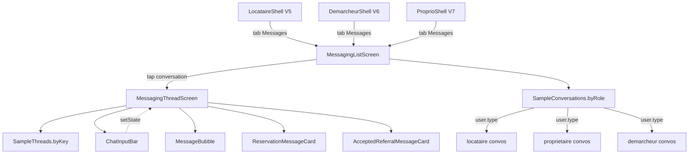
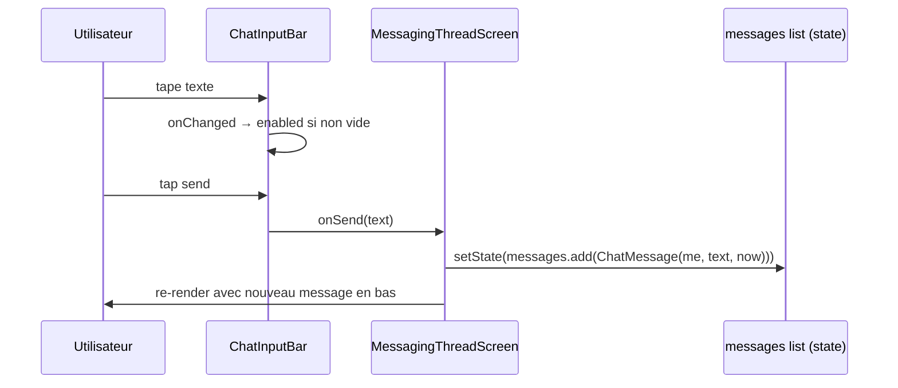

# 🏗️ Architecture — Vague 8 Messaging

> **Auteur :** Agent Architecture (workflow `/feature full`)
> **Date :** 2026-05-10
> **Spec parent :** `.ai-outputs/specs/vague-8-messaging/business-spec.md`
> **Stack :** Flutter 3.7+, BLoC 9.1.1 (intact), Material — projet existant

---

## 1. Vue d'ensemble

La Vague 8 ajoute la **messagerie transverse** partagée par les 3 rôles. Avec V8 livrée, **tous les écrans du proto sont reconstruits**. Notifications + Receipt PDF sont reportés en V9 (hors-proto).

### 1.1 Composants impactés

| Composant | Type | Action |
|---|---|---|
| `LocataireShell.pages[3]` | existant V5 | **MODIFIER** — `_MessagesPlaceholder` → `MessagingListScreen` |
| `DemarcheurShell.pages[3]` | existant V6 | **MODIFIER** — idem |
| `ProprioShell.pages[3]` | existant V7 | **MODIFIER** — idem |
| `_MessagesPlaceholder` × 3 | privés des 3 Shells | **SUPPRIMER** |
| `MessagingListScreen` | nouveau | **CRÉER** — adaptatif au rôle via `UserBloc` |
| `MessagingThreadScreen` | nouveau | **CRÉER** — bubbles + cards spéciales + input bar |
| ~7 widgets feature | nouveaux | **CRÉER** |
| 5 modèles UI-only | nouveaux | **CRÉER** |
| 2 mocks | nouveaux | **CRÉER** |

### 1.2 Réutilisation maximale (Vagues 1-7)

| Atome/Molécule | Réutilisation Vague 8 |
|---|---|
| `BadgeStatus` (6 tons) | badge rôle (Hôte/Locataire/Démarcheur/Asfar/Client) |
| `BlurContainer` | input bar sticky bottom |
| `DynamicAppBar` | header MessagingListScreen |
| `IconBoutton` | back, phone, edit, plus, send |
| `UserAvatar` | avatars conversations + thread header (46px liste, 38px header thread) |
| `ImgPh` (4 tones) | image listing dans Card Réservation (56×56) |
| `ListingPreview` | référence listing dans Card Réservation |
| `SampleListings` | source listings pour Card Réservation |
| `FcfaFormatter` | commission dans Card Demande acceptée |

---

## 2. Diagramme de structure (Mermaid)



### 2.1 Diagramme de séquence — envoi message



---

## 3. Structure des fichiers

```
lib/screen/client/shared/inbox/                            ← NOUVEAU (transverse)
├── messaging_list_screen.dart                             [NEW]
├── messaging_thread_screen.dart                           [NEW]
├── widget/
│   ├── conversation_row.dart                              [NEW: listrow conversation]
│   ├── message_bubble.dart                                [NEW: bubble me/them]
│   ├── reservation_message_card.dart                      [NEW: card Réservation]
│   ├── accepted_referral_message_card.dart                [NEW: card Demande acceptée]
│   ├── chat_input_bar.dart                                [NEW: plus + champ + send]
│   ├── messaging_search_bar.dart                          [NEW: input search liste]
│   └── conversation_role_display.dart                     [NEW: helper rôle → tone+label]
└── sample/
    ├── sample_conversations.dart                          [NEW: byRole locataire/proprio/démarcheur]
    └── sample_threads.dart                                [NEW: byKey conversationId → List<ChatMessage>]

lib/model/ui_only/                                         (étendu V8)
├── conversation_preview.dart                              [NEW + enum ConversationRole]
├── chat_message.dart                                      [NEW + enum MessageSender + MessageKind]
├── reservation_card_payload.dart                          [NEW]
└── accepted_referral_card_payload.dart                    [NEW]

lib/screen/client/locataire/locataire_shell.dart           [MODIF: _MessagesPlaceholder → MessagingListScreen]
lib/screen/client/demarcheur/demarcheur_shell.dart         [MODIF]
lib/screen/client/proprio/proprio_shell.dart               [MODIF]
```

### 3.1 Note sur `_MessagesPlaceholder`

Les 3 Shells déclarent chacun une classe privée `_MessagesPlaceholder`. **Elles seront toutes supprimées en V8** car remplacées par `MessagingListScreen`. Suppression nette, pas de migration progressive.

### 3.2 Note sur le mapping role → mocks

`MessagingListScreen` lit `UserBloc.state.user?.type` pour déterminer quels mocks afficher. Si le user ou le type est `null`, fallback sur le mock locataire (cohérence proto `extras.jsx:98`).

---

## 4. Interfaces / Contrats

### 4.1 Modèles UI-only

```dart
// lib/model/ui_only/conversation_preview.dart
enum ConversationRole { host, tenant, demarcheur, asfar, client }

class ConversationPreview {
  final String id;                       // 'L1', 'P1', etc.
  final String who;                      // 'Aminata K.'
  final ConversationRole role;
  final String sub;                      // 'Loft Plateau' ou 'REF-D8H3K · acceptée'
  final String lastMessage;
  final String time;                     // '14:32', 'Hier', '12 oct'
  final int unread;
  final bool certified;
  const ConversationPreview({...});
}

// lib/model/ui_only/chat_message.dart
enum MessageSender { me, them }
enum MessageKind { text, reservationCard, acceptedReferralCard }

class ChatMessage {
  final String id;
  final MessageSender sender;
  final String? text;                    // null pour les cards
  final String time;
  final MessageKind kind;
  final ReservationCardPayload? reservation;
  final AcceptedReferralCardPayload? acceptedReferral;
  const ChatMessage({...});
}

// lib/model/ui_only/reservation_card_payload.dart
class ReservationCardPayload {
  final ListingPreview listing;          // réutilise V5
  final String dates;                    // '12-15 nov · 3 nuits'
  final String bookingCode;              // 'ASF-7K2N9'
  const ReservationCardPayload({...});
}

// lib/model/ui_only/accepted_referral_card_payload.dart
class AcceptedReferralCardPayload {
  final String referralCode;             // 'REF-D8H3K'
  final String contextLabel;             // 'Loft Plateau · 22-25 nov'
  final int commission;                  // 13500
  const AcceptedReferralCardPayload({...});
}
```

### 4.2 `ConversationRoleDisplay` (helper)

```dart
class ConversationRoleDisplay {
  ConversationRoleDisplay._();

  static String labelOf(ConversationRole role) {
    switch (role) {
      case ConversationRole.host:        return 'Hôte';
      case ConversationRole.tenant:      return 'Locataire';
      case ConversationRole.demarcheur:  return 'Démarcheur';
      case ConversationRole.asfar:       return 'Asfar';
      case ConversationRole.client:      return 'Client';
    }
  }

  static BadgeTone toneOf(ConversationRole role) {
    // Source proto extras.jsx:126-127
    switch (role) {
      case ConversationRole.demarcheur:  return BadgeTone.info;
      case ConversationRole.asfar:       return BadgeTone.neutral;
      case ConversationRole.host:
      case ConversationRole.tenant:
      case ConversationRole.client:      return BadgeTone.accent;
    }
  }
}
```

### 4.3 `MessagingListScreen`

```dart
class MessagingListScreen extends StatefulWidget {
  const MessagingListScreen({super.key});
}

class _MessagingListScreenState extends State<MessagingListScreen> {
  String _searchQuery = '';

  @override
  Widget build(BuildContext context) {
    final user = context.watch<UserBloc>().state.user;
    final role = user?.type ?? 'locataire';
    final allConvos = SampleConversations.forRole(role);
    final visible = _filterByQuery(allConvos, _searchQuery);

    return Scaffold(
      appBar: DynamicAppBar(title: 'Messages', trailing: IconBoutton(...)),
      body: SafeArea(
        top: false,
        child: Column(
          children: [
            MessagingSearchBar(onChanged: (q) => setState(() => _searchQuery = q)),
            Expanded(
              child: ListView.builder(
                itemBuilder: (_, i) => ConversationRow(
                  conversation: visible[i],
                  isLast: i == visible.length - 1,
                  onTap: () => pushScreen(
                    context,
                    MessagingThreadScreen(conversation: visible[i]),
                  ),
                ),
              ),
            ),
          ],
        ),
      ),
    );
  }
}
```

### 4.4 `MessagingThreadScreen`

```dart
class MessagingThreadScreen extends StatefulWidget {
  final ConversationPreview conversation;
  const MessagingThreadScreen({super.key, required this.conversation});
}

class _MessagingThreadScreenState extends State<MessagingThreadScreen> {
  late List<ChatMessage> _messages;
  final _inputController = TextEditingController();
  final _scrollController = ScrollController();
  bool _canSend = false;

  @override
  void initState() {
    _messages = List.of(SampleThreads.forConversation(widget.conversation.id));
    _inputController.addListener(_onInputChanged);
    super.initState();
  }

  void _onSendMessage() {
    final text = _inputController.text.trim();
    if (text.isEmpty) return;
    setState(() {
      _messages.add(ChatMessage(
        id: 'local-${DateTime.now().millisecondsSinceEpoch}',
        sender: MessageSender.me,
        text: text,
        time: _formatNowTime(),
        kind: MessageKind.text,
      ));
      _inputController.clear();
      _canSend = false;
    });
    _scrollToBottom();
  }
  // ... build with custom header (not DynamicAppBar — proto uses fully custom)
}
```

### 4.5 `MessageBubble`

```dart
class MessageBubble extends StatelessWidget {
  final ChatMessage message;
  const MessageBubble({super.key, required this.message});

  @override
  Widget build(BuildContext context) {
    final isMe = message.sender == MessageSender.me;
    return Align(
      alignment: isMe ? Alignment.centerRight : Alignment.centerLeft,
      child: ConstrainedBox(
        constraints: BoxConstraints(
          maxWidth: MediaQuery.sizeOf(context).width * 0.78,
        ),
        child: Container(
          padding: const EdgeInsets.symmetric(horizontal: 14, vertical: 10),
          decoration: BoxDecoration(
            color: isMe ? AppColors.accent : AppColors.bgElev2,
            borderRadius: BorderRadius.only(
              topLeft: const Radius.circular(18),
              topRight: const Radius.circular(18),
              bottomLeft: Radius.circular(isMe ? 18 : 6),
              bottomRight: Radius.circular(isMe ? 6 : 18),
            ),
          ),
          child: Column(
            crossAxisAlignment: CrossAxisAlignment.start,
            children: [
              Text(message.text!,
                  style: TextStyle(
                    fontSize: 14, height: 1.4,
                    color: isMe ? AppColors.onAccent : AppColors.text,
                  )),
              const SizedBox(height: 4),
              Align(
                alignment: isMe ? Alignment.centerRight : Alignment.centerLeft,
                child: Text(message.time,
                    style: TextStyle(
                      fontSize: 10,
                      color: (isMe ? AppColors.onAccent : AppColors.text)
                          .withValues(alpha: 0.6),
                    )),
              ),
            ],
          ),
        ),
      ),
    );
  }
}
```

---

## 5. CONTRAT D'IMPLÉMENTATION

### Pages / Écrans (2)

- [ ] `lib/screen/client/shared/inbox/messaging_list_screen.dart` → DynamicAppBar « Messages » + IconBoutton edit (SnackBar stub) + `MessagingSearchBar` + `ListView.builder` de `ConversationRow` filtrée par `_searchQuery`. Lit `UserBloc.state.user?.type` pour le mock à charger.
- [ ] `lib/screen/client/shared/inbox/messaging_thread_screen.dart` → header custom (back + UserAvatar 38 + nom + shield + sub + IconBoutton phone) + `ListView.builder` de messages avec séparateur de date « Aujourd'hui » en haut + `ChatInputBar` sticky bottom dans un `BlurContainer`. State: `List<ChatMessage> _messages` + `TextEditingController` + scroll auto vers le bas après ajout.

### Widgets feature (7)

- [ ] `conversation_row.dart` → `Material > InkWell` avec : `UserAvatar 46×46` + Column (Row[who 14 w600 + shield 12 + spacer + time 11 small] + Row[BadgeStatus rôle fontSize 9 + sub small 11] + Row[lastMessage truncate 13 + badge unread cercle 18 accent or si unread > 0]). Border-bottom `line` si pas dernier.
- [ ] `message_bubble.dart` → bubble me/them avec radius queue (top 18, bottom opposé 6) + texte + heure 10px en bas
- [ ] `reservation_message_card.dart` → Container `bgElev1 line lg` maxWidth 82% padding 12 + Row[ImgPh 56×56 radius 10 tone listing.tone + Column[eyebrow RÉSERVATION + titre 13 w600 + sub dates 11 small + bookingCode mono 11 w600]]
- [ ] `accepted_referral_message_card.dart` → Container `accentSoft` border `accent 0.25` maxWidth 82% padding 12 + Row[icon check accent + label « Demande acceptée » 13 w700 accent] + sub `t-small` 11 + `Commission: +${FcfaFormatter.full(commission)}` mono 13 w700
- [ ] `chat_input_bar.dart` → Container avec borderTop line + BlurContainer + Row[IconBoutton plus (SnackBar) + InputField (réutilise V1) flex 1 hint « Message… » + bouton rond 40×40 accent or icon send]. Le bouton send appelle `widget.onSend(text)` si non vide, sinon désactivé visuellement.
- [ ] `messaging_search_bar.dart` → InputField (réutilise V1) avec leadingIcon search + hintText « Rechercher » + onChanged callback
- [ ] `conversation_role_display.dart` → helper static `labelOf(ConversationRole)` + `toneOf(ConversationRole)` (mapping cf. § 4.2)

### Modèles UI-only (4 fichiers + 3 enums)

- [ ] `lib/model/ui_only/conversation_preview.dart` → classe + enum `ConversationRole`
- [ ] `lib/model/ui_only/chat_message.dart` → classe + enum `MessageSender` + enum `MessageKind`
- [ ] `lib/model/ui_only/reservation_card_payload.dart` → classe (utilise `ListingPreview` V5)
- [ ] `lib/model/ui_only/accepted_referral_card_payload.dart` → classe

### Mocks (2)

- [ ] `lib/screen/client/shared/inbox/sample/sample_conversations.dart` → `static const Map<String, List<ConversationPreview>> byRole = {...}` aligné sur `extras.jsx:80-97`. Méthode `forRole(String role)` avec fallback locataire.
- [ ] `lib/screen/client/shared/inbox/sample/sample_threads.dart` → `static final Map<String, List<ChatMessage>> byConversation = {...}` (clés = ids des conversations). Au moins 1 thread par rôle avec :
  - **Locataire 'L1' (Aminata K.)** : 5 messages dont 1 `reservationCard` (ASF-7K2N9, Loft Plateau, 12-15 nov)
  - **Proprio 'P1' (Rachid B.)** : 4 messages texte
  - **Démarcheur 'D1' (Aminata K.)** : 5 messages dont 1 `acceptedReferralCard` (REF-D8H3K, 13 500 FCFA)
  - Méthode `forConversation(String id)` avec fallback liste vide.

### Fichiers à modifier (3)

- [ ] `lib/screen/client/locataire/locataire_shell.dart` → import `MessagingListScreen` + remplacer `_MessagesPlaceholder()` par `MessagingListScreen()` dans `pages[3]` + supprimer la classe `_MessagesPlaceholder`
- [ ] `lib/screen/client/demarcheur/demarcheur_shell.dart` → idem
- [ ] `lib/screen/client/proprio/proprio_shell.dart` → idem

### Suppressions (3 classes)

- [ ] Classe privée `_MessagesPlaceholder` dans `locataire_shell.dart`
- [ ] Classe privée `_MessagesPlaceholder` dans `demarcheur_shell.dart`
- [ ] Classe privée `_MessagesPlaceholder` dans `proprio_shell.dart`

---

## 6. Conventions à respecter

- 10 règles Flutter (NON NÉGOCIABLES) — 1 widget = 1 fichier, pas de fonction privée → Widget, helpers dédiés
- Tokens uniquement (`AppColors.*`, `AppRadii.*`, `AppTextStyles.*`)
- SOLID nouveau code — séparation rôles via mocks `byRole`
- Pattern Vagues 5-7 : `lib/screen/client/{role}/{feature}/...`, mocks dans `sample/`, modèles UI-only dans `lib/model/ui_only/`

---

## 7. Risques et points d'attention

| Risque | Impact | Mitigation |
|---|---|---|
| Header thread custom (proto pas DynamicAppBar) | Incohérence avec V5-V7 | Construire un `Container` borderBottom + Row dans le body au lieu de `appBar:` — proto fait pareil |
| Scroll vers le bas après nouveau message | Mauvaise UX si reste figé en haut | `WidgetsBinding.instance.addPostFrameCallback((_) => _scrollToBottom())` après setState |
| Filtrage search casse-sensible | UX dégradée | `toLowerCase()` sur query et sur `who`/`sub`/`lastMessage` avant `contains` |
| `BadgeStatus` ne supporte pas fontSize 9 directement | Visuel pas exact proto | `BadgeStatus` accepte default 11 — tolérable. Si besoin créer un override visuel mineur (1-2px diff non bloquant) |
| Messages mock locale perdus au switch d'onglet (Shell IndexedStack) | UX surprenante | OK car cohérent avec mocks V5-V7 — documenter dans la doc |
| `UserBloc` non disponible si screen utilisé hors arbre Bloc | Crash | `MessagingListScreen` est UNIQUEMENT branché dans les 3 Shells qui sont eux-mêmes dans `MaterialApp` avec `MultiBlocProvider` (cf. main.dart) — sécurisé |
| Cards spéciales (Réservation/Accepted) tap → navigation cible inexistante en V8 | Frustration | SnackBar stub avec message « Détail disponible prochainement » |

---

## 8. Ordre d'implémentation suggéré (4 lots)

1. **Lot 1 — Modèles + helper + mocks** (débloque tout)
   - 4 fichiers modèles UI-only
   - `ConversationRoleDisplay` helper
   - 2 mocks `SampleConversations`, `SampleThreads`
   - **Gate :** compile, types OK

2. **Lot 2 — Widgets feature** (7 widgets)
   - `MessagingSearchBar`, `ConversationRow`, `MessageBubble`, `ReservationMessageCard`, `AcceptedReferralMessageCard`, `ChatInputBar`
   - **Gate :** widgets en isolation OK

3. **Lot 3 — Écrans**
   - `MessagingListScreen` (lit UserBloc + filtre search + tap → push thread)
   - `MessagingThreadScreen` (header custom + ListView messages + ChatInputBar + setState envoi)
   - **Gate :** écrans rendus en isolation, switch entre conversations OK

4. **Lot 4 — Branchement Shells + doc**
   - 3 Shells modifiés (suppression `_MessagesPlaceholder`)
   - `RECONSTRUCTION_UI_ASFAR.md` mis à jour
   - Documentation HTML (Étape 8 du workflow)
   - **Gate :** E2E onglet Messages fonctionnel pour les 3 rôles, switch tri-directionnel toujours OK

---

## 9. Critères de conformité (vérification post-dev)

- [ ] Tous les fichiers du contrat (§ 5) sont créés/modifiés
- [ ] 3 classes `_MessagesPlaceholder` supprimées (compteur grep doit donner 0)
- [ ] `MessagingListScreen` lit `UserBloc.state.user?.type` correctement
- [ ] Mocks par rôle fournissent 3-4 conversations chacun
- [ ] Au moins 1 `reservationCard` + 1 `acceptedReferralCard` dans les threads mock
- [ ] Bouton send désactivé visuellement si champ vide
- [ ] Aucune couleur/padding/size en dur (tokens uniquement)
- [ ] 1 widget = 1 fichier respecté
- [ ] Aucune fonction privée retourne un Widget (sauf StatefulWidget interne)
- [ ] `flutter analyze` 0 nouvelle erreur (legacy 41 issues inchangées)
- [ ] Switch tri-directionnel Locataire ↔ Démarcheur ↔ Propriétaire toujours fonctionnel après V8

---

## 10. Flag UI

**UI_REQUIRED: true**

(7 widgets visuels + 2 écrans + branchement de 3 Shells — UI complète)

---

> ✅ Architecture prête pour validation utilisateur.

---

## 11. Vérification post-développement (2026-05-10)

**Verdict : ✅ CONFORME**

### Couverture du contrat (§ 5)

| Catégorie | Items contrat | Items livrés | Statut |
|---|---|---|---|
| Pages / Écrans | 2 | 2 | ✅ |
| Widgets feature | 7 | 7 | ✅ |
| Modèles UI-only | 4 (+ 3 enums) | 4 (+ 3 enums) | ✅ |
| Mocks | 2 | 2 | ✅ |
| Modifs Shells | 3 | 3 | ✅ |
| Suppressions `_MessagesPlaceholder` | 3 | 3 (grep = 0) | ✅ |
| Doc `RECONSTRUCTION_UI_ASFAR.md` | 1 | 1 | ✅ |

**Total : 21 livrables livrés sur 21 attendus.**

### Écarts (3, tous justifiés)

1. `BlurContainer` wrappe `ChatInputBar` → cohérence Liquid Glass Asfar (documenté `ui-proposal.md § 8`)
2. Header thread custom inline → fidélité proto extras.jsx:194-214 (documenté `architecture.md § 4.4`)
3. Threads dynamiques (3 riches + autres vides + header dynamique) → décision utilisateur explicite

### Quality gate

- `flutter analyze` : 41 issues legacy uniquement, 0 nouvelle issue
- Aucun item manquant
- Aucun ajout non justifié
- Tous les patterns Vagues 1-7 respectés (réutilisation `UserAvatar`, `BadgeStatus`, `BlurContainer`, `IconBoutton`, `InputField`, `ImgPh`, `ListingPreview`, `SampleListings`, `FcfaFormatter`)

→ **Audit qualité (ÉTAPE 6) peut démarrer.**
