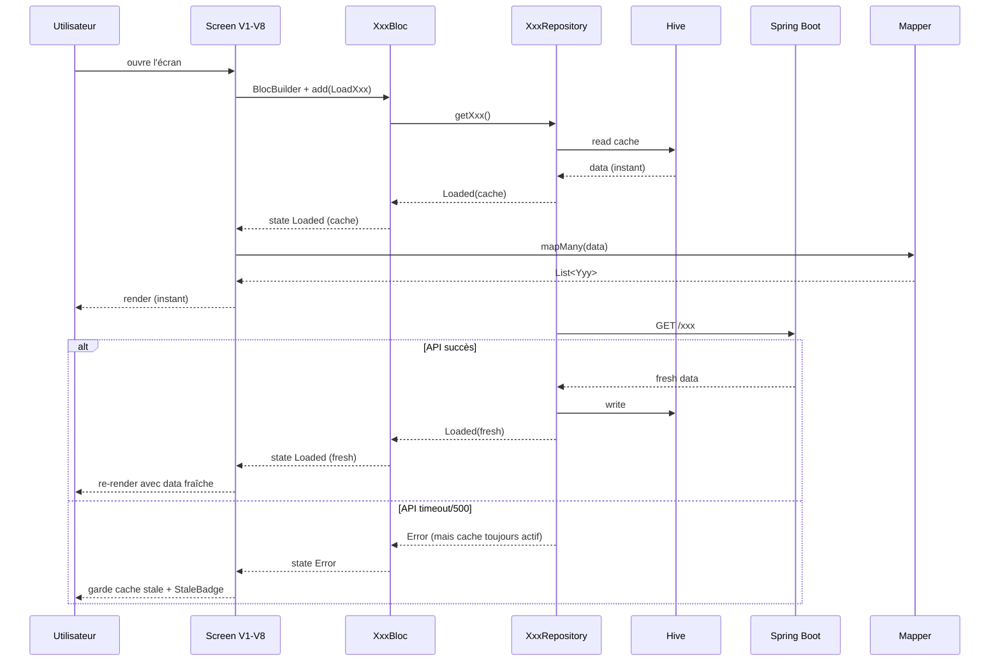

# 🏗️ Architecture — Vague de finition · Branchement BLoCs réels

> **Auteur :** Agent Architecture (workflow `/feature full`)
> **Date :** 2026-05-10
> **Spec parent :** `.ai-outputs/specs/vague-finition-bloc-binding/business-spec.md`
> **Stack :** Flutter 3.7+, BLoC 9.1.1 (intact, 21 BLoCs), Hive (cache existant), dio (déjà configuré) — projet existant
> **Scope :** méga-chantier transverse · 15 lots par BLoC · ~20 écrans · ~12 mocks à retirer

---

## 1. Vue d'ensemble

Branchement de tous les écrans Vagues 1-8 sur les 21 BLoCs métier existants, suppression des mocks `Sample*`, gestion unifiée loading/error/empty/stale, finalisation des 3 chantiers connexes (`EmptyState`, calendrier édition, persistance switch rôle).

### 1.1 Composants impactés

| Composant | Type | Action |
|---|---|---|
| BLoCs (21) | existants | **NE PAS MODIFIER** (règle SOLID nouveau code) — adapter les écrans à leurs états actuels |
| ~12 fichiers `Sample*` | existants | **SUPPRIMER** en fin de vague (Lot 15) |
| ~20 écrans Vagues 5-8 | existants | **MODIFIER** : remplacer `Sample*.all` par `BlocBuilder<XxxBloc>` + mapping |
| Modèles UI-only V5-V8 (`lib/model/ui_only/`) | existants | **CONSERVER** — DTO de présentation |
| Mappers métier → UI | nouveaux | **CRÉER** dans `lib/util/mapping/` |
| Calculators | nouveaux | **CRÉER** dans `lib/util/calc/` |
| Widget `EmptyState` | nouveau | **CRÉER** dans `lib/widget/feedback/` |
| Widget `StaleBadge` | nouveau | **CRÉER** dans `lib/widget/feedback/` |
| `UserBloc::SetActiveRole` event | nouveau | **AJOUTER** à `UserBloc` (extension contrôlée) |

---

## 2. Pattern de référence (NON NÉGOCIABLE pour les 15 lots)

Le risque majeur du chantier est que chaque lot réinvente sa propre approche. **Ce pattern est imposé pour tous les écrans qui chargent des données BLoC.**

### 2.1 Pattern de branchement BLoC

```dart
// Pattern 1 : BlocBuilder direct + switch sur les états + mapping helper
BlocBuilder<AppartementBloc, AppartementState>(
  builder: (context, state) {
    if (state is AppartementLoading || state is AppartementInitial) {
      return const _LoadingView();
    }
    if (state is AppartementError) {
      return EmptyState.error(
        message: state.message,
        onRetry: () => context.read<AppartementBloc>().add(LoadAppartements()),
      );
    }
    if (state is AppartementsByOwnerLoaded) {
      final listings = AppartementToListingMapper.mapMany(state.appartements);
      if (listings.isEmpty) {
        return EmptyState.empty(
          icon: Icons.home_outlined,
          title: 'Aucune annonce',
          body: 'Vos annonces apparaîtront ici.',
          ctaLabel: 'Nouvelle annonce',
          onCtaTap: () => _stub(context, 'Création F2'),
        );
      }
      return _ListView(listings: listings);
    }
    return const _LoadingView(); // fallback
  },
)
```

### 2.2 Pattern de mutations

```dart
// Pattern 2 : context.read pour dispatcher des events
context.read<FavoriteBloc>().add(ToggleFavorite(appartementId: l.id));

// Si feedback nécessaire (Snackbar) :
BlocListener<FavoriteBloc, FavoriteState>(
  listener: (context, state) {
    if (state is FavoriteError) {
      ScaffoldMessenger.of(context).showSnackBar(
        SnackBar(content: Text(state.message)),
      );
    }
  },
  child: ...
)
```

### 2.3 Cache-first + stale indicator

Le pattern cache-first est déjà géré dans les Repositories (cf. `cache-offline-reservations.html`). Côté UI, le `BlocBuilder` reçoit naturellement :
1. **D'abord** l'état Loaded depuis cache Hive (instantané)
2. **Ensuite** l'état Loaded à jour après fetch API (ou Error si échec)

→ Si le state Loaded expose un `lastFetch: DateTime?`, on l'utilise pour `StaleBadge`. Si absent, pas de badge stale (acceptable pour V8.5).

### 2.4 Vue de chargement standardisée

Pas de spinner Material. Utiliser `ShimmerCard` V1 ou un layout placeholder cohérent avec le contenu attendu.

```dart
class _LoadingView extends StatelessWidget {
  const _LoadingView();
  @override
  Widget build(BuildContext context) {
    return ListView.separated(
      padding: const EdgeInsets.fromLTRB(18, 0, 18, 100),
      itemCount: 4,
      separatorBuilder: (_, __) => const SizedBox(height: 14),
      itemBuilder: (_, __) => const ShimmerCard(height: 140), // V1
    );
  }
}
```

### 2.5 Conventions de nommage

| Élément | Convention | Exemple |
|---|---|---|
| Mapper | `XxxToYyyMapper` | `AppartementToListingMapper.mapOne(a)` |
| Calculator | `XxxCalculator` | `ProjectionCalculator.q1Estimation(reservations)` |
| Aggregator | `XxxAggregator` | `KpiAggregator.fromAppartements(list)` |
| Helper screen utility | `_` privée dans le screen | `_LoadingView`, `_stub(context, msg)` |

---

## 3. Helpers transverses (Lot 1 — fondations)

### 3.1 `EmptyState` widget

```dart
// lib/widget/feedback/empty_state.dart

enum EmptyStateVariant {
  /// Hero gradient or 120×120 + icon 40 + titre + body + CTA primary lg block.
  /// Usage : zones principales (DemarcheurReferralsScreen, LocataireFavorites, etc.)
  hero,

  /// Inline minimal : icon 64 bgElev3 + titre body + body small + CTA optionnel.
  /// Usage : dans les sections de Dashboard (« Aucun référé »)
  inline,

  /// Erreur réseau : icon `cloud_off` 64 + titre danger + body + bouton retry.
  /// Usage : timeout / 500 / pas de cache
  error,
}

class EmptyState extends StatelessWidget {
  final EmptyStateVariant variant;
  final IconData icon;
  final String title;
  final String body;
  final String? ctaLabel;
  final VoidCallback? onCtaTap;
  final VoidCallback? onRetry;

  const EmptyState._({
    required this.variant,
    required this.icon,
    required this.title,
    required this.body,
    this.ctaLabel,
    this.onCtaTap,
    this.onRetry,
  });

  factory EmptyState.hero({
    required IconData icon,
    required String title,
    required String body,
    String? ctaLabel,
    VoidCallback? onCtaTap,
  }) => EmptyState._(
    variant: EmptyStateVariant.hero,
    icon: icon, title: title, body: body,
    ctaLabel: ctaLabel, onCtaTap: onCtaTap,
  );

  factory EmptyState.inline({...}) => ...;

  factory EmptyState.error({
    required String message,
    required VoidCallback onRetry,
  }) => EmptyState._(
    variant: EmptyStateVariant.error,
    icon: Icons.cloud_off,
    title: 'Connexion impossible',
    body: message,
    ctaLabel: 'Réessayer',
    onRetry: onRetry,
  );

  @override
  Widget build(BuildContext context) {
    // 3 builders selon variant
  }
}
```

### 3.2 `StaleBadge` widget

```dart
// lib/widget/feedback/stale_badge.dart

class StaleBadge extends StatelessWidget {
  final DateTime lastFetch;
  final VoidCallback? onRefresh;

  const StaleBadge({
    super.key,
    required this.lastFetch,
    this.onRefresh,
  });

  String _humanRelative(DateTime t) {
    final diff = DateTime.now().difference(t);
    if (diff.inMinutes < 1) return 'à l\'instant';
    if (diff.inMinutes < 60) return 'il y a ${diff.inMinutes} min';
    if (diff.inHours < 24) return 'il y a ${diff.inHours} h';
    return 'il y a ${diff.inDays} j';
  }

  // Visual : pill bgElev2 border line, icon refresh + texte 11px
  // Affiché uniquement si onRefresh != null && lastFetch.isBefore(5min ago)
}
```

### 3.3 Mappers (1 par modèle source)

```
lib/util/mapping/
├── appartement_to_listing.dart       (Appartement → ListingPreview V5)
├── reservation_to_referral.dart      (Reservation → ReferralPreview V6 + ReferralStatus)
├── reservation_to_trip.dart          (Reservation → TripCard data V5)
├── conversation_to_preview.dart      (Conversation backend → ConversationPreview V8)
├── message_to_chat.dart              (Message backend → ChatMessage V8 + détection MessageKind)
├── compte_to_commission.dart         (Compte transactions → CommissionTransaction V6)
├── charge_to_pnl_entry.dart          (Charge → PnLEntry V7)
├── appartement_to_property_perf.dart (Appartement → PropertyPerf V7)
└── partenariat_to_pending_request.dart (Partenariat → PendingRequest V7)
```

Chaque mapper expose :
- `static Yyy mapOne(Xxx source)` — 1 entité
- `static List<Yyy> mapMany(List<Xxx> sources)` — collection
- `static Yyy? mapNullable(Xxx? source)` — graceful null

### 3.4 Calculators (calculs locaux Flutter)

```
lib/util/calc/
├── projection_calculator.dart        (extrapolation Q1 estimation depuis Reservation history)
├── kpi_aggregator.dart               (KPIs Dashboard proprio depuis liste Appartement + Reservation)
├── cashflow_aggregator.dart          (segments cashflow stack depuis Charge + Reservation + Compte)
├── monthly_revenue_calculator.dart   (Sparkbar 6 mois depuis Reservation history)
└── commission_calculator.dart        (Commission démarcheur 10% × subtotal — déjà en logique mock)
```

### 3.5 `UserBloc::SetActiveRole` event

```dart
// lib/bloc/user_bloc/user_event.dart (extension)

class SetActiveRole extends UserEvent {
  final String roleId;
  const SetActiveRole({required this.roleId});
}

// lib/bloc/user_bloc/user_bloc.dart (handler)

on<SetActiveRole>((event, emit) async {
  final user = state.user;
  if (user == null) return;
  user.type = event.roleId;
  await StorageService.instance.saveUser(user); // persistance Hive
  emit(UserLoaded(loadedUser: user)); // re-emit pour rebuild widgets
  // ⚠️ NE PAS appeler _startDataPreloading — switch UI seul
});
```

---

## 4. Diagramme de flux global



---

## 5. CONTRAT D'IMPLÉMENTATION (par lot)

### Lot 1 — Fondations transverses

#### Widgets
- [ ] `lib/widget/feedback/empty_state.dart` → 3 variants (hero / inline / error) avec factories
- [ ] `lib/widget/feedback/stale_badge.dart` → pill avec timestamp humain + bouton refresh

#### Mappers (placeholders, à remplir lots suivants)
- [ ] `lib/util/mapping/.gitkeep` → créer le dossier

#### Calculators (placeholders)
- [ ] `lib/util/calc/.gitkeep` → créer le dossier

**Gate Lot 1 :** `EmptyState.hero/inline/error` rendus en isolation OK, `StaleBadge` rendu OK, `flutter analyze` 0 erreur.

---

### Lot 2 — UserBloc::SetActiveRole + persistance Hive

- [ ] `lib/bloc/user_bloc/user_event.dart` → ajouter classe `SetActiveRole(roleId)`
- [ ] `lib/bloc/user_bloc/user_bloc.dart` → handler `on<SetActiveRole>` qui mute user + saveUser Hive + emit UserLoaded SANS preloading
- [ ] `lib/screen/client/shared/profile/client_profile_screen.dart::_onSwitchRole` → dispatch `context.read<UserBloc>().add(SetActiveRole(roleId))` au lieu de muter user.type en mémoire
- [ ] Vérifier que `RoleHomeRouter.shellFor` est toujours appelé après le state UserLoaded émis

**Gate Lot 2 :** switch de rôle fonctionnel + persistance Hive validée (logout/login ramène au dernier rôle actif), 0 préchargement déclenché.

---

### Lot 3 — AppartementBloc

#### Mapper
- [ ] `lib/util/mapping/appartement_to_listing.dart` → `Appartement → ListingPreview` (id, tone, title, area, city, price, rating, reviews, beds, baths, surface, superhost)

#### Écrans à modifier
- [ ] `lib/screen/client/locataire/home/home_screen.dart` → remplacer `SampleListings.all` par `BlocBuilder<AppartementBloc, AppartementState>` + mapper
- [ ] `lib/screen/client/locataire/home/search_screen.dart` → idem (filter sur AppartementBloc)
- [ ] `lib/screen/client/locataire/booking/detail_screen.dart` → charger detail depuis `AppartementBloc::LoadOne(id)`
- [ ] `lib/screen/client/proprio/appartements/listings_screen.dart` → `AppartementsByOwnerLoaded` filtré sur `mes appartements`
- [ ] `lib/screen/client/proprio/appartements/listing_edit_screen.dart` → tab Infos branchée sur l'appartement réel

**Gate Lot 3 :** locataire voit les vrais appartements + proprio voit ses annonces, `flutter analyze` 0 erreur.

---

### Lot 4 — ReservationBloc

#### Mapper
- [ ] `lib/util/mapping/reservation_to_trip.dart` → `Reservation → TripCard data`
- [ ] `lib/util/mapping/reservation_to_referral.dart` → `Reservation (côté démarcheur) → ReferralPreview` (avec mapping `ReservationStatus → ReferralStatus`)

#### Écrans
- [ ] `lib/screen/client/locataire/trips/trips_screen.dart` → liste depuis `ReservationBloc.state` filtré "à venir / passées"
- [ ] `lib/screen/client/locataire/booking/reserve_screen.dart` → étape 3 dispatch `CreateReservation(appartementId, dates)` au lieu du mock booking code
- [ ] `lib/screen/client/proprio/home/dashboard_screen.dart` → section « Demandes en attente » partielle depuis `ReservationBloc` (status=pending)

**Gate Lot 4 :** Réservation créée côté backend visible dans Trips, Dashboard proprio voit les nouvelles demandes.

---

### Lot 5 — FavoriteBloc

#### Mapper
- [ ] `lib/util/mapping/favorite_to_listing.dart` → si `Favorite` model existe, mapper vers `ListingPreview` ; sinon utiliser `AppartementToListingMapper`

#### Écrans
- [ ] `lib/screen/client/locataire/favorite/favorite_screen.dart` → liste depuis `FavoriteBloc.state.favorites`
- [ ] `lib/widget/img/floating_heart_button.dart` → tap dispatch `FavoriteBloc::ToggleFavorite` + `BlocListener` pour SnackBar erreur
- [ ] Toutes les cards qui ont un heart (`ListingPreview`, `FeaturedListingCard`, `SavedListingCard`) → vérifier qu'elles dispatch ToggleFavorite

**Gate Lot 5 :** ajout/retrait favori persisté côté backend, refresh écran montre le bon état.

---

### Lot 6 — DemarcheurBloc + ProprietaireDemarcheurBloc

#### Mapper
- [ ] `lib/util/mapping/partenariat_to_pending_request.dart` → `Partenariat → PendingRequest` (côté proprio Dashboard)

#### Écrans
- [ ] `lib/screen/client/demarcheur/home/dashboard_screen.dart` → KPIs depuis `DemarcheurBloc` (commissionMois, totalCommission, pending, accepted, taux), liste référés depuis `ReservationBloc` filtré côté démarcheur
- [ ] `lib/screen/client/demarcheur/referrals/referrals_screen.dart` → liste filtrée par statut depuis `ReservationBloc` (côté démarcheur)
- [ ] `lib/screen/client/demarcheur/referrals/referral_detail_screen.dart` → timeline depuis `Reservation.status` + historique
- [ ] `lib/screen/client/demarcheur/referrals/new_referral_screen.dart` → step 3 dispatch `ReservationBloc::CreateReservation` côté démarcheur (paramétré démarcheur)

**Gate Lot 6 :** parcours démarcheur complet branché backend.

---

### Lot 7 — PartenariatBloc

- [ ] `lib/screen/client/demarcheur/...` (si écrans dédiés partenariat) — branchement
- [ ] Reporté à F5 hors-V si pas de cible immédiate dans V1-V8

**Gate Lot 7 :** dépend du contenu réel — peut être no-op si aucun écran V1-V8 n'utilise PartenariatBloc directement.

---

### Lot 8 — CompteBloc + ChargeBloc + Calculators

#### Calculators
- [ ] `lib/util/calc/projection_calculator.dart` → calcule `q1Estimation` depuis `List<Reservation>` historique (extrapolation simple : moyenne 3 derniers mois × 3)
- [ ] `lib/util/calc/kpi_aggregator.dart` → `KpiAggregator.fromAppartementsAndReservations(...)` → `List<ProprioKpi>` (Occupation, ADR, Réservations, Note moy)
- [ ] `lib/util/calc/cashflow_aggregator.dart` → segments cashflow depuis `Charge` + `Compte` + `Reservation`
- [ ] `lib/util/calc/monthly_revenue_calculator.dart` → 6 derniers mois depuis `Reservation` history
- [ ] `lib/util/calc/commission_calculator.dart` → 10% × subtotal (déjà en logique mock V6)

#### Mappers
- [ ] `lib/util/mapping/charge_to_pnl_entry.dart`
- [ ] `lib/util/mapping/appartement_to_property_perf.dart` → utilise occupancy + monthlyRevenue déjà sur Appartement model

#### Écrans
- [ ] `lib/screen/client/proprio/home/dashboard_screen.dart` → `RevenueHeroCard` depuis `MonthlyRevenueCalculator` + `KpiAggregator` + `CashflowAggregator`
- [ ] `lib/screen/client/proprio/comptabilite/finances_screen.dart` → `BeneficeNetHeroCard`, `PnLCard`, `PropertyPerfRow`, `ProjectionChart` tous branchés
- [ ] `lib/screen/client/demarcheur/wallet/wallet_screen.dart` → `WalletSoldeCard.amount` + `historique` depuis `CompteBloc` (transactions démarcheur)

**Gate Lot 8 :** P&L réel rendu, projection fonctionnelle, Wallet démarcheur OK.

---

### Lot 9 — ConversationBloc + Helper détection MessageKind

#### Mapper
- [ ] `lib/util/mapping/conversation_to_preview.dart` → `Conversation → ConversationPreview` (V8)
- [ ] `lib/util/mapping/message_to_chat.dart` → `Message → ChatMessage` avec **détecteur de kind** :
  - Si message contient `bookingCode` (regex `ASF-\w+`) → `MessageKind.reservationCard`
  - Si message contient `referralCode` + `commission` (regex `REF-\w+` + montant) → `MessageKind.acceptedReferralCard`
  - Sinon → `MessageKind.text`

#### Écrans
- [ ] `lib/screen/client/shared/inbox/messaging_list_screen.dart` → remplacer `SampleConversations.forRole` par `ConversationBloc.state.conversations` filtrées par `user.type`
- [ ] `lib/screen/client/shared/inbox/messaging_thread_screen.dart` → messages depuis `ConversationBloc::LoadMessages(conversationId)`
- [ ] Bouton send : dispatch `ConversationBloc::SendMessage(conversationId, text)` au lieu de setState mock local

**Gate Lot 9 :** messagerie réelle branchée (pas de WebSocket — vague ultérieure pour temps réel).

---

### Lot 10 — NotificationBloc

#### Écrans
- [ ] Bouton bell des Dashboards (V6/V7) → push vers `NotificationsScreen` (à créer simple : liste depuis `NotificationBloc.state.notifications`)
- [ ] `lib/screen/client/shared/notifications/notifications_screen.dart` → écran nouveau simple (pas dans le proto, mais nécessaire pour brancher)

**Gate Lot 10 :** notifications affichées si dispo, sinon EmptyState.

---

### Lot 11 — MapBloc

#### Écrans
- [ ] `lib/screen/client/locataire/home/search_screen.dart` (si filtre par carte) → utiliser `MapBloc` pour la zone géographique

**Gate Lot 11 :** filtrage carte fonctionnel (peut être réduit si écran search ne fait pas de filtrage carte).

---

### Lot 12 — CalendarPlageBloc + Édition calendrier proprio

#### Écrans
- [ ] `lib/screen/client/proprio/appartements/widget/mini_calendar_grid.dart` → ajouter callbacks `onDayTap(int day)` et `onMonthChange(int delta)`
- [ ] `lib/screen/client/proprio/appartements/widget/listing_calendar_tab.dart` → wrapper avec `BlocBuilder<CalendarPlageBloc>` + `BlocListener` pour SnackBar erreur. Appelle `LoadPlages(month, listingId)` au mount + sur change. `BlockDay`/`UnblockDay` au tap.

**Gate Lot 12 :** tap jour disponible le bloque côté backend, navigation mois fonctionnelle.

---

### Lot 13 — PaysBloc

#### Écrans
- [ ] `lib/screen/signup/widget/signup_form.dart` → utiliser `PaysBloc.state.pays` pour la liste des pays au lieu d'une liste hardcodée

**Gate Lot 13 :** liste pays signup branchée.

---

### Lot 14 — EmptyState dans 8 zones

Après que les BLoCs soient branchés (Lots 3-13), brancher `EmptyState` dans chaque écran qui peut être vide :

- [ ] `LocataireTripsScreen` (aucune réservation) → `EmptyState.hero(icon: airplane_ticket, title: 'Aucun voyage', body: 'Vos prochaines réservations apparaîtront ici', ctaLabel: 'Explorer', onCtaTap: switchTab(0))`
- [ ] `LocataireFavoriteScreen` (aucun favori) → `EmptyState.hero(icon: heart, title: 'Aucun favori', body: '...')`
- [ ] `ProprioListingsScreen` (aucune annonce) → `EmptyState.hero(icon: home_work, title: 'Aucune annonce', ctaLabel: 'Nouvelle annonce')` (CTA stub F2)
- [ ] `DemarcheurReferralsScreen` (filtre vide) → `EmptyState.inline(...)` selon filtre
- [ ] `DemarcheurWalletScreen` (historique vide) → `EmptyState.inline(...)`
- [ ] `ProprioDashboard` sections « Clients référés » / « Logements à pousser » vides → `EmptyState.inline`
- [ ] `MessagingListScreen` (aucune conversation) → `EmptyState.hero(...)`
- [ ] `MessagingThreadScreen` (thread vide) → reste sur le placeholder existant V8 (« Démarrez la conversation… »)

**Gate Lot 14 :** chaque cas vide affiche un EmptyState approprié.

---

### Lot 15 — Suppressions + cleanup + doc

#### Suppressions
- [ ] `lib/screen/client/locataire/home/sample_listings.dart`
- [ ] `lib/screen/client/demarcheur/sample/` (3 fichiers)
- [ ] `lib/screen/client/proprio/sample/` (5 fichiers)
- [ ] `lib/screen/client/shared/inbox/sample/` (2 fichiers)

#### Vérification
- [ ] `grep -rn "Sample[A-Z]" lib/` retourne 0 occurrences
- [ ] `flutter analyze` 0 nouvelle erreur (legacy 41 inchangées)

#### Documentation
- [ ] `RECONSTRUCTION_UI_ASFAR.md` : section TODO REBUILD vidée des items traités, section "Vague de finition" cochée
- [ ] Documentation HTML (Étape 8 du workflow)

**Gate Lot 15 :** projet branché 100% backend, mocks supprimés, doc à jour.

---

## 6. Conventions à respecter

### 6.1 10 règles Flutter (NON NÉGOCIABLES)
- 1 widget = 1 fichier
- Pas de fonction privée → Widget en racine de screen (fonctions privées builders sub-section OK comme V6/V7)
- Helpers dans fichiers dédiés
- Tokens uniquement (`AppColors.*`, `AppRadii.*`, `AppTextStyles.*`)

### 6.2 SOLID nouveau code
- Mappers, Calculators, EmptyState : nouveaux composants → SOLID strict
- BLoCs existants : NE PAS refactorer (règle projet — refacto SOLID des BLoCs = chantier indépendant)

### 6.3 Cache-first respecté
- Toujours utiliser le pattern existant côté Repository
- Si BLoC ne supporte pas cache : ne pas le forcer dans cette vague (laisser pour vague ultérieure)

### 6.4 0 régression V1-V8
- Test E2E manuel par rôle après chaque lot
- Si un lot casse un écran V1-V8, on annule le lot avant de passer au suivant

---

## 7. Risques et points d'attention

| Risque | Impact | Mitigation |
|---|---|---|
| États BLoC non-discriminés (multiple Loaded variants) | Pattern BlocBuilder ambigu | Documenter dans chaque lot quel state Loaded utiliser, fallback sur switch is XxxLoaded |
| Backend offline pendant dev | Blocage tests runtime | EmptyState.error retry + cache Hive permet de continuer le dev sans backend |
| Modèles backend incompatibles avec UI-only | Crash mapping | Mappers tolérants : null-safe, default values, log warning si champ manquant |
| Lot 8 Calculators complexes (KPI agrégation) | Logique métier complexe | Découper en helpers atomiques + tester avec données mock contrôlées |
| `MessageKind` détection regex faillible | Cards spéciales pas affichées | Détecteur conservateur : si doute → MessageKind.text. Documenter et améliorer en finition |
| `UserBloc::SetActiveRole` modifie BLoC existant (extension) | Risque casser la chaîne preloading | Tester explicitement : login → switch role → verify pas de re-preload + persistance Hive |
| `CalendarPlageBloc` API methods inconnues | Lot 12 bloqué | Avant Lot 12, lire le BLoC pour identifier événements disponibles. Si manque BlockDay/UnblockDay events, Lot 12 reporté (laissé view-only) |
| 15 lots séquentiels = ~plusieurs sessions | Long chantier | Ne PAS faire en 1 commit. Commit après chaque gate de lot. Si session interrompue, reprise simple |
| `EmptyState.hero` peut être trop massif sur petites zones (Dashboard sections) | Visuel cassé | Variant `inline` plus compact pour Dashboard sections — déjà prévu en § 3.1 |

---

## 8. Ordre d'implémentation strict

Les 15 lots SONT séquentiels (sauf Lot 7 qui peut être no-op). L'ordre est :
- **Lot 1** (fondations) — bloque tous les autres
- **Lot 2** (UserBloc) — indépendant, peut se faire en parallèle Lot 1 dans une autre branche si besoin
- **Lots 3-13** (BLoCs métier) — séquentiels par dépendances :
  - Lot 3 (Appartement) → débloque Lot 5 (Favorite) + Lot 4 (Reservation)
  - Lot 4 → débloque Lot 6 (Demarcheur), Lot 8 (Compte/Charge calculators), Lot 9 (Conversation)
  - Lot 8 dépend de Lot 4 (Reservation) pour Calculators
- **Lot 14** (EmptyState branchement) — après que les BLoCs soient branchés
- **Lot 15** (cleanup) — dernier

---

## 9. Critères de conformité (vérification post-dev)

- [ ] Pattern de référence § 2 respecté dans chaque écran (BlocBuilder + switch states + mapper)
- [ ] Tous les fichiers du contrat (§ 5) sont créés/modifiés
- [ ] `EmptyState` utilisé dans les 8 zones identifiées
- [ ] Mappers et Calculators dans `lib/util/mapping/` et `lib/util/calc/`
- [ ] `UserBloc::SetActiveRole` event créé + persistance Hive
- [ ] `MiniCalendarGrid` interactif (tap jour + nav mois)
- [ ] Aucune occurrence `Sample*` dans `lib/`
- [ ] `flutter analyze` 0 nouvelle erreur (legacy 41 inchangées)
- [ ] 0 régression V1-V8 (test E2E manuel par rôle)
- [ ] Score audit ≥ 60

---

## 10. Flag UI

**UI_REQUIRED: true**

(2 widgets nouveaux `EmptyState` + `StaleBadge` + 8 zones empty state à brancher + édition calendrier interactive + grosse refonte transverse de la couche présentation)

---

> ✅ Architecture prête pour validation utilisateur.
>
> ⚠️ **Recommandation :** vu la taille (15 lots), prévoir des points de validation **après chaque gate de lot** plutôt qu'attendre la fin. Audit + doc seront en fin de vague (étape 6 du workflow).
