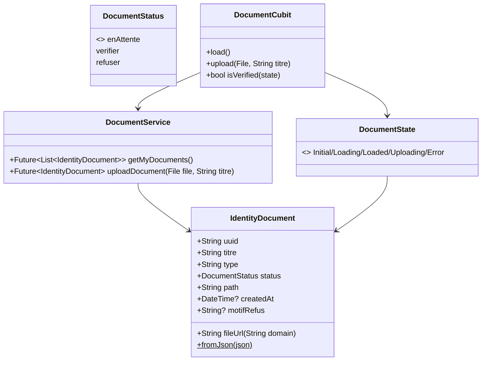
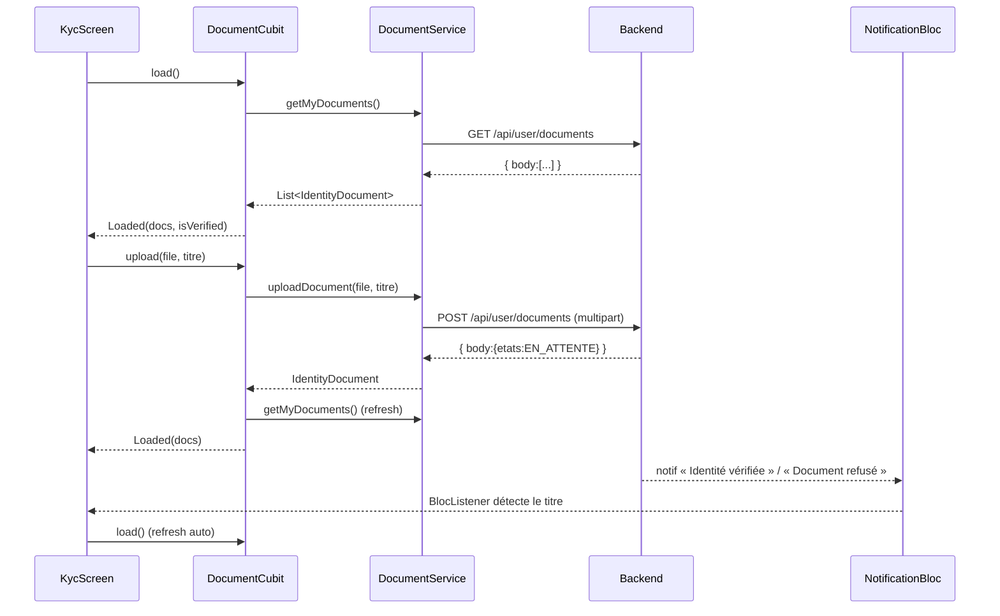

# 🏗️ Architecture — Vérification d'identité (KYC)

> Feature : `verification-identite-kyc`
> Mode : projet existant (Flutter / BLoC / Dio). new_project: false
> Spec source : `business-spec.md`

## 1. Vue d'ensemble

### Objectif
Brancher le KYC mobile : upload d'une photo de pièce + titre, liste « Mes documents » (tous statuts + motif de refus), détection « vérifié » (≥ 1 `VERIFIER`), rafraîchissement au verdict admin via les notifications existantes.

### Couches (réutilisation maximale de l'existant)
| Couche | Rôle | Réutilise |
|--------|------|-----------|
| **Modèle** | `IdentityDocument` (uuid, titre, type, etats, path, createdAt) + enum `DocumentStatus` | `ResponseMapper` |
| **Service** | `DocumentService` : `uploadDocument(file, titre)` (multipart) + `getMyDocuments()` | `DioRequest.postFormData` / `get`, pattern `appartement_service` (FormData.fromMap + MultipartFile.fromFile), `domain` |
| **Cubit** | `DocumentCubit` : charge la liste, calcule `isVerified`, gère upload + erreurs | pattern BLoC projet |
| **UI** | écran KYC + atomes (carte document, badge statut, sélecteur titre, bottom sheet source photo) | `image_picker_util`, `InputField`, `EmptyState`, `badge_tone`, `LoaderCircular`, `AppColors/AppRadii/AppTextStyles` |
| **Intégration** | entrée profil reflète le vrai statut + navigue ; refresh sur notif KYC | `profile_display_info`, `client_profile_screen`, `NotificationBloc` |

## 2. Décisions clés

- **D1 — Statut « vérifié » dérivé** : pas d'endpoint dédié → `DocumentCubit` calcule `isVerified = documents.any((d) => d.status == DocumentStatus.verifier)`.
- **D2 — Upload** : `image_picker` (galerie/caméra) → `File` → `MultipartFile.fromFile(file, filename)` sous la clé **`file`** + champ **`titre`** (String), via `postFormData`. Conforme au contrat backend (un fichier + un titre par appel).
- **D3 — Type fichier v1** : image uniquement (`ImagePickerUtil`). PDF reporté (pas de nouvelle dépendance).
- **D4 — Titre** : liste prédéfinie (CNI, Passeport, Permis de conduire, Carte consulaire) + « Autre » (→ champ libre `InputField`).
- **D5 — Erreurs** : le service relaie le `message` exact du backend (déjà extrait par l'intercepteur Dio/ErrorHandler) ; le cubit le porte dans un état d'erreur affiché à l'UI.
- **D6 — Refresh sur notif** : `client_profile_screen` (ou l'écran KYC) écoute `NotificationBloc` ; sur une notif dont le titre vaut « Identité vérifiée » / « Document refusé », il dispatche `DocumentCubit.load()`. Détection par titre (pas de type dédié côté backend).
- **D7 — URL fichier** : `${domain}/${path}` (statique sans auth) pour la miniature.
- **D8 — Accès** : entrée KYC affichée uniquement pour proprio/démarcheur (déjà le cas dans `profile_display_info`). Le `value` statique « Vérifié » devient dynamique.

## 3. Diagramme de classes (Mermaid)



## 4. Diagramme de séquence (Mermaid)



## 5. Structure des fichiers

```
lib/
├── model/document/
│   ├── identity_document.dart          ← NOUVEAU (modèle + fromJson + fileUrl)
│   └── document_status.dart            ← NOUVEAU (enum + fromBackend + label/tone)
├── service/model/document/
│   └── document_service.dart           ← NOUVEAU (upload multipart + getMyDocuments)
├── bloc/document_cubit/
│   ├── document_cubit.dart             ← NOUVEAU
│   └── document_state.dart             ← NOUVEAU
├── util/calc/
│   └── kyc_status_resolver.dart        ← NOUVEAU (pur: liste docs → statut global, testable)
├── screen/client/shared/profile/kyc/
│   ├── kyc_screen.dart                 ← NOUVEAU (écran principal)
│   └── widget/
│       ├── kyc_status_header.dart       ← NOUVEAU (bandeau statut global)
│       ├── identity_document_card.dart  ← NOUVEAU (1 document : titre + badge + miniature + motif)
│       ├── kyc_document_status_badge.dart ← NOUVEAU (badge EN_ATTENTE/VERIFIER/REFUSER)
│       ├── kyc_upload_sheet.dart        ← NOUVEAU (bottom sheet : titre + source photo)
│       └── kyc_title_selector.dart      ← NOUVEAU (liste titres + « Autre »)
└── main.dart                            ← MODIFIÉ (BlocProvider DocumentCubit)
```

Fichiers modifiés :
- `lib/screen/client/shared/profile/profile_display_info.dart` — entrée « Vérification d'identité » : `value` dynamique + callback `onKyc`.
- `lib/screen/client/shared/profile/client_profile_screen.dart` — wire l'entrée vers `KycScreen`, lit le statut du `DocumentCubit`, écoute `NotificationBloc` pour refresh.
- `lib/screen/client/shared/profile/widget/profile_settings_card.dart` (si besoin pour propager le callback — à vérifier).

## 6. Interfaces / Contrats

```dart
// document_status.dart
enum DocumentStatus { enAttente, verifier, refuser }
extension DocumentStatusX on DocumentStatus {
  static DocumentStatus fromBackend(String? s); // "EN_ATTENTE"/"VERIFIER"/"REFUSER"
  String get label;     // « En attente » / « Vérifié » / « Refusé »
  BadgeTone get tone;   // warning / success / danger
}

// identity_document.dart
class IdentityDocument {
  final String uuid, titre, type, path;
  final DocumentStatus status;
  final DateTime? createdAt;
  final String? motifRefus; // si présent dans la réponse
  factory IdentityDocument.fromJson(Map<String,dynamic>);
  String fileUrl(String domain) => '$domain/$path';
  bool get isImage => type.toUpperCase() == 'IMAGE';
}

// document_service.dart
class DocumentService {
  Future<List<IdentityDocument>> getMyDocuments();
  Future<IdentityDocument> uploadDocument({required File file, required String titre});
}

// kyc_status_resolver.dart  (pur, testable)
enum KycGlobalStatus { none, pending, verified } // aucun / en attente / vérifié
class KycStatusResolver {
  static KycGlobalStatus resolve(List<IdentityDocument> docs);
  static bool isVerified(List<IdentityDocument> docs);
}

// document_state.dart
sealed: DocumentInitial | DocumentLoading | DocumentLoaded(docs) |
        DocumentUploading(docs) | DocumentError(message, docs)

// document_cubit.dart
class DocumentCubit extends Cubit<DocumentState> {
  Future<void> load();
  Future<void> upload(File file, String titre);
}
```

---

## CONTRAT D'IMPLÉMENTATION

### Modèles / Helpers
- [ ] `lib/model/document/document_status.dart` → enum `DocumentStatus` + extension `fromBackend` / `label` / `tone` (BadgeTone).
- [ ] `lib/model/document/identity_document.dart` → modèle + `fromJson` (champs uuid, titre, type, etats→status, path, createdAt, motif si présent) + `fileUrl(domain)` + `isImage`.
- [ ] `lib/util/calc/kyc_status_resolver.dart` → pur : `resolve(List)` → KycGlobalStatus, `isVerified(List)`.

### Services
- [ ] `lib/service/model/document/document_service.dart` → `getMyDocuments()` (GET `/api/user/documents`, map enveloppe body[]) + `uploadDocument(file, titre)` (POST multipart `file`+`titre` via `postFormData`, relaie message d'erreur backend).

### BLoC / Cubit
- [ ] `lib/bloc/document_cubit/document_state.dart` → états Initial/Loading/Loaded/Uploading/Error (conservent la dernière liste connue).
- [ ] `lib/bloc/document_cubit/document_cubit.dart` → `load()` / `upload()` (upload → reload), expose statut global.

### UI
- [ ] `lib/screen/client/shared/profile/kyc/kyc_screen.dart` → écran : header statut global + liste documents (historique complet) + bouton « Envoyer une pièce » / « Renvoyer ». BlocListener refresh sur notif KYC. États loading/empty/error.
- [ ] `widget/kyc_status_header.dart` → bandeau « Vérifié / En attente / Non vérifié » (couleur selon statut).
- [ ] `widget/identity_document_card.dart` → 1 document : miniature (image via fileUrl), titre, date, badge statut, motif si REFUSER.
- [ ] `widget/kyc_document_status_badge.dart` → badge réutilisant `badge_tone`.
- [ ] `widget/kyc_upload_sheet.dart` → bottom sheet : sélection titre + source (galerie/caméra) + envoi.
- [ ] `widget/kyc_title_selector.dart` → liste prédéfinie + « Autre » (champ libre).

### Fichiers à modifier
- [ ] `lib/main.dart` → `BlocProvider(create: (_) => DocumentCubit())` dans le MultiProvider.
- [ ] `lib/screen/client/shared/profile/profile_display_info.dart` → entrée KYC : value dynamique (passée par l'écran) + nouveau callback `onKyc` dans `ProfileSettingsCallbacks`.
- [ ] `lib/screen/client/shared/profile/client_profile_screen.dart` → brancher `onKyc` → `KycScreen`, refléter le statut réel dans la value, écouter `NotificationBloc` pour refresh.

### Tests
- [ ] `test/util/calc/kyc_status_resolver_test.dart` → none (liste vide) / pending (que des EN_ATTENTE+REFUSER) / verified (≥1 VERIFIER) ; isVerified.
- [ ] `test/model/document/identity_document_test.dart` → fromJson (mapping etats→status, type, fileUrl), statut inconnu → fallback.

## 7. Hors périmètre v1
- PDF (file_picker), endpoints admin, ré-édition d'un document refusé, cache Hive des documents.

---

UI_REQUIRED: true
